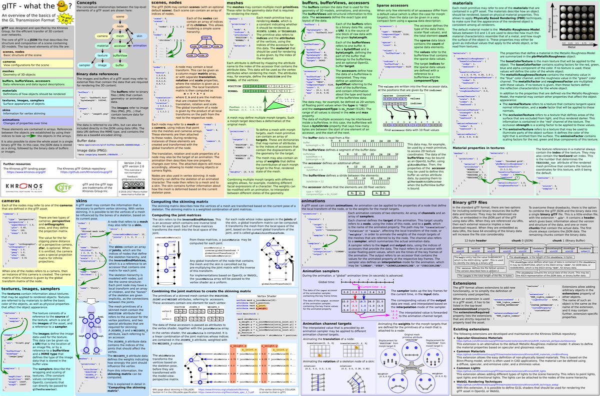

glTF™ (GL Transmission Format) is a royalty-free specification for the efficient transmission and loading of 3D scenes and models by applications. glTF minimizes both the size of 3D assets, and the runtime processing needed to unpack and use those assets. glTF defines an extensible, common publishing format for 3D content tools and services that streamlines authoring workflows and enables interoperable use of content across the industry.

## Specification

* [glTF Specification, 2.0](specification/2.0/README.md) (or [all specification versions](specification/README.md))
* [glTF Extension Registry](extensions/README.md)

Please provide spec feedback and community updates by submitting [issues](https://github.com/KhronosGroup/glTF/issues).  For quick questions, use [gitter](https://gitter.im/KhronosGroup/glTF).

## Quickstart

### Overview

  From <a href=https://github.com/javagl/gltfOverview/>github.com/javagl/gltfOverview/</a> 
<a href=https://github.com/randall2835/gltfOverviewJapanese/releases/download/v0.1/gltfOverview2.0-Japanese.png>Japanese translation</a> by <a href=https://github.com/randall2835/gltfOverviewJapanese>Takuto Takahashi</a>

## Subset of Contents

* [glTF Tool Highlights](#gltf-tools-highlights)
  *  [Artists](#artists)
  * [Developers](#developers)
  * [General](#general) 
* [Stack Overflow](#stack-overflow)
* [Presentations and Articles](#presentations-and-articles)
  * [Intros](#intros)
  * [Tutorials](#tutorials)
  * [All Presentations and Articles](#all-presentations-and-articles)

## glTF Tool Highlights

### Artists
| Tool | Status | Description |
|------|--------|-------------|
| [Blender Importer](https://github.com/ksons/gltf-blender-importer) |  | Blender importer for glTF 2.0 (alpha) |
### Developers
| Tool | Status | Description |
|------|--------|-------------|
| [Tiny glTF loader](https://github.com/syoyo/tinygltf) |   | Header only C++ glTF parsing library, with [Alembic→glTF](https://github.com/syoyo/tinygltfloader/tree/master/examples/alembic_to_gltf) and [CyHair->glTF](https://github.com/syoyo/tinygltfloader/tree/master/examples/cyhair_to_gltf) converters |

### General
| Tool | Input | Output | Description |
|------|-------|--------|-------------|
| [Khronos Group Blender Exporter](https://github.com/KhronosGroup/glTF-Blender-Exporter) | — |  | Official exporter for Blender |
| [COLLADA2GLTF](https://github.com/KhronosGroup/COLLADA2GLTF/) | `COLLADA` |  | Official command-line converter, with updates for glTF 2.0 in progress |
| [glTF Validator](https://github.com/KhronosGroup/glTF-Validator) |  | Official command-line and drag-and-top tool to validate glTF assets against the specification |
| [BabylonJS Sandbox](https://www.babylonjs.com/sandbox/) |  | Drag-and-drop online viewer for model preview and debugging, using BabylonJS |
| [three.js](https://threejs.org/) ([loader](https://threejs.org/docs/index.html#examples/loaders/GLTFLoader)) |  | All | [`<gltf-model/>` component](https://github.com/mrdoob/model-tag) |

## Stack Overflow

* [glTF tagged](http://stackoverflow.com/questions/tagged/gltf) questions

## Presentations and Articles

### Intros

* [glTF 2.0 Launch](https://www.khronos.org/assets/uploads/developers/library/2017-web3d/glTF-2.0-Launch_Jun17.pdf) by Neil Trevett. June 2017
* **glTF Webinar** ([video](https://www.youtube.com/watch?v=KALedPvtFHY), [slides](https://www.khronos.org/assets/uploads/developers/library/2017-glTF-webinar/glTF-Webinar_Feb17.pdf)) by Marco Hutter. February 2017
* [glTF Brief](https://docs.google.com/presentation/d/1BRdEGqJFIWk3QOehOxJqM9dIE4kIBNQhIm7UeBaVse0/edit#slide=id.g185e245559_2_28) by Tony Parisi, FormVR and Amanda Watson, Oculus. October 2016

### Tutorials

* [glTF Tutorials](https://github.com/KhronosGroup/glTF-Tutorials)
* [Physically-Based Rendering: From Theory to glTF](https://github.com/moneimne/glTF-Tutorials/tree/master/PBR)

### All Presentations and Articles

* [Sketchfab uses glTF to bring a search bar to the world of 3D](https://www.khronos.org/blog/sketchfab-uses-gltf-to-bring-a-search-bar-to-the-world-of-3d). May 2018
* [Draco Compressed Meshes with glTF and 3D Tiles](https://cesium.com/blog/2018/04/09/draco-compression/) by Gabby Getz. April 2018
* [glTF Momentum Accelerates with New Support from Facebook, Epic, Unity, and Adobe](https://www.khronos.org/blog/gltf-momentum-new-support-facebook-epic-unity-adobe) by Khronos. April 2018
* [GDC 2018 Khronos Developer Days - WebGL & glTF video](https://www.youtube.com/watch?v=OnsqdYSMq38). March 2018
* [glTF Ecosystem Update, GTC](https://www.khronos.org/assets/uploads/developers/library/2018-gtc/glTF-Ecosystem-GTC-WebGL-Meetup_Mar18.pdf) by Neil Trevett. March 2018
* [glTF Ecosystem Update, GDC](https://www.khronos.org/assets/uploads/developers/library/2018-gdc-webgl-and-gltf/glTF-GDC_Mar18.pdf) by Patrick Cozzi. March 2018
* [Adobe Dimension & glTF](https://www.khronos.org/assets/uploads/developers/library/2018-gdc-webgl-and-gltf/glTF-Adobe-Dimension-GDC_Mar18.pdf) by Mike Bond. March 2018
* [Draco 3D Compression Extension to glTF 2.0](https://www.khronos.org/assets/uploads/developers/library/2018-gdc-webgl-and-gltf/glTF-Draco-GDC_Mar18.pdf) by Frank Galligan. March 2018
* [Mixed Reality with glTF](https://www.khronos.org/assets/uploads/developers/library/2018-gdc-webgl-and-gltf/glTF-Microsoft-GDC_Mar18.pdf) by Tom Mignone. March 2018
* [glTF Texture Transmission Extension](https://www.khronos.org/assets/uploads/developers/library/2018-gdc-webgl-and-gltf/glTF-Texture-Transmission-GDC_Mar18.pdf) by David Wilkinson. March 2018
* [glTF in Unreal Engine](https://www.khronos.org/assets/uploads/developers/library/2018-gdc-webgl-and-gltf/glTF-Unreal-GDC_Mar18.pdf) by Mike Erwin. March 2018
* [glTF Asset Generator Deep Dive](https://www.khronos.org/assets/uploads/developers/library/2018-gdc-webgl-and-gltf/glTF-Asset-Generator-Deep-Dive-GDC_Mar18.pdf) by Gary Hsu. March 2018
* [GLB Tutorials](https://developers.facebook.com/docs/sharing/3d-posts/glb-tutorials) (exporting from Modo, Substance Painter, Maya, and others) by Facebook. February 2018
* [Convert FBX format to glTF format on Blender and animate it with Three.js](https://ryo620.org/blog/2018/02/to-gltf-from-fbx-by-blender/) (Japanese) by Ryosuke Sakaki. February 2018
* [Art Pipeline for glTF](https://www.khronos.org/blog/art-pipeline-for-gltf) by Patrick Ryan. January 2018
* [Call for Participation: glTF Creating a Compressed Texture Extension](https://www.khronos.org/blog/call-for-participation-gltf-creating-a-compressed-texture-extension) by Khronos. December 2017
* [Using glTF Models with A-Frame](https://blog.mozvr.com/using-gltf-models-with-a-frame/) by Josh Marinacci. December 2017
* [Creating animated glTF Characters with Mixamo and Blender](https://medium.com/@donmccurdy/creating-animated-gltf-characters-with-mixamo-and-blender-728dc120e678) by Don McCurdy. November 2017
* [glTF - Seattle Khronos Group Meetup](https://drive.google.com/drive/folders/0BybLPh8Iz_rebnVtbUxLVUswZVE) by Saurabh Bhatia. September 2017
* [State of glTF 2.0 for WebVR Devs](https://gist.github.com/donmccurdy/de7ff6c44ecd76fddf1ecad170a114a8) by Don McCurdy, Google. September 2017
* [glTF Exporter in three.js and A-Frame](https://blog.mozvr.com/gltf-exporter-in-three-js-and-a-frame/) by Fernando Serrano. August 2017
* SIGGRAPH 2017 glTF BOF [video](https://www.youtube.com/watch?v=UMN6rh-5nPg). August 2017
   * glTF 2.0 and Community Update: Tony Parisi, Unity, and Patrick Cozzi, Cesium
   * Microsoft update - Paint 3D, View 3D, 3D in Office and one more thing…: Saurabh Bhatia and Gary Hsu, Microsoft
   * glTF VSCode editor: Ed Mackey, AGI
   * Autodesk Forge and glTF: Nop Jiarathanakul, Autodesk
   * Three.js and A-Frame update: Don McCurdy, Google and Ricardo Cabello, Google
   * Introduction to geometry compression on the web with Draco: Michael Hemmer and Jamieson Brettle, Google
   * WebGL PBR reference implementation: Scott Nagy, Microsoft, and Mohamad Moneimne, Cesium
   * Sketchfab update: Aurelien Chatelain, Sketchfab
   * [glTF 2.0 Export in InstantUV](http://max-limper.de/publications/GLTF2017/GLTF2017.pdf): Max Limper, Fraunhofer
* [Physically-Based Rendering in Cesium](https://cesium.com/blog/2017/08/08/Physically-Based-Rendering-in-Cesium/) by Mohamad Moneimne. August 2017
* [Why we should all support glTF 2.0 as THE standard asset exchange format for game engines](https://godotengine.org/article/we-should-all-use-gltf-20-export-3d-assets-game-engines) by Juan Linietsky. August 2017
* [Exporting glTF 2.0 from Maya LT](https://www.donmccurdy.com/2017/06/27/exporting-gltf-2-0-from-maya-lt-2/) by Don McCurdy. June 2017
* [glTF 2.0: PBR Materials](https://www.khronos.org/assets/uploads/developers/library/2017-gtc/glTF-2.0-and-PBR-GTC_May17.pdf) by Saurabh Bhatia. May 2017
* [glTF Workflow for a Saturday Night](https://blog.mozvr.com/a-saturday-night-gltf-workflow/) by Diego F. Goberna. April 2017
* [2017 GDC WebGL/WebVR/glTF Meetup](https://www.khronos.org/developers/library/2017-gdc-webgl-webvr-gltf-meetup) YouTube recording. March 2017
* [Reach the Largest Gaming Platform of All: The Web. WebGL, WebVR and glTF](https://www.youtube.com/watch?v=jLNtjujPhzY). March 2017
* [PBR-ready glTF in instant3Dhub / instantUV](http://max-limper.de/publications/PBR2017/PBR2017.pdf) by Max Limper. March 2017
* [Call for feedback on glTF 2.0](https://www.khronos.org/blog/call-for-feedback-on-gltf-2.0) by Neil Trevett. February 2017
* [Improve expressiveness of WebGL with the topic 3D file format glTF now! (in Japanese)](http://qiita.com/emadurandal/items/1a034c4addd7ff8b5184) by Yuki Shimada(@emadurandal), WebGL advent calendar 2016 at Qiita. December 2016
* [A new 3D horizon: glTF import and export with Archilogic](https://spaces.archilogic.com/blog/gltf-import-export) by Martin Splitt. December 2016
* [Bringing 3D to everyone through open standards](https://blogs.windows.com/buildingapps/2016/10/28/bringing-3d-to-everyone-through-open-standards/) by Forest W. Gouin and Jean Paoli. October 2016
* [Using Quantization with 3D Models](http://cesiumjs.org/2016/08/08/Cesium-web3d-quantized-attributes/) by Rob Taglang. August 2016
* [glTF and Mobile VR: Inclusive standards for a 3D world](https://www.khronos.org/assets/uploads/developers/library/2016-siggraph/glTF-MobileVR-Oculus-BOF-Update-SIGGRAPH_Jul16.pdf). Amanda Watson, Oculus, WebGL + glTF BOF. July 2016
* [glTF Update and Roadmap](https://www.khronos.org/assets/uploads/developers/library/2016-siggraph/glTF-BOF-Update-SIGGRAPH_Jul16.pdf). Tony Parisi, WebGL + glTF BOF. July 2016
* [PBR in glTF: Current State](https://www.khronos.org/webgl/wiki_1_15/images/2016-07-28_WebGL_BOF_PBR.pdf). Max Limper, Johannes Behr, and Timo Sturm, WebGL + glTF BOF. July 2016
* [glTF: The Runtime Asset Format for GL-based Applications](https://www.khronos.org/assets/uploads/developers/library/2016-siggraph/glTF-Background-Briefing_Jul16.pdf). July 2016
* [glTF working group updates](https://www.khronos.org/assets/uploads/developers/library/2016-gdc/glTF-GDC_Mar16.pdf) ([slides](https://www.khronos.org/assets/uploads/developers/library/2016-gdc/glTF-GDC_Mar16.pdf), [video](https://www.youtube.com/watch?v=qAjWiVfR5Nw&t=43m40s)). Patrick Cozzi and Tony Parisi, WebGL + glTF BOF. March 2016
* [FBX to/from glTF](https://www.khronos.org/assets/uploads/developers/library/2016-gdc/Autodesk-FBX-glTF-WebGL_Mar16.pdf) ([slides](https://www.khronos.org/assets/uploads/developers/library/2016-gdc/Autodesk-FBX-glTF-WebGL_Mar16.pdf), [video](https://www.youtube.com/watch?v=qAjWiVfR5Nw&t=59m08s)). Cyrille Fauvel, WebGL + glTF BOF. March 2016
* [Khronos Group glTF Webinar](https://www.youtube.com/watch?v=YXPeh2hy6Tc). Neil Trevett, Virtual AR Community meeting. October 2015
* [An Introduction to glTF 1.0](https://www.khronos.org/assets/uploads/developers/library/overview/glTF-1.0-Introduction-Oct15.pdf). October 2015
* [The state of WebGL and glTF](https://www.khronos.org/assets/uploads/developers/library/2015-graphical-web/WebGL-and-glTF-Graphical-Web_Sep15.pdf). Patrick Cozzi, The Graphical Web. September 2015
* [glTF ecosystem and mesh compression update](https://www.khronos.org/webgl/wiki_1_15/images/GlTF_Update_SIGGRAPH_Aug15.pdf). Khronos 3D Formats Working Group, SIGGRAPH 2015. August 2015
* [glTF and the WebGL Art Pipeline](http://www.slideshare.net/auradeluxe/gltf-and-the-webgl-art-pipeline-march-2015). Tony Parisi, WebGL Meetup. March 2015
* [Writing an FBX importer / Exporter plug-in](http://around-the-corner.typepad.com/adn/2015/01/writing-an-fbx-importer-exporter-plug-in.html). Cyrille Fauvel. January 2015
* [glTF Tips for Artists](http://cesiumjs.org/2014/12/15/glTF-Tips-for-Artists/). Branden Coker. December 2014
* [3D for the Modern Web: Declarative 3D and glTF](http://mason.gmu.edu/~bcoughl2/cs752/). Brian Coughlin. Summer 2014
* [glTF: Designing an Open-Standard Runtime Asset Format](https://books.google.com/books?id=uIDSBQAAQBAJ&pg=PA375&lpg=PA375&dq=%22Designing+an+Open-Standard+Runtime+Asset+Format%22&source=bl&ots=XLLQ_9piKe&sig=rwLmjPbxN3p5LMYBzf-LGoAJtgs&hl=en&sa=X&ved=0CCkQ6AEwAmoVChMI5bTKlJ3MyAIVBqMeCh012ggk). Fabrice Robinet et al, GPU Pro 5. May 2014
* [Building a WebGL Santa with Cesium and glTF](http://cesiumjs.org/2013/12/23/Building-A-WebGL-Santa-with-Cesium-and-glTF/). Patrick Cozzi. December 2013
* [glTF update](http://www.slideshare.net/auradeluxe/gltf-update-with-tony-parisi). Tony Parisi. August 2013
* [How I got involved in glTF and Khronos](http://blog.virtualglobebook.com/2013/03/how-i-got-involved-in-gltf-and-khronos.html). Patrick Cozzi, WebGL Meetup. March 2013

---

We believe the true usefulness of glTF goes beyond the spec itself; it is an ecosystem of tools, documentation, and extensions contributed by the community.  You are encouraged to [get involved](https://github.com/KhronosGroup/glTF/issues/456)!
