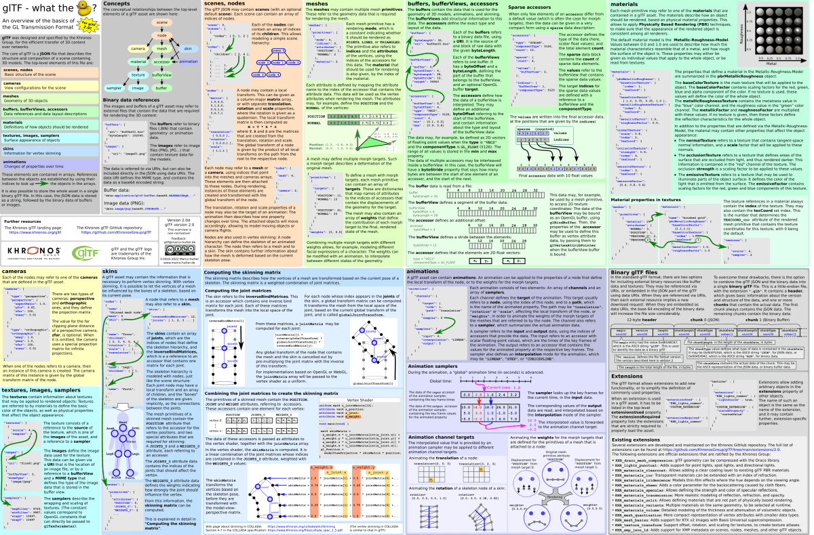

<!--
Copyright 2014-2021 The Khronos Group Inc.
SPDX-License-Identifier: CC-BY-4.0
-->

glTF™ (GL Transmission Format) is a royalty-free specification for the efficient transmission and loading of 3D scenes and models by applications. glTF minimizes both the size of 3D assets, and the runtime processing needed to unpack and use those assets. glTF defines an extensible, common publishing format for 3D content tools and services that streamlines authoring workflows and enables interoperable use of content across the industry.

## Specification

**NOTE** as of September 23, 2021, the glTF 2.0 Specification has been moved to AsciiDoc markup format.

* [glTF Specification, 2.0](https://www.khronos.org/registry/glTF/) (or [all specification versions](https://github.com/KhronosGroup/glTF/blob/main/specification/README.md))
* [glTF Extension Registry](https://github.com/KhronosGroup/glTF/blob/main/extensions/README.md)

Please provide spec feedback by submitting [issues](https://github.com/KhronosGroup/glTF/issues). For technical or art workflow questions, or to showcase your work, [join the glTF forum](https://community.khronos.org/c/gltf-general). For quick questions, use the `#gltf` channel in the Khronos Group [Slack](https://www.khr.io/slack).

## Quickstart

### Overview

  
    From <a href=https://github.com/javagl/gltfOverview/>github.com/javagl/gltfOverview/</a> |
    <a href="https://www.khronos.org/files/gltf20-reference-guide.pdf">PDF</a> |
    <a href="https://www.lulu.com/shop/khronos-group/gltf-20-quick-reference/paperback/product-23977667.html">hardcopy</a> |
    <a href="https://www.khronos.org/developers/reference-cards/">Khronos reference cards</a>
   
  
    <a href=https://github.com/randall2835/gltfOverviewJapanese/releases/tag/v0.1>Japanese translation</a> |
    <a href=https://github.com/randall2835/gltfOverviewJapanese/releases/download/v0.1/gltfOverview2.0-Japanese.pdf>PDF</a> |
    by <a href=https://github.com/randall2835/gltfOverviewJapanese>Takuto Takahashi</a> 
    <a href=https://github.com/leeyeel/gltfOverview-Chinese/releases/tag/v2.0.0d>Chinese translation</a> |
    <a href=https://github.com/leeyeel/gltfOverview-Chinese/releases/download/v2.0.0d/gltfOverview2.0-cn.pdf>PDF</a> |
    by <a href=https://github.com/leeyeel/gltfOverview-Chinese>@leeyeel</a> 
  

### For developers

* [Sample models](https://github.com/KhronosGroup/glTF-Sample-Models) for testing runtime engines and content pipeline tools.
   * [glTF-Asset-Generator](https://github.com/bghgary/glTF-Asset-Generator) provides assets for robust importer validation.
   * [100,000+ models](https://sketchfab.com/models?features=downloadable&sort_by=-likeCount) under Creative Commons license on Sketchfab (check license for individual models).
* [Drag-and-drop validator](http://github.khronos.org/glTF-Validator/) for verifying correctness of existing glTF files.
* [glTF Tutorial Series](https://github.com/KhronosGroup/glTF-Tutorials/blob/master/gltfTutorial/README.md)
* [Khronos glTF Sample Viewer](http://github.khronos.org/glTF-Sample-Viewer/) with WebGL PBR shaders. ([source code](https://github.com/KhronosGroup/glTF-Sample-Viewer))

### For artists

- [Blender importer/exporter](https://github.com/KhronosGroup/glTF-Blender-IO)
- [3DS Max exporter](http://doc.babylonjs.com/resources/3dsmax_to_gltf)
- [Maya exporter](https://github.com/WonderMediaProductions/Maya2glTF)
- [Other converters and exporters](#converters-importers-and-exporters)

### Preview tools

  - [Sketchfab](https://sketchfab.com/)
  - [PlayCanvas Viewer](https://playcanvas.com/viewer)
  - [BabylonJS Sandbox](https://www.babylonjs.com/sandbox/)
  - [Drag-and-drop viewer](https://gltf-viewer.donmccurdy.com/)
  - [glTF VSCode Extension](https://marketplace.visualstudio.com/items?itemName=cesium.gltf-vscode) 3D previews, glTF validation, conversion to/from GLB

## Contents

- [glTF Tools](#gltf-tools)
    - [Resources](#resources)
- [Formats Built on glTF](#formats-built-on-gltf)
- [Stack Overflow](#stack-overflow)
- [Presentations and Articles](#presentations-and-articles)
    - [Intros](#intros)
    - [Tutorials](#tutorials)
    - [All Presentations and Articles](#all-presentations-and-articles)

<!-- These are added here to keep existing links intact  -->

## glTF Tools

Tools, applications and libraries for working with glTF can be found in the [glTF Project Explorer](http://github.khronos.org/glTF-Project-Explorer/).

### Resources

* [glTF-Generator-Registry](https://github.com/KhronosGroup/glTF-Generator-Registry/) - An open registry of tools that create glTF assets, along with structured metadata such as links to documentation and bug trackers.

## Formats Built on glTF

* [3D Tiles](https://github.com/CesiumGS/3d-tiles) - An open standard for streaming and rendering massive heterogenous 3D content.
* [VRM](https://vrm.dev/) - A 3D avatar format for VR applications.

## Stack Overflow

* [glTF tagged](http://stackoverflow.com/questions/tagged/gltf) questions

## Presentations and Articles

### Intros

* [glTF 2.0 Launch](https://www.khronos.org/assets/uploads/developers/library/2017-web3d/glTF-2.0-Launch_Jun17.pdf) by Neil Trevett. June 2017
* **glTF Webinar** ([video](https://www.youtube.com/watch?v=KALedPvtFHY), [slides](https://www.khronos.org/assets/uploads/developers/library/2017-glTF-webinar/glTF-Webinar_Feb17.pdf)) by Marco Hutter. February 2017
* [glTF Brief](https://docs.google.com/presentation/d/1BRdEGqJFIWk3QOehOxJqM9dIE4kIBNQhIm7UeBaVse0/edit#slide=id.g185e245559_2_28) by Tony Parisi, FormVR and Amanda Watson, Oculus. October 2016

### Tutorials

* [glTF Tutorials](https://github.com/KhronosGroup/glTF-Tutorials)
* [Physically-Based Rendering: From Theory to glTF](https://github.com/moneimne/glTF-Tutorials/tree/master/PBR)

### All Presentations and Articles

* [Streamlining 3D Commerce with Material Variant Support in glTF Assets](https://www.khronos.org/blog/streamlining-3d-commerce-with-material-variant-support-in-gltf-assets) by Daniel Beauchamp and Stephan Leroux at Shopify on behalf the 3D Commerce Working Group. November 2020
* [Live glTF Asset Editing in Your Browser—Even in AR](https://www.khronos.org/blog/live-gltf-asset-editing-in-your-browsereven-in-ar) by Emmett Lalish. August 2020
* [View a glTF model in AR on Android without leaving your browser](https://www.khronos.org/blog/view-a-gltf-model-in-ar-on-android-without-leaving-your-browser) by Emmett Lalish.  May 2020
* [The glTF Model Authoring Pipeline](https://www.youtube.com/playlist?list=PLvdhJ__UbhZ6mst0xgd_S3oSmdRcEiKCp) video series on authoring glTF models in Blender, by Ed Mackey and Alex Wood.  April 2020
* [glTF Ecosystem Forum during SIGGRAPH](https://www.khronos.org/assets/uploads/developers/library/2019-siggraph/glTF-Ecosystem-Forum-SIGGRAPH_Aug19.pdf).  July 2019
* [SIGGRAPH 2019 glTF BOF Video](https://youtu.be/_MOp_SfGJx8) and [slides](https://www.khronos.org/developers/library/2019-siggraph)
   * Khronos: Ed Mackey - glTF Overview
   * Facebook: Renee Rashid - Spark AR, glTF at Facebook
   * Cesium: Omar Shehata - 3D Tiles, Basis Universal
   * DGG: Max Limper - Automating the 3D Processing Pipeline
   * Uber: Georgios Karnas - glTF in Big Data Visualization
   * UX3D: Fabian Wahlster and Moritz Becher - glTF Editor and Tools
   * Esri: David Körner - glTF with Esri JS API
   * Sketchfab: Alban Denoyel - Publish & Find 3D Models Online
   * Google: Adrian Perez - AR Search at Google
   * Wayfair: Shrenik Sadalgi - Khronos 3D Commerce Working Group introduction
* [How to make a PBR 3D model for the web](https://unboring.net/workflows/how-to-make-pbr-web/) by Arturo Paracuellos. June 2019
* [Uber’s vis.gl brings glTF to geospatial data visualization](https://www.khronos.org/blog/ubers-vis.gl-brings-gltf-to-geospatial-data-visualization) by Georgios Karnas, Ib Green, Travis Gorkin, and Xintong Xia. June 2019
* [Exporting glTF from Animate](https://theblog.adobe.com/exporting-gltf-from-animate/) by Ram Kulkarni. April 2019
* [glTF: Everything You Need to Know!](https://www.threekit.com/blog/gltf-everything-you-need-to-know) by Ben Houston. April 2019
* [GDC 2019 Khronos Developer Days - WebGL & glTF video](https://youtu.be/mCJoBGOCTwk?t=868). March 2019 ([slides](https://www.khronos.org/developers/library/2019-gdc))
   * Khronos: Patrick Cozzi - Overview
   * Microsoft: Saurabh Bhatia - Ecosystem and SDK Update
   * Google: Chris Joel - `<model-viewer>` Fidelity Testing
   * Adobe: Mike Bond - Adobe Dimension
   * Mozilla: Robert Long - Publishing Virtual Worlds with glTF
   * Facebook: Susie Su - An On-Demand, Optimizing glTF Backend
* [glTF Debugging in Visual Studio Code](https://medium.com/@babylonjs/gltf-debugging-in-visual-studio-code-a89805bda3cd) by Gary Hsu. January 2019
* [SIGGRAPH Asia glTF Overview and CTTF Update](https://www.khronos.org/developers/library/2018-siggraph-asia) by Khronos. December 2018
* [droidcon SF 2018 - The JPEG of 3D: Bringing 3D scenes and objects into your 2D Android app with glTF](https://www.youtube.com/watch?v=EGSR8qrpEq4) by Pierre LaFayette. November 2018
* [Using the Babylon.js viewer with WebVR and Windows Mixed Reality home](https://medium.com/@babylonjs/using-the-babylon-js-viewer-with-webvr-and-windows-mixed-reality-home-fd1e6af46137) by Saurabh Bhatia. November 2018
* [Behind the Scenes with Adobe Dimension Engineers: How We Built the 3D Publish Feature](https://theblog.adobe.com/behind-the-scenes-with-adobe-dimension-engineers-how-we-built-the-3d-publish-feature/) by Mike Bond. November 2018
* [OGC and Khronos Form a Liaison to Improve Interoperability within the Geospatial and 3D Graphics Communities](https://www.khronos.org/news/press/ogc-and-khronos-form-a-liaison-to-improve-interoperability-within-the-geospatial-and-3d-graphics-communities). October 2018
* [If you build it (together), they will come...Mozilla and the Khronos Group collaborate to bring glTF capabilities to Blender](https://medium.com/mozilla-open-innovation/gltf-import-export-tool-ca0932b0ce76) by Rosana Ardila. October 2018
* [glTF and Construction – Part 1: Secrets of the Cloud](https://constructingdata.wordpress.com/2018/09/07/gltf-and-construction-part-1-secrets-of-the-cloud/) by Tim Davies. September 2018
* [glTF and Construction – Part 2: 3D for Everyone](https://constructingdata.wordpress.com/2018/09/08/gltf-and-construction-part-2-3d-for-everyone/) by Tim Davies. September 2018
* SIGGRAPH 2018 glTF BOF [video](https://youtu.be/FCAM-3aAzXg?t=3472) and [materials](https://www.khronos.org/developers/library/2018-siggraph). August 2018
   * Ecosystem update: Patrick Cozzi, Cesium
   * glTF for artists: Patrick Ryan, Microsoft
   * TurboSquid: Beau Perschall
   * Facebook: Pär Winzell
   * Microsoft: Gary Hsu and Cedric Caillaud
   * STK: Alex Wood, AGI
   * VSCode: Ed Mackey, AGI
   * Industrial AR with glTF: Johannes Beh, Fraunhofer
   * Google Draco: Jamieson Brettle
   * Texture transmission: Mark Callow
   * IKEA: Martin Enthed
* [glTF 2.0 – Status and Outlook](https://www.khronos.org/developers/library/2018-webinar-gltf-2) by Norbert Nopper. July 2018
* [TurboSquid adds glTF to supported formats for its StemCell initiative](https://www.khronos.org/blog/turbosquid-adds-gltf-to-supported-formats-for-its-stemcell-initiative). July 2018
* [Why glTF 2.0 is awesome!](https://dev.to/ybalrid/why-gltf-20-is-awesome-2khp) by Arthur Brainville. July 2018
* [Get your glTF on with WebGL/WebVR at Microsoft - June 2018](https://www.khronos.org/events/get-your-gltf-on-with-webgl-webvr-at-microsoft)
  * [Meetup video](https://youtu.be/GuA1mYG0-xE?t=1s)
  * [Ecosystem update](https://youtu.be/GuA1mYG0-xE?t=47s) by Saurabh Bhatia [(slides)](https://www.khronos.org/assets/uploads/developers/library/2018-gltf-meetup/glTF-Meetup-Ecosystem-Update_June18.pdf)
  * [3D product displays on the web using glTF](https://youtu.be/GuA1mYG0-xE?t=20m34s) by Matthew Cedeno and Gary Hsu
  * [Publishing Virtual Worlds with glTF](https://youtu.be/GuA1mYG0-xE?t=38m6s) by Robert Long [(slides)](https://www.khronos.org/assets/uploads/developers/library/2018-gltf-meetup/glTF-Meetup-Publishing-Virtual-Worlds-with-glTF_Jun18.pdf)
  * [Compressed Texture Transmission Format](https://youtu.be/GuA1mYG0-xE?t=1h21s) by Mark Callow [(slides)](https://www.khronos.org/assets/uploads/developers/library/2018-gltf-meetup/glTF-Meetup-CTTF_Jun18.pdf)
  * [What's new with Draco 3D compression](https://youtu.be/GuA1mYG0-xE?t=1h21m2s) by Frank Galligan [(slides)](https://www.khronos.org/assets/uploads/developers/library/2018-gltf-meetup/glTF-Meetup-Draco_Jun18.pdf)
  * [glTF at Adobe](https://youtu.be/GuA1mYG0-xE?t=1h34m50s) by Mike Bond
* [Building the Metaverse One Standard at a Time](https://www.khronos.org/assets/uploads/developers/library/2018-web3d/Web3D-Keynote-Poznan-2D_Jun18.pdf) by Neil Trevett. Web3D. June 2018
* [Sketchfab uses glTF to bring a search bar to the world of 3D](https://www.khronos.org/blog/sketchfab-uses-gltf-to-bring-a-search-bar-to-the-world-of-3d). May 2018
* [Draco Compressed Meshes with glTF and 3D Tiles](https://cesium.com/blog/2018/04/09/draco-compression/) by Gabby Getz. April 2018
* [glTF Momentum Accelerates with New Support from Facebook, Epic, Unity, and Adobe](https://www.khronos.org/blog/gltf-momentum-new-support-facebook-epic-unity-adobe) by Khronos. April 2018
* [GDC 2018 Khronos Developer Days - WebGL & glTF video](https://www.youtube.com/watch?v=OnsqdYSMq38). March 2018
* [glTF Ecosystem Update, GTC](https://www.khronos.org/assets/uploads/developers/library/2018-gtc/glTF-Ecosystem-GTC-WebGL-Meetup_Mar18.pdf) by Neil Trevett. March 2018
* [glTF Ecosystem Update, GDC](https://www.khronos.org/assets/uploads/developers/library/2018-gdc-webgl-and-gltf/glTF-GDC_Mar18.pdf) by Patrick Cozzi. March 2018
* [Adobe Dimension & glTF](https://www.khronos.org/assets/uploads/developers/library/2018-gdc-webgl-and-gltf/glTF-Adobe-Dimension-GDC_Mar18.pdf) by Mike Bond. March 2018
* [Draco 3D Compression Extension to glTF 2.0](https://www.khronos.org/assets/uploads/developers/library/2018-gdc-webgl-and-gltf/glTF-Draco-GDC_Mar18.pdf) by Frank Galligan. March 2018
* [Mixed Reality with glTF](https://www.khronos.org/assets/uploads/developers/library/2018-gdc-webgl-and-gltf/glTF-Microsoft-GDC_Mar18.pdf) by Tom Mignone. March 2018
* [glTF Texture Transmission Extension](https://www.khronos.org/assets/uploads/developers/library/2018-gdc-webgl-and-gltf/glTF-Texture-Transmission-GDC_Mar18.pdf) by David Wilkinson. March 2018
* [glTF in Unreal Engine](https://www.khronos.org/assets/uploads/developers/library/2018-gdc-webgl-and-gltf/glTF-Unreal-GDC_Mar18.pdf) by Mike Erwin. March 2018
* [glTF Asset Generator Deep Dive](https://www.khronos.org/assets/uploads/developers/library/2018-gdc-webgl-and-gltf/glTF-Asset-Generator-Deep-Dive-GDC_Mar18.pdf) by Gary Hsu. March 2018
* [GLB Tutorials](https://developers.facebook.com/docs/sharing/3d-posts/glb-tutorials) (exporting from Modo, Substance Painter, Maya, and others) by Facebook. February 2018
* **[Archived]** [Convert FBX format to glTF format on Blender and animate it with Three.js](https://web.archive.org/web/20200423162535/https://ryo620.org/2018/02/to-gltf-from-fbx-by-blender/) (Japanese) by Ryosuke Sakaki. February 2018
* [Art Pipeline for glTF](https://www.khronos.org/blog/art-pipeline-for-gltf) by Patrick Ryan. January 2018
* [Call for Participation: glTF Creating a Compressed Texture Extension](https://www.khronos.org/blog/call-for-participation-gltf-creating-a-compressed-texture-extension) by Khronos. December 2017
* [Using glTF Models with A-Frame](https://blog.mozvr.com/using-gltf-models-with-a-frame/) by Josh Marinacci. December 2017
* [Creating animated glTF Characters with Mixamo and Blender](https://medium.com/@donmccurdy/creating-animated-gltf-characters-with-mixamo-and-blender-728dc120e678) by Don McCurdy. November 2017
* [State of glTF 2.0 for WebVR Devs](https://gist.github.com/donmccurdy/de7ff6c44ecd76fddf1ecad170a114a8) by Don McCurdy, Google. September 2017
* [glTF Exporter in three.js and A-Frame](https://blog.mozvr.com/gltf-exporter-in-three-js-and-a-frame/) by Fernando Serrano. August 2017
* SIGGRAPH 2017 glTF BOF [video](https://www.youtube.com/watch?v=UMN6rh-5nPg). August 2017
   * glTF 2.0 and Community Update: Tony Parisi, Unity, and Patrick Cozzi, Cesium
   * Microsoft update - Paint 3D, View 3D, 3D in Office and one more thing…: Saurabh Bhatia and Gary Hsu, Microsoft
   * glTF VSCode editor: Ed Mackey, AGI
   * Autodesk Forge and glTF: Nop Jiarathanakul, Autodesk
   * Three.js and A-Frame update: Don McCurdy, Google and Ricardo Cabello, Google
   * Introduction to geometry compression on the web with Draco: Michael Hemmer and Jamieson Brettle, Google
   * WebGL PBR reference implementation: Scott Nagy, Microsoft, and Mohamad Moneimne, Cesium
   * Sketchfab update: Aurelien Chatelain, Sketchfab
   * [glTF 2.0 Export in InstantUV](http://max-limper.de/publications/GLTF2017/GLTF2017.pdf): Max Limper, Fraunhofer
* [Physically-Based Rendering in Cesium](https://cesium.com/blog/2017/08/08/physically-based-rendering-in-cesium/) by Mohamad Moneimne. August 2017
* [Why we should all support glTF 2.0 as THE standard asset exchange format for game engines](https://godotengine.org/article/we-should-all-use-gltf-20-export-3d-assets-game-engines) by Juan Linietsky. August 2017
* [Exporting glTF 2.0 from Maya LT](https://www.donmccurdy.com/2017/06/27/exporting-gltf-2-0-from-maya-lt-2/) by Don McCurdy. June 2017
* [glTF 2.0: PBR Materials](https://www.khronos.org/assets/uploads/developers/library/2017-gtc/glTF-2.0-and-PBR-GTC_May17.pdf) by Saurabh Bhatia. May 2017
* [glTF Workflow for a Saturday Night](https://blog.mozvr.com/a-saturday-night-gltf-workflow/) by Diego F. Goberna. April 2017
* [2017 GDC WebGL/WebVR/glTF Meetup](https://www.khronos.org/developers/library/2017-gdc-webgl-webvr-gltf-meetup) YouTube recording. March 2017
* [Reach the Largest Gaming Platform of All: The Web. WebGL, WebVR and glTF](https://www.youtube.com/watch?v=jLNtjujPhzY). March 2017
* [PBR-ready glTF in instant3Dhub / instantUV](http://max-limper.de/publications/PBR2017/PBR2017.pdf) by Max Limper. March 2017
* [Call for feedback on glTF 2.0](https://www.khronos.org/blog/call-for-feedback-on-gltf-2.0) by Neil Trevett. February 2017
* **[Archived]** [Improve expressiveness of WebGL with the topic 3D file format glTF now! (in Japanese)](https://web.archive.org/web/20201115050651/http://qiita.com/emadurandal/items/1a034c4addd7ff8b5184) by Yuki Shimada(@emadurandal), WebGL advent calendar 2016 at Qiita. December 2016
* [Bringing 3D to everyone through open standards](https://blogs.windows.com/buildingapps/2016/10/28/bringing-3d-to-everyone-through-open-standards/) by Forest W. Gouin and Jean Paoli. October 2016
* [Using Quantization with 3D Models](https://cesium.com/blog/2016/08/08/cesium-web3d-quantized-attributes/) by Rob Taglang. August 2016
* [glTF and Mobile VR: Inclusive standards for a 3D world](https://www.khronos.org/assets/uploads/developers/library/2016-siggraph/glTF-MobileVR-Oculus-BOF-Update-SIGGRAPH_Jul16.pdf). Amanda Watson, Oculus, WebGL + glTF BOF. July 2016
* [glTF Update and Roadmap](https://www.khronos.org/assets/uploads/developers/library/2016-siggraph/glTF-BOF-Update-SIGGRAPH_Jul16.pdf). Tony Parisi, WebGL + glTF BOF. July 2016
* [PBR in glTF: Current State](https://www.khronos.org/webgl/wiki_1_15/images/2016-07-28_WebGL_BOF_PBR.pdf). Max Limper, Johannes Behr, and Timo Sturm, WebGL + glTF BOF. July 2016
* [glTF: The Runtime Asset Format for GL-based Applications](https://www.khronos.org/assets/uploads/developers/library/2016-siggraph/glTF-Background-Briefing_Jul16.pdf). July 2016
* [glTF working group updates](https://www.khronos.org/assets/uploads/developers/library/2016-gdc/glTF-GDC_Mar16.pdf) ([slides](https://www.khronos.org/assets/uploads/developers/library/2016-gdc/glTF-GDC_Mar16.pdf), [video](https://www.youtube.com/watch?v=qAjWiVfR5Nw&t=43m40s)). Patrick Cozzi and Tony Parisi, WebGL + glTF BOF. March 2016
* [FBX to/from glTF](https://www.khronos.org/assets/uploads/developers/library/2016-gdc/Autodesk-FBX-glTF-WebGL_Mar16.pdf) ([slides](https://www.khronos.org/assets/uploads/developers/library/2016-gdc/Autodesk-FBX-glTF-WebGL_Mar16.pdf), [video](https://www.youtube.com/watch?v=qAjWiVfR5Nw&t=59m08s)). Cyrille Fauvel, WebGL + glTF BOF. March 2016
* [Khronos Group glTF Webinar](https://www.youtube.com/watch?v=YXPeh2hy6Tc). Neil Trevett, Virtual AR Community meeting. October 2015
* [An Introduction to glTF 1.0](https://www.khronos.org/assets/uploads/developers/library/overview/glTF-1.0-Introduction-Oct15.pdf). October 2015
* [The state of WebGL and glTF](https://www.khronos.org/assets/uploads/developers/library/2015-graphical-web/WebGL-and-glTF-Graphical-Web_Sep15.pdf). Patrick Cozzi, The Graphical Web. September 2015
* [glTF ecosystem and mesh compression update](https://www.khronos.org/webgl/wiki_1_15/images/GlTF_Update_SIGGRAPH_Aug15.pdf). Khronos 3D Formats Working Group, SIGGRAPH 2015. August 2015
* [glTF and the WebGL Art Pipeline](http://www.slideshare.net/auradeluxe/gltf-and-the-webgl-art-pipeline-march-2015). Tony Parisi, WebGL Meetup. March 2015
* [Writing an FBX importer / Exporter plug-in](http://around-the-corner.typepad.com/adn/2015/01/writing-an-fbx-importer-exporter-plug-in.html). Cyrille Fauvel. January 2015
* [glTF Tips for Artists](https://cesium.com/blog/2014/12/15/gltf-tips-for-artists/). Branden Coker. December 2014
* [3D for the Modern Web: Declarative 3D and glTF](http://mason.gmu.edu/~bcoughl2/cs752/). Brian Coughlin. Summer 2014
* [glTF: Designing an Open-Standard Runtime Asset Format](https://books.google.com/books?id=uIDSBQAAQBAJ&pg=PA375&lpg=PA375&dq=%22Designing+an+Open-Standard+Runtime+Asset+Format%22&source=bl&ots=XLLQ_9piKe&sig=rwLmjPbxN3p5LMYBzf-LGoAJtgs&hl=en&sa=X&ved=0CCkQ6AEwAmoVChMI5bTKlJ3MyAIVBqMeCh012ggk). Fabrice Robinet et al, GPU Pro 5. May 2014
* [Building a WebGL Santa with Cesium and glTF](https://cesium.com/blog/2013/12/23/building-a-webgl-santa-with-cesium-and-gltf/). Patrick Cozzi. December 2013
* [glTF update](http://www.slideshare.net/auradeluxe/gltf-update-with-tony-parisi). Tony Parisi. August 2013
* **[Archived]** [How I got involved in glTF and Khronos](https://web.archive.org/web/20170507043518/http://blog.virtualglobebook.com/2013/03/how-i-got-involved-in-gltf-and-khronos.html). Patrick Cozzi, WebGL Meetup. March 2013

---

We believe the true usefulness of glTF goes beyond the spec itself; it is an ecosystem of tools, documentation, and extensions contributed by the community.  You are encouraged to [get involved](https://github.com/KhronosGroup/glTF/issues/456)!
