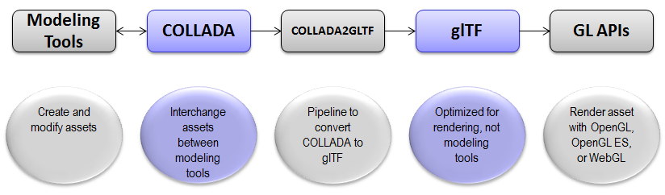

# The glTF Ecosystem

glTF can be combined with freely available open-source tools, enabling an open ecosystem for the development of content and applications.

## Loaders, Importers and Playback Engines

<mark>*list here*</mark>

## File Converters and Exporters

**COLLADA2GLTF**

The Khronos Group is maintaining [COLLADA2GLTF](https://github.com/KhronosGroup/glTF/tree/master/converter/COLLADA2GLTF), a converter from the COLLADA 3D interchange standard [ reference here ] to glTF. The COLLADA2GLTF pipeline is depicted in the figure below.

For a simple example, see the converted [COLLADA duck model](https://github.com/KhronosGroup/glTF/tree/master/model/duck).

> glTF is not part of the COLLADA standard; it is being developed as its own independent specification. While glTF has some designs borrowed from COLLADA (in greatly simplified form), there are many other new concepts not found in COLLADA, motivated by the unique requirements for fast transmission and loading.

**FBX-glTF**

Autodesk has developed an initial implementation of a [converter](https://github.com/cyrillef/FBX-glTF) from its FBX format to glTF.

