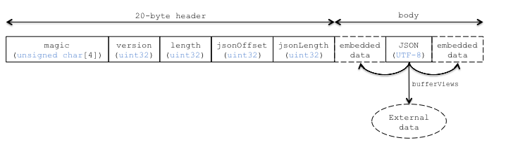

# CESIUM_binary_glTF

## Contributors

* Patrick Cozzi, Cesium, [@pjcozzi](https://twitter.com/pjcozzi)
* Tom Fili, Cesium, [@CesiumFili](https://twitter.com/CesiumFili)
* Kai Ninomiya, Cesium, [@kainino0x](https://twitter.com/kainino0x)

## Status

Do not use this extension; instead, use [KHR_binary_glTF](../../Khronos/KHR_binary_glTF).  This extension was used in Cesium 1.10 to 1.14.  This spec is for historic context.

## Dependencies

Written against the glTF 0.8 spec.

## Overview

glTF provides two delivery options that can also be used together:

* glTF JSON points to external binary data (geometry, key frames, skins), images, and shaders.
* glTF JSON embeds base64-encoded binary data, images, and shaders inline using data uris.

glTF is commonly criticized for requiring either separate requests or extra space due to base64-encoding.  Base64-encoding requires extra processing to decode and increases the file size (by ~33% for encoded resources).  While gzip mitigates the file size increase, decompression and decoding still add significant loading time.

To solve this, this extension introduces a container format, _Binary glTF_.  In Binary glTF, glTF resources (JSON, .bin, images, and shaders) can be stored in a binary blob accessed in JavaScript as an `ArrayBuffer`.  The `TextDecoder` JavaScript API can be used to extract the glTF JSON from the arraybuffer.  The JSON can be parses with `JSON.parse` as usual, and then the arraybuffer is treated as a glTF `buffer`. Informally, this is like embedding the JSON, images, and shaders in the .bin file.

## Binary glTF Layout

Binary glTF is little endian.  It has a 20-byte header followed by the glTF resources, including the JSON:

**Figure 1**: Binary glTF layout.



`magic` is the ASCII string `'glTF'`, and can be used to identify the arraybuffer as Binary glTF.  `version` is an `uint32` that indicates the version of the Binary glTF container format, which is `1` for this version of the extension.  `length` is the total length of the Binary glTF, including the header, in bytes.  `jsonOffset` is the offset, in bytes, from the start of the arraybuffer to the start of the glTF JSON.  `jsonLength` is the length of the glTF JSON in bytes.

`jsonOffset` and `jsonLength` are used to access the JSON.  This extension does not define where the JSON is in the arraybuffer nor does it define where the JSON is stored relative to the embedded data.  Figure 1 illustrates that the embedded data may come before or after the JSON (or both).  Pragmatically, exporter implementations may find it easier to write the JSON after the embedded data to make computing `byteOffset` and `byteLength` for bufferviews straightforward.

The start of the embedded data is 4-byte aligned to ease its use with JavaScript Typed Arrays.

Strings in the Binary glTF, i.e., JSON or shaders, are UTF-8.

Binary glTF still supports external resources.  For example, an application that wants to download textures on demand may embed everything except images in the Binary glTF.

Binary glTF also supported embedded base64-encoded resources, but it would be inefficient to use them.  An advantage of Binary glTF over glTF is that resources can be embedded without paying the size and client-side decoding costs of base64-encoding.

## glTF Schema Updates

This extension introduces an explicitly named `buffer` called `CESIUM_binary_glTF`.  This buffer is an implicit reference to the arraybuffer that is the Binary glTF.  It only has one property, `"type": "arraybuffer"`.  When a runtime encounters this, it should use the already loaded Binary glTF arrayBuffer as the buffer.  `bufferViews` that reference this `buffer` work as usual.

To support embedded shaders and images, `shader` and `image` glTF properties have new `CESIUM_binary_glTF` extension properties and no longer require the `uri` property.  See Listings 2 and 3.

**Listing 2**: A `shader` referencing a `bufferView` to access an embedded shader source.
```javascript
"a_shader" : {
    "extensions" : {
        "CESIUM_binary_glTF" : {
            "bufferView" : // ...
        }
    }
}
```

**Listing 3**: An `image` referencing a `bufferView` and with metadata useful for loading the image from the arrayBuffer.  In JavaScript, `Blob` can be used as the source for an `Image` to extract an image from the arraybuffer.  See Cesium's [`loadImageFromTypedArray`](https://github.com/AnalyticalGraphicsInc/cesium/blob/1.13/Source/Core/loadImageFromTypedArray.js) helper function.
```javascript
"an_image" : {
    "extensions" : {
        "CESIUM_binary_glTF" : {
            "bufferView" : // ...,
            "mimeType" : "image/png",
            "height" : 256,
            "width" : 512
        }
    }
}
```

## File Extension

`.bgltf`

## MIME Type

Use `model/vnd.gltf.binary`.

## Known Implementations

### Runtime

* Cesium ([code](https://github.com/AnalyticalGraphicsInc/cesium/blob/master/Source/Scene/Model.js))

### Tools

* Cesium COLLADA-to-glTF Converter ([app](http://cesiumjs.org/convertmodel.html))
* colladaToBglTFConverter ([code](https://github.com/virtualcitySYSTEMS/colladaToBglTFConverter))

## Resources

* Discussion - [#357](https://github.com/KhronosGroup/glTF/issues/357)
* base64-encoded data in glTF - [#68](https://github.com/KhronosGroup/glTF/issues/68)
* [Faster 3D Models with Binary glTF](http://cesiumjs.org/2015/06/01/Binary-glTF/) article on the Cesium blog

## Performance Results

Based on extensive experimentation (below & [[1]](#BenchData)) using Cesium's glTF loader, different configurations are recommended for different scenarios.

* To minimize file size and number of files, use Binary glTF (gzipped), and external compressed image files (PNG, JPEG, etc.) to avoid significant decompression overhead.
* If a single file is desired, use Binary glTF (gzipped) with all files embedded.
* For files with very little non-texture data, the difference in loading time is minimal, but Binary glTF can reduce the number of requests without overhead.

The following observations are made from file size and benchmark data:

* JSON, mesh data, and animation data are highly compressible.
* Already-compressed textures (PNG, JPEG) are not very compressible.  Adding compression (e.g. by embedding them into a Binary glTF file which will be gzipped) adds significant CPU overhead with little size benefit.

Using the Cesium [aircraft model](https://github.com/AnalyticalGraphicsInc/cesium/tree/master/Apps/SampleData/models/CesiumAir), which contains 5,984 triangles with two texture atlases and a simple animation without skinning, statistics and results for the common glTF setups are:

| Cesium Air                            | # files |     size | size (gzip\*) |  load time |
| :------------------------------------ | ------: | -------: | ------------: | ---------: |
| COLLADA                               |     3   |  922 KiB |     591 KiB   |            |
| glTF                                  |     8   |  608 KiB |     538 KiB   |   0.32 s   |
| glTF, base64-encoded bin/jpg/png/glsl |   **1** |  808 KiB |     540 KiB   |   0.41 s   |
| Binary glTF, embedded textures        |   **1** |  609 KiB |   **513 KiB** | **0.29 s** |
| Binary glTF, separate textures        |     3   |  609 KiB |     538 KiB   | **0.30 s** |


Using the 1200 12th Ave model (thanks to [Cube Cities](http://cubecities.com/)), which contains 30,235 triangles with 21 textures and no animations, statistics and results for the common glTF setups are:

| 1200 12th Ave                         | # files |     size | size (gzip\*) |  load time | 
| :------------------------------------ | ------: | -------: | ------------: | ---------: | 
| COLLADA                               |    22   | 5.93 MiB |    1.36 MiB   |            |
| glTF                                  |    31   | 2.99 MiB |    1.25 MiB   | **0.85 s** |
| glTF, base64-encoded bin/jpg/png/glsl |   **1** | 3.64 MiB |    1.30 MiB   |   1.25 s   |
| Binary glTF, embedded textures        |   **1** | 2.99 MiB |  **1.23 MiB** |   1.03 s   |
| Binary glTF, separate textures        |    22   | 2.99 MiB |    1.25 MiB   | **0.84 s** |


\* All files gzipped except for stand-alone images.

<a name="BenchData">
* [1] Raw data for benchmarks using compression available in [BenchData](BenchData/README.md) supplemental.
