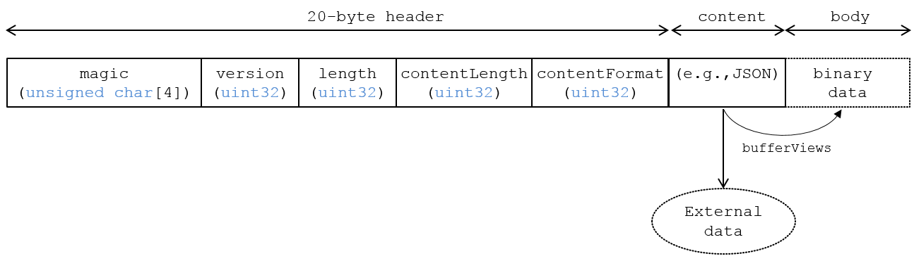

# KHR_binary_glTF

## Contributors

* Patrick Cozzi, Cesium, [@pjcozzi](https://twitter.com/pjcozzi)
* Tom Fili, Cesium, [@CesiumFili](https://twitter.com/CesiumFili)
* Kai Ninomiya, Cesium, [@kainino0x](https://twitter.com/kainino0x)
* Max Limper, Fraunhofer IGD, [@mlimper_cg](https://twitter.com/mlimper_cg)
* Maik Thöner, Fraunhofer IGD, [@mthoener](https://twitter.com/mthoener)

## Status

Complete

## Dependencies

Written against the glTF 1.0 spec. This extension is no longer needed in glTF 2.0 as glTF 2.0 includes [GLB File Format Specification](/specification/2.0/README.md#glb-file-format-specification).

## Overview

glTF provides two delivery options that can also be used together:

* glTF JSON points to external binary data (geometry, key frames, skins), images, and shaders.
* glTF JSON embeds base64-encoded binary data, images, and shaders inline using data URIs.

For these resources, glTF requires either separate requests or extra space due to base64-encoding.  Base64-encoding requires extra processing to decode and increases the file size (by ~33% for encoded resources).  While gzip mitigates the file size increase, decompression and decoding still add significant loading time.

To solve this, this extension introduces a container format, _Binary glTF_.
In Binary glTF, a glTF asset (JSON, .bin, images, and shaders) can be stored in a binary blob accessed in JavaScript as an `ArrayBuffer`. 
This binary blob (which can be a file, for example) is divided into three subsequent parts:

* A 20-byte preamble, entitled the `header`
* The structured glTF content, entitled the `content`
* The binary `body`

The `content` part can refer to external resources as usual, and can also reference resources stored within the binary `body`.

## Binary glTF Layout

Binary glTF is little endian and strings are encoded using UTF-8.  Figure 1 shows an overview of the three parts of a Binary glTF asset.

**Figure 1**: Binary glTF layout.



The following sections describe the structure of the three parts more in detail.

### Header

The 20-byte header consists of the following five 4-byte entries:

* `magic` is the ASCII string `'glTF'`, and can be used to identify the arraybuffer as Binary glTF.

* `version` is an `uint32` that indicates the version of the Binary glTF container format. Currently available versions are shown in Table 1.

* `length` is the total length of the Binary glTF, including `header`, `content`, and `body`, in bytes.

* `contentLength` is the length, in bytes, of the glTF `content`. It must be greater than zero.

* `contentFormat` specifies the format of the glTF `content`. A list of all valid  values currently available is in Table 2.

**Table 1**: Valid values for `version`

| Decimal | Hex        | Description |
|--------:|-----------:|------------:|
| 1       | 0x00000001 | Version 1   |


**Table 2**: Valid values for `contentFormat`

| Decimal | Hex        | Description |
|--------:|-----------:|------------:|
| 0       | 0x00000000 | JSON        |


### Content

The `content` part holds the structured glTF content description, as it would be provided within a .gltf file in glTF without this extension.
In a JavaScript implementation, the `TextDecoder` API can be used to extract the glTF content from the arraybuffer, and then the JSON can be parsed with `JSON.parse` as usual.

By reading the `content` first, an implementation is able to progressively retrieve resources from the binary body.
This way, it is also possible to read only a selected subset of resources from a Binary glTF asset (for instance, the coarsest LOD of a mesh).

Elements of the `content` can refer to binary data within the `body`, using a special buffer with an id equal to `"binary_glTF"`.
For more details, see [glTF Schema Updates](#gltf-schema-updates) below.

Binary glTF still supports external resources.
For example, an application that wants to download textures on demand may embed everything except images in the Binary glTF.
Embedded base64-encoded resources are also still supported, but it would be inefficient to use them.
An advantage of Binary glTF over glTF is that resources can be embedded without paying the size and client-side decoding costs of base64-encoding.

### Body

The binary `body` is the binary payload for geometry, animation key frames, skins, images, and shaders.

The start of `body` is 4-byte aligned to ease its use with JavaScript Typed Arrays.  This implies that trailing spaces may be added to the JSON in the `content` part such that `(20 + contentLength)` is divisible by `4`.

The buffer with id equal to `"binary_glTF"` is used to address the content of the binary `body`.
An offset of zero addresses the first byte of the binary `body`.

## glTF Schema Updates

As mentioned above, Binary glTF introduces a `buffer` with id equal to `"binary_glTF"`.
This buffer is an implicit reference to the binary `body` of the Binary glTF asset. 
Its `type` property is `"arraybuffer"`, and a runtime can ignore the `uri` property since the buffer refers to the Binary glTF `body` section, not an external resource.
When a runtime encounters this buffer, it should use the Binary glTF `body` as the buffer.
`bufferViews` that reference this `buffer` work as usual.

To support embedded shaders and images, `shader` and `image` glTF properties have new `KHR_binary_glTF` extension properties that should be used instead of the `uri` property.
See Listings 2 and 3.

**Listing 2**: A `shader` referencing a `bufferView` to access an embedded shader source.
```javascript
"extensionsUsed" : [
    "KHR_binary_glTF"
]
// ...
"a_shader" : {
    "extensions" : {
        "KHR_binary_glTF" : {
            "bufferView" : // ...
        }
    }
}
```

**Listing 3**: An `image` referencing a `bufferView` and with metadata useful for loading the image from the arraybuffer.  In JavaScript, `Blob` can be used as the source for an `Image` to extract an image from the arraybuffer (see Cesium's [`loadImageFromTypedArray`](https://github.com/AnalyticalGraphicsInc/cesium/blob/1.13/Source/Core/loadImageFromTypedArray.js) helper function).
```javascript
"extensionsUsed" : [
    "KHR_binary_glTF"
]
// ...
"an_image" : {
    "extensions" : {
        "KHR_binary_glTF" : {
            "bufferView" : // ...,
            "mimeType" : "image/png",
            "height" : 256,
            "width" : 512
        }
    }
}
```

### JSON Schema

For full details on the `KHR_binary_glTF` extension properties, see the schema:

* [image](schema/image.KHR_binary_glTF.schema.json) `KHR_binary_glTF` extensions object
* [shader](schema/shader.KHR_binary_glTF.schema.json) `KHR_binary_glTF` extensions object

## File Extension

The file extension to be used with Binary glTF is `.glb`.


## MIME Type

Use `model/gltf.binary`.


## Known Implementations

### Runtime

* Cesium ([code](https://github.com/AnalyticalGraphicsInc/cesium/blob/master/Source/Scene/Model.js))

### Tools

* Cesium COLLADA-to-glTF Converter ([app](http://cesiumjs.org/convertmodel.html))
* colladaToBglTFConverter ([code](https://github.com/virtualcitySYSTEMS/colladaToBglTFConverter))
* SRC writer ([code](http://x3dom.org/src/files/src_writer_source.zip))

## Resources

* Discussion - [#357](https://github.com/KhronosGroup/glTF/issues/357) and [#400](https://github.com/KhronosGroup/glTF/pull/400)
* base64-encoded data in glTF - [#68](https://github.com/KhronosGroup/glTF/issues/68)
* [Faster 3D Models with Binary glTF](http://cesiumjs.org/2015/06/01/Binary-glTF/) article on CESIUM_binary_glTF the Cesium blog
* [SRC project](http://x3dom.org/src/) (paper, background, basic writer)

## Performance Results

_This section is non-normative._

Based on experimentation (below & [[1]](#BenchData)) using CESIUM_binary_glTF (only trivial differences to KHR_binary_glTF) and the glTF loader in Cesium 1.10, different configurations are recommended for different scenarios.

* To minimize file size and number of files, use Binary glTF (gzipped), and external compressed image files (PNG, JPEG, etc.) to avoid significant decompression overhead.
* If a single file is desired, use Binary glTF (gzipped) with all files embedded.
* For files with very little non-texture data, the difference in loading time is minimal, but Binary glTF can reduce the number of requests without overhead.

The following observations are made from file size and benchmark data:

* JSON, mesh data, and animation data are highly compressible.
* Already-compressed textures (PNG, JPEG) are not very compressible. Adding compression (e.g. by embedding them into a Binary glTF file which will be gzipped) adds significant CPU overhead with little size benefit.

Using the Cesium [aircraft model](https://github.com/AnalyticalGraphicsInc/cesium/tree/master/Apps/SampleData/models/CesiumAir), which contains 5,984 triangles with two texture atlases and a simple animation without skinning, statistics and results for the common glTF setups are:

| Cesium Air                            | # files |     size | size (gzip\*) |  load time |
| :------------------------------------ | ------: | -------: | ------------: | ---------: |
| COLLADA                               |     3   |  922 KiB |     591 KiB   |            |
| glTF                                  |     8   |  608 KiB |     538 KiB   |   0.32 s   |
| glTF, base64-encoded bin/jpg/png/glsl |   **1** |  808 KiB |     540 KiB   |   0.41 s   |
| Binary glTF, embedded textures        |   **1** |  609 KiB |   **513 KiB** | **0.29 s** |
| Binary glTF, separate textures        |     3   |  609 KiB |     538 KiB   | **0.30 s** |


Using the 1200 12th Ave model (thanks to [Cube Cities](http://cubecities.com/)), which contains 30,235 triangles with 21 textures and no animations, statistics and results for the common glTF setups are:

| 1200 12th Ave                         | # files |     size | size (gzip\*) |  load time | 
| :------------------------------------ | ------: | -------: | ------------: | ---------: | 
| COLLADA                               |    22   | 5.93 MiB |    1.36 MiB   |            |
| glTF                                  |    31   | 2.99 MiB |    1.25 MiB   | **0.85 s** |
| glTF, base64-encoded bin/jpg/png/glsl |   **1** | 3.64 MiB |    1.30 MiB   |   1.25 s   |
| Binary glTF, embedded textures        |   **1** | 2.99 MiB |  **1.23 MiB** |   1.03 s   |
| Binary glTF, separate textures        |    22   | 2.99 MiB |    1.25 MiB   | **0.84 s** |


\* All files gzipped except for stand-alone images.

<a name="BenchData">
* [1] Raw data for benchmarks using compression available in [BenchData](BenchData/README.md) supplemental.
