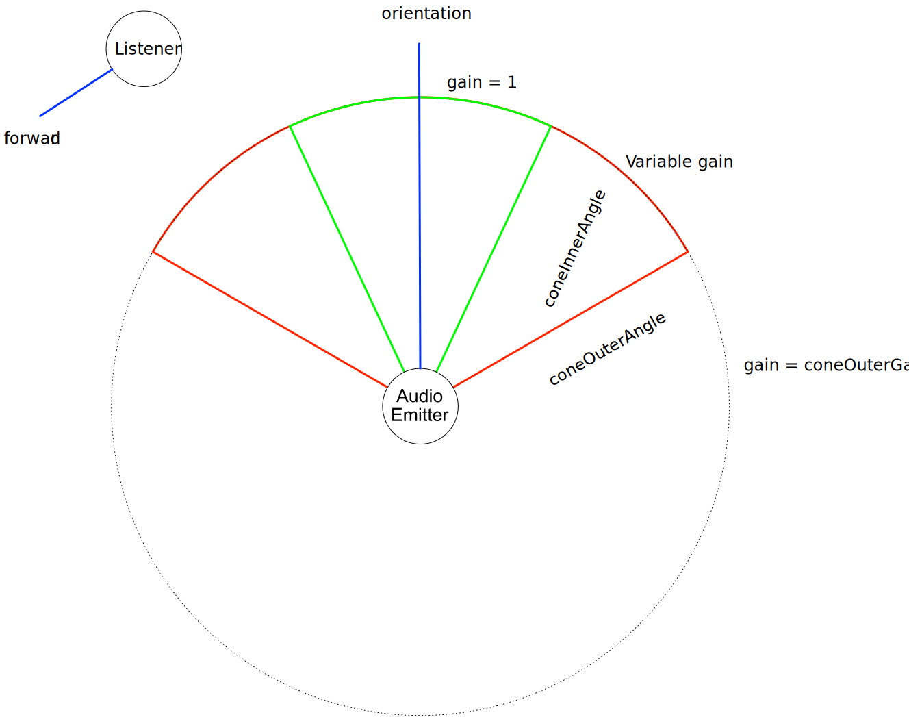

# KHR_audio

## Contributors

* Robert Long, Element Inc.
* Anthony Burchell, Individual Contributor
* K. S. Ernest (iFire) Lee, Individual Contributor
* Michael Nisbet, Individual Contributor
* humbletim, Individual Contributor
* Norbert Nopper, UX3D [@UX3DGpuSoftware](https://twitter.com/UX3DGpuSoftware)

## Status

Open Metaverse Interoperability Group Stage 2 Proposal

## Dependencies

Written against the glTF 2.0 spec.

## Overview

This extension allows for the addition of spatialized and non-spatialized audio to glTF scenes.

Audio emitter objects may be added to 3D nodes for positional audio or to the scene for environmental or ambient audio such as background music.

### Example:

```json
{
  "extensions": {
    "KHR_audio": {
      "sources": [
        {
          "name": "environment",
          "uri": "./environment.mp3"
        },
        {
          "name": "quack",
          "mimeType": "audio/mpeg",
          "bufferView": 5
        }
      ],
      "emitters": [
        {
          "name": "environment emitter",
          "type": "global",
          "gain": 1.0,
          "loop": true,
          "playing": true,
          "source": 0
        },
        {
          "name": "duck emitter",
          "type": "positional",
          "gain": 0.8,
          "loop": false,
          "playing": false,
          "source": 1,
          "positional": {
            "coneInnerAngle": 6.283185307179586,
            "coneOuterAngle": 6.283185307179586,
            "coneOuterGain": 0.0,
            "distanceModel": "inverse",
            "maxDistance": 10.0,
            "refDistance": 1.0,
            "rolloffFactor": 0.8
          }
        }
      ]
    }
  },
  "scenes": [
    {
      "name": "Default Scene",
      "extensions": {
        "KHR_audio": {
          "emitters": [0]
        }
      }
    }
  ],
  "nodes": [
    {
      "name": "Duck",
      "translation": [1.0, 2.0, 3.0],
      "extensions": {
        "KHR_audio": {
          "emitter": 1
        }
      }
    }
  ]
}
```

## glTF Schema Updates

This extension consists of two primary data structures: Audio Sources and Audio Emitters. Both sources and emitters are defined on an `KHR_audio` object added to the `extensions`
 object on the document root.

The extension must be added to the file's `extensionsUsed` array and because it is optional, it does not need to be added to the `extensionsRequired` array.

#### Example:

```json
{
    "asset": {
        "version": "2.0"
    }
    "extensionsUsed" : [
        "KHR_audio"
    ],
    "scenes": [...],
    "nodes": [...],
    "extensions": {
        "KHR_audio": {
            "sources": [...],
            "emitters": [...]
        }
    }
}
```

### Audio Sources

Audio source objects define audio data to be used in audio emitters. Multiple audio emitters may use the same audio source.

Audio sources can store their data in either a buffer view or reference an external file via uri.

When storing audio data in a buffer view, the `mimeType` field must be specified. Currently the only supported mime type is `audio/mpeg`.

#### `bufferView`

The index of the bufferView that contains the audio data. Use this instead of the audio source's uri property.

#### `mimeType`

The audio's MIME type. Required if `bufferView` is defined. Unless specified by another extension, the only supported mimeType is `audio/mpeg`.

#### `uri`

The uri of the audio file. Relative paths are relative to the glTF file.

#### MP3 Audio Format

Provides a space efficient format that can also be tuned to satisfy audio engineers.

The MPEG3 Audio Format is commonly available and freely licensed.

### Audio Emitter

#### `type`

Specifies the audio emitter type.

- `positional` Positional audio emitters. Using sound cones, the orientation is `+Z` having the same front side for a [glTF asset](https://www.khronos.org/registry/glTF/specs/2.0/glTF-2.0.html#coordinate-system-and-units). 
- `global ` Global audio emitters are not affected by the position of audio listeners. `coneInnerAngle`, `coneOuterAngle`, `coneOuterGain`, `distanceModel`, `maxDistance`, `refDistance`, and `rolloffFactor` should all be ignored when set.

#### `gain`

Unitless multiplier against original source volume for determining emitter loudness.

#### `loop`

Whether or not to loop the specified audio clip when finished.

#### `playing`

Whether or not the specified audio clip is playing. Setting this property `true` will set the audio clip to play on load (autoplay).

#### `source`

The id of the audio source referenced by this audio emitter.

#### `positional`

An object containing the positional audio emitter properties. This may only be defined if `type` is set to `positional`.

### Positional Audio Emitter Properties

#### `coneInnerAngle`

The angle, in radians, of a cone inside of which there will be no volume reduction.

#### `coneOuterAngle`

The angle, in radians, of a cone outside of which the volume will be reduced to a constant value of`coneOuterGain`.

#### `coneOuterGain`

The gain of the audio emitter set when outside the cone defined by the `coneOuterAngle` property. It is a linear value (not dB).

#### `distanceModel`

Specifies the distance model for the audio emitter.

- `linear` A linear distance model calculating the gain induced by the distance according to: 
    `1.0 - rolloffFactor * (distance - refDistance) / (maxDistance - refDistance)`
- `inverse ` (default) An inverse distance model calculating the gain induced by the distance according to:
    `refDistance / (refDistance + rolloffFactor * (Math.max(distance, refDistance) - refDistance))`
- `exponential` An exponential distance model calculating the gain induced by the distance according to:
    `pow((Math.max(distance, refDistance) / refDistance, -rolloffFactor))`

#### `maxDistance`

The maximum distance between the emitter and listener, after which the volume will not be reduced any further. `maximumDistance` may only be applied when the distanceModel is set to linear. Otherwise, it should be ignored.

#### `refDistance`

A reference distance for reducing volume as the emitter moves further from the listener. For distances less than this, the volume is not reduced.

#### `rolloffFactor`

Describes how quickly the volume is reduced as the emitter moves away from listener. When distanceModel is set to linear, the maximum value is 1 otherwise there is no upper limit.

### Using Audio Emitters

Audio emitters of type `global` may be added to scenes using the following syntax:

```json
{
    "scenes": [
        {
            "extensions": {
                "KHR_audio": {
                    "emitters": [0, 1]
                }
            }
        }
    ]
}
```

Audio emitters of type `positional` may be added to nodes using the following syntax:

```json
{
    "nodes": [
        {
            "extensions": {
                "KHR_audio": {
                    "emitter": 2
                }
            }
        }
    ]
}
```

Note that multiple global audio emitters are allowed on the scene, but only a single audio emitter may be added to a node.

### Audio Rolloff Formula
The Audio Rolloff range is `(0.0, +∞)`. The default is `1.0`.

The rolloff formula is dependant on the distance model defined. The available distance models are `linear`, `inverse`, and `exponential`.

- linear formula: `1.0 - rolloffFactor * (distance - refDistance) / (maxDistance - refDistance)`
- inverse formula: `refDistance / (refDistance + rolloffFactor * (Math.max(distance, refDistance) - refDistance))`
- exponential formula: `pow((Math.max(distance, refDistance) / refDistance, -rolloffFactor))`

### Audio Gain Units
The gain unit range is `(0.0, +∞)`. The default is `1.0`.
- gain formula: `originalVolume * gain`

### Audio Cone Vizualized


Figure 1. A modified graphic based on the <a href="https://webaudio.github.io/web-audio-api/#Spatialization-sound-cones" target="_blank">W3C Web Audio API Audio cone Figure</a>

The cone properties relate to the `PannerNode` interface and determine the amount of volume relative to a listeners position within the defined cone area.

The gain relative to cone properties is determined in a similar way as described in the web audio api with the difference that this audio emitter extension uses radians in place of degrees. [Cone Gain Algorithm Example](https://webaudio.github.io/web-audio-api/#Spatialization-sound-cones)

### Units for Rotations 

Radians are used for rotations matching glTF2.

### JSON Schema

[glTF.KHR_audio.schema.json](/extensions/2.0/KHR_audio/schema/glTF.KHR_audio.schema.json)

## Known Implementations

* Third Room - https://github.com/thirdroom/thirdroom
* Three Object Viewer (WordPress Plugin) - https://wordpress.org/plugins/three-object-viewer/
* UX3D Experimental C++ implementation - https://github.com/ux3d/OMI

## Resources

Prior Art:
* [W3C Web Audio API](https://www.w3.org/TR/webaudio/)
* [MOZ_hubs_components Audio](https://github.com/MozillaReality/hubs-blender-exporter/blob/04fc1d1/default-config.json#L298-L324)

