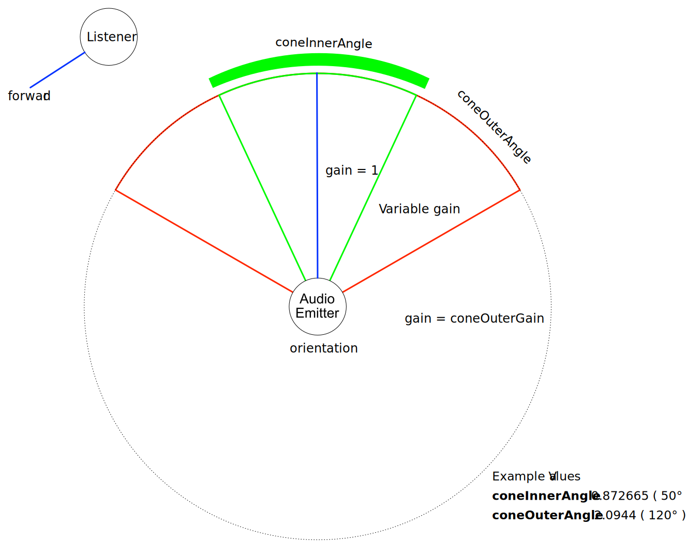

# KHR_audio_emitter

## Contributors

- Robert Long, Element Inc.
- Anthony Burchell, Individual Contributor
- K. S. Ernest (iFire) Lee, Individual Contributor
- Michael Nisbet, Individual Contributor
- humbletim, Individual Contributor
- Norbert Nopper, UX3D [@UX3DGpuSoftware](https://twitter.com/UX3DGpuSoftware)
- Aaron Franke, The Mirror Megaverse Inc.

## Status

Draft

## Dependencies

Written against the glTF 2.0 spec.

## Overview

This extension allows for the addition of spatialized and non-spatialized audio to glTF scenes.

Audio emitter objects may be added to 3D nodes for positional audio or to the scene for environmental or ambient audio such as background music.

### Example:

```json
{
    "extensions": {
        "KHR_audio_emitter": {
            "emitters": [
                {
                    "name": "Positional Emitter",
                    "type": "positional",
                    "gain": 0.8,
                    "sources": [0, 1],
                    "positional": {
                        "shapeType": "omnidirectional",
                        "distanceModel": "inverse",
                        "maxDistance": 10.0,
                        "refDistance": 1.0,
                        "rolloffFactor": 0.8
                    }
                },
                {
                    "name": "Global Emitter",
                    "type": "global",
                    "gain": 0.8,
                    "sources": [1]
                }
            ],
            "sources": [
                {
                    "name": "Clip 1",
                    "gain": 0.6,
                    "autoPlay": true,
                    "loop": true,
                    "audio": 0
                },
                {
                    "name": "Clip 2",
                    "gain": 0.6,
                    "autoPlay": true,
                    "loop": true,
                    "audio": 1
                }
            ],
            "audio": [
                {
                    "uri": "audio1.mp3"
                },
                {
                    "bufferView": 0,
                    "mimeType": "audio/mpeg"
                }
            ]
        }
    },
    "scenes": [
        {
            "name": "Default Scene",
            "extensions": {
                "KHR_audio_emitter": {
                    "emitters": [1]
                }
            }
        }
    ],
    "nodes": [
        {
            "name": "Duck",
            "translation": [1.0, 2.0, 3.0],
            "extensions": {
                "KHR_audio_emitter": {
                    "emitter": 0
                }
            }
        }
    ]
}
```

## glTF Schema Updates

This extension consists of three primary data structures: Audio Data, Audio Sources, and Audio Emitters. Data, sources and emitters are defined on an `KHR_audio_emitter` object added to the `extensions` object on the document root.

The extension must be added to the file's `extensionsUsed` array and because it is optional, it does not need to be added to the `extensionsRequired` array.

#### Example:

```json
{
    "asset": {
        "version": "2.0"
    },
    "extensionsUsed": [
        "KHR_audio_emitter"
    ],
    "scenes": [...],
    "nodes": [...],
    "extensions": {
        "KHR_audio_emitter": {
            "audio": [...],
            "sources": [...],
            "emitters": [...]
        }
    }
}
```

### Audio Data

Audio data objects define where audio data is located and what format the data is in. The data is either accessed via a bufferView or uri.

When storing audio data in a buffer view, the `mimeType` field must be specified. The base specification supports `audio/mpeg` and `audio/wav` MIME types. These were chosen with consideration for the wide support for these types acrosss 3D engines and common use cases. Other supported audio formats may be added via extensions.

Note that in tools that process glTF files, but do not implement the `KHR_audio_emitter` extension, external files referenced via the `uri` field may not be properly copied to their final destination or baked into the final binary glTF file. In these cases, using the `bufferView` property may be a better choice assuming the referenced `bufferView` index is not changed by the tool. The `uri` field might be a better choice when you want to be able to quickly change the referenced audio asset.

#### Buffer View

The `"bufferView"` property is the integer index of the bufferView that contains the audio data. If present, use this instead of the audio source's uri property.

#### MIME Type

The `"mimeType"` property is a string that specifies the audio's MIME type. Required if `bufferView` is defined. Unless specified by another extension, the only supported mimeTypes are `audio/mpeg` and `audio/wav`.

#### URI

The `"uri"` property is a string for the uri of the audio file. Relative paths are relative to the .gltf file.

### Audio Sources

Audio sources reference audio data and define playback properties for it. Audio sources may be used by zero to many audio emitters.

#### Property Summary

|              | Type      | Description                                                                                               | Default value        |
| ------------ | --------- | --------------------------------------------------------------------------------------------------------- | -------------------- |
| **gain**     | `number`  | Unitless linear multiplier against original audio file volume used for determining audio source loudness. | 1.0                  |
| **loop**     | `boolean` | Whether or not to loop the specified audio when finished.                                                 | false                |
| **autoPlay** | `boolean` | Whether or not to play the specified audio when the glTF is loaded.                                       | false                |
| **audio**    | `number`  | The index of the audio data assigned to this clip.                                                        | Required, no default |

#### Gain

The `"gain"` property is a number that is a unitless linear multiplier against original audio file volume used for determining audio source loudness. If not specified, the audio source volume gain is `1.0`.

This value is linear, a value of `0.0` is no volume, `0.5` is half volume, `1.0` is the original volume, `2.0` is double the volume, etc. The final volume of the audio is a combination of this value, the audio emitter's gain, and if the audio emitter is positional, the relative positions of the emitter and listener.

#### Loop

The `"loop"` property is a boolean that specifies whether or not to loop the specified audio when finished. If `false` or not specified, the audio source does not loop.

#### Auto Play

The `"autoPlay"` property is a boolean that specifies whether or not to play the specified audio when the glTF is loaded. If `false` or not specified, the audio source does not play automatically.

#### Audio

The `"audio"` property is an integer index of the audio data in the "audio" array assigned to this audio source. This property is required.

### Audio Emitter

Audio emitters define how audio sources are played back. Emitter properties are defined at the document level and are references by nodes. Audio may be played globally or positionally. Positional audio has further properties that define how audio volume scales with distance and angle.

#### Property Summary

|                | Type       | Description                                                                                         | Default value        |
| -------------- | ---------- | --------------------------------------------------------------------------------------------------- | -------------------- |
| **type**       | `string`   | The emitter type of this audio emitter: `global` or `positional`.                                   | Required, no default |
| **gain**       | `number`   | Unitless linear multiplier against audio source volume used for determining audio emitter loudness. | 1.0                  |
| **sources**    | `number[]` | An array of audio source indices used by the audio emitter. This array may be empty.                | []                   |
| **positional** | `object`   | A sub-JSON containing the positional audio emitter properties.                                      | {}                   |

#### Type

The `"type"` property is a string that specifies the audio emitter type. This property is required.

- `global` Global audio emitters are not affected by the position of audio listeners. All `positional` properties may not be defined on global audio emitters.
- `positional` Positional audio emitters play audio at a position in the scene. The properties are defined in the `positional` object. Using sound cones, the orientation is `-Z` having the same emission direction as [`KHR_lights_punctual`](https://github.com/KhronosGroup/glTF/tree/main/extensions/2.0/Khronos/KHR_lights_punctual) and [glTF cameras](https://github.com/KhronosGroup/glTF-Tutorials/blob/master/gltfTutorial/gltfTutorial_016_Cameras.md).

#### Gain

The `"gain"` property is a number that is a unitless linear multiplier against audio source volume used for determining audio emitter loudness. If not specified, the audio emitter volume gain is `1.0`.

This value is linear, a value of `0.0` is no volume, `0.5` is half volume, `1.0` is the original volume, `2.0` is double the volume, etc. The final volume of the audio is a combination of this value, the audio source's gain, and if the audio emitter is positional, the relative positions of the emitter and listener.

#### Sources

The `"sources"` property is an array of integer indices of audio sources in the "sources" array used by the audio emitter. This array may be empty. If empty or not specified, this emitter can be used to define how audio should emit from a node, but not which audio source to play.

#### Positional

The `"positional"` property is a sub-JSON object containing the positional audio emitter properties. This may only be defined if `type` is set to `positional`.

### Positional Audio Emitter Properties

When the audio emitter type is set to `positional`, additional properties may be defined on the `positional` object.

#### Property Summary

|                    | Type     | Description                                                                                                         | Default value                       |
| ------------------ | -------- | ------------------------------------------------------------------------------------------------------------------- | ----------------------------------- |
| **shapeType**      | `string` | The shape of the audio emitter. May be `omnidirectional`, `cone`, or a value specified by another extension.        | `"omnidirectional"`                 |
| **coneInnerAngle** | `number` | The anglular diameter of a cone inside of which there will be no angular volume reduction.                          | 6.2831853... (τ or 2π rad, 360 deg) |
| **coneOuterAngle** | `number` | The anglular diameter of a cone outside of which the volume will be reduced to a constant value of `coneOuterGain`. | 6.2831853... (τ or 2π rad, 360 deg) |
| **coneOuterGain**  | `number` | The linear volume gain of the audio emitter set when outside the cone defined by the `coneOuterAngle` property.     | 0.0                                 |
| **distanceModel**  | `string` | Specifies the distance model for the audio emitter.                                                                 | `"inverse"`                         |
| **maxDistance**    | `number` | The maximum distance between the emitter and listener, beyond which the audio cannot be heard.                      | 0.0                                 |
| **refDistance**    | `number` | A reference distance for reducing volume as the emitter moves further from the listener.                            | 1.0                                 |
| **rolloffFactor**  | `number` | Describes how quickly the volume is reduced as the emitter moves away from listener.                                | 1.0                                 |

#### Shape Type

The `"shapeType"` property is a string that defines shape type of the audio emitter. May be `"omnidirectional"`, `"cone"`, or a value specified by another extension. If not specified, the default shape is `omnidirectional`.

If the shape is `"omnidirectional"`, the `"coneInnerAngle"`, `"coneOuterAngle"`, and `"coneOuterGain"` properties are ignored.

#### Cone Inner Angle

The `"coneInnerAngle"` property is a number that defines the angle, in radians, of a cone inside of which there will be no volume reduction. This angle represents the angular "diameter" of the cone, from side to side. If not specified, the angle of Tau radians (`6.283185307179586476925286766559` or 360 degrees) is used, which means the audio emits in all directions (not in a cone).

#### Cone Outer Angle

The `"coneOuterAngle"` property is a number that defines the angle, in radians, of a cone outside of which the volume will be reduced to a constant value of `coneOuterGain`. This angle represents the angular "diameter" of the cone, from side to side. If not specified, the angle of Tau radians (`6.283185307179586476925286766559` or 360 degrees) is used, which means some audio will emit in all directions.

#### Cone Outer Gain

The `"coneOuterGain"` property is a number that defines the linear volume gain of the audio emitter set when outside the cone defined by the `coneOuterAngle` property. It is a linear value (not dB). If not specified, the cone outer gain is `0.0`, meaning the audio will be silent outside of the cone.

#### Distance Model

The `"distanceModel"` property is a string that specifies the distance model for the audio emitter.

- `linear` A linear distance model calculating the gain induced by the distance according to:
    `1.0 - rolloffFactor * (distance - refDistance) / (maxDistance - refDistance)`
- `inverse` (default) An inverse distance model calculating the gain induced by the distance according to:
    `refDistance / (refDistance + rolloffFactor * (Math.max(distance, refDistance) - refDistance))`
- `exponential` An exponential distance model calculating the gain induced by the distance according to:
    `pow((Math.max(distance, refDistance) / refDistance, -rolloffFactor))`

#### Max Distance

The `"maxDistance"` property is a number that defines the maximum distance between the emitter and listener, after which the volume will not be reduced any further. If zero or not specified, the audio emitter does not have a maximum distance, and it can be heard from any distance.

For the linear distance model, the max distance must be greater than the ref distance. For all distance models, max distance cannot be a negative number.

#### Ref Distance

The `"refDistance"` property is a number that defines a reference distance for reducing volume as the emitter moves further from the listener. For distances less than this, the volume is not reduced. This value cannot be zero or a negative number. If not specified, the default value is `1.0`.

#### Rolloff Factor

The `"rolloffFactor"` property is a number that describes how quickly the volume is reduced as the emitter moves away from listener. When distanceModel is set to linear, the maximum value is `1.0`. Otherwise, there is no upper limit to the rolloff factor. If not specified, the default value is `1.0`.

### Using Audio Emitters

Audio emitters of type `global` may be added to scenes using the following syntax:

```json
{
    "scenes": [
        {
            "extensions": {
                "KHR_audio_emitter": {
                    "emitters": [1, 3]
                }
            }
        }
    ]
}
```

Audio emitters of type `global` may be added to nodes using the following syntax:

```json
{
    "nodes": [
        {
            "extensions": {
                "KHR_audio_emitter": {
                    "emitter": 1
                }
            }
        }
    ]
}
```

Audio emitters of type `positional` may be added to nodes using the following syntax:

```json
{
    "nodes": [
        {
            "extensions": {
                "KHR_audio_emitter": {
                    "emitter": 0
                }
            }
        }
    ]
}
```

Note that multiple global audio emitters are allowed on the scene, but only a single audio emitter may be added to a node.

### Audio Rolloff Formula

The Audio Rolloff range is `(0.0, +∞)`. The default is `1.0`.

The rolloff formula is dependant on the distance model defined. The available distance models are `linear`, `inverse`, and `exponential`.

- linear formula: `1.0 - rolloffFactor * (distance - refDistance) / (maxDistance - refDistance)`
- inverse formula: `refDistance / (refDistance + rolloffFactor * (Math.max(distance, refDistance) - refDistance))`
- exponential formula: `pow((Math.max(distance, refDistance) / refDistance, -rolloffFactor))`

### Audio Gain Units

The gain unit range is `(0.0, +∞)`. The default is `1.0`.

- gain formula: `originalVolume * gain`

### Audio Cone Vizualized



Figure 1. A modified graphic based on the <a href="https://webaudio.github.io/web-audio-api/#Spatialization-sound-cones" target="_blank">W3C Web Audio API Audio cone Figure</a>

The cone properties relate to the `PannerNode` interface and determine the amount of volume relative to a listeners position within the defined cone area.

The gain relative to cone properties is determined in a similar way as described in the web audio api with the difference that this audio emitter extension uses radians in place of degrees. [Cone Gain Algorithm Example](https://webaudio.github.io/web-audio-api/#Spatialization-sound-cones)

### Unit for Angles

Radians are used for angles matching glTF2.

### JSON Schema

See [glTF.KHR_audio_emitter.schema.json](schema/glTF.KHR_audio_emitter.schema.json) for the main document-level schema.

## Known Implementations

- Third Room - https://github.com/thirdroom/thirdroom
- Three Object Viewer (WordPress Plugin) - https://wordpress.org/plugins/three-object-viewer/
- UX3D Experimental C++ implementation - https://github.com/ux3d/OMI

## Resources

Prior Art:

- [W3C Web Audio API](https://www.w3.org/TR/webaudio/)
- [MSFT_audio_emitter](https://github.com/KhronosGroup/glTF/pull/1400)
- [MOZ_hubs_components Audio](https://github.com/MozillaReality/hubs-blender-exporter/blob/04fc1d1/default-config.json#L298-L324)
