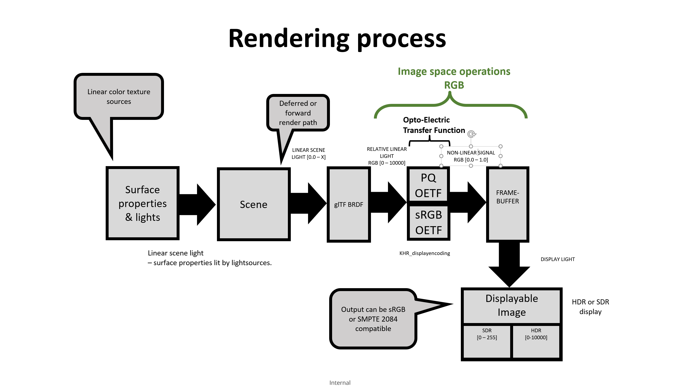
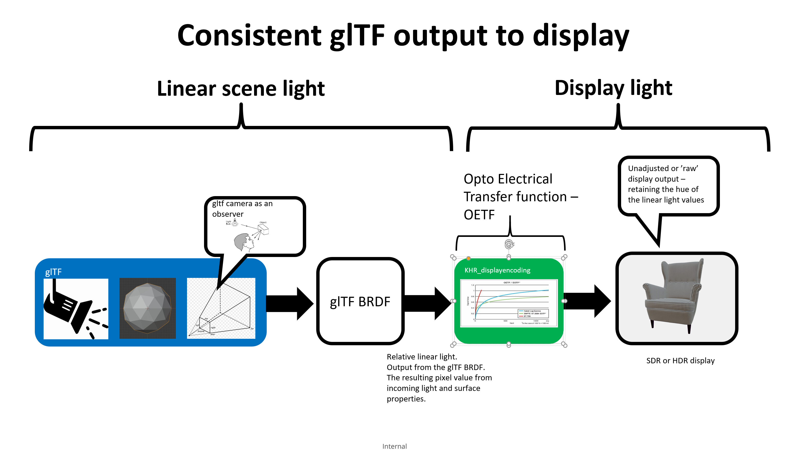
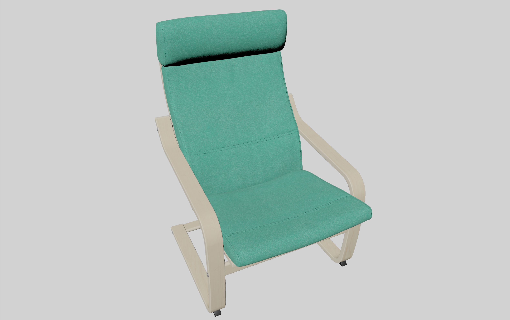

# KHR_displayencoding

## Contributors

Rickard Sahlin, <mailto:rickard.sahlin@inter.ikea.com>  
Sebastien Vandenberghe, <mailto:sevan@microsoft.com>  
Gary Hsu, Microsoft, <mailto:garyhsu@microsoft.com>  
Ben Houston, ThreeKit, <mailto:bhouston@threekit.com>  
Alexey Knyazev [@lexaknyazev](https://github.com/lexaknyazev)  

Copyright (C) 2021 The Khronos Group Inc. All Rights Reserved. glTF is a trademark of The Khronos Group Inc.
See [Appendix](#appendix-full-khronos-copyright-statement) for full Khronos Copyright Statement.

## Status

Draft

## Dependencies

Written against the glTF 2.01 spec.

## Exclusions

## Termonilogy

This extension uses the following terms:


|NAME|MEANING|
|------|-----|
|OETF|The opto-electronic transfer function, which converts linear scene light into the video signal. It is the inverse-EOTF and is sometimes called 'Display Encoding'. Performed prior to writing the output value into the framebuffer. Inverse of the EOTF | 
|EOTF|The electro-optical Transfer Function, which converts the video signal into the linear light output of the display. Performed in the display device. |
|OOTF|opto-optical transfer function, which converts linear scene light to display linear light. Sometimes called 'Tone mapping'.|
|Linear scene light | Light output from the scene in cd / m2. |
|Relative linear light | Light output in the range [0 - 10000] cd / m2 where 10000 equals a fully exposed pixel |
|Tone-mapping | The intent to change the visual appearance of the display output. In this context with the intent to reproduce the perceptual impression the viewer would have observing the original scene |
| Perceptual Quantizer | The EOTF defined in SMPTE ST-2084, also defines the inverse (the OETF) |
| HDR | High dynamic range. High range of luminosity values, an increase in brightness. In this context it is synonymous with higher precision, or bit-depth |
| WCG | Wide color gamut. High range of color values, an increase in color. |


## Overview

This extension is intended for implementations that targets a light emitting display with the goal of outputting interactive framerates in a physically correct manner.    
Here the term physically correct refers to the brdf calculations of the linear scene light and the display output value passed to the display encoding step.  

This extension aims to:  
Produce consistent, deterministic and physically correct output under varying light conditions - here called expected output.  
Produce expected output of a glTF model (nodes) when put into a scene with defined lights.  
Produce expected output of a scene when the light conditions are dynamically changed.  
Produce expected output of multiple glTF models (nodes) that are combined into one scene.  
Produce expected output when a glTF model is viewed in an editing tool supporting this extension.
Produce expected output on SDR and supported HDR displays.  
Provide a way to have light interoperability by defining output range.  
Be compatible with updates to glTF texture color spaces, for example increased color gamut.  

This is done by specifying a way to encode the resulting (rendered) scene linear light output values to a known range of {R,G,B} values that can be output to display.  
This encoding shall be done so that hue (chromaticity) is retained in the displayed image.     
Output units are declared as candela / m2  

Currently the glTF specification does not define how to output pixels.  

`Runtime-independence. glTF is purely an asset format and does not mandate any runtime
behavior. This enables its use by any application for any purpose, including display using any
rendering technology, up to and including path tracing renderers.`

This results in hue shift and white-out, due to clipping of pixel [RGB] values when written to framebuffer,  not desirable when the goal is to achieve physically correct output.  

Correct output of hue is important in order to achieve a physically correct visualization and to retain original artistic intent.  
One such important usecase is 3D Commerce and the certification process.  

Below is one of the 3D Commerce certification test models, lit with 1000 lumen / m2.  
As can be seen, not much of the surface properties are present in the output.   
[RGB] values are clipped resulting in hue-shift and white-out.  

<figure>

<figcaption><em>Sample viewer reference implementation 1000 lumen/m2.  
Notice how colors have been clipped and changed hue</em></figcaption>
</figure>


This extension standardizes the output from such a scene in a way that the result is predictable, physically correct and retains hue.  
When using this extension BRDF light output values shall be limited to 10 000 before being written to the framebuffer.  
[See BRDF](#brdf)  
The BRDF light output is called relative linear light, where 0 is a black pixel and 10000 equals a fully (bright) exposed pixel on the display.

This extension does not declare user defined tone-mapping, s-curve, color lookup table (LUT) or similar as the process of applying these may be non pysically based and alter the energy conserving nature of the glTF BRDF.    

It is important that different models that are using this extension can be viewed in the same scene without compromising the properties of the material and those of the lightsources.    

Here the term renderer means a rendering engine that consists of a system wherein a buffer containing the pixel values for each frame is prepared. 
This buffer will be referred to as the framebuffer.  
The framebuffer can be of varying range, precision and colorspace. This has an impact on the color gamut that can be displayed.  

After completion of one framebuffer, it is output to the display.  
This is usually done by means of a swap-chain. The details of how the swap-chain works is outside the scope of this extension.  
KHR_displayencoding specifies one method of mapping internal pixel values to that of the framebuffer.  

This extension does not define an OOTF (or Tone mapping) to convert linear scene light to linear display light.  

This extension does not seek to model the psychological perception of the human vision system, instead it provides means to reproduce the scene light information 'as is'.    

This extension does not take the viewing environment of the display, or eye light adaptation, into consideration.  
It is assumed that the content is viewed in an environment that is dimly lit (~5 cd / m2) without direct light on the display.  
Viewer calibration is not part of this extension as this is heavily dependent on the usecase and application.  

This extensions provides the specification for using HDR compatible display outputs while at the same time retaining compatibility with SDR display outputs.  


<figure>

<figcaption><em>Output using this extension and lit with  1000 lumen/m2.

No clipping of color values, no change in hue.</em></figcaption>
</figure>

## Standard Considerations  

Why not use a standard such as ACES (Acadamy Color Encoding Specification)?

While the ACES does a very good job of defining how to capture, encode and process image data in a movie type of usecase -   
it does much more than what is needed by this extension.  

This extension is similar to what is defined in the ACES `Output Device Transform` (ODT) which is a sub-step of the ACES 'Output Transform'    
Please not that the ACES Output Transform is explicitly not neutral in its appearance, making it unsuable in an output that must retain physical correctness.  

[Good explanation of ACES](https://chrisbrejon.com/cg-cinematography/chapter-1-5-academy-color-encoding-system-aces/)


`The Academy Color Encoding Specification (ACES) defines a digital color image encoding appropriate for 
both photographed and computer-generated images. It is the common color encoding for the Academy 
Image Interchange Framework. In the flow of image data from scene capture to theatrical presentation, 
ACES data encode imagery in a form suitable for creative manipulation. Later points in the workflow 
provide forms suitable for critical viewing.`


### glTF asset considerations

The extension affects the output of the entire glTF asset, all scenes and nodes, included in a file that is using this extension.
The current rendered scene shall be output using the opto electrical transfer function (OETF) declared by this extension whenever the usecase is relevant, for instance a renderer targeting a display at interactive framerates.   

Visualization of multiple glTF assets using this extension is supported and will produce a normative result.  

If the glTF asset contains multiple scenes, each one when rendered, shall be output using this extension.  

If the glTF asset contains this extension but no scene or model data then it may be treated as an enabler for the displayencoding extension.  
This could for instance be a 'Main product' type of scenario, where the asset contains the light setup and uses this extension.    
All nodes added to such scene shall use this extension.  


### Integration points

This extension has the following integration points:  

**At startup or load-time**

1: Choose display type  
Decide wether display output and framebuffer format is considered to be HDR or SDR.  
If unknown then choose SDR.  
[See Display type](#display-type)  

2: Color source images  
If the display type is considered to be HDR then color source images may need to be converted to ITU BT.2020 colorspace  
[See Color source images](#color-source-images)  


**During each frame**


**BRDF**
See the glTF BRDF model for more information:  
https://www.khronos.org/registry/glTF/specs/2.0/glTF-2.0.html#complete-model..

RGB light output from the glTF BRDF is here called 'relative linear light' and is in the range [0.0 - 10000]  
Light contribution can come from several lightsources. 
To avoid costly and complex calculation of light contribution prior to the BRDF, values are scaled before sent to the OETF.  
This scaling, not clamp, shall be done equally to RGB triplets in a way that retains hue.  
The RGB value for each pixel is then stored in the framebuffer using OETF (display encoding) depending on colorspace.  

**Implementation Notes**

Pseudocode to scale BRDF output.

```
vec3 BRDF_SCALE(vec3 color) {
  float factor = min(1, (10000 / max(color.r, max(color.g, color.b))));
  return factor * color;
}

vec3 displayColor = BRDF_SCALE(brdfColor);

```


**OETF**

Opto-Electric Transfer Function shall be selected based on framebuffer colorspace.  

Colorspace:  
HDR10 ST2084  
DOLBYVISION  

Perceptural Quantizer reference OETF shall be used  
The Reference PQ OETF shall be used as defined in:  
https://www.itu.int/rec/R-REC-BT.2100/en    

This operation will quantify display light to output values with minimal amount of banding.  
Input values are relative linear light values in the range {R,G,B} [0 - 10000] and output is non-linear display values in range {R,G,B} [0.0 - 1.0]  

Colorspace:  
sRGB

sRGB OETF shall be used  
The sRGB color component transfer function (OETF) shall be used as defined in:  
https://www.w3.org/Graphics/Color/srgb  

Input values are relative linear light values {R,G,B} / 10000 in the range [0.0 - 1.0] and output is non-linear display values in range [R,G,B} [0.0 - 1.0]  


**Pipeline**


| Input         |   Function    | Output range  | Description   |
| ------------- | ------------- | ----------- |------------- |
| [0.0 - X] | BRDF | [0.0 - 10000] | The glTF BRDF calculations. Output is scaled pixel value to be displayed - relative linear light. |
| [0 - 10000]  |     OETF      | [0.0 - 1.0] | Framebuffer output - maps relative linear light to nonlinear signal value. |


**Implementation Notes**

Overview of where implementations may decide to perform the functions defined by this extension.


<figure>

<figcaption><em>Example design flow of image space implementation. This shows where implementations may choose to apply the image space functions of this extension. Note that this is only one example of how the renderprocess could be implemented. An implementation may need to apply image space operations at different points in the process</em></figcaption>
</figure>

### Motivation

Output pixel values from a rendered 3D model are generally in a range that is larger than that of a display device.  
This may not be a problem if the output is a high definition image format or some other target that has the same range and precision as the internal calculations.  
However, a typical usecase for a renderer targeting interactive framerates is that the output is a light emitting display.  
Such a display rarely has the range and precision of internal calculations making it necessary to scale internal pixel values to match the characteristics of the output.  


The HDR OETF for this extension is chosen from ITU BT.2100 which is the standard for HDR TV and broadcast content creation.   
This standard uses the Perceptual Quantizer (PQ) as OETF which is defined in SMPTE ST-2084.  
PQ is selected based on minimizing visual artefacts from color banding according to the Barten Ramp. Resulting on very slight visible banding on panels with 10 bits per colorchannel.  
On panels with 12 bits there is no visible banding artefacts when using the perceptual qantizer.  

SMPTE ST-2084, or PQ, is widely supported and used in the TV / movie industry, it is the de-facto standard on desctop OS'es that support HDR such as Windows 10/11 and MacOS.  

This extension seeks to provide support for displays that can be either SDR or HDR, with the goal of providing a display output that retains the hue of BRDF light calculations.  

<figure>

<figcaption><em>Expected output using this extension  
</em></figcaption>
</figure>


## Internal range of illumination (light contribution) values


When the KHR_displayencoding extension is used all lighting and pixel calculations shall be done using the value 10000 (cd / m2) as the maximum output brightness.  

Limiting the range of output brightness values to the specified range is done as part of the Integration Points.    
[See Integration Points](#Integration-Points)  

This does not have an impact on color texture sources since they define values as contribution factor.  

The value 10000 cd / m2 for an output pixel with full brightness is chosen to be compatible with the Perceptual Quantizer (PQ).  
The range [0 - 10000] shall be seen as a relative linear light (display light) where 0 is black and 10000 is full brightness on the display.  

It does not mean that the display will be capable of outputting at brightness levels up to 10000 cd / m2  


## Content creation and exporter considerations
 
This section describes how a content creator and exporter shall handle lightsources, such as point, directional, emissive or environment lights, that are saved with the model.  

As a content creator using this extension the light intensity value of 10 000 lumen / m2 is the max illumination value for each output pixel.  
Giving the benefit of a known increased light range as well as providing enough fidelity for most usecases.  

Illumination values are clamped as part of the rendering process after BRDF light calculations meaning that the scene max light values can go above 10 000 lumen / m2.  

Adding illumination above 10 000 lumen / m2 will give the effect of brightening the darker areas without affecting hue or brightness of fully bright pixels.  

A content creation tool supporting this extension shall display the rendered image according to specification when this extension is enabled for the asset  
This is to ensure that users see the same output as is expected from a viewer.  

The below images show 3D Commerce certification models under different illuminations, note that the light is one directional light.  


| Sunrise (~200 lux) | Overcast (~1200 lux) | Bright (~3200 lux) | Sunny (~10000 lux) |
|-----|-----|-------|------|
|  |  |  |  |


## Display type

This section describes how to decide if display type is HDR or SDR.  


### HDR capable display


If the framebuffer format and colorspace is known to the implementation and one is available, choose a format compatible with color primaries ITU BT.2020 and uses the SMPTE ST 2084 transfer function (perceptual quantizer).  
In Vulkan this would for instance be:  
VK_COLOR_SPACE_HDR10_ST2084_EXT  
VK_COLOR_SPACE_DOLBYVISION_EXT  

For a list of Vulkan colorspaces [see Table 1 of VkColorSpaceKHR](https://www.khronos.org/registry/vulkan/specs/1.3-extensions/man/html/VkColorSpaceKHR.html)

It is valid to choose a framebuffer with colorspace ITU BT.2020 (or BT.2100) that does not use the SMPTE ST 2084 transfer function, if SMPTE ST 2084 (PQ EOTF) is applied to pixel values before being output to display.  


**Implementation notes**

Conversion of color primaries to ITU BT.2020 could be done after loading of a PNG/JPEG and after the image has been gamma expanded from sRGB to linear.  
Another solution would be to perform render calculation in BT.709 colorspace and convert to target colorspace before writing out values to the framebuffer.  


### SDR capable display

If a framebuffer format that fulfills the HDR requirements is not available, a framebuffer in sRGB colorspace may be used.    

This is to allow for compatibility with displays that does not support higher range and/or compatible colorspaces.  
It also allows implementations where the details of the framebuffer is not known or available.  

A SDR capable display is defined as having less than 10 bits per pixel for each colorchannel.  
This will typically have a framebuffer in the sRGB colorspace.   


## Color source images

If display type is considered to be HDR then color source images shall be converted to BT.2020 as needed.  
Exactly where this conversion takes place is up to implementations. 


### Color conversion matrix

Color conversion from BT.709 to BT.2020 is specified in ITU BT.2087  
https://www.itu.int/rec/R-REC-BT.2087/en

The M2 linear color conversion matrix is defined as:  
0.6274 0.3293 0.0433  
0.0691 0.9195 0.0114  
0.0164 0.0880 0.8956  


## Perceptual Quantizer - reference OETF

To convert to non-linear output value in the range 0.0 - 1.0 the reference PQ OETF shall be used.  
This is specified in ITU BT.2100:
https://www.itu.int/rec/R-REC-BT.2100/en  

The OETF shall be applied after the BRDF calculations, this will yield a non-linear output-signal in the range [0.0 - 1.0] that shall be stored in the display buffer.  
This shall be done according to the parameter `Reference PQ OETF`of ITU BT.2100   

Where the resulting non-linear signal (R,G,B) in the range [0:1] = E  

```
E = ((C1 + C2 * pow(FD / 10000, m1)) / (1 + C3 * pow(FD / 10000, m1))  ^ m2 

FD = displayColor (output from the BRDF)  
m1 = 2610/16384 = 0.1593017578125 
m2 = 2523/4096 * 128 = 78.84375 
c1 = 3424/4096 =0.8359375 = c3 − c2 + 1
c2 = 2413/4096 * 32 = 18.8515625
c3 = 2392/4096 * 32 = 18.6875
```


**Implementation notes**

Pseudocode for BT.2100 reference OETF  

`color` is in range {R,G,B} [0 - 10000]  

```
BT_2100_OETF(vec3 color) {
    Ypow = pow(rgb / 10000, m1);
    return pow((c1 + c2 * Ypow) / (1 + c3 * Ypow), m2); 
}

vec3 outputColor = BT_2100_OETF(displayColor);

```


## Defining an asset to use KHR_displayencoding

The `KHR_displayencoding` extension is added to the root of the glTF, the extension has no configurable parameters.    
Declare using `extensionsRequired` if required by usecase.  
When declared using `extensionsUsed` keep in mind that the viewer or renderer may disregard the extension and output may not be as expected.   

```json
{
  "extensionsRequired": [
    "KHR_displayencoding"
  ],
  "extensions": {
    "KHR_displayencoding" : {}
  }
}

```


## Test models

Sample models for testing purposes are available in the `../models` directory.  

## References

[Perceptual signal coding (PQ) explained by Dolby](https://pdfs.semanticscholar.org/presentation/e946/68cd54571e419a4440b85bc6e3f23ab99cb3.pdf)  

[ITU Rec BT 2100 Image parameter values for high dynamic range television for use in production and international programme exchange](https://www.itu.int/rec/R-REC-BT.2100)

[ITU Rec BT 2390 High dynamic range television for production and international programme exchange](https://www.itu.int/pub/R-REP-BT.2390)  


## Appendix: Full Khronos Copyright Statement

Copyright 2021 The Khronos Group Inc.

Some parts of this Specification are purely informative and do not define requirements
necessary for compliance and so are outside the Scope of this Specification. These
parts of the Specification are marked as being non-normative, or identified as
**Implementation Notes**.

Where this Specification includes normative references to external documents, only the
specifically identified sections and functionality of those external documents are in
Scope. Requirements defined by external documents not created by Khronos may contain
contributions from non-members of Khronos not covered by the Khronos Intellectual
Property Rights Policy.

This specification is protected by copyright laws and contains material proprietary
to Khronos. Except as described by these terms, it or any components
may not be reproduced, republished, distributed, transmitted, displayed, broadcast
or otherwise exploited in any manner without the express prior written permission
of Khronos.

This specification has been created under the Khronos Intellectual Property Rights
Policy, which is Attachment A of the Khronos Group Membership Agreement available at
www.khronos.org/files/member_agreement.pdf. Khronos grants a conditional
copyright license to use and reproduce the unmodified specification for any purpose,
without fee or royalty, EXCEPT no licenses to any patent, trademark or other
intellectual property rights are granted under these terms. Parties desiring to
implement the specification and make use of Khronos trademarks in relation to that
implementation, and receive reciprocal patent license protection under the Khronos
IP Policy must become Adopters and confirm the implementation as conformant under
the process defined by Khronos for this specification;
see https://www.khronos.org/adopters.

Khronos makes no, and expressly disclaims any, representations or warranties,
express or implied, regarding this specification, including, without limitation:
merchantability, fitness for a particular purpose, non-infringement of any
intellectual property, correctness, accuracy, completeness, timeliness, and
reliability. Under no circumstances will Khronos, or any of its Promoters,
Contributors or Members, or their respective partners, officers, directors,
employees, agents or representatives be liable for any damages, whether direct,
indirect, special or consequential damages for lost revenues, lost profits, or
otherwise, arising from or in connection with these materials.

Khronos® and Vulkan® are registered trademarks, and ANARI™, WebGL™, glTF™, NNEF™, OpenVX™,
SPIR™, SPIR-V™, SYCL™, OpenVG™ and 3D Commerce™ are trademarks of The Khronos Group Inc.
OpenXR™ is a trademark owned by The Khronos Group Inc. and is registered as a trademark in
China, the European Union, Japan and the United Kingdom. OpenCL™ is a trademark of Apple Inc.
and OpenGL® is a registered trademark and the OpenGL ES™ and OpenGL SC™ logos are trademarks
of Hewlett Packard Enterprise used under license by Khronos. ASTC is a trademark of
ARM Holdings PLC. All other product names, trademarks, and/or company names are used solely
for identification and belong to their respective owners.
