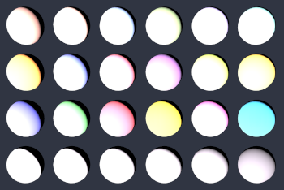
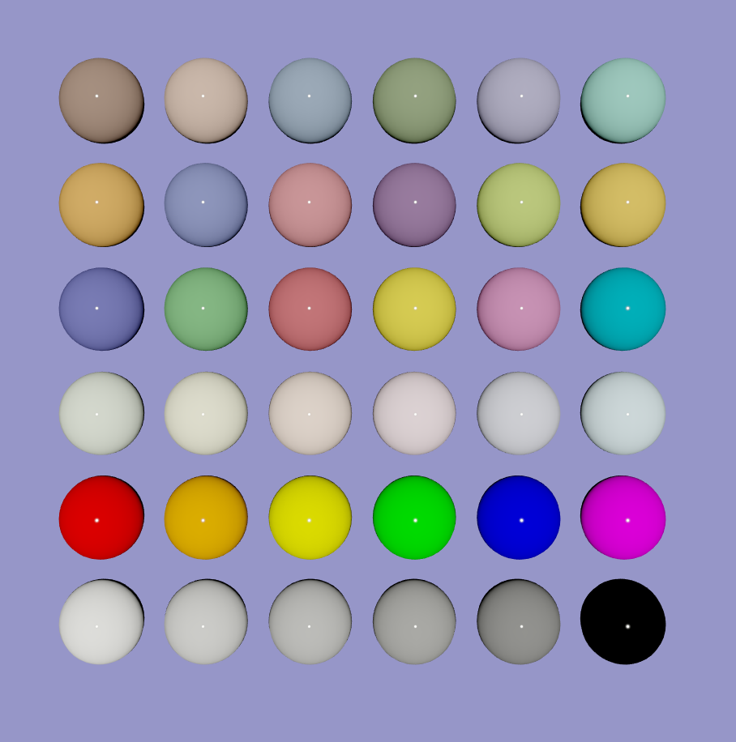
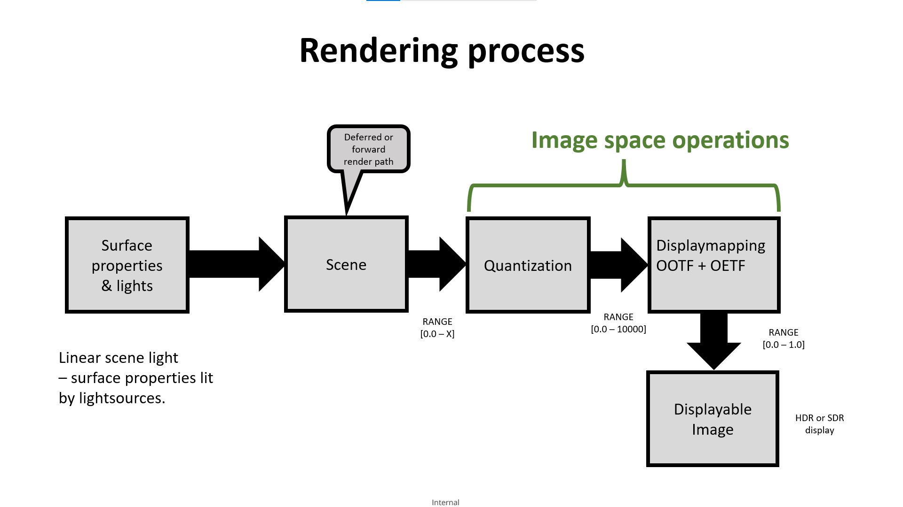
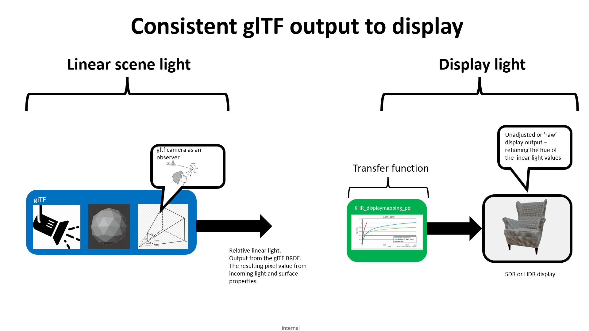
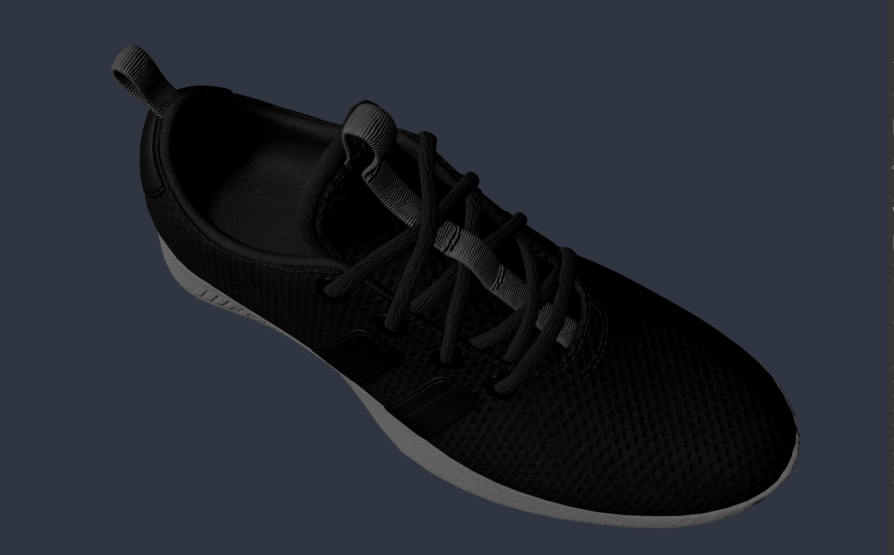
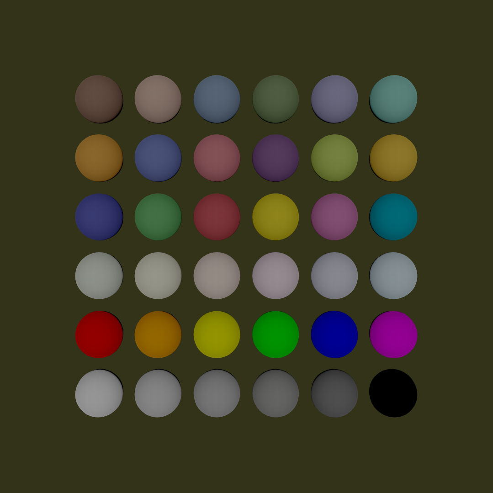
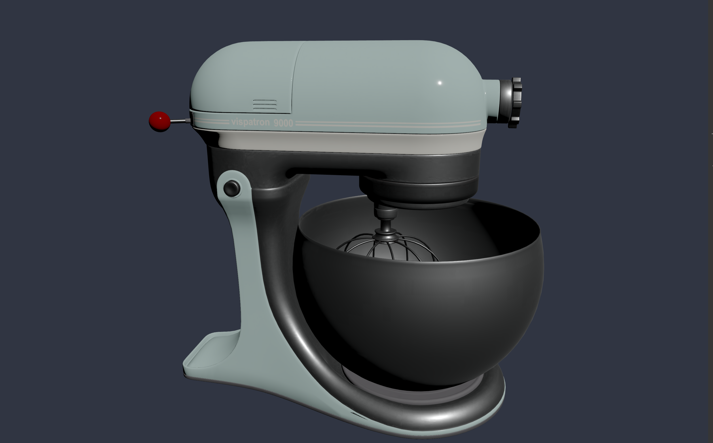
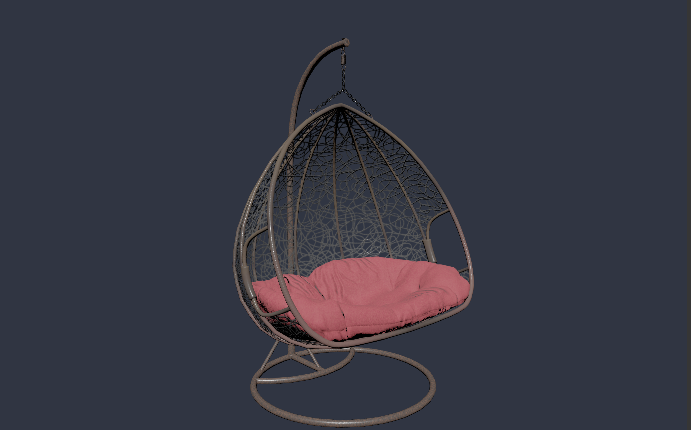

# KHR_displaymapping_pq

## Contributors

Rickard Sahlin, <mailto:rickard.sahlin@inter.ikea.com>  
Sebastien Vandenberghe, <mailto:sevan@microsoft.com>  
Gary Hsu, Microsoft, <mailto:garyhsu@microsoft.com>  
Ben Houston, ThreeKit, <mailto:bhouston@threekit.com>  
Alexey Knyazev [@lexaknyazev](https://github.com/lexaknyazev)  

Copyright (C) 2021 The Khronos Group Inc. All Rights Reserved. glTF is a trademark of The Khronos Group Inc.
See [Appendix](#appendix-full-khronos-copyright-statement) for full Khronos Copyright Statement.

## Status

Draft

## Dependencies

Written against the glTF 2.0 spec.

## Exclusions

## Overview

This extension is intended for implementations that targets a display with the goal of outputting realtime, or interactive, framerates in either HDR or SDR in a physically correct manner.   

The goal of this extension is to provide a way to convert the resulting (rendered) scene linear light output values to a known range {R,G,B} so that they can be sent to a display.  
One of the reasons for this is to retain the hue of the source materials under varying light conditions.  
Correct representation of hue is important in order to achieve a physically correct visualization and to retain original artistic intent.  

Currently the glTF specification does not define how to output pixels.  
This results in hue shift and white-out, due to clipping of pixel values as they are written to framebuffer.      
The result is not desirable when the goal is to display physically correct scenes.  


<figure>

<figcaption><em>Sample viewer reference implementation with one directional light at 100 lumen/m2.  
Notice how colors have been clipped and changed hue</em></figcaption>
</figure>


This extension sets out standardize the output from such a scene in a way that the result is predictable and retains hue.    
The intended use-case for this extension is when light contribution values are expected to go above 1.0 and the output values shall be mapped to an output range {R,G,B} that retains hue.  

When using this extension it is recommended that the light intensity is kept between 0 and 10 000 lumen/m2 in order to utilize the range of the Perceptual Quantizer.  

This extension does not declare user defined tone-mapping, s-curve, color lookup table (LUT) or similar as the process of applying these may be non pysically based and alter the energy conserving nature of the glTF BRDF.  

Another reason to provide means for deterministic brightness (light intensity) values is how the brain perceives brightness.
According to research (Bernstein et al. 2018) the mind's perception of brightness is mostly the same, regardless of object brightness.  
The difference in the perception of the object's brightness is based on background color.  
This means that in order to have deterministic control of perceived brightness it is important to be able to control both object and background color, for instance by a set light contribution range.  

This extension also provides the specification for using HDR compatible display outputs while at the same time retaining compatibility with SDR display outputs.  

Here the term renderer means a rendering engine that consits of a system wherein a buffer containing the pixel values for each frame is prepared. 
This buffer will be referred to as the framebuffer.  
The framebuffer can be of varying range, precision and colorspace. This has an impact on the color gamut that can be displayed.  

After completion of one framebuffer it is output to the display, this is usually done by means of a swap-chain. The details of how the swap works is outside the scope of this extension.  
KHR_displaymapping_pq specifies one method of mapping internal pixel values to that of the framebuffer.  

This extension does not take the viewing environment of the display, or eye light adaptation, into consideration.  
It is assumed that the content is viewed in an environment that is dimly lit (~5 cd / m2) without direct light on the display.  
Viewer calibration is not part of this extension as this is heavily dependant on the usecase and application.  

<figure>

<figcaption><em>Output using extension, one directional light at intensity 10 000 lumen/m2.
No clipping of color values, no change in hue.</em></figcaption>
</figure>

## Standard Considerations  

Why not use a standard such as ACES (Acadamy Color Encoding Specification)?

While the ACES does a very good job of defining how to capture, encode and process image data in a movie type of usecase -   
it does more than what is needed by this extension.  
ACES could potentially fit in an extension that has the purpose of defining a camera capture, image process and movie display usecase.  
However, for the usecase of this extension it is considered to add more functionality and complexity than is needed.    
This extension is similar to what is defined in the ACES `Output Device Transform` (ODT) which is a sub-step of the ACES 'Output Transform'    
Please not that the ACES Output Transform is explicitly not neutral in its appearance.  

In the field of tone-mapping ACES is sometimes referred to, however the specification is much broader than just a tone-mapping operator.  

[Good explanation of ACES](https://chrisbrejon.com/cg-cinematography/chapter-1-5-academy-color-encoding-system-aces/)


`The Academy Color Encoding Specification (ACES) defines a digital color image encoding appropriate for 
both photographed and computer-generated images. It is the common color encoding for the Academy 
Image Interchange Framework. In the flow of image data from scene capture to theatrical presentation, 
ACES data encode imagery in a form suitable for creative manipulation. Later points in the workflow 
provide forms suitable for critical viewing.`


### glTF asset considerations

The extension affects the output of the entire glTF asset, all scenes and nodes, included in a file that is using this extension.
This means that the current rendered scene shall be output using the displaymapping declared by this extension whenever the usecase is relevant, ie a realtime renderer with output to a display.  

Visualization of multiple glTF assets using this extension is supported and will produce a normative result.  

If the glTF asset contains multiple scenes, each one when rendered, shall be output using this extension.  

If the glTF asset contains this extension but no scene or model data then it may be treated as an enabler for displaymapping.  

### Integration points


This extension has the following integration points:  

1: Choose display type  
Decide wether display output and framebuffer format is HDR or SDR.  
If unknown then choose SDR.  
[See Display type](#display-type)  

2: Color source images  
If the display type is considered to be HDR (compatible with ITU BT.2020 color primaries) then color source images may need to be converted to ITU BT.2020 colorspace  
[See Color source images](#color-source-images)  

The following steps shall be performed before outputing the calculated pixel value (scene linear light).    
This would normally be done in the fragment shader.  

3: Scene aperture  
Scene linear light (normally fragment shader output value) pixel value shall be adjusted to get scaled scene linear light, [see scene aperture](#scene-aperture)      
The output from scene aperture calculations shall be used in the next step.  
[See Scene aperture](#scene-aperture)  


4: Perceptual Quantizer - reference OOTF  
Apply opto-optical transfer function (OOTF), this will apply the reference 'rendering intent'  
Input values are in scaled scene linear light in range {R,G,B} [0.0 - 1.0] and output values in the range {R,G,B} [0 - 10000]  

5:   Perceptural Quantizer - reference OETF  
Apply the opto-electrical transfer function (OETF).  
Input values are linear values in the range {R,G,B} [0 - 10000] and output is non-linear display values in range {R,G,B} [0.0 - 1.0]  


| Input         |   Function    | Output range  | Description   |
| ------------- | ------------- | ----------- |------------- |
| [0.0 - X]     | aperture      | 0 - 10 000  | Light adjusted for scene max intensity. |
| [0.0 - 1.0]   |     OOTF      | 0 - 10 000  | Reference PQ OOTF  |
| [0 - 10 000]  |     OETF      | [0.0 - 1.0] | Framebuffer output  |


**Implementation Notes**

Overview of where implementations may decide to perform the functions defined by this extension.


<figure>

<figcaption><em>Design flow of image space implementation. This shows where implementations may choose to apply the image space functions of this extension.</em></figcaption>
</figure>


### Motivation

Output pixel values from a rendered 3D model are generally in a range that is larger than that of a display device.  
This may not be a problem if the output is a high definition image format or some other target that has the same range and precision as the internal calculations.  
However, a typical usecase for realtime renderer implementations is that the output is a light emitting display.  
Such a display rarely has the range and precision of internal calculations making it necessary to map internal pixel values to match the characteristics of the output.  
This mapping is generally referred to as tone-mapping, however the exact meaning of tone-mapping varies and can also mean the process of applying artistic intent to the output.  
For that reason this document will use the term displaymapping.  

The displaymapping for this extension is chosen from ITU BT.2100 which is the standard for HDR TV and broadcast content creation.   
This standard uses the perceptual quantizer as transfer function, ie to go from scene linear values to non linear output values.  
The function is selected based on minimizing visual artefacts from color banding according to the Barten Ramp. Resulting on very slight visible banding on panels with 10 bits per colorchannel.  
On panels with 12 bits there is no visible banding artefacts when using the perceptual qantizer.  

The need for a known dynamic range comes from the way that the mind perceieves brightness.  
Humans have no way to determine exact brightness of objects, instead the brightness is measured compared to background (Bernstein et al.2018).  
As an effect of this it is important to know the mapped display brightness for a high dynamic range.  
Imagine a background with a scene linear brightness around RGB (10.0, 10.0, 10.0) with an object of scene linear brightness around RGB (100.0, 100.0, 100.0).  
As the mind will perceive object brightess compared to the background, ie 100 vs 10, it is vital to have a known higher dynamic range in order to achieve deterministic display output.     

Apart from being widely supported and used in the TV / movie industry the perceptual quantizer is also embraced by the gaming community, with support in the engines from some of the major game companies.  
For instance, game engines Frostbite and Lumberyard and also in specific games such as Destiny 2 and Call Of Duty.  

**Implementation Notes**

The extension is compatible with usecases where a different output is wanted.  
This could for instance be a viewer or engine that implements a physical camera or a post-processing step.  


<figure>

<figcaption><em>This extension affects the image processing step of realtime rendering.  
Viewers or engines may choose to implement physical camera, post-processing or other type of features in the world/scene or image space.  
The extension is fully compatible with such usecases</em></figcaption>
</figure>


## Internal range of light contribution values

This section describes how light contribution values shall be handled.  

When the KHR_displaymapping_pq extension is used all lighting and pixel calculations shall be done using the value 10000 (cd / m2) as the maximum ouput brightness.  
This does not have an impact on color texture sources since they define values as contribution factor.  
The value 10000 cd / m2 for an output pixel with full brightness is chosen to be compatible with the Perceptual Quantizer (PQ) used in the SMPTE ST 2084 transfer function.  

When using this extension light contribution values shall be aligned to account for 10000 cd/m2 as max output value, meaning that the range {R,G,B} is 0 to 10000.  
This means that content creators shall be aware of 10000 cd/m2 as the maximum value range.  
It does not mean that the display will be capable of outputing this light intensity.  


## Content creation and exporter considerations
 
This section describes how a content creator and exporter shall handle lightsources, such as point, directional, emissive or environment lights, that are saved with the model.  

As a content creator using this extension the light intensity value of 10 000 lumen / m2 shall be considered scene max intensity.  
This will give the benefit of a known increased light range as well as providing enough fidelity for most usecases.  
The below images show how light intensities roughly align with real world illumination.  


| Sunrise (400 lux) | Overcast (1500 lux) | Bright (5000 lux) | Sunny (10 000 lux) |
|-----|-----|-------|------|
|  |  |  |  |


A content creation tool supporting this extension shall sum upp light contribution for a scene before exporting to glTF, this can be a naive addition of all lights included in the scene that adds max values together.  
If scene max light contribution intensity is above 10000 there is a choice to downscale light values before export.  


## Display type

This section describes how to decide if display type is HDR or SDR.  

### HDR capable display


If the framebuffer format and colorspace is known to the implementation then a format and colorspace shall be chosen to preserve the range and precision of the SMPTE ST 2084 transfer function.  
If available, a framebuffer colorspace that is compatible with the color primaries of ITU BT.2020 shall be used.  
If this colorspace is used then the display output value that is written to the framebuffer shall be in a compatible colorspace.  

For HDR output, a range extension value of 59.5208 and gamma of 2.4 shall be used.  

**Implementation notes**

Conversion of color primaries to ITU BT.2020 could be done after loading of a PNG/JPEG and after the image has been gamma expanded from sRGB to linear.  
Another solution would be to perform render calculation in BT.709 colorspace and convert to target colorspace before writing out values to the framebuffer.  


### SDR capable display

If the framebuffer format or colorspace is not known, or none is available that preserves range, precision and color gamut then lower range framebuffer with sRGB colorspace may be used.  
This is to allow for compatibility with displays that does not support higher range and/or compatible colorspaces.  
It also allows for implementations where the details of the framebuffer is not known or available.  

A SDR capable display is defined as having less than 10 bits per pixel for each colorchannel.  

For SDR output,  a range extension value of 46.42 and gamma of 2.4 shall be used.  

## Color source images

If display type is considered to be HDR then color source images shall be converted to BT.2020 as needed.  
Exactly where this conversion takes place is up to implementations. 


### Color conversion matrix

Color conversion from BT.709 to BT.2020 is specified in ITU BT.2087  
https://www.itu.int/rec/R-REC-BT.2087/en

The M2 linear color conversion matrix is defined as:  
0.6274 0.3293 0.0433  
0.0691 0.9195 0.0114  
0.0164 0.0880 0.8956  


## Scene aperture


Scene aperture can be seen as a simplified automatic exposure control, without shutterspeed and ISO values...
If scene contains light contribution that goes above 10 000 then all lightsources will be scaled.  
It is not intended for gaming like usecases where the viewpoint and environment changes dramitically, for instance from dimly lit outdoor night environments to a highly illuminated hallway.  

This function is a way to avoid having too high scene brightess, that would result in clamping of output values.  

**Implementation Notes**

pseudocode for scene aperture calculation, this shall be performed before the reference OOTF.  
Meaning that the resulting `color` parameter shall be passed to BT_2100_OOTF.  

Where `lightIn` is the max scene or frame light contribution, ie the scene max intensity value.  

`lightIn = max(max(light.r, light.g), light.b)`  

`float maxComponent = 10000`  

```
vec3 aperture(float lightIn, vec3 colorIn) {
	float value = min(lightIn, maxComponent) 
	float factor = lightIn / value
	return colorIn * factor
}	

vec3 apertureAdjustedColor = aperture(lightIn, color)

```

Since knowledge of overall scene brightness values may be time-consuming to calculate exactly, implementations are free to approximate.  
This could be done by calculating the max scene value once, adding up punctual and environment lights and then using this value, not taking occlusion of lightrays into account.  
This value can be used until light contribution changes.  


## Perceptual Quantizer - reference OOTF


Opto-optical-transfer-function  
Input signal to the OOTF is the scene linear light. The OOTF maps relative scene linear light to display linear light.  
For more information see the ITU BT.2100 specification.  

Resulting linear scene light values (the pixel output) shall be mapped according to the parameter `Reference PQ OOTF` of ITU BT.2100 by applying the transform.   
The reference transform compatible with both SDR and HDR displays is described in ITU BT.2390 with the use of range extension and gamma values.  

```
E′ = G709[E] = pow(1.099 (rangeExtension * E), 0.45) – 0.099 for 1 > E > 0.0003024
               267.84 * E for 0.0003024 ≥ E ≥ 0
FD = G1886[E'] = pow(100 E′, gamma)
```


E {R, G, B} is the linear scene light value.  
Passed to the OOTF these values shall be in the range [0.0 - 1.0]  

Where the rangeExtension and gamma values shall be set according to HDR or SDR display.  
Note that if the target framebuffer is of a format that uses the sRGB transfer function, the gamma value may be excluded from the OOTF calculation.  

```
HDR
range extension = 59.5208  
gamma = 2.4  
```

```
SDR
range extension = 46.42  
gamma = 2.4  
```

**Implementation Notes** 

At the stage prior to OOTF, values shall have been adjusted for aperture.   

Depending on implementation of OOTF and OETF, RGB values may simply be scaled by 10000 before used in the OOTF.  


Pseudocode for BT.2100 reference OOTF  

`color`is in range [0.0 - 1.0]  

```
BT_2100_OOTF(color, rangeExponent, gamma) {  
    if (color <= 0.0003024) {  
        nonlinear = 267.84 * color;  
    else {  
        nonlinear = 1.099 * pow(rangeExponent * color, 0.45) - 0.099;  
    }  
    return 100 * pow(nonlinear, gamma);
}  

vec3 color = apertureAjustedColor
//If framebuffer uses sRGB transfer function the gamma does not need to be applied here
if (framebufferFormat is sRGB) {
    color = BT_2100(color, rangeExponent, 1)
} else {
    color = BT_2100(color, rangeExponent, gamma)
}


```

Where this is calculated per RGB component, note that the color value in this equation must be in range 0.0 - 1.0
It may be estimated that the display will not have the ability to output dark levels in the region of 0.0003024 in which case implementations may ignore that condition and use the same operator for the whole range 0.0 - 1.0  


## Perceptual Quantizer - reference OETF

To convert to non-linear output value in the range 0.0 - 1.0 the reference PQ OETF shall be used.  
This is specified in ITU BT.2100:
https://www.itu.int/rec/R-REC-BT.2100/en  

After the OOTF is applied the OETF shall be applied, this will yield a non linear output-signal in the range [0.0 - 1.0] that shall be stored in the display buffer.  
This shall be done according to the parameter `Reference PQ OETF`of ITU BT.2100    

Where the resulting non-linear signal (R,G,B) in the range [0:1] = E  

```
E = ((C1 + C2 * pow(FD / 10000, m1)) / (1 + C3 * pow(FD / 10000, m1))  ^ m2 

FD = output from the OOTF  
m1 = 2610/16384 = 0.1593017578125 
m2 = 2523/4096 * 128 = 78.84375 
c1 = 3424/4096 =0.8359375 = c3 − c2 + 1
c2 = 2413/4096 * 32 = 18.8515625
c3 = 2392/4096 * 32 = 18.6875
```


**Implementation notes**

Pseudocode for BT.2100 reference OETF  

`color` is in range {R,G,B} [0 - 10000]  

```
BT_2100_OETF(vec3 color) {
    Ypow = pow(rgb / 10000, m1);
    return pow((c1 + c2 * Ypow) / (1 + c3 * Ypow), m2); 
}
```


## Defining an asset to use KHR_displaymapping_pq

The `KHR_displaymapping_pq` extension is added to the root of the glTF.  

```json
{
  "extensions": {
    "KHR_displaymapping_pq" : {
    }
  }
}

```

## References

[Perceptual signal coding (PQ) explained by Dolby](https://pdfs.semanticscholar.org/presentation/e946/68cd54571e419a4440b85bc6e3f23ab99cb3.pdf)  

[ITU Rec BT 2100 Image parameter values for high dynamic range television for use in production and international programme exchange](https://www.itu.int/rec/R-REC-BT.2100)

[ITU Rec BT 2390 High dynamic range television for production and international programme exchange](https://www.itu.int/pub/R-REP-BT.2390)  

[PQ in the Frostbite engine by EA](https://www.youtube.com/watch?v=7z_EIjNG0pQ&list=PL3Bn4v5NMqSsbgK4Crj9YBzBSmeiTAGNT&index=1)  

[PQ in the Call Of Duty engine](https://www.youtube.com/watch?v=EN1Uk6vJqRw)  

[PQ in the Lumberyard engine](https://www.youtube.com/watch?v=LQlJGUcDYy4&t=1488s)  

[PQ in the Destiny 2 engine](https://www.youtube.com/watch?v=9jvhM8B63ng)  

## Appendix: Full Khronos Copyright Statement

Copyright 2021 The Khronos Group Inc.

Some parts of this Specification are purely informative and do not define requirements
necessary for compliance and so are outside the Scope of this Specification. These
parts of the Specification are marked as being non-normative, or identified as
**Implementation Notes**.

Where this Specification includes normative references to external documents, only the
specifically identified sections and functionality of those external documents are in
Scope. Requirements defined by external documents not created by Khronos may contain
contributions from non-members of Khronos not covered by the Khronos Intellectual
Property Rights Policy.

This specification is protected by copyright laws and contains material proprietary
to Khronos. Except as described by these terms, it or any components
may not be reproduced, republished, distributed, transmitted, displayed, broadcast
or otherwise exploited in any manner without the express prior written permission
of Khronos.

This specification has been created under the Khronos Intellectual Property Rights
Policy, which is Attachment A of the Khronos Group Membership Agreement available at
www.khronos.org/files/member_agreement.pdf. Khronos grants a conditional
copyright license to use and reproduce the unmodified specification for any purpose,
without fee or royalty, EXCEPT no licenses to any patent, trademark or other
intellectual property rights are granted under these terms. Parties desiring to
implement the specification and make use of Khronos trademarks in relation to that
implementation, and receive reciprocal patent license protection under the Khronos
IP Policy must become Adopters and confirm the implementation as conformant under
the process defined by Khronos for this specification;
see https://www.khronos.org/adopters.

Khronos makes no, and expressly disclaims any, representations or warranties,
express or implied, regarding this specification, including, without limitation:
merchantability, fitness for a particular purpose, non-infringement of any
intellectual property, correctness, accuracy, completeness, timeliness, and
reliability. Under no circumstances will Khronos, or any of its Promoters,
Contributors or Members, or their respective partners, officers, directors,
employees, agents or representatives be liable for any damages, whether direct,
indirect, special or consequential damages for lost revenues, lost profits, or
otherwise, arising from or in connection with these materials.

Khronos® and Vulkan® are registered trademarks, and ANARI™, WebGL™, glTF™, NNEF™, OpenVX™,
SPIR™, SPIR-V™, SYCL™, OpenVG™ and 3D Commerce™ are trademarks of The Khronos Group Inc.
OpenXR™ is a trademark owned by The Khronos Group Inc. and is registered as a trademark in
China, the European Union, Japan and the United Kingdom. OpenCL™ is a trademark of Apple Inc.
and OpenGL® is a registered trademark and the OpenGL ES™ and OpenGL SC™ logos are trademarks
of Hewlett Packard Enterprise used under license by Khronos. ASTC is a trademark of
ARM Holdings PLC. All other product names, trademarks, and/or company names are used solely
for identification and belong to their respective owners.
