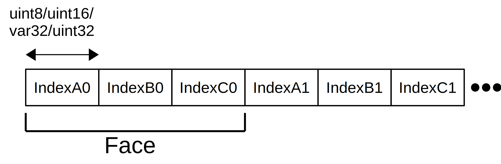
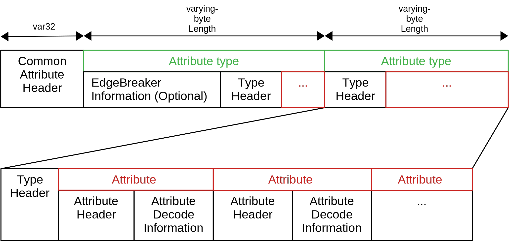

# Draco Bitstream Specification


This document defines the bitstream format and decoding process for the _Draco 3D Data Compression_ scheme.
The document is structured as follows. 
The first part describes the individual data blocks of a Draco compressed file. 
The second part shows the algorithmic details by giving pseudocode listing. 


# Draco File Format

All Draco encoded mesh files are comprised of four main sections. 
The first section is the header. 
An optional second section contains metadata. 
The third section contains the connectivity data. 
The fourth section contains the attribute data. 
Note, that each section has its own additional header to store specific data needed for the actual decoding algorithm.
Named sections are dependent upon each other, i.e., they have to be decoded in sequence.


<figure>
  
  <figcaption></figcaption>
</figure>


 
# Draco Header

Name | Type | Description
-|-|-
Draco String | `uint8[5]` | Must equal "DRACO"
Major version | `uint8` | Bitstream major version number
Minor version | `uint8` | Bitstream minor version number
Encoder type | `uint8` | `0`: Point cloud, `1`: Triangular mesh
Encoder method | `uint8` | `0`: Sequential encoding, `1`: Mesh EdgeBreaker encoding 
Flags | `uint16` | `0`: No flag, `0x8000`: Metadata present 


# Metadata

This section is only present if `DracoHeader.Flags` contains the flag `0x8000`.
It contains a list of metadata records which relate to specific attributes and a global metadata record. 
Each meta data record contains a name-value pair list together with a list of sub metadata records, forming a metadata record tree. 
Each sub metadata record is a name-metadata pair. 
The `i`'th  attribute metadata record relates the attribute referenced by the `i`'th attribute metadata id.

To avoid ambiguities, each id inside the attribute meta data id array must be unique. Otherwise, multiple meta data records would relate to the same attribute.

Name | Type
-|-
Count of metadata records | `var32`
Array of attribute meta data ids | `var32[]`
Array of attribute meta data records | `Metadata[]`
Global metadata | `Metadata`

`Metadata` designates a single metadata record. Each record can contain zero or more name-value entries. 
`Metadata` is a recursive type as it can contain zero or more sub metadata records where each sub metadata record is a name-metadata pair.

`Metadata`:

- Number of entries: `var32`
- Entry array:
	- Name size: `uint8`
	- Name: `int8[]`
	- Value size: `uint8`
	- Value: `int8[]`
- Number of sub metadata records: `var32`
- Sub meta data array:
	- Name size: `uint8`
	- Name: `int8[]`
	- Sub metadata: `Metadata` (Here, the type recurses. This is not a reference or index.)


# Connectivity  


In general, the Draco file format stores connectivity and geometry information separately. 
In this section, it is shown how connectivity information is stored and how this connectivity information is used to construct individual faces.

Draco files support multiple encoding methods. 
Sequential connectivity encoding methods preserve the order of the underlying data, whereas usually higher compression rates can be expected when using the EdgeBreaker algorithm.
 
Which algorithm was used to encode the connectivity is defined by `encoder_method` (stored in the Draco header):

Based on this, the correct connectivity decoder has to be chosen:
* `MESH_SEQUENTIAL_ENCODING`: Sequential Connectivity 
* `MESH_EDGEBREAKER_ENCODING`:  Edgebreaker Connectivity 

If the sequential connectivity method was used to encode the data, indices of faces are stored subsequently whereas the EdgeBreaker connectivity requires a specialized traversing scheme to reconstruct the connectivitiy of vertices. 
The following chart shows an overview of possible connectivity encoding formats that are used in Draco compressed files.

<figure>
  
  <figcaption></figcaption>
</figure>

## Sequential Connectivity

The sequential connectivity block starts with a preceding header that defines the encoding and the number of elements contained in the subsequent index block. 

<figure>
  
  <figcaption>Sequential connectivity format.</figcaption>
</figure>


The header block of sequential connectivity information contains a fixed number of variables.

| Variable        | Data Type           | Description|
| ------------- |:-------------:|:-------------:|  
| num_faces      |          `var32`          | Stores the overall number of faces |
|  num_points       |           `var32`          | Stores the overall number of points |
|  connectivity_method  |               `uint8`          |`0`: Compressed indices, `1`: Uncompressed indices |
 

This information is used to interpret the index block, which can be either compressed (`connectivity_method` equals 0) or uncompressed (`connectivity_method` equals 1). 


#### Uncompressed Sequential Indices

The data type of index elements is dependent on the overall number of points that have to be addressed. 
Hence, before parsing sequential indices, the data type of one index element has to be evaluated depending on the maximum number of points (num_points) in order to use a minimum viable size. 
The size of the data type is one to four bytes. Given the overall number of points, the following table shows the related data type format.


|  num_points       |    Required Bytes  |    Index Element Data Type    | 
| ----------------- |:------------------:| :----------------------------:| 
| 2^8     (256)     |  1                 |             `uint8`          | 
| 2^16    (65536)   |  2                 |             `uint16`         | 
| 2^21  (2097152)   |  3                 |             `var32`          | 
| 2^32 (4294967296) |  4                 |             `uint32`         | 
 
With this information, the size of the uncompressed sequential index block is given by the size of one index element data type and the number of faces:
		
	sequential_index_block_size = sizeof(index_element) * num_faces * 3


One face is defined by exactly three point indices, hence, forming a triangle when substituting respective indices with point data. 
Three indices forming one face are stored subsequently. 


<figure>
  
  <figcaption></figcaption>
</figure>


#### Compressed Sequential Indices 
<!---
Simplify this section?
-->

The compression of sequential indices is based on the algorithm shown by Jarek Duda in
*Asymmetric numeral systems: entropy coding combining speed of Huffman coding with compression rate of arithmetic coding* (2014):
https://arxiv.org/pdf/1311.2540.pdf
Specifically, the range variant (__rANS__) is used for compression, which is suitable for large coding alphabets. 

The decompressed data of size *num_faces * 3 * sizeof( uint32 )* stores index differences, for what reason the uint32 value has to be reinterpreted to a signed value.
The conversion from raw buffer values to signed integer values is done by shifting the bits to the right by one digit. 
The consumed rightmost bit determines the sign of the value respectively (1 represents a negative value, 0 represents a positive value). 
Obtained signed integer values represent the differences of subsequent indices. 
This means, an additional interim stage is needed to generate index values by stepping through the buffer and summing up the values. 
At each buffer position, the current sum represents the absolute index value.


<!---

1) Decompress -> Buffer of uint32[num_faces*3]
2) uint32 -> int32 (by consuming rightmost bit)
3) Index Differences -> Indices

The compression comprises two steps. 
At first, the index difference is calculated. This is based on the idea of usually encountering small differences between subsequent indices. 


Comment:

Decoded Index Element in draco source code C++  == uint32      
Meaning of Rightshift operation (>>)?
From C++ Code:
uint32_t encoded_val = indices_buffer[vertex_index++];
int32_t index_diff = (encoded_val >> 1);

ABCD >> 1 ==  0ABC ??

vs
From Spec: 
"Bits shifted into the MSBs as a result of the right shift have a value equal to the MSB of a prior to the shift operation."
ABCD >> 1 ==  AABC ??


	void DecodeSequentialCompressedIndices() 
	{
	  DecodeSymbols(num_faces * 3, 1, &decoded_symbols); //num_symbols, num_components, out_values
	  last_index_value = 0;
	  for (i = 0; i < num_faces; ++i) 
	  {
		for (j = 0; j < 3; ++j) 
		{
		  encoded_val = decoded_symbols[i * 3 + j];
		  index_diff = (encoded_val >> 1); //shift to the right. first bit is thrown away in this step? see rightshift definition mismatch
		  if (encoded_val & 1)
			index_diff = -index_diff;
		  val = index_diff + last_index_value;
		  face_to_vertex[j][i] = val;
		  last_index_value = val;
		}
	  }
	}


-->


<figure>
  
  <figcaption></figcaption>
</figure>


## EdgeBreaker Connectivity
<!---
Where can we find information?
Section 7  ->  EdgeBreaker Decoder
Section 8  ->  EdgeBreaker Traversal
Section 9  ->  EdgeBreaker Traversal Valence
Section 10 ->  EdgeBreaker Traversal Prediction Degree

Master function: DecodeEdgebreakerConnectivityData
1) Header Block 
* ParseEdgebreakerConnectivityData 
  
2) Topology Split Events 
* ParseTopologySplitEvents
* ProcessSplitData();

3)  EdgebreakerTraversalStart 

	Traversal data is loaded in this section
* 8.5 EdgebreakerTraversalStart:
  * DecodeEdgebreakerTraversalStandardData()
  * EdgeBreakerTraversalValenceStart()

4)  DecodeEdgeBreakerConnectivity

	In this section, the actual connectivity is constructed. 
* =spirale reversi paper algortihm????
* =mesh_edgebreaker_decoder_impl.h ???

-->
Another possibility to describe the connectivity of vertices is a sequence of symbols that describe a traversal scheme, which is specialized for meshes. 
An efficient decompression algorithm is described by Isenburg and Snoeyink in *Spirale Reversi: Reverse decoding of the Edgebreaker encoding* in 2001.
This algorithm, however, traverses the symbols in reverse order. 
To speed up decoding, all symbols in Draco files are encoded in reverse order, i.e., they can be used directly for constructing the connectivity without prior reordering.
Draco encoded files feature two different EdgeBreaker traversal types, that require specific data blocks. 
The used EdgeBreaker traversal type is denoted in the EdgeBreaker header data block. 
In the following, required data blocks and their respective order used for standard EdgeBreaker traversal and valence EdgeBreaker traversal are shown. 
Afterwards, contained data blocks are described in detail. 


####  Standard EdgeBreaker 

The EdgeBreaker connectivity section is composed of five sections. 
The first section is the connectivity header. 
The second section is the encoded topology split data.
The third section is the encoded EdgeBreaker symbol data. 
The fourth section is the encoded start face configuration data. 
The fifth section is the attribute connectivity data.


<figure>
  
  <figcaption></figcaption>
</figure>


####  Valence EdgeBreaker 

 
The valence EdgeBreaker connectivity adds one section after the attribute connectivity data. 
This section provides context data for the valence prediction (_Valence Context Data_).
The symbol data block, however, is removed compared to the standard EdgeBreaker data structure. 


<figure>
  
  <figcaption></figcaption>
</figure>


#### EdgeBreaker Header


| Variable						| Data Type     | Description									|
| ----------------------------- |:-------------:|:---------------------------------------------:|  
|  edgebreaker_traversal_type	|   `uint8`		| STANDARD_EDGEBREAKER, VALENCE_EDGEBREAKER		|
|  num_encoded_vertices			|   `var32`	    | Number of encoded vertices					|
|  num_faces					|   `var32`	    | Number of encoded faces						|
|  num_attribute_data			|   `uint8`	    | Number of encoded attributes					|
|  num_encoded_symbols			|   `var32`	    | Number of encoded EdgeBreaker symbols, which form the sequence   |
|  num_encoded_split_symbols    |   `var32`	    | Number of encoded EdgeBreaker split symbols	|

Based on `edgebreaker_traversal_type`, the correct EdgeBreaker decoding method has to be chosen. 
Note, that different data blocks have to be loaded for standard and valence EdgeBreaker.


#### Split Data


Topological split events that can not be reconstructed via EdgeBreaker symbols are stored separately. 
At first,  one var32 value (`num_topology_splits`) is loaded that determines the number of topological split events . 
Using this value, delta values of split IDs (var32) and source IDs (var32) are loaded, i.e., one `source_id_delta` value and one `split_id_delta` value is loaded interleaved `num_topology_splits` times as shown in the following figure.  
Afterwards, `num_topology_splits` bits are read from the file that are stored in the array `source_edge_bit`. 
After reading those bits, the file reader is padded to the following byte. 

<figure>
  
  <figcaption></figcaption>
</figure>

------

Before loaded split events can be interpreted during EdgeBreaker traversal, delta values have to be converted to absolute values. 
The following loaded arrays are used to calculate absolute IDs: `source_id_delta[num_topology_splits]`, `split_id_delta[num_topology_splits]`

For all values in the array `source_id_delta` an entry in the array `source_symbol_id` is created by accumulating all values until that entry:

    source_symbol_id[i] = source_id_delta[0] + ... + source_id_delta[i]  // for all i in [0 .. num_topology_splits]
<!---
7.5.ProcessSplitData   
  
Note, that these sums can be calculated by using a helper variable that is accumulated in a loop that assigns respective values.
-->

The split symbol IDs in the array `split_symbol_id` are calculated by subtracting loaded `split_id_delta` values from previously calculated `source_symbol_id` values:

    split_symbol_id[i] = source_symbol_id[i]  - split_id_delta[i];  // for all i in [0 .. num_topology_splits]


<!---

Overall, the following data is provided for EdgeBreaker traversal and connectivity decoding: 

* `source_symbol_id[num_topology_splits]` 
* `split_symbol_id[num_topology_splits]` 
* `source_edge_bit[num_topology_splits]` 
-->

<!---

### EdgeBreaker Traversal Data

Dependent on the EdgeBreaker header attribute `edgebreaker_traversal_type`, either standard traversal or valence EdgeBreaker traversal is accomplished.
Before the connectivity can be reconstructed, traversal type dependent data has to be loaded as shown in the next sections. 

* If `edgebreaker_traversal_type` is `STANDARD_EDGEBREAKER`, data is loaded as described in section *Standard EdgeBreaker Traversal Data*.
* If `edgebreaker_traversal_type` is `VALENCE_EDGEBREAKER`, data is loaded as described in section *Valence EdgeBreaker Traversal Data*.


#### Standard EdgeBreaker Traversal Data

[//]: # (8.4. DecodeEdgebreakerTraversalStandardData)

The standard EdgeBreaker algorithm requires the following data:
* Symbol data (`eb_symbol_buffer`)
* Face data (`eb_start_face_buffer`)
* Attribute connectivity data (for each attribute one `attribute_connectivity_decoders_buffer`)
-->


#### Standard Symbol Data
<!---
[//]: # ( 8.1 ParseEdgebreakerTraversalStandardSymbolData )
[//]: # ( -> initializes eb_symbol_buffer of size [eb_symbol_buffer_size])  
-->

To load the symbols required for the EdgeBreaker traversal, at first, a var64 value is loaded that defines the size of the symbol buffer in bytes. 
Afterwards, that number of bytes is loaded into the buffer `eb_symbol_buffer`.

<!---
[ToDo] Pseudocode and implementation do not read symbol data in case of edgebreaker_traversal_type==VALENCE_EDGEBREAKER. 
->Valence edgebreaker figure is wrong?

-->

<!---
 
The previous sections have defined, how data has to be loaded. 
In this section, the interpretation of the data is described based on the EdgeBreaker algorithm to decode the actual connectivity.

Additionally, a global array `is_vert_hole_` of size `num_encoded_vertices` + `num_encoded_split_symbols` and type bool is filled in this section to detect vertices that are located at the surface boundary. 
Initially, for all entries of that array are set to *true*.
-->


The actual symbols are stored in `eb_symbol_buffer` with a specific bit pattern. 
This is why the size of encoded symbols is not directly related to the size of the symbol buffer (`eb_symbol_buffer`). 
The number of actual EdgeBreaker symbols `num_encoded_symbols` is specified in the EdgeBreaker header.

<!---
With respect to the selected traversal type `edgebreaker_traversal_type`, which is also specified in the EdgeBreaker header, the symbol is decoded for the valence EdgeBreaker or the standard EdgeBreaker algorithm.

edgebreaker_traversal_type is VALENCE_EDGEBREAKER or STANDARD_EDGEBREAKER 

In this routine, one symbol after the other is loaded until `num_encoded_symbols` have been decoded. 
In the case of standard EdgeBreaker traversal, i.e., `edgebreaker_traversal_type` is `STANDARD_EDGEBREAKER`, 
-->

The decoding of individual symbols consists of two steps.
At first, one bit is read from `eb_symbol_buffer`. 
If this bit equals *0*, the current symbol is of type `TOPOLOGY_C` and no additional bits have to be read to decode this symbol. 
If the bit equals *1*, two additional bits are read. 
The following table shows the mapping of these 3 read bits to a topology symbol and symbol ID:


|Topology Symbol| Bit Pattern   | Topology ID |
| ------------- |:-------------:|:---------:|  
|  TOPOLOGY_C	|   0			|0
|  TOPOLOGY_S   |   100			|1
|  TOPOLOGY_L   |   110			|2
|  TOPOLOGY_R	|   101         |3
|  TOPOLOGY_E   |   111         |4

<!---
For each decoded symbol, the current symbol ID, i.e., a counter that is incremented for each decoded symbol, and the ID of the active corner (the current symbol ID multiplied by 3) are processed together with the decoded topology symbol in the following way:
-->


#### Start Face Data
<!---
8.2 ParseEdgebreakerTraversalStandardFaceData )
  initializes eb_start_face_buffer of size [eb_start_face_buffer_size])
-->
To load the face data required for the EdgeBreaker traversal, at first, a uint8 value is loaded into `eb_start_face_buffer_prob_zero`.
Then, a var32 value is loaded that defines the number of start face IDs. 
That number of start face IDs of type uint8 is loaded into the buffer `eb_start_face_buffer`.


#### Attribute Connectivity Data
<!---
8.3 ParseEdgebreakerTraversalStandardAttributeConnectivityData )
-> for  i = 0; i < num_attribute_data; ++i) 
-> initializes attribute_connectivity_decoders_buffer[i] with size specified in attribute_connectivity_decoders_size[i])
-->
The number of attribute connectivity data that has to be loaded is defined in the EdgeBreaker header by the variable `num_attribute_data`.
For each attribute data element `i`, i.e., `num_attribute_data` times, a porobability value of type uint8 is loaded into `attribute_connectivity_decoders_prob_zero[i]`, 
a var32 value is loaded that indicates the number of connectivity decoders (`attribute_connectivity_decoders_size[i]`), 
and that number of uint8 values is loaded into `attribute_connectivity_decoders_buffer[i]`.

These buffers are used to decode the attribute seams.

<!---
 see 13.1 DecodeAttributeSeams)
-->

#### Valence Context Data

Valence context data contains for each unique valence a number of symbols, stored in separate arrays. 
During traversal, the current valence context is calculated to lookup the current symbol from loaded context arrays. 
The number of unique valences is predefined in a constant `NUM_UNIQUE_VALENCES` = 6.
For each unique valence, at first, a `var32` is loaded that specifies the number of valence context symbols (`ebv_context_counters[i]`).
Then, that number of symbols is obtained by decoding a __rANS__ encoded data block.  
 
<!---
[ToDo] Add figure?
--->

<!---

constant:  NUM_UNIQUE_VALENCES = 6
 
for (i = 0; i < NUM_UNIQUE_VALENCES; ++i)
{
	ebv_context_counters[i]  = load  var32

	if (ebv_context_counters[i] > 0) 
	{
		DecodeSymbols(ebv_context_counters[i], 1, &ebv_context_symbols[i]);
	}
}
--
void DecodeSymbols(num_symbols, num_components, out_values) 
{
 scheme                                                                              UI8
 if (scheme == TAGGED_SYMBOLS) 
 {
    DecodeTaggedSymbols(num_symbols, num_components, out_values);
 } 
 else if (scheme == RAW_SYMBOLS) 
 {
    DecodeRawSymbols(num_symbols, out_values);
 }
}

-->


# Attributes

The attributes data contains two sections. The first section is the attribute header. 
The second section is comprised of one or more attribute types, such as positions, texture coordinates, normals.
Each attribute type section is comprised of one or more unique attributes.

<figure>
  
  <figcaption>Attribute data format.</figcaption>
</figure>


Attributes layout description:

- Number of attributes types: `uint8`
- An array of descriptions for each attribute type to define decoding parameters if EdgeBreaker is the used encoding method. 
	
    Each array entry  contains:
	- Data id: `uint8`
	- Decoder type: `uint8`
	`0` Vertex attribute, `1` Corner attribute
	- Traversal mode: `uint8`
	`0` Depth first traversal, `1` Prediction degree traversal
- The attribute type array.
	- Number of attributes for current type: `var32`
	- The attribute array.
		- Attribute type: `uint8`
		`0` Position, `1` Normal, `2` Color, `3` Texture coordinate, `4` Generic
		- Data type: `uint8`
		`1` signed 8-bit, `2` unsigned 8-bit,
		`3` signed 16-bit, `4` unsigned 16-bit,
		`5` signed 32-bit, `6` unsigned 32-bit,
		`7` signed 64-bit, `8` signed 64-bit,
		`9` 32-bit single precision floating point,
		`10` 64-bit double precision floating point,
		`11` 8-bit Boolean
		- Number of components: `uint8`
		- Normalized: `uint8`
		- Attribute id: `var32`
		Must uniquely identify this attribute across all attributes of all attribute types.
	- Array of sequential attribute encoding for each attribute.
		- Sequential attribute encoding: `uint8`
		`0` Generic, `1` Integer, `2` Quantization, `3` Normals

<!---
Attributes data itself has to be decoded.

[ToDo]: remove deprecated?
--->
Attribute:
- Prediction scheme: `int8`
	- `-2` None: There is no attribute data
	- `0` Difference: Implies that the attribute entries have two components.
	- `1` Parallelogram
	- `2` Multi parallelogram
	- `3` Texture coordinates (deprecated)
	- `4` Constrained multi parallelogram
	- `5` Texture coordinates portable 
	- `6` Geometric normal
- Prediction transform type, if the prediction scheme is not *None*.
	- `-1` None
	- `0` Delta
	- `1` Wrap: (currently the only supported prediction transform type by github.com/google/draco)
	- `2` Normal octahedron
	- `3` Canonicalized normal octahedron
- Flag whether values are compressed: `uint8`
- If compression flag is set:
	- Scheme: `uint8`
		- `0` Tagged: Each symbol is preceded by a fix-length (5-bit?) bit-length variable defining the bit length of the actual value following the tag.
		- `1` Raw: Each symbol value has the same fixed bit-length. Accepted bit length are `[1, 18]`.


<!---
## Parse Attribute Decoders Data
Loading data from file

EdgeBreaker data:

i: num_attributes_decoders

	att_dec_data_id[i]                                                              UI8
	att_dec_decoder_type[i]                                                         UI8
	att_dec_traversal_method[i]                                                     UI8

General attribute data:

i: num_attributes_decoders  
j: att_dec_num_attributes[i]

	att_dec_num_attributes[i]                                                       varUI32
	att_dec_att_type[i][j]                                                          UI8
	att_dec_data_type[i][j]                                                         UI8
	att_dec_num_components[i][j]                                                    UI8
	att_dec_normalized[i][j]                                                        UI8
	att_dec_unique_id[i][j]                                                         varUI32
	seq_att_dec_decoder_type[i][j]                                                  UI8 
	
	
-->


# Decoding Algorithm

The following section describes the complete decoding process of a Draco encoded file.

## Conventions


### Variable Types

All integer and floating point formats are little endian.

- `float` is IEEE 754 Single precision.
- `var32` is an unsigned 32-bit integer encoded using LEB128.
- `var64` is an unsigned 64-bit integer encoded using LEB128.
- `f{n}` is an unsigned `n`-bit number with decreasing digit place value. The number is appended by padding bits to the next byte so that data remains byte-aligned.

### Operations 


#### Arithmetic operators

|          |         |
|:--------:| ------- |
| `+`      | Addition
| `–`      | Subtraction (as a binary operator) or negation (as a unary prefix operator)
| `*`      | Multiplication
| `/`      | Division
| `a % b`  |  Remainder from division of `a` by `b`. Both `a` and `b` are positive integers.

#### Logical operators

|          |         |
|:--------:| ------- |
| `a && b` | Logical AND operation between `a` and `b`
| `a || b` | Logical OR operation between `a` and `b`
| `!`      | Logical NOT operation.


#### Relational operators


|          |         |
|:--------:| ------- |
| `>`      | Greater than
| `>=`     | Greater than or equal to
| `<`      | Less than
| `<=`     | Less than or equal to
| `==`     | Equal to
| `!=`     | Not equal to

#### Bitwise operators


|          |         |
|:--------:| ------- |
| `&`      | AND operation
| `|`      | OR operation
| `~`      | Negation operation
| `a >> b` | Shift `a` in 2's complement binary integer representation format to the right by `b` bit positions. This operator is only used with `b` being a non-negative integer. Bits shifted into the MSBs as a result of the right shift have a value equal to the MSB of `a` prior to the shift operation.
| `a << b` | Shift `a` in 2's complement binary integer representation format to the left by `b` bit positions. This operator is only used with `b` being a non-negative integer. Bits shifted into the LSBs as a result of the left shift have a value equal to `0`.


#### Assignment

|          |         |
|:--------:| ------- |
| `=`      | Assignment operator
| `++`     | Increment, `x++` is equivalent to `x = x + 1`. When this operator is used for an array index, the variable value is obtained before the auto increment operation
| `--`     | Decrement, i.e. `x--` is equivalent to `x = x - 1`. When this operator is used for an array index, the variable value is obtained before the auto decrement operation
| `+=`     | Addition assignment operator, for example `x += 3` corresponds to `x = x + 3`
| `-=`     | Subtraction assignment operator, for example `x -= 3` corresponds to `x = x - 3`


#### Mathematical functions


The following mathematical functions are defined as follows:

[ToDo: use images in MarkDown for math formulas?]

<script type="math/asciimath">
"Abs"(x)={[x;,x >= 0],[-x;,x<0]}
</script>

<br>

<script type="math/asciimath">
"Min"(x,y)={[x;,x<=y],[y;,x>y]}
</script>

<br>

<script type="math/asciimath">
"Max"(x,y)={[x;,x>=y],[y;,x<y]}
</script>


#### Method of describing bitstream syntax

Each syntax element is described by its name (using only lower case letters
with underscore characters) and a descriptor for its method of coded
representation. The decoding process behaves according to the value of the
syntax element and to the values of previously decoded syntax elements.

In some cases the syntax tables may use the values of other variables derived
from syntax elements values.

### Constants


* Mesh encoding methods
  * 0: MESH_SEQUENTIAL_ENCODING
  * 1: MESH_EDGEBREAKER_ENCODING

* Metadata constants
  * 32768: METADATA_FLAG_MASK

* Sequential attribute encoding methods
  * 0: SEQUENTIAL_ATTRIBUTE_ENCODER_GENERIC
  * 1: SEQUENTIAL_ATTRIBUTE_ENCODER_INTEGER
  * 2: SEQUENTIAL_ATTRIBUTE_ENCODER_QUANTIZATION
  * 3: SEQUENTIAL_ATTRIBUTE_ENCODER_NORMALS

* Sequential indices encoding methods
  * 0: SEQUENTIAL_COMPRESSED_INDICES
  * 1: SEQUENTIAL_UNCOMPRESSED_INDICES

* Prediction encoding methods
  * -2: PREDICTION_NONE
  * 0: PREDICTION_DIFFERENCE
  * 1: MESH_PREDICTION_PARALLELOGRAM
  * 4: MESH_PREDICTION_CONSTRAINED_MULTI_PARALLELOGRAM
  * 5: MESH_PREDICTION_TEX_COORDS_PORTABLE
  * 6: MESH_PREDICTION_GEOMETRIC_NORMAL

* Prediction scheme transform methods
  * 1: PREDICTION_TRANSFORM_WRAP
  * 3: PREDICTION_TRANSFORM_NORMAL_OCTAHEDRON_CANONICALIZED

* Mesh traversal methods
  * 0: MESH_TRAVERSAL_DEPTH_FIRST
  * 1: MESH_TRAVERSAL_PREDICTION_DEGREE

* Mesh attribute encoding methods
  * 0: MESH_VERTEX_ATTRIBUTE
  * 1: MESH_CORNER_ATTRIBUTE

* EdgeBreaker encoding methods
  * 0: STANDARD_EDGEBREAKER
  * 2: VALENCE_EDGEBREAKER

* EdgeBreaker constants
  * -1: kInvalidCornerIndex
  * 0: LEFT_FACE_EDGE
  * 1: RIGHT_FACE_EDGE
  * 2: kTexCoordsNumComponents
  * 4: kMaxNumParallelograms
  * 3: kMaxPriority

* EdgeBreaker bit pattern constants
  * 0: TOPOLOGY_C
  * 1: TOPOLOGY_S
  * 3: TOPOLOGY_L
  * 5: TOPOLOGY_R
  * 7: TOPOLOGY_E

* Valence EdgeBreaker constants
  * 2: MIN_VALENCE
  * 7: MAX_VALENCE
  * 6: NUM_UNIQUE_VALENCES

* ANS constants
  * 256: rabs_ans_p8_precision
  * 1024: rabs_ans_p10_precision
  * 4096: rabs_l_base
  * 256: IO_BASE
  * 4096: L_RANS_BASE
  * 16384: TAGGED_RANS_BASE
  * 4096: TAGGED_RANS_PRECISION

* Symbol encoding methods
  * 0: TAGGED_SYMBOLS
  * 1: RAW_SYMBOLS


## 1 Draco Decoder


### 1.1 Decode()

```c++
void Decode() {
  ParseHeader();
  if (flags & METADATA_FLAG_MASK)
    DecodeMetadata();
  DecodeConnectivityData();
  DecodeAttributeData();
}
```

### 1.2 ParseHeader()

```c++
ParseHeader() {
  draco_string                                                                       | UI8[5]
  major_version                                                                      | UI8
  minor_version                                                                      | UI8
  encoder_type                                                                       | UI8
  encoder_method                                                                     | UI8
  flags                                                                              | UI16
}
```

## 2 Metadata Decoder


### 2.1 DecodeMetadata()

```c++
void DecodeMetadata() {
  ParseMetadataCount();
  for (i = 0; i < num_att_metadata; ++i) {
    ParseAttributeMetadataId(i);
    DecodeMetadataElement(att_metadata[i]);
  }
  DecodeMetadataElement(file_metadata);
}
```

### 2.2 ParseMetadataCount()

```c++
void ParseMetadataCount() {
  num_att_metadata                                                                   | varUI32
}
```

### 2.3 ParseAttributeMetadataId()

```c++
void ParseAttributeMetadataId(index) {
  att_metadata_id[index]                                                             | varUI32
}
```

### 2.4 ParseMetadataElement()

```c++
void ParseMetadataElement(metadata) {
  metadata.num_entries                                                               | varUI32
  for (i = 0; i < metadata.num_entries; ++i) {
    sz = metadata.key_size[i]                                                        | UI8
    metadata.key[i]                                                                  | I8[sz]
    sz = metadata.value_size[i]                                                      | UI8
    metadata.value[i]                                                                | I8[sz]
  }
  metadata.num_sub_metadata                                                          | varUI32
}
```

### 2.5 ParseSubMetadataKey()

```c++
void ParseSubMetadataKey(metadata, index) {
  sz = metadata.sub_metadata_key_size[index]                                         | UI8
  metadata.sub_metadata_key[index]                                                   | I8[sz]
}
```

### 2.6 DecodeMetadataElement()

```c++
void DecodeMetadataElement(metadata) {
  ParseMetadataElement(metadata);
  for (i = 0; i < metadata.num_sub_metadata; ++i) {
    ParseSubMetadataKey(metadata, i);
    DecodeMetadataElement(metadata.sub_metadata[i]);
  }
}
```

## 3 Connectivity Decoder


### 3.1 DecodeConnectivityData()

```c++
void DecodeConnectivityData() {
  if (encoder_method == MESH_SEQUENTIAL_ENCODING)
    DecodeSequentialConnectivityData();
  else if (encoder_method == MESH_EDGEBREAKER_ENCODING)
    DecodeEdgebreakerConnectivityData();
}

```

## 4 Sequential Connectivity Decoder


### 4.1 ParseSequentialConnectivityData()

```c++
void ParseSequentialConnectivityData() {
  num_faces                                                                          | varUI32
  num_points                                                                         | varUI32
  connectivity_method                                                                | UI8
}
```

### 4.2 ParseSequentialIndicesUI8()

```c++
void ParseSequentialIndicesUI8() {
  for (i = 0; i < num_faces; ++i) {
    for (j = 0; j < 3; ++j) {
      face_to_vertex[j][i]                                                           | UI8
    }
  }
}
```

### 4.3 ParseSequentialIndicesUI16()

```c++
void ParseSequentialIndicesUI16() {
  for (i = 0; i < num_faces; ++i) {
    for (j = 0; j < 3; ++j) {
      face_to_vertex[j][i]                                                           | UI16
    }
  }
}
```

### 4.4 ParseSequentialIndicesVarUI32()

```c++
void ParseSequentialIndicesVarUI32() {
  for (i = 0; i < num_faces; ++i) {
    for (j = 0; j < 3; ++j) {
      face_to_vertex[j][i]                                                           | varUI32
    }
  }
}
```

### 4.5 ParseSequentialIndicesUI32()

```c++
void ParseSequentialIndicesUI32() {
  for (i = 0; i < num_faces; ++i) {
    for (j = 0; j < 3; ++j) {
      face_to_vertex[j][i]                                                           | UI32
    }
  }
}
```

### 4.6 DecodeSequentialIndices()

```c++
void DecodeSequentialIndices() {
  if (num_points < 256) {
    ParseSequentialIndicesUI8();
  } else if (num_points < (1 << 16)) {
    ParseSequentialIndicesUI16();
  } else if (num_points < (1 << 21)) {
    ParseSequentialIndicesVarUI32();
  } else {
    ParseSequentialIndicesUI32();
  }
}
```

### 4.7 DecodeSequentialCompressedIndices()

```c++
void DecodeSequentialCompressedIndices() {
  DecodeSymbols(num_faces * 3, 1, &decoded_symbols);
  last_index_value = 0;
  for (i = 0; i < num_faces; ++i) {
    for (j = 0; j < 3; ++j) {
      encoded_val = decoded_symbols[i * 3 + j];
      index_diff = (encoded_val >> 1);
      if (encoded_val & 1)
        index_diff = -index_diff;
      val = index_diff + last_index_value;
      face_to_vertex[j][i] = val;
      last_index_value = val;
    }
  }
}
```

### 4.8 DecodeSequentialConnectivityData()

```c++
void DecodeSequentialConnectivityData() {
  ParseSequentialConnectivityData();
  if (connectivity_method == SEQUENTIAL_COMPRESSED_INDICES) {
    DecodeSequentialCompressedIndices();
  } else if (connectivity_method == SEQUENTIAL_UNCOMPRESSED_INDICES) {
    DecodeSequentialIndices();
  }
}
```

## 5 EdgeBreaker Decoder


### 5.1 ParseEdgebreakerConnectivityData()

```c++
void ParseEdgebreakerConnectivityData() {
  edgebreaker_traversal_type                                                         | UI8
  num_encoded_vertices                                                               | varUI32
  num_faces                                                                          | varUI32
  num_attribute_data                                                                 | UI8
  num_encoded_symbols                                                                | varUI32
  num_encoded_split_symbols                                                          | varUI32
}
```

### 5.2 ParseTopologySplitEvents()

```c++
void ParseTopologySplitEvents() {
  num_topology_splits                                                                | varUI32
  for (i = 0; i < num_topology_splits; ++i) {
    source_id_delta[i]                                                               | varUI32
    split_id_delta[i]                                                                | varUI32
  }
  for (i = 0; i < num_topology_splits; ++i) {
    source_edge_bit[i]                                                               | f[1]
  }
  ResetBitReader();
}
```

### 5.3 DecodeEdgebreakerConnectivityData()

```c++
void DecodeEdgebreakerConnectivityData() {
  curr_att_dec = 0;
  curr_att = 0;
  ParseEdgebreakerConnectivityData();
  DecodeTopologySplitEvents();
  EdgebreakerTraversalStart();
  DecodeEdgeBreakerConnectivity();
}
```

### 5.4 GetNumComponents()

```c++
int GetNumComponents() {
  decoder_type = seq_att_dec_decoder_type[curr_att_dec][curr_att];
  if (decoder_type == SEQUENTIAL_ATTRIBUTE_ENCODER_NORMALS) {
    prediction_scheme = seq_att_dec_prediction_scheme[curr_att_dec][curr_att];
    if (prediction_scheme == PREDICTION_DIFFERENCE) {
      return 2;
    }
  }
  return att_dec_num_components[curr_att_dec][curr_att];
}
```

### 5.5 ProcessSplitData()

```c++
void ProcessSplitData() {
  last_id = 0;
  for (i = 0; i < source_id_delta.size(); ++i) {
    source_symbol_id[i] = source_id_delta[i] + last_id;
    split_symbol_id[i] = source_symbol_id[i] - split_id_delta[i];
    last_id = source_symbol_id[i];
  }
}
```

### 5.6 DecodeTopologySplitEvents()

```c++
void DecodeTopologySplitEvents() {
  ParseTopologySplitEvents();
  ProcessSplitData();
}
```

### 5.7 IsTopologySplit()

```c++
bool IsTopologySplit(encoder_symbol_id, out_face_edge,
                     out_encoder_split_symbol_id) {
  if (source_symbol_id.back() != encoder_symbol_id)
    return false;
  out_face_edge = source_edge_bit.pop_back();
  out_encoder_split_symbol_id = split_symbol_id.pop_back();
  source_symbol_id.pop_back();
  return true;
}
```

### 5.8 ReplaceVerts()

```c++
void ReplaceVerts(from, to) {
  for (i = 0; i < face_to_vertex[0].size(); ++i) {
    if (face_to_vertex[0][i] == from) {
      face_to_vertex[0][i] = to;
    }
    if (face_to_vertex[1][i] == from) {
      face_to_vertex[1][i] = to;
    }
    if (face_to_vertex[2][i] == from) {
      face_to_vertex[2][i] = to;
    }
  }
}
```

### 5.9 UpdateCornersAfterMerge()

```c++
void UpdateCornersAfterMerge(c, v) {
  opp_corner = PosOpposite(c);
  if (opp_corner >= 0) {
    corner_n = Next(opp_corner);
    while (corner_n >= 0) {
      MapCornerToVertex(corner_n, v);
      corner_n = SwingLeft(0, corner_n);
    }
  }
}
```

### 5.10 NewActiveCornerReached()

```c++
void NewActiveCornerReached(new_corner, symbol_id) {
  check_topology_split = false;
  switch (last_symbol_) {
    case TOPOLOGY_C:
      {
        corner_a = active_corner_stack.back();
        corner_b = Previous(corner_a);
        while (PosOpposite(corner_b) >= 0) {
          b_opp = PosOpposite(corner_b);
          corner_b = Previous(b_opp);
        }
        SetOppositeCorners(corner_a, new_corner + 1);
        SetOppositeCorners(corner_b, new_corner + 2);
        active_corner_stack.back() = new_corner;
      }
      vert = CornerToVert(curr_att_dec, Next(corner_a));
      next = CornerToVert(curr_att_dec, Next(corner_b));
      prev = CornerToVert(curr_att_dec, Previous(corner_a));
      if (edgebreaker_traversal_type == VALENCE_EDGEBREAKER) {
        vertex_valences_[next] += 1;
        vertex_valences_[prev] += 1;
      }
      face_to_vertex[0].push_back(vert);
      face_to_vertex[1].push_back(next);
      face_to_vertex[2].push_back(prev);
      is_vert_hole_[vert] = false;
      MapCornerToVertex(new_corner, vert);
      MapCornerToVertex(new_corner + 1, next);
      MapCornerToVertex(new_corner + 2, prev);
      break;
    case TOPOLOGY_S:
      {
        corner_b = active_corner_stack.pop_back();
        for (i = 0; i < topology_split_id.size(); ++i) {
          if (topology_split_id[i] == symbol_id) {
            active_corner_stack.push_back(split_active_corners[i]);
          }
        }
        corner_a = active_corner_stack.back();
        SetOppositeCorners(corner_a, new_corner + 2);
        SetOppositeCorners(corner_b, new_corner + 1);
        active_corner_stack.back() = new_corner;
      }

      vert = CornerToVert(curr_att_dec, Previous(corner_a));
      next = CornerToVert(curr_att_dec, Next(corner_a));
      prev = CornerToVert(curr_att_dec, Previous(corner_b));
      MapCornerToVertex(new_corner, vert);
      MapCornerToVertex(new_corner + 1, next);
      MapCornerToVertex(new_corner + 2, prev);
      corner_n = Next(corner_b);
      vertex_n = CornerToVert(curr_att_dec, corner_n);
      if (edgebreaker_traversal_type == VALENCE_EDGEBREAKER) {
        vertex_valences_[vert] += vertex_valences_[vertex_n];
      }
      ReplaceVerts(vertex_n, vert);
      if (edgebreaker_traversal_type == VALENCE_EDGEBREAKER) {
        vertex_valences_[next] += 1;
        vertex_valences_[prev] += 1;
      }
      face_to_vertex[0].push_back(vert);
      face_to_vertex[1].push_back(next);
      face_to_vertex[2].push_back(prev);
      UpdateCornersAfterMerge(new_corner + 1, vert);
      vertex_corners_[vertex_n] = kInvalidCornerIndex;
      break;
    case TOPOLOGY_R:
      {
        corner_a = active_corner_stack.back();
        opp_corner = new_corner + 2;
        SetOppositeCorners(opp_corner, corner_a);
        active_corner_stack.back() = new_corner;
      }
      check_topology_split = true;
      vert = CornerToVert(curr_att_dec, Previous(corner_a));
      next = CornerToVert(curr_att_dec, Next(corner_a));
      prev = ++last_vert_added;
      if (edgebreaker_traversal_type == VALENCE_EDGEBREAKER) {
        vertex_valences_[vert] += 1;
        vertex_valences_[next] += 1;
        vertex_valences_[prev] += 2;
      }

      face_to_vertex[0].push_back(vert);
      face_to_vertex[1].push_back(next);
      face_to_vertex[2].push_back(prev);

      MapCornerToVertex(new_corner + 2, prev);
      MapCornerToVertex(new_corner, vert);
      MapCornerToVertex(new_corner + 1, next);
      break;
    case TOPOLOGY_L:
      {
        corner_a = active_corner_stack.back();
        opp_corner = new_corner + 1;
        SetOppositeCorners(opp_corner, corner_a);
        active_corner_stack.back() = new_corner;
      }
      check_topology_split = true;
      vert = CornerToVert(curr_att_dec, Next(corner_a));
      next = ++last_vert_added;
      prev = CornerToVert(curr_att_dec, Previous(corner_a));
      if (edgebreaker_traversal_type == VALENCE_EDGEBREAKER) {
        vertex_valences_[vert] += 1;
        vertex_valences_[next] += 2;
        vertex_valences_[prev] += 1;
      }

      face_to_vertex[0].push_back(vert);
      face_to_vertex[1].push_back(next);
      face_to_vertex[2].push_back(prev);

      MapCornerToVertex(new_corner + 2, prev);
      MapCornerToVertex(new_corner, vert);
      MapCornerToVertex(new_corner + 1, next);
      break;
    case TOPOLOGY_E:
      active_corner_stack.push_back(new_corner);
      check_topology_split = true;
      vert = last_vert_added + 1;
      next = vert + 1;
      prev = next + 1;
      if (edgebreaker_traversal_type == VALENCE_EDGEBREAKER) {
        vertex_valences_[vert] += 2;
        vertex_valences_[next] += 2;
        vertex_valences_[prev] += 2;
      }
      face_to_vertex[0].push_back(vert);
      face_to_vertex[1].push_back(next);
      face_to_vertex[2].push_back(prev);
      last_vert_added = prev;
      MapCornerToVertex(new_corner, vert);
      MapCornerToVertex(new_corner + 1, next);
      MapCornerToVertex(new_corner + 2, prev);
      break;
  }

  if (edgebreaker_traversal_type == VALENCE_EDGEBREAKER) {
    // Compute the new context that is going to be used
    // to decode the next symbol.
    active_valence = vertex_valences_[next];
    if (active_valence < MIN_VALENCE) {
      clamped_valence = MIN_VALENCE;
    } else if (active_valence > MAX_VALENCE) {
      clamped_valence = MAX_VALENCE;
    } else {
      clamped_valence = active_valence;
    }
    active_context_ = (clamped_valence - MIN_VALENCE);
  }

  if (check_topology_split) {
    encoder_symbol_id = num_encoded_symbols - symbol_id - 1;
    while (IsTopologySplit(encoder_symbol_id, &split_edge,
                           &enc_split_id)) {
      act_top_corner = active_corner_stack.back();
      if (split_edge == RIGHT_FACE_EDGE) {
        new_active_corner = Next(act_top_corner);
      } else {
        new_active_corner = Previous(act_top_corner);
      }
      // Convert the encoder split symbol id to decoder symbol id.
      dec_split_id = num_encoded_symbols - enc_split_id - 1;
      topology_split_id.push_back(dec_split_id);
      split_active_corners.push_back(new_active_corner);
    }
  }
}
```

### 5.11 ParseEdgebreakerStandardSymbol()

```c++
void ParseEdgebreakerStandardSymbol() {
  symbol = eb_symbol_buffer.ReadBits(1);
  if (symbol != TOPOLOGY_C) {
    // Else decode two additional bits.
    symbol_suffix = eb_symbol_buffer.ReadBits(2);
    symbol |= (symbol_suffix << 1);
  }
  last_symbol_ = symbol;
}
```

### 5.12 EdgebreakerDecodeSymbol()

```c++
void EdgebreakerDecodeSymbol() {
  if (edgebreaker_traversal_type == VALENCE_EDGEBREAKER) {
    EdgebreakerValenceDecodeSymbol();
  } else if (edgebreaker_traversal_type == STANDARD_EDGEBREAKER) {
    ParseEdgebreakerStandardSymbol();
  }
}
```

### 5.13 DecodeEdgeBreakerConnectivity()

```c++
void DecodeEdgeBreakerConnectivity() {
  is_vert_hole_.assign(num_encoded_vertices + num_encoded_split_symbols, true);
  last_vert_added = -1;
  for (i = 0; i < num_encoded_symbols; ++i) {
    EdgebreakerDecodeSymbol();
    corner = 3 * i;
    NewActiveCornerReached(corner, i);
  }
  ProcessInteriorEdges();
}
```

### 5.14 ProcessInteriorEdges()

```c++
void ProcessInteriorEdges() {
  RansInitDecoder(ans_decoder_, eb_start_face_buffer,
      eb_start_face_buffer_size, L_RANS_BASE);

  while (active_corner_stack.size() > 0) {
    corner_a = active_corner_stack.pop_back();
    RabsDescRead(ans_decoder_,
        eb_start_face_buffer_prob_zero, &interior_face);
    if (interior_face) {
      corner_b = Previous(corner_a);
      while (PosOpposite(corner_b) >= 0) {
        b_opp = PosOpposite(corner_b);
        corner_b = Previous(b_opp);
      }
      corner_c = Next(corner_a);
      while (PosOpposite(corner_c) >= 0) {
        c_opp = PosOpposite(corner_c);
        corner_c = Next(c_opp);
      }
      new_corner = face_to_vertex[0].size() * 3;
      SetOppositeCorners(new_corner, corner_a);
      SetOppositeCorners(new_corner + 1, corner_b);
      SetOppositeCorners(new_corner + 2, corner_c);

      CornerToVerts(0, corner_a, &temp_v, &next_a, &temp_p);
      CornerToVerts(0, corner_b, &temp_v, &next_b, &temp_p);
      CornerToVerts(0, corner_c, &temp_v, &next_c, &temp_p);
      MapCornerToVertex(new_corner, next_b);
      MapCornerToVertex(new_corner + 1, next_c);
      MapCornerToVertex(new_corner + 2, next_a);
      face_to_vertex[0].push_back(next_b);
      face_to_vertex[1].push_back(next_c);
      face_to_vertex[2].push_back(next_a);

      // Mark all three vertices as interior.
      is_vert_hole_[next_b] = false;
      is_vert_hole_[next_c] = false;
      is_vert_hole_[next_a] = false;
    }
  }
}
```

## 6 EdgeBreaker Traversal


### 6.1 ParseEdgebreakerTraversalStandardSymbolData()

```c++
void ParseEdgebreakerTraversalStandardSymbolData() {
  sz = eb_symbol_buffer_size                                                         | varUI64
  eb_symbol_buffer                                                                   | UI8[sz]
}
```

### 6.2 ParseEdgebreakerTraversalStandardFaceData()

```c++
void ParseEdgebreakerTraversalStandardFaceData() {
  eb_start_face_buffer_prob_zero                                                     | UI8
  sz = eb_start_face_buffer_size                                                     | varUI32
  eb_start_face_buffer                                                               | UI8[sz]
}
```

### 6.3 ParseEdgebreakerTraversalStandardAttributeConnectivityData()

```c++
void ParseEdgebreakerTraversalStandardAttributeConnectivityData() {
  for (i = 0; i < num_attribute_data; ++i) {
    attribute_connectivity_decoders_prob_zero[i]                                     | UI8
    sz = attribute_connectivity_decoders_size[i]                                     | varUI32
    attribute_connectivity_decoders_buffer[i]                                        | UI8[sz]
  }
}
```

### 6.4 DecodeEdgebreakerTraversalStandardData()

```c++
void DecodeEdgebreakerTraversalStandardData() {
  ParseEdgebreakerTraversalStandardSymbolData()
  ParseEdgebreakerTraversalStandardFaceData()
  ParseEdgebreakerTraversalStandardAttributeConnectivityData()
}
```

### 6.5 EdgebreakerTraversalStart()

```c++
void EdgebreakerTraversalStart() {
  last_symbol_ = -1;
  active_context_ = -1;
  if (edgebreaker_traversal_type == STANDARD_EDGEBREAKER) {
    DecodeEdgebreakerTraversalStandardData();
  } else if (edgebreaker_traversal_type == VALENCE_EDGEBREAKER) {
    EdgeBreakerTraversalValenceStart();
  }
}
```

### 6.6 IsFaceVisited()

```c++
bool IsFaceVisited(face_id) {
  if (face_id < 0)
    return true;  // Invalid faces are always considered as visited.
  return is_face_visited_[face_id];
}
```

### 6.7 OnNewVertexVisited()

```c++
void OnNewVertexVisited(vertex, corner) {
  encoded_attribute_value_index_to_corner_map[curr_att_dec].push_back(corner);
  vertex_to_encoded_attribute_value_index_map[curr_att_dec][vertex] =
      vertex_visited_point_ids[curr_att_dec];
  vertex_visited_point_ids[curr_att_dec]++;
}
```

### 6.8 EdgeBreakerTraverser_ProcessCorner()

```c++
void EdgeBreakerTraverser_ProcessCorner(corner_id) {
  face = corner_id / 3;
  if (IsFaceVisited(face))
    return;  // Already traversed.
  corner_traversal_stack_.push_back(corner_id);
  next_vert = face_to_vertex[1][face];
  prev_vert = face_to_vertex[2][face];
  if (!is_vertex_visited_[next_vert]) {
    is_vertex_visited_[next_vert] = true;
    next_c = Next(corner_id);
    OnNewVertexVisited(next_vert, next_c);
  }
  if (!is_vertex_visited_[prev_vert]) {
    is_vertex_visited_[prev_vert] = true;
    prev_c = Previous(corner_id);
    OnNewVertexVisited(prev_vert, prev_c);
  }
  while (!corner_traversal_stack_.empty()) {
    corner_id = corner_traversal_stack_.back();
    face_id = corner_id / 3;
    if (corner_id < 0 || IsFaceVisited(face_id)) {
      // This face has been already traversed.
      corner_traversal_stack_.pop_back();
      continue;
    }
    while (true) {
      face_id = corner_id / 3;
      is_face_visited_[face_id] = true;
      vert_id = CornerToVert(0, corner_id);
      if (!is_vertex_visited_[vert_id]) {
        on_boundary = IsOnPositionBoundary(vert_id);
        is_vertex_visited_[vert_id] = true;
        OnNewVertexVisited(vert_id, corner_id);
        if (!on_boundary) {
          corner_id = GetRightCorner(corner_id);
          continue;
        }
      }
      right_corner_id = GetRightCorner(corner_id);
      left_corner_id = GetLeftCorner(corner_id);
      right_face_id = right_corner_id < 0 ? -1 : right_corner_id / 3;
      left_face_id = left_corner_id < 0 ? -1 : left_corner_id / 3;
      if (IsFaceVisited(right_face_id)) {
        if (IsFaceVisited(left_face_id)) {
          corner_traversal_stack_.pop_back();
          break;
        } else {
          corner_id = left_corner_id;
        }
      } else {
        if (IsFaceVisited(left_face_id)) {
          corner_id = right_corner_id;
        } else {
          corner_traversal_stack_.back() = left_corner_id;
          corner_traversal_stack_.push_back(right_corner_id);
          break;
        }
      }
    }
  }
}
```

### 6.9 EdgeBreakerAttributeTraverser_ProcessCorner()

```c++
void EdgeBreakerAttributeTraverser_ProcessCorner(corner_id) {
  face = corner_id / 3;
  if (IsFaceVisited(face))
    return;  // Already traversed.
  corner_traversal_stack_.push_back(corner_id);
  CornerToVerts(curr_att_dec, corner_id, &vert_id, &next_vert, &prev_vert);
  if (!is_vertex_visited_[next_vert]) {
    is_vertex_visited_[next_vert] = true;
    next_c = Next(corner_id);
    OnNewVertexVisited(next_vert, next_c);
  }
  if (!is_vertex_visited_[prev_vert]) {
    is_vertex_visited_[prev_vert] = true;
    prev_c = Previous(corner_id);
    OnNewVertexVisited(prev_vert, prev_c);
  }
  while (!corner_traversal_stack_.empty()) {
    corner_id = corner_traversal_stack_.back();
    face_id = corner_id / 3;
    if (corner_id < 0 || IsFaceVisited(face_id)) {
      corner_traversal_stack_.pop_back();
      continue;
    }
    while (true) {
      face_id = corner_id / 3;
      is_face_visited_[face_id] = true;
      vert_id = CornerToVert(curr_att_dec, corner_id);
      if (!is_vertex_visited_[vert_id]) {
        on_seam = IsOnBoundary(curr_att_dec, vert_id);
        pos_vert_id = CornerToVert(0, corner_id);
        on_boundary = (on_seam) ? on_seam : IsOnPositionBoundary(pos_vert_id);
        is_vertex_visited_[vert_id] = true;
        OnNewVertexVisited(vert_id, corner_id);
        if (!on_boundary) {
          corner_id = GetRightCorner(corner_id);
          continue;
        }
      }
      next_c = Next(corner_id);
      right_seam = IsCornerOppositeToSeamEdge(next_c);
      right_corner_id = (right_seam) ? -1 : GetRightCorner(corner_id);
      prev_c = Previous(corner_id);
      left_seam = IsCornerOppositeToSeamEdge(prev_c);
      left_corner_id = (left_seam) ? -1 : GetLeftCorner(corner_id);
      right_face_id = right_corner_id < 0 ? -1 : right_corner_id / 3;
      left_face_id = left_corner_id < 0 ? -1 : left_corner_id / 3;
        if (IsFaceVisited(left_face_id)) {
          corner_traversal_stack_.pop_back();
          break;
        } else {
          corner_id = left_corner_id;
        }
      } else {
        if (IsFaceVisited(left_face_id)) {
          corner_id = right_corner_id;
        } else {
          corner_traversal_stack_.back() = left_corner_id;
          corner_traversal_stack_.push_back(right_corner_id);
          break;
        }
      }
    }
  }
}
```

## 7 EdgeBreaker Traversal Valence


### 7.1 ParseValenceContextCounters()

```c++
void ParseValenceContextCounters(index) {
  ebv_context_counters[index]                                                        | varUI32
}
```

### 7.2 EdgeBreakerTraversalValenceStart()

```c++
void EdgeBreakerTraversalValenceStart() {
  ParseEdgebreakerTraversalStandardFaceData()
  ParseEdgebreakerTraversalStandardAttributeConnectivityData()
  vertex_valences_.assign(num_encoded_vertices + num_encoded_split_symbols, 0);
  for (i = 0; i < NUM_UNIQUE_VALENCES; ++i) {
    ParseValenceContextCounters(i);
    if (ebv_context_counters[i] > 0) {
      DecodeSymbols(ebv_context_counters[i], 1, &ebv_context_symbols[i]);
    }
  }
}
```

### 7.3 EdgebreakerValenceDecodeSymbol()

```c++
void EdgebreakerValenceDecodeSymbol() {
  if (active_context_ != -1) {
    symbol_id = ebv_context_symbols[active_context_]
                                   [--ebv_context_counters[active_context_]];
    last_symbol_ = edge_breaker_symbol_to_topology_id[symbol_id];
  } else {
    last_symbol_ = TOPOLOGY_E;
  }
}
```

## 8 EdgeBreaker Traversal Prediction Degree


### 8.1 AddCornerToTraversalStack()

```c++
void AddCornerToTraversalStack(ci, priority) {
  traversal_stacks_[priority].push_back(ci);
  if (priority < best_priority_)
    best_priority_ = priority;
}
```

### 8.2 ComputePriority()

```c++
int ComputePriority(corner_id) {
  CornerToVerts(curr_att_dec, corner_id, &v_tip, &next_vert, &prev_vert);
  priority = 0;
  if (!is_vertex_visited_[v_tip]) {
    degree = ++prediction_degree_[v_tip];
    priority = (degree > 1 ? 1 : 2);
  }
  if (priority >= kMaxPriority)
    priority = kMaxPriority - 1;
  return priority;
}
```

### 8.3 PopNextCornerToTraverse()

```c++
int PopNextCornerToTraverse() {
  for (i = best_priority_; i < kMaxPriority; ++i) {
    if (!traversal_stacks_[i].empty()) {
      ret = traversal_stacks_[i].pop_back();
      best_priority_ = i;
      return ret;
    }
  }
  return kInvalidCornerIndex;
}
```

### 8.4 PredictionDegree_TraverseFromCorner()

```c++
void PredictionDegree_TraverseFromCorner(corner_id) {
  traversal_stacks_[0].push_back(corner_id);
  best_priority_ = 0;
  CornerToVerts(curr_att_dec, corner_id, &tip_vertex, &next_vert, &prev_vert);
  if (!is_vertex_visited_[next_vert]) {
    is_vertex_visited_[next_vert] = true;
    next_c = Next(corner_id);
    OnNewVertexVisited(next_vert, next_c);
  }
  if (!is_vertex_visited_[prev_vert]) {
    is_vertex_visited_[prev_vert] = true;
    prev_c = Previous(corner_id);
    OnNewVertexVisited(prev_vert, prev_c);
  }
  if (!is_vertex_visited_[tip_vertex]) {
    is_vertex_visited_[tip_vertex] = true;
    OnNewVertexVisited(tip_vertex, corner_id);
  }
  while ((corner_id = PopNextCornerToTraverse()) >= 0) {
    face_id = corner_id / 3;
    if (IsFaceVisited(face_id)) {
      continue;
    }
    while (true) {
      face_id = corner_id / 3;
      is_face_visited_[face_id] = true;
      CornerToVerts(curr_att_dec, corner_id, &vert_id, &next_vert, &prev_vert);
      if (!is_vertex_visited_[vert_id]) {
        is_vertex_visited_[vert_id] = true;
        OnNewVertexVisited(vert_id, corner_id);
      }
      right_corner_id = GetRightCorner(corner_id);
      left_corner_id = GetLeftCorner(corner_id);
      right_face_id = right_corner_id < 0 ? -1 : right_corner_id / 3;
      left_face_id = left_corner_id < 0 ? -1 : left_corner_id / 3;
      is_right_face_visited = IsFaceVisited(right_face_id);
      is_left_face_visited = IsFaceVisited(left_face_id);
      if (!is_left_face_visited) {
        priority = ComputePriority(left_corner_id);
        if (is_right_face_visited && priority <= best_priority_) {
          corner_id = left_corner_id;
          continue;
        } else {
          AddCornerToTraversalStack(left_corner_id, priority);
        }
      }
      if (!is_right_face_visited) {
        priority = ComputePriority(right_corner_id);
        if (priority <= best_priority_) {
          corner_id = right_corner_id;
          continue;
        } else {
          AddCornerToTraversalStack(right_corner_id, priority);
        }
      }
      break;
    }
  }
}
```

## 9 Attributes Decoder


### 9.1 ParseAttributeDecodersData()

```c++
void ParseAttributeDecodersData() {
  num_attributes_decoders                                                            | UI8
  if (encoder_method == MESH_EDGEBREAKER_ENCODING) {
    for (i = 0; i < num_attributes_decoders; ++i) {
      att_dec_data_id[i]                                                             | UI8
      att_dec_decoder_type[i]                                                        | UI8
      att_dec_traversal_method[i]                                                    | UI8
    }
  }
  for (i = 0; i < num_attributes_decoders; ++i) {
    att_dec_num_attributes[i]                                                        | varUI32
    for (j = 0; j < att_dec_num_attributes[i]; ++j) {
      att_dec_att_type[i][j]                                                         | UI8
      att_dec_data_type[i][j]                                                        | UI8
      att_dec_num_components[i][j]                                                   | UI8
      att_dec_normalized[i][j]                                                       | UI8
      att_dec_unique_id[i][j]                                                        | varUI32
    }
    for (j = 0; j < att_dec_num_attributes[i]; ++j) {
      seq_att_dec_decoder_type[i][j]                                                 | UI8
    }
  }
}
```

### 9.2 DecodeAttributeData()

```c++
void DecodeAttributeData() {
  ParseAttributeDecodersData();
  vertex_visited_point_ids.assign(num_attributes_decoders, 0);
  curr_att_dec = 0;
  if (encoder_method == MESH_EDGEBREAKER_ENCODING) {
    DecodeAttributeSeams();
    for (i = 0; i < num_encoded_vertices + num_encoded_split_symbols; ++i) {
      if (is_vert_hole_[i]) {
        UpdateVertexToCornerMap(i);
      }
    }
    for (i = 1; i < num_attributes_decoders; ++i) {
      curr_att_dec = i;
      RecomputeVerticesInternal();
    }
    Attribute_AssignPointsToCorners();
  }
  for (i = 0; i < num_attributes_decoders; ++i) {
    curr_att_dec = i;
    is_face_visited_.assign(num_faces, false);
    is_vertex_visited_.assign(num_faces * 3, false);
    GenerateSequence();
    if (encoder_method == MESH_EDGEBREAKER_ENCODING) {
      UpdatePointToAttributeIndexMapping();
    }
  }
  for (i = 0; i < num_attributes_decoders; ++i) {
    for (j = 0; j < att_dec_num_attributes[i]; ++j) {
      att_dec_num_values_to_decode[i][j] =
          encoded_attribute_value_index_to_corner_map[i].size();
    }
  }
  for (i = 0; i < num_attributes_decoders; ++i) {
    curr_att_dec = i;
    DecodePortableAttributes();
    DecodeDataNeededByPortableTransforms();
    TransformAttributesToOriginalFormat();
  }
}
```

### 9.3 RecomputeVerticesInternal()

```c++
void RecomputeVerticesInternal() {
  attr = curr_att_dec - 1;
  num_new_vertices = 0;
  attr_face_to_vertex.push_back(face_to_vertex);
  corner_to_vertex_map_[curr_att_dec].assign(
      attr_face_to_vertex[attr][0].size() * 3, -1);
  for (v = 0; v < num_encoded_vertices + num_encoded_split_symbols; ++v) {
    c = vertex_corners_[v];
    if (c < 0)
      continue;
    first_vert_id = num_new_vertices++;
    first_c = c;
    if (IsVertexOnAttributeSeam(attr, v)) {
      act_c = SwingLeft(curr_att_dec, first_c);
      while (act_c >= 0) {
        first_c = act_c;
        act_c = SwingLeft(curr_att_dec, act_c);
      }
    }
    corner_to_vertex_map_[curr_att_dec][first_c] = first_vert_id;
    vertex_to_left_most_corner_map_[attr].push_back(first_c);
    act_c = SwingRight(0, first_c);
    while (act_c >= 0 && act_c != first_c) {
      next_act_c = Next(act_c);
      if (IsCornerOppositeToSeamEdge(next_act_c)) {
        first_vert_id = num_new_vertices++;
        vertex_to_left_most_corner_map_[attr].push_back(act_c);
      }
      corner_to_vertex_map_[curr_att_dec][act_c] = first_vert_id;
      act_c = SwingRight(0, act_c);
    }
  }

  for (i = 0; i < corner_to_vertex_map_[curr_att_dec].size(); i += 3) {
    face = i / 3;
    attr_face_to_vertex[attr][0][face] = corner_to_vertex_map_[curr_att_dec][i];
    attr_face_to_vertex[attr][1][face] = corner_to_vertex_map_[curr_att_dec][i + 1];
    attr_face_to_vertex[attr][2][face] = corner_to_vertex_map_[curr_att_dec][i + 2];
  }
}
```

### 9.4 Attribute_AssignPointsToCorners()

```c++
void Attribute_AssignPointsToCorners() {
  point_to_corner_map_count = 0;
  for (v = 0; v < num_encoded_vertices + num_encoded_split_symbols; ++v) {
    c = vertex_corners_[v];
    if (c < 0)
      continue;
    deduplication_first_corner = c;
    if (is_vert_hole_[v]) {
      deduplication_first_corner = c;
    } else {
      for (i = 1; i < num_attributes_decoders; ++i) {
        attr_id = i - 1;
        if (!IsCornerOnAttributeSeam(0, attr_id, c))
          continue;
        vert_id = corner_to_vertex_map_[i][c];
        act_c = SwingRight(0, c);
        seam_found = false;
        while (act_c != c) {
          act_vert_id = corner_to_vertex_map_[i][act_c];
          if (act_vert_id != vert_id) {
            deduplication_first_corner = act_c;
            seam_found = true;
            break;
          }
          act_c = SwingRight(0, act_c);
        }
        if (seam_found)
          break;
      }
    }

    c = deduplication_first_corner;
    corner_to_point_map[c] = point_to_corner_map_count++;
    prev_c = c;
    c = SwingRight(0, c);
    while (c >= 0 && c != deduplication_first_corner) {
      attribute_seam = false;
      for (i = 1; i < num_attributes_decoders; ++i) {
        vert_id = corner_to_vertex_map_[i][c];
        prev_vert_id = corner_to_vertex_map_[i][prev_c];
        if (vert_id != prev_vert_id) {
          attribute_seam = true;
          break;
        }
      }
      if (attribute_seam) {
        corner_to_point_map[c] = point_to_corner_map_count++;
      } else {
        corner_to_point_map[c] = corner_to_point_map[prev_c];
      }
      prev_c = c;
      c = SwingRight(0, c);
    }
  }
}
```

### 9.5 SequentialGenerateSequence()

```c++
void SequentialGenerateSequence() {
  for (i = 0; i < num_points; ++i) {
    encoded_attribute_value_index_to_corner_map[curr_att_dec][i] = i;
  }
}
```

### 9.6 EdgebreakerGenerateSequence()

```c++
void EdgebreakerGenerateSequence() {
  if (att_dec_traversal_method[curr_att_dec] == MESH_TRAVERSAL_PREDICTION_DEGREE) {
    prediction_degree_.assign(num_encoded_vertices + num_encoded_split_symbols, 0);
  }
  for (i = 0; i < num_faces; ++i) {
    if (att_dec_traversal_method[curr_att_dec] == MESH_TRAVERSAL_DEPTH_FIRST) {
      if (curr_att_dec == 0) {
        EdgeBreakerTraverser_ProcessCorner(3 * i);
      } else {
        EdgeBreakerAttributeTraverser_ProcessCorner(3 * i);
      }
    } else {
      PredictionDegree_TraverseFromCorner(3 * i);
    }
  }
}
```

### 9.7 GenerateSequence()

```c++
void GenerateSequence() {
  if (encoder_method == MESH_EDGEBREAKER_ENCODING)
    EdgebreakerGenerateSequence();
  else
    SequentialGenerateSequence();
}
```

### 9.8 UpdatePointToAttributeIndexMapping()

```c++
void UpdatePointToAttributeIndexMapping() {
  indices_map_.assign(num_faces * 3, -1);
  for (f = 0; f < num_faces; ++f) {
    for (p = 0; p < 3; ++p) {
      corner = (f * 3) + p;
      point_id = corner_to_point_map[corner];
      CornerToVerts(curr_att_dec, corner, &vert, &next, &prev);
      att_entry_id =
          vertex_to_encoded_attribute_value_index_map[curr_att_dec][vert];
      indices_map_[point_id] = att_entry_id;
    }
  }
}
```

### 9.9 TransformAttributesToOriginalFormat_StoreValues()

```c++
void TransformAttributesToOriginalFormat_StoreValues() {
  num_components = GetNumComponents();
  num_values = att_dec_num_values_to_decode[curr_att_dec][curr_att];
  portable_attribute_data = seq_int_att_dec_original_values[curr_att_dec][curr_att];
  for (i = 0; i < num_values; ++i) {
    for (c = 0; c < num_components; ++c) {
      out_values.push_back(portable_attribute_data[(i * num_components) + c]);
    }
  }
  seq_int_att_dec_dequantized_values[curr_att_dec][curr_att] = out_values;
}
```

### 9.10 TransformAttributesToOriginalFormat()

```c++
void TransformAttributesToOriginalFormat() {
  for (i = 0; i < att_dec_num_attributes.back(); ++i) {
    curr_att = i;
    dec_type = seq_att_dec_decoder_type[curr_att_dec][curr_att];
    if (dec_type == SEQUENTIAL_ATTRIBUTE_ENCODER_NORMALS) {
      TransformAttributesToOriginalFormat_Normal();
    } else if (dec_type == SEQUENTIAL_ATTRIBUTE_ENCODER_INTEGER) {
      TransformAttributesToOriginalFormat_StoreValues();
    } else {
      SequentialQuantizationAttributeDecoder_DequantizeValues();
    }
  }
}
```

## 10 Sequential Integer Attribute Decoder


### 10.1 ConvertSymbolToSignedInt()

```c++
int ConvertSymbolToSignedInt(val) {
  is_positive = !(val & 1);
  val >>= 1;
  if (is_positive) {
    return val;
  }
  val = -val - 1;
  return val;
}
```

### 10.2 ConvertSymbolsToSignedInts()

```c++
void ConvertSymbolsToSignedInts() {
  decoded_symbols = seq_int_att_dec_decoded_values[curr_att_dec][curr_att];
  for (i = 0; i < decoded_symbols.size(); ++i) {
    val = ConvertSymbolToSignedInt(decoded_symbols[i]);
    seq_int_att_dec_symbols_to_signed_ints[i] = val;
  }
}
```

### 10.3 SequentialIntegerAttributeDecoder_DecodeIntegerValues()

```c++
void SequentialIntegerAttributeDecoder_DecodeIntegerValues() {
  num_components = GetNumComponents();
  num_entries = att_dec_num_values_to_decode[curr_att_dec][curr_att];
  num_values = num_entries * num_components;
  if (seq_int_att_dec_compressed[curr_att_dec][curr_att] > 0) {
    DecodeSymbols(num_values, num_components, &decoded_symbols);
  }
  seq_int_att_dec_decoded_values[curr_att_dec][curr_att] = decoded_symbols;
  if (num_values > 0) {
    if (seq_att_dec_prediction_transform_type[curr_att_dec][curr_att] ==
          PREDICTION_TRANSFORM_NORMAL_OCTAHEDRON_CANONICALIZED) {
      decoded_symbols = seq_int_att_dec_decoded_values[curr_att_dec][curr_att];
      for (i = 0; i < decoded_symbols.size(); ++i) {
        signed_vals[i] = decoded_symbols[i];
      }
      seq_int_att_dec_symbols_to_signed_ints[curr_att_dec][curr_att] = signed_vals;
    } else {
      ConvertSymbolsToSignedInts();
    }
  }
  if (seq_att_dec_prediction_scheme[curr_att_dec][curr_att] != PREDICTION_NONE) {
    DecodePredictionData(seq_att_dec_prediction_scheme[curr_att_dec][curr_att]);
    PredictionScheme_ComputeOriginalValues(
        seq_att_dec_prediction_scheme[curr_att_dec][curr_att], num_entries);
  }
}
```

## 11 Boundary Decoder


### 11.1 DecodeAttributeSeams()

```c++
void DecodeAttributeSeams() {
  for (a = 0; a < num_attributes_decoders - 1; ++a) {
    RansInitDecoder(ans_decoder_,
        attribute_connectivity_decoders_buffer[a],
        attribute_connectivity_decoders_size[a], L_RANS_BASE);
    ans_decoders.push_back(ans_decoder_);
    is_edge_on_seam_[a].assign(face_to_vertex[0].size() * 3, false);
  }

  for (j = 0; j < num_faces; ++j) {
    face_id = j;
    for (k = 0; k < 3; ++k) {
      local = k;
      corner = (j * 3) + k;
      CornerToVerts(0, corner, v, n, p);
      opp_corner = PosOpposite(corner);
      boundary_edge = opp_corner < 0;
      if (!boundary_edge) {
        if (opp_corner >= corner) {
          for (a = 0; a < num_attributes_decoders - 1; ++a) {
            RabsDescRead(ans_decoders[a],
                         attribute_connectivity_decoders_prob_zero[a], &val);
            if (val) {
              att_connectivity_seam_opp[a].push_back(v);
              att_connectivity_seam_src[a].push_back(n);
              att_connectivity_seam_dest[a].push_back(p);
              is_edge_on_seam_[a][corner] = true;
              if (opp_corner >= 0) {
                CornerToVerts(curr_att_dec, opp_corner, &opp_v, &opp_n, &opp_p);
                att_connectivity_seam_opp[a].push_back(opp_v);
                att_connectivity_seam_src[a].push_back(opp_n);
                att_connectivity_seam_dest[a].push_back(opp_p);
                is_edge_on_seam_[a][opp_corner] = true;
              }
            }
          }
        }
      } else {
        for (a = 0; a < num_attributes_decoders - 1; ++a) {
          att_connectivity_seam_opp[a].push_back(v);
          att_connectivity_seam_src[a].push_back(n);
          att_connectivity_seam_dest[a].push_back(p);
          is_edge_on_seam_[a][corner] = true;
        }
      }
    }
  }
}
```

### 11.2 IsVertexOnAttributeSeam()

```c++
bool IsVertexOnAttributeSeam(attr, vert) {
  for (i = 0; i < att_connectivity_seam_src[attr].size(); ++i) {
    if (att_connectivity_seam_src[attr][i] == vert ||
        att_connectivity_seam_dest[attr][i] == vert) {
      return true;
    }
  }
  return false;
}
```

### 11.3 IsCornerOnSeam()

```c++
bool IsCornerOnSeam(corner) {
  CornerToVerts(0, corner, &v, &n, &p);
  return IsVertexOnAttributeSeam(curr_att_dec - 1, v);
}
```

### 11.4 IsCornerOnAttributeSeam()

```c++
bool IsCornerOnAttributeSeam(att_dec, attr, corner) {
  CornerToVerts(att_dec, corner, &v, &n, &p);
  return IsVertexOnAttributeSeam(attr, v);
}
```

### 11.5 IsCornerOppositeToSeamEdge()

```c++
bool IsCornerOppositeToSeamEdge(corner) {
  attr = curr_att_dec - 1;
  return is_edge_on_seam_[attr][corner];
}
```

### 11.6 IsOnPositionBoundary()

```c++
bool IsOnPositionBoundary(vert_id) {
  if (vertex_corners_[vert_id] < 0)
    return true;
  if (att_dec_decoder_type[curr_att_dec] == MESH_VERTEX_ATTRIBUTE)
    return IsCornerOnAttributeSeam(curr_att_dec, curr_att_dec - 1,
                                   vertex_corners_[vert_id]);
  return false;
}
```

### 11.7 IsOnAttributeBoundary()

```c++
bool IsOnAttributeBoundary(vert) {
  corner = vertex_to_left_most_corner_map_[curr_att_dec - 1][vert];
  if (corner < 0)
    return true;
  return IsCornerOnSeam(corner);
}
```

### 11.8 IsOnBoundary()

```c++
bool IsOnBoundary(att_dec, vert_id) {
  if (att_dec == 0 || att_dec_decoder_type[att_dec] == MESH_VERTEX_ATTRIBUTE)
    return IsOnPositionBoundary(vert_id);
  else
    return IsOnAttributeBoundary(vert_id);
}
```

## 12 Prediction Decoder


### 12.1 ParsePredictionData()

```c++
void ParsePredictionData() {
  seq_att_dec_prediction_scheme[curr_att_dec][curr_att]                              | I8
  if (seq_att_dec_prediction_scheme[curr_att_dec][curr_att] != PREDICTION_NONE) {
    seq_att_dec_prediction_transform_type[curr_att_dec][curr_att]                    | I8
    seq_int_att_dec_compressed[curr_att_dec][curr_att]                               | UI8
  }
}
```

### 12.2 DecodePortableAttributes()

```c++
void DecodePortableAttributes() {
  for (i = 0; i < att_dec_num_attributes.back(); ++i) {
    curr_att = i;
    ParsePredictionData();
    if (seq_att_dec_prediction_scheme[curr_att_dec][i] != PREDICTION_NONE) {
      SequentialIntegerAttributeDecoder_DecodeIntegerValues();
    }
  }
}
```

### 12.3 DecodeDataNeededByPortableTransforms()

```c++
void DecodeDataNeededByPortableTransforms() {
  for (i = 0; i < att_dec_num_attributes.back(); ++i) {
    curr_att = i;
    if (seq_att_dec_decoder_type[curr_att_dec][curr_att] ==
        SEQUENTIAL_ATTRIBUTE_ENCODER_NORMALS) {
      ParseQuantizationBits();
    } else if (seq_att_dec_decoder_type[curr_att_dec][curr_att] ==
               SEQUENTIAL_ATTRIBUTE_ENCODER_QUANTIZATION) {
      ParseQuantizationData();
    }
  }
}
```

### 12.4 ParseWrapTransformData()

```c++
void ParseWrapTransformData() {
  pred_trasnform_wrap_min[curr_att_dec][curr_att]                                    | I32
  pred_trasnform_wrap_max[curr_att_dec][curr_att]                                    | I32
}
```

### 12.5 ParseNormalOctahedronCanonicalizedTransformData()

```c++
void ParseNormalOctahedronCanonicalizedTransformData() {
  pred_trasnform_normal_max_q_val[curr_att_dec][curr_att]                            | I32
  unused_center_value                                                                | I32
}
```

### 12.6 DecodeTransformData()

```c++
void DecodeTransformData() {
  transform_type = seq_att_dec_prediction_transform_type[curr_att_dec][curr_att];
  if (transform_type == PREDICTION_TRANSFORM_WRAP) {
    ParseWrapTransformData();
  } else if (transform_type ==
             PREDICTION_TRANSFORM_NORMAL_OCTAHEDRON_CANONICALIZED) {
    ParseNormalOctahedronCanonicalizedTransformData();
  }
}
```

### 12.7 ParsePredictionRansData()

```c++
void ParsePredictionRansData() {
  prediction_rans_prob_zero                                                          | UI8
  sz = prediction_rans_data_size                                                     | varUI32
  prediction_rans_data_buffer                                                        | UI8[sz]
}
```

### 12.8 ParseConstrainedMultiNumFlags()

```c++
void ParseConstrainedMultiNumFlags() {
  constrained_multi_num_flags                                                        | varUI32
}
```

### 12.9 DecodePredictionData_ConstrainedMulti()

```c++
void DecodePredictionData_ConstrainedMulti() {
  for (i = 0; i < kMaxNumParallelograms; ++i) {
    ParseConstrainedMultiNumFlags();
    if (constrained_multi_num_flags > 0) {
      ParsePredictionRansData();
      RansInitDecoder(ans_decoder_, prediction_rans_data_buffer,
                      prediction_rans_data_size, L_RANS_BASE);
      for (j = 0; j < constrained_multi_num_flags; ++j) {
        RabsDescRead(ans_decoder_, prediction_rans_prob_zero, &val);
        is_crease_edge_[i][j] = val > 0;
      }
    }
  }
  pred_cons_multi_is_cease_edge[curr_att_dec][curr_att] = is_crease_edge_;
}
```

### 12.10 ParseTexCoordsNumOrientations()

```c++
void ParseTexCoordsNumOrientations() {
  tex_coords_num_orientations                                                        | UI32
}
```

### 12.11 DecodePredictionData_TexCoords()

```c++
void DecodePredictionData_TexCoords() {
  ParseTexCoordsNumOrientations();
  ParsePredictionRansData();
  RansInitDecoder(ans_decoder_, prediction_rans_data_buffer,
                  prediction_rans_data_size, L_RANS_BASE);
  last_orientation = true;
  for (i = 0; i < tex_coords_num_orientations; ++i) {
    RabsDescRead(ans_decoder_, prediction_rans_prob_zero, &val);
    if (val == 0)
      last_orientation = !last_orientation;
    orientations.push_back(last_orientation);
  }
  pred_tex_coords_orientations[curr_att_dec][curr_att] = orientations;
}
```

### 12.12 DecodePredictionData_GeometricNormal()

```c++
void DecodePredictionData_GeometricNormal() {
  ParsePredictionRansData();
  RansInitDecoder(ans_decoder_, prediction_rans_data_buffer,
                  prediction_rans_data_size, L_RANS_BASE);
  num_values = att_dec_num_values_to_decode[curr_att_dec][curr_att];
  for (i = 0; i < num_values; ++i) {
    RabsDescRead(ans_decoder_, prediction_rans_prob_zero, &val);
    flip_normal_bits.push_back(val > 0);
  }
  pred_transform_normal_flip_normal_bits[curr_att_dec][curr_att] = flip_normal_bits;
}
```

### 12.13 DecodePredictionData()

```c++
void DecodePredictionData(method) {
  if (method == MESH_PREDICTION_CONSTRAINED_MULTI_PARALLELOGRAM) {
    DecodePredictionData_ConstrainedMulti();
  } else if (method == MESH_PREDICTION_TEX_COORDS_PORTABLE) {
    DecodePredictionData_TexCoords();
  } else if (method == MESH_PREDICTION_GEOMETRIC_NORMAL) {
    DecodeTransformData();
    DecodePredictionData_GeometricNormal();
  }
  if (method != MESH_PREDICTION_GEOMETRIC_NORMAL) {
    DecodeTransformData();
  }
}
```

### 12.14 PredictionSchemeTransform_ComputeOriginalValue()

```c++
void PredictionSchemeTransform_ComputeOriginalValue(pred_vals, corr_vals,
                                                    out_orig_vals) {
  transform_type = eq_att_dec_prediction_transform_type[curr_att_dec][curr_att];
  if (transform_type == PREDICTION_TRANSFORM_WRAP) {
    PredictionSchemeWrapDecodingTransform_ComputeOriginalValue(
        pred_vals, corr_vals, out_orig_vals);
  } else if (transform_type ==
             PREDICTION_TRANSFORM_NORMAL_OCTAHEDRON_CANONICALIZED) {
    PredictionSchemeNormalOctahedronCanonicalizedDecodingTransform_ComputeOriginalValue(
        pred_vals, corr_vals, out_orig_vals);
  }
}
```

### 12.15 PredictionSchemeDifference_ComputeOriginalValues()

```c++
void PredictionSchemeDifference_ComputeOriginalValues(num_values) {
  num_components = GetNumComponents();
  signed_values = seq_int_att_dec_symbols_to_signed_ints[curr_att_dec][curr_att];
  size = num_components * num_values;
  zero_vals.assign(num_components, 0);
  out_values = signed_values;
  PredictionSchemeTransform_ComputeOriginalValue(
      &zero_vals[0], &signed_values[0], &out_values[0]);
  for (i = num_components; i < size; i += num_components) {
    PredictionSchemeTransform_ComputeOriginalValue(
        &out_values[i - num_components], &signed_values[i], &out_values[i]);
  }
  seq_int_att_dec_original_values[curr_att_dec][curr_att] = out_values;
}
```

### 12.16 PredictionScheme_ComputeOriginalValues()

```c++
void PredictionScheme_ComputeOriginalValues(method, num_values) {
  if (method == PREDICTION_DIFFERENCE) {
    PredictionSchemeDifference_ComputeOriginalValues(num_values);
  } else if (method == MESH_PREDICTION_PARALLELOGRAM) {
    MeshPredictionSchemeParallelogramDecoder_ComputeOriginalValues(num_values);
  } else if (method == MESH_PREDICTION_CONSTRAINED_MULTI_PARALLELOGRAM) {
    MeshPredictionSchemeConstrainedMultiParallelogramDecoder_ComputeOriginalValues(
        num_values);
  } else if (method == MESH_PREDICTION_TEX_COORDS_PORTABLE) {
    MeshPredictionSchemeTexCoordsPortableDecoder_ComputeOriginalValues(num_values);
  } else if (method == MESH_PREDICTION_GEOMETRIC_NORMAL) {
    MeshPredictionSchemeGeometricNormalDecoder_ComputeOriginalValues(num_values);
  }
}
```

## 13 Sequential Quantization Attribute Decoder


### 13.1 ParseQuantizationBits()

```c++
void ParseQuantizationBits() {
  quantized_data_quantization_bits[curr_att_dec][curr_att]                           | UI8
}
```

### 13.2 ParseQuantizationData()

```c++
void ParseQuantizationData() {
  num_components = GetNumComponents();
  for (j = 0; j < num_components; ++j) {
    quantized_data_min_values[curr_att_dec][curr_att][i]                             | Float
  }
  quantized_data_max_value_df[curr_att_dec][curr_att]                                | Float
  ParseQuantizationBits();
}
```

### 13.3 DequantizeFloat()

```c++
float DequantizeFloat(val, max_quantized_value_factor_, range_) {
  neg = (val < 0);
  if (neg) {
    val = -val;
  }
  norm_value = val * max_quantized_value_factor_;
  if (neg)
    norm_value = -norm_value;
  return norm_value * range_;
}
```

### 13.4 SequentialQuantizationAttributeDecoder_DequantizeValues()

```c++
void SequentialQuantizationAttributeDecoder_DequantizeValues() {
  quantization_bits = quantized_data_quantization_bits[curr_att_dec][curr_att];
  max_quantized_value = (1 << (quantization_bits)) - 1;
  num_components = GetNumComponents();
  quant_val_id = 0;
  range_ = quantized_data_max_value_df[curr_att_dec][curr_att];
  max_quantized_value_factor_ = 1.f / max_quantized_value;
  min_value_ = quantized_data_min_values[curr_att_dec][curr_att];
  original_values = seq_int_att_dec_original_values[curr_att_dec][curr_att];
  num_values = att_dec_num_values_to_decode[curr_att_dec][curr_att];
  for (i = 0; i < num_values; ++i) {
    for (c = 0; c < num_components; ++c) {
      value = DequantizeFloat(original_values[quant_val_id++],
                              max_quantized_value_factor_, range_);
      value = value + min_value_[c];
      att_val[c] = value;
      dequantized_data.push_back(value);
    }
  }
  seq_int_att_dec_dequantized_values[curr_att_dec][curr_att] = dequantized_data;
}
```

## 14 Sequential Normal Attribute Decoder


### 14.1 MostSignificantBit()

```c++
int MostSignificantBit(n) {
  msb = -1;
  while (n != 0) {
    msb++;
    n >>= 1;
  }
  return msb;
}
```

### 14.2 OctaherdalCoordsToUnitVector()

```c++
void OctaherdalCoordsToUnitVector(in_s, in_t, out_vector) {
  s = in_s;
  t = in_t;
  spt = s + t;
  smt = s - t;
  x_sign = 1.0;
  if (spt >= 0.5 && spt <= 1.5 && smt >= -0.5 && smt <= 0.5) {
    // Right hemisphere. Don't do anything.
  } else {
    x_sign = -1.0;
    if (spt <= 0.5) {
      s = 0.5 - in_t;
      t = 0.5 - in_s;
    } else if (spt >= 1.5) {
      s = 1.5 - in_t;
      t = 1.5 - in_s;
    } else if (smt <= -0.5) {
      s = in_t - 0.5;
      t = in_s + 0.5;
    } else {
      s = in_t + 0.5;
      t = in_s - 0.5;
    }
    spt = s + t;
    smt = s - t;
  }
  y = 2.0 * s - 1.0;
  z = 2.0 * t - 1.0;
  x = Min(Min(2.0 * spt - 1.0, 3.0 - 2.0 * spt),
      Min(2.0 * smt + 1.0, 1.0 - 2.0 * smt)) * x_sign;
  normSquared = x * x + y * y + z * z;
  if (normSquared < 1e-6) {
    out_vector[0] = 0;
    out_vector[1] = 0;
    out_vector[2] = 0;
  } else {
    const float d = 1.0 / std::sqrt(normSquared);
    out_vector[0] = x * d;
    out_vector[1] = y * d;
    out_vector[2] = z * d;
  }
}
```

### 14.3 QuantizedOctaherdalCoordsToUnitVector()

```c++
void QuantizedOctaherdalCoordsToUnitVector(in_s, in_t, out_vector) {
  encoded_max_quantized_value =
      pred_trasnform_normal_max_q_val[curr_att_dec][curr_att];
  quantization_bits_ = MostSignificantBit(encoded_max_quantized_value) + 1;
  max_quantized_value_ = (1 << quantization_bits_) - 1;
  max_value_ = max_quantized_value_ - 1;
  scale = 1.0 / max_value_;
  OctaherdalCoordsToUnitVector(in_s * scale, in_t * scale, out_vector);
}
```

### 14.4 TransformAttributesToOriginalFormat_Normal()

```c++
void TransformAttributesToOriginalFormat_Normal() {
  quant_val_id = 0;
  portable_attribute_data = seq_int_att_dec_original_values[curr_att_dec][curr_att];
  num_points = att_dec_num_values_to_decode[curr_att_dec][curr_att];
  for (i = 0; i < num_points; ++i) {
    s = portable_attribute_data[quant_val_id++];
    t = portable_attribute_data[quant_val_id++];
    QuantizedOctaherdalCoordsToUnitVector(s, t, att_val);
    for (j = 0; j < 3; ++j) {
      normals.push_back(att_val[j]);
    }
  }
  seq_int_att_dec_dequantized_values[curr_att_dec][curr_att] = normals;
}
```

## 15 TexCoords Prediction Decoder


### 15.1 IntSqrt()

```c++
uint64_t IntSqrt(number) {
  if (number == 0)
    return 0;
  act_number = number;
  square_root = 1;
  while (act_number >= 2) {
    square_root *= 2;
    act_number /= 4;
  }
  do {
    square_root = (square_root + number / square_root) / 2;
  } while (square_root * square_root > number);
  return square_root;
}
```

### 15.2 GetPositionForEntryId()

```c++
void GetPositionForEntryId(entry_id, pos) {
  corner = encoded_attribute_value_index_to_corner_map[curr_att_dec][entry_id];
  point_id = corner_to_point_map[corner];
  mapped_index = indices_map_[0][point_id];
  pos_orig = seq_int_att_dec_original_values[0][0];
  for (i = 0; i < 3; ++i) {
    pos.push_back(pos_orig[(mapped_index * 3) + i]);
  }
}
```

### 15.3 GetTexCoordForEntryId()

```c++
void GetTexCoordForEntryId(entry_id, data, tex_coords) {
  data_offset = entry_id * kTexCoordsNumComponents;
  tex_coords.push_back(data[data_offset]);
  tex_coords.push_back(data[data_offset + 1]);
}
```

### 15.4 MeshPredictionSchemeTexCoordsPortablePredictor_ComputePredictedValue()

```c++
void MeshPredictionSchemeTexCoordsPortablePredictor_ComputePredictedValue(
     corner_id, data, data_id, predicted_value_) {
  CornerToVerts(curr_att_dec, corner_id, &vert_id, &next_vert_id, &prev_vert_id);
  next_data_id =
      vertex_to_encoded_attribute_value_index_map[curr_att_dec][next_vert_id];
  prev_data_id =
      vertex_to_encoded_attribute_value_index_map[curr_att_dec][prev_vert_id];

  if (prev_data_id < data_id && next_data_id < data_id) {
    GetTexCoordForEntryId(next_data_id, data, &n_uv);
    GetTexCoordForEntryId(prev_data_id, data, &p_uv);
    if (p_uv == n_uv) {
      predicted_value_[0] = p_uv[0];
      predicted_value_[1] = p_uv[1];
      return;
    }
    GetPositionForEntryId(data_id, &tip_pos);
    GetPositionForEntryId(next_data_id, &next_pos);
    GetPositionForEntryId(prev_data_id, &prev_pos);
    SubtractVectors(prev_pos, next_pos, &pn);
    Dot(pn, pn, &pn_norm2_squared);

    if (pn_norm2_squared != 0) {
      SubtractVectors(tip_pos, next_pos, &cn);
      Dot(cn, pn, &cn_dot_pn);
      SubtractVectors(p_uv, n_uv, &pn_uv);
      MultiplyScalar(pn_uv, cn_dot_pn, &vec_mult_1);
      MultiplyScalar(n_uv, pn_norm2_squared, &vec_mult_2);
      AddVectors(vec_mult_1, vec_mult_2, &x_uv);
      MultiplyScalar(pn, cn_dot_pn, &vec_mult);
      DivideScalar(vec_mult, pn_norm2_squared, &vec_div);
      AddVectors(next_pos, vec_div, &x_pos);
      SubtractVectors(tip_pos, x_pos, &vec_sub);
      Dot(vec_sub, vec_sub, &cx_norm2_squared);

      temp_vec.push_back(pn_uv[1]);
      temp_vec.push_back(-pn_uv[0]);
      norm_squared = IntSqrt(cx_norm2_squared * pn_norm2_squared);
      MultiplyScalar(temp_vec, norm_squared, &cx_uv);
      orientation = pred_tex_coords_orientations[curr_att_dec][curr_att].pop_back();
      if (orientation)
        AddVectors(x_uv, cx_uv, &temp_vec);
      else
        SubtractVectors(x_uv, cx_uv, &temp_vec);
      DivideScalar(temp_vec, pn_norm2_squared, &predicted_uv);
      predicted_value_[0] = predicted_uv[0];
      predicted_value_[1] = predicted_uv[1];
      return;
    }
  }
  data_offset = 0;
  if (prev_data_id < data_id) {
    data_offset = prev_data_id * kTexCoordsNumComponents;
  }
  if (next_data_id < data_id) {
    data_offset = next_data_id * kTexCoordsNumComponents;
  } else {
    if (data_id > 0) {
      data_offset = (data_id - 1) * kTexCoordsNumComponents;
    } else {
      for (i = 0; i < kTexCoordsNumComponents; ++i) {
        predicted_value_[i] = 0;
      }
      return;
    }
  }
  for (i = 0; i < kTexCoordsNumComponents; ++i) {
    predicted_value_[i] = data[data_offset + i];
  }
}
```

### 15.5 MeshPredictionSchemeTexCoordsPortableDecoder_ComputeOriginalValues()

```c++
void MeshPredictionSchemeTexCoordsPortableDecoder_ComputeOriginalValues(num_values)
{
  signed_values = seq_int_att_dec_symbols_to_signed_ints[curr_att_dec][curr_att];
  num_components = GetNumComponents();
  corner_map_size = num_values;
  out_values = signed_values;
  for (p = 0; p < corner_map_size; ++p) {
    corner_id = encoded_attribute_value_index_to_corner_map[curr_att_dec][p];
    MeshPredictionSchemeTexCoordsPortablePredictor_ComputePredictedValue(
        corner_id, &out_values[0], p, &predicted_value_);
    dst_offset = p * num_components;
    PredictionSchemeWrapDecodingTransform_ComputeOriginalValue(
        &predicted_value_[0], &out_values[dst_offset], &out_values[dst_offset]);
  }
  seq_int_att_dec_original_values[curr_att_dec][curr_att] = out_values;
}
```

## 16 Normal Prediction Decoder


### 16.1 GetPositionForDataId()

```c++
void GetPositionForDataId(data_id, pos) {
  corner = encoded_attribute_value_index_to_corner_map[curr_att_dec][data_id];
  point_id = corner_to_point_map[corner];
  mapped_index = indices_map_[0][point_id];
  pos_orig = seq_int_att_dec_original_values[0][0];
  for (i = 0; i < 3; ++i) {
    pos.push_back(pos_orig[(mapped_index * 3) + i]);
  }
}
```

### 16.2 GetPositionForCorner()

```c++
void GetPositionForCorner(ci, pos) {
  CornerToVerts(curr_att_dec, ci, &vert_id, &n, &p);
  data_id = vertex_to_encoded_attribute_value_index_map[curr_att_dec][vert_id];
  GetPositionForDataId(data_id, pos);
}
```

### 16.3 MeshPredictionSchemeGeometricNormalPredictorArea_ComputePredictedValue()

```c++
void MeshPredictionSchemeGeometricNormalPredictorArea_ComputePredictedValue(
    corner_id, predicted_value_) {
  GetPositionForCorner(corner_id, &pos_cent);
  normal.assign(3, 0);
  corner = corner_id;
  start_corner_ = corner;
  left_traversal_ = true;
  while (corner >= 0) {
    c_next = Next(corner);
    c_prev = Previous(corner);
    GetPositionForCorner(c_next, &pos_next);
    GetPositionForCorner(c_prev, &pos_prev);
    SubtractVectors(pos_next, pos_cent, &delta_next);
    SubtractVectors(pos_prev, pos_cent, &delta_prev);
    CrossProduct(delta_next, delta_prev, &cross);
    AddVectors(normal, cross, &temp_norm);
    for (i = 0; i < temp_norm.size(); ++i) {
      normal[i] = temp_norm[i];
    }
    if (left_traversal_) {
      left_c = SwingLeft(curr_att_dec, corner);
      corner = left_c;
      if (corner < 0) {
        right_c = SwingRight(curr_att_dec, start_corner_);
        corner = right_c;
        left_traversal_ = false;
      } else if (corner == start_corner_) {
        corner = kInvalidCornerIndex;
      }
    } else {
      right_c = SwingRight(curr_att_dec, corner);
      corner = right_c;
    }
  }
  AbsSum(normal, &abs_sum);
  upper_bound = 1 << 29;
  if (abs_sum > upper_bound) {
    quotient = abs_sum / upper_bound;
    DivideScalar(normal, quotient, &vec_div);
    for (i = 0; i < vec_div.size(); ++i) {
      normal[i] = vec_div[i];
    }
  }
  predicted_value_[0] = normal[0];
  predicted_value_[1] = normal[1];
  predicted_value_[2] = normal[2];
}
```

### 16.4 CanonicalizeIntegerVector()

```c++
void CanonicalizeIntegerVector(vec, center_value_) {
  abs_sum = Abs(vec[0]) + Abs(vec[1]) + Abs(vec[2]);
  if (abs_sum == 0) {
    vec[0] = center_value_;
  } else {
    vec[0] = (vec[0] * center_value_) / abs_sum;
    vec[1] = (vec[1] * center_value_) / abs_sum;
    if (vec[2] >= 0) {
      vec[2] = center_value_ - Abs(vec[0]) - Abs(vec[1]);
    } else {
      vec[2] = -(center_value_ - Abs(vec[0]) - Abs(vec[1]));
    }
  }
}
```

### 16.5 CanonicalizeOctahedralCoords()

```c++
void CanonicalizeOctahedralCoords(s, t, out_s,
                                  out_t, center_value_, max_value_) {
  if ((s == 0 && t == 0) || (s == 0 && t == max_value_) ||
      (s == max_value_ && t == 0)) {
    s = max_value_;
    t = max_value_;
  } else if (s == 0 && t > center_value_) {
    t = center_value_ - (t - center_value_);
  } else if (s == max_value_ && t < center_value_) {
    t = center_value_ + (center_value_ - t);
  } else if (t == max_value_ && s < center_value_) {
    s = center_value_ + (center_value_ - s);
  } else if (t == 0 && s > center_value_) {
    s = center_value_ - (s - center_value_);
  }
  out_s = s;
  out_t = t;
}
```

### 16.6 IntegerVectorToQuantizedOctahedralCoords()

```c++
void IntegerVectorToQuantizedOctahedralCoords(
    int_vec, out_s, out_t, center_value_, max_value_) {
  if (int_vec[0] >= 0) {
    s = (int_vec[1] + center_value_);
    t = (int_vec[2] + center_value_);
  } else {
    if (int_vec[1] < 0) {
      s = Abs(int_vec[2]);
    } else {
      s = (max_value_ - Abs(int_vec[2]));
    }
    if (int_vec[2] < 0) {
      t = Abs(int_vec[1]);
    } else {
      t = (max_value_ - Abs(int_vec[1]));
    }
  }
  CanonicalizeOctahedralCoords(s, t, out_s, out_t, center_value_, max_value_);
}
```

### 16.7 MeshPredictionSchemeGeometricNormalDecoder_ComputeOriginalValues()

```c++
void MeshPredictionSchemeGeometricNormalDecoder_ComputeOriginalValues(num_values) {
  signed_values = seq_int_att_dec_symbols_to_signed_ints[curr_att_dec][curr_att];
  encoded_max_quantized_value =
      pred_trasnform_normal_max_q_val[curr_att_dec][curr_att];
  quantization_bits_ = MostSignificantBit(encoded_max_quantized_value) + 1;
  max_quantized_value_ = (1 << quantization_bits_) - 1;
  max_value_ = max_quantized_value_ - 1;
  center_value_ = max_value_ / 2;
  corner_map_size = num_values;
  flip_normal_bits = pred_transform_normal_flip_normal_bits[curr_att_dec][curr_att];
  out_values = signed_values;
  for (data_id = 0; data_id < corner_map_size; ++data_id) {
    corner_id = encoded_attribute_value_index_to_corner_map[curr_att_dec][data_id];
    MeshPredictionSchemeGeometricNormalPredictorArea_ComputePredictedValue(
        corner_id, &pred_normal_3d);
    CanonicalizeIntegerVector(pred_normal_3d, center_value_);
    if (flip_normal_bits[data_id]) {
      for (i = 0; i < pred_normal_3d.size(); ++i) {
        pred_normal_3d[i] = -pred_normal_3d[i];
      }
    }
    IntegerVectorToQuantizedOctahedralCoords(&pred_normal_3d[0],
        &pred_normal_oct[0], &pred_normal_oct[1], center_value_, max_value_);
    data_offset = data_id * 2;
    PredictionSchemeNormalOctahedronCanonicalizedDecodingTransform_ComputeOriginalValue(
         &pred_normal_oct[0], &out_values[data_offset], &out_values[data_offset]);
  }
  seq_int_att_dec_original_values[curr_att_dec][curr_att] = out_values;
}
```

## 17 Prediction Normal Transform


### 17.1 ModMax()

```c++
int32_t ModMax(x, center_value_, max_quantized_value_) {
  if (x > center_value_)
    return x - max_quantized_value_;
  if (x < -center_value_)
    return x + max_quantized_value_;
  return x;
}
```

### 17.2 InvertDiamond()

```c++
void InvertDiamond(s, t, center_value_) {
  sign_s = 0;
  sign_t = 0;
  if (s >= 0 && t >= 0) {
    sign_s = 1;
    sign_t = 1;
  } else if (s <= 0 && t <= 0) {
    sign_s = -1;
    sign_t = -1;
  } else {
    sign_s = (s > 0) ? 1 : -1;
    sign_t = (t > 0) ? 1 : -1;
  }
  corner_point_s = sign_s * center_value_;
  corner_point_t = sign_t * center_value_;
  s = 2 * s - corner_point_s;
  t = 2 * t - corner_point_t;
  if (sign_s * sign_t >= 0) {
    temp = s;
    s = -t;
    t = -temp;
  } else {
    temp = s;
    s = t;
    t = temp;
  }
  s = (s + corner_point_s) / 2;
  t = (t + corner_point_t) / 2;
}
```

### 17.3 GetRotationCount()

```c++
void GetRotationCount(pred, count) {
  sign_x = pred[0];
  sign_y = pred[1];
  rotation_count = 0;
  if (sign_x == 0) {
    if (sign_y == 0) {
      rotation_count = 0;
    } else if (sign_y > 0) {
      rotation_count = 3;
    } else {
      rotation_count = 1;
    }
  } else if (sign_x > 0) {
    if (sign_y >= 0) {
      rotation_count = 2;
    } else {
      rotation_count = 1;
    }
  } else {
    if (sign_y <= 0) {
      rotation_count = 0;
    } else {
      rotation_count = 3;
    }
  }
  count = rotation_count;
}
```

### 17.4 RotatePoint()

```c++
void RotatePoint(p, rotation_count, out_p) {
  switch (rotation_count) {
    case 1:
      out_p.push_back(p[1]);
      out_p.push_back(-p[0]);
      return;
    case 2:
      out_p.push_back(-p[0]);
      out_p.push_back(-p[1]);
      return;
    case 3:
      out_p.push_back(-p[1]);
      out_p.push_back(p[0]);
      return;
    default:
      out_p.push_back(p[0]);
      out_p.push_back(p[1]);
      return;
  }
}
```

### 17.5 IsInBottomLeft()

```c++
bool IsInBottomLeft(p) {
  if (p[0] == 0 && p[1] == 0)
    return true;
  return (p[0] < 0 && p[1] <= 0);
}
```

### 17.6 PredictionSchemeNormalOctahedronCanonicalizedDecodingTransform_ComputeOriginalValue2()

```c++
void PredictionSchemeNormalOctahedronCanonicalizedDecodingTransform_ComputeOriginalValue2(
    pred_in, corr, out, center_value_, max_quantized_value_) {
  t.assign(2, center_value_);
  SubtractVectors(pred_in, t, &pred);
  pred_is_in_diamond = Abs(pred[0]) + Abs(pred[1]) <= center_value_;
  if (!pred_is_in_diamond) {
    InvertDiamond(&pred[0], &pred[1], center_value_);
  }
  pred_is_in_bottom_left = IsInBottomLeft(pred);
  GetRotationCount(pred, &rotation_count);
  if (!pred_is_in_bottom_left) {
    RotatePoint(pred, rotation_count, &temp_rot);
    for (i = 0; i < temp_rot.size(); ++i) {
      pred[i] = temp_rot[i];
    }
  }

  AddVectors(pred, corr, &orig);
  orig[0] = ModMax(orig[0], center_value_, max_quantized_value_);
  orig[1] = ModMax(orig[1], center_value_, max_quantized_value_);
  if (!pred_is_in_bottom_left) {
    reverse_rotation_count = (4 - rotation_count) % 4;
    RotatePoint(orig, reverse_rotation_count, &temp_rot);
    for (i = 0; i < temp_rot.size(); ++i) {
      orig[i] = temp_rot[i];
    }
  }
  if (!pred_is_in_diamond) {
    InvertDiamond(&orig[0], &orig[1], center_value_);
  }
  AddVectors(orig, t, out);
}
```

### 17.7 PredictionSchemeNormalOctahedronCanonicalizedDecodingTransform_ComputeOriginalValue()

```c++
void PredictionSchemeNormalOctahedronCanonicalizedDecodingTransform_ComputeOriginalValue(
    pred_vals, corr_vals, out_orig_vals) {
  encoded_max_quantized_value =
      pred_trasnform_normal_max_q_val[curr_att_dec][curr_att];
  quantization_bits_ = MostSignificantBit(encoded_max_quantized_value) + 1;
  max_quantized_value_ = (1 << quantization_bits_) - 1;
  max_value_ = max_quantized_value_ - 1;
  center_value_ = max_value_ / 2;

  pred.push_back(pred_vals[0]);
  pred.push_back(pred_vals[1]);
  corr.push_back(corr_vals[0]);
  corr.push_back(corr_vals[1]);
  PredictionSchemeNormalOctahedronCanonicalizedDecodingTransform_ComputeOriginalValue2(
      pred, corr, &orig, center_value_, max_quantized_value_);
  out_orig_vals[0] = orig[0];
  out_orig_vals[1] = orig[1];
}
```

## 18 Prediction Wrap Transform


### 18.1 PredictionSchemeWrapTransformBase_ClampPredictedValue()

```c++
void PredictionSchemeWrapTransformBase_ClampPredictedValue(predicted_val,
                                                           clamped_value_) {
  num_components = GetNumComponents();
  min_value_ = pred_trasnform_wrap_min[curr_att_dec][curr_att];
  max_value_ = pred_trasnform_wrap_max[curr_att_dec][curr_att];
  for (i = 0; i < num_components; ++i) {
    if (predicted_val[i] > max_value_)
      clamped_value_[i] = max_value_;
    else if (predicted_val[i] < min_value_)
      clamped_value_[i] = min_value_;
    else
      clamped_value_[i] = predicted_val[i];
  }
}
```

### 18.2 PredictionSchemeWrapDecodingTransform_ComputeOriginalValue()

```c++
void PredictionSchemeWrapDecodingTransform_ComputeOriginalValue(
    predicted_vals, corr_vals, out_original_vals) {
  num_components = GetNumComponents();
  min = pred_trasnform_wrap_min[curr_att_dec][curr_att];
  max = pred_trasnform_wrap_max[curr_att_dec][curr_att];
  max_dif_ = 1 + max - min;
  PredictionSchemeWrapTransformBase_ClampPredictedValue(predicted_vals,
                                                        clamped_vals);
  for (i = 0; i < num_components; ++i) {
    out_original_vals[i] = clamped_vals[i] + corr_vals[i];
    if (out_original_vals[i] > max)
      out_original_vals[i] -= max_dif_;
    else if (out_original_vals[i] < min)
      out_original_vals[i] += max_dif_;
  }
}
```

## 19 Parallelogram Prediction Decoder


### 19.1 GetParallelogramEntries()

```c++
void GetParallelogramEntries(ci, opp_entry,
                             next_entry, prev_entry) {
  CornerToVerts(curr_att_dec, ci, &v, &n, &p);
  opp_entry = vertex_to_encoded_attribute_value_index_map[curr_att_dec][v];
  next_entry = vertex_to_encoded_attribute_value_index_map[curr_att_dec][n];
  prev_entry = vertex_to_encoded_attribute_value_index_map[curr_att_dec][p];
}
```

### 19.2 ComputeParallelogramPrediction()

```c++
bool ComputeParallelogramPrediction(data_entry_id, ci, in_data,
                                    num_components, out_prediction) {
  oci = Opposite(curr_att_dec, ci);
  if (oci < 0)
    return false;
  GetParallelogramEntries(oci, &vert_opp, &vert_next, &vert_prev);
  if (vert_opp < data_entry_id && vert_next < data_entry_id &&
      vert_prev < data_entry_id) {
    v_opp_off = vert_opp * num_components;
    v_next_off = vert_next * num_components;
    v_prev_off = vert_prev * num_components;
    for (c = 0; c < num_components; ++c) {
      out_prediction[c] = (in_data[v_next_off + c] + in_data[v_prev_off + c]) -
          in_data[v_opp_off + c];
    }
    return true;
  }
  return false;
}
```

### 19.3 MeshPredictionSchemeParallelogramDecoder_ComputeOriginalValues()

```c++
void MeshPredictionSchemeParallelogramDecoder_ComputeOriginalValues(num_values) {
  signed_values = seq_int_att_dec_symbols_to_signed_ints[curr_att_dec][curr_att];
  num_components = GetNumComponents();
  pred_vals.assign(num_components, 0);
  out_values = signed_values;
  PredictionSchemeWrapDecodingTransform_ComputeOriginalValue(pred_vals,
      &signed_values[0], &out_values[0]);
  corner_map_size = num_values;
  for (p = 1; p < corner_map_size; ++p) {
    corner_id = encoded_attribute_value_index_to_corner_map[curr_att_dec][p];
    dst_offset = p * num_components;
    if (!ComputeParallelogramPrediction(p, corner_id, &out_values[0],
                                        num_components, pred_vals)) {
      src_offset = (p - 1) * num_components;
      PredictionSchemeWrapDecodingTransform_ComputeOriginalValue(
          &out_values[src_offset], &signed_values[dst_offset],
          &out_values[dst_offset]);
    } else {
      PredictionSchemeWrapDecodingTransform_ComputeOriginalValue(
          pred_vals, &signed_values[dst_offset], &out_values[dst_offset]);
    }
  }
  seq_int_att_dec_original_values[curr_att_dec][curr_att] = out_values;
}
```

## 20 Multi Parallelogram Prediction Decoder


### 20.1 MeshPredictionSchemeConstrainedMultiParallelogramDecoder_ComputeOriginalValues()

```c++
void MeshPredictionSchemeConstrainedMultiParallelogramDecoder_ComputeOriginalValues(
      num_values) {
  signed_values = seq_int_att_dec_symbols_to_signed_ints[curr_att_dec][curr_att];
  num_components = GetNumComponents();
  for (i = 0; i < kMaxNumParallelograms; ++i) {
    pred_vals[i].resize(num_components, 0);
  }
  out_values = signed_values;
  PredictionSchemeTransform_ComputeOriginalValue(
      pred_vals[0], &signed_values[0], &out_values[0]);
  is_crease_edge_pos.assign(kMaxNumParallelograms, 0);
  corner_map_size = num_values;
  for (p = 1; p < corner_map_size; ++p) {
    start_corner_id = encoded_attribute_value_index_to_corner_map[curr_att_dec][p];
    corner_id = start_corner_id;
    num_parallelograms = 0;
    first_pass = true;
    while (corner_id >= 0) {
      if (ComputeParallelogramPrediction(p, corner_id, &out_values[0],
          num_components, &(pred_vals[num_parallelograms][0]))) {
        ++num_parallelograms;
        if (num_parallelograms == kMaxNumParallelograms)
          break;
      }
      if (first_pass) {
        corner_id = SwingLeft(curr_att_dec, corner_id);
      } else {
        corner_id = SwingRight(curr_att_dec, corner_id);
      }
      if (corner_id == start_corner_id) {
        break;
      }
      if (corner_id < 0 && first_pass) {
        first_pass = false;
        corner_id = SwingRight(curr_att_dec, start_corner_id);
      }
    }
    is_crease_edge_ = pred_cons_multi_is_cease_edge[curr_att_dec][curr_att];
    num_used_parallelograms = 0;
    if (num_parallelograms > 0) {
      for (i = 0; i < num_components; ++i) {
        multi_pred_vals[i] = 0;
      }
      for (i = 0; i < num_parallelograms; ++i) {
        context = num_parallelograms - 1;
        is_crease = is_crease_edge_[context][is_crease_edge_pos[context]++];
        if (!is_crease) {
          ++num_used_parallelograms;
          for (j = 0; j < num_components; ++j) {
            multi_pred_vals[j] += pred_vals[i][j];
          }
        }
      }
    }
    dst_offset = p * num_components;
    if (num_used_parallelograms == 0) {
      src_offset = (p - 1) * num_components;
      PredictionSchemeTransform_ComputeOriginalValue(&out_values[src_offset],
          &signed_values[dst_offset], &out_values[dst_offset]);
    } else {
      for (c = 0; c < num_components; ++c) {
        multi_pred_vals[c] /= num_used_parallelograms;
      }
      PredictionSchemeTransform_ComputeOriginalValue(multi_pred_vals,
          &signed_values[dst_offset], &out_values[dst_offset]);
    }
  }
  seq_int_att_dec_original_values[curr_att_dec][curr_att] = out_values;
}

```

## 21 Rans Decoding


### 21.1 DecodeSymbols()

```c++
void DecodeSymbols(num_symbols, num_components, out_values) {
  scheme                                                                             | UI8
  if (scheme == TAGGED_SYMBOLS) {
    DecodeTaggedSymbols(num_symbols, num_components, out_values);
  } else if (scheme == RAW_SYMBOLS) {
    DecodeRawSymbols(num_symbols, out_values);
  }
}
```

### 21.2 DecodeTaggedSymbols

```c++
void DecodeTaggedSymbols(num_values, num_components, out_values) {
  num_symbols_                                                                       | varUI32
  BuildSymbolTables(num_symbols_, lut_table_, probability_table_);
  size                                                                               | varUI64
  encoded_data                                                                       | UI8[size]
  RansInitDecoder(ans_decoder_, &encoded_data[0], size, TAGGED_RANS_BASE);
  for (i = 0; i < num_values; i += num_components) {
    RansRead(ans_decoder_, TAGGED_RANS_BASE, TAGGED_RANS_PRECISION,
             lut_table_, probability_table_, &size);
    for (j = 0; j < num_components; ++j) {
      val                                                                            | f[size]
      out_values.push_back(val);
    }
    ResetBitReader();
  }
}
```

### 21.3 DecodeRawSymbols

```c++
void DecodeRawSymbols(num_values, out_values) {
  max_bit_length                                                                     | UI8
  num_symbols_                                                                       | varUI32
  rans_precision_bits  = (3 * max_bit_length) / 2;
  if (rans_precision_bits > 20)
    rans_precision_bits = 20;
  if (rans_precision_bits < 12)
    rans_precision_bits = 12;
  rans_precision = 1 << rans_precision_bits;
  l_rans_base = rans_precision * 4;
  BuildSymbolTables(num_symbols_, lut_table_, probability_table_);
  size                                                                               | varUI64
  buffer                                                                             | UI8[size]
  RansInitDecoder(ans_decoder_, &buffer[0], size, l_rans_base);
  for (i = 0; i < num_values; ++i) {
    RansRead(ans_decoder_, l_rans_base, rans_precision,
              lut_table_, probability_table_, &val);
    out_values.push_back(val);
  }
}
```

### 21.4 BuildSymbolTables

```c++
void BuildSymbolTables(num_symbols_, lut_table_, probability_table_) {
  for (i = 0; i < num_symbols_; ++i) {
    // Decode the first byte and extract the number of extra bytes we need to
    // get, or the offset to the next symbol with non-zero probability.
    prob_data                                                                        | UI8
    token = prob_data & 3;
    if (token == 3) {
      offset = prob_data >> 2;
      for (j = 0; j < offset + 1; ++j) {
        token_probs[i + j] = 0;
      }
      i += offset;
    } else {
      prob = prob_data >> 2;
      for (j = 0; j < token; ++j) {
        eb                                                                           | UI8
        prob = prob | (eb << (8 * (j + 1) - 2));
      }
      token_probs[i] = prob;
    }
  }
  rans_build_look_up_table(&token_probs[0], num_symbols_, lut_table_,
                           probability_table_);
}
```

### 21.5 rans_build_look_up_table

```c++
void rans_build_look_up_table(
    token_probs[], num_symbols, lut_table_, probability_table_) {
  cum_prob = 0;
  act_prob = 0;
  for (i = 0; i < num_symbols; ++i) {
    probability_table_[i].prob = token_probs[i];
    probability_table_[i].cum_prob = cum_prob;
    cum_prob += token_probs[i];
    for (j = act_prob; j < cum_prob; ++j) {
      lut_table_[j] = i;
    }
    act_prob = cum_prob;
  }
}
```

### 21.6 RansInitDecoder

```c++
void RansInitDecoder(ans, buf, offset, l_rans_base) {
  ans.buf = buf;
  x = buf[offset - 1] >> 6;
  if (x == 0) {
    ans.buf_offset = offset - 1;
    ans.state = buf[offset - 1] & 0x3F;
  } else if (x == 1) {
    ans.buf_offset = offset - 2;
    ans.state = mem_get_le16(buf + offset - 2) & 0x3FFF;
  } else if (x == 2) {
    ans.buf_offset = offset - 3;
    ans.state = mem_get_le24(buf + offset - 3) & 0x3FFFFF;
  } else if (x == 3) {
    ans.buf_offset = offset - 4;
    ans.state = mem_get_le32(buf + offset - 4) & 0x3FFFFFFF;
  }
  ans.state += l_rans_base;
}
```

### 21.7 RansRead

```c++
void RansRead(ans, l_rans_base, rans_precision,
              lut_table_, probability_table_, val) {
  while (ans.state < l_rans_base && ans.buf_offset > 0) {
    ans.state = ans.state * IO_BASE + ans.buf[--ans.buf_offset];
  }
  quo = ans.state / rans_precision;
  rem = ans.state % rans_precision;
  fetch_sym(&sym, rem, lut_table_, probability_table_);
  ans.state = quo * sym.prob + rem - sym.cum_prob;
  val = sym.val;
}
```

### 21.8 fetch_sym

```c++
void fetch_sym(sym, rem, lut_table_, probability_table_) {
  symbol = lut_table_[rem];
  sym.val = symbol;
  sym.prob = probability_table_[symbol].prob;
  sym.cum_prob = probability_table_[symbol].cum_prob;
}
```

### 21.9 RabsDescRead

```c++
void RabsDescRead(ans, p0, out_val) {
  p = rabs_ans_p8_precision - p0;
  if (ans.state < rabs_l_base) {
    ans.state = ans.state * IO_BASE + ans.buf[--ans.buf_offset];
  }
  x = ans.state;
  quot = x / rabs_ans_p8_precision;
  rem = x % rabs_ans_p8_precision;
  xn = quot * p;
  val = rem < p;
  if (val) {
    ans.state = xn + rem;
  } else {
    ans.state = x - xn - p;
  }
  out_val = val;
}
```

## 22 Corners


### 22.1 Next()

```c++
int Next(corner) {
  if (corner < 0)
    return corner;
  return ((corner % 3) == 2) ? corner - 2 : corner + 1;
}
```

### 22.2 Previous()

```c++
int Previous(corner) {
  if (corner < 0)
    return corner;
  return ((corner % 3) == 0) ? corner + 2 : corner - 1;
}
```

### 22.3 PosOpposite()

```c++
int PosOpposite(c) {
  if (c >= opposite_corners_.size())
    return -1;
  return opposite_corners_[c];
}
```

### 22.4 AttrOpposite()

```c++
int AttrOpposite(attr, corner) {
  if (IsCornerOppositeToSeamEdge(corner))
    return -1;
  return PosOpposite(corner);
}
```

### 22.5 Opposite()

```c++
int Opposite(att_dec, c) {
  if (att_dec == 0 || att_dec_decoder_type[att_dec] == MESH_VERTEX_ATTRIBUTE)
    return PosOpposite(c);
  return AttrOpposite(att_dec - 1, c);
}
```

### 22.6 GetLeftCorner()

```c++
int GetLeftCorner(corner_id) {
  if (corner_id < 0)
    return kInvalidCornerIndex;
  return PosOpposite(Previous(corner_id));
}
```

### 22.7 GetRightCorner()

```c++
int GetRightCorner(corner_id) {
  if (corner_id < 0)
    return kInvalidCornerIndex;
  return PosOpposite(Next(corner_id));
}
```

### 22.8 SwingRight()

```c++
int SwingRight(attr_dec, corner) {
  return Previous(Opposite(attr_dec, Previous(corner)));
}
```

### 22.9 SwingLeft()

```c++
int SwingLeft(attr_dec, corner) {
  return Next(Opposite(attr_dec, Next(corner)));
}
```

### 22.10 CornerToVert()

```c++
int CornerToVert(att_dec, corner_id) {
  CornerToVerts(att_dec, corner_id, &v, &n, &p);
  return v;
}
```

### 22.11 CornerToVertsInternal()

```c++
void CornerToVertsInternal(ftv, corner_id, v, n, p) {
  local = corner_id % 3;
  face = corner_id / 3;
  if (local == 0) {
    v = ftv[0][face];
    n = ftv[1][face];
    p = ftv[2][face];
  } else if (local == 1) {
    v = ftv[1][face];
    n = ftv[2][face];
    p = ftv[0][face];
  } else if (local == 2) {
    v = ftv[2][face];
    n = ftv[0][face];
    p = ftv[1][face];
  }
}
```

### 22.12 CornerToVerts()

```c++
void CornerToVerts(att_dec, corner_id, v, n, p) {
  if (att_dec == 0) {
    return CornerToVertsInternal(face_to_vertex, corner_id, v, n, p);
  } else {
    if (att_dec_decoder_type[att_dec] == MESH_VERTEX_ATTRIBUTE) {
      return CornerToVertsInternal(face_to_vertex, corner_id, v, n, p);
    } else {
      return CornerToVertsInternal(attr_face_to_vertex[att_dec - 1], corner_id,
                                   v, n, p);
    }
  }
}
```

### 22.13 SetOppositeCorners()

```c++
void SetOppositeCorners(c, opp_c) {
  opposite_corners_[c] = opp_c;
  opposite_corners_[opp_c] = c;
}
```

### 22.14 MapCornerToVertex()

```c++
void MapCornerToVertex(corner_id, vert_id) {
  corner_to_vertex_map_[0][corner_id] = vert_id;
  if (vert_id >= 0) {
    vertex_corners_[vert_id] = corner_id;
  }
}
```

### 22.15 UpdateVertexToCornerMap()

```c++
void UpdateVertexToCornerMap(vert) {
  first_c = vertex_corners_[vert];
  if (first_c < 0)
    return;
  act_c = SwingLeft(0, first_c);
  c = first_c;
  while (act_c >= 0 && act_c != first_c) {
    c = act_c;
    act_c = SwingLeft(0, act_c);
  }
  if (act_c != first_c) {
    vertex_corners_[vert] = c;
  }
}
```

## 23 Vectors


### 23.1 Dot()

```c++
void Dot(vec_x, vec_y, dot) {
  dot = 0;
  for (i = 0; i < vec_x.size(); ++i) {
    dot += vec_x[i] * vec_y[i];
  }
}
```

### 23.2 AbsSum()

```c++
void AbsSum(vec, abs_sum) {
  result = 0;
  for (i = 0; i < vec.size(); ++i) {
    result += Abs(vec[i]);
  }
  abs_sum = result;
}
```

### 23.3 MultiplyScalar()

```c++
void MultiplyScalar(vec, value, out) {
  for (i = 0; i < vec.size(); ++i) {
    out.push_back(vec[i] * value);
  }
}
```

### 23.4 DivideScalar()

```c++
void DivideScalar(vec, value, out) {
  for (i = 0; i < vec.size(); ++i) {
    out.push_back(vec[i] / value);
  }
}
```

### 23.5 AddVectors()

```c++
void AddVectors(a, b, c) {
  for (i = 0; i < a.size(); ++i) {
    c.push_back(a[i] + b[i]);
  }
}
```

### 23.6 SubtractVectors()

```c++
void SubtractVectors(a, b, c) {
  for (i = 0; i < a.size(); ++i) {
    c.push_back(a[i] - b[i]);
  }
}
```

### 23.7 CrossProduct()

```c++
void CrossProduct(u, v, r) {
  r[0] = (u[1] * v[2]) - (u[2] * v[1]);
  r[1] = (u[2] * v[0]) - (u[0] * v[2]);
  r[2] = (u[0] * v[1]) - (u[1] * v[0]);
}
```

## 24 Core Functions


### 24.1 LEB128

```c++
uint64_t LEB128() {
  result = 0;
  shift = 0;
  while(true) {
    in                                                                               | UI8
    result |= (low order 7 bits of in) << shift;
    if (high order bit of in == 0)
      break;
    shift += 7;
  }
  return result;
}
```

### 24.2 mem_get_le16

```c++
uint32_t mem_get_le16(mem) {
  val = mem[1] << 8;
  val |= mem[0];
  return val;
}
```

### 24.3 mem_get_le24

```c++
uint32_t mem_get_le24(mem) {
  val = mem[2] << 16;
  val |= mem[1] << 8;
  val |= mem[0];
  return val;
}
```

### 24.4 mem_get_le32

```c++
uint32_t mem_get_le32(mem) {
  val = mem[3] << 24;
  val |= mem[2] << 16;
  val |= mem[1] << 8;
  val |= mem[0];
  return val;
}
```
