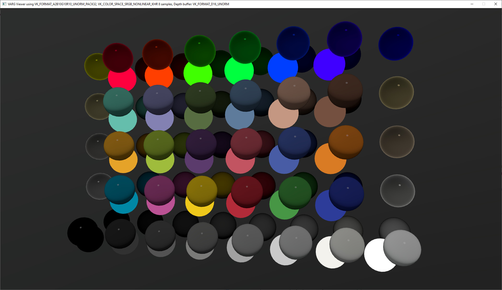

# KHR_framebuffer_value_mapping

## Contributors

Rickard Sahlin, <mailto:rickard.sahlin@inter.ikea.com>  

Copyright (C) 2024 The Khronos Group Inc. All Rights Reserved. glTF is a trademark of The Khronos Group Inc.
See [Appendix](#appendix-full-khronos-copyright-statement) for full Khronos Copyright Statement.

## Status

Draft

## Dependencies

Written against the glTF 2.01 spec.

## Exclusions

## Termonilogy

This extension uses the following terms:

Framebuffer : One or more memory buffers used by the target platform to store pixel values prior to being output to display.  
framebuffer_max_value : The maximum value that can be stored in the framebuffer, for an 8 bit unorm buffer this is 1.0.  


## Overview

This extension is intended for implementations that targets a light emitting display with the goal of outputting interactive framerates in a physically correct manner.    
The purpose is to define how light calculation output values, that may be in a large range, are mapped to framebuffer values, that have a limited range.  
This extension can work in conjunction with post-processing effects such as tonemapping.  

There are two main goals for this extension:  
  
1: Provide a method to linearly scale RGB values to the framebuffer format of the target device - the light intensity factor.  
  
2: Define how to limit values prior to writing them to framebuffer when the scaled value exceeds the maximum range of the framebuffer - the  RGB threshold.  
  
  
## Calculation of the lightIntensityFactor  

The light intensity factor is calculated from the extension "maxLight" value.  
This value defines the light intensity (lm/m2) value that will be mapped to the maximum value of the framebuffer.  
 
  
float lightIntensityFactor = framebuffer_max_value / maxLight  
 
Each calculated RGB pixel value shall be scaled by the lightIntensityFactor at some point prior to being output to display.  
Exactly how this is done is an implementation detail, the normal usecase would be to scale the value in the fragment shader.   

## Limit of RGB pixel values before output to framebuffer  
    
If, after applying the lightIntensityFactor, RGB values exceed the maximum value of the framebuffer then the RGB triplet must be scaled.  
The scaling shall be done using the max component value from the RGB triplet, ensuring that color is retained.  
  
pseudocode for scaling.  
vec3 scaledRGB = RGB / max(R, max(G,B));  
  
## Example images  
  
The following images are using different maxLight values, the scene contains pointlight and emissive material with an intensity of 1500 lumen/m2.  
Please note that the maxLight value will give bright or dark image depending on scene illumination.  
A scene with an average illumination of 10 000 lumen/m2 and a maxLight value of 100 000 will give a dark result.  
A scene with an average illumination of 10 000 lumen/m2 and a maxLight value of 10 00 will give a bright result.  
  
  
<table>
  <tr>
    <td> </td>
    <td> </td>
    <td> </td>
  </tr>
</table>
  
  
An example of how Macbeth colored spheres may look like under different light intensity scales.   
  
<table>
  <tr>
    <td> </td>
    <td> </td>
    <td> </td>
  </tr>
</table>
  


## Defining an asset to use KHR_framebuffer_value_mapping
  
The extension is put in the scene declaration.  
All uses of the scene, for instance in a usecase with glTFX, shall take the extension into account.  
This does not apply to uses of data within the scene, for instance Nodes.  


```json
{
  "extensionsUsed": [
    "KHR_framebuffer_value_mapping"
  ],
  "scene": 0,
  "extensions": {
    "KHR_framebuffer_value_mapping": {
      "maxLight": 10000
    }
  }
}

```


## Appendix: Full Khronos Copyright Statement

Copyright 2024 The Khronos Group Inc.

Some parts of this Specification are purely informative and do not define requirements
necessary for compliance and so are outside the Scope of this Specification. These
parts of the Specification are marked as being non-normative, or identified as
**Implementation Notes**.

Where this Specification includes normative references to external documents, only the
specifically identified sections and functionality of those external documents are in
Scope. Requirements defined by external documents not created by Khronos may contain
contributions from non-members of Khronos not covered by the Khronos Intellectual
Property Rights Policy.

This specification is protected by copyright laws and contains material proprietary
to Khronos. Except as described by these terms, it or any components
may not be reproduced, republished, distributed, transmitted, displayed, broadcast
or otherwise exploited in any manner without the express prior written permission
of Khronos.

This specification has been created under the Khronos Intellectual Property Rights
Policy, which is Attachment A of the Khronos Group Membership Agreement available at
www.khronos.org/files/member_agreement.pdf. Khronos grants a conditional
copyright license to use and reproduce the unmodified specification for any purpose,
without fee or royalty, EXCEPT no licenses to any patent, trademark or other
intellectual property rights are granted under these terms. Parties desiring to
implement the specification and make use of Khronos trademarks in relation to that
implementation, and receive reciprocal patent license protection under the Khronos
IP Policy must become Adopters and confirm the implementation as conformant under
the process defined by Khronos for this specification;
see https://www.khronos.org/adopters.

Khronos makes no, and expressly disclaims any, representations or warranties,
express or implied, regarding this specification, including, without limitation:
merchantability, fitness for a particular purpose, non-infringement of any
intellectual property, correctness, accuracy, completeness, timeliness, and
reliability. Under no circumstances will Khronos, or any of its Promoters,
Contributors or Members, or their respective partners, officers, directors,
employees, agents or representatives be liable for any damages, whether direct,
indirect, special or consequential damages for lost revenues, lost profits, or
otherwise, arising from or in connection with these materials.

Khronos® and Vulkan® are registered trademarks, and ANARI™, WebGL™, glTF™, NNEF™, OpenVX™,
SPIR™, SPIR-V™, SYCL™, OpenVG™ and 3D Commerce™ are trademarks of The Khronos Group Inc.
OpenXR™ is a trademark owned by The Khronos Group Inc. and is registered as a trademark in
China, the European Union, Japan and the United Kingdom. OpenCL™ is a trademark of Apple Inc.
and OpenGL® is a registered trademark and the OpenGL ES™ and OpenGL SC™ logos are trademarks
of Hewlett Packard Enterprise used under license by Khronos. ASTC is a trademark of
ARM Holdings PLC. All other product names, trademarks, and/or company names are used solely
for identification and belong to their respective owners.
