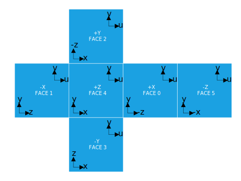

# KHR_lights_environment

## Contributors

* Norbert Nopper, <mailto:nopper@ux3d.io>
* Rickard Sahlin, <mailto:rickard.sahlin@ikea.com>
* Gary Hsu, Microsoft, <mailto:garyhsu@microsoft.com>
* Mike Bond, Adobe, <mailto:mbond@adobe.com>

## Status

Draft

## Dependencies

Written against the glTF 2.0 spec.

## Overview
This extension provides the ability to define image-based lights in a glTF scene. Image-based lights consist of an environment map that represents specular radiance for the scene as well as irradiance information.
This can be used on it's own - ie a glTF asset with only environment map data - for a usecase where the IBL needs to be distributed.
It can also be used together with model data, for usecases where a model shall be displayed in a defined environment.

Many 3D tools and engines support image-based global illumination but the exact technique and data formats employed vary. Using this extension, tools can export and engines can import image-based lights and the result should be highly consistent. 

This extension specifies exactly one way to format and reference the environment map to be used. The goals of this are two-fold. First, it makes implementing support for this extension easier. Secondly, it ensures that rendering of the image-based lighting is consistent across runtimes.

A conforming implementation of this extension must be able to load the image-based environment data and render the PBR materials using this lighting.

This extension is based on EXT_lights_image_based.

The environment light is defined by a cubemap.
Cubemaps can be supplied pre-filtered, by including the pre-filtered mip-levels, otherwise filtering will be performed at load time.
If a compressed texture format is used then pre-filtered mip-levels must be included.

How to pre-filter and/or sample the panorma image is implicitly definded by the [materials BRDF](https://github.com/KhronosGroup/glTF/tree/master/specification/2.0#appendix-b-brdf-implementation). 


## Declaring an environment light

The KHR_lights_environment extension defines an array of image-based lights at the root of the glTF and then each scene can reference one. 
Each environment light definition consists of a single cubemap that describes the specular radiance of the scene, the l=2 spherical harmonics coefficients for diffuse irradiance and rotation and intensity values.  
The cubemap is defined by texture references, this means that the source format for textures can be extended by using an extension such as KHR_texture_basisu.  
If image source contains a cubemap pyramid it must be pre-filtered and contain the needed mip-levels see Specular Radiance Cubemaps.  

```json
"extensions": {
    "KHR_lights_environment" : {
        "lights": [
            {
                "intensity": 1.0,
                "rotation": [0, 0, 0, 1],
                "irradianceCoefficients": [...3 x 9 array of floats...],
                "specularTextures": [
                    [... 6 cube faces for mip 0 ...]
                ],
            }
        ]
    }
}
```


### Defining the environment light

One or more environment lights cane be defined inside [glTF.schema.json](https://github.com/KhronosGroup/glTF/blob/master/specification/2.0/schema/glTF.schema.json)

```json
"extensions": {
  "EXT_lights_environment": {
    "environments": [
      {
        "source": 0,
        "intensity": 1.0,
        "frontside": "+X"
      }
    ]
  }
}
```    

## Specular Radiance Cubemaps

The cubemap used for specular radiance is defined as separate images for each cube face. 
The mip levels shall evenly map to roughness values from 0 to 1 in the PBR material and should be generated with a principled multi-scatter GGX normal distribution. The data in the maps represents illuminance in candela per square meter (nit).

The entire mip chain of images should not be generated.
Instead, the lowest-resolution mip should have sufficient size to represent the maximally-blurred radiance map (say, 16x16) corresponding to roughness=1. The `specularImageSize` value defines the largest dimension of mip 0 and, taken together with the number of defined mips, should give the loading runtime the information it needs to generate the remainder of the mip chain and sample the appropriate mip level in the shader.

Cube faces are defined in the following order and adhere to the standard orientations as shown in the image bellow.
1. Positive X
1. Negative X
1. Positive Y
1. Negative Y
1. Positive Z
1. Negative Z

<figure>

<figcaption><em>Cube map orientation reference.<br>Image by <a href="//commons.wikimedia.org/w/index.php?title=User:Microwerx&amp;action=edit&amp;redlink=1" class="new" title="User:Microwerx (page does not exist)">Microwerx</a> - <span class="int-own-work" lang="en">Own work</span>, <a href="https://creativecommons.org/licenses/by-sa/4.0" title="Creative Commons Attribution-Share Alike 4.0">CC BY-SA 4.0</a>, <a href="https://commons.wikimedia.org/w/index.php?curid=48935423">Link</a></em></figcaption>
</figure>

Note that for this extension, each saved image must be flipped about its vertical axis to correspond with the way <a href="https://github.com/KhronosGroup/glTF/tree/master/specification/2.0#images">glTF references texture space</a>.

https://en.wikipedia.org/wiki/Cube_mapping


## Irradiance Coefficients

This extension uses spherical harmonic coefficients to define irradiance used for diffuse lighting. Coefficients are calculated for the first 3 SH bands (l=2) and take the form of a 9x3 array.
[Realtime Image Based Lighting using Spherical Harmonics](https://metashapes.com/blog/realtime-image-based-lighting-using-spherical-harmonics/)
[An Efficient Representation for Irradiance Environment Maps](http://graphics.stanford.edu/papers/envmap/)

### Using the environment light

The environment light is utilized by a scene.

```json
"scenes": [
    {
        "nodes": [
            0
        ],
        "extensions": {
            "EXT_lights_environment": {
                "environment": 0
            }
        }
    }
  ]
```

## Adding Light Instances to Scenes

Each scene can have a single IBL light attached to it by defining the `extensions.EXT_lights_image_based` property and, within that, an index into the `lights` array using the `light` property.

```javascript
"scenes" : [
    {
        "extensions" : {
            "EXT_lights_image_based" : {
                "light" : 0
            }
        }
    }            
]
```

### Image-Based Light Properties

| Property | Description | Required |
|:-----------------------|:------------------------------------------| :--------------------------|
| `name` | Name of the light. | No |
| `rotation` | Quaternion that represents the rotation of the IBL environment. | No, Default: `[0.0, 0.0, 0.0, 1.0]` |
| `intensity` | Brightness multiplier for environment. | No, Default: `1.0` |
| `irradianceCoefficients` | Declares spherical harmonic coefficients for irradiance up to l=2. This is a 9x3 array. | :white_check_mark: Yes |
| `specularTextures` | Declares an array of the cubemap textures, this array must contain 6 tetures. | :white_check_mark: Yes |


## glTF Schema Updates

- [glTF.KHR_lights_environment.schema.json](schema/glTF.KHR_lights_environment.schema.json)
- [environment.schema.json](schema/environment.schema.json)
- [scene.KHR_lights_environment.schema.json](schema/scene.KHR_lights_environment.schema.json)

## Known Implementations

* `TODO: Add implementations`

## Reference

* `TODO: Add references`