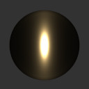
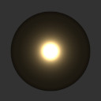
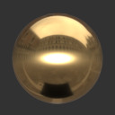
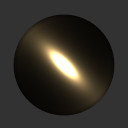
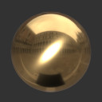

# KHR\_materials\_anisotropy

## Contributors

* Jim Eckerlein, Norbert Nopper, UX3D

## Status

Suggestion

## Dependencies

Written against the glTF 2.0 spec.

## Overview

This extension defines the anisotropic property of a material as observable with brushed metals for instance.
An assymetric specular lobe model is introduced to allow for such phenomenon.
The visually distinct feature of that lobe is the elongated appearance of the specular reflection.
For a single punctual light source, the specular reflection will eventually degenerate into a zero width line in the limit,
that is where the material is fully anisotropic, as opposed to be fully isotropic in which case the specular reflecation is radially symmetric.

## Extending Materials

```json
{
    "materials": [
        {
            "extensions": {
                "KHR_materials_anisotropy": {
                    "anisotropy": 0.6,
                    "anisotropyDirection": [0.0, 1.0, 0.0]
                }
            }
        }
    ]
}
```

### Definition

## Anisotropy

Two new material properties are introduced: an explicit anisotropy parameter and the direction in which the specular reflection elongates relative to the surface tangents.
The anisotropy parameter is a dimensionaless number in `[-1, 1]` and forms a bijection to the roughness distribution along two orthogonal directions,
one of which is the direction parameter and the other the result of the crossing the direction and the geometric normal.

A anisotropy of `1` means that the specular reflection will elongate along the given direction,
while a value of `-1` will elongate it along the computed orthogonal direction.

|                 | -0.5 | 0.0 | 0.5 |
| [1.0, 0.0, 0.0] |  |  | 
| [1.0, 1.0, 0.0] |  |  | 

### Reference

[Google Filament - Anisotropic model](https://google.github.io/filament/Filament.md.html#materialsystem/anisotropicmodel)
[Google Filament Materials Guide - Anisotropic model](https://google.github.io/filament/Materials.md.html#materialmodels/litmodel/anisotropy)
[Blender Principled BSDF](https://docs.blender.org/manual/en/latest/render/shader_nodes/shader/principled.html)
