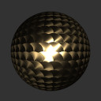
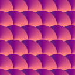

# KHR\_materials\_anisotropy

## Contributors

* Mike Bond, Adobe, [@miibond](https://github.com/MiiBond)
* Ed Mackey, AGI [@emackey](https://github.com/emackey)
* Alex Wood, AGI [@abwood](https://twitter.com/abwood)
* Nicolas Savva, Autodesk, [@nicolassavva-autodesk](https://github.com/nicolassavva-autodesk)
* Tobias Haeussler, Dassault Systemes [@proog128](https://github.com/proog128)
* Bastian Sdorra, Dassault Systemes [@bsdorra](https://github.com/bsdorra)
* Don McCurdy, Google [@donrmccurdy](https://twitter.com/donrmccurdy)
* Emmett Lalish, Google [@elalish](https://github.com/elalish)
* Alexey Knyazev, Individual Contributor, [@lexaknyazev](https://github.com/lexaknyazev)
* Bruce Cherniak, Intel
* Gary Hsu, Microsoft [@bghgary](https://twitter.com/bghgary)
* Ben Houston, Threekit, [@bhouston](https://twitter.com/BenHouston3D)
* Jim Eckerlein, UX3D
* Norbert Nopper, UX3D [@UX3DGpuSoftware](https://twitter.com/UX3DGpuSoftware)
* Eric Chadwick, Wayfair, [echadwick-wayfair](https://github.com/echadwick-wayfair)

## Status

Draft

## Dependencies

Written against the glTF 2.0 spec.

## Overview

This extension defines the anisotropic property of a material as observable with brushed metals for instance.
An asymmetric specular lobe model is introduced to allow for such phenomena.
The visually distinct feature of that lobe is the elongated appearance of the specular reflection.
For a single punctual light source, the specular reflection will eventually degenerate into a zero width line in the limit,
that is where the material is fully anisotropic, as opposed to be fully isotropic in which case the specular reflection is radially symmetric.

## Extending Materials

Sample values:

```json
{
    "materials": [
        {
            "extensions": {
                "KHR_materials_anisotropy": {
                    "anisotropyStrength": 0.6,
                    "anisotropyRotation": 1.57,
                    "anisotropyTexture": {
                        "index": 0
                    }
                }
            }
        }
    ]
}
```

|                         | Type     | Description               | Required           |
| ----------------------- | -------- | ------------------------- | ------------------ |
| **anisotropyStrength**  | `number` | The anisotropy strength.  | No, default: `0.0` |
| **anisotropyRotation** | `number` | The rotation of the anisotropy in tangent, bitangent space, measured in radians counter-clockwise from the tangent. When anisotropyTexture is present, anisotropyRotation provides additional rotation to the vectors in the texture. | No, default: `0.0` |
| **anisotropyTexture**   | [`textureInfo`](https://registry.khronos.org/glTF/specs/2.0/glTF-2.0.html#reference-textureinfo) | The anisotropy texture. Red and green channels represent the anisotropy direction in [-1, 1] tangent, bitangent space. The vector is rotated by anisotropyRotation, and multiplied by anisotropyStrength, to obtain the final anisotropy direction and strength. | No |

## Anisotropy

Two new material properties are introduced: an explicit strength parameter and the direction in which the specular reflection elongates relative to the surface tangents.
The strength parameter is a dimensionless number in the range `[0, 1]` and forms an injective relation to the roughness distribution along two orthogonal directions, one of which is the direction parameter and the other the result of crossing the direction and the geometric normal.

| Rotation     | Strength 0.5                | Strength 0.0                |
| ------------ | --------------------------- | --------------------------- |
| `0.0`        |  |  |
| `0.78539816` |  |  |
| `1.57079633` |  |  |

To achieve certain surface finishes, it is possible to define the anisotropy and its direction using a texture.




## Implementation

In the following example, `u_AnisotropyStrength` is set to this extension's `anisotropyStrength`, and `u_AnisotropyRotation` is initialized as `[ cos(anisotropyRotation), sin(anisotropyRotation) ]`.

The default value of `anisotropyRotation` is zero, so when this parameter is not supplied by glTF, `u_AnisotropyRotation` will be `[ 1.0, 0.0 ]`.

```glsl
uniform float u_AnisotropyStrength;
uniform vec2 u_AnisotropyRotation;

float anisotropy = u_AnisotropyStrength;
vec2 direction = u_AnisotropyRotation;

#if HAS_ANISOTROPY_MAP
vec2 anisotropyTexture = texture(uv, u_AnisotropyTextureSampler).rg * 2.0 - vec2(1.0);
anisotropy *= length(anisotropyTexture);
direction = mat2(direction.x, direction.y, -direction.y, direction.x) * normalize(anisotropyTexture);
#endif

vec3 anisotropicT = normalize(TBN * vec3(direction, 0.0));
vec3 anisotropicB = normalize(cross(normal_geometric, anisotropicT));

float TdotL = dot(anisotropicT, l);
float BdotL = dot(anisotropicB, l);
float TdotH = dot(anisotropicT, h);
float BdotH = dot(anisotropicB, h);

f_specular += intensity * NdotL * BRDF_specularAnisotropicGGX(f0, f90, alphaRoughness,
    VdotH, NdotL, NdotV, NdotH,
    BdotV, TdotV, TdotL, BdotL, TdotH, BdotH, anisotropy);
```

The anisotropic GGX is defined as follows:

```glsl
vec3 BRDF_specularAnisotropicGGX(vec3 f0, vec3 f90, float alphaRoughness,
    float VdotH, float NdotL, float NdotV, float NdotH, float BdotV, float TdotV,
    float TdotL, float BdotL, float TdotH, float BdotH, float anisotropy)
{
    float at = max(alphaRoughness * (1.0 + anisotropy), 0.00001);
    float ab = max(alphaRoughness * (1.0 - anisotropy), 0.00001);

    vec3 F = F_Schlick(f0, f90, VdotH);
    float V = V_GGX_anisotropic(NdotL, NdotV, BdotV, TdotV, TdotL, BdotL, at, ab);
    float D = D_GGX_anisotropic(NdotH, TdotH, BdotH, at, ab);

    return F * V * D;
}

float D_GGX_anisotropic(float NdotH, float TdotH, float BdotH, float at, float ab)
{
    float a2 = at * ab;
    vec3 f = vec3(ab * TdotH, at * BdotH, a2 * NdotH);
    float w2 = a2 / dot(f, f);
    return a2 * w2 * w2 / M_PI;
}

float V_GGX_anisotropic(float NdotL, float NdotV, float BdotV, float TdotV, float TdotL, float BdotL,
    float at, float ab)
{
    float GGXV = NdotL * length(vec3(at * TdotV, ab * BdotV, NdotV));
    float GGXL = NdotV * length(vec3(at * TdotL, ab * BdotL, NdotL));
    float v = 0.5 / (GGXV + GGXL);
    return clamp(v, 0.0, 1.0);
}
```

The parametrization of `at` and `ab`, denoting roughness values along both anisotropic directions respectively, is taken from [4].

## Reference

1. [Google Filament - Anisotropic model](https://google.github.io/filament/Filament.md.html#materialsystem/anisotropicmodel)
2. [Google Filament Materials Guide - Anisotropic model](https://google.github.io/filament/Materials.md.html#materialmodels/litmodel/anisotropy)
3. [Blender Principled BSDF](https://docs.blender.org/manual/en/latest/render/shader_nodes/shader/principled.html)
4. [Christopher Kulla and Alejandro Conty. 2017. Revisiting Physically Based Shading at Imageworks](https://blog.selfshadow.com/publications/s2017-shading-course/imageworks/s2017_pbs_imageworks_slides_v2.pdf)
