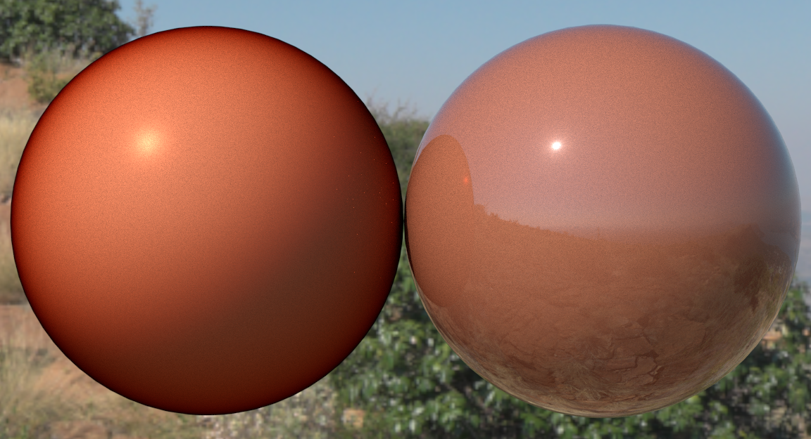

<!--
SPDX-License-Identifier: LicenseRef-KhronosSpecCopyright
-->

# KHR_materials_coat

## Contributors

- Mike Bond, Adobe [@MiiBond](https://github.com/MiiBond)
- Gary Hsu, Microsoft [@bghgary](https://twitter.com/bghgary)

## Status

Draft

## Dependencies

Written against the glTF 2.0 spec.

## Exclusions

- This extension must not be used on a material that also uses `KHR_materials_pbrSpecularGlossiness`.
- This extension must not be used on a material that also uses `KHR_materials_unlit`.

## Overview

This extension defines a comprehensive coating layer that can be applied on top of an existing glTF material definition. A coating is a thin, dielectric layer on top of the base layer that is often used to represent a protective or decorative layer applied to a base material, such as varnish, lacquer, or paint. It can absorb, refract and reflect light but does not scatter it.

The coating layer provides control over:
- Basic coating properties (weight, roughness, normal mapping)
- Index of refraction
- Colored absorption through the coating
- Internal reflection darkening control
- Anisotropic surface properties

## Extending Materials

Add the `KHR_materials_coat` extension to any compatible glTF material:

```json
{
  "materials": [
    {
      "name": "red_varnish",
      "extensions": {
        "KHR_materials_coat": {
          "coatFactor": 1.0,
          "coatRoughnessFactor": 0.1,
          "coatIor": 1.4,
          "coatColorFactor": [0.9, 0.3, 0.3],
          "coatDarkeningFactor": 0.8,
          "coatAnisotropyStrength": 0.2
        }
      }
    }
  ]
}
```

If `coatFactor` is zero, the entire coat layer is disabled.

## Interaction with KHR_materials_clearcoat

This extension is intended to replace `KHR_materials_clearcoat` as it contains all the functionality of that extension. If both extensions are defined on a material, it is expected that `KHR_materials_coat` will take precedence and `KHR_materials_clearcoat` only exists as a fallback for loaders that do not support the newer extension.

## Parameters

### Basic Coating Properties

|                              | Type                                                                            | Description                            | Required             |
|------------------------------|---------------------------------------------------------------------------------|----------------------------------------|----------------------|
|**coatFactor**                | `number`                                                                        | The coat layer weight.             | No, default: `0.0`   |
|**coatTexture**               | [`textureInfo`](https://www.khronos.org/registry/glTF/specs/2.0/glTF-2.0.html#reference-textureinfo) | The coat layer weight texture. Stored in R channel.     | No                   |
|**coatRoughnessFactor**       | `number`                                                                        | The coat layer roughness.             | No, default: `0.0`   |
|**coatRoughnessTexture**      | [`textureInfo`](https://www.khronos.org/registry/glTF/specs/2.0/glTF-2.0.html#reference-textureinfo) | The coat layer roughness texture. Stored in the G channel    | No                   |
|**coatNormalTexture**         | [`normalTextureInfo`](https://www.khronos.org/registry/glTF/specs/2.0/glTF-2.0.html#reference-material-normaltextureinfo) | The coat normal map texture.          | No                   |

### Optical Properties

|                              | Type                                                                            | Description                            | Required             |
|------------------------------|---------------------------------------------------------------------------------|----------------------------------------|----------------------|
|**coatIor**                   | `number`                                                                        | The index of refraction of the coat.  | No, default: `1.5`   |
|**coatColorFactor**           | `number[3]`                                                                     | The colored transmittance of the coat. | No, default: `[1.0, 1.0, 1.0]` |
|**coatColorTexture**          | [`textureInfo`](https://www.khronos.org/registry/glTF/specs/2.0/glTF-2.0.html#reference-textureinfo) | The coat color texture. Assumed to be sRGB             | No                   |
|**coatDarkeningFactor**       | `number`                                                                        | The amount of physically-correct darkening. | No, default: `1.0`   |

### Anisotropy Properties

|                              | Type                                                                            | Description                            | Required             |
|------------------------------|---------------------------------------------------------------------------------|----------------------------------------|----------------------|
|**coatAnisotropyStrength**    | `number`                                                                        | The coat anisotropy strength.         | No, default: `0.0`   |
|**coatAnisotropyRotation**    | `number`                                                                        | Rotation of the anisotropy direction in radians (counter-clockwise from tangent)  | No, default: `0.0`   |
|**coatAnisotropyTexture**     | [`textureInfo`](https://www.khronos.org/registry/glTF/specs/2.0/glTF-2.0.html#reference-textureinfo) | RG channels define direction in [-1,1] tangent space; B channel defines strength.         | No                   |

### Parameter Combinations

Values for coating properties can be defined using factors, textures, or both. If textures are not provided, respective texture components are assumed to have default values. All coating textures contain components in linear space except where noted. If both factors and textures are present, the factor value acts as a linear multiplier for the corresponding texture values.

```
coatWeight = coatFactor * coatTexture.r
coatRoughness = coatRoughnessFactor * coatRoughnessTexture.g
coatColor = coatColorFactor * sRGBToLinear(coatColorTexture.rgb)
coatDarkening = coatDarkeningFactor
coatAnisotropyStrength_final = coatAnisotropyStrength * coatAnisotropyTexture.b
```

In the case of anisotropy rotation, the combination of coatAnisotropyRotation and the rotation direction from coatAnisotropyTexture.rg is slightly more complex since one specifies an angle and the other a direction. We can convert the direction from the texture to an angle and then add to coatAnisotropyRotation.
```
coatAnisotropyRotation += atan(coatAnisotropyTexture.g, coatAnisotropyTexture.r);
```

## Basic Coating

The coat effect is modeled via a microfacet BRDF. The BRDF is layered on top of the glTF 2.0 Metallic-Roughness material, excluding emission, using a new `fresnel_coat` function:

```
# base material (from glTF 2.0 Metallic-Roughness)
material = mix(dielectric_brdf, metal_brdf, metallic)

# coat layer
coat_brdf = specular_brdf(
  normal = coatNormal,
  α = coatRoughness^2,
  anisotropy = coatAnisotropy)

# layering
coated_material =
  fresnel_coat(
    normal = coatNormal,
    ior = coatIor,
    weight = coatWeight,
    base = material * coatColor * coatDarkening,
    layer = coat_brdf)
```

The `fresnel_coat` function adds a BRDF as a layer on top of another BSDF according to `weight` and a Fresnel term. The layer is weighted with `weight*fresnel(ior)`. The base is weighted with `1-(weight*fresnel(ior))`. `normal` is a float3 vector that affects the top layer, but not the base.

The specular BRDF for the clearcoat layer `clearcoat_brdf` is computed using the specular term from the glTF 2.0 Metallic-Roughness material, defined in [Appendix B](https://www.khronos.org/registry/glTF/specs/2.0/glTF-2.0.html#appendix-b-brdf-implementation).

#### Layering

The `fresnel_coat` function is computed using the Schlick Fresnel term from the glTF 2.0 Metallic-Roughness material, defined in [Appendix B](https://www.khronos.org/registry/glTF/specs/2.0/glTF-2.0.html#appendix-b-brdf-implementation).

```
function fresnel_coat(normal, ior, weight, base, layer) {
  f0 = ((1-ior)/(1+ior))^2
  fr = f0 + (1 - f0)*(1 - abs(dot(V, normal)))^5
  return mix(base, layer, weight * fr)
}
```

#### Emission

Emission is assumed to be on top of the coat layer in the layering stack. Consequently, the emission is not affected by coat.

## Index of Refraction

The `coatIor` parameter controls the Fresnel behavior of the coating. The Fresnel term at normal incidence is calculated as:

```
dielectric_f0_coat = ((coatIor - 1) / (coatIor + 1))^2
```

Typical values for IOR range from 1 to 2. Common materials:

| Material     | Index of Refraction |
|--------------|---------------------|
| Air          | 1.0                 |
| Water        | 1.33                |
| Glass        | 1.5                 |
| Polycarbonate| 1.58                |
| Diamond      | 2.42                |

Valid values for `coatIor` are numbers greater than or equal to 1.0. As a special case, a value of 0.0 is allowed for backwards compatibility mode (see below).

## Colored Absorption

The coating can absorb certain colors of light passing through it, resulting in a colored tint. `coatColor` represents the observed tint color.

### Physical Interpretation

As light travels through the coat medium, only certain wavelengths of light may be transmitted while some are absorbed. The specified tint color actually represents the **square of transmittance of the coating**. This is because the observed color tint of the underlying material results after light has passed through the coating twice (in incoming and outgoing directions), making the final color more easily artist-directable.

#### View-Dependent Absorption

Light rays travel different distances through the coat layer depending on the angle of incidence. At grazing angles (when viewing the surface nearly edge-on), light travels a longer distance through the coat medium, resulting in stronger absorption and more pronounced color saturation. Conversely, at normal incidence (when viewing the surface straight-on), light travels the shortest path through the coat, producing less absorption. The `coatColor` represents the color observed at normal incidence.

Note that this view-dependent absorption is more pronounced when the ratio of IOR between the coating and surrounding medium (usually air) is low. This is because, at higher IOR's, light impacting the coating at grazing angles gets refracted into the coating more strongly, shortening the path length through the coat and decreasing the absorption.

<figure>

<figcaption><em>Coat IOR = 1.0 on the left and coat IOR = 1.8 on the right.</em>
</figcaption>
</figure>

## Implementation

*This section is non-normative.*

At normal incidence, `coatColor` can simply be multiplied by the light coming from the underlying base layer. However, we need to modify this based on the incident angle:

```
// cos_i is the non-negative cosine of the unrefracted view angle
sin2_i = 1.0f - cos_i * cos_i 
// eta is the ratio of IOR's of the coat and surrounding medium. i.e. coat_ior / 1.0 for air.
sin2_t = sin2_i / (eta * eta)
// Total internal reflection. i.e. no light makes it out of coating.
if (sin2_t >= 1.0)
{
    final_coat_color = vec3(0.0f)
}
// Compute cosine of transmition angle.
cos_t = sqrt(1.0f - sin2_t);
// Calculate the path length through the coating, relative to normal incidence.
path_length = 1.0 / cos_t;
// Use the path length to calculate the final tinting.
final_coat_color = pow(coatColor, path_length)
```


## Darkening Control

The coating will naturally darken the appearance of the underlying surface due to internal reflections. However, when this physically-correct behavior is not be desired, the the `coatDarkeningFactor` can be used to control the amount of darkening:

- `1.0`: Full physically-correct darkening (default)
- `0.0`: No darkening due to internal reflections

<figure>

<figcaption>
No darkening on the left and physically-correct darkening on the right.
</figcaption>
</figure>

### Physical Interpretation

The "darkening" being adjusted is caused by light entering the coat and bouncing around internally before reaching the base layer. This reduces the effective transmission and therefore the amount of light hitting the base layer.

Things that affect the amount of darkening observed:
1. Fresnel Effect: Higher IOR coats have stronger internal reflections, causing more darkening.

1. Viewing Angle Dependency: Grazing angles have higher Fresnel reflectance, causing more darkening.

1. Roughness Modulation: Rougher coats scatter light internally, reducing the coherent reflection effect. Increased diffuse internal reflections results in less darkening.

### Implementation

*This section is non-normative.*

Some renderers (such as path-tracers) may already model this darkening behaviour by the nature of their light transport algorithms. In these cases, implementing support for this extension will involve adding a term to compensate for the energy loss when the darknening value is < 1.0. The [specification of OpenPBR](https://academysoftwarefoundation.github.io/OpenPBR/index.html#model/coat/darkening) contains a detailed description of what this entails.

Other renderers (such as rasterizers) will most likely need to add logic to approximate the loss of energy due to these internal reflections when the darkening value is > 0.0. We provide some example logic to do this below:

#### Real-time Implementation

We want to calculate a multiplier that represents the amount of transmitted light that makes its way through the coat and impacts the underlying layer. To approximate this, we want to find the average reflectance, $R$, of the coat and then model an infinite number of reflections using a geometric series to get the total transmission, $T$.

$T = (1-R) / (1 + R + R² + R³ + ...)$<br>
$T = (1-R) / (1/(1-R))$</br>
$T = (1-R)²$

The $(1-R)$ in the numerator represents the initial transmission of light through the coat and the denominator accounts for the infinite reflections within the coating. This converges to $1/(1-R)$.

By "average reflectance", we mean the average reflectance for the round trip (light in, view out) so it can be computed as the sum of the Schlick Fresnel approximation for $dot(N, V)$ and $dot(N, L)$ and then dividing by 2.
$$R_{directlight} = (fresnel(N, V) + fresnel(N, L)) * 0.5$$
For environment lighting (IBL), however, light is coming from all angles so we calculate the hemisphere-averaged reflectance as $F_0 + 0.5 * F_{90}$ which gives a value halfway between $F_0$ and $F_{90}$. We then add to this the Schlick Fresnel approximation for $dot(N, V)$ and divide by 2.
$$R_{IBL} = (fresnel(N, V) + F_0 + 0.5 * F_{90}) * 0.5$$


When coat roughness increases, light is diffused and darkening decreases. We can approximate this empirically by scaling the average reflectance, $R$, by $1.0 - M_c * 0.5$ where $M_c$ is the roughness of the clearcoat.

## Anisotropy

The coating can exhibit anisotropic behavior where specular reflection is stretched in one direction, similar to brushed metal or directionally polished surfaces.Anisotropy modifies the microfacet distribution of the coating layer such that the specular lobe is stretched along a direction relative to the surface tangents.

<figure>

<figcaption>
No anisotropy on the left and anisotropyStrength = 0.5 on the right.
</figcaption>
</figure>

The strength parameter is a dimensionless number in the range $[0, 1]$ and increases the roughness along the anisotropic direction. The default direction aligns with the tangent to the mesh as described in the glTF 2.0 specification, [Meshes section](https://registry.khronos.org/glTF/specs/2.0/glTF-2.0.html#meshes).

A mesh primitive using coat anisotropy **MUST** have a defined tangent space, i.e., it **MUST** have `NORMAL` and `TANGENT` attributes or it **MUST** have a coat normal texture. When the mesh primitive does not have `NORMAL` or `TANGENT` vectors, they are computed as defined in the glTF 2.0 specification.

Since the glTF 2.0 specification does not mandate any particular tangent space derivation algorithm, mesh primitives using anisotropic materials **SHOULD** always provide their `NORMAL` and `TANGENT` vectors.

When the material has both `coatNormalTexture` and `coatAnisotropyTexture` properties defined, these textures **SHOULD** use the same texture coordinates because they operate in the same tangent space and their texel values are usually correlated to each other.

The anisotropy texture, when supplied, encodes XY components of the anisotropy direction vector in tangent space as red and green values, and the anisotropy strength as blue values, all stored with linear transfer function. After dequantization, red and green texel values **MUST** be mapped as follows: red $[0, 1]$ to X $[-1, 1]$, green $[0, 1]$ to Y $[-1, 1]$.  Blue does not require remapping.  When the anisotropy texture is not supplied, the default dequantized texel value is $(1.0; 0.5; 1.0)$, which corresponds to the $(1; 0)$ direction vector (+X axis) and full strength.

The direction of this XY vector specifies the per-texel direction of increased anisotropy roughness in tangent, bitangent space, prior to being rotated by the `coatAnisotropyRotation` property value.  After dequantization, the blue channel contains strength as $[0, 1]$ to be multiplied by the `coatAnisotropyStrength` property value to determine the per-texel anisotropy strength.

> **Note:** The direction vector of the anisotropy is the direction in which highlights will be stretched. The direction of the micro-grooves in the material causing the anisotropy will run perpendicular.

The direction of increased anisotropy roughness (as determined above, by default the tangent direction), has its "alpha roughness" (the square of the roughness) increased according to the following formula:

*directionAlphaRoughness* = mix( *coatAlphaRoughness*, 1.0, *strength*<sup>2</sup> )

In the above, *coatAlphaRoughness* is defined as:

*coatAlphaRoughness* = *coatRoughness*<sup>2</sup>

Finally, *mix* is defined as:

mix( *x*, *y*, *m* ) = *x* * ( 1.0 - *m* ) + ( *y* * *m* )

The roughness of the perpendicular direction (by default, the bitangent direction) is equal to the coat's specified roughness.

These two different *coatAlphaRoughness* values, call them *&alpha;<sub>t</sub>* and *&alpha;<sub>b</sub>* contribute to an extended BRDF distribution term from Burley, parameterized here in terms of the halfway vector, $\boldsymbol h$, between the view and light directions:

$$
D(\boldsymbol h) = \frac{1}{\pi \alpha_t \alpha_b\left( (\boldsymbol h \cdot \boldsymbol t)^2/\alpha_t^2 + (\boldsymbol h \cdot \boldsymbol b)^2/\alpha_b^2 + (\boldsymbol h \cdot \boldsymbol n)^2 \right)^2}
$$

From this distribution function a masking/shadowing function approximation can also be derived, similarly as for the single-$\alpha$ distribution function.


## Other notes

*This section is non-normative.*

### Tangent Space Requirements

When using `coatNormalTexture` or `coatAnisotropyTexture`, mesh primitives should provide `NORMAL` and `TANGENT` attributes. When these are missing, they must be computed according to the glTF 2.0 specification.

### Layering

The simple layering function ignores many physical effects:
- The coating is assumed infinitely thin (no refraction)
- No scattering between layers
- No diffraction effects

More sophisticated layering models may be implemented for improved accuracy.

### Interactions with Other Extensions

- `KHR_materials_specular`: Applies to the base layer; coat has independent Fresnel behavior
- `KHR_materials_transmission` and `KHR_materials_volume`: Affect the base layer; coat remains opaque
- `KHR_materials_ior`: Sets base layer IOR; `coatIor` is independent
- Other material extensions: Generally apply to the base layer, with the coat layered on top

## Schema

- [material.KHR_materials_coat.schema.json](schema/material.KHR_materials_coat.schema.json)

## Appendix: Full Khronos Copyright Statement

Copyright 2024-2025 The Khronos Group Inc.

Some parts of this Specification are purely informative and do not define requirements
necessary for compliance and so are outside the Scope of this Specification. These
parts of the Specification are marked as being non-normative, or identified as
**Implementation Notes**.

Where this Specification includes normative references to external documents, only the
specifically identified sections and functionality of those external documents are in
Scope. Requirements defined by external documents not created by Khronos may contain
contributions from non-members of Khronos not covered by the Khronos Intellectual
Property Rights Policy.