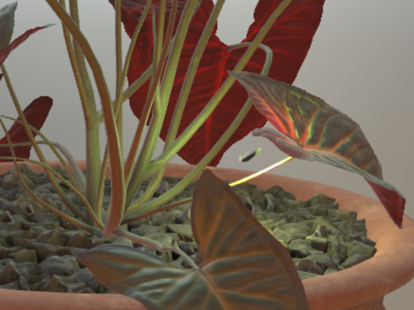
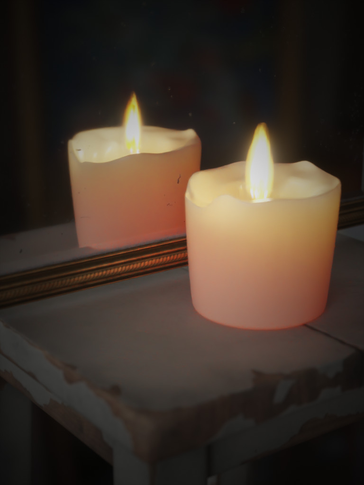
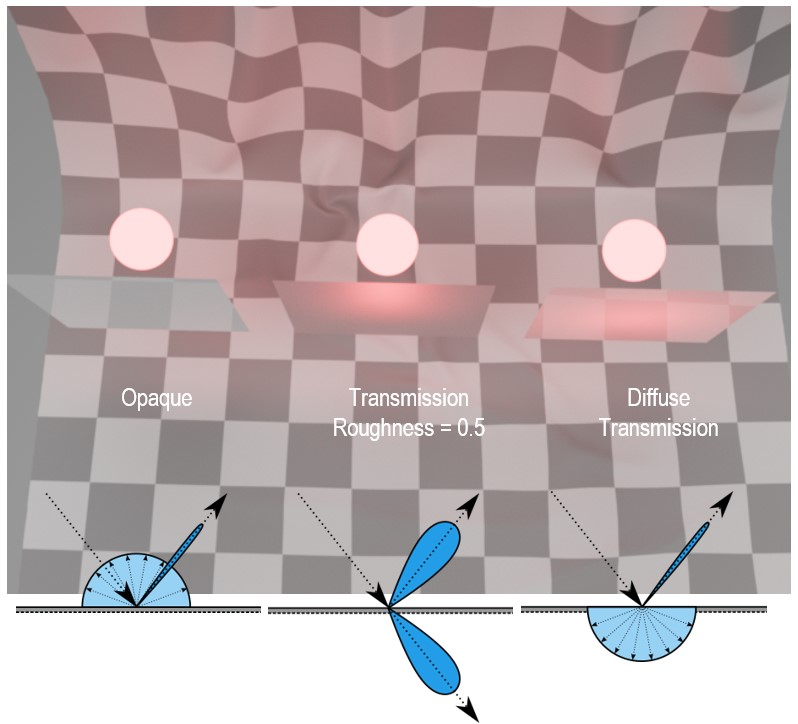
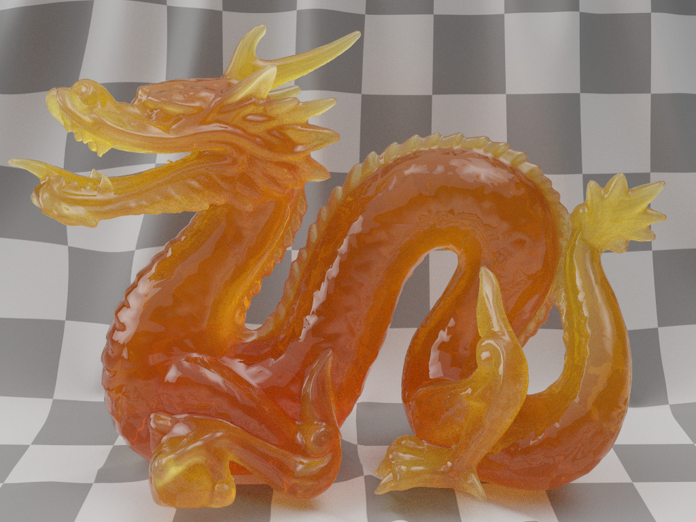
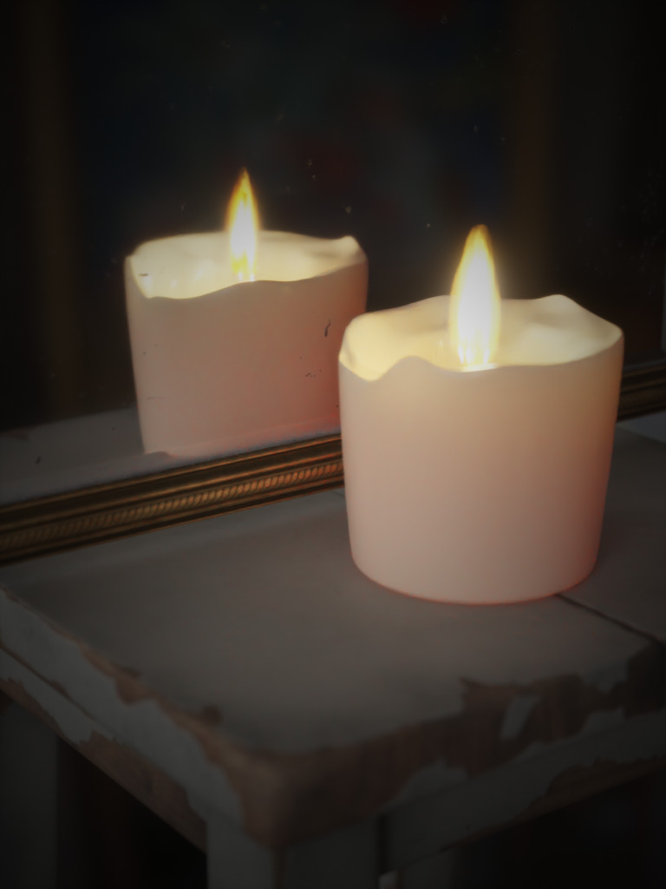

# KHR\_materials\_diffuse_transmission

## Contributors

* Tobias Haeussler, Dassault Systèmes [@proog128](https://github.com/proog128)
* Bastian Sdorra, Dassault Systèmes [@bsdorra](https://github.com/bsdorra)
* Ed Mackey, AGI [@emackey](https://twitter.com/emackey)

TODO
## Acknowledgments

TODO

## Status

Experimental

## Dependencies

Written against the glTF 2.0 spec.

## Overview

This extension models the physical phenomenon of light being diffusely transmitted through an infinitely thin material. Thin dielectric objects like leaves or paper diffusely transmit light due to dense volumetric scattering within the object. In 3D graphics, it is common to approximate thin volumetric objects as non-volumetric surfaces. The KHR_materials_diffuse_transmission extension models the diffuse transmission of light through such infinitely thin surfaces. For optically thick media (volumes) with short scattering distances and dense scattering behavior, i.e. candles, KHR_materials_diffuse_transmission provides a phenomenologically plausible and cost-effective approximation.

<div align="center">
<figure style="text-align:center">
<p float="left">


</p>
<figcaption><em>Left: (Thin) translucent leaves/foliage, Right: (Thick) translucent candle with colored volume attenuation and translucent surface.</em></figcaption>
</figure>
</div>


## Extending Materials

The effect is activated by adding the `KHR_materials_diffuse_transmission` extension to any glTF material.

```json
{
    "materials": [
        {
            "extensions": {
                "KHR_materials_diffuse_transmission": {
                    "diffuseTransmissionFactor": 0.25,
                    "diffuseTransmissionTexture": {
                      "index": 0
                    },
                    "diffuseTransmissionColorFactor": [
                      1.0,
                      0.9,
                      0.85
                    ]
                }
            }
        }
    ]
}
```

## Properties

|                                     | Type                                                                | Description                                                                                                                                                                     | Required                 |
|-------------------------------------|---------------------------------------------------------------------|---------------------------------------------------------------------------------------------------------------------------------------------------------------------------------|--------------------------|
| **diffuseTransmissionFactor**       | `number`                                                            | The percentage of non-specularly reflected light that is diffusely transmitted through the surface.                      | No, default: `0`         |
| **diffuseTransmissionTexture**      | [`textureInfo`](/specification/2.0/README.md#reference-textureInfo) | A texture that defines the percentage of non-specularly reflected light that is diffusely transmitted through the surface. Stored in the alpha (`A`) channel. Will be multiplied by the diffuseTransmissionFactor.                 | No                       |
| **diffuseTransmissionColorFactor**  | `number[3]`                                                         | The color that modulates the transmitted light.                                                                                                                                 | No, default: `[1, 1, 1]` |
| **diffuseTransmissionColorTexture** | [`textureInfo`](/specification/2.0/README.md#reference-textureInfo) | A texture that defines the color that modulates the diffusely transmitted light, stored in the `RGB` channels and encoded in sRGB. This texture will be multiplied by diffuseTransmissionColorFactor. | No                       |

### diffuseTransmissionFactor

The proportion of light that is diffusely transmitted through a surface, rather than being diffusely re-emitted. This is expressed as a percentage of the light that penetrates the surface (i.e., not specularly reflected), rather than a percentage of the total light incident on the surface. A value of 1.0 indicates that 100% of the light that penetrates the surface is transmitted through it.

<table>
  <tr>
    <td></td>
    <td></td>
    <td></td>
    <td></td>
    <td></td>
  </tr>
  <tr>
    <td align="center">0.0</td>
    <td align="center">0.25</td>
    <td align="center">0.5</td>
    <td align="center">0.75</td>
    <td align="center">1.0</td>
  </tr>
  <tr>
    <td colspan="5" align="center">
      <em>Backlit, occluded plane with blue <code>baseColorFactor</code> for varying <code>diffuseTransmissionFactor</code>.</em>
    </td>
  </tr>
</table>

### diffuseTransmissionColorFactor

The proportion of light at each color channel that is not attenuated by the surface transmission. Attenuation is usually defined as an amount of light at each frequency that is reduced over a given distance through a medium by absorption and scattering interactions. However, since this extension deals exclusively with infinitely thin surfaces, attenuation is constant and equal to 1.0 - `diffuseTransmissionColorFactor`.

<table>
  <tr>
    <td></td>
    <td></td>
    <td></td>
    <td></td>
    <td></td>
  </tr>
 <tr>
    <td align="center">0.0</td>
    <td align="center">0.25</td>
    <td align="center">0.5</td>
    <td align="center">0.75</td>
    <td align="center">1.0</td>
  </tr>
  <tr>
    <td colspan="5" align="center">
      <em>Backlit, occluded plane with blue <code>baseColorFactor</code> and red <code>diffuseTransmissionColorFactor</code> for varying <code>diffuseTransmissionFactor</code>.</em>
    </td>
  </tr>
</table>

### diffuseTransmissionTexture

The `A` channel of this texture defines proportion of light that is diffusely transmitted through a surface, rather than being diffusely re-emitted. This is expressed as a percentage of the light that penetrates the surface (i.e., not specularly reflected), rather than a percentage of the total light incident on the surface. A value of 1.0 indicates that 100% of the light that penetrates the surface is transmitted through it.

The value is linear and is multiplied by the `diffuseTransmissionFactor` to determine the total diffuse transmission value.

```
diffuseTransmission = diffuseTransmissionFactor * diffuseTransmissionTexture.a
```

<table>
 <tr>
    <td></td>
  </tr>
  <tr>
    <td align="center">
      <em>Backlit, occluded plane with blue <code>baseColorFactor</code> and a striped <code>diffuseTransmissionTexture</code>.<br>(Input texture shown in the top-left).</em>
    </td>
  </tr>
</table>


### diffuseTransmissionColorTexture

The `RGB` channels of this texture define the proportion of light at each color channel that is not attenuated by the surface transmission.
The values are multiplied by the `diffuseTransmissionColorFactor` to determine the total diffuse transmission color.
```
diffuseTransmissionColor = diffuseTransmissionColorFactor * diffuseTransmissionColorTexture.rgb
```

<table>
  <tr>
    <td></td>
    <td></td>
    <td></td>
    <td></td>
    <td></td>
  </tr>
  <tr>
    <td align="center">0.0</td>
    <td align="center">0.25</td>
    <td align="center">0.5</td>
    <td align="center">0.75</td>
    <td align="center">1.0</td>
  </tr>
  <tr>
    <td colspan="5" align="center">
      <em>Single-sided plane in a symmetric light setup. <code>baseColorTexture</code> and <code>diffuseTransmissionColorTexture</code> use textures that represent the different sides of the one-dollar bill. Series shows the setup at varying values of <code>diffuseTransmissionFactor</code>.</em>
    </td>
  </tr>
</table>

## Material Structure Updates

*This section is normative.*

This extension changes the `dielectric_brdf` defined in [Appendix B](https://registry.khronos.org/glTF/specs/2.0/glTF-2.0.html#material-structure)
```
dielectric_brdf =
  fresnel_mix(
    ior = 1.5,
    base = diffuse_brdf(color = baseColor),
    layer = specular_brdf(α = roughness ^ 2)
  )
```
 to the following:
```
dielectric_brdf =
  fresnel_mix(
    ior = 1.5,
    base = mix(
      diffuse_brdf(color = baseColor),
      diffuse_btdf(color = diffuseTransmissionColor),
      diffuseTransmission),
    layer = specular_brdf(α = roughness ^ 2)
  )
```
Increasing the strength of the diffuse transmission effect using the `diffuseTransmissionFactor` parameter takes away energy from the diffuse reflection BSDF and passes it to the diffuse transmission BSDF. The specular reflection BSDF and Fresnel weighting are not affected.

## Implementation
*This section is non-normative.*

With a simple Lambert BRDF model, `diffuse_brdf` and `diffuse_btdf` may be implemented as follows
```
function diffuse_brdf(color) {
  if (view and light on same hemisphere) {
    return (1/pi) * color
  } else {
    return 0
  }
}

function diffuse_btdf(color) {
  if (view and light on opposite hemispheres) {
    return (1/pi) * color
  } else {
    return 0
  }
}

function mix(bsdf0, bsdf1, factor) {
  return (1-factor) * bsdf0 + factor * bsdf1
}
```

<div align="center">
<table>
  <tr>
    <td colspan="2"></td>
  </tr>
  <tr>
    <td colspan="1" align="center">
      <em>Diffuse BRDF</em>
    </td>
    <td colspan="1" align="center">
      <em>Diffuse BTDF</em>
    </td>
  </tr>
</table>
</div>

## Combining Diffuse Transmission with other Extensions
### KHR_materials_transmission
Both `KHR_materials_diffuse_transmission` and `KHR_materials_transmission` replace the diffuse BRDF with a mix of diffuse BRDF and a BTDF that transmits light onto the opposite side of the surface. In case of `KHR_materials_transmission`, this is a microfacet BTDF that shares its roughness with the microfacet BRDF. In case of `KHR_materials_diffuse_transmission`, on the other hand, this is a diffuse BTDF.

Let's recall the `dielectric_brdf` for `KHR_materials_diffuse_transmission` as defined above
```
dielectric_brdf =
  fresnel_mix(
    ior = 1.5,
    base = mix(
      diffuse_brdf(color = baseColor),
      diffuse_btdf(color = diffuseTransmissionColor),
      diffuseTransmission,
    layer = specular_brdf(α = roughness ^ 2)
  )
```

and compare it to the `dielectric_brdf` defined in `KHR_materials_transmission`
```
dielectric_brdf =
  fresnel_mix(
    ior = 1.5,
    base = mix(
      diffuse_brdf(baseColor),
      specular_btdf(α = roughness^2) * baseColor,
      transmission),
    layer = specular_brdf(α = roughness^2)
  )
```

Since the diffuse BTDF does not have controls for roughness, the roughness parameter acts only on the reflective part of the surface. By decoupling the reflection and transmission parts it is possible to configure materials which have a smooth reflection and a diffuse transmission, as shown in images below.

<table>
  <tr>
    <td></td>
    <td></td>
  </tr>
  <tr>
    <td colspan="2" align="center">
      <em>Emissive sphere behind material sample.<br>Left: Opaque diffuse. Middle: Rough transmission. Right: Diffuse transmission.</em>
    </td>
  </tr>
</table>

<table>
  <tr>
    <td colspan="3"></td>
  </tr>
  <tr>
    <td align="center">0.0</td>
    <td align="center">0.2</td>
    <td align="center">0.4</td>
  </tr>
  <tr>
    <td colspan="3" align="center">
      <em>Translucent sphere with varying roughness.</em>
    </td>
  </tr>
</table>

<table>
 <tr>
    <td colspan="3"></td>
  </tr>
  <tr>
    <td align="center">0.0</td>
    <td align="center">0.2</td>
    <td align="center">0.4</td>
  </tr>
  <tr>
    <td colspan="3" align="center">
      <em>Transmissive sphere with varying roughness.</em>
    </td>
  </tr>
</table>

If `KHR_materials_transmission` is used in combination with `KHR_materials_diffuse_transmission`, the transmission effect overrides the diffuse transmission effect.

We can formalize this behavior by combining the two cases from above
```
dielectric_brdf =
  fresnel_mix(
    ior = 1.5,
    base = mix(
      diffuse_bsdf,
      specular_btdf(α = roughness^2) * baseColor,
      transmission),
    layer = specular_brdf(α = roughness^2)
  )

diffuse_bsdf = mix(
    diffuse_brdf(color = baseColor),
    diffuse_btdf(color = diffuseTransmissionColor),
    diffuseTransmission)
```
<table>
  <tr>
    <td></td>
    <td></td>
    <td></td>
    <td></td>
    <td></td>
  </tr>
  <tr>
    <td align="center">1.0</td>
    <td align="center">0.75</td>
    <td align="center">0.5</td>
    <td align="center">0.25</td>
    <td align="center">0.0</td>
  </tr>
  <tr>
    <td colspan="5" align="center">
      <em>Dragon with fixed <code>diffuseTransmissionFactor</code> of 1.0 and varying <code>transmissionFactor</code>.</em>
    </td>
  </tr>
</table>

### KHR_materials_volume
When `KHR_materials_diffuse_transmission` is combined with `KHR_materials_volume`, a diffuse transmission BTDF describes the transmission of light through the volume boundary. The object becomes translucent. The light transport inside the volume is solely handled by `KHR_materials_volume` and is not affected by the surface BSDF.

<table>
  <tr>
    <td></td>
    <td></td>
    <td></td>
  </tr>
  <tr>
    <td align="center">0.0</td>
    <td align="center">0.5</td>
    <td align="center">1.0</td>
  </tr>
  <tr>
    <td colspan="3" align="center">
      <em>Dragon with white base color, colored volume attenuation and varying <code>diffuseTransmissionFactor</code>. </em>
    </td>
  </tr>
</table>

<table>
  <tr>
    <td></td>
    <td></td>
    <td></td>
  </tr>
  <tr>
    <td align="center">0.0</td>
    <td align="center">0.25</td>
    <td align="center">0.5</td>
  </tr>
  <tr>
    <td colspan="3" align="center">
      <em>Candle with off-white base color, colored volume attenuation and varying <code>diffuseTransmissionFactor</code>. </em>
    </td>
  </tr>
</table>


## Schema

- [glTF.KHR_materials_diffuse_transmission.schema.json](schema/glTF.KHR_materials_diffuse_transmission.schema.json)

