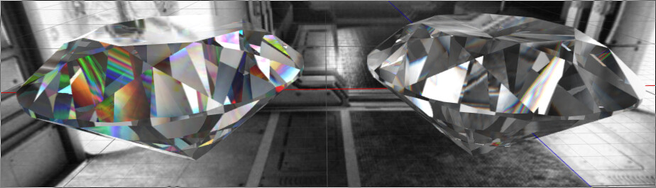
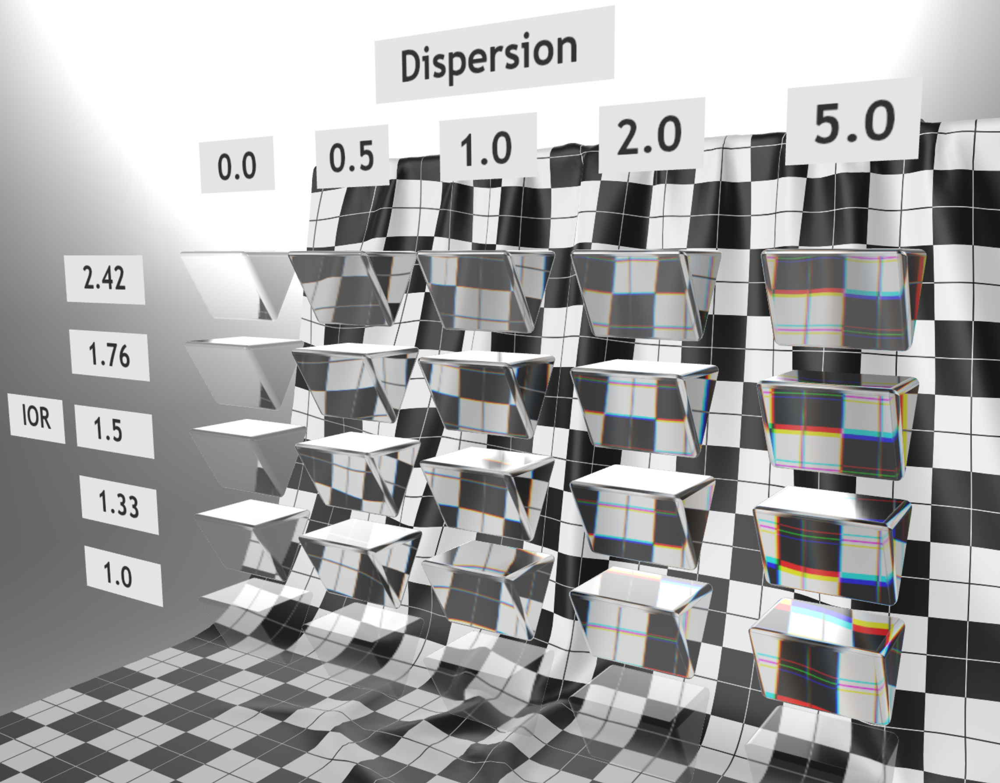
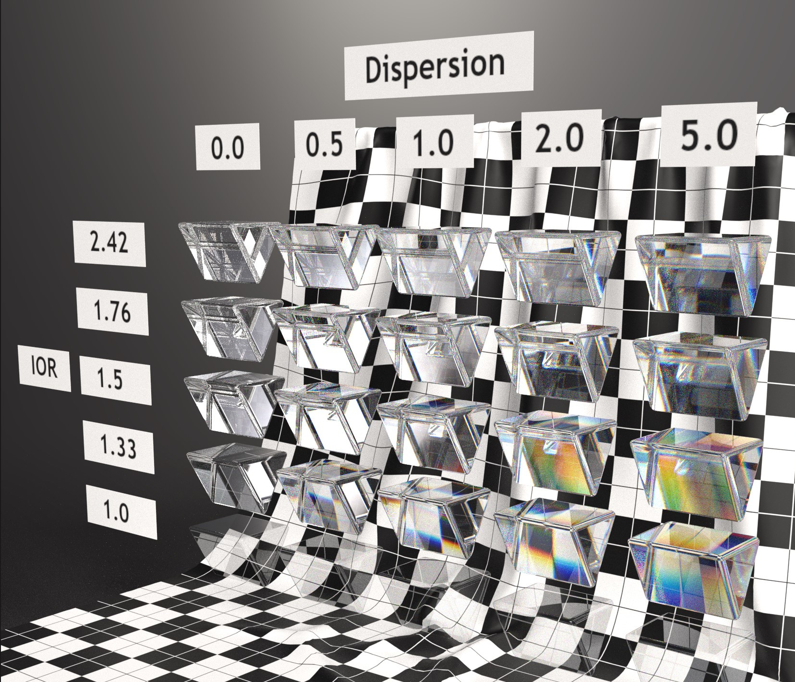

# KHR\_materials\_dispersion

## Contributors

- Ben Houston, Threekit [@bhouston](https://github.com/bhouston)
- Bastian Sdorra, Dassault Systemes [@bsdorra](https://github.com/bsdorra)
- Tobias Haeussler [@proog128](https://github.com/proog128)
- Mike Bond, Adobe [@miibond](https://github.com/MiiBond)
- Alexey Knyazev, Individual Contributor, [@lexaknyazev](https://github.com/lexaknyazev)
- Eric Chadwick, DGG, [@echadwick-artist](https://github.com/echadwick-artist)
- Alex Wood, AGI [@abwood](https://github.com/abwood)
- Ed Mackey, AGI [@emackey](https://github.com/emackey)

Copyright 2024 The Khronos Group Inc. All Rights Reserved. glTF is a trademark of The Khronos Group Inc.
See [Appendix](#appendix-full-khronos-copyright-statement) for full Khronos Copyright Statement.

## Status

Complete, Ratified by the Khronos Group

## Dependencies

- Written against the glTF 2.0 spec.
- The `KHR_materials_volume` extension as this builds upon its volumetric effect.

## Exclusions

- This extension must not be used on a material that also uses `KHR_materials_pbrSpecularGlossiness`.
- This extension must not be used on a material that also uses `KHR_materials_unlit`.

## Overview

This extension adds one parameter to the metallic-roughness material: `dispersion`.

`dispersion` enables configuring the strength of the angular separation of colors (chromatic aberration) transmitting through a relatively clear volume.  It is an enhancement to the default ```KHR_materials_volume``` transmission model which assumes no dispersion.

Optical dispersion is represented in terms of the Abbe number parameterization \( $V_d$ \).  The dispersion effect is a result of the wavelength-dependent index of refraction of a material.  Dispersion is a widely adopted parameter in modern PBR models.  It is present in both OpenPBR (as *transmission_dispersion_abbe_number*) and the Dassault Enterprise PBR Shading Model (as $V_d$).

With the simplifying assumption that the index of refraction variance is linear,
the Abbe number \( $V_d$ \) for visible light is computed as:
$$V_d = \frac{n_d - 1}{n_F - n_C}$$

where $n_F$, $n_d$ and $n_C$ are the indices of refraction at the wavelengths of the Fraunhofer F, d, and C spectral lines: 
$$\lambda_F = 486.13 nm$$
$$\lambda_d = 587.56 nm$$
$$\lambda_C = 656.27 nm$$


To calculate the index of refraction at a specific wavelength \( $\lambda$ \), we use the first two terms of Cauchy's equation:

$$
n(\lambda) = A + \frac{B}{\lambda^2}
$$

Given an Abbe number \( $V_d$ \) and the central index of refraction as specified by the ```KHR_materials_ior``` extension (assumed to be at the central wavelength, \( $n_d$ \)), the coefficients are defined as:

$$
B = \frac{n_d - 1}{V_d \left( {\lambda_F^{-2}} - {\lambda_C^{-2}} \right)}
$$

And:

$$
A = n_d - \frac{B}{\lambda_d^2}
$$

By substituting the symbolic wavelength constants $\lambda_d$, $\lambda_F$, and $\lambda_C$ with the values provided above we get:

$$
n(\lambda) = \max(n_d + \frac{n_d-1}{V_d} \left( \frac{523655}{\lambda^2} - 1.5168 \right), 1)
$$

In this extension, we store a transformed dispersion instead of the Abbe number directly.  Specifically we store $20/V_d$ so that a value of 1.0 is equivalent to $V_d=20$, which is about the lowest Abbe number for normal materials. Values over 1.0 are still valid for artists that want to exaggerate the effect. Decreasing values lower the amount of dispersion down to 0.0.

> [!NOTE]
> This is the same transform used by both Adobe Standard Material and ASWF's OpenPBR.

## Extending Materials

The dispersion, defined in terms of Abbe number, is defined by adding the `KHR_materials_dispersion` extension to any glTF material.

```json
{
    "materials": [
        {
            "extensions": {
                "KHR_materials_dispersion": {
                    "dispersion": 0.1
                }
            }
        }
    ]
}
```

| |Type|Description|Required|
|-|----|-----------|--------|
| **dispersion** | `number` | The strength of the dispersion effect, specified as 20/Abbe number. | No, default: `0`|

The default value of 0 has a special meaning in that no dispersion should be used.  This is the default value for backwards compatibility.  Any value zero or larger is considered to be a valid dispersion value, although the range between [0 , 1] is the range of realistic values.

Here is a table of some material dispersion Abbe numbers, including the outlier of Rutile which is a very high dispersion material:

| Material | Abbe Number (V) | Dispersion (20/V) |
| -------- | ----------- | -------------- |
| Rutile | 9.8 | 2.04 |
| Polycarbonate | 32 | 0.625 |
| Diamond | 55 | 0.36 |
| Water | 55 | 0.36 |
| Crown Glass | 59 | 0.33 |

## Implementation

*This section is non-normative.*

Dispersion can have a large influence on the look of objects such as gemstones.  However, note that gemstones have many internal reflections, and dispersion alone is not enough to capture their look in a real-time rasterizer.  Here is a path-traced example of a gemstone with dispersion (left) and without.



One real-time method for rendering dispersion effects is to trace volume transmission separately for each of color channel accounting for the per channel IOR as determined by the Abbe number.  The resulting composite image will show color separation between the channels as a result.

For this method, use the material's IOR value (from `KHR_materials_ior`, or the default `1.5`) for the green channel's IOR ($n_d$).  The full spread of IOR values from the blue to red channel's IORs ($n_F - n_C$) can be calculated from the following equation.  Only half of this spread is used to calculate the distance between green's IOR and red or blue.

$$n_F - n_C = \frac{n_d - 1}{V_d}$$

This extension defines `dispersion` as $20/V_d$.  Taking this into account, the following GLSL sample will calculate three IOR values for use in the red, green, and blue channels:

```glsl
    // Dispersion will spread out the ior values for each r,g,b channel
    float halfSpread = (ior - 1.0) * 0.025 * dispersion;
    vec3 iors = vec3(ior - halfSpread, ior, ior + halfSpread);
```

The red channel will always have the smallest IOR value.  In extreme cases, a clamp may be required to prevent this value falling below `1.0`.

The following screenshot demonstrates the above technique as rendered in real-time by BabylonJS:



For comparison, here is the same sample model path-traced in Adobe Substance 3D Stager:



In general, higher IOR values result in more visible dispersion, up until the point where the IOR values become so high that the light encounters total internal reflection within a volume.

## Schema

- [material.KHR_materials_dispersion.schema.json](schema/material.KHR_materials_dispersion.schema.json)

## Reference

### Theory, Documentation and Implementations

[Abbe Number - Wikipedia](https://en.wikipedia.org/wiki/Abbe_number)

[Abbe Number - Wolfram Formula Repository](https://resources.wolframcloud.com/FormulaRepository/resources/Abbe-Number)

[OpenPBR Surface specification](https://academysoftwarefoundation.github.io/OpenPBR/)

[Enterprise PBR Shading Model](https://dassaultsystemes-technology.github.io/EnterprisePBRShadingModel/spec-2022x.md.html#components/dispersion)

[Mikhail N. Polyanskiy. Refractive Index Database (2023)](https://refractiveindex.info)

[SCHOTT. Interactive Abbe Diagram (2023)](https://www.schott.com/en-gb/special-selection-tools/interactive-abbe-diagram)


## Appendix: Full Khronos Copyright Statement

Copyright 2024 The Khronos Group Inc.

Some parts of this Specification are purely informative and do not define requirements
necessary for compliance and so are outside the Scope of this Specification. These
parts of the Specification are marked as being non-normative, or identified as
**Implementation Notes**.

Where this Specification includes normative references to external documents, only the
specifically identified sections and functionality of those external documents are in
Scope. Requirements defined by external documents not created by Khronos may contain
contributions from non-members of Khronos not covered by the Khronos Intellectual
Property Rights Policy.

This specification is protected by copyright laws and contains material proprietary
to Khronos. Except as described by these terms, it or any components
may not be reproduced, republished, distributed, transmitted, displayed, broadcast
or otherwise exploited in any manner without the express prior written permission
of Khronos.

This specification has been created under the Khronos Intellectual Property Rights
Policy, which is Attachment A of the Khronos Group Membership Agreement available at
www.khronos.org/files/member_agreement.pdf. Khronos grants a conditional
copyright license to use and reproduce the unmodified specification for any purpose,
without fee or royalty, EXCEPT no licenses to any patent, trademark or other
intellectual property rights are granted under these terms. Parties desiring to
implement the specification and make use of Khronos trademarks in relation to that
implementation, and receive reciprocal patent license protection under the Khronos
IP Policy must become Adopters and confirm the implementation as conformant under
the process defined by Khronos for this specification;
see https://www.khronos.org/adopters.

Khronos makes no, and expressly disclaims any, representations or warranties,
express or implied, regarding this specification, including, without limitation:
merchantability, fitness for a particular purpose, non-infringement of any
intellectual property, correctness, accuracy, completeness, timeliness, and
reliability. Under no circumstances will Khronos, or any of its Promoters,
Contributors or Members, or their respective partners, officers, directors,
employees, agents or representatives be liable for any damages, whether direct,
indirect, special or consequential damages for lost revenues, lost profits, or
otherwise, arising from or in connection with these materials.

Vulkan is a registered trademark and Khronos, OpenXR, SPIR, SPIR-V, SYCL, WebGL,
WebCL, OpenVX, OpenVG, EGL, COLLADA, glTF, NNEF, OpenKODE, OpenKCAM, StreamInput,
OpenWF, OpenSL ES, OpenMAX, OpenMAX AL, OpenMAX IL, OpenMAX DL, OpenML and DevU are
trademarks of The Khronos Group Inc. ASTC is a trademark of ARM Holdings PLC,
OpenCL is a trademark of Apple Inc. and OpenGL and OpenML are registered trademarks
and the OpenGL ES and OpenGL SC logos are trademarks of Silicon Graphics
International used under license by Khronos. All other product names, trademarks,
and/or company names are used solely for identification and belong to their
respective owners.
