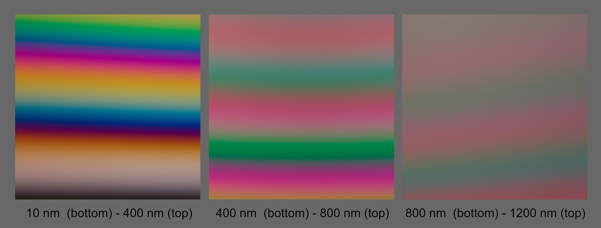
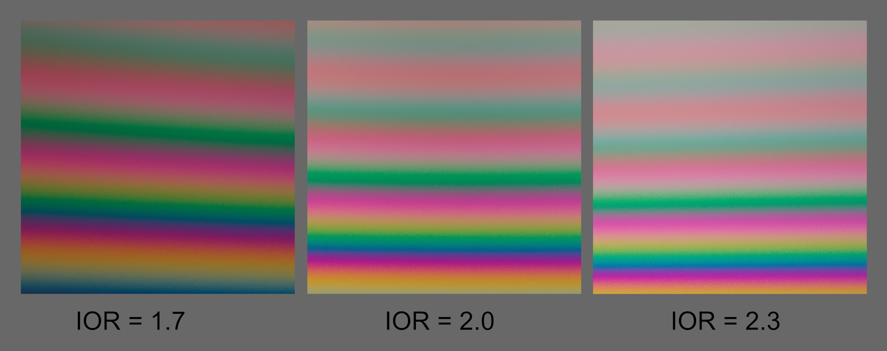
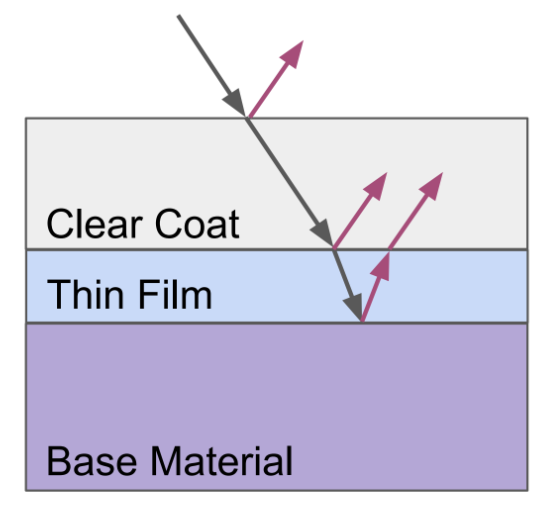

# KHR\_materials\_iridescence

## Khronos 3D Formats Working Group

* Pascal Schoen, adidas  
* Ben Houston, threekit  
* Mathias Kanzler, UX3D
* Norbert Nopper, UX3D [@UX3DGpuSoftware](https://twitter.com/UX3DGpuSoftware)  

Copyright (C) 2018-2021 The Khronos Group Inc. All Rights Reserved. glTF is a trademark of The Khronos Group Inc.
See [Appendix](#appendix-full-khronos-copyright-statement) for full Khronos Copyright Statement.

## Status

Draft

## Dependencies

Written against the glTF 2.0 spec.

## Exclusions

* This extension must not be used on a material that also uses `KHR_materials_pbrSpecularGlossiness`.
* This extension must not be used on a material that also uses `KHR_materials_unlit`.

## Overview

Iridescence describes an effect where hue varies depending on the viewing angle and illumination angle: A thin-film of a semi-transparent layer results in inter-reflections and due to thin-film interference, certain wavelengths get absorbed or amplified. Iridescence can be seen on soap bubbles, oil films, or on the wings of many insects.
With this extension, thickness and index of refraction (IOR) of the thin-film can be specified, enabling iridescent materials. 

## Extending Materials

The iridescence materials are defined by adding the `KHR_materials_iridescence` extension to any glTF material.

```json
{
    "materials": [
        {
            "extensions": {
                "KHR_materials_iridescence": {
                    "iridescenceFactor": 1.0,
                    "iridescenceIOR": 1.8,
                    "iridescenceThicknessMaximum": 1200.0
                }
            }
        }
    ]
}
```

### Iridescence

All implementations should use the same calculations for the BRDF inputs. Implementations of the BRDF itself can vary based on device performance and resource constraints. See [appendix](https://www.khronos.org/registry/glTF/specs/2.0/glTF-2.0.html#appendix-b-brdf-implementation) for more details on the BRDF calculations.

|                              | Type                                                                | Description                                                                                      | Required              |
|------------------------------|---------------------------------------------------------------------|--------------------------------------------------------------------------------------------------|-----------------------|
|**iridescenceFactor**         | `number`                                                            | The iridescence intensity.                                                                       | No, default: `0.0`    |
|**iridescenceTexture**        | [`textureInfo`](https://www.khronos.org/registry/glTF/specs/2.0/glTF-2.0.html#reference-textureinfo) | The iridescence intensity stored in the red channel of the texture.                                                               | No                    |
|**iridescenceIOR**               | `number`                                                            | The index of refraction of the dielectric thin-film layer.                                       | No, default: `1.8`    |
|**iridescenceThicknessMinimum**  | `number`                                                            | The minimum thickness of the thin-film layer given in nanometers (nm).                                                    | No, default: `100.0`  |
|**iridescenceThicknessMaximum**  | `number`                                                            | The maximum thickness of the thin-film layer given in nanometers (nm).                                                    | No, default: `400.0` |
|**iridescenceThicknessTexture**  | [`textureInfo`](https://www.khronos.org/registry/glTF/specs/2.0/glTF-2.0.html#reference-textureinfo) | The green channel of this texture defines the thickness of the thin-film layer by blending between the minimum and maximum thickness. | No                    |

The values for iridescence intensity can be defined using a factor, a texture, or both.
`iridescenceFactor` is multiplied with the red channel of `iridescenceTexture` to control the overall strength of the iridescence effect. If the texture is not set, a value of 1.0 is assumed for the texture. 
```
iridescence = iridescenceFactor * iridescenceTexture.r
```

If `iridescenceFactor` is zero (default), the iridescence extension has no effect on the material. 
All textures in this extension use a single channel in linear space. 
The thickness of the thin-film is set to `iridescenceThicknessMaximum` if `iridescenceThicknessTexture` is not given.
If `iridescenceThicknessTexture` is set, the thickness of the thin-film varies between  `iridescenceThicknessMinimum` and `iridescenceThicknessMaximum` as follows: 
```
thickness = mix(iridescenceThicknessMinimum, iridescenceThicknessMaximum, iridescenceThicknessTexture.g)
```

Aside from light direction and IOR, the thickness of the thin-film defines the variation in hue. 
This effect is the result of constructive and destructive interferences of certain wavelengths. 
If the the optical path difference between the ray reflected at the thin-film and the ray reflected at the base material is half the wavelength (λ), the resulting 180 degree phase shift is cancelling out the reflected light:

<figure>

<figcaption><em> </em></figcaption>
</figure>

With a thin-film thickness near half the wavelength of visible light (380 nm - 750 nm), the effect is most visible. 
By increasing the thin-film thickness, multiples of wavelengths are still causing wave interferences, however, as the optical path distance increases, different rays are mixed in. 
This leads to more pastel colored patterns for increased thickness:

<figure>

<figcaption><em>Comparison of different iridescence thickness ranges for a constant iridescence IOR value of 1.8. </em></figcaption>
</figure>

The thin-film layer can have a different IOR than the underlying material. With `iridescenceIOR` one can set an IOR value for the thin-film layer independently. 
This also has an effect on the optical path difference:

<figure>

<figcaption><em>Comparison of different iridescence IOR values for a thin-film thickness range between 200 nm (bottom) and 800 nm (top).</em></figcaption>
</figure>


The iridescence effect is modeled via a microfacet BRDF with a modified Fresnel reflectance term that accounts for inter-reflections as shown in [Laurent Belcour and Pascal Barla (2017)](https://belcour.github.io/blog/research/publication/2017/05/01/brdf-thin-film.html).


## Implementation Notes

*This section is non-normative.*

For the calculation of `f_specular`, the original Fresnel term `F_schlick` is exchanged with a newly introduced `F_iridescence` term. 
To artistically control the strength of the iridescence effect, the two Fresnel terms are mixed by using the `iridescenceFactor`:
```
F = mix(F_schlick, F_iridescence, iridescenceFactor)
```

To calculate `F_iridescence` we need to calculate the spectral differences. 
At first, optical path differences (`diff`) between rays reflected at the thin-film and at the base material have to be calculated:
```
diff = 2.0 * IOR_iridescence * thin_film_thickness * cos(viewAngle)
```
With the path difference, the phase shift can be calculated in Fourier space.


A complete implementation for evaluating `F_iridescence` can be found in the shader file of the Khronos Sample Viewer:
[iridescence.glsl](https://github.com/PascalSchoen/glTF-Sample-Viewer/blob/feature/KHR_materials_iridescence/source/Renderer/shaders/iridescence.glsl)

### Clearcoat
Considering KHR_materials_clearcoat extension, the clearcoat layer is evaluated before the thin-film layer. 
Light that is passing through the clearcoat is then processed as described taking into account differences in IOR. 
<figure>

<figcaption><em> </em></figcaption>
</figure>


## Reference

### Theory, Documentation and Implementations

[A Practical Extension to Microfacet Theory for the Modeling of Varying Iridescence](https://belcour.github.io/blog/research/publication/2017/05/01/brdf-thin-film.html)  
[Arnold for Maya user guide - Thin Film](https://docs.arnoldrenderer.com/display/A5AFMUG/Thin+Film)  
[Artist Friendly Metallic Fresnel](http://jcgt.org/published/0003/04/03/)  
[Practical Multilayered Materials in Call of Duty: Infinite Warfare](https://blog.selfshadow.com/publications/s2017-shading-course/drobot/s2017_pbs_multilayered.pdf)  
[Real-time Image-based Lighting of Microfacet BRDFs with Varying Iridescence](https://cg.cs.uni-bonn.de/en/publications/paper-details/kneiphof-2019-iridescence/)  
[Real-Time Rendering, Fourth Edition; page 361ff](https://www.realtimerendering.com/)  
[Rendering Iridescent Objects in Real-time](http://dspace.library.uu.nl/handle/1874/287110)  

## Schema

[glTF.KHR_materials_iridescence.schema.json](schema/glTF.KHR_materials_iridescence.schema.json)


## Appendix: Full Khronos Copyright Statement

Copyright 2018-2021 The Khronos Group Inc.

Some parts of this Specification are purely informative and do not define requirements
necessary for compliance and so are outside the Scope of this Specification. These
parts of the Specification are marked as being non-normative, or identified as
**Implementation Notes**.

Where this Specification includes normative references to external documents, only the
specifically identified sections and functionality of those external documents are in
Scope. Requirements defined by external documents not created by Khronos may contain
contributions from non-members of Khronos not covered by the Khronos Intellectual
Property Rights Policy.

This specification is protected by copyright laws and contains material proprietary
to Khronos. Except as described by these terms, it or any components
may not be reproduced, republished, distributed, transmitted, displayed, broadcast
or otherwise exploited in any manner without the express prior written permission
of Khronos.

This specification has been created under the Khronos Intellectual Property Rights
Policy, which is Attachment A of the Khronos Group Membership Agreement available at
www.khronos.org/files/member_agreement.pdf. Khronos grants a conditional
copyright license to use and reproduce the unmodified specification for any purpose,
without fee or royalty, EXCEPT no licenses to any patent, trademark or other
intellectual property rights are granted under these terms. Parties desiring to
implement the specification and make use of Khronos trademarks in relation to that
implementation, and receive reciprocal patent license protection under the Khronos
IP Policy must become Adopters and confirm the implementation as conformant under
the process defined by Khronos for this specification;
see https://www.khronos.org/adopters.

Khronos makes no, and expressly disclaims any, representations or warranties,
express or implied, regarding this specification, including, without limitation:
merchantability, fitness for a particular purpose, non-infringement of any
intellectual property, correctness, accuracy, completeness, timeliness, and
reliability. Under no circumstances will Khronos, or any of its Promoters,
Contributors or Members, or their respective partners, officers, directors,
employees, agents or representatives be liable for any damages, whether direct,
indirect, special or consequential damages for lost revenues, lost profits, or
otherwise, arising from or in connection with these materials.

Vulkan is a registered trademark and Khronos, OpenXR, SPIR, SPIR-V, SYCL, WebGL,
WebCL, OpenVX, OpenVG, EGL, COLLADA, glTF, NNEF, OpenKODE, OpenKCAM, StreamInput,
OpenWF, OpenSL ES, OpenMAX, OpenMAX AL, OpenMAX IL, OpenMAX DL, OpenML and DevU are
trademarks of The Khronos Group Inc. ASTC is a trademark of ARM Holdings PLC,
OpenCL is a trademark of Apple Inc. and OpenGL and OpenML are registered trademarks
and the OpenGL ES and OpenGL SC logos are trademarks of Silicon Graphics
International used under license by Khronos. All other product names, trademarks,
and/or company names are used solely for identification and belong to their
respective owners.
