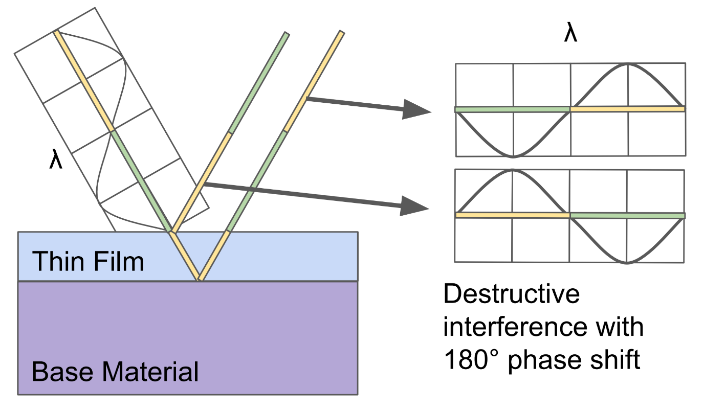
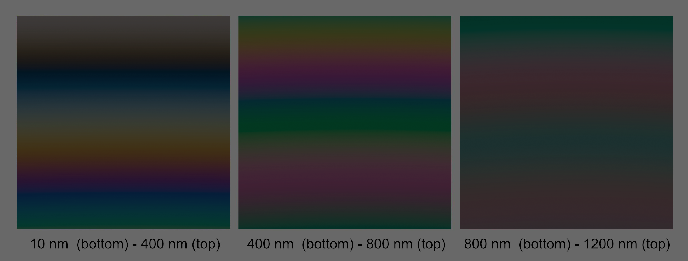
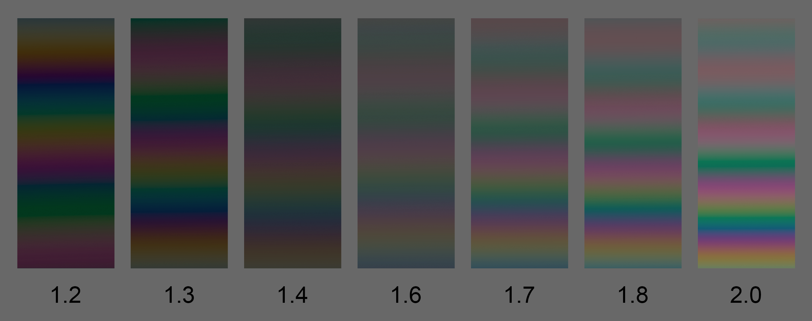

# KHR\_materials\_iridescence

## Contributors

- Pascal Schoen, Adidas
- Tobias Haeussler, Dassault Systemes [@proog128](https://github.com/proog128)
- Ben Houston, Threekit, [@bhouston](https://twitter.com/BenHouston3D)
- Mathias Kanzler, UX3D
- Norbert Nopper, UX3D [@UX3DGpuSoftware](https://twitter.com/UX3DGpuSoftware)
- Jim Eckerlein, UX3D
- Alexey Knyazev, Individual Contributor, [@lexaknyazev](https://github.com/lexaknyazev)
- Eric Chadwick, Wayfair, [echadwick-wayfair](https://github.com/echadwick-wayfair)
- Alex Wood, AGI [@abwood](https://github.com/abwood)
- Ed Mackey, AGI [@emackey](https://github.com/emackey)

Copyright (C) 2018-2022 The Khronos Group Inc. All Rights Reserved. glTF is a trademark of The Khronos Group Inc.
See [Appendix](#appendix-full-khronos-copyright-statement) for full Khronos Copyright Statement.

## Status

Complete, Ratified by the Khronos Group

## Dependencies

Written against the glTF 2.0 spec.

## Exclusions

- This extension must not be used on a material that also uses `KHR_materials_pbrSpecularGlossiness`.
- This extension must not be used on a material that also uses `KHR_materials_unlit`.

## Overview

Iridescence describes an effect where hue varies depending on the viewing angle and illumination angle: A thin-film of a semi-transparent layer results in inter-reflections and due to thin-film interference, certain wavelengths get absorbed or amplified. Iridescence can be seen on soap bubbles, oil films, or on the wings of many insects.
With this extension, thickness and index of refraction (IOR) of the thin-film can be specified, enabling iridescent materials.

## Extending Materials

The iridescence materials are defined by adding the `KHR_materials_iridescence` extension to any glTF material.

```json
{
    "materials": [
        {
            "extensions": {
                "KHR_materials_iridescence": {
                    "iridescenceFactor": 1.0,
                    "iridescenceIor": 1.3,
                    "iridescenceThicknessMaximum": 400.0
                }
            }
        }
    ]
}
```

## Properties

All implementations should use the same calculations for the BRDF inputs. Implementations of the BRDF itself can vary based on device performance and resource constraints. See [appendix](https://www.khronos.org/registry/glTF/specs/2.0/glTF-2.0.html#appendix-b-brdf-implementation) for more details on the BRDF calculations.

|                                 | Type                                                                                                 | Description                                                       | Required            |
| ------------------------------- | ---------------------------------------------------------------------------------------------------- | ------------------------------------------------------------------| ------------------- |
| **iridescenceFactor**           | `number`                                                                                             | The iridescence intensity factor.                                 | No, default:`0.0`   |
| **iridescenceTexture**          | [`textureInfo`](https://www.khronos.org/registry/glTF/specs/2.0/glTF-2.0.html#reference-textureinfo) | The iridescence intensity texture.                                | No                  |
| **iridescenceIor**              | `number`                                                                                             | The index of refraction of the dielectric thin-film layer.        | No, default:`1.3`   |
| **iridescenceThicknessMinimum** | `number`                                                                                             | The minimum thickness of the thin-film layer given in nanometers. | No, default:`100.0` |
| **iridescenceThicknessMaximum** | `number`                                                                                             | The maximum thickness of the thin-film layer given in nanometers. | No, default:`400.0` |
| **iridescenceThicknessTexture** | [`textureInfo`](https://www.khronos.org/registry/glTF/specs/2.0/glTF-2.0.html#reference-textureinfo) | The thickness texture of the thin-film layer.                     | No                  |

The values for iridescence intensity can be defined using a factor, a texture, or both.
`iridescenceFactor` is multiplied with the red channel of `iridescenceTexture` to control the overall strength of the iridescence effect. If the texture is not set, a value of 1.0 is assumed for the texture.

```glsl
iridescence = iridescenceFactor * iridescenceTexture.r
```

If `iridescenceFactor` is zero (default), the iridescence extension has no effect on the material.
All textures in this extension use a single channel in linear space.

The thickness of the thin-film is defined by the `iridescenceThicknessMinimum`, `iridescenceThicknessMaximum`, and `iridescenceThicknessTexture` properties. The `iridescenceThicknessMinimum` and `iridescenceThicknessMaximum` values correspond to the sampled thickness texture values of 0.0 and 1.0 respectively, thus defining the effective range of the thin-film thickness as follows:

```glsl
thickness = mix(iridescenceThicknessMinimum, iridescenceThicknessMaximum, iridescenceThicknessTexture.g)
```

The `iridescenceThicknessMinimum` value **MAY** be greater than `iridescenceThicknessMaximum` value.

If the thickness texture is not present, it is implicitly sampled as 1.0 so the thin-film thickness is uniformly set to the `iridescenceThicknessMaximum` value.

Aside from light direction and IOR, the thickness of the thin-film defines the variation in hue.
This effect is the result of constructive and destructive interferences of certain wavelengths.
If the the optical path difference between the ray reflected at the thin-film and the ray reflected at the base material is half the wavelength (λ), the resulting 180 degree phase shift is cancelling out the reflected light:

<figure style="padding: 10px;">

<figcaption><em> </em></figcaption>
</figure>

With a thin-film thickness near half the wavelength of visible light (380 nm - 750 nm), the effect is most visible.
By increasing the thin-film thickness, multiples of wavelengths are still causing wave interferences, however, as the optical path distance increases, different rays are mixed in.
This leads to more pastel colored patterns for increased thickness:

<figure style="padding: 10px;">

<figcaption><em>Comparison of different iridescence thickness ranges for a constant iridescence IOR value of 1.3 on a dielectric base material with IOR value of 1.5. </em></figcaption>
</figure>

The thin-film layer can have a different IOR than the underlying material. With `iridescenceIor` one can set an IOR value for the thin-film layer independently. The more this value differs from the IOR of the base material, the stronger the iridescence. It also has an effect on the optical path difference as visible here:

<figure style="padding: 10px;">

<figcaption><em>Comparison of different iridescence IOR values for a thin-film thickness range between 200 nm (bottom) and 800 nm (top) on a dielectric base material with IOR value of 1.5.</em></figcaption>
</figure>

The iridescence effect is modeled via a microfacet BRDF with a modified Fresnel reflectance term that accounts for inter-reflections as shown in the paper from [Belcour/Barla](#theory-documentation-and-implementations).

## Iridescence BRDF

### Metal Base Material

The metal BRDF in the glTF 2.0 core specification in [B.2.1. Metals](https://www.khronos.org/registry/glTF/specs/2.0/glTF-2.0.html#metals) will be replaced by the following term:

```
metal_brdf =
  iridescent_conductor_layer(
    iridescence_strength = iridescence,
    iridescence_thickness = iridescenceThickness,
    iridescence_ior = iridescenceIor,
    outside_ior = 1.0,
    base_f0 = baseColor,
    specular_brdf = specular_brdf(
      α = roughness ^ 2))
```

### Dielectric Base Material

The dielectric BRDF in the glTF 2.0 core specification in [B.2.2. Dielectrics](https://www.khronos.org/registry/glTF/specs/2.0/glTF-2.0.html#dielectrics) will be replaced by the following term:

```
dielectric_brdf =
  iridescent_dielectric_layer(
    iridescence_strength = iridescence,
    iridescence_thickness = iridescenceThickness,
    iridescence_ior = iridescenceIor,
    outside_ior = 1.0,
    base_ior = 1.5,
    base = diffuse_brdf(
      color = baseColor),
    specular_brdf = specular_brdf(
      α = roughness ^ 2))
```

For transmissive `base` materials, the `diffuse_brdf(...)` will be replaced by the mix between a `diffuse_brdf(...)` and a `specular_btdf(...)` as described in the [`KHR_materials_transmission`](../KHR_materials_transmission#transmission-btdf) extension.

The `base_ior` can be changed using the [`KHR_materials_ior`](../KHR_materials_ior) extension.

In case of combining `KHR_materials_iridescence` with [`KHR_materials_specular`](../KHR_materials_specular/README.md), `dielectric_brdf` becomes the following:

```
dielectric_brdf =
  iridescent_dielectric_layer(
    iridescence_strength = iridescence,
    iridescence_thickness = iridescenceThickness,
    iridescence_ior = iridescenceIor,
    outside_ior = 1.0,
    base_ior = 1.5,
    base_f0_color = specularColor.rgb,
    specular_weight = specular,
    base = diffuse_brdf(
      color = baseColor),
    specular_brdf = specular_brdf(
      α = roughness ^ 2))
```

### Clearcoat

When adding a clearcoat ontop, an additional interface between the clearcoat and thin-film layer would be created. Due to simplicity and artistical friendlyness, this interface is ignored.

## Implementation Notes

### Metal Base Material

```
function iridescent_conductor_layer(iridescence_strength, iridescence_thickness, iridescence_ior, outside_ior, base_f0, specular_brdf) {
  return mix(
    conductor_fresnel(base_f0, specular_brdf),
    specular_brdf * iridescent_fresnel(
      outside_ior,
      iridescence_ior,
      base_f0,
      iridescence_thickness),
    iridescence_strength)
}
```

### Dielectric Base Material

```
function iridescent_dielectric_layer(iridescence_strength, iridescence_thickness, iridescence_ior, outside_ior, base_ior, base, specular_brdf) {
  base_f0 = ((1-base_ior)/(1+base_ior))^2

  iridescent_f = iridescent_fresnel(
    outside_ior,
    iridescence_ior,
    base_f0,
    iridescence_thickness)

  return mix(
    fresnel_mix(base_ior, base, specular_brdf),
    rgb_mix(base, specular_brdf, iridescent_f),
    iridescence_strength)
}
```

Similar to [`KHR_materials_specular`](../KHR_materials_specular/README.md#implementation), to ensure energy conservation, the base BRDF is weighted with the inverse of the maximum component value of the iridescence Fresnel color and then added with the specular iridescence BRDF inside the `rgb_mix()` function:

```
function rgb_mix(base, specular_brdf, rgb_alpha) {
    rgb_alpha_max = max(rgb_alpha.r, rgb_alpha.g, rgb_alpha.b)

    return (1 - rgb_alpha_max) * base + rgb_alpha * specular_brdf
}
```

If instead `1 - rgb_alpha` would be used directly, inverse colors would be created. By using the maximum component value, no energy would be gained.

When using this extension together with the [`KHR_materials_specular`](../KHR_materials_specular/README.md#implementation) extension the `iridescent_dielectric_layer()` function changes slightly (as already pointed out in the previous section):

```
function iridescent_dielectric_layer(iridescence_strength, iridescence_thickness, iridescence_ior, outside_ior, base_ior, base_f0_color, specular_weight, base, specular_brdf) {
  base_f0 = ((1-base_ior)/(1+base_ior))^2 * base_f0_color
  base_f0 = min(base_f0, float3(1.0))
  fr = base_f0 + (1 - base_f0)*(1 - abs(VdotH))^5

  iridescent_f = iridescent_fresnel(
    outside_ior,
    iridescence_ior,
    specular_weight * base_f0,
    iridescence_thickness)

  return rgb_mix(
    base,
    specular_brdf,
    mix(specular_weight * fr, iridescent_f, iridescence_strength))
}
```

The two additional parameters `base_f0_color` and `specular_weight` correspond to `f0_color` and `weight` of the `dielectric_brdf` in [`KHR_materials_specular`](../KHR_materials_specular/README.md#extending-materials).

### Iridescence Fresnel

*This section is non-normative.*

The calculation of `iridescent_fresnel(...)` is described in the following sections as GLSL code at the viewing angle $\theta_1$. For glTF an approximation of the original model (defined in the Mitsuba code example from [Belcour/Barla](#theory-documentation-and-implementations)) is used.

```glsl
vec3 iridescent_fresnel(outsideIor, iridescenceIor, baseF0, iridescenceThickness, cosTheta1) {
    vec3 F_iridescence = vec3(0.0);

    // Calculation of the iridescence Fresnel for the viewing angle theta1
    ...

    return F_iridescence;
}
```

#### **Material Interfaces**

The iridescence model defined by [Belcour/Barla](#theory-documentation-and-implementations) models two material interfaces - one from the outside to the thin-film layer and another one from the thin-film to the base material. These two interfaces are defined as follows:

```glsl
// First interface
float R0 = IorToFresnel0(iridescenceIor, outsideIor);
float R12 = F_Schlick(R0, cosTheta1);
float R21 = R12;
float T121 = 1.0 - R12;

// Second interface
vec3 baseIor = Fresnel0ToIor(baseF0 + 0.0001); // guard against 1.0
vec3 R1 = IorToFresnel0(baseIor, iridescenceIor);
vec3 R23 = F_Schlick(R1, cosTheta2);
```

`iridescenceIor` is the index of refraction of the thin-film layer, `outsideIor` the IOR outside the thin-film (usually air) and `baseIor` the IOR of the base material. The latter is calculated from its F0 value using the inverse of the special normal incidence case of Fresnel's equations:

```glsl
// Assume air interface for top
vec3 Fresnel0ToIor(vec3 F0) {
    vec3 sqrtF0 = sqrt(F0);
    return (vec3(1.0) + sqrtF0) / (vec3(1.0) - sqrtF0);
}
```

This simple formula is used for both dielectrics and metals. While it is physically correct for dielectric materials, it's only an approximation for metals, which are usually described using a complex IOR with an additional extinction factor. Such a value cannot be accurately inferred from the F0 value and is thus assumed to be `0.0`.

To calculate the reflectance factors at normal incidence of both interfaces (`R0` and `R1`), the special case is used as is:

$$R = \left|\frac{n_1 - n_2}{n_1 + n_2 }\right|^2$$

```glsl
float IorToFresnel0(float transmittedIor, float incidentIor) {
    return pow((transmittedIor - incidentIor) / (transmittedIor + incidentIor), 2.0);
}
```

To calculate the reflectances `R12` and `R23` at the viewing angles $\theta_1$ (angle hitting the thin-film layer) and $\theta_2$ (angle after refraction in the thin-film) Schlick Fresnel is again used. This approximation allows to eliminate the split into S and P polarization for the exact Fresnel equations.

$\theta_2$ can be calculated using Snell's law (with $\eta_1$ being `outsideIor` and $\eta_2$ being `iridescenceIor`):

$$\cos(\theta_2) = \sqrt{1-\left(\frac{\eta_1}{\eta_2}\right)^2\left(1-\cos^2(\theta_1)\right)}$$

```glsl
float sinTheta2Sq = pow(outsideIor / iridescenceIor, 2.0) * (1.0 - pow(cosTheta1, 2.0));
float cosTheta2Sq = 1.0 - sinTheta2Sq;

// Handle total internal reflection
if (cosTheta2Sq < 0.0) {
    return vec3(1.0);
}

float cosTheta2 = sqrt(cosTheta2Sq);
```

#### **Phase Shift**

The phase shift is as follows:

$$\Delta\phi=2\pi\lambda^{-1}\mathcal{D}$$

and depends on the first-order optical path difference $\mathcal{D}$ (or `OPD`):

```glsl
OPD = 2.0 * iridescenceIor * iridescenceThickness * cosTheta2;
```

`phi12` and `phi23` define the base phases per interface and are approximated with `0.0` if the IOR of the hit material (`iridescenceIor` or `baseIor`) is higher than the IOR of the previous material (`outsideIor` or `iridescenceIor`) and *π* otherwise. Also here, polarization is ignored.

```glsl
// First interface
float phi12 = 0.0;
if (iridescenceIor < outsideIor) phi12 = M_PI;
float phi21 = M_PI - phi12;

// Second interface
vec3 phi23 = vec3(0.0);
if (baseIor[0] < iridescenceIor) phi23[0] = M_PI;
if (baseIor[1] < iridescenceIor) phi23[1] = M_PI;
if (baseIor[2] < iridescenceIor) phi23[2] = M_PI;

// Phase shift
vec3 phi = vec3(phi21) + phi23;
```

#### **Analytic Spectral Integration**

Spectral integration is performed in the Fourier space.

```glsl
// Compound terms
vec3 R123 = clamp(R12 * R23, 1e-5, 0.9999);
vec3 r123 = sqrt(R123);
vec3 Rs = sq(T121) * R23 / (vec3(1.0) - R123);

// Reflectance term for m = 0 (DC term amplitude)
vec3 C0 = R12 + Rs;
I = C0;

// Reflectance term for m > 0 (pairs of diracs)
vec3 Cm = Rs - T121;
for (int m = 1; m <= 2; ++m)
{
    Cm *= r123;
    vec3 Sm = 2.0 * evalSensitivity(float(m) * OPD, float(m) * phi);
    I += Cm * Sm;
}

F_iridescence = max(I, vec3(0.0));
```

With the sensitivity evaluation function being:

```glsl
vec3 evalSensitivity(float OPD, vec3 shift) {
    float phase = 2.0 * M_PI * OPD * 1.0e-9;
    vec3 val = vec3(5.4856e-13, 4.4201e-13, 5.2481e-13);
    vec3 pos = vec3(1.6810e+06, 1.7953e+06, 2.2084e+06);
    vec3 var = vec3(4.3278e+09, 9.3046e+09, 6.6121e+09);

    vec3 xyz = val * sqrt(2.0 * M_PI * var) * cos(pos * phase + shift) * exp(-sq(phase) * var);
    xyz.x += 9.7470e-14 * sqrt(2.0 * M_PI * 4.5282e+09) * cos(2.2399e+06 * phase + shift[0]) * exp(-4.5282e+09 * sq(phase));
    xyz /= 1.0685e-7;

    vec3 rgb = XYZ_TO_REC709 * xyz;
    return rgb;
}
```

and the color space transformation matrix to convert from XYZ to RGB:

```glsl
const mat3 XYZ_TO_REC709 = mat3(
     3.2404542, -0.9692660,  0.0556434,
    -1.5371385,  1.8760108, -0.2040259,
    -0.4985314,  0.0415560,  1.0572252
);
```

The full derivation of the fast analytical spectral integration is described in the original publication in section 4 (Analytical Spectral Integration) and will not be described in detail here.

## Reference

### Theory, Documentation and Implementations

[Belcour, L. and Barla, P. (2017): A Practical Extension to Microfacet Theory for the Modeling of Varying Iridescence](https://belcour.github.io/blog/research/publication/2017/05/01/brdf-thin-film.html)

[Autodesk: Arnold for Maya user guide - Thin Film](https://docs.arnoldrenderer.com/display/A5AFMUG/Thin+Film)

[Drobot, M. and Micciulla, A. (2017): Practical Multilayered Materials in Call of Duty: Infinite Warfare](https://blog.selfshadow.com/publications/s2017-shading-course/drobot/s2017_pbs_multilayered.pdf)

[Kneiphof, T., Golla, T. and Klein, R. (2019): Real-time Image-based Lighting of Microfacet BRDFs with Varying Iridescence](https://cg.cs.uni-bonn.de/publication/kneiphof-2019-real-time)

[Akenine-Möller, T., Haines, E., Hoffman, N., Pesce, A., Iwanicki, M., and Hillaire, S. (2018): Real-Time Rendering, Fourth Edition; page 361ff](https://www.realtimerendering.com/)

[Sussenbach, M. (2013): Rendering Iridescent Objects in Real-time](http://dspace.library.uu.nl/handle/1874/287110)

## Schema

[material.KHR_materials_iridescence.schema.json](schema/material.KHR_materials_iridescence.schema.json)

## Appendix: Full Khronos Copyright Statement

Copyright 2018-2022 The Khronos Group Inc.

This specification is protected by copyright laws and contains material proprietary
to Khronos. Except as described by these terms, it or any components
may not be reproduced, republished, distributed, transmitted, displayed, broadcast,
or otherwise exploited in any manner without the express prior written permission
of Khronos.

This specification has been created under the Khronos Intellectual Property Rights
Policy, which is Attachment A of the Khronos Group Membership Agreement available at
https://www.khronos.org/files/member_agreement.pdf. Khronos grants a conditional
copyright license to use and reproduce the unmodified specification for any purpose,
without fee or royalty, EXCEPT no licenses to any patent, trademark or other
intellectual property rights are granted under these terms. Parties desiring to
implement the specification and make use of Khronos trademarks in relation to that
implementation, and receive reciprocal patent license protection under the Khronos
IP Policy must become Adopters under the process defined by Khronos for this specification;
see https://www.khronos.org/conformance/adopters/file-format-adopter-program.

Some parts of this Specification are purely informative and do not define requirements
necessary for compliance and so are outside the Scope of this Specification. These
parts of the Specification are marked as being non-normative, or identified as
**Implementation Notes**.

Where this Specification includes normative references to external documents, only the
specifically identified sections and functionality of those external documents are in
Scope. Requirements defined by external documents not created by Khronos may contain
contributions from non-members of Khronos not covered by the Khronos Intellectual
Property Rights Policy.

Khronos makes no, and expressly disclaims any, representations or warranties,
express or implied, regarding this specification, including, without limitation:
merchantability, fitness for a particular purpose, non-infringement of any
intellectual property, correctness, accuracy, completeness, timeliness, and
reliability. Under no circumstances will Khronos, or any of its Promoters,
Contributors or Members, or their respective partners, officers, directors,
employees, agents or representatives be liable for any damages, whether direct,
indirect, special or consequential damages for lost revenues, lost profits, or
otherwise, arising from or in connection with these materials.

Khronos® and Vulkan® are registered trademarks, and ANARI™, WebGL™, glTF™, NNEF™, OpenVX™,
SPIR™, SPIR&#8209;V™, SYCL™, OpenVG™ and 3D Commerce™ are trademarks of The Khronos Group Inc.
OpenXR™ is a trademark owned by The Khronos Group Inc. and is registered as a trademark in
China, the European Union, Japan and the United Kingdom. OpenCL™ is a trademark of Apple Inc.
and OpenGL® is a registered trademark and the OpenGL ES™ and OpenGL SC™ logos are trademarks
of Hewlett Packard Enterprise used under license by Khronos. ASTC is a trademark of
ARM Holdings PLC. All other product names, trademarks, and/or company names are used solely
for identification and belong to their respective owners.
