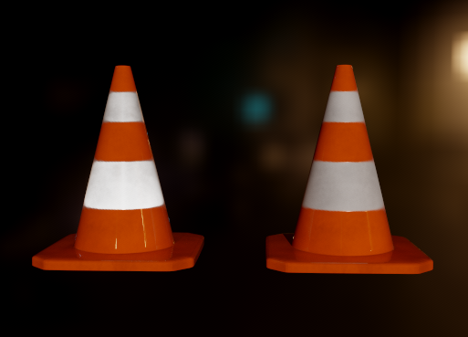

# KHR_materials_retroreflection

## Contributors

* Martin-Karl Lefrançois, NVIDIA, [@mklefrancois](https://github.com/mklefrancois)
* Nia Bickford, NVIDIA, [@NBickford-NV](https://github.com/NBickford-NV)

## Status

Draft

## Dependencies

Written against the glTF 2.0 spec.

## Overview

This extension adds a physically-plausible retroreflective response to any glTF material model.
It is based on the Minimal Retroreflective Microfacet (MRM) model of [Portsmouth et al. (JCGT 15(1), 2026)](http://jcgt.org/published/0015/01/04/),
which turns a BSDF into a retroreflective one by substituting the outgoing view direction $V$ with its reflection about the surface normal, $V_\text{retro} = 2 N (V \cdot N) - V$, before evaluation and sampling.
This redirects the specular peak into the back-scatter direction, producing the bright
retroreflective highlight seen on high-visibility clothing,
glass-bead road markings, many safety signs, and other materials.
In addition, MRM preserves reciprocity and energy conservation under reflection-symmetric NDFs (including GGX, Beckmann, and Phong).

A *retroreflection weight* then linearly blends between the regular material model (at a factor of 0) and the retroreflective material model (at a factor of 1). This matches the OpenPBR `specular_retroreflectivity` parameter.

<figure>

<figcaption><em>Left: A traffic cone with <code>KHR_materials_retroreflection</code> on both sleeves (using a <code>retroreflectionFactor</code> of 1, masked by <code>retroreflectionTexture</code>). The lower sleeve appears brighter than the top sleeve because the light and camera are more closely aligned there. Right: The same traffic cone model and material without the extension. Rendered in <a href="https://github.com/nvpro-samples/vk_gltf_renderer">vk_gltf_renderer</a> using the <a href="https://github.com/KhronosGroup/glTF-Sample-Assets/blob/main/Models/TrafficCone/traffic_cone/traffic_cone.gltf">traffic_cone</a> sample.</em></figcaption>
</figure>

## Extending Materials

`KHR_materials_retroreflection` can be added to a material's `extensions`, like this:

```json
{
  "materials": [
    {
      "name": "TrafficConeBaseMat",
      "pbrMetallicRoughness": {
        "baseColorTexture": { "index": 0 },
        "metallicFactor": 0.0,
        "roughnessFactor": 0.35
      },
      "extensions": {
        "KHR_materials_retroreflection": {
          "retroreflectionFactor": 1.0,
          "retroreflectionTexture": { "index": 2 }
        }
      }
    }
  ],
  "extensionsUsed": [ "KHR_materials_retroreflection" ]
}
```

The extension object contains the following properties:

| | Type | Description | Required |
| -------------------------- | -------- | ----------- | ------------------ |
| **retroreflectionFactor** | `number` | Linear blend between forward microfacet (0.0) and retroreflective microfacet (1.0). Range [0, 1]. | No, default: `0.0` |
| **retroreflectionTexture** | [`textureInfo`](https://registry.khronos.org/glTF/specs/2.0/glTF-2.0.html#reference-textureinfo) | Per-texel multiplier for `retroreflectionFactor`, sampled from the **R** channel. Values outside [0,1] are clamped. | No |

The final per-shading-point retroreflection weight $w$ is:

```
retroreflectionFactor * retroreflectionTexture.r
```

if `retroreflectionTexture` is present and

```
retroreflectionFactor
```

otherwise.

## Implementation

*This section is non-normative.*

If this extension is present on a material, then it replaces each of the materials BRDF lobes (i.e. all lobes except for transmissive lobes) with a blend between the original BRDF and a retroreflective BRDF.

More specifically, for each BRDF $f(L, V, \text{mat})$, where
* $L$ is the direction from the surface to the incoming light
* $V$ is the direction from the surface to the outgoing light (for a renderer that only computes direct lighting, this is the view direction)
* $\text{mat}$ includes the material properties at the shading point, including the surface normal $N$,

its retroreflective BSDF is

$$f_\text{retro}(L, V, \text{mat}) = f(L, V_\text{retro}, \text{mat})$$

where $V_\text{retro}$ is $V$ reflected about the normal $N$:

$$V_\text{retro} = \texttt{reflect}(-V, N) = 2 N (V \cdot N) - V.$$

Then this extension replaces $f$ with

$$f_\text{blended} = \texttt{mix}(f, f_\text{retro}, w)$$

where $w$ is the per-shading-point weight from the [Extending Materials](#extending-materials) section.

The
same $V \to V_\text{retro}$ substitution is used when sampling $f_\text{retro}$ and when
evaluating its PDF; see Listing 1 of Portsmouth et al. 2026.

### Note on BTDFs

Implementations may choose to replace $V$ by $V_\text{retro}$ in the BSDF for the entire material to form a retroreflective BSDF for the entire material. This is often simpler to implement because one can apply the $V \to V_\text{retro}$ substitution at a higher level rather than in individual lobes.

However, as described in Section 5 of Portsmouth et al. 2026, this produces nonintuitive results for transmissive materials, especially when the index of refraction $\eta$ is near 1. Therefore, this specification recommends applying retroreflection only to reflective lobes, which also matches OpenPBR and MaterialX's retroreflection implementations.

## Optional vs. Required

This extension should not be listed in the `extensionsRequired` list, as retroreflectivity is generally not significant enough to justify blocking the entire scene from loading. We use "should not" instead of "must not" here, though, because there are some cases where retroreflectivity is so important to an object that it justifies listing this extension under `extensionsRequired`.

## Schema

* [material.KHR_materials_retroreflection.schema.json](schema/material.KHR_materials_retroreflection.schema.json)

## Sample Asset

A [traffic_cone](https://github.com/KhronosGroup/glTF-Sample-Assets/blob/main/Models/TrafficCone/traffic_cone/traffic_cone.gltf) sample contains a traffic cone with a retroreflective material using the `retroreflectionFactor` and `retroreflectionTexture` parameters, alongside the same cone with a non-retroreflective material for comparison. It includes `KHR_lights_punctual` for directional lighting (note though that `KHR_materials_retroreflection` does not depend on `KHR_lights_punctual`). [The original model](https://sketchfab.com/3d-models/traffic-cone-573feef839d7450cb3e12da9986e7a98) was created by [hinndia](https://sketchfab.com/hinndia), modified by Martin-Karl Lefrançois to add retroreflection, and is licensed under [CC-BY-4.0](http://creativecommons.org/licenses/by/4.0/); see [license.txt](https://github.com/KhronosGroup/glTF-Sample-Assets/blob/main/Models/TrafficCone/traffic_cone/license.txt).

## Known Implementations

* [NVIDIA DesignWorks Samples' vk_gltf_renderer](https://github.com/nvpro-samples/vk_gltf_renderer)

## Resources

* [Jamie Portsmouth, Matthias Raab, Laurent Belcour, and Francis Liu, The Minimal Retroreflective Microfacet Model, *Journal of Computer Graphics Techniques (JCGT)*, vol. 15, no. 1, 60-75, 2026](http://jcgt.org/published/0015/01/04/)
* [Retroreflection in MaterialX](https://github.com/AcademySoftwareFoundation/MaterialX/pull/2783)
* [Retroreflection in the OpenPBR 1.2 draft](https://github.com/AcademySoftwareFoundation/OpenPBR/blob/475bd90d5211d1a4bfb3227d147c692cbd9bc958/index.html#retroreflectivity)
