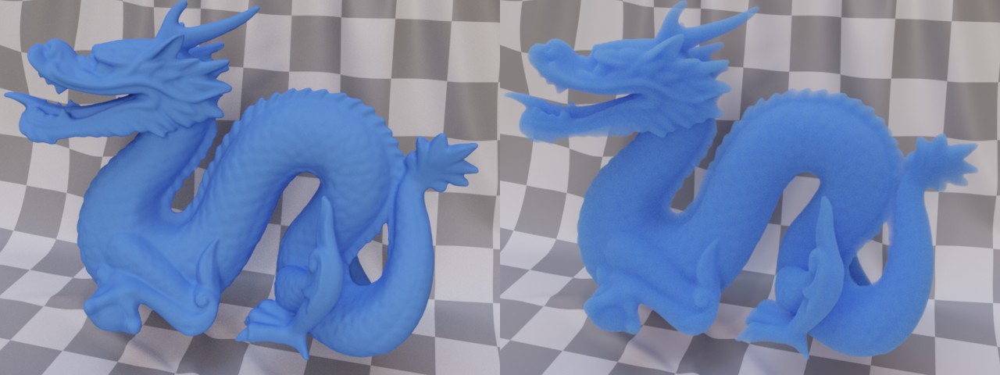
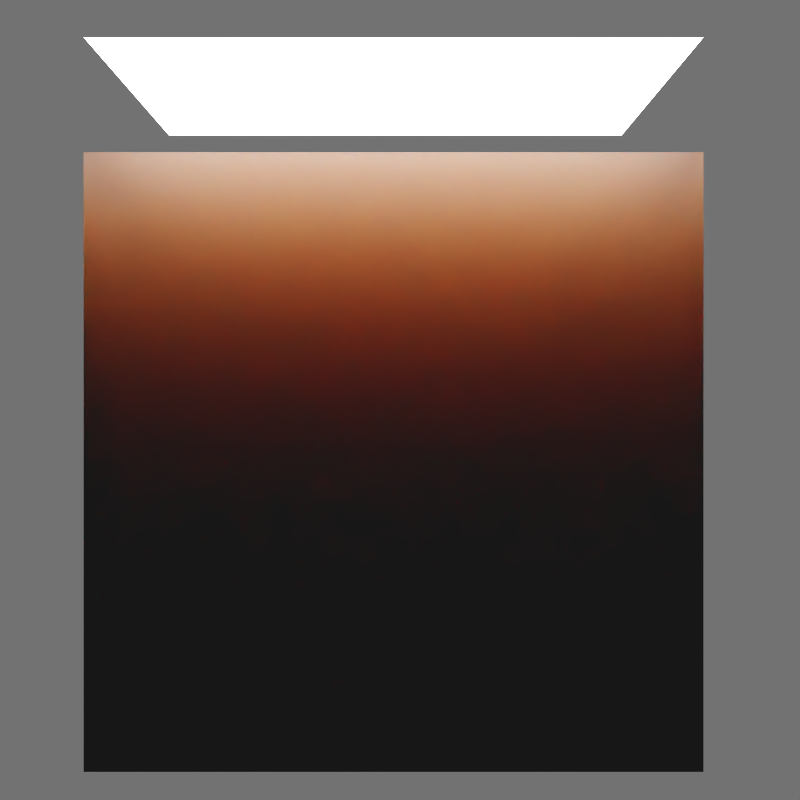
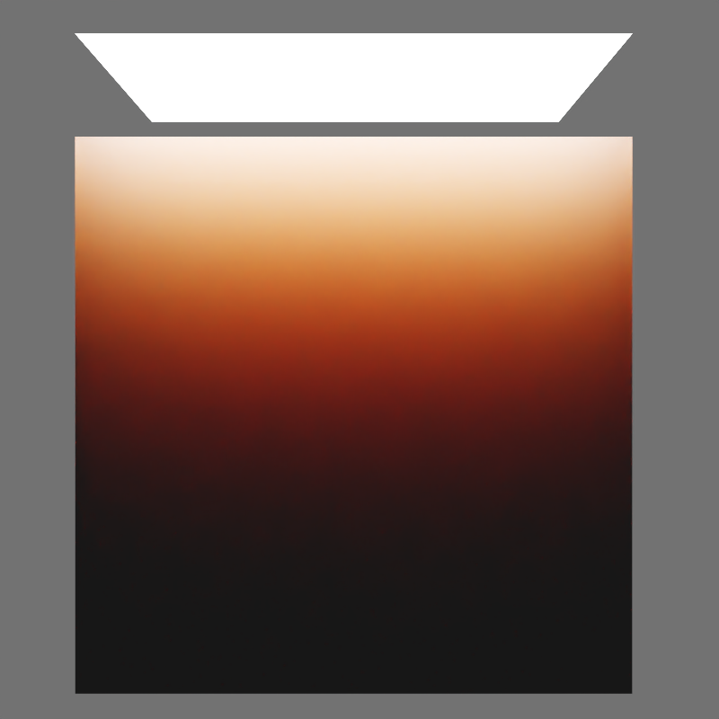
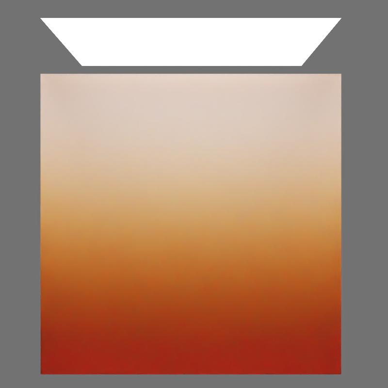

# KHR\_materials\_scatter

## Contributors

- Mike Bond, Adobe [@miibond](https://github.com/MiiBond)
- Tobias Haeussler, Dassault Systèmes [@proog128](https://github.com/proog128)
- Bastian Sdorra, Dassault Systèmes [@bsdorra](https://github.com/bsdorra)

Copyright 2025 The Khronos Group Inc. All Rights Reserved. glTF is a trademark of The Khronos Group Inc.
See [Appendix](#appendix-full-khronos-copyright-statement) for full Khronos Copyright Statement.

## Status

Draft

## Dependencies

Written against the glTF 2.0 spec. This extension has no effect unless combined with `KHR_materials_transmission`. Optionally combined with `KHR_materials_volume` to activate volumetric scattering mode.

## Exclusions

- This extension must not be used on a material that also uses `KHR_materials_pbrSpecularGlossiness`.
- This extension must not be used on a material that also uses `KHR_materials_unlit`.
- This extension must not be used on a material that also uses `KHR_materials_diffuse_transmission`.
- This extension must not be used on a material that also uses `KHR_materials_volume_scatter`.

## Table of Contents

- [Overview](#overview)
- [Extending Materials](#extending-materials)
- [Properties](#properties)
- [Modes of Operation](#modes-of-operation)
  - [Thin-Walled Mode](#thin-walled-mode)
  - [Volumetric Mode](#volumetric-mode)
- [Scattering Parameters](#scattering-parameters)
  - [Multi-Scatter Color](#multi-scatter-color)
  - [Scatter Anisotropy](#scatter-anisotropy)
- [Material Structure Updates](#material-structure-updates)
  - [Thin-Walled Mode](#material-structure-thin-walled-mode)
  - [Volumetric Mode](#material-structure-volumetric-mode)
- [Interaction with Other Extensions](#interaction-with-other-extensions)
  - [KHR\_materials\_transmission](#khr_materials_transmission-1)
  - [KHR\_materials\_volume](#khr_materials_volume-1)
  - [KHR\_materials\_ior](#khr_materials_ior)
- [Schema](#schema)
- [References](#references)
- [Appendix: Full Khronos Copyright Statement](#appendix-full-khronos-copyright-statement)

## Overview

Light that enters a material can be scattered before it exits, producing effects from the bright subsurface glow of skin and wax to the hazy translucency of frosted glass. The character of this scattering depends on whether the object is modeled as a thin surface or as a solid volume.

`KHR_materials_scatter` is a unified scattering extension that works in both contexts. When applied to a thin-walled material (no `KHR_materials_volume`, or `thicknessFactor = 0`), it converts the specular transmission lobe defined by `KHR_materials_transmission` into a diffuse scattered transmission lobe. When applied to a volumetric material (`KHR_materials_volume` with `thicknessFactor > 0`), it adds volumetric scattering to the medium, augmenting the pure-absorption model of `KHR_materials_volume`.

This unified approach is consistent with modern PBR material systems such as [OpenPBR](https://academysoftwarefoundation.github.io/OpenPBR/) and consolidates functionality previously split across `KHR_materials_diffuse_transmission` and `KHR_materials_volume_scatter`.

<figure style="text-align:center">

<figcaption><em>Left: thin-walled mode — scatter converts the specular BTDF into a diffuse BTDF at the surface. Right: volumetric mode — scatter adds a scattering coefficient to the interior of the volume.</em></figcaption>
</figure>

## Extending Materials

The scattering properties are defined by adding the `KHR_materials_scatter` extension to any glTF material that also uses `KHR_materials_transmission`.

**Thin-walled example** — a leaf or sheet of paper:

```json
{
  "materials": [
    {
      "extensions": {
        "KHR_materials_scatter": {
          "multiscatterColorFactor": [0.8, 0.9, 0.7],
          "scatterAnisotropy": 0.3
        },
        "KHR_materials_transmission": {
          "transmissionFactor": 1.0
        }
      }
    }
  ]
}
```

**Volumetric example** — a candle or translucent wax figure:

```json
{
  "materials": [
    {
      "extensions": {
        "KHR_materials_scatter": {
          "multiscatterColorFactor": [0.8, 0.6, 0.5],
          "scatterAnisotropy": 0.2
        },
        "KHR_materials_transmission": {
          "transmissionFactor": 1.0
        },
        "KHR_materials_volume": {
          "thicknessFactor": 1.0,
          "attenuationDistance": 0.01,
          "attenuationColor": [0.95, 0.85, 0.75]
        }
      }
    }
  ]
}
```

## Properties

|                              | Type                                                                                                 | Description                                                                                                        | Required                   |
|------------------------------|------------------------------------------------------------------------------------------------------|--------------------------------------------------------------------------------------------------------------------|----------------------------|
| **multiscatterColorFactor**  | `number[3]`                                                                                          | The multi-scatter color. In volumetric mode, this is the multi-scatter albedo. In thin-walled mode, this is a surface tint applied to transmitted light. | No, default: `[1, 1, 1]` |
| **multiscatterColorTexture** | [`textureInfo`](https://www.khronos.org/registry/glTF/specs/2.0/glTF-2.0.html#reference-textureinfo) | A texture that defines the multi-scatter color, stored in the RGB channels and encoded in sRGB. This will be multiplied by the `multiscatterColorFactor`. | No                         |
| **scatterAnisotropy**        | `number`                                                                                             | The anisotropy of scatter events. Range is (-1, 1). Positive values represent forward scattering; negative values represent backward scattering. | No, default: `0`           |

## Modes of Operation

The mode is determined by the presence and configuration of `KHR_materials_volume`.

### Thin-Walled Mode

A material is in thin-walled mode when `KHR_materials_volume` is absent, or when `KHR_materials_volume` is present with `thicknessFactor = 0`. In this mode, `KHR_materials_scatter` modifies the surface BSDF:

- The specular microfacet BTDF defined by `KHR_materials_transmission` is replaced with a diffuse BTDF, making the transmitted lobe scattered rather than refractive.
- `multiscatterColor` acts as a tint on the transmitted light, analogous to `diffuseTransmissionColorFactor` in `KHR_materials_diffuse_transmission`.
- `scatterAnisotropy` controls the forward/backward bias of the diffuse BTDF. A value of `0` produces a Lambertian (cosine-weighted) distribution. Positive values bias transmission in the forward direction; negative values bias it backward.

This mode is appropriate for thin objects with dense internal structure, such as leaves, fabric, paper, wax sheets, or frosted glass panels.

### Volumetric Mode

A material is in volumetric mode when `KHR_materials_volume` is present with `thicknessFactor > 0`. In this mode, `KHR_materials_scatter` adds volumetric scattering to the interior of the medium:

- The behavior is equivalent to `KHR_materials_volume_scatter`.
- `multiscatterColor` defines the multi-scatter albedo $\rho_{ms}$, representing the perceived color of the scattering medium after many internal bounces.
- `scatterAnisotropy` controls the Henyey-Greenstein phase function for individual scattering events.

This mode is appropriate for optically thick objects with participating media, such as candles, skin, milk, or colored glass with subsurface color.

## Scattering Parameters

### Multi-Scatter Color

The behavior of `multiscatterColor` differs between the two modes.

**Thin-walled mode:** `multiscatterColor` is a multiplicative tint on the transmitted light. A value of `[1, 1, 1]` (the default) applies no tint — all wavelengths are transmitted equally. Lower values attenuate specific color channels, making the surface absorb those frequencies.

```
multiscatterColor = multiscatterColorFactor * sampleLinear(multiscatterColorTexture).rgb
```

**Volumetric mode:** `multiscatterColor` is the multi-scatter albedo $\rho_{ms}$ as defined by [Kulla and Conty (2017)](#KullaConty2017). It is a more intuitive parameterization of the scattering albedo because it corresponds to the perceived color of the medium after many bounces, rather than the single-scatter albedo that directly parameterizes the scattering coefficient.

The single-scatter albedo $\rho_{ss}$ is derived from the multi-scatter albedo $\rho_{ms}$ as:

$$
\rho_{ss} = 1 - \left(4.09712 + 4.20863\,\rho_{ms} - \sqrt{9.59217 + 41.6808\,\rho_{ms} + 17.7126\,\rho_{ms}^2}\right)^2
$$

Given the attenuation coefficient $\sigma_t = -\log(c)/d$ from `KHR_materials_volume`, the scattering and absorption coefficients are:

$$
\sigma_s = \sigma_t\,\rho_{ss}, \qquad \sigma_a = \sigma_t\,(1 - \rho_{ss})
$$

> [!NOTE]
> In volumetric mode, `multiscatterColor` is a volume property. When textured, each texel in the 2D surface map competes to define the volume's multi-scatter albedo. This violates reciprocity in path tracing, causing the integration result to vary with view and light direction. Use with care.

<figure style="text-align:center">

<figcaption><em>A diffuse-only material (left) and a material with dense volumetric scattering (right), both set to the same apparent color. The multi-scatter albedo mapping ensures a consistent perceived color despite the different rendering modes.</em></figcaption>
</figure>

### Scatter Anisotropy

**Thin-walled mode:** `scatterAnisotropy` biases the diffuse BTDF toward forward or backward scattering. A value of `0` gives a standard Lambertian BTDF. This can model materials that preferentially scatter light straight through (positive anisotropy, e.g. tissue paper) or materials that redirect light more toward the back-facing hemisphere (negative anisotropy).

**Volumetric mode:** `scatterAnisotropy` controls the Henyey-Greenstein phase function $p(\mathbf{v}, \mathbf{l}; g)$, which determines the probability density of outgoing directions $\mathbf{l}$ given an incident direction $\mathbf{v}$ at each volumetric scattering event:

$$
p(\mathbf{v},\mathbf{l}; g) = \frac{1}{4\pi} \frac{1-g^2}{\left(1 + g^2 + 2g(\mathbf{v} \cdot \mathbf{l})\right)^{3/2}}
$$

The parameter $g$ maps directly to `scatterAnisotropy`. $g = 0$ gives isotropic scattering; $g > 0$ gives forward scattering (light continues in roughly the same direction); $g < 0$ gives backward scattering.

<table>
  <tr>
    <td></td>
    <td></td>
    <td></td>
  </tr>
  <tr>
    <td align="center">g = -0.95</td>
    <td align="center">g = 0.0</td>
    <td align="center">g = 0.95</td>
  </tr>
  <tr>
    <td colspan="3" align="center">
      <em>Top-lit, dense scattering medium in volumetric mode for different scatter anisotropy values.</em>
    </td>
  </tr>
</table>

## Material Structure Updates

*This section is normative.*

### Thin-Walled Mode

In thin-walled mode, `KHR_materials_scatter` modifies the `dielectric_brdf` defined in [Appendix B](https://registry.khronos.org/glTF/specs/2.0/glTF-2.0.html#material-structure) as extended by `KHR_materials_transmission`:

```
dielectric_brdf =
  fresnel_mix(
    ior = 1.5,
    base = mix(
      diffuse_brdf(color = baseColor),
      specular_btdf(α = roughness^2) * baseColor,
      transmission),
    layer = specular_brdf(α = roughness^2)
  )
```

to the following:

```
dielectric_brdf =
  fresnel_mix(
    ior = 1.5,
    base = mix(
      diffuse_brdf(color = baseColor),
      scatter_btdf(color = multiscatterColor, g = scatterAnisotropy),
      transmission),
    layer = specular_brdf(α = roughness^2)
  )
```

where `scatter_btdf` is a diffuse transmission function weighted by the Henyey-Greenstein phase function. When `scatterAnisotropy = 0`, this reduces to a standard Lambertian BTDF:

```
function scatter_btdf(color, g) {
  if (view and light on opposite hemispheres) {
    return (1/pi) * hg_weight(dot(view, light), g) * color
  } else {
    return 0
  }
}
```

where `hg_weight(cosTheta, g)` is the normalized Henyey-Greenstein weight projected onto the hemisphere. For `g = 0`, `hg_weight = 1` and the function reduces to a Lambertian BTDF.

The amount of diffuse transmission is controlled by `transmissionFactor` from `KHR_materials_transmission`, which remains the sole control over how much of the base layer is transmitted rather than diffusely reflected.

### Volumetric Mode

In volumetric mode, `KHR_materials_scatter` does not modify the surface BSDF. The surface BSDF remains as defined by `KHR_materials_transmission` and `KHR_materials_volume`. Instead, this extension augments the volume transport by introducing a non-zero scattering coefficient $\sigma_s$, which was assumed to be zero in `KHR_materials_volume`.

With `KHR_materials_volume` alone:

$$
\sigma_t = \sigma_a, \qquad \sigma_s = 0
$$

With `KHR_materials_scatter` added:

$$
\sigma_t = \sigma_a + \sigma_s, \qquad \sigma_s = \sigma_t\,\rho_{ss}(\rho_{ms})
$$

where $\sigma_t$ is derived from the `attenuationColor` and `attenuationDistance` of `KHR_materials_volume`, and $\rho_{ss}$ is derived from `multiscatterColorFactor` (and `multiscatterColorTexture`) as described in [Multi-Scatter Color](#multi-scatter-color) above. $\sigma_t$ now accounts for both absorption and scattering, not absorption alone.

## Interaction with Other Extensions

### KHR\_materials\_transmission

`KHR_materials_transmission` is required for `KHR_materials_scatter` to have any visible effect:

- In thin-walled mode, `transmissionFactor` controls the fraction of the base layer that is scattered through the surface. Setting `transmissionFactor = 1.0` and using `KHR_materials_scatter` fully replaces the specular BTDF with a diffuse one.
- In volumetric mode, `transmissionFactor` controls the fraction of light allowed to enter the volume. Without any transmission, the volume interior is unreachable.

### KHR\_materials\_volume

`KHR_materials_volume` determines which mode `KHR_materials_scatter` operates in:

- When absent (or `thicknessFactor = 0`): thin-walled mode.
- When present with `thicknessFactor > 0`: volumetric mode.

For renderers that do not support full volumetric path tracing, it is acceptable to approximate volumetric mode using thin-walled mode behavior. In particular, for materials with very short scattering distances relative to their size (dense subsurface), the visual difference is small and the thin-walled diffuse approximation is efficient and widely applicable. Ray-tracers should use the actual geometry to compute path lengths through the volume rather than relying on `thicknessFactor`.

### KHR\_materials\_ior

When `KHR_materials_ior` is present, it sets the IOR for Fresnel calculations at the surface boundary. This applies regardless of scatter mode. In volumetric mode, the IOR also governs refraction of transmitted rays per the definitions in `KHR_materials_volume`.

## Schema

- [material.KHR_materials_scatter.schema.json](schema/material.KHR_materials_scatter.schema.json)

## References

- [Christensen, P. and B. Burley (2015): Approximate Reflectance Profiles for Efficient Subsurface Scattering](https://graphics.pixar.com/library/ApproxBSSRDF/paper.pdf)<a name="ChristensenBurley2015"></a>
- [Henyey, L. G. and J. L. Greenstein (1941): Diffuse radiation in the galaxy. Astrophysical Journal 93, 70–83](https://ui.adsabs.harvard.edu/abs/1941ApJ....93...70H/abstract)<a name="HenyeyGreenstein"></a>
- [Kulla C., Conty A. (2017): Revisiting Physically Based Shading at Imageworks](https://blog.selfshadow.com/publications/s2017-shading-course/imageworks/s2017_pbs_imageworks_slides_v2.pdf)<a name="KullaConty2017"></a>
- [Academy Software Foundation: OpenPBR Surface Specification](https://academysoftwarefoundation.github.io/OpenPBR/)<a name="OpenPBR"></a>

## Appendix: Full Khronos Copyright Statement

Copyright 2025 The Khronos Group Inc.

Some parts of this Specification are purely informative and do not define requirements
necessary for compliance and so are outside the Scope of this Specification. These
parts of the Specification are marked as being non-normative, or identified as
**Implementation Notes**.

Where this Specification includes normative references to external documents, only the
specifically identified sections and functionality of those external documents are in
Scope. Requirements defined by external documents not created by Khronos may contain
contributions from non-members of Khronos not covered by the Khronos Intellectual
Property Rights Policy.

This specification is protected by copyright laws and contains material proprietary
to Khronos. Except as described by these terms, it or any components
may not be reproduced, republished, distributed, transmitted, displayed, broadcast
or otherwise exploited in any manner without the express prior written permission
of Khronos.

This specification has been created under the Khronos Intellectual Property Rights
Policy, which is Attachment A of the Khronos Group Membership Agreement available at
www.khronos.org/files/member_agreement.pdf. Khronos grants a conditional
copyright license to use and reproduce the unmodified specification for any purpose,
without fee or royalty, EXCEPT no licenses to any patent, trademark or other
intellectual property rights are granted under these terms. Parties desiring to
implement the specification and make use of Khronos trademarks in relation to that
implementation, and receive reciprocal patent license protection under the Khronos
IP Policy must become Adopters and confirm the implementation as conformant under
the process defined by Khronos for this specification;
see https://www.khronos.org/adopters.

Khronos makes no, and expressly disclaims any, representations or warranties,
express or implied, regarding this specification, including, without limitation:
merchantability, fitness for a particular purpose, non-infringement of any
intellectual property, correctness, accuracy, completeness, timeliness, and
reliability. Under no circumstances will Khronos, or any of its Promoters,
Contributors or Members, or their respective partners, officers, directors,
employees, agents or representatives be liable for any damages, whether direct,
indirect, special or consequential damages for lost revenues, lost profits, or
otherwise, arising from or in connection with these materials.

Vulkan is a registered trademark and Khronos, OpenXR, SPIR, SPIR-V, SYCL, WebGL,
WebCL, OpenVX, OpenVG, EGL, COLLADA, glTF, NNEF, OpenKODE, OpenKCAM, StreamInput,
OpenWF, OpenSL ES, OpenMAX, OpenMAX AL, OpenMAX IL, OpenMAX DL, OpenML and DevU are
trademarks of The Khronos Group Inc. ASTC is a trademark of ARM Holdings PLC,
OpenCL is a trademark of Apple Inc. and OpenGL and OpenML are registered trademarks
and the OpenGL ES and OpenGL SC logos are trademarks of Silicon Graphics
International used under license by Khronos. All other product names, trademarks,
and/or company names are used solely for identification and belong to their
respective owners.
