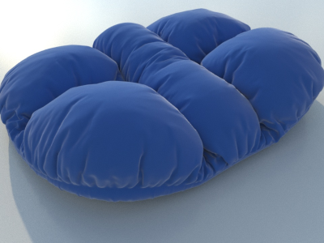

<!--
Copyright 2018-2020 The Khronos Group Inc.
SPDX-License-Identifier: LicenseRef-KhronosSpecCopyright
-->

# KHR\_materials\_sheen

## Contributors

- Sebastien Vandenberghe, Microsoft, [@sebavan](https://github.com/sebavan)
- Alexis Vaginay, Microsoft, [@Popov72](https://github.com/Popov72)
- Tobias Häußler, Dassault System, [@proog128](https://github.com/proog128)
- Ed Mackey, Analytical Graphics, Inc.
- Romain Guy, Google, [@romainguy](https://github.com/romainguy)
- Mike Bond, Adobe, [@MiiBond](https://github.com/MiiBond)
- Don McCurdy, Google, [@donmccurdy](https://twitter.com/donrmccurdy)
- Gary Hsu, Microsoft, [@bghgary](https://twitter.com/bghgary)
- Jekfer Bichon, Dassault System, [@EliphasNUIT](https://github.com/EliphasNUIT)
- Aidin Abedi, Animech, [@aidinabedi](https://github.com/aidinabedi)

Copyright 2018-2020 The Khronos Group Inc. All Rights Reserved. glTF is a trademark of The Khronos Group Inc.
See [Appendix](#appendix-full-khronos-copyright-statement) for full Khronos Copyright Statement.

## Status

Complete, Ratified by the Khronos Group

## Dependencies

Written against the glTF 2.0 spec.

## Exclusions
- This extension must not be used on a material that also uses `KHR_materials_pbrSpecularGlossiness`.
- This extension must not be used on a material that also uses `KHR_materials_unlit`.

## Overview

This extension defines a sheen that can be layered on top of an existing glTF material definition. A sheen layer is a common technique used in Physically-Based Rendering to represent cloth and fabric materials, for example. See [Theory, Documentation and Implementations](#theory-documentation-and-implementations)

## Extending Materials

The PBR sheen materials are defined by adding the `KHR_materials_sheen` extension to any compatible glTF material (excluding those listed above).
For example, the following defines a material like velvet.

```json
{
    "materials": [
        {
            "name": "velvet",
            "extensions": {
                "KHR_materials_sheen": {
                    "sheenColorFactor": [0.9, 0.9, 0.9]
                }
            }
        }
    ]
}
```

### Sheen

The following parameters are contributed by the `KHR_materials_sheen` extension:

|                                  | Type                                                                            | Description                            | Required                       |
|----------------------------------|---------------------------------------------------------------------------------|----------------------------------------|--------------------------------|
|**sheenColorFactor**                   | `array`                                                                         | The sheen color in linear space        | No, default: `[0.0, 0.0, 0.0]` |
|**sheenColorTexture**         | [`textureInfo`](https://www.khronos.org/registry/glTF/specs/2.0/glTF-2.0.html#reference-textureinfo)             | The sheen color (RGB).<br> The sheen color is in sRGB transfer function | No               |
|**sheenRoughnessFactor**               | `number`                                                                        | The sheen roughness.                   | No, default: `0.0`             |
|**sheenRoughnessTexture**         | [`textureInfo`](https://www.khronos.org/registry/glTF/specs/2.0/glTF-2.0.html#reference-textureinfo)             | The sheen roughness (Alpha) texture. | No               |

The sheen BRDF is layered on top of the glTF 2.0 Metallic-Roughness material. If clearcoat (`KHR_materials_clearcoat`) is active at the same time, clearcoat is layered on top of sheen. The `sheenColorFactor` determines the view-independent intensity of the sheen BRDF. If `sheenColorFactor` is zero, the whole sheen layer is disabled. Implementations of the BRDF itself can vary based on device performance and resource constraints.

If a texture is defined:

- The sheen color is computed with : `sheenColor = sheenColorFactor * sampleLinear(sheenColorTexture).rgb`.
- The sheen roughness is computed with : `sheenRoughness = sheenRoughnessFactor * sample(sheenRoughnessTexture).a`.

Otherwise, `sheenColor = sheenColorFactor` and `sheenRoughness = sheenRoughnessFactor`

The sheen BRDF simulates the back-scattering of velvet-like materials. The specular response from velvet-like materials can be modeled as the reflection from specular, cylindrical micro-fibers mainly oriented in the normal direction ([Westin et al. (1992)](#Westin1992)). This results in a forest of narrow cylinders extending from a fabric base. The sheen roughness determines how much the micro-fibers diverge from this direction. A small roughness means that the random perturbation around the normal direction is small, resulting in a sharp specular response around grazing angles. A large roughness on the other hand results in a smooth specular response around grazing angles. To model the specular response from micro-fibers, we use the exponentiated sinusoidal distribution term introduced by [Conty and Kulla (2017)](#ContyKulla2017) which is based on microfacet theory. We use the mapping `r = sheenRoughness^2` which results in more perceptually linear changes in the roughness.

The sheen roughness is independent from the material roughness to allow materials like this one, with high material roughness and small sheen roughness:



Not all incoming light is reflected at a micro-fiber. Some of the light may hit the base layer, either directly or as a result of multiple bounces on the micro-geometry. Light that hits the base layer behaves as specified in the glTF 2.0 Metallic-Roughness material.

## Implementation Notes

*This section is non-normative.*

All implementations should use the same calculations for the BRDF inputs. See [Appendix B](https://www.khronos.org/registry/glTF/specs/2.0/glTF-2.0.html#appendix-b-brdf-implementation) for more details on the BRDF calculations.

The sheen formula follows the common microfacet form with visibility term $\nu_s$:

$$
\text{SheenBRDF} = \frac{G_S D_S}{4 \, \left|N \cdot L \right| \, \left| N \cdot V \right|} = \nu_S D_S
$$


### Sheen distribution

The sheen distribution $D_s$ follows the "Charlie" sheen definition from ImageWorks [Conty and Kulla (2017)](#ContyKulla2017):

```glsl
alpha_g = sheenRoughness * sheenRoughness
inv_r = 1 / alpha_g
cos2h = NdotH * NdotH
sin2h = 1 - cos2h
sheen_distribution = (2 + inv_r) * pow(sin2h, inv_r * 0.5) / (2 * PI);
```

### Sheen visibility

The "Charlie" sheen visibility $\nu_s = \frac{G_s}{4 \, \left|N \cdot L \right| \, \left| N \cdot V \right|}$ is also defined in the same document:

```glsl
float l(float x, float alpha_g)
{
    float one_minus_alpha_sq = (1.0 - alpha_g) * (1.0 - alpha_g);
    float a = mix(21.5473, 25.3245, one_minus_alpha_sq);
    float b = mix(3.82987, 3.32435, one_minus_alpha_sq);
    float c = mix(0.19823, 0.16801, one_minus_alpha_sq);
    float d = mix(-1.97760, -1.27393, one_minus_alpha_sq);
    float e = mix(-4.32054, -4.85967, one_minus_alpha_sq);
    return a / (1.0 + b * pow(x, c)) + d * x + e;
}

float lambda_sheen(float cos_theta, float alpha_g)
{
    return abs(cos_theta) < 0.5 ? exp(l(cos_theta, alpha_g)) : exp(2.0 * l(0.5, alpha_g) - l(1.0 - cos_theta, alpha_g));
}

sheen_visibility = 1.0 / ((1.0 + lambda_sheen(NdotV, alpha_g) + lambda_sheen(NdotL, alpha_g)) * (4.0 * NdotV * NdotL));
```

However, depending on device performance and resource constraints, one can use a simpler visibility term, like the one defined by [Ashikhmin and Premoze (2007)](#AshikhminPremoze2007) (but that will make the BRDF not energy conserving when using the albedo-scaling technique described below):

```glsl
sheen_visibility = 1 / (4 * (NdotL + NdotV - NdotL * NdotV))
```

### Sheen layering

#### Albedo-scaling technique

The sheen layer can be combined with the base layer with an albedo-scaling technique described in [Conty and Kulla (2017)](#ContyKulla2017). The base layer `material = mix(dielectric_brdf, metal_brdf, metallic)` from [Appendix B](https://www.khronos.org/registry/glTF/specs/2.0/glTF-2.0.html#appendix-b-brdf-implementation) is scaled with `sheen_albedo_scaling` to avoid energy gain.

```glsl
float max3(vec3 v) { return max(max(v.x, v.y), v.z); }
sheen_albedo_scaling = min(1.0 - max3(sheenColor) * E(VdotN), 1.0 - max3(sheenColor) * E(LdotN))

sheen_material = sheenColor * sheen_brdf + material * sheen_albedo_scaling
```

The values `E(x)` can be looked up in a table which can be found in section 6.2.3 of [Enterprise PBR Shading Model](#theory-documentation-and-implementations) if you use the "Charlie" visibility term. If you use Ashikhmin instead, you can get the lookup table by using the [cmgen tool from Filament](#theory-documentation-and-implementations), with the `--ibl-dfg` and `--ibl-dfg-cloth` flags: the table is in the blue channel of the generated picture. The lookup must be done with `x = VdotN` and `y = sheenRoughness`.

If you want to trade a bit of accuracy for more performance, you can use the `VdotN` term only and thus avoid doing multiple lookups for `LdotN`. The albedo scaling term is simplified to:
```glsl
sheen_albedo_scaling = 1.0 - max3(sheenColor) * E(VdotN)
```

In this simplified form, it can be used to scale the base layer for both direct and indirect lights:

```glsl
specular_direct *= sheen_albedo_scaling;
diffuse_direct *= sheen_albedo_scaling;
environment_irradiance_indirect *= sheen_albedo_scaling
specular_environment_reflectance_indirect *= sheen_albedo_scaling
```

## Schema

- [material.KHR_materials_sheen.schema.json](schema/material.KHR_materials_sheen.schema.json)

## Reference

### Theory, Documentation and Implementations

[Stephen H. Westin, James R. Arvo, Kenneth E. Torrance – “Predicting Reflectance Functions from Complex Surfaces”, SIGGRAPH 1992](http://www.graphics.cornell.edu/~westin/pubs/siggraph-rebuild.pdf)<a name="Westin1992"></a>

[Alejandro Conty Estevez, Christopher Kulla – “Production Friendly Microfacet Sheen BRDF”, SIGGRAPH 2017](https://blog.selfshadow.com/publications/s2017-shading-course/imageworks/s2017_pbs_imageworks_sheen.pdf)<a name="ContyKulla2017"></a>

[Michael Ashikhmin, Simon Premoze – “Distribution-based BRDFs”, 2007](http://www.cs.utah.edu/~premoze/dbrdf/dBRDF.pdf)<a name="AshikhminPremoze2007"></a>

[Filament Material models - Cloth model](https://google.github.io/filament/Materials.md.html#materialmodels/clothmodel)

[cmgen tool from Filament](https://github.com/google/filament)

[David Neubelt, Matt Pettineo – “Crafting a Next-Gen Material Pipeline for The Order: 1886”, SIGGRAPH 2013](https://blog.selfshadow.com/publications/s2013-shading-course/rad/s2013_pbs_rad_notes.pdf)

[cloth-shading](https://knarkowicz.wordpress.com/2018/01/04/cloth-shading/)

[Enterprise PBR Shading Model - Sheen](https://dassaultsystemes-technology.github.io/EnterprisePBRShadingModel/spec-2021x.md.html#components/sheen)

## Appendix: Full Khronos Copyright Statement

Copyright 2018-2020 The Khronos Group Inc.

Some parts of this Specification are purely informative and do not define requirements
necessary for compliance and so are outside the Scope of this Specification. These
parts of the Specification are marked as being non-normative, or identified as
**Implementation Notes**.

Where this Specification includes normative references to external documents, only the
specifically identified sections and functionality of those external documents are in
Scope. Requirements defined by external documents not created by Khronos may contain
contributions from non-members of Khronos not covered by the Khronos Intellectual
Property Rights Policy.

This specification is protected by copyright laws and contains material proprietary
to Khronos. Except as described by these terms, it or any components
may not be reproduced, republished, distributed, transmitted, displayed, broadcast
or otherwise exploited in any manner without the express prior written permission
of Khronos.

This specification has been created under the Khronos Intellectual Property Rights
Policy, which is Attachment A of the Khronos Group Membership Agreement available at
www.khronos.org/files/member_agreement.pdf. Khronos grants a conditional
copyright license to use and reproduce the unmodified specification for any purpose,
without fee or royalty, EXCEPT no licenses to any patent, trademark or other
intellectual property rights are granted under these terms. Parties desiring to
implement the specification and make use of Khronos trademarks in relation to that
implementation, and receive reciprocal patent license protection under the Khronos
IP Policy must become Adopters and confirm the implementation as conformant under
the process defined by Khronos for this specification;
see https://www.khronos.org/adopters.

Khronos makes no, and expressly disclaims any, representations or warranties,
express or implied, regarding this specification, including, without limitation:
merchantability, fitness for a particular purpose, non-infringement of any
intellectual property, correctness, accuracy, completeness, timeliness, and
reliability. Under no circumstances will Khronos, or any of its Promoters,
Contributors or Members, or their respective partners, officers, directors,
employees, agents or representatives be liable for any damages, whether direct,
indirect, special or consequential damages for lost revenues, lost profits, or
otherwise, arising from or in connection with these materials.

Khronos® and Vulkan® are registered trademarks, and ANARI™, WebGL™, glTF™, NNEF™, OpenVX™,
SPIR™, SPIR-V™, SYCL™, OpenVG™ and 3D Commerce™ are trademarks of The Khronos Group Inc.
OpenXR™ is a trademark owned by The Khronos Group Inc. and is registered as a trademark in
China, the European Union, Japan and the United Kingdom. OpenCL™ is a trademark of Apple Inc.
and OpenGL® is a registered trademark and the OpenGL ES™ and OpenGL SC™ logos are trademarks
of Hewlett Packard Enterprise used under license by Khronos. ASTC is a trademark of
ARM Holdings PLC. All other product names, trademarks, and/or company names are used solely
for identification and belong to their respective owners.
