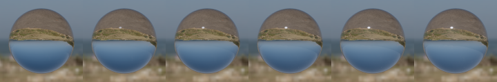

// Copyright 2018-2022 The Khronos Group Inc.
// SPDX-License-Identifier: CC-BY-4.0

= KHR_materials_specular
:tmtitle: pass:q,r[^™^]
:regtitle: pass:q,r[^®^]
The Khronos{regtitle} 3D Formats Working Group
:data-uri:
:icons: font
:toc2:
:toclevels: 10
:sectnumlevels: 10
:max-width: 100%
:numbered:
:source-highlighter: coderay
:docinfo: shared-head
:docinfodir: ../..
:stem:

// :xrefstyle: short
// :listing-caption: Listing
:leveloffset: 1

= Contributors

  * Tobias Haeussler, Dassault Systemes https://github.com/proog128[@proog128]
  * Bastian Sdorra, Dassault Systemes https://github.com/bsdorra[@bsdorra]
  * Mike Bond, Adobe, https://github.com/MiiBond[@miibond]
  * Emmett Lalish, Google https://github.com/elalish[@elalish]
  * Don McCurdy, Google https://twitter.com/donrmccurdy[@donrmccurdy]
  * Norbert Nopper, UX3D https://twitter.com/UX3DGpuSoftware[@UX3DGpuSoftware]
  * Richard Sahlin, IKEA https://github.com/rsahlin[@rsahlin]
  * Eric Chadwick, Wayfair https://github.com/echadwick-wayfair[echadwick-wayfair]
  * Ben Houston, ThreeKit https://github.com/bhouston[@bhouston]
  * Gary Hsu, Microsoft https://twitter.com/bghgary[@bghgary]
  * Sebastien Vandenberghe, Microsoft https://twitter.com/sebavanjs[@sebavanjs]
  * Nicholas Barlow, Microsoft
  * Nicolas Savva, Autodesk https://github.com/nicolassavva-autodesk[@nicolassavva-autodesk]
  * Henrik Edstrom, Autodesk
  * Bruce Cherniak, Intel
  * Adam Morris, Target https://github.com/weegeekps[@weegeekps]
  * Sandra Voelker, Target
  * Alex Jamerson, Amazon
  * Thomas Dideriksen, Amazon
  * Alex Wood, AGI https://twitter.com/abwood[@abwood]
  * Ed Mackey, AGI https://twitter.com/emackey[@emackey]
  * Alexey Knyazev https://github.com/lexaknyazev[@lexaknyazev]

Copyright 2018-2022 The Khronos Group Inc. All Rights Reserved. glTF is a trademark of The Khronos Group Inc.
See <<full-copyright, the appendix>> for the full Khronos Copyright Statement.

= Status

Complete, Ratified by the Khronos Group

Supersedes link:../../Archived/KHR_materials_pbrSpecularGlossiness/README.md[KHR_materials_pbrSpecularGlossiness]

= Dependencies

Written against the glTF 2.0 spec.

= Exclusions

  * This extension must not be used on a material that also uses `KHR_materials_pbrSpecularGlossiness`.
  * This extension must not be used on a material that also uses `KHR_materials_unlit`.

= Overview

This extension adds two parameters to the metallic-roughness material: `specular` and `specularColor`.

`specular` allows users to configure the strength of the specular reflection in the dielectric BRDF. A value of zero disables the specular reflection, resulting in a pure diffuse material. The metal BRDF is not affected by the parameter.

`specularColor` changes the F0 color of the specular reflection in the dielectric BRDF, allowing artists to use effects known from the specular-glossiness material (`KHR_materials_pbrSpecularGlossiness`) in the metallic-roughness material.

= Extending Materials

The strength of the specular reflection is defined by adding the `KHR_materials_specular` extension to any glTF material.

[source,json]
----
{
    "materials": [
        {
            "extensions": {
                "KHR_materials_specular": {
                    "specularFactor": 1.0,
                    "specularColorFactor": [1.0, 1.0, 1.0],
                }
            }
        }
    ]
}
----

Factor and texture are combined by multiplication to describe a single value.

[options="header"]
|====
|                        | Type                                                                                               | Description                              | Required
| *specularFactor*       | `number`                                                                                           | The strength of the specular reflection. | No, default: `1.0`
| *specularTexture*      | https://www.khronos.org/registry/glTF/specs/2.0/glTF-2.0.html#reference-textureinfo[`textureInfo`] | A texture that defines the strength of the specular reflection, stored in the alpha (`A`) channel. This will be multiplied by specularFactor. | No
| *specularColorFactor*  | `number[3]`                                                                                        | The F0 color of the specular reflection (linear RGB). | No, default: `[1.0, 1.0, 1.0]`
| *specularColorTexture* | https://www.khronos.org/registry/glTF/specs/2.0/glTF-2.0.html#reference-textureinfo[`textureInfo`] | A texture that defines the F0 color of the specular reflection, stored in the `RGB` channels and encoded in sRGB. This texture will be multiplied by specularColorFactor. | No
|====

The `specular` and `specularColor` parameters affect the `dielectric_brdf` of the glTF 2.0 metallic-roughness material.

[source]
----
dielectric_brdf =
  fresnel_mix(
    f0_color = specularColor.rgb,
    ior = 1.5,
    weight = specular,
    base = diffuse_brdf(color = baseColor),
    layer = specular_brdf({alpha} = roughness^2))
----

The `fresnel_mix` function mixes two BSDFs according to a Fresnel term. The `layer` is weighted with `weight * fresnel(ior, f0_color)`. The `base` is weighted with `1 - weight * fresnel(ior, f0_color)`.

The specular factor used as `weight` scales `layer` and `base`. The less energy is reflected by the `layer` (`specular_brdf`), the more can be shifted to the `base` (`diffuse_brdf`). The following image shows specular factor increasing from 0 to 1.

image::figures/specular.png[align="left"]

The specular color is a directional-dependent weight included in the Fresnel term. At normal incidence (`f0`), `specularColor` scales the F0 reflectance `f0_color`. At grazing incidence (`f90`), the reflectance remains at 1. In between the scale factor is smoothly interpolated.

As with specular factor, `base` will be weighted with the directional-dependent remaining energy according to the Fresnel term. `f0_color` is an RGB color, involving the complementary to specular color. To make it easy to use and ensure energy conservation, the RGB color is converted to scalar via `max(r, g, b)`. The following images show specular color increasing from [0,0,0] to [1,1,1] (top) and from [0,0,0] to [1,0,0] (bottom).

image::figures/specular-color.png[align="left"]
image::figures/specular-color-2.png[align="left"]

The specular color factor is allowed to be set to values greater than [1, 1, 1]. Thus, the reflection amount can go beyond what is determined by the index of refraction (IOR). To still ensure energy conservation, the product of specular color factor, specular color texture, and f0 reflectance from IOR is clamped to 1. Please refer to <<implementation, Implementation>> for an example on where to place the clamping operation.

[[implementation]]
= Implementation

_This section is non-normative._

https://www.khronos.org/registry/glTF/specs/2.0/glTF-2.0.html#appendix-b-brdf-implementation[Appendix B] defines the function `fresnel_mix`. In this extension, we add two additional arguments called `weight` and `f0_color`. It scales `f0` computed inside the function:

[source]
----
function fresnel_mix(f0_color, ior, weight, base, layer) {
  f0 = ((1-ior)/(1+ior))^2 * f0_color
  f0 = min(f0, float3(1.0))
  fr = f0 + (1 - f0)*(1 - abs(VdotH))^5
  return mix(base, layer, weight * fr)
}
----

Therefore, the Fresnel term `F` in the final BRDF of the material changes to

[source]
----
dielectricSpecularF0  = min(0.04 * specularColorFactor * specularColorTexture.rgb, float3(1.0)) *
                        specularFactor * specularTexture.a
dielectricSpecularF90 = specularFactor * specularTexture.a

F0  = lerp(dielectricSpecularF0, baseColor.rgb, metallic)
F90 = lerp(dielectricSpecularF90, 1, metallic)

F = F0 + (F90 - F0) * (1 - VdotH)^5
----

Note that in `dielectricSpecularF0` we clamp the product of specular color and f0 reflectance from IOR (`0.04`), before multiplying by specular.

In the diffuse component we have to account for the fact that `F` is now an RGB value.

[source]
----
c_diff = lerp(baseColor.rgb, black, metallic)
diffuse = c_diff / PI
f_diffuse = (1 - max(F.r, F.g, F.b)) * diffuse
----

= Interaction with other extensions

If `KHR_materials_ior` is used in combination with `KHR_materials_specular`, the constant `0.04` is replaced by the value computed from the IOR.

[source]
----
dielectricSpecularF0 = min(((ior - outside_ior) / (ior + outside_ior))^2 * specularColorFactor * specularColorTexture.rgb, float3(1.0)) * specularFactor * specularTexture.a
dielectricSpecularF90 = specularFactor * specularTexture.a
----

`outside_ior` is typically set to 1.0, the index of refraction of air.

If `KHR_materials_transmission` is used in combination with `KHR_materials_specular`, the ratio of transmission and reflection computed from the Fresnel term also depends on `dielectricSpecularF0` and `dielectricSpecularF90`. The following images show a thin, transmissive material.

Specular from 0 to 1:

image::figures/specular-thin.png[align="left"]

Specular color from [0,0,0] to [1,1,1] (top) and [0,0,0] to [1,0,0]:

image::figures/specular-color-thin.png[align="left"]
image::figures/specular-color-thin-2.png[align="left"]

If `KHR_materials_transmission` and `KHR_materials_volume` are used in combination with `KHR_materials_specular`, specular factor and specular color have no effect on the refraction angle. The direction of the refracted light ray is only based on the index of refraction defined in `KHR_materials_ior`. The ratio of transmission and reflection computed from the Fresnel term still depends on `dielectricSpecularF0` and `dielectricSpecularF90`. The following images show a refractive material.

Specular from 0 to 1:

image::figures/specular-refraction.png[align="left"]

Specular color from [0,0,0] to [1,1,1] (top) and [0,0,0] to [1,0,0]:

image::figures/specular-color-refraction-2.png[align="left"]

= Conversions

== Materials with reflectance parameter

Material models that define F0 in terms of reflectance at normal incidence can be converted by encoding the reflectance in the specular color parameters. Typically, the reflectance ranges from 0% to 8%, given as a value in range [0,1], with 0.5 (=4%) being the default. F0 is computed from `reflectance` in the following way:

[source]
----
dielectricSpecularF0 = 0.08 * reflectance
----

In contrast, `KHR_materials_specular` defines a constant factor of 0.04 to compute F0, as this corresponds to glTF's default IOR of 1.5. Therefore, by encoding an additional constant factor of 2 in `specularColorFactor`, we can convert from reflectance to specular color without any loss.

The following JSON snippets shows the conversion from `reflectanceFactor` and `reflectanceTexture` to `specularColorFactor` and `specularColorTexture`:

[source,json]
----
{
    "materials": [
        {
            "extensions": {
                "KHR_materials_specular": {
                    "specularColorFactor": [2 * reflectanceFactor],
                    "specularColorTexture": [reflectanceTexture]
                }
            }
        }
    ]
}
----

== Specular-glossiness materials

Materials that use the specular-glossiness workflow (`KHR_materials_pbrSpecularGlossiness`) can be converted with help of the `KHR_materials_ior`. The `ior` parameter has to be set to 0. In JSON:

[source,json]
----
{
    "materials": [
        {
            "extensions": {
                "KHR_materials_specular": {
                    "specularColorFactor":
                        [KHR_materials_pbrSpecularGlossiness__specularFactor],
                },
                "KHR_materials_ior": {
                    "ior": 0
                }
            }
        }
    ]
}
----

This makes it possible to add advanced effects like clearcoat (`KHR_materials_clearcoat`) and sheen (`KHR_materials_sheen`) to traditional specular-glossiness materials.

[NOTE]
.Note
====
As the `ior` also affects the refraction effect, this conversion is not compatible with volumetric materials (`KHR_materials_volume`). We do not recommended to use this conversion when creating new materials from scratch.
====

[NOTE]
.*Why does it work?*
====

There is no clear separation between dielectrics and metals in the specular-glossiness workflow. Thus, it is possible to create materials that do not fall into either of the categories. This doesn't have to be an explicit decision in authoring (although it can be for various artistic styles), it is often just the result of baking several materials into a single texture. Due to anti-aliasing at the borders some texels contain a mix of different material types. This mix may not map to metallic-roughness parameters that are in a realistic range.

We achieve an easy, lossless mapping by treating any specular-glossiness material, even pure metals, as dielectric materials in the metallic-roughness workflow. `KHR_materials_ior` gives us the means to do so. As the `ior` determines the upper bound of the specular reflection's strength, we can increase it to its maximum, making it large enough to hold all possible specular-glossiness materials. Looking at the formula to compute F0 from IOR `f0 = ((ior - outside_ior) / (ior + outside_ior))^2`, we can see that both `ior = 0` and `ior = inf` will result in `f0 = 1`. As `f0` is multiplied by specular color, the value `1` will give us full control over the specular reflection via the specular color.
====

= glTF Schema Updates

  * *JSON schema*: link:schema/glTF.KHR_materials_specular.schema.json[glTF.KHR_materials_specular.schema.json]

:numbered!:

[appendix]
[[full-copyright]]
= Full Khronos Copyright Statement

:copyyears: 2018-2022
include::../../speccopyright.txt[]
