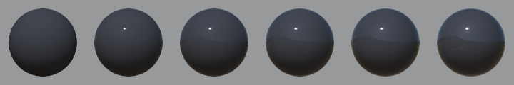
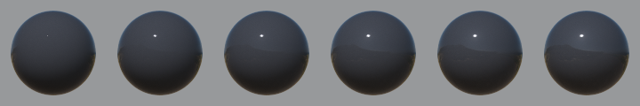
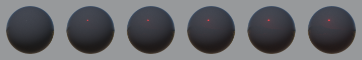
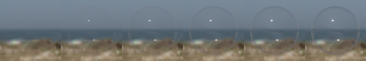
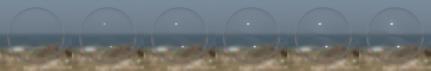
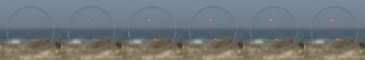
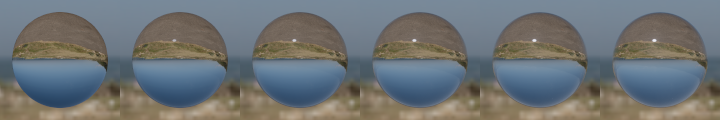
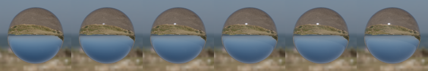
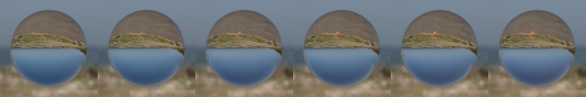

<!--
Copyright 2018-2021 The Khronos Group Inc.
SPDX-License-Identifier: LicenseRef-KhronosSpecCopyright
-->

# KHR\_materials\_specular

## Contributors

- Tobias Haeussler, Dassault Systemes [@proog128](https://github.com/proog128)
- Bastian Sdorra, Dassault Systemes [@bsdorra](https://github.com/bsdorra)
- Mike Bond, Adobe, [@miibond](https://github.com/MiiBond)
- Emmett Lalish, Google [@elalish](https://github.com/elalish)
- Don McCurdy, Google [@donrmccurdy](https://twitter.com/donrmccurdy)
- Norbert Nopper, UX3D [@UX3DGpuSoftware](https://twitter.com/UX3DGpuSoftware)
- Richard Sahlin, IKEA [@rsahlin](https://github.com/rsahlin)
- Eric Chadwick, Wayfair [echadwick-wayfair](https://github.com/echadwick-wayfair)
- Ben Houston, ThreeKit [@bhouston](https://github.com/bhouston)
- Gary Hsu, Microsoft [@bghgary](https://twitter.com/bghgary)
- Sebastien Vandenberghe, Microsoft [@sebavanjs](https://twitter.com/sebavanjs)
- Nicholas Barlow, Microsoft
- Nicolas Savva, Autodesk [@nicolassavva-autodesk](https://github.com/nicolassavva-autodesk)
- Henrik Edstrom, Autodesk
- Bruce Cherniak, Intel
- Adam Morris, Target [@weegeekps](https://github.com/weegeekps)
- Sandra Voelker, Target
- Alex Jamerson, Amazon
- Thomas Dideriksen, Amazon
- Alex Wood, AGI [@abwood](https://github.com/abwood)
- Ed Mackey, AGI [@emackey](https://github.com/emackey)
- Alexey Knyazev [@lexaknyazev](https://github.com/lexaknyazev)

Copyright 2018-2021 The Khronos Group Inc. All Rights Reserved. glTF is a trademark of The Khronos Group Inc.
See [Appendix](#appendix-full-khronos-copyright-statement) for full Khronos Copyright Statement.

## Status

Complete, Ratified by the Khronos Group

Supersedes [KHR_materials_pbrSpecularGlossiness](../../Archived/KHR_materials_pbrSpecularGlossiness/README.md)

## Dependencies

Written against the glTF 2.0 spec.

## Exclusions

- This extension must not be used on a material that also uses `KHR_materials_pbrSpecularGlossiness`.
- This extension must not be used on a material that also uses `KHR_materials_unlit`.

## Overview

This extension adds two parameters to the metallic-roughness material: `specular` and `specularColor`.

`specular` allows users to configure the strength of the specular reflection in the dielectric BRDF. A value of zero disables the specular reflection, resulting in a pure diffuse material. The metal BRDF is not affected by the parameter.

`specularColor` changes the F0 color of the specular reflection in the dielectric BRDF, allowing artists to use effects known from the specular-glossiness material (`KHR_materials_pbrSpecularGlossiness`) in the metallic-roughness material.

## Extending Materials

The strength of the specular reflection is defined by adding the `KHR_materials_specular` extension to any glTF material.

```json
{
    "materials": [
        {
            "extensions": {
                "KHR_materials_specular": {
                    "specularFactor": 1.0,
                    "specularColorFactor": [1.0, 1.0, 1.0],
                }
            }
        }
    ]
}
```

Factor and texture are combined by multiplication to describe a single value.

| |Type|Description|Required|
|-|----|-----------|--------|
| **specularFactor** | `number` | The strength of the specular reflection. | No, default: `1.0`|
| **specularTexture** | [`textureInfo`](https://www.khronos.org/registry/glTF/specs/2.0/glTF-2.0.html#reference-textureinfo) | A texture that defines the strength of the specular reflection, stored in the alpha (`A`) channel. This will be multiplied by specularFactor. | No |
| **specularColorFactor** | `number[3]` | The F0 color of the specular reflection (linear RGB). | No, default: `[1.0, 1.0, 1.0]`|
| **specularColorTexture** | [`textureInfo`](https://www.khronos.org/registry/glTF/specs/2.0/glTF-2.0.html#reference-textureinfo) | A texture that defines the F0 color of the specular reflection, stored in the `RGB` channels and encoded in sRGB. This texture will be multiplied by specularColorFactor. | No |

If a texture is defined:

- The specular color is computed with : `specularColor = specularColorFactor * sampleLinear(specularColorTexture).rgb`.
- The specular strength is computed with : `specular = specularFactor * sample(specularTexture).a`.

The `specular` and `specularColor` parameters affect the `dielectric_brdf` of the glTF 2.0 metallic-roughness material.

```
dielectric_brdf =
  fresnel_mix(
    f0_color = specularColor.rgb,
    ior = 1.5,
    weight = specular,
    base = diffuse_brdf(color = baseColor),
    layer = specular_brdf(α = roughness^2))
```

The `fresnel_mix` function mixes two BSDFs according to a Fresnel term. The `layer` is weighted with `weight * fresnel(ior, f0_color)`. The `base` is weighted with `1 - weight * max_value(fresnel(ior, f0_color))`.

The specular factor used as `weight` scales `layer` and `base`. The less energy is reflected by the `layer` (`specular_brdf`), the more can be shifted to the `base` (`diffuse_brdf`). The following image shows specular factor increasing from 0 to 1.



The specular color is a directional-dependent weight included in the Fresnel term. At normal incidence (`f0`), `specularColor` scales the F0 reflectance `f0_color`. At grazing incidence (`f90`), the reflectance remains at 1. In between the scale factor is smoothly interpolated.

As with specular factor, `base` will be weighted with the directional-dependent remaining energy according to the Fresnel term. `f0_color` is an RGB color, involving the complementary to specular color. To avoid inverse colors and ensure energy conservation, the RGB color is converted to scalar via `max(r, g, b)`:

```
function max_value(vec3 color) {
    return max(color.r, color.g, color.b)
}
```

The following images show specular color increasing from [0,0,0] to [1,1,1] (top) and from [0,0,0] to [1,0,0] (bottom).




The specular color factor is allowed to be set to values greater than [1, 1, 1]. Thus, the reflection amount can go beyond what is determined by the index of refraction (IOR). To still ensure energy conservation, the product of specular color factor, specular color texture, and f0 reflectance from IOR is clamped to 1. Please refer to [Implementation](#Implementation) for an example on where to place the clamping operation.

## Implementation

*This section is non-normative.*

[Appendix B](https://www.khronos.org/registry/glTF/specs/2.0/glTF-2.0.html#appendix-b-brdf-implementation) defines the function `fresnel_mix`. In this extension, we add two additional arguments called `weight` and `f0_color`. It scales `f0` computed inside the function:

```
function fresnel_mix(f0_color, ior, weight, base, layer) {
  f0 = ((1-ior)/(1+ior))^2 * f0_color
  f0 = min(f0, float3(1.0))
  fr = f0 + (1 - f0)*(1 - abs(VdotH))^5
  return (1 - weight * max_value(fr)) * base + weight * fr * layer
}
```

Therefore, the Fresnel term `dielectric_fresnel` in the final BRDF of the material changes to

```
dielectric_f0  = min(0.04 * specularColor, float3(1.0)) * specular
dielectric_f90 = specular
dielectric_fresnel = mix(dielectric_f0, dielectric_f90, fresnel_w)
```

Note that in `dielectric_f0` we clamp the product of specular color and f0 reflectance from IOR (`0.04`), before multiplying by `specular`.

In the diffuse component we have to account for the fact that `dielectric_fresnel` is now an RGB value. Thus we redefine `dielectric_brdf` as follows:

```
dielectric_fresnel_max = max_value(dielectric_fresnel)
dielectric_brdf = dielectric_fresnel * specular_brdf + (1 - dielectric_fresnel_max) * diffuse_brdf
```

## Interaction with other extensions

If `KHR_materials_ior` is used in combination with `KHR_materials_specular`, the constant `0.04` is replaced by the value computed from the IOR.

```
dielectric_f0 = min(((ior - outside_ior) / (ior + outside_ior))^2 * specularColor, float3(1.0)) * specular
dielectric_f90 = specular
```

`outside_ior` is typically set to 1.0, the index of refraction of air.

If `KHR_materials_transmission` is used in combination with `KHR_materials_specular`, the ratio of transmission and reflection computed from the Fresnel term also depends on `dielectric_f0` and `dielectric_f90`. The following images show a thin, transmissive material.

Specular from 0 to 1:



Specular color from [0,0,0] to [1,1,1] (top) and [0,0,0] to [1,0,0]:




If `KHR_materials_transmission` and `KHR_materials_volume` are used in combination with `KHR_materials_specular`, specular factor and specular color have no effect on the refraction angle. The direction of the refracted light ray is only based on the index of refraction defined in `KHR_materials_ior`. The ratio of transmission and reflection computed from the Fresnel term still depends on `dielectric_f0` and `dielectric_f90`. The following images show a refractive material.

Specular from 0 to 1:



Specular color from [0,0,0] to [1,1,1] (top) and [0,0,0] to [1,0,0]:




## Conversions

### Materials with reflectance parameter

Material models that define F0 in terms of reflectance at normal incidence can be converted by encoding the reflectance in the specular color parameters. Typically, the reflectance ranges from 0% to 8%, given as a value in range [0,1], with 0.5 (=4%) being the default. F0 is computed from `reflectance` in the following way:

```
dielectric_f0 = 0.08 * reflectance
```

In contrast, `KHR_materials_specular` defines a constant factor of 0.04 to compute F0, as this corresponds to glTF's default IOR of 1.5. Therefore, by encoding an additional constant factor of 2 in `specularColorFactor`, we can convert from reflectance to specular color without any loss.

The following JSON snippets shows the conversion from `reflectanceFactor` and `reflectanceTexture` to `specularColorFactor` and `specularColorTexture`:

```json
{
    "materials": [
        {
            "extensions": {
                "KHR_materials_specular": {
                    "specularColorFactor": [2 * reflectanceFactor],
                    "specularColorTexture": [reflectanceTexture]
                }
            }
        }
    ]
}
```

### Specular-glossiness materials

Materials that use the specular-glossiness workflow (`KHR_materials_pbrSpecularGlossiness`) can be converted with help of the `KHR_materials_ior`. The `ior` parameter has to be set to 0. In JSON:

```json
{
    "materials": [
        {
            "extensions": {
                "KHR_materials_specular": {
                    "specularColorFactor":
                        [KHR_materials_pbrSpecularGlossiness__specularFactor],
                },
                "KHR_materials_ior": {
                    "ior": 0
                }
            }
        }
    ]
}
```

This makes it possible to add advanced effects like clearcoat (`KHR_materials_clearcoat`) and sheen (`KHR_materials_sheen`) to traditional specular-glossiness materials.

> **NOTE**
>
> As the `ior` also affects the refraction effect, this conversion is not compatible with volumetric materials (`KHR_materials_volume`). We do not recommended to use this conversion when creating new materials from scratch.

> **Why does it work?**
>
> There is no clear separation between dielectrics and metals in the specular-glossiness workflow. Thus, it is possible to create materials that do not fall into either of the categories. This doesn't have to be an explicit decision in authoring (although it can be for various artistic styles), it is often just the result of baking several materials into a single texture. Due to anti-aliasing at the borders some texels contain a mix of different material types. This mix may not map to metallic-roughness parameters that are in a realistic range.
>
> We achieve an easy, lossless mapping by treating any specular-glossiness material, even pure metals, as dielectric materials in the metallic-roughness workflow. `KHR_materials_ior` gives us the means to do so. As the `ior` determines the upper bound of the specular reflection's strength, we can increase it to its maximum, making it large enough to hold all possible specular-glossiness materials. Looking at the formula to compute F0 from IOR `f0 = ((ior - outside_ior) / (ior + outside_ior))^2`, we can see that both `ior = 0` and `ior = inf` will result in `f0 = 1`. As `f0` is multiplied by specular color, the value `1` will give us full control over the specular reflection via the specular color.

## Schema

- [material.KHR_materials_specular.schema.json](schema/material.KHR_materials_specular.schema.json)

## Appendix: Full Khronos Copyright Statement

Copyright 2018-2021 The Khronos Group Inc.

Some parts of this Specification are purely informative and do not define requirements
necessary for compliance and so are outside the Scope of this Specification. These
parts of the Specification are marked as being non-normative, or identified as
**Implementation Notes**.

Where this Specification includes normative references to external documents, only the
specifically identified sections and functionality of those external documents are in
Scope. Requirements defined by external documents not created by Khronos may contain
contributions from non-members of Khronos not covered by the Khronos Intellectual
Property Rights Policy.

This specification is protected by copyright laws and contains material proprietary
to Khronos. Except as described by these terms, it or any components
may not be reproduced, republished, distributed, transmitted, displayed, broadcast
or otherwise exploited in any manner without the express prior written permission
of Khronos.

This specification has been created under the Khronos Intellectual Property Rights
Policy, which is Attachment A of the Khronos Group Membership Agreement available at
www.khronos.org/files/member_agreement.pdf. Khronos grants a conditional
copyright license to use and reproduce the unmodified specification for any purpose,
without fee or royalty, EXCEPT no licenses to any patent, trademark or other
intellectual property rights are granted under these terms. Parties desiring to
implement the specification and make use of Khronos trademarks in relation to that
implementation, and receive reciprocal patent license protection under the Khronos
IP Policy must become Adopters and confirm the implementation as conformant under
the process defined by Khronos for this specification;
see https://www.khronos.org/adopters.

Khronos makes no, and expressly disclaims any, representations or warranties,
express or implied, regarding this specification, including, without limitation:
merchantability, fitness for a particular purpose, non-infringement of any
intellectual property, correctness, accuracy, completeness, timeliness, and
reliability. Under no circumstances will Khronos, or any of its Promoters,
Contributors or Members, or their respective partners, officers, directors,
employees, agents or representatives be liable for any damages, whether direct,
indirect, special or consequential damages for lost revenues, lost profits, or
otherwise, arising from or in connection with these materials.

Vulkan is a registered trademark and Khronos, OpenXR, SPIR, SPIR-V, SYCL, WebGL,
WebCL, OpenVX, OpenVG, EGL, COLLADA, glTF, NNEF, OpenKODE, OpenKCAM, StreamInput,
OpenWF, OpenSL ES, OpenMAX, OpenMAX AL, OpenMAX IL, OpenMAX DL, OpenML and DevU are
trademarks of The Khronos Group Inc. ASTC is a trademark of ARM Holdings PLC,
OpenCL is a trademark of Apple Inc. and OpenGL and OpenML are registered trademarks
and the OpenGL ES and OpenGL SC logos are trademarks of Silicon Graphics
International used under license by Khronos. All other product names, trademarks,
and/or company names are used solely for identification and belong to their
respective owners.
