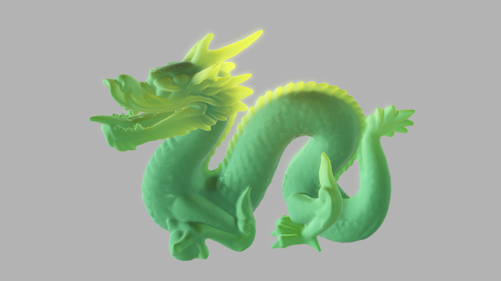

# KHR_materials_subsurface

## Contributors

* UX3D [https://github.com/ux3d](https://github.com/ux3d)
  * Alexander Lingtorp
  * Erik Jansson
  * Fabian Wahlster
  * Moritz Becher
  * Norbert Nopper
  * Urs Hanselmann
* IKEA
  * Antonia Pehrson
  * Jonas Gustavsson
  * Martin Enthed

## Status

Draft

## Dependencies

Written against the glTF 2.0 and the `KHR_lights_punctual` extension specification.

* Requires the `KHR_materials_thickness` extension.

## Overview

This extension defines the subsurface scattering material to simulate translucency of objects with varying thickness resulting in view and light-dependant attenuation.

## Extending Materials

```json
{
    "materials": [
        {
            "name": "wax",
            "extensions": {
                "KHR_materials_subsurface": {
                    "scale": 3.0,
                    "distortion": 0.8,
                    "power": 2.0,
                    "color": [0,1,0]
                },
                "KHR_materials_thickness": {
                    "thicknessFactor": 1.0,
                    "thicknessTexture": {
                        "index": 0
                    },
                }
            }
        }
    ]
}
```

### Subsurface Scattering

<p align="center">

</p>

The subsurface scattering (SSS) material model is defined by the following properties:

* `thickness` - local thickness of the object to approximate light transport inside the shape
* `distortion` - view oriented distortion shifting surface normal
* `power` - view dependent power of direct translucency
* `color` - color visible from all angles (simulates global effects)
* `scale` - view oriented scale

The proposed extension is largely based on pre-computed local thickness maps where a value of `0.0` simulate translucency and a value of `1.0` simulates opacity.

The `color` value can be defined using factors and textures. If a texture is not given, all respective texture components within this material model are assumed to have a value of `1.0`. The value `colorFactor` scales the components given in the respective texture `colorTexture` linearly. `colorTexture` is in sRGB space and must be converted to linear space before being used for any computations.

#### Scale

The scale factor modulates view-oriented direct/back translucency. A value of 0.0 means view-dependant contribution is not taken into account, a value of 1.0 means the contribution is directly proportional (to the angle between viewer and light source). This value is linear.

* **Type:** `number`
* **Range:** [0, ∞]
* **Default:** 1.0
* **Required:** no

#### Distortion

The distortion factor shifts surface normals to simulate subsurface distortion. A value of 0.0 means not contribution of the surface normal (flat surface). A value of 1.0 means full contribution of the surface normal. This value is linear.

* **Type:** `number`
* **Range:** [0, 1]
* **Default:** 0.0
* **Required:** no

#### Power

The power factor modulates strength of direct translucency. A value of 0 means view-dependant contribution is not taken into account, a value of 1 means the contribution is directly proportional, a value greater 1 means the contribution is taken as exponential factor. This value is exponential.

* **Type:** `number`
* **Range:** ]0, ∞]
* **Default:** 1
* **Required:** no

#### Color Factor

The RGB color of the material. This value is linear.

* **Type:** `number[3]`
* **Range:** [0, 1]
* **Default:** [1, 1, 1]
* **Required:** no

#### Color Texture

The color texture is a RGB texture containing the color visible from all angles in sRGB space.

* **Type:** [`textureInfo`](https://github.com/KhronosGroup/glTF/blob/master/specification/2.0/README.md#reference-textureInfo)
* **Required:** no

## glTF Schema Updates

### JSON Schema

For full details on the `KHR_materials_subsurface` extension properties, see the schema:

[glTF.KHR_materials_subsurface.schema.json](schema/glTF.KHR_materials_subsurface.schema.json)

## Best Practices

## Implementation

```glsl
uniform float distortion;
uniform float scale;
uniform float power;
uniform float thicknessFactor;
uniform vec3 colorFactor;

vec3 lightSSS(const float thickness, const vec3 color, const vec3 light, const vec3 normal, const vec3 viewer) {
    const vec3 distortedHalfway = light + normal * distortion;
    const float backIntensity = max(0.0, dot(viewer, -distortedHalfway));
    const float reverseDiffuse = pow(clamp(0.0, 1.0, backIntensity), power) * scale;
    return(reverseDiffuse + color) * (1.0 - thickness);
}

const float thickness = texture(thicknessTexture, uv).r * thicknessFactor;
const vec3  colorSSS = texture(colorTexture, uv).rgb * colorFactor;
color += lightSSS(thickness, colorSSS, L, N, V) * lightAttenuation;
```

### Renderer Support

* **UX3D Engine**

## Appendices

The proposed implementation in this glTF specification are based on *Colin Barré-Brisebois'* and *Marc Bouchard's* [*"Approximating Translucency for a Fast, Cheap and Convincing Subsurface Scattering Look"*](https://www.ea.com/frostbite/news/approximating-translucency-for-a-fast-cheap-and-convincing-subsurface-scattering-look) GDC 2011 presentation.
