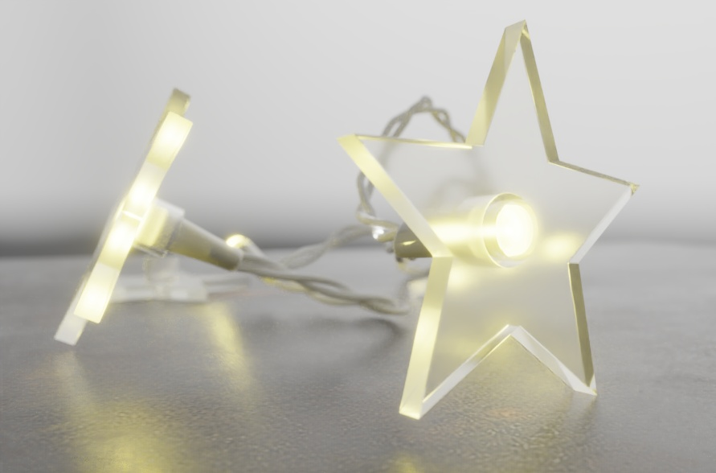
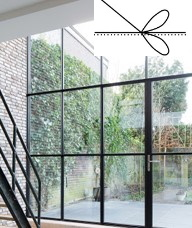
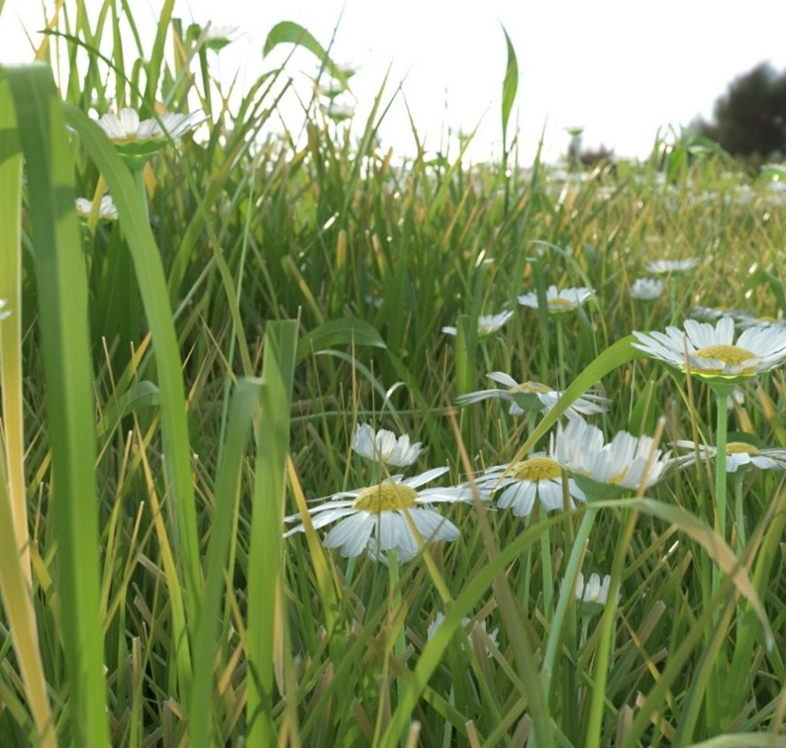
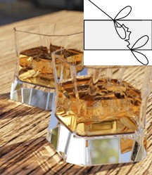
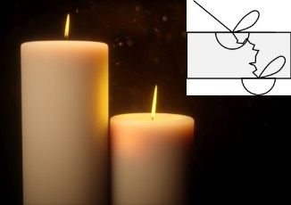

# KHR\_materials\_translucency

## Contributors

* Tobias Haeussler, Dassault Systemes [@proog128](https://github.com/proog128)
* Bastian Sdorra, Dassault Systemes [@bsdorra](https://github.com/bsdorra)

## Acknowledgments

TODO

## Status

Experimental

## Dependencies

Written against the glTF 2.0 spec.

## Overview

This extension adds a Lambertian diffuse transmission BSDF to the metallic-roughness material. Thin, dielectric objects like leaves or paper transmit some of the incoming light to the opposite side of the surface. For thick media (volumes) with short scattering distances and therefore dense scattering behavior, a diffuse transmission lobe is a phenomenological plausible and cheap approximation.


<figure float="left" style="text-align:center">
   
  <figcaption><em>(Thin) translucent leaves</em></figcaption>
</figure>

<figure float="left" style="text-align:center">
  
   
  <figcaption><em>Skin modeled with translucency</em></figcaption>
</figure>

## Extending Materials

The effect is activated by adding the `KHR_materials_translucency` extension to any glTF material.

```json
{
    "materials": [
        {
            "extensions": {
                "KHR_materials_translucency": {
                    "translucencyFactor": 0.7,
                    "translucencyTexture": 0,
                }
            }
        }
    ]
}
```

The strength of the effect is controlled by `translucencyFactor` and `translucencyTexture`, combined via multiplication to describe a single value.

|                         | Type                                                                | Description                                                                                                                                                                      | Required         |
|-------------------------|---------------------------------------------------------------------|----------------------------------------------------------------------------------------------------------------------------------------------------------------------------------|------------------|
| **translucencyFactor**  | `number`                                                            | The percentage of non-specularly reflected light that is transmitted through the surface via the Lambertian diffuse transmission, i.e., the strength of the translucency effect. | No, default: `0` |
| **translucencyTexture** | [`textureInfo`](/specification/2.0/README.md#reference-textureInfo) | A greyscale texture that defines the strength of the translucency effect. Will be multiplied by specularFactor and specularColorFactor.                                          | No               |

Increasing the strength of the translucency effect via the `translucency` parameter takes away energy from the diffuse reflection BSDF and passes it to the diffuse transmission BSDF. The specular reflection BSDF and Fresnel weighting are not affected. The diffuse color affects both the diffuse reflection and the diffuse transmission BSDF.

## Implementation

*This section is non-normative.*

The extension changes the diffuse term defined in [Appendix B](/specification/2.0/README.md#appendix-b-brdf-implementation) to the following:

```
translucency = translucencyFactor * translucencyTexture.r
diffuse = (c_diff/pi) * lerp(diffuseBRDF, diffuseBTDF, translucency)
```

The `diffuseBRDF` is 1 if view and light direction point into the same hemisphere wrt. the normal direction, and 0 otherwise. The `diffuseBTDF` is 1 if view and light direction point into different hemispheres wrt. the normal direction, and 0 otherwise.

```
diffuseBRDF = dot(N, V) * dot(N, L) >= 0 ? 1 : 0
diffuseBTDF = dot(N, V) * dot(N, L) <  0 ? 1 : 0
```

<figure style="text-align:center">

<figcaption><em>Left: Diffuse BRDF. Right: Diffuse BTDF (translucency).</em></figcaption>
</figure>

## Combining Translucency with other Extensions
### KHR_materials_transmission
 Both, `KHR_materials_translucency` and  `KHR_materials_transmission` transform the object's surface in way that it also transmits light instead of only reflecting it. 
 KHR_materials_transmission reuses the microfacet reflection BRDF to calculate the transmission. Therefore, transmission and reflection depend on the same roughness value, as shown in the image below (middle). 
 KHR_materials_translucency is independent of the reflection BRDF and always uses a diffuse transmission BTDF as explained above. By decoupling the reflection and transmission parts it is possible to configure materials which have a smooth reflection and a diffuse transmission, as shown in image below (right).

<figure style="text-align:center">
 
  
<figcaption><em>Left: Opaque diffuse. Middle: Rough transmission. Right: Diffuse BTDF (translucency).</em></figcaption>
</figure>

If `KHR_materials_transmission` is used in combination with `KHR_materials_translucency`, the transmission effect overrides the tanslucency effect. The calculation given in `KHR_materials_translucency` still holds, but uses the modified diffuse term defined above: *f*<sub>*diffuse*</sub> = (1 - *F*) * (1 - *T*) * *diffuse*.

<figure style="text-align:center">
 
<figcaption><em>95% transmissive, 5% translucent</em></figcaption>
</figure>


### KHR_materials_volume
If `KHR_materials_translucency` is combined with `KHR_materials_volume`, a diffuse transmission BTDF describes the transmission of light through the volume boundary. The object becomes translucent. The roughness parameter only affects the reflection. Scattering and absorption inside the volume are computed as defined in `KHR_materials_volume` and `KHR_materials_sss`, so the random walk through the volume is not affected by the surface BSDF.

<figure style="text-align:center">

<figcaption><em>Translucent sphere with varying roughness. From left to right: 0.0, 0.2, 0.4.</em></figcaption>
</figure>

For comparison, below is the result for the same scene with `KHR_materials_transmission` instead of `KHR_materials_translucency`. Please note, how the refractive microfacet BTDF describes the transmission of light through the volume boundary. The refraction occurs on microfacets, and thus the roughness parameter affects both reflection and transmission. 

<figure style="text-align:center">

<figcaption><em>Transmissive sphere with varying roughness. From left to right: 0.0, 0.2, 0.4.</em></figcaption>
</figure>

### KHR_materials_sss

For best results, we recommend using `KHR_materials_translucency` instead of `KHR_materials_transmission` in case the medium exhibits strong subsurface scattering (large values for the scattering coefficient σ<sub>s</sub>). Examples for these dense materials are skin or candle wax. The visual difference between translucency and transmission is small in this case, as the path a light travels is dominated by volume scattering. The scattering interaction at the volume boundary has only a small effect on the final result. 

The benefit of using translucency is that it signals the renderer that a material is dense, without the need to analyze geometry and scattering distance. Typically, the size of the volume in relation to the scattering coefficient determines the density of the object. A tiny object with low scattering coefficient may appear transparent, but increasing the size of the object will make it appear denser, although the scattering coefficient stays the same. If translucency is being used instead of highly glossy transmission, the material appears to be translucent independent of its size.

Consequently, renderers may use translucency as a cue to switch to diffusion approximation instead of random walk subsurface scattering. Diffusion approximation gives results that are very close to ground-truth for dense materials, but can be much faster. This is crucial for real-time implementations (which cannot do random walk), but also beneficial for offline rendering. [Christensen and Burley (2015)](#ChristensenBurley2015) show how to map the physical parameters for attenuation and subsurface scattering to an appropriate reflectance profile for diffusion approximation and compare results between approximation and ground-truth random walk. [Jimenez et al. (2015)](#Jimenez2015) present a method to render reflectance profiles in real-time by approximating the profile with a separable kernel.

<figure style="text-align:center">

<figcaption><em>Comparison of combining subsurface scattering with either transmission or translucency. Left: Rough transmission and subsurface scattering. Middle: Translucency and subsurface scattering. Right: Translucency without subsurface scattering using a thin-walled material. Colors are adjusted manually so that they look similar in the three configurations. This adjustment is needed in order to account for differences in distances and to minimize the impact of energy loss from the rough microfacet BTDF.</em></figcaption>
</figure>


### Summary
|                                  |               KHR_materials_transmission                |               KHR_materials_translucency                |
|:--------------------------------:|:-------------------------------------------------------:|:-------------------------------------------------------:|
| KHR_materials_volume <br>(thin)  |     |     |
| KHR_materials_volume <br>(thick) |  |  |

## Schema

- [glTF.KHR_materials_translucency.schema.json](schema/glTF.KHR_materials_translucency.schema.json)

