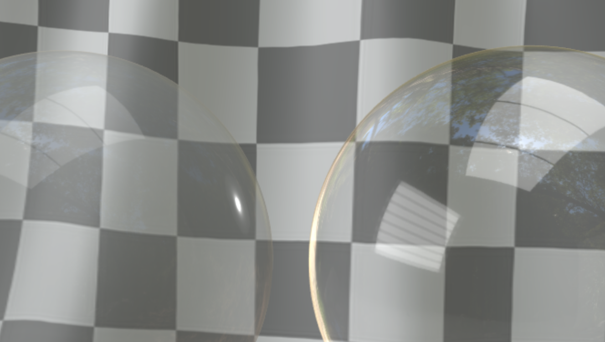

<!--
Copyright 2020 The Khronos Group Inc.
SPDX-License-Identifier: LicenseRef-KhronosSpecCopyright
-->

# KHR\_materials\_transmission <!-- omit in toc -->

## Contributors <!-- omit in toc -->

- Mike Bond, Adobe, [@miibond](https://github.com/MiiBond)
- Tobias Haeussler, Dassault Systemes [@proog128](https://github.com/proog128)
- Bastian Sdorra, Dassault Systemes [@bsdorra](https://github.com/bsdorra)
- Don McCurdy, Google [@donrmccurdy](https://twitter.com/donrmccurdy)
- Emmett Lalish, Google [@elalish](https://github.com/elalish)
- Ed Mackey, AGI [@emackey](https://github.com/emackey)
- Alex Wood, AGI [@abwood](https://github.com/abwood)
- Richard Sahlin, IKEA [@rsahlin](https://github.com/rsahlin)
- Norbert Nopper, UX3D [@UX3DGpuSoftware](https://twitter.com/UX3DGpuSoftware)

Copyright 2020 The Khronos Group Inc. All Rights Reserved. glTF is a trademark of The Khronos Group Inc.
See [Appendix](#appendix-full-khronos-copyright-statement) for full Khronos Copyright Statement.

## Status <!-- omit in toc -->

Complete, Ratified by the Khronos Group

## Dependencies <!-- omit in toc -->

Written against the glTF 2.0 spec.

## Table of Contents <!-- omit in toc -->
- [Exclusions](#exclusions)
- [Overview](#overview)
- [Limitations of Alpha as Coverage](#limitations-of-alpha-as-coverage)
- [Extending Materials](#extending-materials)
- [Properties](#properties)
  - [transmissionFactor](#transmissionfactor)
  - [transmissionTexture](#transmissiontexture)
- [Tinting](#tinting)
- [Refraction](#refraction)
- [Blend Mode](#blend-mode)
- [Transparent Metals](#transparent-metals)
- [Transmission BTDF](#transmission-btdf)
- [Implementation Notes](#implementation-notes)
- [Schema](#schema)
- [Reference](#reference)
- [Appendix: Full Khronos Copyright Statement](#appendix-full-khronos-copyright-statement)

## Exclusions

- This extension must not be used on a material that also uses `KHR_materials_pbrSpecularGlossiness`.
- This extension must not be used on a material that also uses `KHR_materials_unlit`.

## Overview

Many optically transparent materials are impossible to represent in a physically plausible manner with the core glTF 2.0 PBR material. This is because the core specification only includes the concept of "alpha as coverage" (exposed via the alpha channel of `baseColorFactor` and `baseColorTexture`). Many common materials like glass and plastic require significantly different rendering techniques.

## Limitations of Alpha as Coverage
Alpha-as-coverage can basically be thought of as describing whether the surface exists or not. When alpha is 0, nothing is rendered while alpha=1 means that the material is solid. It's most useful for materials such as gauze or burlap that only partially cover the area in which the material is rendered. These materials contain lots of small holes where the light can pass through so, strictly speaking, the light isn't actually entering the material itself (i.e. the surface isn't there). For other materials, like clear glass, a photon of light might actually enter the surface and be transmitted through. In this case, the light can be reflected, refracted, absorbed or scattered. Simple alpha-as-coverage cannot represent any of these effects and so we need very different logic to render them correctly.

The most important of these features is surely reflection. Even a completely transparent, infinitely thin, glass material is still visible due to its reflection of light. However, a material using purely alpha as coverage is not visible at all when alpha = 0 (because the surface effectively doesn't exist).

<figure>

<figcaption><em>White sphere with alpha coverage of 50% (left) vs the same sphere with 100% optical transparency (right). Note that alpha coverage of 50% is shown because 0% would be completely invisible. Also note that alpha-as-coverage reflects light in proportion to its opacity. i.e. the more transparent it is, the weaker the reflections will appear.</em></figcaption>
</figure>

The `KHR_materials_transmission` extension provides a way to define glTF 2.0 materials that are transparent to light in a physically plausible way. That is, it enables the creation of transparent materials that absorb, reflect and transmit light depending on the incident angle and the wavelength of light. Common uses cases for thin-surface transmissive materials include plastics and glass.

This extension aims to address the simplest and most common use cases for optical transparency: infinitely-thin materials with no refraction, scattering, or dispersion. Dealing exclusively with “thin” materials (i.e. materials where only the surface is considered and not the volume) allows many simplifications to be made when calculating things like refraction and absorption.

## Extending Materials

A transparent material is defined by adding the `KHR_materials_transmission` extension to any glTF material. When present, the extension indicates that a material should be rendered as a transparent surface and be blended as defined in the following spec. Note that, as rendering transparent objects presents many difficult-to-solve issues with primitive ordering, this extension does not dictate rendering algorithms.

```json
materials: [
  {
    "extensions": {
       "KHR_materials_transmission": {
         "transmissionFactor": 0.8,
         "transmissionTexture": {
           "index": 0
         }
       }
    }
  }
]
```

## Properties
Only two properties are introduced with this extension and combine to describe a single value; the percentage of light that is transmitted through the surface of the material. These properties work together with the existing properties of the material to define the way light is modified as it passes through the substance.

|   |Type|Description|Required|
|---|----|-----------|--------|
|**transmissionFactor** | `number` | The base percentage of light that is transmitted through the surface.| No, Default: `0.0 ` |
|**transmissionTexture** | [`textureInfo`](https://www.khronos.org/registry/glTF/specs/2.0/glTF-2.0.html#reference-textureinfo) | A texture that defines the transmission percentage of the surface, stored in the `R` channel. This will be multiplied by `transmissionFactor`. | No |

### transmissionFactor
The amount of light that is transmitted by the surface rather than diffusely re-emitted. This is a percentage of all the light that penetrates a surface (i.e. isn’t specularly reflected) rather than a percentage of the total light that hits a surface. A value of 1.0 means that 100% of the light that penetrates the surface is transmitted through.

<figure>
  
<figcaption><em>Yellow baseColor with transmissionFactor = 1.0.</em></figcaption>
</figure>

### transmissionTexture
The `R` channel of this texture defines the amount of light that is transmitted by the surface rather than diffusely re-emitted. A value of 1.0 in the red channel means that 100% of the light that penetrates the surface (i.e. isn’t specularly reflected) is transmitted through. The value is linear and is multiplied by the transmissionFactor to determine the total transmission value.

<figure>
  
<figcaption><em>Controlling transmission amount with transmissionTexture.</em></figcaption>
</figure>

## Tinting
The `baseColor` of the material, as defined in the [Metallic-Roughness Material](https://www.khronos.org/registry/glTF/specs/2.0/glTF-2.0.html#metallic-roughness-material) section of the glTF specification, controls the amount of light at each frequency that is reflected (not absorbed) by the material. Similarily, we also use it to define the light that is transmitted (not absorbed) by a transparent surface. Absorption is usually defined as an amount of light at each frequency that is absorbed over a given distance through a medium (usually described by Beer’s Law). However, since this extension deals exclusively with infinitely thin surfaces, this absorption is constant and equal to `1.0 - baseColor`. The color tinting effects in the above images are defined by the material's `baseColor`. Tinting is very useful for real-world materials like stained glass and tinted plastics.
<figure>
  
<figcaption><em>The baseColor of the material (yellow, in this example) is used to tint the light being transmitted.</em></figcaption>
</figure>

## Refraction
Since the surface is considered to be infinitely thin, we will ignore macroscopic refraction caused by the orientation of the surface. However, microfacets on either side of the thin surface will cause light to be refracted in random directions, effectively blurring the transmitted light. That is, the roughness of the surface directly causes the transmitted light to become blurred. This microfacet lobe is exactly the same as the specular lobe except sampled along the line of sight through the surface.
<figure>
  
<figcaption><em>Refraction due to surface roughness.</em></figcaption>
</figure>

## Blend Mode
The glTF `alphaMode` is used for alpha-as-coverage, NOT for physically-based transparency (i.e. this extension). If alpha-as-coverage is not being used, the blend mode of the material should be set to "OPAQUE" even though it is transparent. Again, it's helpful to think of alpha-as-coverage as whether the physical surface is there or not. `transmission` applies to the surface material that exists.
Note that alpha-as-coverage can still be used along with transmission as shown in the example below.
<figure>
  
<figcaption><em>Alpha coverage and optical transparency can be used at the same time so that some areas of a surface are transparent while others disappear entirely.</em></figcaption>
</figure>

## Transparent Metals
Metals effectively absorb all refracted light (light that isn't reflected), preventing transmission.
The metallic parameter of a glTF material effectively scales the `baseColor` of the material toward black while, at the same time scaling the F0 (reflectivity) value towards 1.0. This makes the material opaque for metallic values of 1.0 because transmitted light is attenuated out by absorption. Therefore, for a material with `metallicFactor=1.0`, the value of `transmissionFactor` doesn't matter.

## Transmission BTDF ##

From the core [glTF BRDF](https://www.khronos.org/registry/glTF/specs/2.0/glTF-2.0.html#appendix-b-brdf-implementation), we have:

```
dielectric_brdf =
  fresnel_mix(
    ior = 1.5,
    base = diffuse_brdf(color = baseColor),
    layer = specular_brdf(α = roughness^2))
```

We will now add an additional term for the transmitted light:

```
dielectric_brdf =
  fresnel_mix(
    ior = 1.5,
    base = mix(
      diffuse_brdf(baseColor),
      specular_btdf(α = roughness^2) * baseColor,
      transmission),
    layer = specular_brdf(α = roughness^2))
```

where `transmission` is the transmission percentage defined by this extension's `transmissionFactor` and `transmissionTexture` properties and `specular_btdf` is a bidirectional transmission distribution function (BTDF) based on microfacet theory. The microfacet distribution function is the same Trowbridge-Reitz model used by specular reflection except sampled along the view vector rather than the reflection. The *baseColor* factor causes the transmitted light to be tinted by the surface.

<figure>
  
<figcaption><em>KHR_material_transmission adds a specular_btdf to the core glTF BRDF.</em></figcaption>
</figure>

Note that unless otherwise specified by another extension, this transmissive surface is really two surfaces back-to-back, representing a thin material. As such there is no average refraction, but in the presence of roughness there is refraction at the microfacet level. This is because the distribution function is appled to both the front and back surface microfacets and they are uncorrelated to each other. These microfacet pairs form tiny prisms that cause the roughness map to blur the transmitted light, and as such this effect will be modulated by the material's index of refraction (IOR). Recall that the default IOR from the base spec is 1.5.

Optical transparency does not require any changes whatsoever to the specular term. So the transmitted light amount to a modification of the `base` layer only.

## Implementation Notes

*This section is non-normative.*

The specular transmission `specular_btdf(α)` is a microfacet BTDF

$$
\text{MicrofacetBTDF} = \frac{G_T D_T}{4 \left|N \cdot L \right| \left| N \cdot V \right|}
$$

with the Trowbridge-Reitz/GGX microfacet distribution

$$
D_T = \frac{\alpha^2 \chi^+(N \cdot H_T)}{\pi ((N \cdot H_T)^2 (\alpha^2 - 1) + 1)^2}
$$

and the separable form of the Smith joint masking-shadowing function

$$
G_T = \frac{2 \left| N \cdot L \right| \chi^+\left(\frac{H_T \cdot L}{N \cdot L}\right)}{\left| N \cdot L \right| + \sqrt{\alpha^2 + (1 - \alpha^2) (N \cdot L)^2}} \frac{2 \left| N \cdot V \right| \chi^+\left(\frac{H_T \cdot V}{N \cdot V}\right)}{\left| N \cdot V \right| + \sqrt{\alpha^2 + (1 - \alpha^2) (N \cdot V)^2}}
$$

using the transmission half vector $H_T$

$$
H_T = \text{normalize}(V - 2 \left( N \cdot L \right) N + L)
$$

With the step function $\chi^+$ we ensure that the microsurface is only visible for directions that are on the same side of the macro and microsurfaces. Macro and microsurfaces are oriented according to $N$ and $H_T$, respectively.

Introducing the visibility function

$$
\nu_T = \frac{G_T}{4 \left| N \cdot L \right| \left| N \cdot V \right|}
$$

simplifies the original microfacet BTDF to

$$
\text{MicrofacetBTDF} = \nu_T D_T
$$

with

$$
\nu_T = \frac{\chi^+\left(\frac{H_T \cdot L}{N \cdot L}\right)}{\left| N \cdot L\right| + \sqrt{\alpha^2 + (1 - \alpha^2) (N \cdot L)^2}} \frac{\chi^+\left(\frac{H_T \cdot V}{N \cdot V}\right)}{\left| N \cdot V \right| + \sqrt{\alpha^2 + (1 - \alpha^2) (N \cdot V)^2}}
$$

Thus we have the function

```
function specular_btdf(α) {
  return Vis_T * D_T
}
```

Rendering transparency in a real-time rasterizer in an efficient manner is a difficult problem, especially when an arbitrary number of transparent polygons may be overlapping in view. This is because rendering transparency is order-dependent (i.e. we see background objects through foreground objects) and also because the rendering of absorption and reflections involves two distinct blend operations. Consequently, it may not be possible on the target platform to render every transparent polygon in the correct order, in a reasonable time, and with the correct blending. Therefore, correct ordering is not an absolute requirement when implementing this extension in realtime renderers, nor is rendering all potentially overlapping layers.

Various techniques are available to trade off physical accuracy against realtime performance requirements in client implementations. This extension does not mandate any particular technique. However, be aware that the simplest such technique — transmitting only the IBL and no scene objects — will often fall short of what a model's author intended. We recommend that client implementations aim to display at least opaque objects through a transmissive material. When that is not feasible, it may be preferable to fall back to simple alpha blending with 0 < alpha < 1.

<figure>

<figcaption><em>On the left, only opaque objects are visible through the sphere. Each subsequent image shows an additional layer of transparency visible through the front-most transparent surface. The minimum expectation for a compliant renderer is to render only opaque objects (i.e. like the first image). Additional transparent layers may be rendered but are not required.</em></figcaption>
</figure>

## Schema

- [material.KHR_materials_transmission.schema.json](schema/material.KHR_materials_transmission.schema.json)

## Reference

- [Autodesk Standard Surface - Specular Transmission](https://autodesk.github.io/standard-surface/#closures/speculartransmission)
- [Blender Transparent BSDF](https://docs.blender.org/manual/en/latest/render/shader_nodes/shader/transparent.html#transparent-bsdf)
- [Enterprise PBR Shading Model - Dielectric BSDF for Transparent Surfaces](https://dassaultsystemes-technology.github.io/EnterprisePBRShadingModel/spec-2022x.md.html#components/core/dielectricbsdffortransparentsurfaces)
- [Filament Material models - Transmission](https://google.github.io/filament/Materials.md.html#materialmodels/litmodel/transmission)
- [Unreal Engine 4 Material - Refraction](https://docs.unrealengine.com/en-US/Engine/Rendering/Materials/MaterialInputs/index.html#refraction)
- [Adobe Standard Material - Interior Properties](https://helpx.adobe.com/dimension/using/standard-materials.html#InteriorProperties)

## Appendix: Full Khronos Copyright Statement

Copyright 2020 The Khronos Group Inc.

Some parts of this Specification are purely informative and do not define requirements
necessary for compliance and so are outside the Scope of this Specification. These
parts of the Specification are marked as being non-normative, or identified as
**Implementation Notes**.

Where this Specification includes normative references to external documents, only the
specifically identified sections and functionality of those external documents are in
Scope. Requirements defined by external documents not created by Khronos may contain
contributions from non-members of Khronos not covered by the Khronos Intellectual
Property Rights Policy.

This specification is protected by copyright laws and contains material proprietary
to Khronos. Except as described by these terms, it or any components
may not be reproduced, republished, distributed, transmitted, displayed, broadcast
or otherwise exploited in any manner without the express prior written permission
of Khronos.

This specification has been created under the Khronos Intellectual Property Rights
Policy, which is Attachment A of the Khronos Group Membership Agreement available at
www.khronos.org/files/member_agreement.pdf. Khronos grants a conditional
copyright license to use and reproduce the unmodified specification for any purpose,
without fee or royalty, EXCEPT no licenses to any patent, trademark or other
intellectual property rights are granted under these terms. Parties desiring to
implement the specification and make use of Khronos trademarks in relation to that
implementation, and receive reciprocal patent license protection under the Khronos
IP Policy must become Adopters and confirm the implementation as conformant under
the process defined by Khronos for this specification;
see https://www.khronos.org/adopters.

Khronos makes no, and expressly disclaims any, representations or warranties,
express or implied, regarding this specification, including, without limitation:
merchantability, fitness for a particular purpose, non-infringement of any
intellectual property, correctness, accuracy, completeness, timeliness, and
reliability. Under no circumstances will Khronos, or any of its Promoters,
Contributors or Members, or their respective partners, officers, directors,
employees, agents or representatives be liable for any damages, whether direct,
indirect, special or consequential damages for lost revenues, lost profits, or
otherwise, arising from or in connection with these materials.

Khronos® and Vulkan® are registered trademarks, and ANARI™, WebGL™, glTF™, NNEF™, OpenVX™,
SPIR™, SPIR-V™, SYCL™, OpenVG™ and 3D Commerce™ are trademarks of The Khronos Group Inc.
OpenXR™ is a trademark owned by The Khronos Group Inc. and is registered as a trademark in
China, the European Union, Japan and the United Kingdom. OpenCL™ is a trademark of Apple Inc.
and OpenGL® is a registered trademark and the OpenGL ES™ and OpenGL SC™ logos are trademarks
of Hewlett Packard Enterprise used under license by Khronos. ASTC is a trademark of
ARM Holdings PLC. All other product names, trademarks, and/or company names are used solely
for identification and belong to their respective owners.
