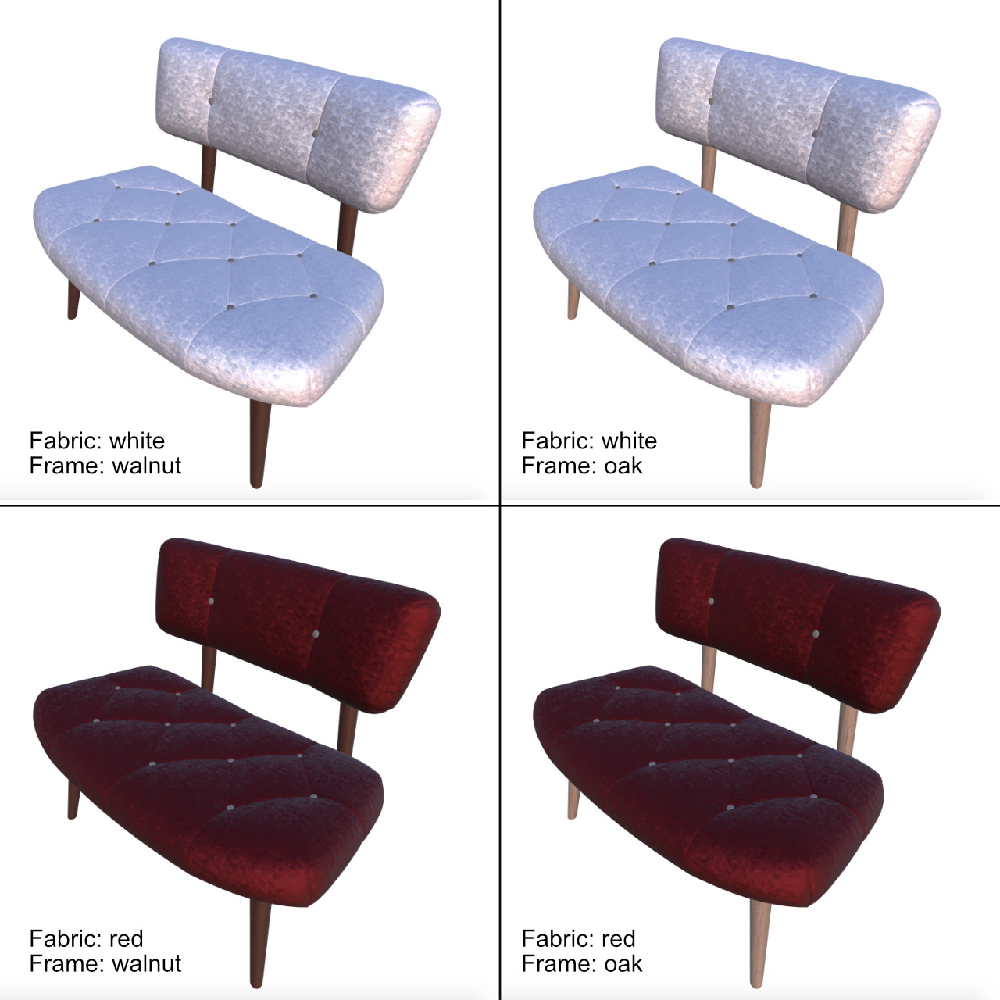

# KHR_materials_variants

## Contributors

- Pär Winzell, Facebook, [@zellski](https://twitter.com/zellski)
- Renee Rashid, Facebook, [@debuggrl](https://github.com/debuggrl)

## Status

Draft

## Dependencies

Written against the glTF 2.0 spec.

## Overview

This extension allows for a compact glTF representation of multiple material variants of an asset, structured to allow low-latency switching at runtime.

A typical use case is digital commerce, where a user might be presented with e.g. a pair of sneakers and the ability to switch between different colours.


## Design Goals

_This section is non-normative._

This extension aims specifically to give asset creators and consumers a way to communicate _static configurability_.  In other words, we explicitly optimize for the case of representing asset variants which are:

* **finite** - the list of variants is bounded; multi-dimensional variants (e.g. color + texture) are possible but must ultimately be representable as a flattened list
* **premade** - the variants are produced at asset authoring time
* **holistic** - while composable, the variants are dictated wholesale at the granularity of the glTF asset; sub-variants or hierarchical variants are not considered

In digital commerce, each variant may correspond to a distinct SKU or stocked product code, which naturally meet these requirements.  In games or movies, each variant may represent a fixed set of curated asset skins which can be represented, moved across the wire, and loaded efficiently.

A non-goal of this extension is to serve _configuration authorship_ use cases (i.e. configuration builders or "configurators"), which necessarily entail a separate set of concerns, are more subject to complex application-specific business logic, and may benefit from dynamic and continuous configurability and complex builder rules.

While not designed around this use case, we note however that this extension does implicitly communicate at the primitive level which materials are "valid" for that primitive, for any such applications which may be interested in leveraging this information.

## Variants

We introduce a simple variant tagging extension scheme, that allows for high-level runtime swapping between which `material` is used to shade a given `mesh primitive`: the extension root contains a mandatory `mapping` property, which is an array of objects, each one associating some set of variants with a material reference.

Imagine a sneaker with shoelace holes that are made from materials that depend on the overall shoe colour in non-obvious ways:

| Variants                           | Material                        |
| ---------------------------------- | ------------------------------- |
| `sneaker_yellow`, `sneaker_orange` | `shoelace_hole_material_brown`  |
| `sneaker_red`                      | `shoelace_hole_material_purple` |
| `sneaker_black`                    | `shoelace_hole_material_yellow` |

(_the authors of this spec are not product designers, apologies for the dubious colour choices_)

Application-specific logic defines, for a given instance of a glTF asset, a single active variant.  The currently active `material` for a `mesh primitive` is found by stepping through this array of mappings in order, and selecting the first one which contains somewhere in its list of variants the currently active variant. The corresponding material is assigned to the mesh.  If none match, fall back on vanilla glTF behaviour.

In other words, **this is not a literal mapping** in its glTF form – exporters, take note.

## The variant mapping as glTF JSON

A snippet of a mesh implementing shoe holes which uses this extension might look like:

```javascript
"meshes": [
    {
        "name": "shoelace_hole",
        "primitives": [
            {
                "attributes": {
                "POSITION": 0,
                "NORMAL": 1,
                },
                "indices": 2,
                "material": 0,
                "extensions": {
                    "KHR_materials_variants" : {
                        "mapping": [
                            {
                                "variants": [ "sneaker_yellow", "sneaker_orange" ],
                                "material": 7,
                            },
                            {
                                "variants": [ "sneaker_red" ],
                                "material": 8,
                            },
                            {
                                "variants": [ "sneaker_black" ],
                                "material": 9,
                            },
                        ],
                    }
                }
            },
            // ... more primitives ...
        ]
    },
    // ... more meshes ...
]
```
The variant tag-based approach allows for wholesale changes across diverse geometry, by reusing the same variant identifiers in switches across many distinct mesh primitives.  Likewise, for a given primitive, many different variants may share the same materials.

Composition also works well with variants: if a scene were built from several glTFs with different variational models, each with their own set of variants, then it's easy to imagine an API call on the entire scene that takes a set of variants and passes them on to each constituent model, recursively.

> NOTE: Variant strings function only as identifiers.  Communicating a human readable name for the variants is left to specific applications and kept outside the scope of this extension.  Each mapping can optionally define a name as well, though this is strictly optional.

## Interaction with existing glTF functionality

_This section is non-normative._

The primary purpose of this extension is to simply formalise the idea of static configurability, so that members of the ecosystem can meaningfully communicate: those who produce assets and those who ingest them, and all the tooling in between.

As a secondary effect, material variants allow multiple assets — with shared geometry but different materials — to be stored more compactly, particularly relevant for the self-contained binary format GLB. When using external URIs as references to textures, applications may (optionally) process geometry only once and lazily request texture assets only when needed for a particular variant.

## Implications for Applications and APIs

_This section is non-normative._

How does an application communicate to a glTF engine what the initial variant state should be? How does it submit a runtime request for a different configuration? It's out of scope for this extension to constrain or mandate an engine's public API, but a useful implementation will require something of the sort.

## Examples

_This section is non-normative._

For reference, we provide several simple examples of variants, both represented as distinct constituent GLB files without the extension and as multi-variant GLB files leveraging this extension.  We also include the respective net size of the individual variant GLB files and the size of the single combined multi-variant GLB, for comparison.

| Model                     | Screenshot                         | Description                                                                                                   | Net Size (MB) | Combined Size (MB) |
|---------------------------|------------------------------------|---------------------------------------------------------------------------------------------------------------|---------------|--------------------|
| [Shoes](examples/shoes)   |       | A simple variant commerce example with a single mesh primitive                                                | 15            | 7.5                |
| [Chair](examples/chair)   |      | A more complex commerce example, involving multi-dimensional variants - flattened into four distinct variants | 7.0           | 1.7                |
| [Helmet](examples/helmet) |    | Gaming example, with wet and dry variants of a helmet                                                         | 8.8           | 5.0                |
