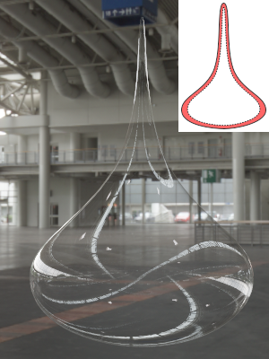
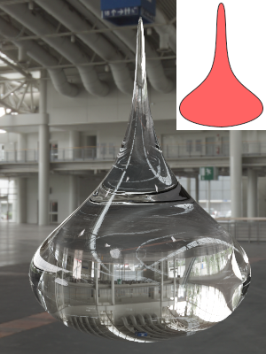
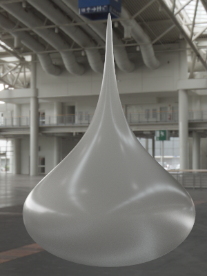
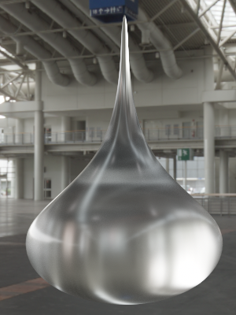
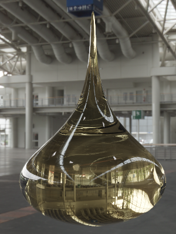
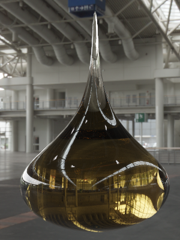
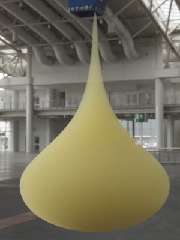

# KHR_materials_volume

## Contributors

* TODO: Name, affiliation, and contact info for each contributor

## Status

Draft

## Dependencies

Written against the glTF 2.0 spec. Needs to be combined with `KHR_materials_transmission`.

## Overview

This extension adds material parameters to configure the volume beneath the surface of closed meshes, providing effects like refraction, absorption and subsurface scattering. The transparency of the surface is controlled by `KHR_materials_transmission`.

Light hitting an object will first interact with the surface according the BSDF. The BSDF determines how much and in which direction the incident light is reflected and transmitted. Light that is transmitted enters the volume, where it is absorbed or scattered by particles inside the medium. After bouncing several times inside the object, the light will eventually hit the surface again. The BSDF is evaluated a second time, the light may now leave the object or be kept inside it if total internal reflection occurs.

The light rays are reflected or refracted at the micro-facets on the surface, taking the roughness of the material into account. The index of refraction used for computing the refraction direction is taken from the BSDF, potentially set by `KHR_materials_ior`.

<figure style="text-align:center">

<figcaption>Object with homogeneous volume and an index of refraction of 1.5.</figcaption>
</figure>

## Extending Materials

The volumetric properties are defined by adding the `KHR_materials_volume` extension to any glTF material.

```json
materials: [
    {
        "extensions": {
            "KHR_materials_volume": {
                "sigmaT": [ 78.03, 17.83, 126.29 ],
                "albedo": [ 0.29, 0.82, 0.99 ],
                "anisotropy": 0.0
            }
        }
    }
]
```

Note that there are no textures in this extension, the medium is homogeneous. If a texture is defined in `KHR_materials_ior`, it is ignored if `KHR_materials_volume` is active.

## Properties

The extension provides two parameters to describe the medium and one parameter to control the phase function.

| | Type | Description | Required |
|-|------|-------------|----------|
| **sigmaT** | `number[3]` | Attenuation coefficient (also called extinction coefficient) in inverse meters. | No, default: `[0.0, 0.0, 0.0]` |
| **albedo** | `number[3]` | Single-scattering albedo. | No, default: `[0.0, 0.0, 0.0]` |
| **anisotropy** | `number` | Anisotropy of the phase function in range [-1, 1] | No, default: `0` |

### Conversions

Alternatively, subsurface scattering can be parametrized with absorption coefficient **sigmaA** and scattering coefficient **sigmaS**. These are converted as follows:

```
sigmaT = sigmaS + sigmaA
albedo = sigmaS / (sigmaS + sigmaA)
```

Sometimes the mean free path length **mfp** is given:

```
sigmaT = 1 / mfp
```

The attenuation color is a 3-channel value that goes up to infinity. By splitting it into two values, an RGB attenuation color and a distance, the color is easier to set up. In the following equation, **attenuationColor** defines the remaining, wavelength-dependent energy of a ray of white light after travelling a certain distance (**attenuationDistance**) through the medium.

```
sigmaT = -ln(attenuationColor) / attenuationDistance
```

A more user-friendly parametrization for albedo is proposed in [Kulla and Conty (2017): Revisiting Physically Based Shading at Imageworks](https://blog.selfshadow.com/publications/s2017-shading-course/imageworks/s2017_pbs_imageworks_slides_v2.pdf). As the light may interact multiple times with particles in the medium, the overall color of the material is different from the color of a single scattering event. Assuming a white light source, it is possible to predict the overall material color from the single-scattering albedo. By inverting the prediction it is possible to map from the user-defined overall **color** to single-scattering albedo:

```
s = 4.09712 + 4.20863 * color - sqrt(9.59217 + 41.68086 * color + 17.7126 * color^2)
albedo = (1 - s^2) / (1 - anisoptropy * s^2)
```

### Thin Transparency and Refraction

Without this extension, the glTF geometry defines a two-sided object enclosing an infinitely thin volume. If the extension is enabled, the geometry represents a volume boundary. The index of refraction will bend light rays traveling through the boundary into the volume.

<figure style="text-align:center">


<figcaption>Left: The geometry describes an infinitely thin volume (red). Right: The geometry describes the boundary of a volume.</figcaption>
</figure>

<figure style="text-align:center">


<figcaption>Surface roughness affects BRDF and BTDF, thin-walled (left) and volumetric objects (right).</figcaption>
</figure>

### Base Color and Absorption

Base color and absorption both have an effect on the final color of a volumetric object, but the behavior is different. Base color will change the color of light passing through the surface, i.e., the boundary of the volume. Absorption will occur while the light is traveling through the volume. Depending on the distance the light travels through the volume, more or less of it is absorbed, making the overall color of the object dependent on its shape.

<figure style="text-align:center">


<figcaption>Base color changes the amount of light passing through the volume boundary (left). The overall color of the object is the same everywhere, as if the object is covered with a colored, semi-transparent foil. Absorption changes the amount of light traveling through the volume (right). The overall color depends on the distance the light traveled through it; at small distances (top) almost nothing was absorbed and the color is white, whereas long distances make the light darker (bottom)</figcaption>
</figure>

### Subsurface Scattering

Subsurface scattering inside the volume is enabled by modifying the albedo parameter. Note that subsurface scattering is a volumetric effect; the surface has to be transparent, otherwise light cannot pass through the boundary into the volume. That also means that refraction and roughness bend the incoming light at the surface boundary.

<figure style="text-align:center">

<figcaption>Volume with colored albedo and greyscale attenuation. The index of refraction is set to 1 and roughness is 0, light rays pass through the boundary without being bent.</figcaption>
</figure>

## Implementation

### BTDF

The extension replaces the thin microfacet BTDF defined in `KHR_materials_transmission` by a microfacet BTDF that takes refraction into account, see [Walter B., Marschner S., Li H., Torrance K. (2007): Microfacet Models for Refraction through Rough Surfaces](https://www.cs.cornell.edu/~srm/publications/EGSR07-btdf.pdf).

```
transparent_dielectric_bsdf =
  microfacet_btdf(alpha) * (1.0 - fresnel(HdotV, f0)) +
  microfacet_brdf(alpha) * fresnel(HdotV, f0) +
  multiscatter_microfacet_brdf(alpha) * multiscatter_fresnel(f0)

dielectric_bsdf = mix(
  dielectric_brdf(baseColor, alpha),
  transparent_dielectric_bsdf(baseColor, alpha),
  transmission)

material = mix(
  dielectric_bsdf(baseColor, roughness^2, transmission),
  metal_brdf(baseColor, roughness^2),
  metallic)
```

The microfacet BTDF uses the same terms for G and D as the microfacet BRDF.

```
                   abs(LdotH) * abs(VdotH)                 ior_o^2 * G * D
microfacet_btdf = ------------------------- * ----------------------------------------
                   abs(LdotN) * abs(VdotN)      (ior_i * VdotH + ior_o * LdotH)^2
```

`ior_i` and `ior_o` denote the index of refraction of the incident and transmitted side of the surface, respectively. `V` is the vector pointing to the camera, `L` points to the light. In a path tracer that starts rays at the camera, `V` corresponds to the incident side of the surface, which is the side of the medium  with `ior_i`.

Using Snell's law, the half vector is computed as follows:

```
H = -normalize(ior_i * VdotH + ior_o * LdotN)
```

Incident and transmitted index of refraction have to be correctly set by the renderer, depending on whether light enters or leaves the object. An algorithm for tracking the IOR through overlapping objects is described in [Schmidt C., Budge B. (2002): Simple Nested Dielectrics in Ray Traced Images](http://citeseerx.ist.psu.edu/viewdoc/download?doi=10.1.1.125.5212&rep=rep1&type=pdf).

*TODO* Nested dielectrics need a priority value per object. Maybe as part of a node that instantiates a mesh?

### Phase Function

The Henyey-Greenstein phase function with parameter **anisotropy**, ranging from -1 (back-scattering) over 0 (isotropic scattering) to 1 (forward-scattering), is the following:

```
                  1                     1 - anisotropy^2
phase_function = ---- * -------------------------------------------------------
                 4*pi    (1 + anisotropy^2 + 2 * aniostropy * cos(VdotL))^(3/2)
```

## Known Implementations

* TODO: List of known implementations, with links to each if available.

## Resources

* TODO: Resources, if any.
