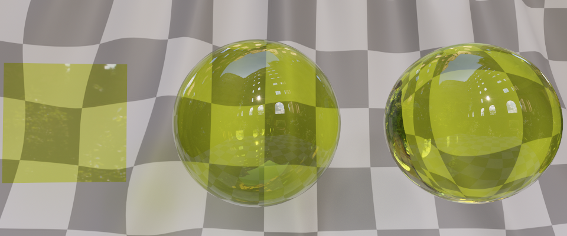
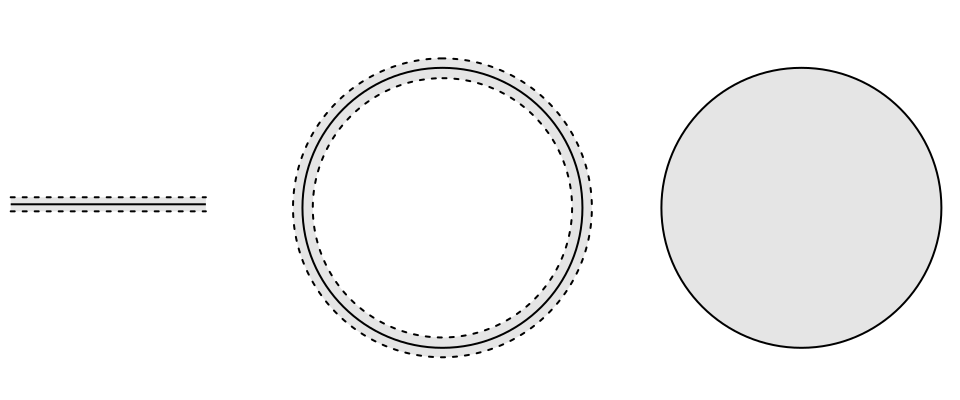
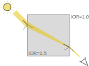
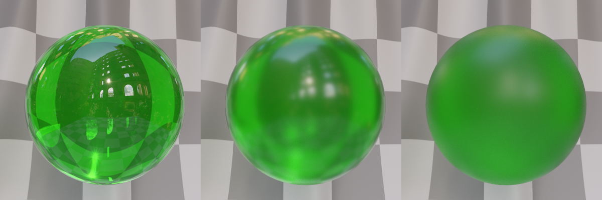
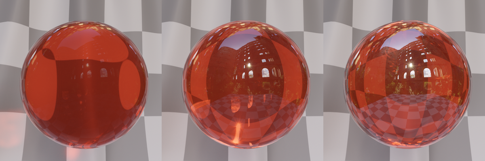
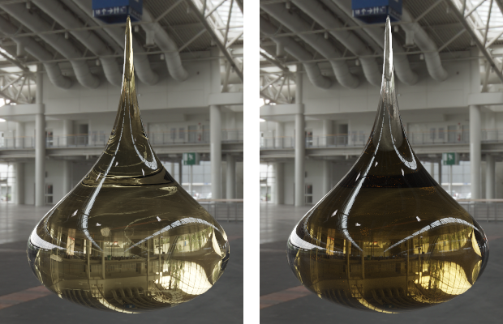

<!--
Copyright 2018-2021 The Khronos Group Inc.
SPDX-License-Identifier: LicenseRef-KhronosSpecCopyright
-->

# KHR_materials_volume

## Contributors

- Tobias Haeussler, Dassault Systemes [@proog128](https://github.com/proog128)
- Bastian Sdorra, Dassault Systemes [@bsdorra](https://github.com/bsdorra)
- Mike Bond, Adobe, [@miibond](https://github.com/MiiBond)
- Emmett Lalish, Google [@elalish](https://github.com/elalish)
- Don McCurdy, Google [@donrmccurdy](https://twitter.com/donrmccurdy)
- Norbert Nopper, UX3D [@UX3DGpuSoftware](https://twitter.com/UX3DGpuSoftware)
- Richard Sahlin, IKEA [@rsahlin](https://github.com/rsahlin)
- Eric Chadwick, Wayfair [echadwick-wayfair](https://github.com/echadwick-wayfair)
- Ben Houston, ThreeKit [@bhouston](https://github.com/bhouston)
- Gary Hsu, Microsoft [@bghgary](https://twitter.com/bghgary)
- Sebastien Vandenberghe, Microsoft [@sebavanjs](https://twitter.com/sebavanjs)
- Nicholas Barlow, Microsoft
- Nicolas Savva, Autodesk [@nicolassavva-autodesk](https://github.com/nicolassavva-autodesk)
- Henrik Edstrom, Autodesk
- Bruce Cherniak, Intel
- Adam Morris, Target [@weegeekps](https://github.com/weegeekps)
- Sandra Voelker, Target
- Alex Jamerson, Amazon
- Thomas Dideriksen, Amazon
- Alex Wood, AGI [@abwood](https://github.com/abwood)
- Ed Mackey, AGI [@emackey](https://github.com/emackey)

Copyright 2018-2021 The Khronos Group Inc. All Rights Reserved. glTF is a trademark of The Khronos Group Inc.
See [Appendix](#appendix-full-khronos-copyright-statement) for full Khronos Copyright Statement.

## Status

Complete, Ratified by the Khronos Group

## Dependencies

Written against the glTF 2.0 spec. The volume extension needs to be combined with an extension which allows light to transmit through the surface, e.g. `KHR_materials_transmission`.

## Exclusions

- This extension must not be used on a material that also uses `KHR_materials_pbrSpecularGlossiness`.
- This extension must not be used on a material that also uses `KHR_materials_unlit`.

## Table of Contents

- [Overview](#overview)
- [Extending Materials](#extending-materials)
- [Properties](#properties)
- [Thickness Texture](#thickness-texture)
- [Refraction](#refraction)
- [Attenuation](#attenuation)
- [Base Color and Absorption](#base-color-and-absorption)
- [Implementation](#implementation)
- [Reference](#reference)
- [Appendix: Full Khronos Copyright Statement](#appendix-full-khronos-copyright-statement)

## Overview

By default, a glTF 2.0 material describes the scattering properties of a surface enclosing an infinitely thin volume. The surface defined by the mesh represents a thin wall. The volume extension makes it possible to turn the surface into an interface between volumes. The mesh to which the material is attached defines the boundaries of an homogeneous medium and therefore must be manifold. Volumes provide effects like refraction, absorption and scattering. Scattering is not subject of this extension.

<figure style="text-align:center">
<br/>

<figcaption><em>Renderings of various objects (top) and corresponding top-down slice through the scene (bottom). The solid line represents the mesh. The gray area represents the volume. Thin-walled materials can be applied to open (left) and closed meshes (middle). The dashed line indicates the imaginary bounds of the infinitely thin volume. The volumetric material can only be applied to closed meshes (right), resulting in volumetric effects like refraction.</em></figcaption>
</figure>

The volume extension needs to be combined with an extension that allows light rays to pass through the surface into the volume, e.g. `KHR_materials_transmission`. Only if light is allowed to penetrate the surface, the volume extensions comes into effect. Once the volume is entered however, the simulation of volumetric effects inside the medium is independent of the surface properties. When hitting the surface from inside the volume, the light will leave the volume, depending on incident direction.


<figure style="text-align:center">

<figcaption><em>A light ray being refracted in a volume. The volume is homogeneous and has an index of refraction of 1.5. At the boundaries, the direction of the light ray is bent according to the indices of refraction at incident and outgoing side. Inside the volume, light is attenuated as it travels through the medium into the direction of the eye. The longer it travels, the more it is attenuated. The index of refraction is taken from `KHR_materials_ior`</figcaption>
</em></figure>


If the extension is combined with `KHR_materials_transmission`, a refractive microfacet BTDF describes the transmission of light through the volume boundary. The refraction occurs on microfacets, and thus the roughness parameter affects both reflection and transmission. An exemplatory implementation is shown in [Implementation](#Implementation).

<figure style="text-align:center">

<figcaption><em>Transmissive sphere with varying roughness. From left to right: 0.0, 0.2, 0.4.</em></figcaption>
</figure>


## Extending Materials

The volumetric properties are defined by adding the `KHR_materials_volume` extension to any glTF material. A non-zero thickness switches from thin-walled to volumetric behavior. This requires a manifold/closed mesh. The properties of the medium are not texturable, it is assumed to be homogeneous.

```json
"materials": [
    {
        "extensions": {
            "KHR_materials_volume": {
                "thicknessFactor": 1.0,
                "attenuationDistance":  0.006,
                "attenuationColor": [ 0.5, 0.5, 0.5 ]
            }
        }
    }
]
```

## Properties

The extension defines the following parameters to describe the volume.

| | Type | Description | Required |
|-|------|-------------|----------|
| **thicknessFactor** | `number` | The thickness of the volume beneath the surface. The value is given in the coordinate space of the mesh. If the value is 0 the material is thin-walled. Otherwise the material is a volume boundary. The `doubleSided` property has no effect on volume boundaries. Range is \[0, +inf). | No, default: `0`. |
| **thicknessTexture** | `textureInfo` | A texture that defines the thickness, stored in the G channel. This will be multiplied by `thicknessFactor`. Range is \[0, 1]. | No |
| **attenuationDistance** | `number` | Density of the medium given as the average distance that light travels in the medium before interacting with a particle. The value is given in world space. Range is (0, +inf). | No, default: +Infinity |
| **attenuationColor** | `number[3]` | The color that white light turns into due to absorption when reaching the attenuation distance. | No, default: `[1, 1, 1]` |

## Thickness Texture

The thickness of a volume enclosed by the mesh is typically quite difficult to compute at run-time in a rasterizer. Since glTF is primarily used with real-time rasterizers, this extension allows for the thickness of the volume to be baked into a thickness map. Thickness is given in the coordinate space of the mesh. Any transformations applied to the mesh's node will also be applied to the thickness. Thickness is an absolute value and defined as the product of thickness factor and thickness texture value. The thickness factor is defined in the range \[0, +inf), whereas the thickness texture value range is limited to \[0, 1]. An exemplary configuration could set the thickness factor to the longest edge of the bounding box of a mesh, and the texture scales this value so that it corresponds to the actual thickness underneath each surface point.

Baking thickness into a map is similar to ambient occlusion baking, but rays are cast into the opposite direction of the surface normal. Dark values represent thin parts, bright values represent thick parts of the model.

Computing volumetric effects with a thickness map is a lossy process. We use the thickness map to estimate the distance that a light ray will travel until it exists the volume. The estimation takes place at the entrance point, where we fetch the thickness from the thickness map. The actual distance, however, varies with the angle of incidence at the entrance point, as this angle determines the direction into which the light ray will travel through the mesh.

Ray-tracers should ignore the thickness texture and use the actual, ray-traced distance instead. For this reason it is important that thickness factor and texture represent the actual thickness as accurate as possible. An accurate representation ensures that visual results look consistent across different rendering techniques. Note that it is still necessary to check the `thicknessFactor` to determine whether the object is thin-walled or volumetric.

## Refraction

Light rays falling through the volume boundary are refracted according to the index of refraction (IOR) given in `KHR_materials_ior`. The IOR determines the refraction angle. If `KHR_materials_ior` is not available, the IOR is 1.5.

<figure style="text-align:center">

<figcaption><em>Transmissive sphere with varying index of refraction. From left to right: 1.1, 1.5, 1.9.</em></figcaption>
</figure>

## Attenuation

The way in which a volumetric medium interacts with light and, therefore, determines its appearance is commonly specified by the attenuation coefficient σ<sub>t</sub> (also know as *extinction* coefficient). It is the probability density that light interacts with a particle per unit distance traveled in the medium. σ<sub>t</sub> is a wavelength-dependent value. It's defined in the range [0, +inf) with m<sup>-1</sup> as unit.

There are two types of interaction between light photons and particles: absorption and scattering. Absorption removes the light energy from the photon and translates it to other forms of energy, e.g., heat. Scattering preserves the energy, but changes the direction of the light. Both act in wavelength-dependent manner. Based on these two possibilities, the attenuation coefficient is defined as the sum of two other coefficients: the absorption coefficient σ<sub>a</sub> and the scattering coefficient σ<sub>s</sub>.

σ<sub>t</sub> = σ<sub>a</sub> + σ<sub>s</sub>

> **NOTE**
>
> This extension does not define the scattering part of the volumetric light transport. For all further definitions we assume the scattering coefficient σ<sub>s</sub> to be zero for all wavelength, and therefore σ<sub>t</sub> = σ<sub>a</sub>.

The infinite range of the coefficient makes it rather unintuitive to control by users. To provide a convenient parameterization, this extension exposes two derived parameters: *attenuation color c* and *attenuation distance d* (see [Properties](#Properties)). The relation between the two parameters and the attenuation coefficient σ<sub>t</sub> is defined as

σ<sub>t</sub> = -log(*c*) / *d*

For rendering, we are interested in the change of light when traversing the medium. So we need to integrate the attenuation coefficient along a path of a certain length.

In a homogenous medium, σ<sub>t</sub> is constant, and we can compute the fraction of light (radiance) transmitted after traveling a distance *x* via Beer's law:

T(*x*) = e<sup>-σ<sub>t</sub>*x*</sup>

where T is commonly referred to as *transmittance*.

Substituting σ<sub>t</sub> in the previous equation by its definition via *attenuation color* and *attenuation distance*, as defined above, we get

T(x) = e<sup>(log(*c*) / *d*) * *x*</sup>

The above formula can be simplified as:

T(x) = *c*<sup> *x* / *d*</sup>

So, after traveling distance *x* through a medium with attenuation color *c* and attenuation distance *d*, we get we get transmittance T(x).

## Base Color and Absorption

Base color and absorption both have an effect on the final color of a volumetric object, but the behavior is different. Base color changes the color of light at the volume boundary. Absorption occurs while the light is traveling through the volume. Depending on the distance the light travels, more or less of it is absorbed, making the overall color of the object dependent on its shape.

<figure style="text-align:center">

<figcaption><em>Base color changes the amount of light passing through the volume boundary (left). The overall color of the object is the same everywhere, as if the object is covered with a colored, transparent foil. Absorption changes the amount of light traveling through the volume (right). The overall color depends on the distance the light traveled through it; at small distances (tail of the dragon) less light is absorbed and the color is brighter than at large distances.</em></figcaption>
</figure>

## Implementation

*This section is non-normative.*

The specular transmission `specular_btdf(α)` defined in `KHR_materials_transmission` now takes refraction into account. That means that we use Snell's law to compute the modified half vector:

$$
H_{TR} = -\text{normalize}(\eta_i V + \eta_o L)
$$

$\eta_i$ and $\eta_o$ denote the IOR of the incident and transmitted side of the surface, respectively. $V$ is the vector pointing to the camera, $L$ points to the light. In a path tracer, $V$ corresponds to the incident side of the surface, which is the side of the medium with $\eta_i$.

Incident and transmitted IOR have to be correctly set by the renderer, depending on whether light enters or leaves the object. An algorithm for tracking the IOR through overlapping objects was described by [Schmidt and Budge (2002)](#SchmidtBudge2002).

The refractive microfacet BTDF is normalized in a different way.

$$
\text{MicrofacetBTDF} = \frac{\left| H_{TR} \cdot L \right| \left| H_{TR} \cdot V \right|}{\left| N \cdot L \right| \left| N \cdot V \right|} \frac{\eta_o^2 G_{T} D_{TR}}{\left(\eta_i (H_{TR} \cdot V) + \eta_o (H_{TR} \cdot L)\right)^2}
$$

The $D_T$ and $G_{TR}$ terms are the same as in the specular transmission in `KHR_materials_transmission` except using the modified half vector $H_{TR}$ calculated from the refraction direction. See [Walter et al. (2007)](#Walter2007) for details.

The Fresnel term also makes use of the modified half vector and, in addition, needs to take internal reflection into account. When using the Schlick approximation, care must be taken to use the angle that is on the dense side of the boundary, i.e., the side with the medium that has a higher IOR. In addition, total internal reflection has to be considered. Therefore, we have three cases:

1. Light enters medium with higher IOR: $\eta_o \ge \eta_i$.

$$
F_{TR}^{+} = f_0 + (1 - f_0) (1 - \left| V \cdot H_{TR} \right| )^5
$$

2. Light enters medium with lower IOR and there is no total internal reflection: $\eta_o < \eta_i$ and $\sin^2 \theta_o < 1$. The angle at the transmitted side of the boundary (medium with lower IOR) $\theta_o$ is computed from the angle of incidence via $\sin^2 \theta_o = \left(\frac{\eta_i}{\eta_o}\right)^2 (1 - (V \cdot H_{TR})^2)$ and thus $\cos \theta_o = \sqrt{1 - \sin^2 \theta_o}$.

$$
F_{TR}^{-} = f_0 + (1 - f_0) (1 - \left| \cos\theta_o \right| )^5
$$

3. Light enters medium with lower IOR and there is total internal reflection: $\eta_o < \eta_i$ and and $\sin^2 \theta_o \ge 1$.

$$
F_{TR}^\text{TIR} = 1
$$

## Interaction with other extensions

If `KHR_materials_specular` is used in combination with `KHR_materials_volume`, specular color and specular modify F0 and F90 of the Fresnel as usual, but with one exception: In case of total internal reflection, F90 is not scaled by the specular parameter of `KHR_materials_specular`. This allows users to change the specular component of a refractive object without introducing artifacts, i.e., dark appearance in areas where total internal reflection occurs.

## Schema

- [material.KHR_materials_volume.schema.json](schema/material.KHR_materials_volume.schema.json)

## References

- [Kulla C., Conty A. (2017): Revisiting Physically Based Shading at Imageworks](https://blog.selfshadow.com/publications/s2017-shading-course/imageworks/s2017_pbs_imageworks_slides_v2.pdf)<a name="KullaConty2017"></a>
- [Walter B., Marschner S., Li H., Torrance K. (2007): Microfacet Models for Refraction through Rough Surfaces](https://www.cs.cornell.edu/~srm/publications/EGSR07-btdf.pdf)<a name="Walter2007"></a>
- [Schmidt C., Budge B. (2002): Simple Nested Dielectrics in Ray Traced Images](https://www.researchgate.net/profile/Brian_Budge/publication/247523037_Simple_Nested_Dielectrics_in_Ray_Traced_Images/links/00b7d52e001e1b88a3000000/Simple-Nested-Dielectrics-in-Ray-Traced-Images.pdf)<a name="SchmidtBudge2002"></a>

## Appendix: Full Khronos Copyright Statement

Copyright 2018-2021 The Khronos Group Inc.

Some parts of this Specification are purely informative and do not define requirements
necessary for compliance and so are outside the Scope of this Specification. These
parts of the Specification are marked as being non-normative, or identified as
**Implementation Notes**.

Where this Specification includes normative references to external documents, only the
specifically identified sections and functionality of those external documents are in
Scope. Requirements defined by external documents not created by Khronos may contain
contributions from non-members of Khronos not covered by the Khronos Intellectual
Property Rights Policy.

This specification is protected by copyright laws and contains material proprietary
to Khronos. Except as described by these terms, it or any components
may not be reproduced, republished, distributed, transmitted, displayed, broadcast
or otherwise exploited in any manner without the express prior written permission
of Khronos.

This specification has been created under the Khronos Intellectual Property Rights
Policy, which is Attachment A of the Khronos Group Membership Agreement available at
www.khronos.org/files/member_agreement.pdf. Khronos grants a conditional
copyright license to use and reproduce the unmodified specification for any purpose,
without fee or royalty, EXCEPT no licenses to any patent, trademark or other
intellectual property rights are granted under these terms. Parties desiring to
implement the specification and make use of Khronos trademarks in relation to that
implementation, and receive reciprocal patent license protection under the Khronos
IP Policy must become Adopters and confirm the implementation as conformant under
the process defined by Khronos for this specification;
see https://www.khronos.org/adopters.

Khronos makes no, and expressly disclaims any, representations or warranties,
express or implied, regarding this specification, including, without limitation:
merchantability, fitness for a particular purpose, non-infringement of any
intellectual property, correctness, accuracy, completeness, timeliness, and
reliability. Under no circumstances will Khronos, or any of its Promoters,
Contributors or Members, or their respective partners, officers, directors,
employees, agents or representatives be liable for any damages, whether direct,
indirect, special or consequential damages for lost revenues, lost profits, or
otherwise, arising from or in connection with these materials.

Vulkan is a registered trademark and Khronos, OpenXR, SPIR, SPIR-V, SYCL, WebGL,
WebCL, OpenVX, OpenVG, EGL, COLLADA, glTF, NNEF, OpenKODE, OpenKCAM, StreamInput,
OpenWF, OpenSL ES, OpenMAX, OpenMAX AL, OpenMAX IL, OpenMAX DL, OpenML and DevU are
trademarks of The Khronos Group Inc. ASTC is a trademark of ARM Holdings PLC,
OpenCL is a trademark of Apple Inc. and OpenGL and OpenML are registered trademarks
and the OpenGL ES and OpenGL SC logos are trademarks of Silicon Graphics
International used under license by Khronos. All other product names, trademarks,
and/or company names are used solely for identification and belong to their
respective owners.
