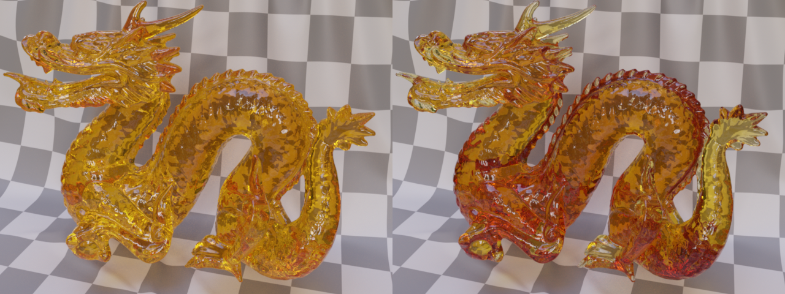

# KHR_materials_volume

## Contributors

* TODO: Name, affiliation, and contact info for each contributor

## Status

Draft

## Dependencies

Written against the glTF 2.0 spec. Needs to be combined with `KHR_materials_transmission` or `KHR_materials_translucency`.

## Exclusions

* This extension must not be used on a material that also uses `KHR_materials_pbrSpecularGlossiness`.
* This extension must not be used on a material that also uses `KHR_materials_unlit`.

## Table of Contents

- [Overview](#overview)
- [Extending Materials](#extending-materials)
- [Properties](#properties)
- [Thickness Texture](#thickness-texture)
- [Refraction](#refraction)
- [Absorption and Subsurface Scattering](#absorption-and-subsurface-scattering)
- [Phase Function](#phase-function)
- [Base Color and Absorption](#base-color-and-absorption)
- [Transmission and Translucency](#transmission-and-translucency)
- [Implementation](#implementation)
- [Reference](#reference)
- [Appendix: Full Khronos Copyright Statement](#appendix-full-khronos-copyright-statement)

## Overview

By default, a glTF 2.0 material describes the scattering properties of a surface enclosing an infinitely thin volume. The surface defined by the mesh represents a thin wall. The volume extension makes it possible to turn the surface into an interface between volumes. The mesh to which the material is attached defines the boundaries of an homogeneous medium and therefore must be manifold. Volumes provide effects like refraction, absorption and subsurface scattering. 

<figure style="text-align:center">
<br/>

<figcaption><em>Renderings of various objects (top) and corresponding top-down slice through the scene (bottom). The solid line represents the mesh. The gray area represents the volume. Thin-walled materials can be applied to open (left) and closed meshes (middle). The dashed line indicates the imaginary bounds of the infinitely thin volume. The volumetric material can only be applied to closed meshes (right), resulting in volumetric effects like refraction.</em></figcaption>
</figure>

The volume extension has to be combined with `KHR_materials_transmission` or `KHR_materials_translucency`. Light that falls onto the volume boundary may enter the volume, depending on the transmission or translucency of the surface's BSDF. Inside the volume, light might be absorbed or scattered by particles in the medium, and eventually hit some surface from inside the volume. It can be a different surface and will most probably be a different point in space compared to the entrance point. At this exit point, if the material properties allow, light may leave the volume.

<figure style="text-align:center">

<figcaption><em>Interaction of light rays inside the volume and at the boundaries. The volume is homogeneous and has an index of refraction of 1.5.</figcaption>
</em></figure>

When light interacts with the surface, it is reflected or refracted at microfacets, taking the roughness of the material into account. The index of refraction is taken from `KHR_materials_ior`.

## Extending Materials

The volumetric properties are defined by adding the `KHR_materials_volume` extension to any glTF material. A non-zero thickness switches from thin-walled to volumetric behavior. This requires a manifold/closed mesh. The properties of the medium are not texturable, it is assumed to be homogeneous.

```json
materials: [
    {
        "extensions": {
            "KHR_materials_volume": {
                "thicknessFactor": 1.0,
                "attenuationDistance":  0.006,
                "attenuationColor": [ 0.5, 0.5, 0.5 ],
                "subsurfaceColor": [ 0.572, 0.227, 0.075 ]
            }
        }
    }
]
```

## Properties

The extension defines the following parameters to describe the volume.

| | Type | Description | Required |
|-|------|-------------|----------|
| **thicknessFactor** | `number` | The thickness of the volume beneath the surface in meters in the local coordinate system of the node. If the value is 0 the material is thin-walled. Otherwise the material is a volume boundary. | No, default: `0`. |
| **thicknessTexture** | `textureInfo` | A texture that defines the thickness, stored in the G channel. This will be multiplied by `thicknessFactor`. | No |
| **attenuationDistance** | `number` | Density of the medium given as the average distance in meters that light travels in the medium before interacting with a particle. | No, default: +Infinity |
| **attenuationColor** | `number[3]` | The color that white light turns into due to absorption when reaching the attenuation distance. | No, default: `[1, 1, 1]` |
| **subsurfaceColor** | `number[3]` | The overall color perceived at the surface due to subsurface scattering. | No, default: `[0, 0, 0]` |

## Thickness Texture

The thickness of a volume enclosed by the mesh is typically quite difficult to compute at run-time in a rasterizer. Since glTF is primarily used with real-time rasterizers, this extension allows for the thickness of the volume to be explicitly defined, either via a 1-channel texture value or as a constant. However, deriving the thickness along a ray from the actual geometry is the preferred approach. Path-traced renderers as well as more sophisticated raster techniques should ignore the thickness texture. Note that it is still necessary to check the `thicknessFactor` to determine whether the object is thin-walled or volumetric.

## Refraction

Light rays falling through the volume boundary are refracted according to the index of refraction given in `KHR_materials_ior`. The index of refraction determines the refraction angle. If `KHR_materials_ior` is not available, the index of refraction is 1.5.

<figure style="text-align:center">

<figcaption><em>Transmissive sphere with varying index of refraction. From left to right: 1.1, 1.5, 1.9.</em></figcaption>
</figure>

## Absorption and Subsurface Scattering

Absorption and subsurface scattering are described by the absorption coefficient σ<sub>a</sub> and the scattering coefficient σ<sub>s</sub>. The coefficients σ<sub>a</sub> and σ<sub>s</sub> are wavelength-dependent values in the range [0, Inf]. Such an infinite range makes them hard to be controlled by users.

To provide convenient parameterization for users this extension derives the physical parameters from three user-friendly parameters: attenuation color a, attenuation distance d and subsurface color ρ<sub>ms</sub>.

In a first step, we map from attenuation color and distance to the attenuation coefficient σ<sub>t</sub>.

σ<sub>t</sub> = -log(a) / d

In a homogenous medium, σ<sub>t</sub> is constant, and we can compute the fraction of light (radiance) T(x) transmitted after traveling a distance x via Beer's law:

T(x) = e<sup>-σ<sub>t</sub>x</sup>

The inverse of attenuation coefficient 1 / σ<sub>t</sub> is the mean free path length which gives the average distance light travels in the medium before interacting with a particle. At such an interaction, light may be absorbed or scattered. In our case, we define σ<sub>t</sub> via color and distance separately, so after traveling a distance x = d, we get the attenuation color a:

T(d) = e<sup>(-log(a) / d) * d</sup> = a

In the next step, we map from our subsurface color parameter ρ<sub>ms</sub> to single-scattering albedo ρ<sub>ss</sub>.

ρ<sub>ss</sub> = 1 - (4.09712 + 4.20863 ρ<sub>ms</sub> - sqrt(9.59217 + 41.6808 ρ<sub>ms</sub> + 17.7126 ρ<sub>ms</sub><sup>2</sup>))<sup>2</sup>

The single-scattering albedo is the color at each particle in the medium. Light that is scattered by a particle will be tinted with this color. Note that scattering will happen many times in the medium until the light leaves the volume, so the overall color ρ<sub>ms</sub> will differ significantly from the albedo of the particles ρ<sub>ss</sub>. Via the mapping users can control the albedo of surface, i.e., the color that an object appears to have in the final rendering. The mapping was introduced by [Kulla and Conty (2017)](#KullaConty2017).

Now that we have computed σ<sub>t</sub> and ρ<sub>ss</sub>, we can finally derive σ<sub>a</sub> and σ<sub>s</sub> as follows:

σ<sub>a</sub> = σ<sub>t</sub> (1 - ρ<sub>ss</sub>)

σ<sub>s</sub> = σ<sub>t</sub> ρ<sub>ss</sub> = σ<sub>t</sub> - σ<sub>a</sub>

<figure style="text-align:center">

<figcaption><em>A simple, diffuse-only material (left) and a material that makes use of subsurface scattering (right). The base color of the diffuse material is set to the same color as the subsurface color of the subsurface scattering material. Due to the albedo mapping the final color of the object is very similar.</em></figcaption>
</figure>

## Phase Function

The phase function p used for scattering inside the medium is isotropic. For any pair of incident and outgoing directions k<sub>1</sub> and k<sub>2</sub>, p(k<sub>1</sub>, k<sub>2</sub>) = 1 / (4π).

## Base Color and Absorption

Base color and absorption both have an effect on the final color of a volumetric object, but the behavior is different. Base color changes the color of light at the volume boundary. Absorption occurs while the light is traveling through the volume. Depending on the distance the light travels, more or less of it is absorbed, making the overall color of the object dependent on its shape.

<figure style="text-align:center">

<figcaption><em>Base color changes the amount of light passing through the volume boundary (left). The overall color of the object is the same everywhere, as if the object is covered with a colored, transparent foil. Absorption changes the amount of light traveling through the volume (right). The overall color depends on the distance the light traveled through it; at small distances (tail of the dragon) less light is absorbed and the color is brighter than at large distances.</em></figcaption>
</figure>

## Transmission and Translucency

The volume extension needs one of `KHR_materials_transmission` and `KHR_materials_translucency` to allow light rays to pass through the surface into the volume. Once the volume is entered however, the simulation of absorption and subsurface scattering inside the medium will be independent of the surface properties.

If the extension is combined with `KHR_materials_transmission`, the refraction occurs at the microfacets. That means that the thin microfacet BTDF is replaced by a microfacet BTDF that takes refraction into account. The roughness parameter affects both reflection and transmission.

<figure style="text-align:center">

<figcaption><em>Transmissive sphere with varying roughness. From left to right: 0.0, 0.2, 0.4.</em></figcaption>
</figure>

If the extension is combined with `KHR_materials_translucency`, the translucent BTDF remains unchanged.

<figure style="text-align:center">

<figcaption><em>Translucent sphere with varying roughness. From left to right: 0.0, 0.2, 0.4.</em></figcaption>
</figure>

For best results, we recommend using translucency in case the medium exhibits strong subsurface scattering (small scattering distance, high subsurface color). Real-time implementations may use translucency as a cue to switch to approximations for subsurface scattering that work well for materials like skin or candle wax. For these dense materials, the visual difference between transmission and translucency is small, as the path a light travels is dominated by volume scattering. The scattering interaction at the volume boundary has only a small effect on the final result. In some cases it might even be possible to fake subsurface scattering with translucency and a thin-walled material.

<figure style="text-align:center">

<figcaption><em>Comparison of combining subsurface scattering with either transmission or translucency. Left: Rough transmission and subsurface scattering. Middle: Translucency and subsurface scattering. Right: Translucency without subsurface scattering using a thin-walled material. Colors are adjusted manually so that they look similar in the three configurations. This adjustment is needed in order to account for differences in distances and to minimize the impact of energy loss from the rough microfacet BTDF.</em></figcaption>
</figure>

## Implementation

*This section is non-normative.*

The microfacet BTDF f<sub>transmission</sub> defined in `KHR_materials_transmission` now takes refraction into account.

```
                  abs(LdotH) * abs(VdotH)                 ior_o^2 * G * D
f_transmission = ------------------------- * ----------------------------------------
                  abs(LdotN) * abs(VdotN)      (ior_i * VdotH + ior_o * LdotH)^2

```

`ior_i` and `ior_o` denote the index of refraction of the incident and transmitted side of the surface, respectively. `V` is the vector pointing to the camera, `L` points to the light. In a path tracer that starts rays at the camera, `V` corresponds to the incident side of the surface, which is the side of the medium  with `ior_i`. See [Walter et al. (2007)](#Walter2007) for more details.

Using Snell's law, the half vector is computed as follows:

```
H = -normalize(ior_i * VdotH + ior_o * LdotN)
```

Incident and transmitted index of refraction have to be correctly set by the renderer, depending on whether light enters or leaves the object. An algorithm for tracking the IOR through overlapping objects is described by in [Schmidt and Budge (2002)](#SchmidtBudge2002).

## Schema

- [glTF.KHR_materials_volume.schema.json](schema/glTF.KHR_materials_volume.schema.json)

## References

* [Kulla C., Conty A. (2017): Revisiting Physically Based Shading at Imageworks](https://blog.selfshadow.com/publications/s2017-shading-course/imageworks/s2017_pbs_imageworks_slides_v2.pdf)<a name="KullaConty2017"></a>
* [Walter B., Marschner S., Li H., Torrance K. (2007): Microfacet Models for Refraction through Rough Surfaces](https://www.cs.cornell.edu/~srm/publications/EGSR07-btdf.pdf)<a name="Walter2007"></a>
* [Schmidt C., Budge B. (2002): Simple Nested Dielectrics in Ray Traced Images](https://www.researchgate.net/profile/Brian_Budge/publication/247523037_Simple_Nested_Dielectrics_in_Ray_Traced_Images/links/00b7d52e001e1b88a3000000/Simple-Nested-Dielectrics-in-Ray-Traced-Images.pdf)<a name="SchmidtBudge2002"></a>

## Appendix: Full Khronos Copyright Statement

Copyright 2018-2020 The Khronos Group Inc.

Some parts of this Specification are purely informative and do not define requirements
necessary for compliance and so are outside the Scope of this Specification. These
parts of the Specification are marked as being non-normative, or identified as
**Implementation Notes**.

Where this Specification includes normative references to external documents, only the
specifically identified sections and functionality of those external documents are in
Scope. Requirements defined by external documents not created by Khronos may contain
contributions from non-members of Khronos not covered by the Khronos Intellectual
Property Rights Policy.

This specification is protected by copyright laws and contains material proprietary
to Khronos. Except as described by these terms, it or any components
may not be reproduced, republished, distributed, transmitted, displayed, broadcast
or otherwise exploited in any manner without the express prior written permission
of Khronos.

This specification has been created under the Khronos Intellectual Property Rights
Policy, which is Attachment A of the Khronos Group Membership Agreement available at
www.khronos.org/files/member_agreement.pdf. Khronos grants a conditional
copyright license to use and reproduce the unmodified specification for any purpose,
without fee or royalty, EXCEPT no licenses to any patent, trademark or other
intellectual property rights are granted under these terms. Parties desiring to
implement the specification and make use of Khronos trademarks in relation to that
implementation, and receive reciprocal patent license protection under the Khronos
IP Policy must become Adopters and confirm the implementation as conformant under
the process defined by Khronos for this specification;
see https://www.khronos.org/adopters.

Khronos makes no, and expressly disclaims any, representations or warranties,
express or implied, regarding this specification, including, without limitation:
merchantability, fitness for a particular purpose, non-infringement of any
intellectual property, correctness, accuracy, completeness, timeliness, and
reliability. Under no circumstances will Khronos, or any of its Promoters,
Contributors or Members, or their respective partners, officers, directors,
employees, agents or representatives be liable for any damages, whether direct,
indirect, special or consequential damages for lost revenues, lost profits, or
otherwise, arising from or in connection with these materials.

Vulkan is a registered trademark and Khronos, OpenXR, SPIR, SPIR-V, SYCL, WebGL,
WebCL, OpenVX, OpenVG, EGL, COLLADA, glTF, NNEF, OpenKODE, OpenKCAM, StreamInput,
OpenWF, OpenSL ES, OpenMAX, OpenMAX AL, OpenMAX IL, OpenMAX DL, OpenML and DevU are
trademarks of The Khronos Group Inc. ASTC is a trademark of ARM Holdings PLC,
OpenCL is a trademark of Apple Inc. and OpenGL and OpenML are registered trademarks
and the OpenGL ES and OpenGL SC logos are trademarks of Silicon Graphics
International used under license by Khronos. All other product names, trademarks,
and/or company names are used solely for identification and belong to their
respective owners.
