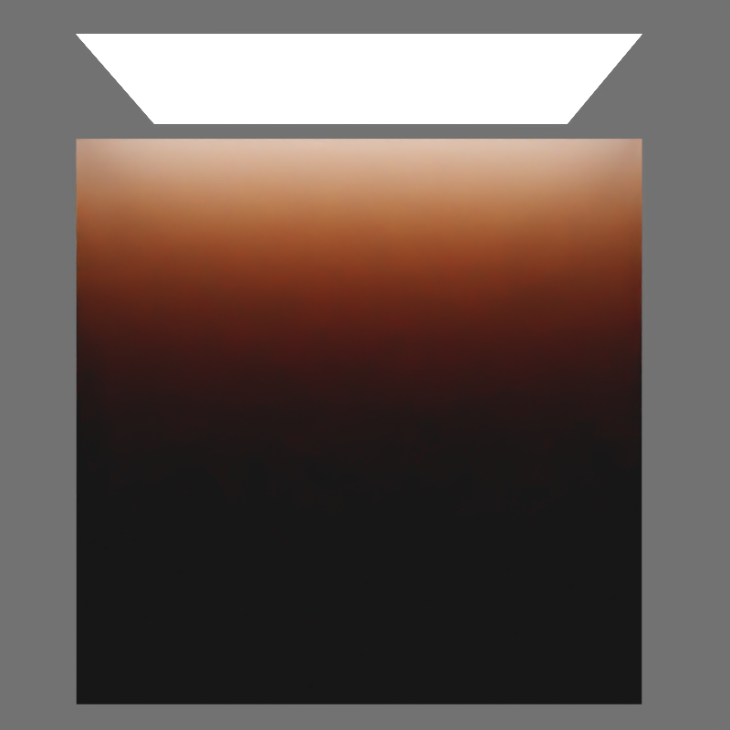
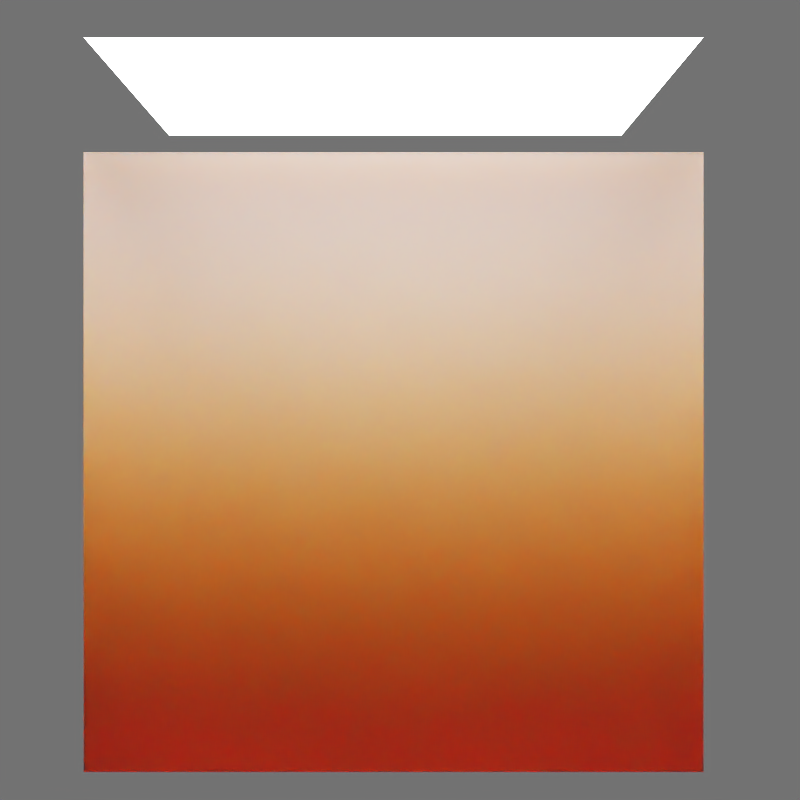

# KHR_materials_volume_scatter
## Contributors

* TODO: Name, affiliation, and contact info for each contributor

## Status

Draft

## Dependencies

Written against the glTF 2.0 spec. Needs to be combined with `KHR_materials_volume`

## Exclusions

* This extension must not be used on a material that also uses `KHR_materials_pbrSpecularGlossiness`.
* This extension must not be used on a material that also uses `KHR_materials_unlit`.

## Table of Contents

- [Overview](#overview)
- [Extending Materials](#extending-materials)
- [Properties](#properties)
- [Scattering](#scattering)
    - [Attenuation](#attenuation)
    - [Single-Scatter Albedo](#single-scatter-albedo)
    - [Multi-Scatter Albedo](#multi-scatter-albedo)
    - [Phase Function](#phase-function)
- [Scattering & (Diffuse-)Transmission](#scattering--diffuse-transmission)
- [Schema](#schema)
- [References](#references)
- [Appendix: Full Khronos Copyright Statement](#appendix-full-khronos-copyright-statement)

## Overview

`KHR_materials_volume` defines surfaces as interfaces between volumes and provides tools for specifying attenuation via absorption in homogeneous volumes, but it lacks a definition for scattering. Scattering refers to the wavelength-dependent redirection of light upon particle interaction, while absorption is the wavelength-dependent reduction of light energy along a path. This extension builds on the definitions in `KHR_materials_volume`.

<figure style="text-align:center">

<figcaption><em>Interaction of light rays inside the volume and at the boundaries. E.g. a homogeneous volume with an index of refraction of 1.5.</figcaption>
</em></figure>

## Extending Materials
The scattering properties are defined by adding the `KHR_materials_volume_scatter` extension to any glTF material that also uses `KHR_materials_volume`.

```json
"materials": [
    {
        "extensions": {
            "KHR_materials_volume_scatter": {
                "scatterAlbedo": [ 0.572, 0.227, 0.075 ],
                "scatterAnisotropy": 0.3
            },
            "KHR_materials_volume": {
                "attenuationColor": [0.9, 0.9, 0.9],
                "attenuationDistance": 0.01
            },
            "KHR_materials_transmission": {
                "transmissionFactor": 1.0,
            }
        }
    }
]
```

## Properties

The extension defines the following parameters to describe the scattering behavior.

|                       | Type        | Description                                         | Required                 |
|-----------------------|-------------|-----------------------------------------------------|--------------------------|
| **scatterAlbedo**      | `number[3]` | The multi-scatter albedo.                           | No, default: `[0, 0, 0]` |
| **scatterAnisotropy** | `number`    | The anisotropy of scatter events. Range is (-1, 1). | No, default: `0`         |

## Scattering

### Attenuation
`KHR_materials_volume` defines the attenuation coefficient as a sum of absorption and scattering coefficients:
$\sigma_t = \sigma_a + \sigma_s.$ It further notes that attenuation from scattering events is ignored by assuming $\sigma_s$ to be zero. Combining `KHR_materials_volume_scatter` with `KHR_materials_volume` lifts this restriction on the scattering part.

The two derived parameters attenuation color $c$ and attenuation distance $d$ that relate to the attenuation coefficient as

$$
\sigma_t = \frac{-log(c)}{d}
$$

now not only consider absorption but also scattering events. The same applies to the definition of the volume transmittance

$$
T(x) = e^{-\sigma_t x}.
$$

Instead of only taking into account absorption, $T$ now corresponds to a change in radiance along a path of length $x$ as light travels through a medium with **absorbing and scattering** particles.

### Single-Scatter Albedo
Where the parameterization of `KHR_materials_volume` provides control on the density of a medium that absorbs and scatters, `KHR_materials_volume_scatter` provides control on just the scattering part of the medium interaction.

The ratio of scattering to total attenuation is given as single-scatter albedo $\rho_{ss}$

$$
\rho_{ss} =  \frac{\sigma_s}{\sigma_t}.
$$

Rendering algorithms that implement volumetric scattering are usually interested in the scattering coefficient.
Given $\rho_{ss}$ and $\sigma_t$ the scattering coefficient is

$$
\sigma_s = \sigma_t  \rho_{ss} = \sigma_t - \sigma_a,
$$

and for completeness, the absorption coefficient:

$$
\sigma_a = \sigma_t (1 - \rho_{ss}).
$$


### Multi-Scatter Albedo
The single-scatter albedo could be used to parameterize scattering directly, but it has its drawbacks.
In reality, light scatters multiple times in the medium until it leaves the volume. Depending on the number of bounces, the overall perceived color of the medium differs drastically from what is given by the single-scatter albedo.

[Kulla and Conty (2017)](#KullaConty2017) use an alternative, more intuitive term, the multi-scatter albedo $\rho_{ms}$. Assuming commonly used values for scatter distances, it is a good approximation to the perceived color of an object after many bounces. $\rho_{ss}$ can be calculated from $\rho_{ms}$ as follows

$$
\rho_{ss} = 1 - (4.09712 + 4.20863 \rho_{ms} - \sqrt{9.59217 + 41.6808 \rho_{ms} + 17.7126 \rho_{ms}^2})^2
$$

<figure style="text-align:center">

<figcaption><em>A simple, diffuse-only material (left) and a material that uses dense volume scattering (right). The base color of the diffuse material is set to the same color as the scatter color of the scattering material. Due to the multi-scatter albedo mapping the final color of the object is very similar.</em></figcaption>
</figure>

### Phase Function

For a single scattering event, the phase function $p(\mathbf{v},\mathbf{l})$ determines the probability density of outgoing directions $\mathbf{l}$ given an incident direction $\mathbf{v}$ at a scattering event. We use the phase function developed by [Henyey-Greenstein](#HenyeyGreenstein). It is controlled by a single parameter  g in the range [−1,1], the `scatterAnisotropy` parameter.

$$
p(\mathbf{v},\mathbf{l}; g) = \frac{1}{4 \pi} \frac{1-g^2}{(1+g^2+2g(\mathbf{v} \cdot \mathbf{l}))^{3/2}}
$$

For any pair of incident and outgoing directions $\mathbf{v}$ and $\mathbf{l}$.

<table>
  <tr>
    <td></td>
    <td></td>
    <td></td>
  </tr>
  <tr>
    <td align="center">g = -0.95</td>
    <td align="center">g = 0.0</td>
    <td align="center">g = 0.95</td>
  </tr>
  <tr>
    <td colspan="3" align="center">
      <em>Top-lit, dense scattering medium for different scatter anisotropy values.</em>
    </td>
  </tr>
</table>

## Scattering & (Diffuse-)Transmission

For dense subsurface scattering materials like skin or wax (where the scattering coefficient $\sigma_s$​ is high), it is recommended to use `KHR_materials_diffuse_transmission` over `KHR_materials_transmission`. In such cases, the visual difference between diffuse and regular transmission is minimal, as volume scattering primarily determines the appearance, with boundary interactions having a small effect.

Using diffuse transmission signals the renderer that the material is dense, eliminating the need to analyze geometry and scattering distance. For instance, a small object with low scattering might appear transparent, but a larger one would appear denser at the same scattering coefficient. Diffuse transmission also enables a translucent look regardless of object size.

This cue allows renderers to use diffusion approximation rather than random walk subsurface scattering, producing near-ground-truth results for dense materials with greater efficiency, essential for both real-time and offline rendering. [Christensen and Burley (2015)](#ChristensenBurley2015) demonstrate the mapping of physical parameters to diffusion-based reflectance profiles, while [Jimenez et al. (2015)](#Jimenez2015) introduce a real-time method using a separable kernel for reflectance profile rendering.

<figure style="text-align:center">

<figcaption><em>Comparison of combining denes volume scattering with either transmission or diffuse transmission. Left: Rough transmission and scattering. Middle: Diffuse transmission and scattering. Right: Diffuse transmission without scattering using a thin-walled material. Colors have been adjusted manually in order to account for differences in distances and to minimize the impact of energy loss from the rough microfacet BTDF.</em></figcaption>
</figure>

## Schema

- [glTF.KHR_materials_subsurface.schema.json](schema/glTF.KHR_materials_subsurface.schema.json)

## References

* [Christensen, P. and B. Burley (2015): Approximate Reflectance Profiles for Efficient Subsurface Scattering](https://graphics.pixar.com/library/ApproxBSSRDF/paper.pdf)<a name="ChristensenBurley2015"></a>
* [Louis G. Henyey and Jesse L. Greenstein: Diffuse radiation in the galaxy. Astrophysical Journal 93, 70–83, 1941.](https://ui.adsabs.harvard.edu/abs/1941ApJ....93...70H/abstract)<a name="HenyeyGreenstein"></a>
* [Jimenez J., K. Zsolnai, A. Jarabo, C. Freude, T. Auzinger, X.-C. Wu, J. Pahlen, M. Wimmer and D. Gutierrez (2015): Separable Subsurface Scattering](http://www.iryoku.com/separable-sss/)<a name="Jimenez2015"></a>
* [Kulla C., Conty A. (2017): Revisiting Physically Based Shading at Imageworks](https://blog.selfshadow.com/publications/s2017-shading-course/imageworks/s2017_pbs_imageworks_slides_v2.pdf)<a name="KullaConty2017"></a>


## Appendix: Full Khronos Copyright Statement

Copyright 2018-2020 The Khronos Group Inc.

Some parts of this Specification are purely informative and do not define requirements
necessary for compliance and so are outside the Scope of this Specification. These
parts of the Specification are marked as being non-normative, or identified as
**Implementation Notes**.

Where this Specification includes normative references to external documents, only the
specifically identified sections and functionality of those external documents are in
Scope. Requirements defined by external documents not created by Khronos may contain
contributions from non-members of Khronos not covered by the Khronos Intellectual
Property Rights Policy.

This specification is protected by copyright laws and contains material proprietary
to Khronos. Except as described by these terms, it or any components
may not be reproduced, republished, distributed, transmitted, displayed, broadcast
or otherwise exploited in any manner without the express prior written permission
of Khronos.

This specification has been created under the Khronos Intellectual Property Rights
Policy, which is Attachment A of the Khronos Group Membership Agreement available at
www.khronos.org/files/member_agreement.pdf. Khronos grants a conditional
copyright license to use and reproduce the unmodified specification for any purpose,
without fee or royalty, EXCEPT no licenses to any patent, trademark or other
intellectual property rights are granted under these terms. Parties desiring to
implement the specification and make use of Khronos trademarks in relation to that
implementation, and receive reciprocal patent license protection under the Khronos
IP Policy must become Adopters and confirm the implementation as conformant under
the process defined by Khronos for this specification;
see https://www.khronos.org/adopters.

Khronos makes no, and expressly disclaims any, representations or warranties,
express or implied, regarding this specification, including, without limitation:
merchantability, fitness for a particular purpose, non-infringement of any
intellectual property, correctness, accuracy, completeness, timeliness, and
reliability. Under no circumstances will Khronos, or any of its Promoters,
Contributors or Members, or their respective partners, officers, directors,
employees, agents or representatives be liable for any damages, whether direct,
indirect, special or consequential damages for lost revenues, lost profits, or
otherwise, arising from or in connection with these materials.

Vulkan is a registered trademark and Khronos, OpenXR, SPIR, SPIR-V, SYCL, WebGL,
WebCL, OpenVX, OpenVG, EGL, COLLADA, glTF, NNEF, OpenKODE, OpenKCAM, StreamInput,
OpenWF, OpenSL ES, OpenMAX, OpenMAX AL, OpenMAX IL, OpenMAX DL, OpenML and DevU are
trademarks of The Khronos Group Inc. ASTC is a trademark of ARM Holdings PLC,
OpenCL is a trademark of Apple Inc. and OpenGL and OpenML are registered trademarks
and the OpenGL ES and OpenGL SC logos are trademarks of Silicon Graphics
International used under license by Khronos. All other product names, trademarks,
and/or company names are used solely for identification and belong to their
respective owners.
