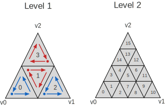

<!--
Copyright 2018-2026 The Khronos Group Inc.
SPDX-License-Identifier: LicenseRef-KhronosSpecCopyright
-->

# KHR\_mesh\_opacity\_micromap

## Contributors

- Christoph Kubisch, NVIDIA, [@pixeljetstream](https://github.com/pixeljetstream)
- Nia Bickford, NVIDIA, [@NBickford-NV](https://github.com/NBickford-NV)
- Arseny Kapoulkine, Independent, [@zeuxcg](https://zeux.io/)
- Pyarelal Knowles, NVIDIA, [pknowlesnv](https://github.com/pknowlesnv)

Copyright 2018-2026 The Khronos Group Inc. All Rights Reserved. glTF is a trademark of The Khronos Group Inc.
See [Appendix](#appendix-full-khronos-copyright-statement) for full Khronos Copyright Statement.

## Status

Draft

## Dependencies

Written against the glTF 2.0 spec.

## Overview

This extension stores **pre-build source data** for opacity micromaps in a glTF asset. It does **not** store serialized micromap acceleration structures produced by a graphics API after build. An opacity micromap compactly encodes per-microtriangle opacity for each base triangle in a mesh. The on-disk representation defined here is layout-compatible with the build inputs of Vulkan `VK_KHR_opacity_micromap` and DirectX 12 `D3D12_RAYTRACING_TIER_1_2` opacity micromaps, so content can be baked once and uploaded when building opacity micromaps and bottom-level ray-tracing acceleration structures.

The extension defines:

1. A root-level `micromaps` array describing micromap build inputs (`data`, `triangles`, and usage summary arrays), compatible with `VkAccelerationStructureGeometryMicromapDataKHR` and `D3D12_RAYTRACING_OPACITY_MICROMAP_ARRAY_DESC`.
2. A per-`mesh.primitive` extension describing how geometry triangles map into a micromap (`micromap`, `micromapIndices`, optional `micromapBaseTriangle`), compatible with `VkAccelerationStructureTrianglesOpacityMicromapKHR` and `D3D12_RAYTRACING_GEOMETRY_OMM_LINKAGE_DESC`.

This extension normatively defines glTF JSON structure and stored buffer layouts. Runtime micromap build options, device limits, and ray-traversal behavior are out of scope and are defined by the target graphics API.

## Extending the glTF root

The glTF root object **MAY** define `extensions.KHR_mesh_opacity_micromap` with a `micromaps` array.

```json
{
  "extensions": {
    "KHR_mesh_opacity_micromap": {
      "micromaps": [
        {
          "data": 0,
          "triangles": 1,
          "usageCounts": [32, 12],
          "usageLevels": [8, 5],
          "usageFormats": [1, 1]
        }
      ]
    }
  }
}
```

Each element of `micromaps` describes one opacity micromap's pre-build source inputs (`data`, `triangles`, and usage summary arrays).

### Properties (`micromaps[]`)

| Property | Type | Description | Required |
|----------|------|-------------|----------|
| **data** | `integer` | Index of the `bufferView` containing packed opacity micromap bits. | Yes |
| **triangles** | `integer` | Index of the `bufferView` containing [micromap triangle records](#micromap-triangle-records). | Yes |
| **usageCounts** | `integer[]` | Number of micromap triangles per `(subdivisionLevel, format)` bucket. Parallel to `usageLevels` and `usageFormats`. | Yes |
| **usageLevels** | `integer[]` | Subdivision level per bucket. Parallel to `usageCounts` and `usageFormats`. | Yes |
| **usageFormats** | `integer[]` | Opacity format per bucket (`1` or `2`). Parallel to `usageCounts` and `usageLevels`. | Yes |

### Validity (root `micromaps[]`)

For each micromap object to be valid, the following **MUST** hold:

- `usageCounts`, `usageLevels`, and `usageFormats` **MUST** have equal length.
- Every `usageFormats[i]` **MUST** be `1` or `2`.
- Every `usageCounts[i]` **MUST** be greater than or equal to `1`.
- Every `usageLevels[i]` **MUST** be greater than or equal to `0`.
- Multiple entries with the same `(usageLevels[i], usageFormats[i])` **MAY** appear; validators **MUST** treat the effective count for each distinct pair as the sum of matching `usageCounts` values.
- The sum of all effective `usageCounts` values **MUST** equal the number of 8-byte records in the referenced `triangles` `bufferView` (see [Micromap triangle records](#micromap-triangle-records)).
- For each micromap triangle record, `dataOffset` and the record's `subdivisionLevel` and `format` **MUST** describe a region within the `data` `bufferView` that satisfies [bit packing rules](#bit-packing-in-data), and regions **MUST NOT** overlap.
- Referenced `bufferView` indices **MUST** be valid glTF `bufferView` indices.

The `triangles` `bufferView` **MUST** contain a tightly packed array of micromap triangle records. If `bufferView.byteStride` is omitted, it **MUST** be treated as `8`. If `byteStride` is present, it **MUST** be greater than or equal to `8` and a multiple of `4`.

## Extending mesh primitives

Each `mesh.primitive` **MAY** define `extensions.KHR_mesh_opacity_micromap`.

```json
{
  "meshes": [
    {
      "primitives": [
        {
          "attributes": { "POSITION": 0 },
          "indices": 1,
          "mode": 4,
          "extensions": {
            "KHR_mesh_opacity_micromap": {
              "micromap": 0,
              "micromapIndices": 2,
              "micromapBaseTriangle": 0
            }
          }
        }
      ]
    }
  ]
}
```

### Properties

| Property | Type | Description | Required |
|----------|------|-------------|----------|
| **micromap** | `integer` | Index into root `extensions.KHR_mesh_opacity_micromap.micromaps`. | Yes |
| **micromapIndices** | `integer` | Accessor index for per-geometry-triangle micromap lookup values. | No |
| **micromapBaseTriangle** | `integer` | Offset added to each non-special lookup value. Default: `0`. | No |

See [Per-primitive micromap indices](#per-primitive-micromap-indices) for accessor and lookup rules.

## Opacity micromap encoding

This section defines the stored pre-build micromap representation referenced by root `micromaps` objects. It does not define post-build serialized micromap acceleration structure contents.

### Subdivision levels

For subdivision level \(L\), a base triangle is subdivided into \(4^L\) microtriangles.

Each micromap triangle record specifies its own subdivision level and format. The `usageCounts`, `usageLevels`, and `usageFormats` arrays summarize how many micromap triangles exist for each `(subdivisionLevel, format)` pair in a micromap.

### Microtriangle ordering

Microtriangle indices within a micromap triangle **MUST** use the recursive space-filling curve ordering illustrated in [Appendix A](#appendix-a-microtriangle-indexing). Authoring tools **MUST** encode `data` bits in that linear index order.

At runtime, graphics APIs map intersection barycentrics to a microtriangle index using the same ordering.

### Formats and state values

`usageFormats` values and micromap triangle record `format` fields **MUST** be one of:

| Value | Meaning |
|------:|---------|
| `1` | Two-state format: one bit per microtriangle (opaque or transparent). |
| `2` | Four-state format: two bits per microtriangle. |

For four-state data, each two-bit microtriangle value **MUST** be one of:

| Value | Meaning |
|------:|---------|
| `0` | Transparent |
| `1` | Opaque |
| `2` | Unknown transparent |
| `3` | Unknown opaque |

For two-state data, each one-bit microtriangle value **MUST** be interpreted as:

| Value | Meaning |
|------:|---------|
| `0` | Transparent |
| `1` | Opaque |

How these stored values affect ray traversal is defined by the target graphics API and is not specified by this extension.

### Bit packing in `data`

The `data` `bufferView` contains packed microtriangle state bits for all micromap triangles.

- Two-state (`format` `1`) data **MUST** use one bit per microtriangle.
- Four-state (`format` `2`) data **MUST** use two bits per microtriangle.
- Bits **MUST** be packed from least significant bit to most significant bit within each byte.
- For a micromap triangle with subdivision level \(L\) and format \(F\), the number of bytes required at `dataOffset` **MUST** be:

\[
\left\lceil \frac{4^L \cdot b}{8} \right\rceil
\]

where \(b\) is `1` for format `1` and `2` for format `2`.

Unused bits in the final byte of a micromap triangle's region **MUST** be ignored.

### Micromap triangle records

Each element of the `triangles` `bufferView` **MUST** be an 8-byte record with the following layout:

| Offset (bytes) | Type | Field |
|---------------:|------|-------|
| `0` | `uint32` | `dataOffset` |
| `4` | `uint16` | `subdivisionLevel` |
| `6` | `uint16` | `format` |

- `dataOffset` **MUST** be a byte offset relative to the start of the `data` `bufferView`.
- `subdivisionLevel` **MUST** be greater than or equal to `0`.
- `format` **MUST** be `1` or `2`.

The number of records in `triangles` **MUST** equal the sum of all `usageCounts` values for that micromap.

This record layout is compatible with `VkMicromapTriangleKHR` in Vulkan `VK_KHR_opacity_micromap` and `D3D12_RAYTRACING_OPACITY_MICROMAP_DESC` in DirectX 12 when consumed as micromap build input.

## Per-primitive micromap indices

Primitives using this extension **MUST** have `mode` `TRIANGLES` (`4`).

The extension `micromapIndices` accessor is separate from the geometry `indices` accessor. It stores one lookup value per geometry triangle.
If provided, the accessor **MUST** have a `count` equal to the primitive's triangle count and element `t` of the `micromapIndices` accessor **MUST** correspond to geometry triangle `t`.

### Lookup resolution

For geometry triangle `t`, let `v` be the accessor value at element `t`. If no accessor is provided `v` equals `t`.

- If `v` is a [special index](#special-indices), no micromap triangle fetch is performed.
- Otherwise, the micromap triangle index **MUST** be computed as `v + micromapBaseTriangle` and **MUST** reference a record in the micromap's `triangles` array.

This lookup resolution is compatible with `VkAccelerationStructureTrianglesOpacityMicromapKHR` in Vulkan `VK_KHR_opacity_micromap` and `D3D12_RAYTRACING_GEOMETRY_OMM_LINKAGE_DESC` in DirectX 12.

### Special indices

The following signed lookup values **MUST** be supported:

| Signed value | Meaning |
|-------------:|---------|
| `-1` | Fully transparent |
| `-2` | Fully opaque |
| `-3` | Fully unknown transparent |
| `-4` | Fully unknown opaque |

### Encoding in accessors

If `micromapIndices` is provided, the accessor **MUST** have `type` `SCALAR` and `componentType` one of `5121` (`UNSIGNED_BYTE`), `5123` (`UNSIGNED_SHORT`), `5125` (`UNSIGNED_INT`), `5122` (`SHORT`), or `5124` (`INT`).

When `componentType` is `5121` (`UNSIGNED_BYTE`), `5123` (`UNSIGNED_SHORT`), or `5125` (`UNSIGNED_INT`):

- Non-special micromap triangle indices **MUST** be non-negative.
- Special indices **MUST** be stored as the two's-complement bit pattern of the signed value in the accessor's component type (for example, `4294967295` represents `-1` with `UNSIGNED_INT`).

When `componentType` is `5122` (`SHORT`) or `5124` (`INT`):

- Lookup values **MAY** be stored directly as signed integers, including `-1` through `-4`.

## Schema

- [glTF.KHR_mesh_opacity_micromap.schema.json](schema/glTF.KHR_mesh_opacity_micromap.schema.json)
- [mesh.primitive.KHR_mesh_opacity_micromap.schema.json](schema/mesh.primitive.KHR_mesh_opacity_micromap.schema.json)

## Reference

### Normative external references

When mapping stored glTF data to graphics API micromap build inputs, implementations **MUST** preserve compatibility with the field correspondences below.

| glTF | Vulkan (`VK_KHR_opacity_micromap`) | DirectX 12 |
|------|-------------------------------------|------------|
| | `VkMicromapUsageKHR` | `D3D12_RAYTRACING_OPACITY_MICROMAP_HISTOGRAM_ENTRY` |
| `micromaps[].usageCounts[i]` | `count` | `Count` |
| `micromaps[].usageLevels[i]` | `subdivisionLevel` | `SubdivisionLevel` |
| `micromaps[].usageFormats[i]` | `format` | `Format` |
| | | |
| | `VkMicromapTriangleKHR` | `D3D12_RAYTRACING_OPACITY_MICROMAP_DESC` |
| `micromaps[].triangles[t].dataOffset` | `dataOffset` | `ByteOffset` |
| `micromaps[].triangles[t].subdivisionLevel` | `subdivisionLevel` | `SubdivisionLevel` |
| `micromaps[].triangles[t].format` | `format` | `Format` |
| | | |
| global micromap | `VkAccelerationStructureGeometryMicromapDataKHR` | `D3D12_RAYTRACING_OPACITY_MICROMAP_ARRAY_DESC` |
| `micromaps[].data` | `data` | `InputBuffer` |
| `micromaps[].triangles` | `triangleArray` | `PerOmmDescs` |
| `micromaps[].triangles` `bufferView.byteStride` | `triangleArrayStride` | `PerOmmDescs` stride |
| `usageCounts` length | `usageCountsCount` | `NumOmmHistogramEntries` |
| `usageCounts` / `usageLevels` / `usageFormats` | `pUsageCounts` | `pOmmHistogram` |
| | | |
| mesh primitive `KHR_mesh_opacity_micromap` | `VkAccelerationStructureTrianglesOpacityMicromapKHR` | `D3D12_RAYTRACING_GEOMETRY_OMM_LINKAGE_DESC` |
| `micromap` | `micromap` | `OpacityMicromapArray` |
| `micromapIndices` (accessor buffer) | `indexBuffer` | `OpacityMicromapIndexBuffer` |
| `micromapIndices` (`componentType`) | `indexType` | `OpacityMicromapIndexFormat` |
| `micromapIndices` (`byteStride`) | `indexStride` | `OpacityMicromapIndexBuffer` stride |
| `micromapBaseTriangle` | `baseTriangle` | `OpacityMicromapBaseLocation` |

References:

- [Vulkan `VK_KHR_opacity_micromap`](https://registry.khronos.org/vulkan/specs/latest/man/html/VK_KHR_opacity_micromap.html)
- [Microsoft DirectX Raytracing — opacity micromaps](https://microsoft.github.io/DirectX-Specs/d3d/Raytracing.html#opacity-micromaps)

### Informative references

- [Vulkan proposals index](https://docs.vulkan.org/proposals/) — design rationale for opacity micromaps.
- [SPIR-V `SPV_KHR_opacity_micromap`](https://github.khronos.org/SPIRV-Registry/extensions/KHR/SPV_KHR_opacity_micromap.html)
- [NVIDIA Opacity Micromap SDK](https://developer.nvidia.com/rtx/ray-tracing/opacity-micromap)

## Appendix A: Microtriangle indexing

Opacity micromap bits in the `data` buffer are indexed by a hierarchical space-filling curve over recursively subdivided microtriangles.

### Recursive subdivision

A base triangle with vertices `v0`, `v1`, and `v2` is split into four congruent microtriangles by connecting edge midpoints. This split is applied recursively: subdivision level `1` yields `4` microtriangles, and each additional level multiplies the count by `4` (level `L` yields `4^L` microtriangles).

The figure below shows level `1` (left) and level `2` (right). Microtriangle labels `0` … `3` at level `1` and `0` … `15` at level `2` are the linear indices used when packing opacity bits in `data` (least significant bit first within each byte).



In the diagram:

- Each inner triangle is one microtriangle at the shown subdivision level.
- The numbered labels are the linear microtriangle indices at that level.
- The dot in each level-`1` microtriangle marks the entry point of the curve into that sub-triangle.
- Blue arrows show the default vertex winding used when traversing a sub-triangle's children.
- Red arrows show sub-triangles whose child winding is flipped at the next subdivision level.

### Curve traversal order

Within a microtriangle, child sub-triangles are visited in this order:

1. The sub-triangle nearest vertex `v0`.
2. The middle sub-triangle, using flipped child ordering.
3. The sub-triangle nearest vertex `v1`.
4. The sub-triangle nearest vertex `v2`, using flipped child ordering.

This traversal is applied recursively. The resulting linear index is the position of a microtriangle's opacity value in the packed `data` bitstream for that micromap triangle record.

At intersection time, graphics APIs quantize barycentric coordinates \((u, v)\) and map them to the same linear index.

### Reference function

The following function is a reference implementation that maps quantized barycentric coordinates \((u, v)\) inside a base triangle to a microtriangle index for subdivision level `level`, using the recursive splitting order described above. It is reproduced from the Vulkan `VK_KHR_opacity_micromap` specification reference code.

```cpp
uint32_t BarycentricsToSpaceFillingCurveIndex(float u, float v, uint32_t level)
{
    u = clamp(u, 0.0f, 1.0f);
    v = clamp(v, 0.0f, 1.0f);

    uint32_t iu, iv, iw;

    // Quantize barycentric coordinates
    float fu = u * (1u << level);
    float fv = v * (1u << level);

    iu = (uint32_t)fu;
    iv = (uint32_t)fv;

    float uf = fu - float(iu);
    float vf = fv - float(iv);

    if (iu >= (1u << level)) iu = (1u << level) - 1u;
    if (iv >= (1u << level)) iv = (1u << level) - 1u;

    uint32_t iuv = iu + iv;

    if (iuv >= (1u << level))
        iu -= iuv - (1u << level) + 1u;

    iw = ~(iu + iv);

    if (uf + vf >= 1.0f && iuv < (1u << level) - 1u) --iw;

    uint32_t b0 = ~(iu ^ iw);
    b0 &= ((1u << level) - 1u);
    uint32_t t = (iu ^ iv) & b0;

    uint32_t f = t;
    f ^= f >> 1u;
    f ^= f >> 2u;
    f ^= f >> 4u;
    f ^= f >> 8u;
    uint32_t b1 = ((f ^ iu) & ~b0) | t;

    // Interleave bits
    b0 = (b0 | (b0 << 8u)) & 0x00ff00ffu;
    b0 = (b0 | (b0 << 4u)) & 0x0f0f0f0fu;
    b0 = (b0 | (b0 << 2u)) & 0x33333333u;
    b0 = (b0 | (b0 << 1u)) & 0x55555555u;
    b1 = (b1 | (b1 << 8u)) & 0x00ff00ffu;
    b1 = (b1 | (b1 << 4u)) & 0x0f0f0f0fu;
    b1 = (b1 | (b1 << 2u)) & 0x33333333u;
    b1 = (b1 | (b1 << 1u)) & 0x55555555u;

    return b0 | (b1 << 1u);
}
```

## Appendix: Full Khronos Copyright Statement

Copyright 2018-2026 The Khronos Group Inc.

Some parts of this Specification are purely informative and do not define requirements
necessary for compliance and so are outside the Scope of this Specification. These
parts of the Specification are marked as being non-normative, or identified as
**Implementation Notes**.

Where this Specification includes normative references to external documents, only the
specifically identified sections and functionality of those external documents are in
Scope. Requirements defined by external documents not created by Khronos may contain
contributions from non-members of Khronos not covered by the Khronos Intellectual
Property Rights Policy.

This specification is protected by copyright laws and contains material proprietary
to Khronos. Except as described by these terms, it or any components
may not be reproduced, republished, distributed, transmitted, displayed, broadcast
or otherwise exploited in any manner without the express prior written permission
of Khronos.

This specification has been created under the Khronos Intellectual Property Rights
Policy, which is Attachment A of the Khronos Group Membership Agreement available at
www.khronos.org/files/member_agreement.pdf. Khronos grants a conditional
copyright license to use and reproduce the unmodified specification for any purpose,
without fee or royalty, EXCEPT no licenses to any patent, trademark or other
intellectual property rights are granted under these terms. Parties desiring to
implement the specification and make use of Khronos trademarks in relation to that
implementation, and receive reciprocal patent license protection under the Khronos
IP Policy must become Adopters and confirm the implementation as conformant under
the process defined by Khronos for this specification;
see https://www.khronos.org/adopters.

Khronos makes no, and expressly disclaims any, representations or warranties,
express or implied, regarding this specification, including, without limitation:
merchantability, fitness for a particular purpose, non-infringement of any
intellectual property, correctness, accuracy, completeness, timeliness, and
reliability. Under no circumstances will Khronos, or any of its Promoters,
Contributors or Members, or their respective partners, officers, directors,
employees, agents or representatives be liable for any damages, whether direct,
indirect, special or consequential damages for lost revenues, lost profits, or
otherwise, arising from or in connection with these materials.

Vulkan is a registered trademark and Khronos, OpenXR, SPIR, SPIR-V, SYCL, WebGL,
WebCL, OpenVX, OpenVG, EGL, COLLADA, glTF, NNEF, OpenKODE, OpenKCAM, StreamInput,
OpenWF, OpenSL ES, OpenMAX, OpenMAX AL, OpenMAX IL, OpenMAX DL, OpenML and DevU are
trademarks of The Khronos Group Inc. ASTC is a trademark of ARM Holdings PLC,
OpenCL is a trademark of Apple Inc. and OpenGL and OpenML are registered trademarks
and the OpenGL ES and OpenGL SC logos are trademarks of Silicon Graphics
International used under license by Khronos. All other product names, trademarks,
and/or company names are used solely for identification and belong to their
respective owners.
