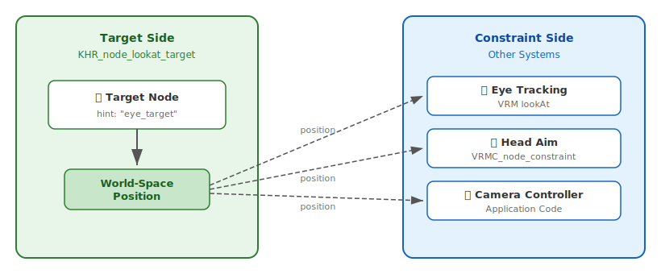
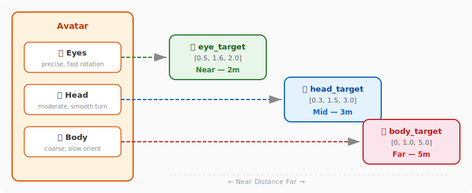
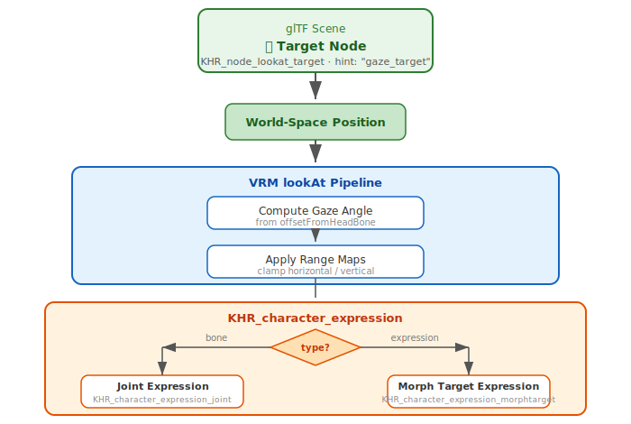

# KHR\_node\_lookat\_target

## Contributors

- Ken Jakubzak, Meta
- *[Additional contributors TBD]*

## Status

Draft

## Dependencies

Written against the glTF 2.0 specification.

No other extension dependencies are required. This extension is fully self-contained.

## Overview

### The Problem

Look-at systems are ubiquitous in real-time 3D applications. Characters track objects with their eyes and heads. Cameras follow points of interest. Turrets aim at targets. Spotlights illuminate moving subjects. Every game engine and animation system implements look-at behavior, but there is no standard way to identify WHAT should be looked at.

The look-at problem has two distinct parts:

1. **The target** -- a position in space that something should orient toward.
2. **The constraint** -- the system that orients a node (eyes, head, camera, turret) toward the target.

These concerns are often conflated. VRM's `lookAt` defines both the constraint parameters AND embeds target semantics. Unity's `LookAtConstraint` assumes the target is specified at runtime. Neither approach cleanly separates the concepts.

The result is that targets are application-specific: eye targets for one system, camera targets for another, aim targets for weapons, interest points for cinematics. There is no interoperable way to mark a node as "this is something that should be looked at."

### The Solution

`KHR_node_lookat_target` marks a glTF node as a **passive target** for look-at systems. The extension identifies WHAT can be looked at, not HOW anything looks at it. Constraint behavior is delegated to other systems (VRM's `lookAt`, `VRMC_node_constraint`, application code).

This separation enables:

- **Interoperability**: A target authored for eye tracking can also be used by a camera system or head-tracking IK.
- **Decoupling**: Targets exist in the scene graph as inert data. Constraints are added by the runtime based on application needs.
- **Discovery**: Applications can scan the scene for look-at targets without understanding specific constraint implementations.

The following diagram illustrates the core architecture. The target (this extension) is a passive position marker. Constraints (defined elsewhere) consume the target position and produce orientation:



> **Key insight:** The target does not know its consumers. Multiple systems can independently aim at the same target. Configuration (axis, clamping, weight) lives on the constraint side, never on the target.

### What This Extension Is NOT

- **Not a constraint system.** This extension does not define HOW to look at a target. It does not specify rotation limits, blend weights, damping, or IK chain parameters. Constraint behavior belongs to extensions like `VRMC_node_constraint` or runtime logic.
- **Not an eye/head tracking specification.** Eye position, gaze direction, and head tracking parameters belong to character animation systems (e.g., VRM `lookAt`). This extension only marks targets.
- **Not a bone or joint definition.** Look-at targets are positions in space, not skeletal elements. They may be attached to bones but are not bones themselves.
- **Not a camera system.** Camera behavior (following, orbiting, interpolation) is defined by camera extensions or application code. A look-at target may serve as input to a camera system but does not define camera behavior.

### Terminology

| Term | Definition |
|------|-----------|
| **Look-at target** | A glTF node annotated with this extension, marking it as a position that other systems may orient toward. The target is passive -- it does not cause anything to happen on its own. |
| **Hint** | An optional string suggesting the intended use of the target (e.g., eye tracking, camera interest). Hints are advisory; runtimes may use targets for any compatible purpose. |
| **Constraint** | A system that orients a node toward a target. Constraints are NOT defined by this extension. Examples include VRM `lookAt`, `VRMC_node_constraint`, and application-level IK systems. |

---

## RFC 2119

The key words "MUST", "MUST NOT", "REQUIRED", "SHALL", "SHALL NOT", "SHOULD", "SHOULD NOT", "RECOMMENDED", "MAY", and "OPTIONAL" in this document are to be interpreted as described in [RFC 2119](https://www.ietf.org/rfc/rfc2119.txt).

---

## Extension Declaration

This extension is declared in the asset-level `extensionsUsed` array. Because this extension provides semantic metadata that does not affect rendering correctness, it SHOULD appear in `extensionsUsed` and SHOULD NOT appear in `extensionsRequired`.

```json
{
  "extensionsUsed": [
    "KHR_node_lookat_target"
  ]
}
```

An implementation that does not support this extension SHOULD treat annotated nodes as ordinary nodes. No visual content is affected by the absence of look-at target support -- the extension provides metadata, not rendering behavior.

---

## Extension Specification

### Extension Placement

The extension data is placed on individual `node` objects within the glTF `nodes` array. Only nodes intended as look-at targets carry this extension.

A look-at target node is typically an empty transform node (no `mesh`, `camera`, or `skin` properties). The node's world-space position is the target point. Target nodes may be children of other nodes (e.g., attached to a character's hand for "look at held object" behavior) or placed independently in the scene.

### Extension Data

When present on a node object, the extension contains the following properties:

| Property | Type | Required | Default | Description |
|----------|------|----------|---------|-------------|
| `hint` | `string` | No | -- | Advisory string suggesting the intended use of this target. Free-form; not a closed vocabulary. |

### Property Descriptions

#### `hint` (optional)

An advisory string suggesting what type of system should use this target. This is a free-form string. This extension does not prescribe a vocabulary. Authors MAY use any hint value that fits their use case. The Example Hint Values section provides common hints, but these are illustrative examples, not a required vocabulary.

Runtimes SHOULD NOT require specific hint values to function. A runtime looking for eye-tracking targets MAY prefer nodes with `hint: "eye_target"` but SHOULD be capable of using any look-at target node.

When `hint` is omitted, the target is a general-purpose look-at target with no specific system preference. Runtimes may use it for any compatible purpose.

---

## Example Hint Values

The following hint values are provided as **examples** for common look-at target use cases. These are illustrative, not prescriptive. Authors MAY use any hint value that fits their use case. Custom hints are expected and normal for domain-specific applications.

| Hint Value | Suggested Use |
|------------|---------------|
| `eye_target` | Target for eye-tracking systems. Eyes should orient toward this node. Compatible with VRM `lookAt` implementations. |
| `head_target` | Target for head-tracking or head-turning IK. The character's head should orient toward this node. |
| `camera_target` | Target for camera look-at or camera interest systems. The camera should orient toward or frame this node. |
| `aim_target` | Target for aiming systems. Weapons, turrets, or pointing gestures should orient toward this node. |
| `body_target` | Target for full-body orientation. The character's torso or full body should turn toward this node. |
| `gaze_target` | General gaze direction target. May affect eyes, head, and body as a coordinated system. |

These categories overlap intentionally. A single node might serve as `eye_target`, `head_target`, and `gaze_target` simultaneously. A runtime may use any target for any purpose if the use case is compatible.

---

## JSON Examples

### Example 1: Simple Eye-Tracking Target

An avatar with an eye-tracking target positioned in front of the face.

```json
{
  "asset": { "version": "2.0" },
  "extensionsUsed": ["KHR_node_lookat_target"],
  "nodes": [
    {
      "name": "AvatarRoot",
      "children": [1, 2]
    },
    {
      "name": "AvatarBody",
      "mesh": 0,
      "skin": 0
    },
    {
      "name": "EyeTarget",
      "translation": [0, 1.6, 1.0],
      "extensions": {
        "KHR_node_lookat_target": {
          "hint": "eye_target"
        }
      }
    }
  ]
}
```

**Runtime behavior:** A VRM-compatible runtime discovers the `eye_target` node and uses its world-space position as the look-at target for the avatar's eye-tracking system. The avatar's eyes orient toward `[0, 1.6, 1.0]` -- a point roughly at eye level, one meter in front of the face.

### Example 2: Camera Interest Point

A product model with a camera interest target at the product's visual center.

```json
{
  "asset": { "version": "2.0" },
  "extensionsUsed": ["KHR_node_lookat_target"],
  "nodes": [
    {
      "name": "ProductMesh",
      "mesh": 0
    },
    {
      "name": "CameraInterest",
      "translation": [0, 0.15, 0],
      "extensions": {
        "KHR_node_lookat_target": {
          "hint": "camera_target"
        }
      }
    }
  ]
}
```

**Runtime behavior:** A product viewer discovers the `camera_target` node and uses it as the focal point for camera orbiting and framing. The camera always looks toward `[0, 0.15, 0]` regardless of orbit angle.

### Example 3: Aim Target for Weapon System

A character with an aim target attached to their held weapon.

```json
{
  "asset": { "version": "2.0" },
  "extensionsUsed": ["KHR_node_lookat_target"],
  "nodes": [
    {
      "name": "CharacterRoot",
      "children": [1, 2]
    },
    {
      "name": "RightHand",
      "children": [2]
    },
    {
      "name": "WeaponAimPoint",
      "translation": [0, 0, 5.0],
      "extensions": {
        "KHR_node_lookat_target": {
          "hint": "aim_target"
        }
      }
    }
  ]
}
```

**Runtime behavior:** A shooting game discovers the `aim_target` node and uses it as the point the character aims toward. The target is a child of the hand, so it moves with the weapon. Upper-body IK orients the character's arms to point the weapon toward this target.

### Example 4: Multiple Coordinated Targets

An avatar with separate targets for eyes, head, and body orientation.

```json
{
  "asset": { "version": "2.0" },
  "extensionsUsed": ["KHR_node_lookat_target"],
  "nodes": [
    {
      "name": "AvatarRoot",
      "children": [1, 2, 3, 4]
    },
    {
      "name": "AvatarBody",
      "mesh": 0,
      "skin": 0
    },
    {
      "name": "EyeTrackingTarget",
      "translation": [0.5, 1.6, 2.0],
      "extensions": {
        "KHR_node_lookat_target": {
          "hint": "eye_target"
        }
      }
    },
    {
      "name": "HeadTrackingTarget",
      "translation": [0.3, 1.5, 3.0],
      "extensions": {
        "KHR_node_lookat_target": {
          "hint": "head_target"
        }
      }
    },
    {
      "name": "BodyOrientationTarget",
      "translation": [0, 1.0, 5.0],
      "extensions": {
        "KHR_node_lookat_target": {
          "hint": "body_target"
        }
      }
    }
  ]
}
```

**Runtime behavior:** A sophisticated avatar system uses different targets for different body parts. Eyes track the nearby `eye_target`. The head turns toward the mid-distance `head_target`. The body orients toward the far `body_target`. This creates natural, layered attention behavior.

The following diagram shows how layered targets at different distances create natural attention behavior. Each body system tracks its own target independently:



> **Why different distances?** Placing targets at increasing distances creates natural gaze layering. The eyes make large angular movements to the near target. The head makes moderate rotations to the mid-distance target. The body makes subtle turns to the far target. This mimics how humans naturally attend to a point of interest — eyes first, then head, then body.

### Example 5: General-Purpose Target (No Hint)

A scene with a general look-at target that any system may use.

```json
{
  "asset": { "version": "2.0" },
  "extensionsUsed": ["KHR_node_lookat_target"],
  "nodes": [
    {
      "name": "SceneRoot",
      "children": [1]
    },
    {
      "name": "InterestPoint",
      "translation": [10, 2, 15],
      "extensions": {
        "KHR_node_lookat_target": {}
      }
    }
  ]
}
```

**Runtime behavior:** The target has no `hint`, so it's available for any system. A runtime might use it for camera framing, character attention, spotlight targeting, or any other look-at purpose.

---

## Interaction with Other Extensions

### VRM lookAt (VRMC\_vrm)

VRM 1.0 defines a `lookAt` system that controls how a character's eyes and head track a target:

```json
{
  "VRMC_vrm": {
    "lookAt": {
      "type": "bone",
      "offsetFromHeadBone": [0, 0.06, 0],
      "rangeMapHorizontalInner": { "inputMaxValue": 90, "outputScale": 10 },
      "rangeMapHorizontalOuter": { "inputMaxValue": 90, "outputScale": 10 },
      "rangeMapVerticalDown": { "inputMaxValue": 90, "outputScale": 10 },
      "rangeMapVerticalUp": { "inputMaxValue": 90, "outputScale": 10 }
    }
  }
}
```

VRM's `lookAt` defines the **constraint** (how eyes/head rotate toward a target) but not the **target** itself. The target is provided at runtime, typically by application code.

`KHR_node_lookat_target` complements VRM by marking nodes that should serve as look-at targets. A VRM runtime can:

1. Scan the scene for nodes with `KHR_node_lookat_target`.
2. Filter by `hint` (prefer `eye_target` for eye tracking).
3. Use the node's world-space position as the `lookAt` target.

This separation allows targets to be authored into the glTF file while VRM handles constraint behavior.

The following diagram shows how `KHR_node_lookat_target` feeds into the VRM `lookAt` evaluation pipeline. Both output paths — bone rotations and morph target blending — are expressions in the `KHR_character_expression` context:



> **This extension fills VRM's target gap.** VRM defines everything about how eyes respond to a gaze direction (range maps, bone/expression mode, gaze origin offset). This extension defines what the target IS — a node in the scene graph with a world-space position. Both output modes — `KHR_character_expression_joint` (bone rotation) and `KHR_character_expression_morphtarget` (blend shape) — are expressions under `KHR_character_expression`. The two extensions are complementary and compose without conflict.

### VRMC\_node\_constraint

`VRMC_node_constraint` defines constraint types including aim constraints:

```json
{
  "VRMC_node_constraint": {
    "constraint": {
      "aim": {
        "source": 5,
        "aimAxis": "PositiveZ",
        "weight": 1.0
      }
    }
  }
}
```

A `KHR_node_lookat_target` node can serve as the `source` for an aim constraint. The look-at target extension marks WHAT to aim at; `VRMC_node_constraint` defines HOW to aim.

### KHR\_node\_camera\_hint

`KHR_node_camera_hint` can reference look-at target nodes via its `targetNode` property:

```json
{
  "KHR_node_camera_hint": {
    "role": "portrait",
    "targetNode": 3
  }
}
```

If node 3 has `KHR_node_lookat_target`, it serves double duty: as a camera target and as a general look-at target. This is intentional -- the same point of interest may be used by multiple systems.

---

## Conformance

### Authoring Requirements

1. The extension object MUST be present on the node (even if empty).
2. If `hint` is present, it MUST be a non-empty string.
3. Look-at target nodes SHOULD have a scale of `[1, 1, 1]`. Implementations SHOULD ignore scale on look-at target nodes.
4. Multiple look-at target nodes are permitted within a single asset.
5. Multiple nodes MAY have the same `hint` value.

### Runtime Requirements

1. Implementations that support this extension SHOULD expose look-at target data to constraint systems and application logic.
2. Implementations SHOULD allow filtering targets by `hint` value.
3. Implementations MUST NOT reject an asset because it contains an unrecognized `hint` value. Unknown hints should be treated as general-purpose targets.
4. Look-at target nodes SHOULD NOT be rendered as visible geometry unless they explicitly contain a mesh. They are metadata nodes.
5. Implementations that do not support this extension SHOULD treat annotated nodes as ordinary transform nodes. No visual content is affected.

### Fallback Behavior

If an implementation does not support `KHR_node_lookat_target`, the extension is ignored. The asset renders normally. Look-at behavior depends on other systems (VRM, application code) that may or may not function without target discovery. This is acceptable -- the extension provides optional metadata, not required functionality.

---

## Schema

### node.KHR\_node\_lookat\_target

```json
{
  "$schema": "https://json-schema.org/draft/2020-12/schema",
  "$id": "node.KHR_node_lookat_target.schema.json",
  "title": "KHR_node_lookat_target glTF Node Extension",
  "description": "Marks a node as a passive target for look-at systems. The node's world-space position is the target point. Constraint behavior is delegated to other systems.",
  "type": "object",
  "properties": {
    "hint": {
      "type": "string",
      "description": "Advisory string suggesting the intended use of this target. Free-form; not a closed vocabulary.",
      "minLength": 1
    }
  },
  "additionalProperties": false
}
```

---

## Known Limitations

1. **No constraint definition.** This extension marks targets, not constraints. Applications must implement or delegate look-at behavior separately. A node marked as `eye_target` does not cause eyes to move -- it only identifies where they *could* look if a constraint system is present.

2. **No target priority or selection.** When multiple targets with the same `hint` value exist, this extension provides no mechanism for ordering or selecting among them. Applications requiring priority-based target selection must implement that logic outside this extension.

3. **No activation radius or spatial constraints.** The target is globally available. There is no built-in mechanism to limit a target's influence to a spatial region. Runtimes requiring spatial activation should implement it as application logic.

4. **Hint values are advisory, not prescriptive.** A runtime may use a node with `hint: "eye_target"` for head tracking, or a node with `hint: "head_target"` for camera aiming. The hint aids default wiring but does not constrain usage.

5. **Round-trip preservation depends on implementation.** A glTF editor or converter that does not support this extension may strip the extension data when saving. This is standard glTF behavior for unrecognized extensions. Implementations SHOULD preserve unknown extensions during round-trip operations.

6. **No explicit link to VRM lookAt.** While this extension is designed to complement VRM's `lookAt` system, there is no formal reference from `VRMC_vrm.lookAt` to a `KHR_node_lookat_target` node. The connection is established by runtime discovery (scan scene for targets) or by convention (the VRM runtime reads target nodes). A future VRM revision could add an optional `targetNode` index to the `lookAt` object to formalize this link.

---

## License

This extension specification is licensed under the Khronos Group Extension License.
See: <https://www.khronos.org/registry/gltf/license.html>
