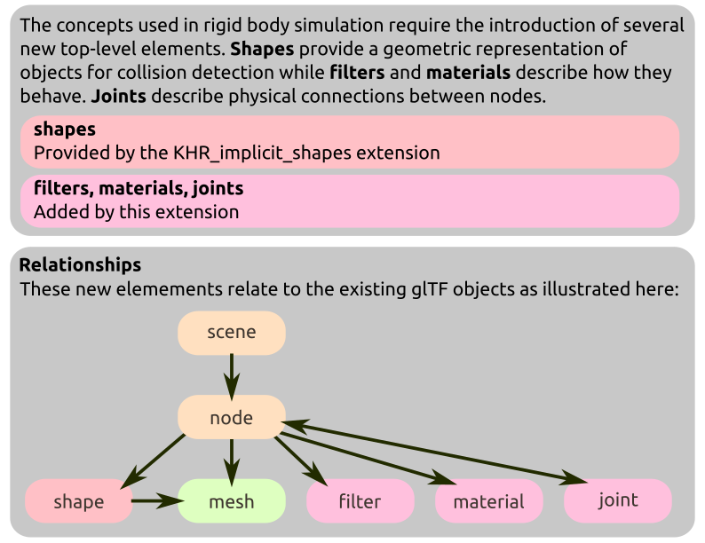

# KHR_physics_rigid_bodies

## Contributors <!-- omit in toc -->

* Eoin Mcloughlin, Microsoft, <mailto:eomcl@microsoft.com>
* Rory Mullane, Microsoft, <mailto:romul@microsoft.com>
* George Tian, Microsoft, <mailto:geotian@microsoft.com>
* Aaron Franke, Godot Engine, <mailto:arnfranke@yahoo.com>
* Eric Griffith, Meta, <mailto:ericgriffith@meta.com>

## Status <!-- omit in toc -->

Draft

## Dependencies <!-- omit in toc -->

Written against glTF 2.0 spec.

This specification depends on [KHR\_collision\_shapes](../KHR_collision_shapes/README.md) to describe geometries used for collision detection.

## Table of Contents <!-- omit in toc -->

- [Overview](#overview)
- [Units](#units)
- [Adding Rigid Body Properties to Nodes](#adding-rigid-body-properties-to-nodes)
  - [Motions](#motions)
  - [Colliders](#colliders)
  - [Physics Materials](#physics-materials)
  - [Collision Filtering](#collision-filtering)
  - [Triggers](#triggers)
  - [Joints](#joints)
- [glTF Schema Updates](#gltf-schema-updates)
- [Object Model](#object-model)
- [Appendix: Joint Limit Metrics](#appendix-joint-limit-metrics)
- [Appendix: Full Khronos Copyright Statement](#appendix-full-khronos-copyright-statement)


## Overview

This extension defines a set of properties which may be added to glTF nodes, making them suitable for rigid body dynamics simulation. Such a simulation may update node transforms, effectively animating node transforms procedurally in a physically plausible manner.

Properties added by this extension include:

- Collision shapes, used to determine when nodes are physically overlapping.
  - Collision filters, which allow for control over which pairs of nodes should collide.
  - Physics materials, which describe how pairs of objects react to collisions.
- Joints, which describe physical connections between nodes.
- Mass and velocity, describing the movement of nodes.

The following diagram augments the overview diagram in the [main glTF repository](https://github.com/KhronosGroup/glTF) and shows the relationships between new properties added by this extension and existing objects in the glTF specification.



Note, amongst rigid body engines which exist today, there are a wide variety of approximations and solving strategies in use which result in differing behavior. As such, the same asset is very likely to behave differently in different simulation engines or with different settings applied to one simulation engine. An implementation should make a best effort to implement this specification within those limitations; this requires some discretion on the part of the implementer - for example, a video game is very likely willing to accept inaccuracies which would be unacceptable in a robotic training application.

### Units

Units used in this specification are the same as those in the [glTF specification](https://registry.khronos.org/glTF/specs/2.0/glTF-2.0.html#coordinate-system-and-units); some additional units are used by this extension:

| Property | Units|
|-|-|
|`motion.mass`|Kilograms (kg)|
|`motion.inertiaDiagonal`|Kilogram meter squared (kg·m<sup>2</sup>)|
|`motion.linearVelocity`|Meter per second (m·s<sup>-1</sup>)|
|`motion.angularVelocity`|Radian per second (rad·s<sup>-1</sup>)|
|`joint.limit.stiffness`, <br /> `joint.drive.stiffness`|Newton per meter (N·m<sup>-1</sup>) for linear limits <br /> Newton meter per radian (N·m·rad<sup>-1</sup>) for angular limits|
|`joint.limit.damping`, <br /> `joint.drive.damping`|Newton second per meter (N·s·m<sup>-1</sup>) for linear limits <br />Newton second meter per radian (N·s·m·rad<sup>-1</sup>) for angular limits|

## Adding Rigid Body Properties to Nodes

Rigid body properties are attached to a node by defining the `extensions.KHR_physics_rigid_bodies` property with values appropriate for the desired behaviour of that node. The `KHR_physics_rigid_bodies` extension object may contain one or more of the following properties:

| |Type|Description|
|-|-|-|
|**motion**|`object`|Allows the simulation to move this node, describing parameters for that motion.|
|**collider**|`object`|Describes the physical representation of a node's shape for collision detection.|
|**trigger**|`object`|Describes a volume which can detect collisions, but does not generate a physical response.|
|**joint**|`object`|Constrains the motion of this node relative to another.|

The following creates a node with a renderable mesh, a defined mass, initial linear velocity, and a collision shape with a physical material.

```
"nodes" : [
    {
        "mesh": 0,
        "extensions": {
            "KHR_physics_rigid_bodies": {
                "motion": {
                    "mass": 5.0,
                    "linearVelocity": [1.0, 0.0, 0.0]
                },
                "collider": {
                    "shape": 0,
                    "physicsMaterial": 0
                }
            }
        }
    }
]
```

### Motions

When a `node` has `motion` properties, that node should be represented by a dynamic rigid body in the simulation engine and the node's local transform should be updated by the physics engine after every simulation step.

As the simulation engine updates the local transform of a node, all descendant nodes should move with that node - i.e. the physics engine should treat them as part of a single rigid body. However, if a descendant node has its own `motion` properties, that node must be treated as an independent rigid body during simulation - there is no implicit requirement that it follows its 'parent' rigid body.

If a rigid body node's transform is animated by animations in the file, those animations should take priority over the physics simulation. Rigid bodies should follow the transforms provided by the animations. A simulation engine has several options for how this can be achieved at the discretion of the implementer - for example, the rigid body may be instantaneously teleported without traversing the intermediate space. Alternatively, a simulation engine may set velocities or joint motors such that the node reaches the target transform within the simulation step.

Rigid body motions have the following properties:

| |Type|Description|
|-|-|-|
|**isKinematic**|`boolean`|When true, treat the rigid body as having infinite mass. Its velocity will be constant during simulation.|
|**mass**|`number`|The mass of the rigid body. Larger values imply the rigid body is harder to move.|
|**inertiaOrientation**|`number[4]`|The quaternion rotating from inertia major axis space to node space.|
|**inertiaDiagonal**|`number[3]`|The principal moments of inertia. Larger values imply the rigid body is harder to rotate.|
|**centerOfMass**|`number[3]`|Center of mass of the rigid body in node space.|
|**linearVelocity**|`number[3]`|Initial linear velocity of the rigid body in node space.|
|**angularVelocity**|`number[3]`|Initial angular velocity of the rigid body in node space.|

If not provided, the mass and inertia properties should be calculated by the simulation engine. These values are typically derived from the volume of the collision geometry used by the rigid body. The 3x3 inertia tensor can be calculated as the product of the `inertiaOrientation` (in matrix form) and the matrix whose diagonal is `inertiaDiagonal`.

JSON is unable to represent infinite values; however, a value of infinity is useful for both `mass` and the components of `inertiaDiagonal`. As zero is an *invalid* value for these properties, a value of zero in `mass` or any of the components of `inertiaDiagnal` should be understood to represent a value of infinity.

### Colliders

Rather than using a node's render mesh to perform collision detection, collision geometry must be explicitly declared by adding an additional `collider` property to a node.

The `collider` property supplies three fields. The `shape` field describes the geometry which should be used to perform collision detection; the value indexes into the set of top-level collision shapes provided by the [KHR\_collision\_shapes](../KHR_collision_shapes/README.md) extension. The `physicsMaterial` indexes into the top-level set of physics materials, described in the "[Physics Materials](#physics-materials)" section of this document. Finally, the `collisionFilter` indexes into the top-level set of collision filters, described by the "[Collision Filtering](#collision-filtering)" section of this document.

| |Type|Description|
|-|-|-|
|**shape**|`integer`| The index of a top-level `KHR_collision_shapes.shape`, which provides the geometry of the trigger.|
|**physicsMaterial**|`integer`|Indexes into the top-level `physicsMaterials` and describes how the collider should respond to collisions.|
|**collisionFilter**|`integer`|Indexes into the top-level `collisionFilters` and describes a filter which determines if this collider should perform collision detection against another collider.|

If the node is part of a dynamic rigid body (i.e. itself or an ascendant has `motion` properties) then the collider belongs to that rigid body and must move with it during simulation. Otherwise the collider exists as a static object in the physics simulation which can be collided with but must not be moved as a result of solving collisions or joints. A rigid body may have a compound constructed from several collision shapes by supplying multiple descendent `collider` nodes.

Implementations of this extension should ensure that collider transforms are always kept in sync with node transforms - for example animated node transforms should be applied to the physics engine (even for static colliders).


#### Convex Hull Colliders

Physics simulations typically recommend against allowing collisions between pairs of triangulated mesh objects, preferring to collide pairs of convex shapes instead. To support this, the `KHR_physics_rigid_bodies` extension may be defined on a `KHR_collision_shapes.shape` object.

```javascript
"extensions": {
    "KHR_collision_shapes" : {
        "shapes": [
            {
                "mesh": { "mesh": 0 },
                "type": "mesh",
                "extensions": {
                    "KHR_physics_rigid_bodies": {
                        "convexHull": true
                    }
                }
             }
        ]
    }
}
```

The extension object contains a single property:

| |Type|Description|
|-|-|-|
|**convexHull**|`boolean`|Flag to indicate that the shape should be generated from the convex hull of the shape.|

When the `convexHull` parameter is set to `true`, the collision shape used by the rigid body simulation should be the convex hull of the described shape. When used on a mesh shape which is skinned or uses morph targets, the resulting shape should be the convex hull of the deformed mesh. Note that of the shape types contained in `KHR_collision_shapes`, only the `mesh` type allows concave geometries to be described. This flag has no effect on the remaining shape types, though future extensions may add additional concave shapes.

### Physics Materials

When a pair of nodes collide with each other, additional properties are needed to determine the collision response. This response is partly controlled by the physics materials of each collider. Physics materials may be shared between different colliders and are defined by adding an `extensions` property to the top-level glTF 2.0 object and defining a `KHR_physics_rigid_bodies` property with a `physicsMaterials` array inside it.

```
"extensions": {
    "KHR_physics_rigid_bodies": {
        "physicsMaterials": [
            {
                "staticFriction": 0.8,
                "dynamicFriction": 0.7,
                "restitution": 0.1
            }
        ]
    }
}
```

A collider's `physicsMaterial` property indexes into this array to determine the appropriate material values to use during collision response. If a collider has no physics material assigned, the simulation engine may choose any appropriate default values.

Physics materials offer the following properties:

| |Type|Description|
|-|-|-|
|**staticFriction**|`number`|The friction used when an object is laying still on a surface.<br/>Typical range from 0 to 1.|
|**dynamicFriction**|`number`|The friction used when already moving.<br/>Typical range from 0 to 1.|
|**restitution**|`number`|Coefficient of restitution.<br/>Typical range from 0 to 1.|
|**frictionCombine**|`string`|How to combine two friction values.<br/>"average", "minimum", "maximum", or "multiply".|
|**restitutionCombine**|`string`|How to combine two restitution values.<br/>"average", "minimum", "maximum", or "multiply".|

For handling friction parameters, a physics simulation should use a Coulomb friction model. The friction coefficient to use is be determined by the relative velocity of the surfaces perpendicular to the contact normal. When this velocity is sufficiently close to zero, the value of `staticFriction` should be used, otherwise, `dynamicFriction` should be used.

When a pair of physics materials interact during a simulation step, the applied friction and restitution values are based on their "combine" policies:

- If either uses "average" : The two values should be averaged.
- Else if either uses "minimum" : The smallest of the two values should be used.
- Else if either uses "maximum" : The largest of the two values should be used.
- Else if either uses "multiply" : The two values should be multiplied with each other.

### Collision Filtering

Colliders from distinct rigid bodies should generate a collision response when they are sufficiently close together to be considered in contact.

In some scenarios this is undesirable, so a collision filter allows control over which pairs of `collider` objects may interact. Collision filter descriptions may be shared amongst several objects and are defined by adding an `extensions` property to the top-level glTF 2.0 object and defining a `KHR_physics_rigid_bodies`property with a `collisionFilters` array inside it.

```
"extensions": {
    "KHR_physics_rigid_bodies": {
        "collisionFilters": [
            {
                "collisionSystems": ["character"],
                "collideWithSystems": ["landscape", "debris"]
            }
        ]
    }
}
```

Each collision filter filter contains a subset of the fields:

| |Type|Description|
|-|-|-|
|**collisionSystems**|`string[1-*]`|An array of arbitrary strings indicating the "system" a node is a member of.|
|**notCollideWithSystems**|`string[1-*]`|An array of strings representing the systems which this node can _not_ collide with|
|**collideWithSystems**|`string[1-*]`|An array of strings representing the systems which this node can collide with|

Both `collideWithSystems` and `notCollideWithSystems` are provided so that users can override the default collision behavior with minimal configuration -- only one of these must be specified per object. Note, given knowledge of all the systems in a scene and one of the values `notCollideWithSystems`/`collideWithSystems` the unspecified field can be calculated as the inverse of the other.

`notCollideWithSystems` is useful for an object which should collide with everything except those listed in `notCollideWithSystems` (i.e., used to opt-out of collisions) while `collideWithSystems` is the inverse -- the collider should not collide with any other collider except those listed in `collideWithSystems`

A node `A` will collide with node `B` if `A.collisionSystem ⊆ B.collideWithSystems && A.collisionSystem ⊄ B.notCollideWithSystems`

This can generate asymmetric states - `A` might determine that it _does_ collide with `B`, but `B` may determine that it _does not_ collide with `A`. As the default behavior is that collision should be enabled, both `doesCollide(A, B)` and `doesCollide(B, A)` tests should be performed and collision should not occur if either returns false.


### Triggers

A useful construct in a physics engine is a collision volume which does not generate impulses when overlapping with other volumes but do generate events which execute application-specific logic. These objects are typically called "triggers", "sensors", "phantoms", or "overlap volumes" in physics simulation engines. Triggers allow specifying such volumes either as a single shape or combination of shapes.

A trigger is added to a node by specifying the `trigger` property.

A `trigger` may specify a `shape` property which references a geometric shape defined by the `KHR_collision_shapes` extension as well as an optional `collisionFilter` parameter, with the same semantics as a `collider`.

Alternatively, a `trigger` may have a `nodes` property, which is an array of glTF nodes which make up a compound trigger on this glTF node. The nodes in this array must be descendent nodes which must have `trigger` properties.

| |Type|Description|
| - | - | -|
|**shape**|`integer`| The index of a top-level `KHR_collision_shapes.shape`, which provides the geometry of the trigger.|
|**nodes**|`integer[1-*]`|For compound triggers, the set of descendant glTF nodes with a trigger property that make up this compound trigger.|
|**collisionFilter**|`integer`|Indexes into the top-level `collisionFilters` and describes a filter which determines if this collider should perform collision detection against another collider.|

Describing the precise mechanism by which overlap events are generated and what occurs as a result is beyond the scope of this specification; simulation software will typically output overlap begin/end events as an output from the simulation step, which is hooked into application-specific business logic.

### Joints

A `node` may have a `joint` property, which describes a physical connection to another object, constraining the relative motion of those two objects in some manner. Rather than defining explicit types of connections, joints are composed of simple primitive limits, which can be composed to build complex joints.

A `joint` is composed of:

- Two attachment frames, defining the position and orientation of the joint pivots in each object.
- A set of limits, which restrict the relative motion of the attachment frames.
- An optional set of drives, which can apply forces to the attachment frames.

The attachment frames are specified using the transforms of `node` objects; the first of which is the `node` of the `joint` object itself. A `joint` must have a `connectedNode` property, which is the index of the `node` which supplies the second attachment frame. For each of these frames, the relative transform between the `node` and the first parent `motion` (or the simulation's fixed reference frame, if no such `motion` exists) define the constraint space in that rigid body. In order for the joint to have any effect on the simulation, at least one of the pair of nodes or its ancestors should have `motion` properties.

A node's `joint` must specify a `joint` property, which indexes into the top-level array of `physicsJoints` inside the `KHR_physics_rigid_bodies` extension object. This object describes the limits and drives utilized by the joint in a shareable manner.

A joint description contains zero or more `joint.limit` objects and zero or more `joint.drive` objects. Each of the limit objects remove some of the relative movement permitted between the two attachment frames, while the drive objects apply forces to achieve a relative transform or velocity between the attachment frames.

If a joint were to eliminate all degrees of freedom, the physics simulation should attempt to move the `motion` nodes such that the transforms of the constrained child nodes (i.e. the `joint` node and the node at index `connectedNode`) become aligned with each other in global space.

Each `joint.limit` contains the following properties:

| |Type|Description|
|-|-|-|
|**linearAxes**|`integer[1..3]`|The linear axes to constrain (0=X, 1=Y, 2=Z).|
|**angularAxes**|`integer[1..3]`|The angular axes to constrain (0=X, 1=Y, 2=Z).|
|**min**|`number`|The minimum allowed relative distance/angle.|
|**max**|`number`|The maximum allowed relative distance/angle.|
|**stiffness**|`number`|Optional softness of the limits when beyond the limits.|
|**damping**|`number`|Optional spring damping applied when beyond the limits.|

Each limit must provide either `linearAxes` or `angularAxes`, declaring which are restricted. The indices in these arrays refer to the columns of the basis defined by the attachment frame of the joint and as such, must be in the range 0 to 2. The number of axes determines whether the limit should be a 1, 2, or 3 dimensional constraint as follows:

* A 1D linear limit should keep the global space translation of the attachment frames within the signed distance from the infinite plane spanned by the other two axes.
* A 2D linear limit should keep the attachment frame translations within a distance from the infinite line along the remaining axis.
* A 3D linear limit should keep the attachment frame translations within a distance from each other.
* A 1D angular limit should restrict the attachment frame rotation about that axis, as in a universal joint.
* A 2D angular limit should restrict the attachment frame rotations to a cone oriented along the remaining axis.

Each limit contains an optional `min` and `max` parameter, describing the range of allowed difference between the two node transforms - within this range, the limit is considered non-violating and no corrective forces are applied. These values represent a _distance_ in meters for a linear limit, or an _angle_ in radians for an angular limit. If the `min` parameter is not provided, there is no lower bound on the range. Similarly, if the `max` parameter is not provided, there is no upper bound.

Additionally, each `joint.limit` has an optional `stiffness` and `damping` which specify the proportion of the recovery applied to the limit. By default, an infinite spring constant is assumed, implying hard limits. Specifying a finite stiffness will cause the limit to become soft at the limits.

This approach of building joints from a set of individual limit is flexible enough to allow for many types of bilateral joints. For example, a hinged door can be constructed by locating the attachment frames at the point where the physical hinge would be on each body, adding a 3D linear limit with zero maximum distance, a 1D angular limit with `min`/`max` describing the swing of the door around it's vertical axis, and a 2D angular limit with zero limits about the remaining two axes.

Addition of drive objects to a joint allows the joint to apply additional forces to modify the relative transform between the joint object and the connected node. A `joint.drive` object models a forced, damped spring and contains the following properties:

| |Type|Description|
|-|-|-|
|**type**|`string`|Determines if the drive affects is a `linear` or `angular` drive|
|**mode**|`string`|Determines if the drive is operating in `force` or `acceleration` mode|
|**axis**|`integer`|The index of the axis which this drive affects|
|**maxForce**|`number`|The maximum force that the drive can apply|
|**positionTarget**|`number`|The desired relative target between the pivot axes|
|**velocityTarget**|`number`|The desired relative velocity of the pivot axes|
|**stiffness**|`number`|The drive's stiffness, used to achieve the position target|
|**damping**|`number`|The damping factor applied to reach the velocity target|

Each `joint.drive` describes a force applied to one degree of freedom in joint space, specified with a combination of the `type` and `axis` parameters and drives to either a target position, velocity, or both. The drive force is proportional to `stiffness * (positionTarget - positionCurrent) + damping * (velocityTarget - velocityCurrent)` where `positionCurrent` and `velocityCurrent` are the signed values of the position and velocity of the connected node in joint space. To assist with tuning the drive parameters, a drive can be configured to be in an `acceleration` `mode` which scales the force by the effective mass of the driven degree of freedom. This mode is typically easier to tune to achieve the desired behaviour, particularly in scenarios where the masses of the connected nodes are not known in advance.


### glTF Schema Updates

* **JSON schema**: [glTF.KHR_physics_rigid_bodies.schema.json](schema/glTF.KHR_physics_rigid_bodies.schema.json)

### Object Model

With consideration to the glTF 2.0 Asset Object Model Specification document, the following pointer templates represent mutable properties defined in this extension.

| Pointer | Type|
|-|-|
| `/extensions/KHR_physics_rigid_bodies/physicsMaterials/{}/staticFriction` | `float`|
| `/extensions/KHR_physics_rigid_bodies/physicsMaterials/{}/dynamicFriction` | `float`|
| `/extensions/KHR_physics_rigid_bodies/physicsMaterials/{}/restitution` | `float`|
| `/extensions/KHR_physics_rigid_bodies/physicsJoints/{}/limits/{}/min` | `float`|
| `/extensions/KHR_physics_rigid_bodies/physicsJoints/{}/limits/{}/max` | `float`|
| `/extensions/KHR_physics_rigid_bodies/physicsJoints/{}/limits/{}/stiffness` | `float`|
| `/extensions/KHR_physics_rigid_bodies/physicsJoints/{}/limits/{}/damping` | `float`|
| `/extensions/KHR_physics_rigid_bodies/physicsJoints/{}/drives/{}/maxForce` | `float`|
| `/extensions/KHR_physics_rigid_bodies/physicsJoints/{}/drives/{}/positionTarget` | `float`|
| `/extensions/KHR_physics_rigid_bodies/physicsJoints/{}/drives/{}/velocityTarget` | `float`|
| `/extensions/KHR_physics_rigid_bodies/physicsJoints/{}/drives/{}/stiffness` | `float`|
| `/extensions/KHR_physics_rigid_bodies/physicsJoints/{}/drives/{}/damping` | `float`|
| `/nodes/{}/extensions/KHR_physics_rigid_bodies/motion/isKinematic` | `boolean`|
| `/nodes/{}/extensions/KHR_physics_rigid_bodies/motion/mass` | `float`|
| `/nodes/{}/extensions/KHR_physics_rigid_bodies/motion/centerOfMass` | `float3`|
| `/nodes/{}/extensions/KHR_physics_rigid_bodies/motion/inertiaDiagonal` | `float3`|
| `/nodes/{}/extensions/KHR_physics_rigid_bodies/motion/inertiaOrientation` | `float4`|
| `/nodes/{}/extensions/KHR_physics_rigid_bodies/motion/linearVelocity` | `float3`|
| `/nodes/{}/extensions/KHR_physics_rigid_bodies/motion/angularVelocity` | `float3`|
| `/nodes/{}/extensions/KHR_physics_rigid_bodies/motion/gravityFactor` | `float`|
| `/nodes/{}/extensions/KHR_physics_rigid_bodies/joint/enableCollision` | `boolean`|


Additional read-only properties

| Pointer | Type|
|-|-|
| `/extensions/KHR_physics_rigid_bodies/physicsMaterials.length` | `int`|
| `/extensions/KHR_physics_rigid_bodies/physicsJoints.length` | `int`|
| `/extensions/KHR_physics_rigid_bodies/collisionFilters.length` | `int`|


### Interaction with KHR_interactivity

When used in conjunction with `KHR_interactivity`, this extension describes additional utility nodes:

#### Velocity modification nodes

|Type|`rigid_body/applyImpulse`| Apply an impulse to a body |
|-|-|-|
| Input flow sockets | `in` | The entry point into this node |
| Input value sockets | `int nodeIndex` | The node to which the impulse should be applied |
| | `float3 linearImpulse` | Linear impulse to apply (global space, default 0,0,0) |
| | `float3 angularImpulse` | Angular impulse to apply (global space, default 0,0,0) |

|Type|`rigid_body/applyPointImpulse`| Apply a point impulse to a body |
|-|-|-|
| Input flow sockets | `in` | The entry point into this node |
| Input value sockets | `int nodeIndex` | The node to which the impulse should be applied |
| |`float3 impulse` | Impulse to apply (global space) |
| | `float3 position` | Position at which to apply impulse (global space) |

These nodes are used to apply impulses to a dynamic rigid body, useful when the mass or inertia of a motion is not known in advance. In order to have an effect, the input node index must refer to a node which has `motion` properties or is a descendent of a node with `motion` properties.

#### Scene query nodes

|Type|`rigid_body/rayCast`| Perform a ray segment intersection against colliders in the scene |
|-|-|-|
| Input flow sockets | `in` | The entry point into this node |
| Output flow sockets | `hit` | The flow triggered when this query detects an intersection |
| | `miss` | The flow triggered when this query does not detect an intersection |
| Input value sockets | `float3 rayStart` | Start position of ray segment (global space) |
| | `float3 rayEnd` | End position of ray segment (global space) |
| | `int collisionFilterIndex` | Optional collision filter to apply (default -1) |
| Output value sockets | `int hitNodeIndex` | Index of the node which detected an intersection |
| | `float hitFraction` | Fraction along ray segment where intersection occurred |
| |`float3 hitNormal` | The normal of the shape at the point of intersection (global space) |

This node can be activated to determine the intersection of a ray segment with any colliders in the scene. When a ray segment intersects multiple colliders, the output `hitNodeIndex` should be set to the node closest to the start position of the ray, i.e. the collider with the minimal `hitFraction`. The output value sockets are only valid when the `hit` flow is triggered.

#### Simulation notification nodes

|Type|`event/rigid_body_triggerEntered`| Trigger entered event |
|-|-|-|
| Output flow sockets | `out` | The flow to be activated when a rigid body node enters a trigger |
| Configuration | `int nodeIndex` | Index of a trigger node |
| Output value sockets | `int colliderNodeIndex` | Node index of entering collider |
| | `int motionNodeIndex`| Node index of entering motion (default -1) |

|Type|`event/rigid_body_triggerExited`| Trigger exited event |
|-|-|-|
| Output flow sockets | `out` | The flow to be activated when a rigid body node exits a trigger |
| Configuration | `int nodeIndex` | Index of a trigger node |
| Output value sockets| `int colliderNodeIndex` | Node index of exiting collider |
| | `int motionNodeIndex`| Node index of exiting motion (default -1) |

Trigger event nodes are activated when an collider enters or exits a trigger attached to `nodeIndex`. Entering a trigger is defined to occur when **any** intersection begins to occur between the trigger and the collider - the collider need not be completely enclosed within the trigger. Exiting is defined to occur when such an intersection no longer exists. When the collider which entered the trigger has a `motion` property, or is a child of a node with a `motion` property, the `motionNodeIndex` must be set to the index of the node containing the `motion`, otherwise, `motionNodeIndex` must be initialized to -1. These events may be raised multiple times between a pair of `event/onTick` events in scenarios where multiple objects entered a trigger.

If the `nodeIndex` configuration value is negative or greater than or equal to the number of glTF nodes in the asset, or does not refer to a node with a `trigger` property, the event node is invalid. A behavior graph **MUST NOT** contain two or more nodes of the same event nodes with identical `nodeIndex` configuration values.

## Appendix: Joint Limit Metrics

*This section is non-normative.*

To determine if a particular joint limit is violated, it is useful to determine a metric for each type of limit. For each of these limits, the joint limit is considered non-violating if the metric evaluates to a value in the range (`min`, `max`).

|Type|Metric|
|-|-|
|linearLimits=[i]|$e_i \cdot (t_b - t_a)$|
|linearLimits=[i,j]|$\lvert(t_b - t_a) - (e_k \cdot (t_b - t_a))e_k\rvert$|
|linearLimits=[i,j,k]|$\lvert(t_b - t_a)\rvert$|
|angularLimits=[i]|$2\arccos(\mathrm{Tw_i(q_a^* q_b)})$|
|angularLimits=[i,j]|$\arccos(q_a e_k \cdot q_b e_k)$|
|angularLimits=[i,j,k]|$2\arccos(\mathrm{Re}(q_a^* q_b))$

Where:
- $e_i$ is the $i$-th basis vector.
- $t_a$ is the translation of the joint node in global space.
- $t_b$ is the translation of the attached node in global space.
- $q_a$ is the orientation of the joint node in global space.
- $q_b$ is the orientation of the attached node in global space.
- $\mathrm{Tw_i}$ is the function which returns the twist component of the twist-swing decomposition of a quaternion.
- $\mathrm{Re}$ is the function which extracts the real component of a quaternion.

## Appendix: Full Khronos Copyright Statement

Copyright 2021-2023 The Khronos Group Inc.

This specification is protected by copyright laws and contains material proprietary
to Khronos. Except as described by these terms, it or any components
may not be reproduced, republished, distributed, transmitted, displayed, broadcast,
or otherwise exploited in any manner without the express prior written permission
of Khronos.

This specification has been created under the Khronos Intellectual Property Rights
Policy, which is Attachment A of the Khronos Group Membership Agreement available at
https://www.khronos.org/files/member_agreement.pdf. Khronos grants a conditional
copyright license to use and reproduce the unmodified specification for any purpose,
without fee or royalty, EXCEPT no licenses to any patent, trademark or other
intellectual property rights are granted under these terms. Parties desiring to
implement the specification and make use of Khronos trademarks in relation to that
implementation, and receive reciprocal patent license protection under the Khronos
IP Policy must become Adopters under the process defined by Khronos for this specification;
see https://www.khronos.org/conformance/adopters/file-format-adopter-program.

Some parts of this Specification are purely informative and do not define requirements
necessary for compliance and so are outside the Scope of this Specification. These
parts of the Specification are marked as being non-normative, or identified as
**Implementation Notes**.

Where this Specification includes normative references to external documents, only the
specifically identified sections and functionality of those external documents are in
Scope. Requirements defined by external documents not created by Khronos may contain
contributions from non-members of Khronos not covered by the Khronos Intellectual
Property Rights Policy.

Khronos makes no, and expressly disclaims any, representations or warranties,
express or implied, regarding this specification, including, without limitation:
merchantability, fitness for a particular purpose, non-infringement of any
intellectual property, correctness, accuracy, completeness, timeliness, and
reliability. Under no circumstances will Khronos, or any of its Promoters,
Contributors or Members, or their respective partners, officers, directors,
employees, agents or representatives be liable for any damages, whether direct,
indirect, special or consequential damages for lost revenues, lost profits, or
otherwise, arising from or in connection with these materials.

Khronos® and Vulkan® are registered trademarks, and ANARI™, WebGL™, glTF™, NNEF™, OpenVX™,
SPIR™, SPIR&#8209;V™, SYCL™, OpenVG™ and 3D Commerce™ are trademarks of The Khronos Group Inc.
OpenXR™ is a trademark owned by The Khronos Group Inc. and is registered as a trademark in
China, the European Union, Japan and the United Kingdom. OpenCL™ is a trademark of Apple Inc.
and OpenGL® is a registered trademark and the OpenGL ES™ and OpenGL SC™ logos are trademarks
of Hewlett Packard Enterprise used under license by Khronos. ASTC is a trademark of
ARM Holdings PLC. All other product names, trademarks, and/or company names are used solely
for identification and belong to their respective owners.
