# KHR\_texture\_procedurals

## Contributors

- Ashwin Bhat, Autodesk, ashwin.bhat@autodesk.com
- Alexey Knyazev, Individual Contributor, [@lexaknyazev](https://github.com/lexaknyazev)
- Bernard Kwok, Individual Contributor, [@kwokcb](https://github.com/kwokcb)  
- Ed Mackey, AGI, [@emackey](https://twitter.com/emackey)
- Lutz Kettner, NVIDIA, lkettner@nvidia.com
- Richard Sahlin, IKEA [@rsahlin](https://github.com/rsahlin)
- Timothy Blut, NVIDIA, tblut@nvidia.com

Copyright 2024 The Khronos Group Inc.
See [Appendix](#appendix-full-khronos-copyright-statement) for full Khronos Copyright Statement.

## Status

Draft

## Dependencies

Written against the glTF 2.0 spec.

## Overview

This extension provides a standardized way to represent
procedural graphs which can be mapped to material channels in glTF.

### Motivation

Textures represented as procedural graphs provides a way to extend the capabilities of glTF materials beyond what is possible with traditional texture maps. Key objectives includes:

1. **Interoperability**: Adhere to an industry a standard node schema (MaterialX) with a runtime friendly JSON representation. 

    More specifically __only__ nodes defined in the MaterialX specification are supported. This ensures that the procedural graphs can be easily converted to MaterialX and USDShade graphs.

    For the first version of this extension nodes which are used to define shading models are not allowed. Please refer to the [resources](#resources) section for links to supported  MaterialX node definitions.

2. **Fidelity**: Provide the ability to generate complex patterns, noise, or other effects that are currently must be "baked" into texture maps. Reduce in runtime memory usage by generating textures programmatically.

3. **Editability and Extensibility**: Extend runtime editability by exposing logic and interfaces for procedural graphs as well as providing a means to create new or extend existing node definitions.

4. **Validity**: Ensure that procedurals graphs can be validated both against a schema as well as against reference rendering implementations.

### Definitions

The following is a set of definitions using MaterialX nomenclature to provide context for the procedural graph representation.

* A **Node** is a function that generates or operates upon spatially-varying data.  The MaterialX specification provides the set of standard nodes with precise definitions and also supports the creation of custom nodes.

* **Node Input and Output Ports** The interface for a node’s incoming data is declared through **input ports**, which may be spatially-varying or uniform. The interface for a node’s outgoing data is declared through **output ports**.  

* There is a specific set of supported **Data Types**. Every port must have a data type.

* A **Pattern** is a node that generates or processes simple scalar, vector, and color data, and has access to local properties of any geometry that has been bound to a given material.

* A **Node Graph** is a directed acyclic graph (DAG) of nodes, which may be used to define arbitrarily complex generation or processing networks.  Node Graphs describe a network of "pattern" nodes flowing into shader inputs, or to define a complex or layered node in terms of simpler nodes. The former is called a **compound nodegraph** and the latter a **functional nodegraph**.

* A Node Graphs's:
  * **Inputs** are nodes that define the interface for a node graph’s incoming data.
  * **Outputs** are nodes that define the interface for a node graph’s outgoing data.

* A **Node Definition** is a specification for a unique function with a given set of input and output ports. The logic for each functions is represented either as a `functional graph` or as shader code. 

## Extension Declaration

To use the extension the `KHR_texture_procedurals` extension identifier must be added to the `extensionsUsed` array in the asset object.

```json
{
    "extensionsUsed": [
        "KHR_texture_procedurals"
    ]
}
``` 
with the extension object defined as follows:

```json
{
    "extensions": {
        "KHR_texture_procedurals": {
            "mimetype": "application/mtlx+json;version=<MaterialX_version>",
            "procedurals": []
        }
    }
}
```
It is assumed that a mimetype is always required. As part of the mimetype a version `<MaterialX_version>` is specified. This is the version of the MaterialX library specification used when writing to glTF. The version is specified as a string in the form of `<major>.<minor>`. For example, if the MaterialX library version is 1.39, the mimetype would be `application/mtlx+json;version=1.39`.

This corresponds to the following XML element in MaterialX:

```xml
<materialx version="1.39">
</materialx>
```

The version in the mimetype __is not__ the extension version. If in the future the schema needs to be modified (perhaps due to changes in MaterialX) then a new extension version would be required.

The `procedurals` array specifies the procedural graphs that are used in the glTF asset. 

## Representation

For all applicable JSON objects, any / all supported MaterialX  meta-data information may be specified. This includes information such as UI hints, node placement, and documentation, colorspace, and real world units to support interoperability or editability.

Information which is used for resolving input data identifiers is not supported. For example specification of a `fileprefix` at the graph level is not supported. 

Tooling is expected to pre-resolve all resource identifiers for images and streams appropriately.

### Data Types

The supported data types are:

* single `float`
* single `integer`
* tuples:
    * `color3`, `color4` : 3 and 4 channel color
    * `vector2`, `vector3`, `vector4` : 2, 3, 4 channel float vector
    * `integer2`, `integer3`, `integer4` : 2, 3, 4 channel integer vector
* matrix:
    * `matrix3x3`, and `matrix4x4` : Matrices of floats of size 3 or 4.

Tuples and matrices are represented as arrays of values. For example, a `color3` is represented as an array of 3 floats.

### "Procedural" Graphs

One ore more procedurals graphs can be defined in the `procedurals` array. 

A graph __cannot__ be nested (contain another graph), as is allowed for *OpenUSD* for instance. Any such configurations must be “flattened” to single level graphs. ( As MaterialX does not support nested graphs OpenUSD utilities perform flattening upon conversion to MaterialX. ) 

Each procedural graph object is composed of:

  * An optional string `name` identifier
  * A `nodetype` which must be `nodegraph`
  * A `type` which is the output type of the graph. This is a supported data type, or `multioutput` if there is more than one output node for the graph.
  * A set of children nodes:
    * `inputs` input "interface" nodes for passing data into the graph.
    * `outputs` output "interface" nodes for passing data out of the graph. 
    * `nodes` processing nodes.
    
The structure of atomic nodes is described in  ["Procedural" Nodes](#procedural-nodes) section. 

Note that input and output node types are `input` and `output` respectively.

#### Procedural Graph Object

```JSON
{ 
  name": "my_procedural", 
  "nodetype": "nodegraph",
  "type": "<data-type>",
  "inputs": [...list of input nodes...],
  "outputs": [...list of output nodes...],
  "nodes": [...List of processing nodes...],
}
```

### "Procedural" Nodes

* An atomic function is represented as a single node with the following properties:

    * An optional string `name` identifier

    * A `nodetype` which is a string identifier for the node type. This is a MaterialX node type or a custom node type.

    * A `type` which is the output type of the node. This is a supported data type or `multioutput` if there is more than one output port on a node.

    * A list of input ports under an `inputs` array.
    If an input is specified it's input value overrides that of the node definition default.
    * A list of output ports under an `outputs` array. Every output port defined for the corresponding node definition must be specified. 

    - Each port:
        * Must have a node type: `input` for input ports and `output` for output ports.
        * May have an optional string name identifier
        * Must have a type which is a supported data type.
        * Either:
          * A `value` which is a constant value for the node. or
          * A connection which can either be:
            * A index 
        * An `input` which is a reference to another node in the graph. This is only valid for `output` nodes.
    * All output ports specified on a node’s corresponding definition must be specified for each node instance.

#### Procedural Graph Node

```JSON
{
  "name": "<node name>",
  "nodetype": "<node type>",
  "type": "<data type>",
  "inputs": [...optional list of input ports...],
  "outputs": [...required list of output ports...]
}
```
Where an input port has the following structure:
```JSON
{
  "name": "<input name>",
  "nodetype": "input",
  "type": "<data type>",
  "value": <value> or
  "node": <processing node index> or
  "input": <input node index>
  "output": <output node index>
}
```
and an output port has the following structure:

```JSON
{
  "name": "<input name>",
  "nodetype": "output",
  "type": "<data type>",
}
```

### Node Graph Connections

Connections inside a graph can be made between:

* Between to a `node input` from a an `nodegraph input` by specifying a `input` index
* Between to a nodegraph output` from a node `output` and an ` by specifying a `node` index
* Between to a `node input` from a node `output` by specifying a `node` index.

If the upstream node has multiple outputs, then the an `output` index __must__ additionally be specified. 

### Material Binding

* A glTF material requires a root surface shader node. For MaterialX this must be a glTF PBR node (`gltf_pbr)`. For OpenUSD this would be the equivalent `Shader`’s identifier would be: `info:id=ND_gltf_pbr`.

* Any root node input can be connected to a `procedural` graph output __if__ the PBR node input can currently accept an input texture binding.

### Resource Binding

A procedural graph's `input`s nodes can either be bound to

* A uniform value.
* A texture
* A geometric stream: An input reference to a stream is specified using a meshes `primitive` index number.

#### Uniform Binding

Either constant or animated values may be bound. 

It is assumed that the existing animation declarations can be used to reference the procedural input. (To validate: if a sampler `target` can be used to reference a procedural graph input)

#### Texture Binding

An `input` reference to an image is represented by an index to a `texture` element  within the `textures` array object. If mapping from a MaterialX `filename`, then this `filename` string is used as the corresponding `image` source.

Placement is specified by the procedural graph and __supersedes__ any placement information on the texture reference. That is, texture transforms are procedural in nature are not "baked" into  a single texture coordinate matrix transform.

( For interp from glTF to MaterialX any embedded images must be extracted and stored in a separate file. The `uri` field in the MaterialX `image` object is used to store the path to the extracted image. )

#### Input Stream Binding

Streams must be explicitly specified by a procedural node as such as a `texcoord` node for texture coordinates.
There are two variants of such nodes:
  1. Ones which specify the stream by index
  2. Ones which specify the stream by string identifier.
Only the first is supported.

The index is a zero-based index used to lookup the corresponding stream type in a bound mesh's `primitives` array. 

For the texture coordinate example if the stream id is 1, then implementations must check for a stream with a label of `TEXCOORD_1` in a given meshes primitives. The mesh to search would be the one assigned to the material using the procedural graph.

As another example a `geomcolor` node would be used to specify a color stream. A value of 1 means that an implicit binding to color stream `COLOR_1` is desired.


### A “Procedural Definition”

Procedural definitions specify the interfaces (inputs and outputs) and its associated node graph implementation. This allows for custom definitions to be specified within a glTF document.

The structure for declaring definitions matches that used in MaterialX. This allows for these definitions to be convertible back into MaterialX and hence be consumable by UsdMtlx to create OpenUSD SDR (shading node registry) entries. That is, it is possible to create custom definitions within glTF which are inherently supported by OpenUSD integrations which support MaterialX definitions.

* A procedural definition element is composed of:
    * 0 or more inputs
    * 1 or more outputs
    * a definition identifier or “category”
    * an output type
    * a globally unique identifier

Nodes of a given procedural definition category can be instantiated in the exact same manner as definitions which come provided by MaterialX libraries.


### JSON

* A flat `procedurals` structure (**array**):
    * Contains one or more `procedural graphs`
    * For a given graph:
        

* An optional read-only flat **procedural_definitions **structure (**array**):
    * Contains one or more procedural definitions and their associated nodegraph implementation.
    * These elements **cannot be connected to nor modified**.


## Correspondence with MaterialX / OpenUSD 

### Procedurals

Each node instance or "compound" node graph instance:

* Should have a string identifier (`name`). This `name` can be a graph path. it must be unique within the array to allow for reconstruction of a corresponding MaterialX / OpenUSD graph.
* Must have a node type. (e.g. an `add` node, an `image` node, a `noise` node, etc. or custom type).
* Must have an output `type`. 
* Must carry though any `version` identifiers. 
* May have additional meta-data for user information such as UI hints,

Each procedural definition:

* Must have a `name` identifier
* Must specify the node type as `nodedef`.
* Must have a 1 or more `outputs`
* Can have 1 or more `inputs`
* Can have a `version` identifier and an indication if it is default version
* May have additional meta-data for user information such as UI hints,

Each procedural "functional" node graph implementation: 

* Has a 1:1 association with a procedural definition. 
    * This is denoted by specifying a procedural definition identifier (index into the procedurals_definitions array)
* Has **no inputs **as these are defined by the procedural definition
* Has 1 or more outputs corresponding to the procedural definition.

The node type and output type:

* Determines the appropriate node graph or code implementation to use. Output type is required as definitions can be polymorphic.
* Determines the appropriate MaterialX or OpenUSD elements to be re-instantiated as necessary for interop.

It is recommended that real-world units (`unit`) and color space (`colorspace`) information be maintained for interop with MaterialX / OpenUSD. If not, then the appropriate conversion will need to be baked in the input values or textures.

Any additional meta-data may be carried through to the procedural declaration as designed. This includes data such as UI hints, node placement, documentation, etc. This should be provided as a tooling option.

It is possible to include precision information as is used by OpenUSD in this manner.

## JSON Schema

[material.KHR_texture_procedurals.schema.json](schema/material.KHR_texture_procedurals_schema.json)

### Example JSON

This example shows a "checkerboard" pattern which is defined as a procedural graph. This graph is mapped to the "base color" on a material.



<details>
<summary>glTF Graph</summary>

```JSON
{
  "materials": [
    {
      "name": "gltf_pbr_surfaceshader",
      "pbrMetallicRoughness": {
        "baseColorTexture": {
          "index": 0,
          "extensions": {
            "KHR_texture_procedurals": {
              "index": 0
            }
          }
        }
      }
    }
  ],
  "textures": [
    {
      "source": 0
    }
  ],
  "images": [
    {
      "uri": "data:image/png;base64,iVBORw0KGgoAAAANSUhEUgAAAAEAAAABCAIAAACQd1PeAAAADElEQVQI12P4z/AfAAQAAf/zKSWvAAAAAElFTkSuQmCC",
      "name": "KHR_texture_procedural_fallback"
    }
  ],
  "extensionsUsed": [
    "KHR_texture_procedurals"
  ],
  "extensions": {
    "KHR_texture_procedurals": {
      "mimetype": "application/mtlx+json;version=1.38",
      "procedurals": [
        {
          "name": "My_Checker",
          "nodetype": "nodegraph",
          "type": "color3",
          "inputs": [
            {
              "name": "color1",
              "nodetype": "input",
              "type": "color3",
              "value": [
                1.0,
                0.0,
                0.0
              ]
            },
            {
              "name": "color2",
              "nodetype": "input",
              "type": "color3",
              "value": [
                0.0,
                1.0,
                0.0
              ]
            },
            {
              "name": "uvtiling",
              "nodetype": "input",
              "type": "vector2",
              "value": [
                8.0,
                8.0
              ]
            },
            {
              "name": "uvoffset",
              "nodetype": "input",
              "type": "vector2",
              "value": [
                0.0,
                0.0
              ]
            }
          ],
          "outputs": [
            {
              "name": "out",
              "nodetype": "output",
              "type": "color3",
              "node": 5
            }
          ],
          "nodes": [
            {
              "name": "N_mtlxmult",
              "nodetype": "multiply",
              "type": "vector2",
              "inputs": [
                {
                  "name": "in1",
                  "nodetype": "input",
                  "type": "vector2",
                  "node": 6
                },
                {
                  "name": "in2",
                  "nodetype": "input",
                  "type": "vector2",
                  "input": 2
                }
              ],
              "outputs": [
                {
                  "nodetype": "output",
                  "name": "out",
                  "type": "vector2"
                }
              ]
            },
            {
              "name": "N_mtlxsubtract",
              "nodetype": "subtract",
              "type": "vector2",
              "inputs": [
                {
                  "name": "in1",
                  "nodetype": "input",
                  "type": "vector2",
                  "node": 0
                },
                {
                  "name": "in2",
                  "nodetype": "input",
                  "type": "vector2",
                  "input": 3
                }
              ],
              "outputs": [
                {
                  "nodetype": "output",
                  "name": "out",
                  "type": "vector2"
                }
              ]
            },
            {
              "name": "N_mtlxfloor",
              "nodetype": "floor",
              "type": "vector2",
              "inputs": [
                {
                  "name": "in",
                  "nodetype": "input",
                  "type": "vector2",
                  "node": 1
                }
              ],
              "outputs": [
                {
                  "nodetype": "output",
                  "name": "out",
                  "type": "vector2"
                }
              ]
            },
            {
              "name": "N_mtlxdotproduct",
              "nodetype": "dotproduct",
              "type": "float",
              "inputs": [
                {
                  "name": "in1",
                  "nodetype": "input",
                  "type": "vector2",
                  "node": 2
                },
                {
                  "name": "in2",
                  "nodetype": "input",
                  "type": "vector2",
                  "value": [
                    1.0,
                    1.0
                  ]
                }
              ],
              "outputs": [
                {
                  "nodetype": "output",
                  "name": "out",
                  "type": "float"
                }
              ]
            },
            {
              "name": "N_modulo",
              "nodetype": "modulo",
              "type": "float",
              "inputs": [
                {
                  "name": "in1",
                  "nodetype": "input",
                  "type": "float",
                  "node": 3
                },
                {
                  "name": "in2",
                  "nodetype": "input",
                  "type": "float",
                  "value": 2.0
                }
              ],
              "outputs": [
                {
                  "nodetype": "output",
                  "name": "out",
                  "type": "float"
                }
              ]
            },
            {
              "name": "N_mtlxmix",
              "nodetype": "mix",
              "type": "color3",
              "inputs": [
                {
                  "name": "bg",
                  "nodetype": "input",
                  "type": "color3",
                  "input": 1
                },
                {
                  "name": "fg",
                  "nodetype": "input",
                  "type": "color3",
                  "input": 0
                },
                {
                  "name": "mix",
                  "nodetype": "input",
                  "type": "float",
                  "node": 4
                }
              ],
              "outputs": [
                {
                  "nodetype": "output",
                  "name": "out",
                  "type": "color3"
                }
              ]
            },
            {
              "name": "texcoord",
              "nodetype": "texcoord",
              "type": "vector2",
              "inputs": [
                {
                  "name": "index",
                  "nodetype": "input",
                  "type": "integer",
                  "value": 1
                }
              ],
              "outputs": [
                {
                  "nodetype": "output",
                  "name": "out",
                  "type": "vector2"
                }
              ]
            }
          ]
        }
      ]
    }
  }
}
```

</details>
<p>

The equivalent MaterialX representation is:

<details>
<summary>MaterialX Graph</summary>

```XML
<?xml version="1.0"?>
<materialx version="1.38">
  <nodegraph name="My_Checker">
    <input name="color1" type="color3" uiname="Color 1" value="1, 0, 0" doc="The first color used in the checkerboard pattern." xpos="10.144928" ypos="-1.482759" />
    <input name="color2" type="color3" uiname="Color 2" value="0, 1, 0" doc="The second color used in the checkerboard pattern." xpos="10.144928" ypos="-0.146552" />
    <input name="uvtiling" type="vector2" uiname="UV Tiling" value="8, 8" doc="The tiling of the checkerboard pattern along each axis, with higher values producing smaller squares. Default is (8, 8)." xpos="-7.971014" ypos="0.370690" />
    <input name="uvoffset" type="vector2" uiname="UV Offset" value="0, 0" doc="The offset of the checkerboard pattern along each axis. Default is (0, 0)." xpos="-4.347826" ypos="0.448276" />
    <multiply name="N_mtlxmult" type="vector2" xpos="-4.347826" ypos="-1.172414">
      <input name="in1" type="vector2" nodename="texcoord" />
      <input name="in2" type="vector2" interfacename="uvtiling" />
    </multiply>
    <subtract name="N_mtlxsubtract" type="vector2" xpos="-0.724638" ypos="-0.508621">
      <input name="in1" type="vector2" nodename="N_mtlxmult" />
      <input name="in2" type="vector2" interfacename="uvoffset" />
    </subtract>
    <floor name="N_mtlxfloor" type="vector2" xpos="2.898551" ypos="-0.267241">
      <input name="in" type="vector2" nodename="N_mtlxsubtract" />
    </floor>
    <dotproduct name="N_mtlxdotproduct" type="float" xpos="6.521739" ypos="-0.327586">
      <input name="in1" type="vector2" nodename="N_mtlxfloor" />
      <input name="in2" type="vector2" value="1, 1" />
    </dotproduct>
    <modulo name="N_modulo" type="float" xpos="10.144928" ypos="1.189655">
      <input name="in1" type="float" nodename="N_mtlxdotproduct" />
      <input name="in2" type="float" value="2" />
    </modulo>
    <mix name="N_mtlxmix" type="color3" xpos="13.768116" ypos="-0.379310">
      <input name="bg" type="color3" interfacename="color2" />
      <input name="fg" type="color3" interfacename="color1" />
      <input name="mix" type="float" nodename="N_modulo" />
    </mix>
    <output name="out" type="color3" nodename="N_mtlxmix" xpos="17.391304" ypos="0.000000" />
    <texcoord name="texcoord" type="vector2" xpos="-7.913043" ypos="-1.362069">
      <input name="index" type="integer" value="1" />
    </texcoord>
  </nodegraph>
  <gltf_pbr name="gltf_pbr_surfaceshader" type="surfaceshader" xpos="13.768116" ypos="-0.086207">
    <input name="base_color" type="color3" nodegraph="My_Checker" />
  </gltf_pbr>
  <surfacematerial name="surfacematerial" type="material" xpos="17.391304" ypos="0.000000">
    <input name="surfaceshader" type="surfaceshader" nodename="gltf_pbr_surfaceshader" />
  </surfacematerial>
</materialx>
```
</details>

## Resources

- [MaterialX Specification Documents](https://github.com/AcademySoftwareFoundation/MaterialX/tree/main/documents/Specification)
- [USDShade Schema](https://openusd.org/dev/api/usd_shade_page_front.html)
- [glTF stream names](https://registry.khronos.org/glTF/specs/2.0/glTF-2.0.html). Note that currently there are no stream names for multiple sets of _tangents_,_ bitangents_, _normals _ or _positions_.


## Appendix: Full Khronos Copyright Statement

Copyright 2024 The Khronos Group Inc.

This Specification is protected by copyright laws and contains material proprietary
to Khronos. Except as described by these terms, it or any components
may not be reproduced, republished, distributed, transmitted, displayed, broadcast
or otherwise exploited in any manner without the express prior written permission
of Khronos.

Khronos grants a conditional copyright license to use and reproduce the unmodified
Specification for any purpose, without fee or royalty, EXCEPT no licenses to any patent,
trademark or other intellectual property rights are granted under these terms.

Khronos makes no, and expressly disclaims any, representations or warranties,
express or implied, regarding this Specification, including, without limitation:
merchantability, fitness for a particular purpose, non-infringement of any
intellectual property, correctness, accuracy, completeness, timeliness, and
reliability. Under no circumstances will Khronos, or any of its Promoters,
Contributors or Members, or their respective partners, officers, directors,
employees, agents or representatives be liable for any damages, whether direct,
indirect, special or consequential damages for lost revenues, lost profits, or
otherwise, arising from or in connection with these materials.

This specification has been created under the Khronos Intellectual Property Rights
Policy, which is Attachment A of the Khronos Group Membership Agreement available at
https://www.khronos.org/files/member_agreement.pdf. Khronos grants a conditional
copyright license to use and reproduce the unmodified specification for any purpose,
without fee or royalty, EXCEPT no licenses to any patent, trademark or other
intellectual property rights are granted under these terms. Parties desiring to
implement the specification and make use of Khronos trademarks in relation to that
implementation, and receive reciprocal patent license protection under the Khronos
IP Policy must become Adopters and confirm the implementation as conformant under
the process defined by Khronos for this specification;
see https://www.khronos.org/conformance/adopters/file-format-adopter-program.

Where this Specification identifies specific sections of external references, only those
specifically identified sections define normative functionality. The Khronos Intellectual
Property Rights Policy excludes external references to materials and associated enabling
technology not created by Khronos from the Scope of this Specification, and any licenses
that may be required to implement such referenced materials and associated technologies
must be obtained separately and may involve royalty payments.

Khronos® is a registered trademark, and glTF™ is a trademark of The Khronos Group Inc. All
other product names, trademarks, and/or company names are used solely for identification
and belong to their respective owners.
