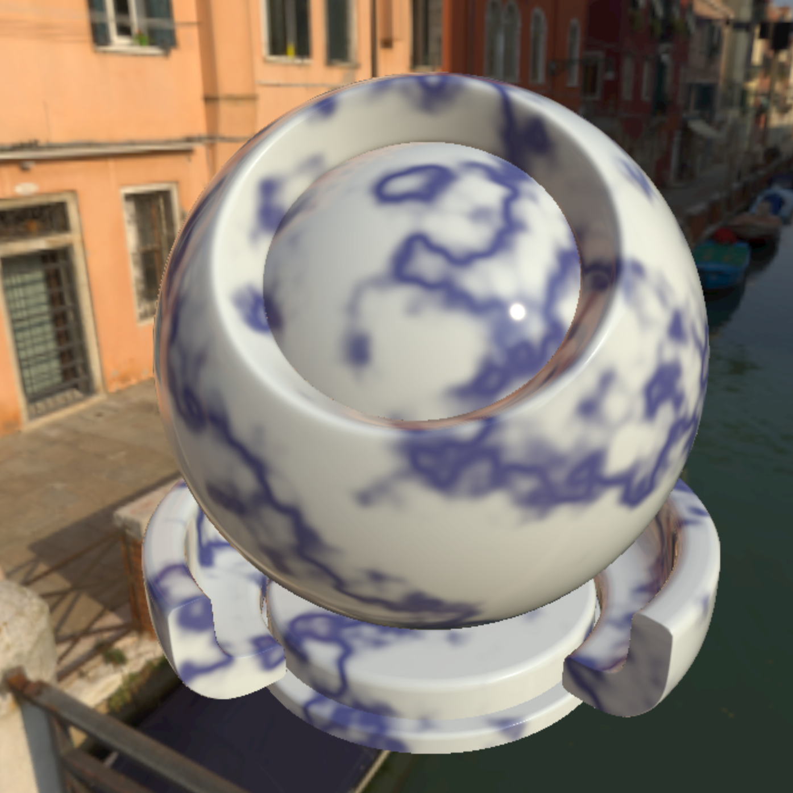
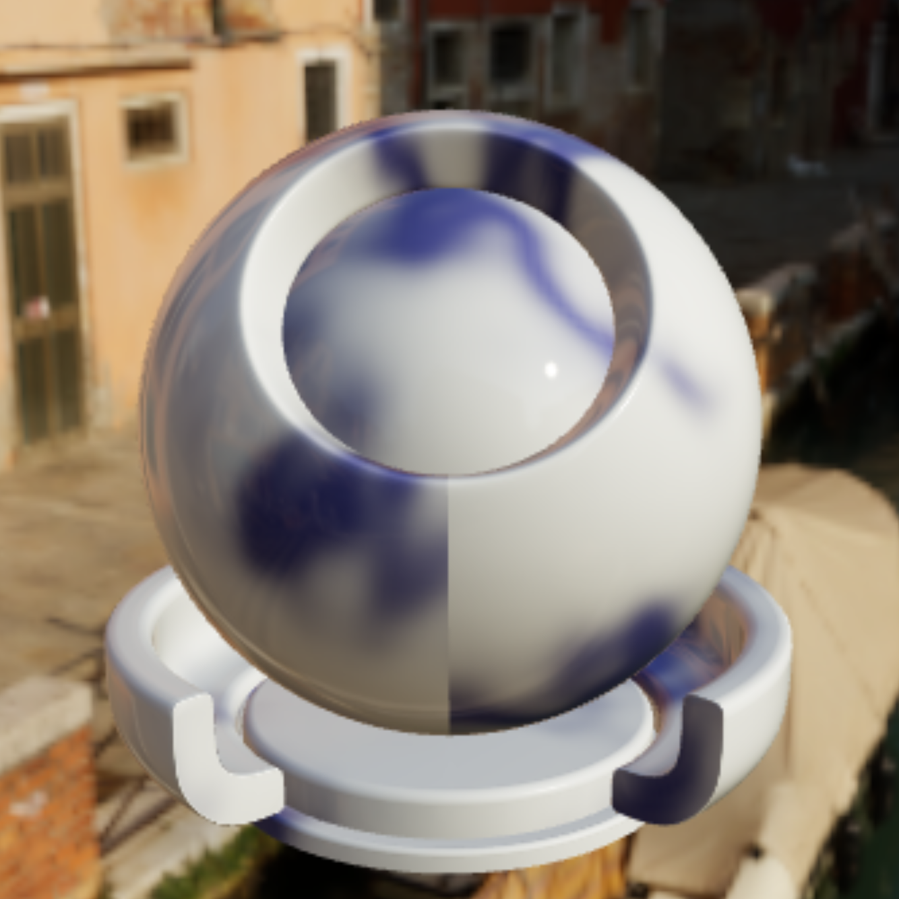
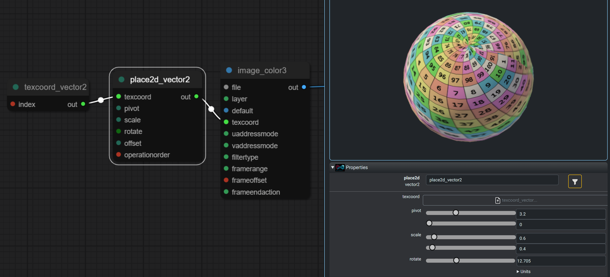
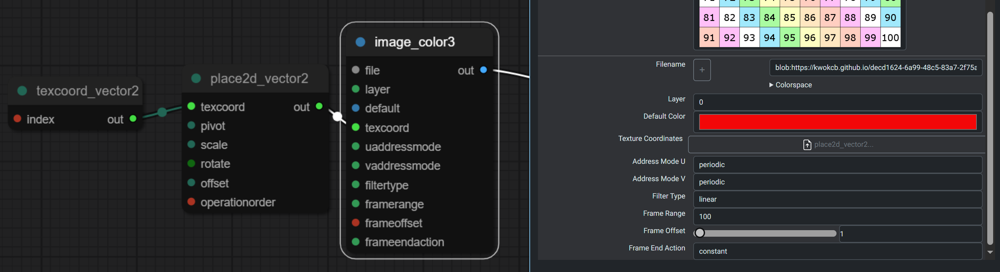
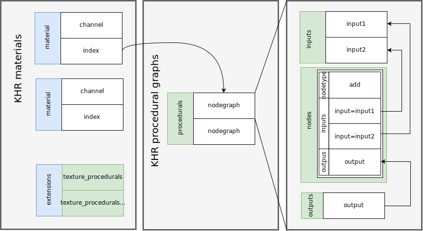
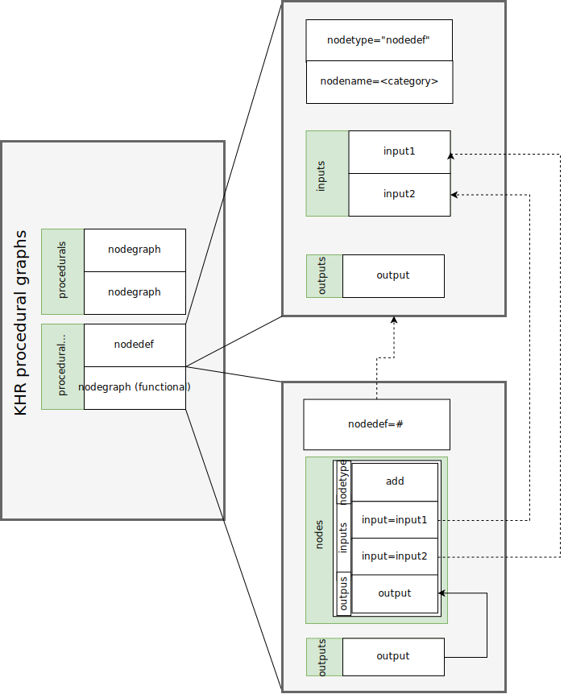
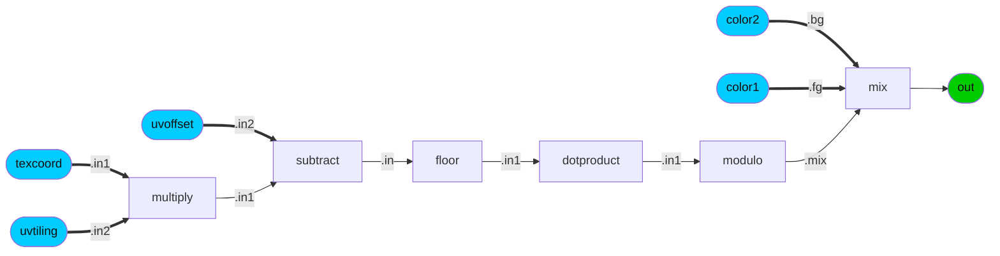
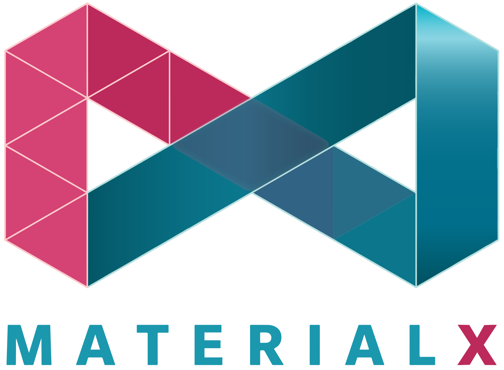

# KHR\_texture\_procedurals

## Contributors

- Ashwin Bhat, Autodesk, ashwin.bhat@autodesk.com
- Alexey Knyazev, Individual Contributor, [@lexaknyazev](https://github.com/lexaknyazev)
- Bernard Kwok, Individual Contributor, [@kwokcb](https://github.com/kwokcb)  
- Ed Mackey, AGI, [@emackey](https://twitter.com/emackey)
- Lutz Kettner, NVIDIA, lkettner@nvidia.com
- Richard Sahlin, IKEA [@rsahlin](https://github.com/rsahlin)
- Timothy Blut, NVIDIA, tblut@nvidia.com

Copyright 2024 The Khronos Group Inc.
See [Appendix](#appendix-full-khronos-copyright-statement) for full Khronos Copyright Statement.

## Status

Draft

## Dependencies

Written against the glTF 2.0 spec.

## Overview

This extension provides a standardized way to represent procedural graphs which can be mapped to material channels in glTF.

### Table of Contents

- [Motivation](#motivation)
- [Definitions](#definitions)
- [Extension Declaration](#extension-declaration)
- [Representation](#representation)
  - [Data Types](#data-types)
  - [Procedural Graphs](#procedural-graphs)
  - [Procedural Nodes](#procedural-nodes)
  - [Node Graph Connections](#node-graph-connections)
  - [Material Binding](#material-binding)
  - [Resource Binding](#resource-binding)
    - [Uniform Binding](#uniform-binding)
    - [Animation Binding](#animation-binding)
    - [Texture Binding](#texture-binding)
    - [Input Stream Binding](#input-stream-binding)
  - [Procedural Definitions](#procedural-definitions)
    - [Structure](#structure)
- [Structure Review](#structure-review)
- [JSON Schema](#json-schema)
- [Checkerboard Example](#checkerboard-example)
- [Resources](#resources)

### Motivation

Textures represented as procedural graphs provides a way to extend the capabilities of glTF materials beyond what is possible with traditional texture maps. Key objectives includes:

1. **Interoperability**: Adhere to an industry a standard node schema (MaterialX) with a runtime friendly JSON representation. 

    More specifically __only__ nodes defined in the MaterialX specification are supported. This ensures that the procedural graphs can be easily converted to MaterialX and USDShade graphs.

    For the first version of this extension nodes which are used to define shading models are not allowed. Please refer to the [resources](#resources) section for links to supported  MaterialX node definitions.

2. **Fidelity**: Provide the ability to generate complex patterns, noise, or other effects that currently must be "baked" into texture maps. Provide the ability to provide mappings from one shading model to another without baking in a consistent manner via procedural graphs. Provide the ability to map procedurals graphs to unlit materials. Reduces runtime memory usage by generating patterns / shading programmatically.

3. **Editability and Extensibility**: Extend runtime editability by exposing logic and interfaces for procedural graphs as well as providing a means to create new or extend existing node definitions.

4. **Validity**: Ensure that procedurals graphs can be validated both against a schema as well as against reference rendering implementations.

5. **Flexibility**: Support for procedural graphs is additive and can be used in conjunction with traditional texture maps. This allows for a hybrid approach where some textures can be baked and others are generated at runtime or both can be specified.

| Original | Baked |
| :---: | :---: |
|  |  |

<super>Example of a procedural versus a baked 3D marble texture. In this case re-baking is required for each geometry bound or / and when geometry is transformed</super>

### Definitions

The following is a set of definitions using MaterialX nomenclature to provide context for the procedural graph representation.

* A **Node** is a function that generates or operates upon spatially-varying data.  

* **Node Input and Output Ports** The interface for a node’s incoming data is declared through **input ports**, which may be spatially-varying or uniform. The interface for a node’s outgoing data is declared through **output ports**.  

* There is a specific set of supported **Data Types**. Every port must have a data type.

* A **Pattern** is a node that generates or processes simple scalar, vector, and color data, and has access to local properties of any geometry that has been bound to a given material.

* A **Node Graph** is a directed acyclic graph (DAG) of nodes, which may be used to define arbitrarily complex generation or processing networks.  Node Graphs describe a network of "pattern" nodes flowing into shader inputs, or define a complex or layered node in terms of simpler nodes. The former is called a **compound nodegraph** and the latter a **functional nodegraph**.

* Node Graph:
  * **Inputs** are nodes that define the interface for a graph’s incoming data.
  * **Outputs** are nodes that define the interface for a graph’s outgoing data.

* A **Node Definition** is a specification for a unique function with a given set of inputs and outputs. The logic for each function is represented either as a `functional graph` or as code. 

## Extension Declaration

Usage of the procedural structure is indicated by adding the `KHR_texture_procedurals` extension identifier to the `extensionsUsed` array.

```json
{
    "extensionsUsed": [
        "KHR_texture_procedurals"
    ]
}
``` 
To indicate the usage of a specific set of definitions an additional entry must be added to `extensionsUsed`. For example usage of definitions from a version of the MaterialX would look like this:

```json
{
    "extensionsUsed": [
        "KHR_texture_procedurals"
    ]
}
```
Usage of a given extension is defined in the `extensions` object as follows:
```json
{
    "extensions": {
        "KHR_texture_procedurals": {
            "procedurals": []
        }
    }
}
```
The `procedurals` array specifies the procedural graphs for a given set of nodes that are used in the glTF asset. 

### Data Types

The supported data types are:

* single `float`
* single `integer`
* tuples:
    * `color3`, `color4` : 3 and 4 channel color
    * `vector2`, `vector3`, `vector4` : 2, 3, 4 channel float vector
    * `integer2`, `integer3`, `integer4` : 2, 3, 4 channel integer vector
* matrix:
    * `matrix3x3`, and `matrix4x4` : Row-major matrices of floats of size 3 or 4.

Tuples and matrices are represented as arrays of values. For example, a `color3` is represented as an array of 3 floats: `[r, g, b]`.

### Procedural Graphs

One ore more procedurals graphs can be defined in the `procedurals` array. 

A graph __cannot__ be nested (contain another graph). Any such configurations must be “flattened” to single level graphs.

Each procedural graph object is composed of:

  * An optional string `name` identifier
  * A `nodetype` category which must be `nodegraph`
  * A `type` which is the output type of the graph. This is a supported data type, or `multioutput` if there is more than one output node for the graph.
  * Three array children:
    * `inputs` : lists input "interface" nodes for passing data into the graph.
    * `outputs` : lists output "interface" nodes for passing data out of the graph. See [Node Graph Connections](#node-graph-connections) for connection information.
    * `nodes` : processing nodes.
    
The structure of atomic nodes is described in  [Procedural Nodes](#procedural-nodes) section. 

Note that input and output node types are `input` and `output` respectively.

#### Graph Structure

```JSON
{ 
  "name": "<optional name>", 
  "nodetype": "nodegraph",
  "type": "<data-type>",
  "inputs": [],
  "outputs": [],
  "nodes": []
}
```

### Procedural Nodes

* An atomic function is represented as a single node with the following properties:

    * An optional string `name` identifier

    * `nodetype` : a string identifier for the node type. This is a MaterialX node type or a custom node type.

    * `type` : the output type of the node. This is a supported data type or `multioutput` if there is more than one output for the node.

    * A list of input ports under an `inputs` array.
    If an `input` is specified it's input value overrides that of the node definition default.
    
    * A list of output ports under an `outputs` array. Every `output` defined by the node's definition __must__ be specified. 

    * Each input port:
        * Must have a node type: `input`
        * May have an optional string `name` identifier
        * Must have a `type` which is a supported data type.
        * Either:
          * A `value` which is a constant value for the node. or
          * A connection specifier. See [Node Graph Connections](#node-graph-connections) for allowed connections.
    
    * All `output` ports specified by the node's definition must be specified for each node instance. Each output port:
        * Must have a node type: `output`
        * Must have a `type` which is a supported data type.

#### Node Structure

```JSON
{
  "name": "<node name>",
  "nodetype": "<node type>",
  "type": "<data type>",
  "inputs": [],
  "outputs": []
}
```

where an each input port in the `inputs` array  has the following structure:

```JSON
{
  "name": "<input name>",
  "nodetype": "input",
  "type": "<data type>",
  "value": <value> or
  "node": <processing node index> or
  "input": <input node index> or
  "output": <output node index>
}
```
and each output port in the `outputs` array has the following structure:

```JSON
{
  "name": "<input name>",
  "nodetype": "output",
  "type": "<data type>",
}
```

### Node Graph Connections

Connections inside a graph can be made:

* To a `node input` from a an `nodegraph input` by specifying a `input` value which is an index into the graph's `inputs` array.
* To a `node input` from a node `output` by specifying a `node` value which is an index into the graph's `nodes` array.
* To a nodegraph `output` from a node `output` by specifying a `node` value which is an index into the graph's `nodes` array.

If the upstream node has multiple outputs, then an `output` value which is an index into the the upstream nodes `outputs` array  __must__ additionally be specified. 


The following example shows all the combinations of connections are shown. The sample logic adds two colors together and outputs the result. 

* One color is exposed as a graph input (`graph_in`), while the other is internal to the graph as a constant node (`constant1`). 
* The add node (`add1`) has two input ports which take as input the result of `graph_in` and `constant1`.
* The output node on the graph (`graph_out`) is used to route the output value from the add node.

Note that the output ports are specified even if the upstream node only has one output port.

<details>
<summary>Example</summary>

```JSON
{
  "procedurals" [
    {
      "name": "nodegraph1",
      "nodetype": "nodegraph",
      "type": "color3",
      "inputs": [
        {
          "name": "graph_in",
          "nodetype": "input",
          "type": "color3",
          "value": [ 1, 0, 0 ]
        }
      ],
      "nodes" [
          {
            "name": "constant1",
            "nodetype": "constant",
            "type": "color3",
            "value": [ 1, 1, 0 ],
            "outputs": [
              {
                "name": "out",
                "nodetype": "output",
                "type": "color3"
              }
            ]
          },
          {
            "name": "add1",
            "nodetype": "add",
            "type": "color3",
            "inputs": [
              {
                "name": "in1",
                "nodetype": "input",
                "type": "color3",
                "value": [ 1, 0, 0 ]
              },
              {
                "name": "in2",
                "nodetype": "input",
                "type": "color3",
                "node": 0,
                "output": 0
              }
            ],
            "outputs": [
              {
                "name": "out",
                "nodetype": "output",
                "type": "color3"                
              }
            ]
          }
        ],

        "outputs" [
          {
            "name": "graph_out",
            "nodetype": "output",
            "type": "color3",
            "node": 1,
            "output": 0
          },
        ]
    }
}
```

</details>

### Material Binding

It is allowable to connect any output of a procedural graph to any input on a supported downstream material. That is arbitrary N:M output to input connections are allowed. 

To connect a graph `output` to a surface or displacement shader input the procedural extension can be declared within the a texture reference for a given material in the `materials` array.

Material inputs that already support texture binding can support procedural graphs. This includes bindings such as:

- `baseColorTexture`
- `metallicRoughnessTexture`
- `occlusionTexture`
- `emissiveTexture`
- `diffuseTexture`

In this example the extension is specified on the `baseColorTexture` entry. The `index` value is a reference into the `procedurals` array.  If the procedural graph has multiple outputs than an `output` index must be specified to indicate which output in the graphs `outputs` array to use.

```JSON
"materials": [
   {
     "pbrMetallicRoughness": {
       "baseColorTexture": {
         "index": 0,
         "extensions": {
           "KHR_texture_procedurals": {
             "index": <"procedurals" array index>,
             "output": <"outputs" array index>
           }
         }
       }
     }
   }
]
``` 

__Notes__

If an existing texture binding packs values into a single tuple then a procedural graph must also pack the values into a single tuple. For example, a `metallicRoughnessTexture` is a multi-channel texture metallic and roughness are packed into different tuple channels. If a procedural graph is used to instead of texture then the graph must output a appropriate packed tuple.

At the current time each texture reference requires an `index` entry to be specified. This can be used to reference the "fallback" texture to use instead of the procedural graph. This could be the “baked” version of the graph, or simply reference an embedded 1 pixel “dummy” image that resides inside the glTF document.

```JSON
{
 "images": [
   {
     "url": "data:image/png;base64,iVBORw0KGgoAAAANSUhEUgAAAAEAAAABCAIAAACQd1PeAAAADElEQVQI12P4z/AfAAQAAf/zKSWvAAAAAElFTkSuQmCC"
   }
 ],
 "textures": [
   {
     "source": 0
   }
 ]
}
```
<super>Figure: Example of embedded "dummy" image</super>

### Resource Binding

A procedural graph's `input` nodes can be bound to either :

* a uniform value,
* a texture, or
* a geometric stream

#### Uniform Binding

Either constant or animated values may be bound. 

### Animation Binding

Animation bindings in glTF can be considered to equivalent to connection bindings in the context of MaterialX and OpenUSD. As all nodes must be contained within a procedural graph, only immediate child input nodes can be connected to and thus animated. That is, it is disallowed to "poke" inside of a graph and connect to interior  node inputs.

Any existing nodes in MaterialX or OpenUSD dealing with animation are ignored.

The [animation pointer extension](https://github.com/KhronosGroup/glTF/blob/main/extensions/2.0/Khronos/KHR_animation_pointer/README.md) extension allows
for a JSON path to be specified. For this extension an animation `pointer` would be a string path to an graph input of the form: 

```
"/extensions/procedurals/<node graph index>/inputs/<input index>"
```
where
`<node graph index>` is the index into the array of procedurals and
`input index>` is the index into the array in the "inputs" array for a given
procedural.

For the provided example the input color (vec3) pointer path would be:
```
"/extensions/procedurals/0/inputs/0"
```

The required data type support is a subset of those specified for the animation pointer extension. Specifically: `bool`, `float`, `float3`, `float4x4`, `float3x3`, `float4x4` and `int` types.

#### Texture / Image Binding

An `input` reference to an image is represented by an index to a `texture` element within the `textures` array object. If mapping from a MaterialX `filename`, then the resolved `filename` string can be used for the corresponding `image` source uri.

```JSON
{
 "images": [
   {
    "name": "image_color3",
    "mimeType": "image/webp",
    "url": "my_filename.wepb"
   }
 ],
 "textures": [
   {
    "name": "image_color3",
    "source": 1
   }
 ]
}
```
<super>Figure: This example shows a texture reference to an image with a `filename` of `"myfilename.wepb"`</super>

It is useful to include a `mimeType` for the image to indicate the desired codec support. This can include any codecs not supported by default -- such as `exr` format. The alternative is to pre-convert the image to a default supported format.
</super>

### Texture Placement / Sampling Binding

The following glTF texture information is ignored:
- The texture coordinate index from the texture info block (See the stream binding section)
- Placement information from the texture transform extension
- Any sampler objects specified on a texture (filtering, wrapping)

Information on the appropriate procedural nodes
will be used instead. For example the `<image>`,
`<place2d>` respectively for sampling and placement.

Below is a snapshot of a graph where the placement parameters and sampling are shown on right for the corresponding node:



The following is an eaxmple `image` node with sampling information:
```json
{
  "name": "image_color3",
  "nodetype": "image",
  "type": "color3",
  "inputs": [
    {
      "name": "uaddressmode",
      "nodetype": "input",
      "type": "string",
      "value": "clamp"
    },
    {
      "name": "vaddressmode",
      "nodetype": "input",
      "type": "string",
      "value": "clamp"
    }
  ]
}
```
The following is an example `place2d` node with placement information:
```json
{
  "name": "place2d_vector2",
  "nodetype": "place2d",
  "type": "vector2",
  "inputs": [
    {
      "name": "pivot",
      "nodetype": "input",
      "type": "vector2",
      "value": [0.1,0.5]
    },
    {
      "name": "scale",
      "nodetype": "input",
      "type": "vector2",
      "value": [0.3,0.4]
    },
    {
      "name": "rotate",
      "nodetype": "input",
      "type": "float",
      "value": 45.0
    },
    {
      "name": "offset",
      "nodetype": "input",
      "type": "vector2",
      "value": [0.01,0.01
      ]
    },
    {
      "name": "operationorder",
      "nodetype": "input",
      "type": "integer",
      "value": 1
    }
  ]
}
```

#### Input Stream Binding

Streams must be explicitly specified by a geometric procedural node for texture coordinates.

There are two variants for these types of nodes:
  1. Ones which specify the stream by number / index.
  2. Ones which specify the stream by a string identifier.

Only the first is supported. Others must be remapped to a numbered streams.

The stream number is a zero-based index used to lookup the corresponding stream type in a bound mesh's `primitives` array. There is no required sequential ordering for the streams.

For the texture coordinate example if the stream number is 1, the binding is to stream: `TEXCOORD_1` The mesh to check would be the one assigned to the material using the procedural graph.

Semantics for texture coordinate lookups are as follows:

1. The current [specification language for meshes]((https://registry.khronos.org/glTF/specs/2.0/glTF-2.0.html#meshes-overview)) notes that texture coordinates are **2 channel**. In order to support 3D texture coordinates it is proposed that the semantics of this binding be extended to allow 3 channel texture coordinates.

    This is currently beyond the scope of this extension, thus validation for
for this version will consider these nodes as being invalid.

2. Texture coordinates may be routed in a graph through one or more downstream nodes which may perform a mathematical operation on the coordinates. To avoid ambiguity any transform specified on a texture should be ignored / removed. 

For colors, a procedural node would be used to specify a color stream. A value of 1 would imply a binding to color stream `COLOR_1`.

<details>
<summary>Example graph using color and texture coordinate streams</summary>

```JSON
{
  "extensions": {
    "KHR_texture_procedurals": {
      "procedurals": [
        {
          "name": "nodegraph1",
          "nodetype": "nodegraph",
          "type": "color3",
          "nodes": [
            {
              "name": "geomcolor_color3",
              "nodetype": "geomcolor",
              "type": "color3",
              "inputs": [
                {
                  "name": "index",
                  "nodetype": "input",
                  "type": "integer",
                  "value": 1
                }
              ],
              "outputs": [
                {
                  "nodetype": "output",
                  "name": "out",
                  "type": "color3"
                }
              ]
            },
            {
              "name": "texcoord_vector2",
              "nodetype": "texcoord",
              "type": "vector2",
              "inputs": [
                {
                  "name": "index",
                  "nodetype": "input",
                  "type": "integer",
                  "value": 1
                }
              ],
              "outputs": [
                {
                  "nodetype": "output",
                  "name": "out",
                  "type": "vector2"
                }
              ]
            }
          ]
        }
      ]
    }
  }
}
```

<super>Figure: Note that the `value` for the `index` input is 1. This implies that the binding is to streams `TEXCOORD_1` and `COLOR_1` for nodes `a_texcoord_vector2` and `a_geomcolor_color3` respectively.</super>

The corresponding MaterialX representation would look like this:

```xml
<nodegraph name="nodegraph1">
  <geomcolor name="a_geomcolor_color3" type="color3">
    <input name="index" type="integer" value="1" />
  </geomcolor>
  <texcoord name="a_texcoord_vector2" type="vector2">
    <input name="index" type="integer" value="1" />
  </texcoord>
</nodegraph>
```

</details>


### Procedural Definitions

Procedural definitions can be added to custom 
node definitions. Minimally the nodes interfaces (`inputs` and `outputs`) and a corresponding procedural graph implementation are required.

The structure and semantics for declaring definitions matches that used in MaterialX. This allows for these definitions to be convertible to / from MaterialX and hence be consumable by `OpenUSD` (which can declare MaterialX definitions within it's shading node registry (`SDR`)). 

It is possible to create collections of definitions for reuse as desired. As there is no concept of a "library" in glTF, these definitions need to be declared in the `procedural_definitions` array for each glTF asset. (*Note*: If referencing of definitions is allowed then custom "library" reuse could be possible)

#### Structure

All declarations and functional graphs are specified in a separate `procedural_definitions` array within the KHR_texture_procedurals extension parent.

These elements are considered to be **immutable**
and **unconnectable**.

The properties for a definition include:

* `nodetype`: This must be be `nodedef`
* `node`: The name of the node type. Can be used wherever `nodetype` is specified for a node instance.
* `version`: An optional version string. If not specified then it is assumed to be the default version.
* `default`: A boolean flag to indicate if this is the default version of the definition. If not specified then it is assumed to be false.
* `nodegroup` The semantic grouping for this node. The final name for this will correspond with the matching release of MaterialX. The assumption is this will be `procedural` for the first version. 

* Child arrays of `inputs` and `outputs`. This is specified in the same manner as for a procedural graph. 

Each input __must__ have a `value` specified. This is the default value for the input when not specified on an instance of the node (*)

For each input it is useful to provide the following the following additional information as applicable:

  * `name` : A user friendly name for the input. It is strongy recommended to provide a name which starts with `ND_` to indicate that this is a node definition.
  * `unit` : The real-world unit of the input. This is used for interop with MaterialX and OpenUSD.
  * `colorspace` : The color space of the input. This is used for interop with MaterialX and OpenUSD.
  * `doc` : An optional string for documentation purposes.
  * `uimin`, `uimax`, `uistep`, `uifolder`: UI hints for the input. This is used to support editability for node editors.

Example:
```JSON
"procedural_definitions": [
   {
     "name": "<definition_name>",
     "nodetype": "nodedef", 
     "node": "<node type name>", 
     "nodegroup": "procedural", 
     "inputs": [],
     "outputs":[]
   }
]
```

<super>(*) Note that default geometric streams can be specified for some input types using the `defaultgeomprop` meta-data specifier. This would need to be converted to a numbered stream (_TBD how to map this_ )
</super>

A functional nodegraph has the following properties: 

* `name`: A unique name for the graph. It is strongly recommended to start the name with `NG_` to indicate that this is a node graph.
* `nodetype`: Must be `nodegraph`
* `nodedef` : Index into the `procedural_definitions` array to indicate the corresponding definition entry.
* A child array of `outputs`. The outputs must match those of the definition.

  It is considered invalid to specify a list of `inputs`.

```JSON
{
  "name": "<unique graph name",
  "nodetype": "nodegraph", 
  "type": "<output data type>", 
  "nodedef": <definition index>, 
  "outputs": [],
  "nodes": []
}
```

Below is the actual interface for the “checkerboard” definition as specified within MaterialX. The graph nodes have been omitted for clarity.

<details>
<summary>glTF definition</summary>

```JSON
{
 "procedural_definitions": [
   {
     // Definition
     "name": "ND_checkerboard_color3",
     "nodetype": "nodedef", 
     "node": "checkerboard", 
     "nodegroup": "procedural", 
     "inputs": [
       {
         "name": "color1",
         "doc": "The first color used in the checkerboard pattern.",
         "type": "color3",
         "value": [
           1.0,
           1.0,
           1.0
         ]
       },
       {
         "name": "color2",
         "doc": "The second color used in the checkerboard pattern.",
         "type": "color3",
         "value": [
           0.0,
           0.0,
           0.0
         ]
       },
       {
         "name": "uvtiling",
         "doc": "The tiling of the checkerboard pattern along each axis, with higher values producing smaller squares. Default is (8, 8).",
         "type": "vector2",
         "value": [
           8,
           8
         ]
       },
       {
         "name": "uvoffset",
         "doc": "The offset of the checkerboard pattern along each axis. Default is (0, 0).",
         "type": "vector2",
         "value": [
           0,
           0
         ]
       },
       {
         "name": "texcoord",
         "doc": "The input 2d space. Default is the first texture coordinates.",
         "type": "vector2",
         "defaultgeomprop": "UV0"
       }
     ],
     "outputs": [
       {
         "name": "out",
         "type": "color3"
       }
     ]
   },

// Functional node graph
   {
     "name": "NG_checkerboard_color3",
     "nodetype": "nodegraph", 
     "type": "color3", 
     "nodedef": 0, 
     "outputs": [
       {
         "name": "out",
         "type": "color3"
       }
     ],
     "nodes": [
       // Nodes omitted...
     ]
   }
 }
```

</details>

<p>
The corresponding definition and functional graph in MaterialX looks like this. 
<details>
<summary>MaterialX definition</summary>

```xml
<materialx version="1.38">
   <nodedef name="ND_checkerboard_color3" node="checkerboard" nodegroup="procedural2d">
       <input name="color1" type="color3" uiname="Color 1" value="1.0, 1.0, 1.0"
           doc="The first color used in the checkerboard pattern." />
       <input name="color2" type="color3" uiname="Color 2" value="0.0, 0.0, 0.0"
           doc="The second color used in the checkerboard pattern." />
       <input name="uvtiling" type="vector2" uiname="UV Tiling" value="8, 8"
           doc="The tiling of the checkerboard pattern along each axis, with higher values producing smaller squares. Default is (8, 8)." />
       <input name="uvoffset" type="vector2" uiname="UV Offset" value="0, 0"
           doc="The offset of the checkerboard pattern along each axis. Default is (0, 0)." />
       <input name="texcoord" type="vector2" uiname="Texture Coordinates" defaultgeomprop="UV0"
           doc="The input 2d space. Default is the first texture coordinates." />
       <output name="out" type="color3" />
   </nodedef>

   <!-- Node graph with reference to definition -->
   <nodegraph name= "NG_checkerboard_color3" type= "color" nodedef= "ND_checkerboard_color3">
       <output name="out" type="color3" />
       <!-- nodegraph implementation omitted  -->
   </nodegraph>
</materialx>   
```
</details>

## Structure Review

The following diagrams show the overall structure of the extension.

The following diagram shows the bindings between materials and compound graphs as well as structure and connections for a graph.


The following diagram shows the breakdown of a procedural graph definition and its associated node functional graph implementation.



## JSON Schema

The JSON schema for this extension is defined in the schema folder. 

[material.KHR_texture_procedurals.schema.json](schema/material.KHR_texture_procedurals_schema.json)

## Checkerboard Example

The following is a "checkerboard" pattern which is defined as a procedural graph. This graph is mapped to the "base color" on a material.


<sub>Example `checkerboard` graph from MaterialX</sub>

<details>
<summary>glTF Graph</summary>

```JSON
{
  "materials": [
    {
      "name": "gltf_pbr_surfaceshader",
      "pbrMetallicRoughness": {
        "baseColorTexture": {
          "index": 0,
          "extensions": {
            "KHR_texture_procedurals": {
              "index": 0
            }
          }
        }
      }
    }
  ],
  "textures": [
    {
      "source": 0
    }
  ],
  "images": [
    {
      "uri": "data:image/png;base64,iVBORw0KGgoAAAANSUhEUgAAAAEAAAABCAIAAACQd1PeAAAADElEQVQI12P4z/AfAAQAAf/zKSWvAAAAAElFTkSuQmCC",
      "name": "KHR_texture_procedural_fallback"
    }
  ],
  "extensionsUsed": [
    "KHR_texture_procedurals"
  ],
  "extensions": {
    "KHR_texture_procedurals": {
      "mimetype": "application/mtlx+json;version=1.38",
      "procedurals": [
        {
          "name": "My_Checker",
          "nodetype": "nodegraph",
          "type": "color3",
          "inputs": [
            {
              "name": "color1",
              "nodetype": "input",
              "type": "color3",
              "value": [
                1.0,
                0.0,
                0.0
              ]
            },
            {
              "name": "color2",
              "nodetype": "input",
              "type": "color3",
              "value": [
                0.0,
                1.0,
                0.0
              ]
            },
            {
              "name": "uvtiling",
              "nodetype": "input",
              "type": "vector2",
              "value": [
                8.0,
                8.0
              ]
            },
            {
              "name": "uvoffset",
              "nodetype": "input",
              "type": "vector2",
              "value": [
                0.0,
                0.0
              ]
            }
          ],
          "outputs": [
            {
              "name": "out",
              "nodetype": "output",
              "type": "color3",
              "node": 5
            }
          ],
          "nodes": [
            {
              "name": "N_mtlxmult",
              "nodetype": "multiply",
              "type": "vector2",
              "inputs": [
                {
                  "name": "in1",
                  "nodetype": "input",
                  "type": "vector2",
                  "node": 6
                },
                {
                  "name": "in2",
                  "nodetype": "input",
                  "type": "vector2",
                  "input": 2
                }
              ],
              "outputs": [
                {
                  "nodetype": "output",
                  "name": "out",
                  "type": "vector2"
                }
              ]
            },
            {
              "name": "N_mtlxsubtract",
              "nodetype": "subtract",
              "type": "vector2",
              "inputs": [
                {
                  "name": "in1",
                  "nodetype": "input",
                  "type": "vector2",
                  "node": 0
                },
                {
                  "name": "in2",
                  "nodetype": "input",
                  "type": "vector2",
                  "input": 3
                }
              ],
              "outputs": [
                {
                  "nodetype": "output",
                  "name": "out",
                  "type": "vector2"
                }
              ]
            },
            {
              "name": "N_mtlxfloor",
              "nodetype": "floor",
              "type": "vector2",
              "inputs": [
                {
                  "name": "in",
                  "nodetype": "input",
                  "type": "vector2",
                  "node": 1
                }
              ],
              "outputs": [
                {
                  "nodetype": "output",
                  "name": "out",
                  "type": "vector2"
                }
              ]
            },
            {
              "name": "N_mtlxdotproduct",
              "nodetype": "dotproduct",
              "type": "float",
              "inputs": [
                {
                  "name": "in1",
                  "nodetype": "input",
                  "type": "vector2",
                  "node": 2
                },
                {
                  "name": "in2",
                  "nodetype": "input",
                  "type": "vector2",
                  "value": [
                    1.0,
                    1.0
                  ]
                }
              ],
              "outputs": [
                {
                  "nodetype": "output",
                  "name": "out",
                  "type": "float"
                }
              ]
            },
            {
              "name": "N_modulo",
              "nodetype": "modulo",
              "type": "float",
              "inputs": [
                {
                  "name": "in1",
                  "nodetype": "input",
                  "type": "float",
                  "node": 3
                },
                {
                  "name": "in2",
                  "nodetype": "input",
                  "type": "float",
                  "value": 2.0
                }
              ],
              "outputs": [
                {
                  "nodetype": "output",
                  "name": "out",
                  "type": "float"
                }
              ]
            },
            {
              "name": "N_mtlxmix",
              "nodetype": "mix",
              "type": "color3",
              "inputs": [
                {
                  "name": "bg",
                  "nodetype": "input",
                  "type": "color3",
                  "input": 1
                },
                {
                  "name": "fg",
                  "nodetype": "input",
                  "type": "color3",
                  "input": 0
                },
                {
                  "name": "mix",
                  "nodetype": "input",
                  "type": "float",
                  "node": 4
                }
              ],
              "outputs": [
                {
                  "nodetype": "output",
                  "name": "out",
                  "type": "color3"
                }
              ]
            },
            {
              "name": "texcoord",
              "nodetype": "texcoord",
              "type": "vector2",
              "inputs": [
                {
                  "name": "index",
                  "nodetype": "input",
                  "type": "integer",
                  "value": 1
                }
              ],
              "outputs": [
                {
                  "nodetype": "output",
                  "name": "out",
                  "type": "vector2"
                }
              ]
            }
          ]
        }
      ]
    }
  }
}
```

</details>
<p>

The equivalent MaterialX representation is:

<details>
<summary>MaterialX Graph</summary>

```XML
<?xml version="1.0"?>
<materialx version="1.38">
  <nodegraph name="My_Checker">
    <input name="color1" type="color3" uiname="Color 1" value="1, 0, 0" doc="The first color used in the checkerboard pattern." />
    <input name="color2" type="color3" uiname="Color 2" value="0, 1, 0" doc="The second color used in the checkerboard pattern."  />
    <input name="uvtiling" type="vector2" uiname="UV Tiling" value="8, 8" doc="The tiling of the checkerboard pattern along each axis, with higher values producing smaller squares. Default is (8, 8)." />
    <input name="uvoffset" type="vector2" uiname="UV Offset" value="0, 0" doc="The offset of the checkerboard pattern along each axis. Default is (0, 0)." />
    <multiply name="N_mtlxmult" type="vector2" >
      <input name="in1" type="vector2" nodename="texcoord" />
      <input name="in2" type="vector2" interfacename="uvtiling" />
    </multiply>
    <subtract name="N_mtlxsubtract" type="vector2">
      <input name="in1" type="vector2" nodename="N_mtlxmult" />
      <input name="in2" type="vector2" interfacename="uvoffset" />
    </subtract>
    <floor name="N_mtlxfloor" type="vector2">
      <input name="in" type="vector2" nodename="N_mtlxsubtract" />
    </floor>
    <dotproduct name="N_mtlxdotproduct" type="float">
      <input name="in1" type="vector2" nodename="N_mtlxfloor" />
      <input name="in2" type="vector2" value="1, 1" />
    </dotproduct>
    <modulo name="N_modulo" type="float">
      <input name="in1" type="float" nodename="N_mtlxdotproduct" />
      <input name="in2" type="float" value="2" />
    </modulo>
    <mix name="N_mtlxmix" type="color3">
      <input name="bg" type="color3" interfacename="color2" />
      <input name="fg" type="color3" interfacename="color1" />
      <input name="mix" type="float" nodename="N_modulo" />
    </mix>
    <output name="out" type="color3" nodename="N_mtlxmix"/>
    <texcoord name="texcoord" type="vector2">
      <input name="index" type="integer" value="1" />
    </texcoord>
  </nodegraph>
  <gltf_pbr name="gltf_pbr_surfaceshader" type="surfaceshader" >
    <input name="base_color" type="color3" nodegraph="My_Checker" />
  </gltf_pbr>
  <surfacematerial name="surfacematerial" type="material">
    <input name="surfaceshader" type="surfaceshader" nodename="gltf_pbr_surfaceshader" />
  </surfacematerial>
</materialx>
```

</details>

<p>
The OpenUSD representation looks like this:

<details>
<summary>OpenUSD Graph</summary>

```c++
def "NodeGraphs"
    {
        def Shader "N_mtlxmix"
        {
            uniform token info:id = "ND_mix_color3"
            color3f inputs:bg = (0, 0, 0)
            color3f inputs:fg = (1, 1, 1)
            float inputs:mix = 0
            float inputs:mix.connect = </MaterialX/NodeGraphs/N_modulo.outputs:out>
            color3f outputs:out
        }

        def Shader "N_mtlxdotproduct"
        {
            uniform token info:id = "ND_dotproduct_vector2"
            float2 inputs:in1 = (0, 0)
            float2 inputs:in1.connect = </MaterialX/NodeGraphs/N_mtlxfloor.outputs:out>
            float2 inputs:in2 = (1, 1)
            float outputs:out
        }

        def Shader "N_mtlxmult"
        {
            uniform token info:id = "ND_multiply_vector2"
            float2 inputs:in1 = (0, 0)
            float2 inputs:in1.connect = </MaterialX/NodeGraphs/Texcoord.outputs:out>
            float2 inputs:in2 = (8, 8)
            float2 outputs:out
        }

        def Shader "N_mtlxsubtract"
        {
            uniform token info:id = "ND_subtract_vector2"
            float2 inputs:in1 = (0, 0)
            float2 inputs:in1.connect = </MaterialX/NodeGraphs/N_mtlxmult.outputs:out>
            float2 inputs:in2 = (0, 0)
            float2 outputs:out
        }

        def Shader "N_mtlxfloor"
        {
            uniform token info:id = "ND_floor_vector2"
            float2 inputs:in = (0, 0)
            float2 inputs:in.connect = </MaterialX/NodeGraphs/N_mtlxsubtract.outputs:out>
            float2 outputs:out
        }

        def Shader "N_modulo"
        {
            uniform token info:id = "ND_modulo_float"
            float inputs:in1 = 0
            float inputs:in1.connect = </MaterialX/NodeGraphs/N_mtlxdotproduct.outputs:out>
            float inputs:in2 = 2
            float outputs:out
        }

        def Shader "Texcoord"
        {
            uniform token info:id = "ND_texcoord_vector2"
            int inputs:index = 0
            float2 outputs:out
        }
    }
```

</details>

#### Checkerboard Variants

In the example below we create variants by declaring custom `checkerboard definition and using instances of this definition instances within a graph.

The inputs on each node instance are specified to to create a “red” and “green” variants.

<details>
<summary>Variants</summary>

```JSON
{
 "procedurals": [
   // Checkerboard variants graph 
   {      
     "name": "checkboard_variants",
     "nodetype": "nodegraph",
      "nodes": [
        {
          "name": "green_checkerboard",
          "nodetype": "checkerboard", 
          "type": "color3",
          "inputs": [
            {
              "name": "color1",
              "type": "color3",
              "value": [
                0,
                1,
                0
              ]
            }
          ],
          "outputs": [
            {
              "name": "out",
              "type": "color3"
            }
          ]
        },
        {
          "name" : "red_checkboard",
          "nodetype": "checkerboard",
          "type": "color3",
          "inputs": [
            {
              "name": "color1",
              "type": "color3",
              "value": [
                1,
                0,
                0
              ]
            }
          ],
          "outputs": [
            {
              "name": "out",
              "type": "color3"
            }
          ]
        }
      ],
        // Route the outputs of the checkerboard nodes
        "outputs": [
        {
          "name": "green_out",
          "type": "color3",
          "node": 0
        },
        {
          "name": "red_out",
          "type": "color3",
          "node": 1
        }
      ]    
   }
 ]
}
```

</details>

These procedural graphs can be bound to downstream materials as desired by chosing the appropriate output node.

<details>
<summary>Variant Binding</summary>

```JSON
{
 // Material references
 "materials": [
   {
     "name": "green_checker",
     "pbrMetallicRoughness": {
       "baseColorTexture": {
         "index": 0,
         "extensions": {
           "KHR_texture_procedurals": {
             "index": 0, // graph with variants
             "output": 0 // "green checker" variant
           }
         }
       }
     },
     "name": "red_checker",
     "pbrMetallicRoughness": {
       "baseColorTexture": {
         "index": 0,
         "extensions": {
           "KHR_texture_procedurals": {
             "index": 0, // graph with variants
             "output": 1 // "red checker" variant
           }
         }
       }
     }
   }
 ]
}
```

</details>

## Resources

- [MaterialX Specification Documents](https://github.com/AcademySoftwareFoundation/MaterialX/tree/main/documents/Specification). Refer top level folder documents only. The *v1.38* folder contains the specification which is not the target.
- Libraries usable for procedural definitions:
    - [stdlib](https://github.com/AcademySoftwareFoundation/MaterialX/blob/main/libraries/stdlib/stdlib_defs.mtlx) : Standard library nodes.
    - [nprlib](https://github.com/AcademySoftwareFoundation/MaterialX/blob/main/libraries/nprlib/nprlib_defs.mtlx) : Non-photo-realistic rendering nodes
    - [cmlib](https://github.com/AcademySoftwareFoundation/MaterialX/blob/main/libraries/cmlib/cmlib_defs.mtlx) : Color managenement nodes (OCIO based)
    - The nodes listed by group (`nodegroup`) are listed [here](
        https://materialx.nanmucreative.com/documents/definitions/definitions_by_group.html)
      - Groups of interest include:
        - `adjustment` : Smothstep is probably of most interest. Suggest to move to `math` group.  
        - `channel` : Tuple channel operations
        - `colortransform` : Color space transformations
        - `conditional` : Conditional logic
        - `math` : Mathematical operations
        - `npr` : Base nodes for non-photo-realistic rendering nodes
        - `procedural*` : Procedural nodes. This grouping will be clarified for the 1.39 release. Includes noise functions.
        - `textur2d` : 2D texture nodes including texture lookups
        - `geometric` : Geometry binding nodes
        - `translation` : Shading mode translation.

- OpenUSD
  - [USDShade Schema](https://openusd.org/dev/api/usd_shade_page_front.html)
  - [Shader Definition Registry](https://openusd.org/docs/api/sdr_page_front.html)
- glTF
  - [glTF stream names](https://registry.khronos.org/glTF/specs/2.0/glTF-2.0.html). Note that currently there are no stream names for multiple sets of _tangents_, _bitangents_, _normals_ or _positions_.

### glTF Versus MaterialX and OpenUSD

The aim is (as  much as possible) to preserve the"simplest" most consistent conventions from glTF, MaterialX and OpenUSD.

| Feature |  |  |  |
| --- | --- | --- | --- |
| **Object String Identifiers** | Yes | Yes | Optional |
| **Numeric Tuples** | string | list () | array [] |
| **Connection Syntax**" | string (name in context) | Absolute Path | numeric index |
| **Explicit Node Outputs** | No | Yes | Yes |
| **Node Type Grouping** | No | No | Yes |
| **Reference to nodedef on node instance** | Yes | Yes | No |
| **NodeGraph Nesting** | "Yes" (not implemented) | Yes | No |
| **Optional Input Overrides on Nodes** | Yes | Yes | Yes |
| **Referencing** | Yes | Yes | No |
| **Definition Versioning** | Yes | Yes | Yes |
| **Meta-Data** | Yes | Yes | Yes |
| **Node Definition** | Yes | Yes | Yes |

## Appendix: Full Khronos Copyright Statement

Copyright 2024 The Khronos Group Inc.

This Specification is protected by copyright laws and contains material proprietary to Khronos. Except as described by these terms, it or any components may not be reproduced, republished, distributed, transmitted, displayed, broadcast or otherwise exploited in any manner without the express prior written permission of Khronos.

Khronos grants a conditional copyright license to use and reproduce the unmodified Specification for any purpose, without fee or royalty, EXCEPT no licenses to any patent, trademark or other intellectual property rights are granted under these terms.

Khronos makes no, and expressly disclaims any, representations or warranties, express or implied, regarding this Specification, including, without limitation: merchantability, fitness for a particular purpose, non-infringement of any
intellectual property, correctness, accuracy, completeness, timeliness, and reliability. Under no circumstances will Khronos, or any of its Promoters, Contributors or Members, or their respective partners, officers, directors, employees, agents or representatives be liable for any damages, whether direct, indirect, special or consequential damages for lost revenues, lost profits, or otherwise, arising from or in connection with these materials.

This specification has been created under the Khronos Intellectual Property Rights Policy, which is Attachment A of the Khronos Group Membership Agreement available at https://www.khronos.org/files/member_agreement.pdf. Khronos grants a conditional copyright license to use and reproduce the unmodified specification for any purpose, without fee or royalty, EXCEPT no licenses to any patent, trademark or other intellectual property rights are granted under these terms. Parties desiring to implement the specification and make use of Khronos trademarks in relation to that implementation, and receive reciprocal patent license protection under the Khronos IP Policy must become Adopters and confirm the implementation as conformant under
the process defined by Khronos for this specification; see https://www.khronos.org/conformance/adopters/file-format-adopter-program.

Where this Specification identifies specific sections of external references, only those specifically identified sections define normative functionality. The Khronos Intellectual Property Rights Policy excludes external references to materials and associated enabling technology not created by Khronos from the Scope of this Specification, and any licenses that may be required to implement such referenced materials and associated technologies must be obtained separately and may involve royalty payments.

Khronos® is a registered trademark, and glTF™ is a trademark of The Khronos Group Inc. All other product names, trademarks, and/or company names are used solely for identification and belong to their respective owners.
