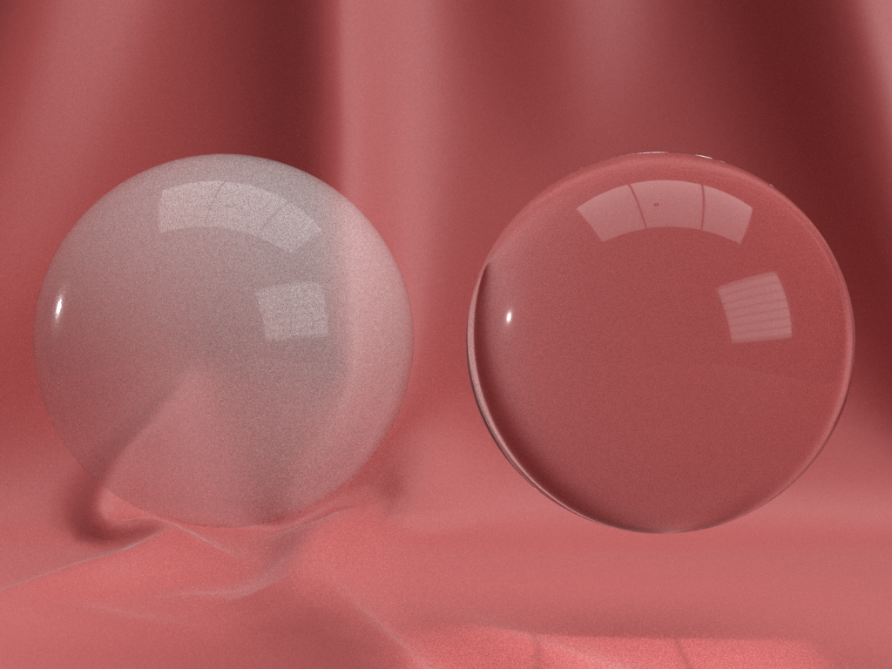
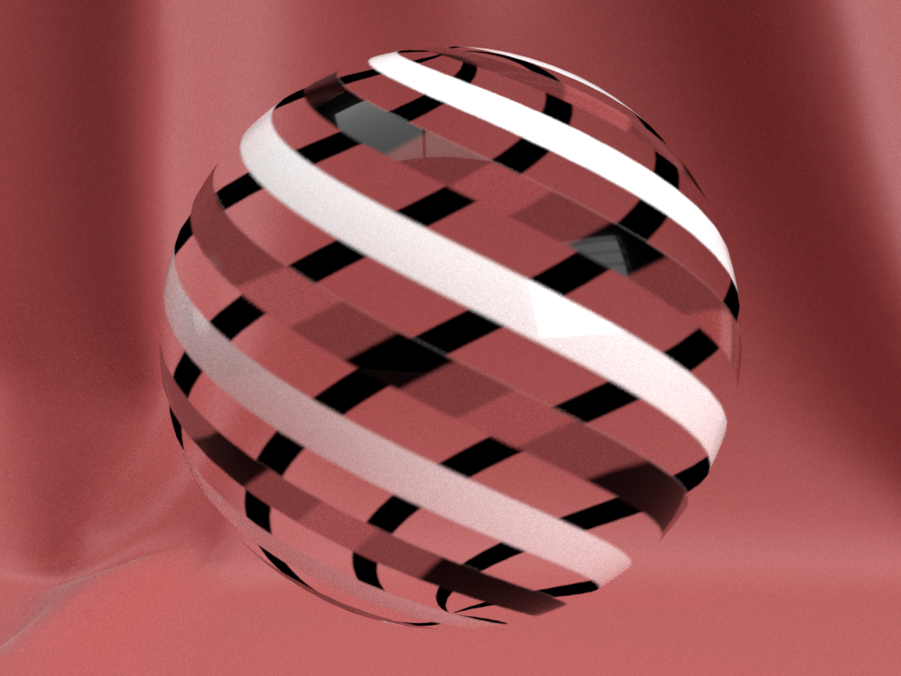
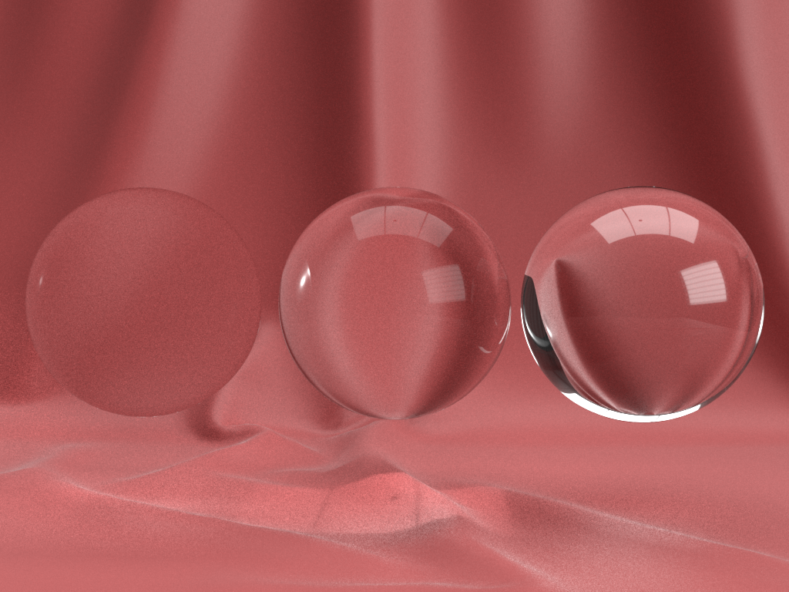
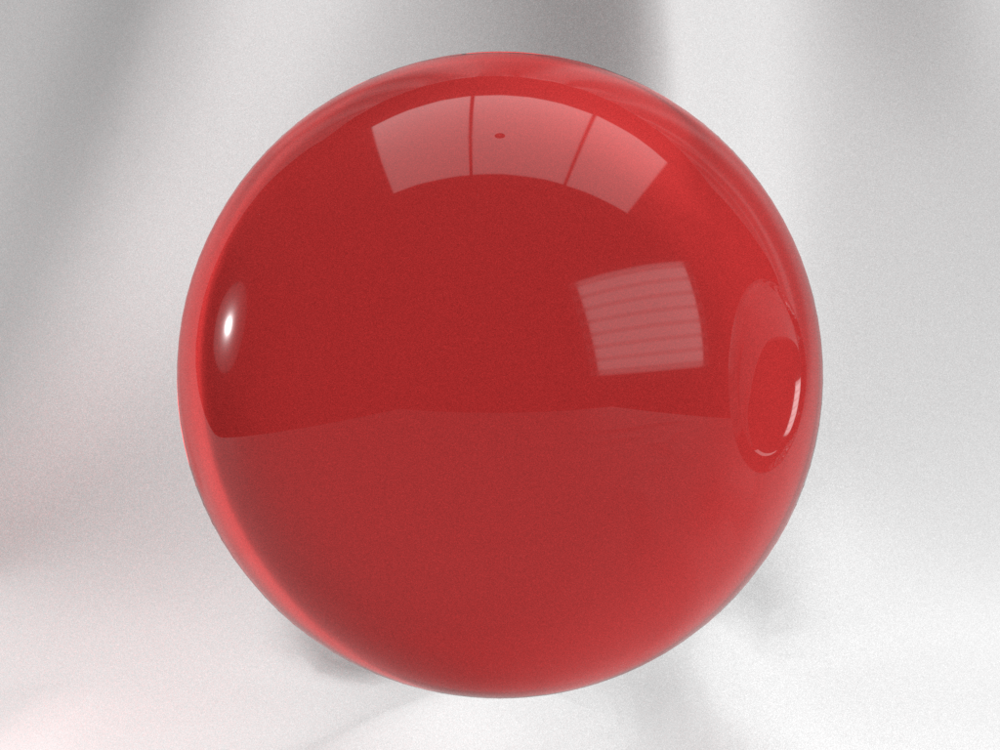
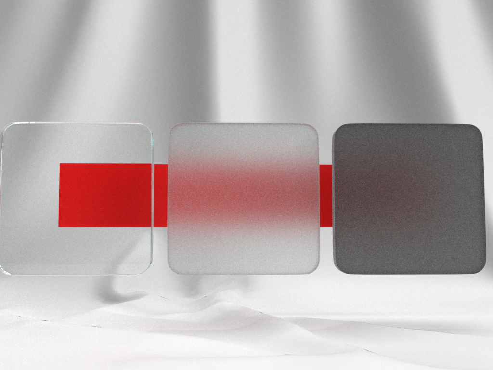
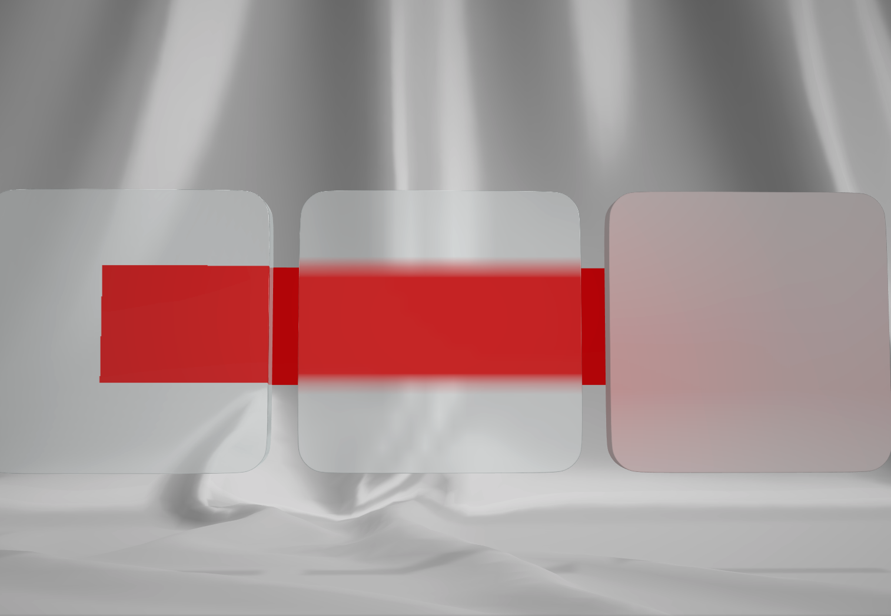

# ADOBE\_materials\_thin\_transparency

## Contributors

* Mike Bond, Adobe, [@miibond](https://twitter.com/miibond)

## Status

Adobe Vendor Extension - Currently supported only in the web-publish feature of Adobe Dimension CC 2.0.

## Dependencies

Written against the glTF 2.0 spec.

## Overview

Many optically transparent materials are impossible to represent in a physically plausible manner with the core glTF 2.0 PBR material. Alpha coverage (exposed via the alpha channel of `baseColorTexture`) is useful for transparent materials such as gauze that don’t reflect, refract, absorb or scatter light. However, most physical materials don’t fit into this category. Transparent glass and plastics are great examples of this. In the simplest case, specular reflections off the surface of the glass should still be visible on a fully transparent mesh. Using alpha coverage of 0% would make the reflections invisible as well.

<figure>

<figcaption><em>Alpha coverage of 20% (left) vs 100% optical transparency (right). Note that alpha coverage can't make the surface colourless, nor can it leave the specular reflections unaffected.</em></figcaption>
</figure>

This extension aims to address the simplest and most common use cases for optical transparency: thin materials with no complex scattering (e.g. dynamic scattering) or dispersion. Dealing exclusively with “thin” materials (i.e. materials where only the surface is considered and not the volume) allows many simplifications to be made when calculating things like refraction and absorption.  

## Extending Materials

A transparent material is defined by adding the `ADOBE_materials_thin_transparency` extension to any glTF material. When present, the extension indicates that a material should be rendered as a transparent surface and be blended as defined in the following spec. Alpha coverage and `doubleSided` properties still apply to transparent materials. Note that, as rendering transparent objects presents many difficult-to-solve issues with primitive ordering, this extension does not dictate rendering algorithms. The reference target of a rendering engine is assumed to follow the Painter's Algorithm.

```json
materials: [
  {
    "extensions": {
       "ADOBE_materials_thin_transparency": {
         "transmissionFactor": 0.8,
         "transmissionTexture": 0,
         "ior": 1.0
       }
    }
  }
]
```

## Properties 

Only three properties are introduced in this extension, two of which combine to describe a simple percentage of light that is transmitted through the material. The third property defines the index of refraction of the material. These properties work together with the existing properties of the material to define the way light is modified as it passes through the substance. 

|   |Type|Description|Required|
|---|----|-----------|--------|
|**transmissionFactor** | `number` | The base percentage of light transmitted through the surface.| No, default:`1.0`|
|**transmissionTexture** | [`textureInfo`] | A greyscale texture that defines the transmission percentage of the surface. This will be multiplied by transmissionFactor. | No |
|**ior** | `number` | The index of refraction of the material. | No. Default is `1.33` which is IOR for liquid water. |

### transmissionFactor 

The amount of light that is transmitted by the surface rather than absorbed and re-emitted. This is a percentage of all the light that penetrates a surface (i.e. isn’t specularly reflected) rather than a percentage of the total light that hits a surface. A value of 1.0 means that 100% of the light that penetrates the surface is transmitted through. 

### transmissionTexture 

A greyscale texture that defines the amount of light that is transmitted by the surface rather than absorbed and re-emitted. A value of 1.0 means that 100% of the light that penetrates the surface (i.e. isn’t specularly reflected) is transmitted through. The value is linear and is multiplied by the transmissionFactor to determine the total transmission value. Note that use of transmission values does not disallow usage of alpha coverage.

<figure>
  
<figcaption><em>Alpha coverage and optical transparency can be used at the same time so that some areas of a surface are transparent while others disappear entirely.</em></figcaption>
</figure>

### ior

The index of refraction of the material. The index of refraction affects the amount that light bends when entering and exiting the material as well as how much is reflected from the surface. Since this extension doesn’t deal with dispersion, the index of refraction is assumed to be the same for all wavelengths.

<figure>
  
<figcaption><em>From left to right: Indices of refraction of 1.03, 1.33 (water) and 1.8 (glass).</em></figcaption>
</figure>

## Modeling Absorption

Absorption is usually defined as an amount of light at each frequency that is absorbed over a given distance through a medium (usually described by Beer’s Law). However, since this extension deals exclusively with very thin surfaces, we can treat absorption as a constant. In fact, rather than absorbed light, we can talk about its inverse: transmitted light. The `baseColor` of the material serves this purpose as it already defines how the light that penetrates the surface is colored by the material. In this model, the transmitted light will be modulated by this color as it passes through.

<figure>
  
<figcaption><em>The baseColor of the material is used to tint the light being transmitted.</em></figcaption>
</figure>

### Implementing Absorption ###

Modeling absorption is relatively straightforward. From the [glTF BRDF](https://www.khronos.org/registry/glTF/specs/2.0/glTF-2.0.html#appendix-b-brdf-implementation), we have:

*f* = *f*<sub>*diffuse*</sub> + *f*<sub>*specular*</sub>
*f*<sub>*diffuse*</sub> = (1 - *F*) * *diffuse*
*f*<sub>*specular*</sub> = *F* * *G* * *D* / (4 * dot(*N*, *L*) * dot(*N*, *V*))

So,
*f* = mix(*f*<sub>*diffuse*</sub>, *f*<sub>*specular*</sub>, *F*), where *F* is the Surface Reflection Ratio.

Optical transparency does not require any changes whatsoever to the specular term so we essentially want to replace *f*<sub>*diffuse*</sub> with the transmitted light, *L*<sub>transmitted</sub>.

*f* = mix(mix(**f**<sub>*diffuse*</sub>, *L*<sub>transmitted</sub> * *M*, *T*), *f*<sub>*specular*</sub>, *F*)

Where **L**<sub>transmitted</sub> is the colour of light coming through the material, towards the eye, and already has refraction and scattering taken into account (as discussed below). *T* is the transmission value defined by this extension.

 
### Modeling Scattering

In this simple model of transparency, we deal only with the spread of light based on the roughness of the material and incidence of refraction. The material is assumed to be pure with no foreign particles causing any non-monochromatic scattering. Just as surface roughness blurs specularly-reflected light, it also blurs transmitted light. There is assumed to be no directional bias to the scattering (i.e. the scattering is isotropic) and surface multi-scattering is allowed. 

### Implementing Scattering

Implementations of this are expected to vary widely, especially in real-time engines, depending on the capabilities of the runtime, but should endeavor to achieve plausibility. Simple implementations may opt to apply prefiltered IBL or dynamic light probes in a refractive manner to simulate scattering while others may choose to sample from a blurred version of the rendered scene while rendering transparency. Raytracers are expected to use more physically correct refraction with a BSDF supporting multi-scattering like the modified [Smith](https://eheitzresearch.wordpress.com/240-2/) model.


<figure>
  
<figcaption><em>Roughness of 0, 0.5 and 1.0 using renderer in Adobe Dimension. Note that an issue in Dimension at the time of writing is causing rough surfaces to appear too dark.</em></figcaption>
</figure>

<figure>
  
<figcaption><em>Simple implementation using Babylon.js engine. This implementation uses the mip levels of the captured opaque scene to approximate scattering of transmitted light.</em></figcaption>
</figure>

 