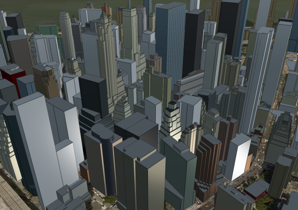
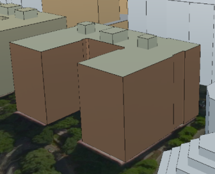

# CESIUM_primitive_outline

<figure>

<figcaption><em>Edges rendered on solid buildings using this extension. The buildings are derived from OpenStreetMap data in New York.</em></figcaption>
</figure>

## Contributors

- Kevin Ring, Cesium, [@kring](https://github.com/kring)
- Sean Lilley, Cesium, [@lilleyse](https://github.com/lilleyse)

## Status

Cesium Vendor Extension - Currently supported in [CesiumJS](https://cesium.com/cesiumjs) and in some of Cesium's content generation tools.

## Dependencies

Written against the glTF 2.0 spec.

## Overview

Non-photorealistic 3D objects, such as untextured buildings, are often more visually compelling when their edges are outlined. A simple approach to adding outlines to a glTF model is to add an additional primitive of type `LINES` to the model, drawing lines along the edges to be outlined. Unfortunately, the visual quality of such an approach is quite poor, because the lines depth fight with the triangles. The rasterization of the lines does not match the rasterization of the edges of the triangles.

<figure>

<figcaption><em>Stipling caused by depth fighting between separately-rendered lines and triangles.</em></figcaption>
</figure>

The traditional way to avoid this depth fighting is to use `glPolygonOffset` or similar. glTF 2.0, however, does not support specifying a polygon offset. Even if it did - or an extension were defined to support it - it's very difficult to get high quality rendering with this approach. Depending on the polygon offset values chosen, lines on the back-face may "bleed through" to the front because of too much depth bias, or lines may have a stipled look due to too little depth bias. Even with careful tuning of the polygon offset values, it's usually possible to detect both problems simultaneously in a single scene.

Even if these artifacts are deemed tolerable, rendering separate line primitives increases the number of draw calls required to render the scene. Furthermore, on some hardware, drawing lines is significantly slower than drawing triangles.

This extension indicates to a rendering engine that a list of triangle edges should be outlined. While it does not dictate how the rendering should be done, the fact that all of the lines are actually edges of triangles allows the rendering engine to use a higher quality - and faster - technique for rendering the lines, without needing to deduce the suitability of such a technique at runtime.

## Extending Primitives

Edge outlining is requested by adding the `CESIUM_primitive_outline` extension to a primitive rendered with `"mode": 4`, `TRIANGLES`.

```json
"meshes": [
    {
        "primitives": [
            {
                "attributes": {
                    "POSITION": 0,
                    "NORMAL": 1,
                    "_BATCHID": 2
                },
                "indices": 3,
                "material": 0,
                "mode": 4,
                "extensions": {
                    "CESIUM_primitive_outline": {
                        "indices": 4
                    }
                }
            }
        ]
    }
]
```

The `indices` property specifies the ID of an accessor with the locations of the edges. The accessor must contain an even number of elements of `componentType` `UNSIGNED_SHORT` (5123) or `UNSIGNED_INT` (5125) representing vertex indices on the primitive containing this extension. Each pair of indices specifies the endpoint vertices of an edge to be highlighted. These two vertices must also be two of the three vertices of one or more triangles; otherwise, the line will not be drawn at all.

## Implementation Notes

This extension does not dictate any specific rendering technique; it only requires that the outlines be drawn and that they avoid depth fighting with the solid geometry. However, most implementations will find it convenient to use a single-pass approach that renders the outlines as part of the triangles. For example, [Fast and versatile texture-based wireframe rendering](https://www.researchgate.net/publication/220067637_Fast_and_versatile_texture-based_wireframe_rendering) describes a technique that uses a mipmapped 1D texture and three sets of 1D texture coordinates to render high-quality, anti-aliased lines on the edges of triangles. This is the approach used in CesiumJS.

A fully-functional, open-source implementation of this extension was added to CesiumJS in [this pull request](https://github.com/CesiumGS/cesium/pull/8776).

## Justification

Strictly speaking, this extension is not required. A rendering engine could inspect all LINES primitives to see if they share vertices with a TRIANGLES primitive and, if so, use a different rendering technique to render lines that are coincident with triangle edges. However, this would add a significant runtime cost to match lines to triangle edges, and the cost would be imposed on all models that use lines, even those that would not benefit from this rendering technique. Therefore, this extension is primarily an optimization, allowing models to opt-in to single-pass, non-photorealistic edge rendering.

Using this extension also means that lines will not be drawn at all in rendering engines that do not support this extension. This is desirable because depth-fighting between lines and triangles looks very bad; we're probably better off not rendering the lines at all.
