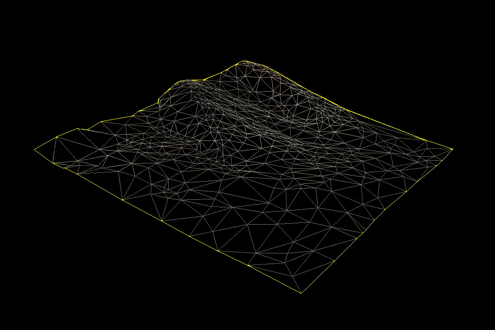
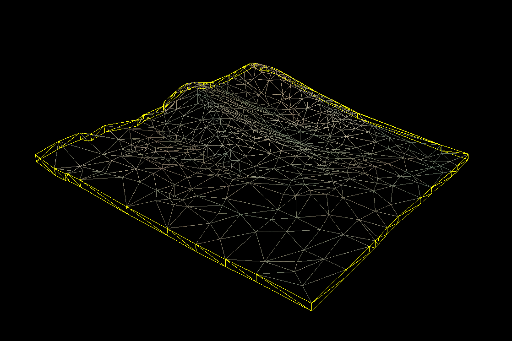
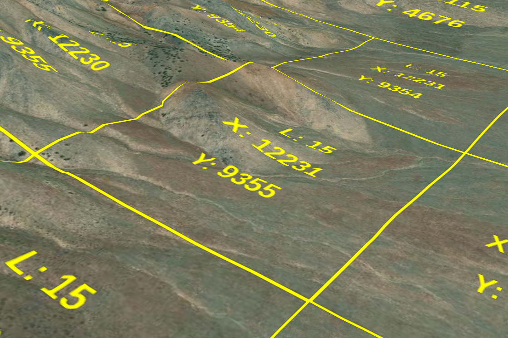

# CESIUM_tile_edges

## Contributors

* Ian Lilley, Cesium
* Sean Lilley, Cesium

## Status

Draft

## Dependencies

Written against the glTF 2.0 specification.

## Overview

This extension allows terrain tiles encoded in glTF to identify vertices that make up tile edges, modeled after [quantized-mesh](https://github.com/CesiumGS/quantized-mesh). It is helpful to know which vertices are on the edges in order to add skirts to hide cracks between adjacent levels of detail.

<table>
  <tr>
    <td>Single tile with edges highlighted</td>
    <td>Single tile with skirts generated at runtime</td>
    <td>Full tileset with tile coordinates superimposed</td>
  </tr>
  <tr>
    <td></td>
    <td></td>
    <td></td>
  </tr>
 </table>

```json
{
  "meshes": [
    {
      "primitives": [
        {
          "attributes": {
            "POSITION": 0,
            "NORMAL": 1
          },
          "indices": 2,
          "material": 0,
          "mode": 4,
          "extensions": {
            "CESIUM_tile_edges": {
              "left": 3,
              "bottom": 4,
              "right": 5,
              "top": 6
            }
          }
        }
      ]
    }
  ]
}
```

Each edge specifies the ID of an accessor containing indices of vertices that make up the edge. The accessor `componentType` must be `UNSIGNED_SHORT` (5123) or `UNSIGNED_INT` (5125).

The four edges form a counter-clockwise ring around the triangle mesh

* `left` indices are on the left edge (generally negative X) and are ordered from top to bottom (generally positive Z to negative Z)
* `bottom` indices are on the bottom edge (generally negative Z) and are ordered from left to right (generally negative X to positive X)
* `right` indices are on the right edge (generally positive X) and are ordered from bottom to top (generally negative Z to positive Z)
* `top` indices are on the top edge (generally positive Z) and are ordered from right to left (generally positive X to negative X)

## Optional vs. Required

This extension is optional, meaning it should be placed in the `extensionsUsed` list, but not in the `extensionsRequired` list.