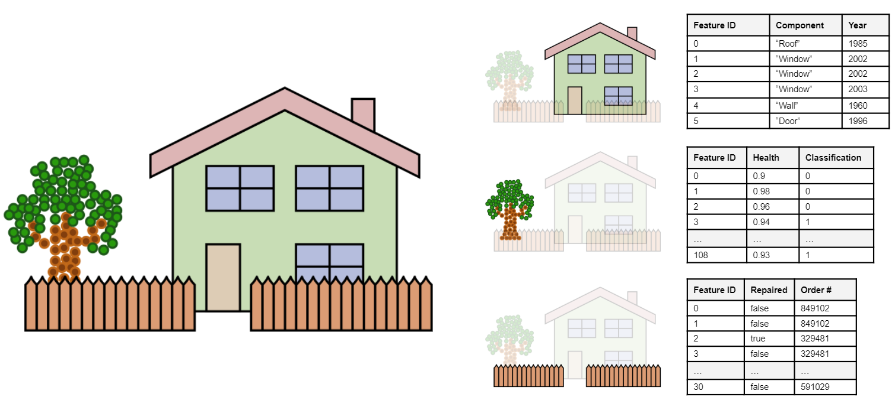

# EXT\_feature\_metadata

**Version 0.0.0** December 4, 2020

## Contributors

* Peter Gagliardi, Cesium
* Sean Lilley, Cesium
* Bao Tran, Cesium
* Sam Suhag, Cesium
* Samuel Vargas, Cesium
* Patrick Cozzi, Cesium

## Status

Draft

## Contents

- [EXT\_feature\_metadata](#ext_feature_metadata)
  - [Contributors](#contributors)
  - [Status](#status)
  - [Contents](#contents)
  - [Overview](#overview)
  - [Architecture](#architecture)
  - [Classes](#classes)
  - [Feature Tables](#feature-tables)
  - [Feature Textures](#feature-textures)
  - [Feature Identification](#feature-identification)
    - [Feature ID Accessors](#feature-id-accessors)
    - [Feature ID Mappings](#feature-id-mappings)
    - [Feature ID Textures](#feature-id-textures)
  - [Examples](#examples)

## Overview

This extension is an implementation of the [Cesium 3D Metadata Specification](https://github.com/CesiumGS/3d-tiles/blob/3d-tiles-next/specification/Metadata/README.md) using glTF as a base data format. This adds application-specific metadata to glTF models. This metadata can be defined both per-vertex and per-texel.

The Cesium 3D Metadata Specification defines two main concepts. **Classes** describe the data types of metadata. Meanwhile, an **instance** is a concrete entity with metadata that matches the format of a class. Instances are a broad concept, as they can refer to things as small as a vertex or as large as a collection of 3D models. In the context of this extension, an instance will always refer to a geometric entity (vertices or texels) with metadata. For this extension, the geospatial term **feature** is used instead of instance. This is more specific, and it avoids confusion with the concept of instancing from 3D graphics.

The Cesium 3D Metadata Specification uses integer **instance IDs** (this extension refers to them as **feature IDs**) to access the metadata for a single instance. However, it does not provide a way to label geometry with IDs. This extension defines several methods for **feature identification** the process of labeling geometry (vertices or textures) with a feature ID.

For a concrete example, consider a point cloud of the house, as in the diagram
below. The point cloud might be segmented into different regions (roof, window, walls, door), each with properties such as a component name or the year the component was built. The point cloud could also be considered as individual LiDAR samples with an intensity and temperature value. Both types of metadata can be described with this extension.


Also note that this extension is flexible, allowing for a mix of geometry types. In the below diagram, there are three separate glTF primitives. One is a point cloud, the other two are triangle meshes. Each primitive can be assigned metadata separately, so multiple types of objects can be modeled in a single glTF file.



## Architecture


This extension has three main parts:

1. [**Feature Identification**](#feature-identification) - What geometry corresponds to each feature? This process labels vertices of a primitive or texels of a texture with feature IDs.
2. **Metadata Storage** - In what format is the metadata and where in the glTF can it be found? This extension provides [feature tables](#feature-tables) for storing metadata in binary arrays and [feature textures](#feature-id-textures) for storing metadata in textures.
3. [**Class Definition**](#classes) - How is the metadata interpreted? This includes data type information, as well as other information.

## Classes

Classes are a collection of one or more related **properties**. Each property defines a single data field with a unique ID, type information, and other information such as a field name and description. Classes are defined in the root extension object, and comply with the definitions of classes from the [Cesium 3D Metadata Specification](https://github.com/CesiumGS/3d-tiles/blob/3d-tiles-next/specification/Metadata/0.0.0/README.md#classes).

Below is an example with several classes defined:

```json
{
  "extensions": {
    "EXT_feature_metadata": {
      "classes": {
        "car": {
          "name": "Car",
          "description": "Cars on the road",
          "properties": {
            "color": {
              "name": "Color",
              "description": "The body color of the car",
              "type": "STRING"
            },
            "driver": {
              "name": "Driver Name",
              "description": "The driver of the car",
              "type": "STRING"
            },
            "passengers": {
              "name": "Passenger Names",
              "description": "Other passengers in the car",
              "type": "ARRAY",
              "componentType": "STRING"
            },
            "fuelLevel": {
              "name": "Fuel Level",
              "description": "Fuel level from 0.0 (empty) to 100.0 (full tank/battery)",
              "type": "FLOAT32"
            },
            "isElectric": {
              "name": "Is Electric",
              "description": "True if car is a fully electric vehicle",
              "type": "BOOLEAN"
            }
          }
        },
        "building": {
          "name": "Building",
          "properties": {
            "height": {
              "name": "Height (m)",
              "type": "FLOAT64"
            },
            "address": {
              "name": "Street Address",
              "type": "STRING"
            },
            "coordinates": {
              "name": "Longitude/Latitude (degrees)",
              "description": "Geographic Coordinates",
              "type": "ARRAY",
              "componentType": "FLOAT64",
              "componentCount": 2
            },
            "occupants": {
              "name": "Number of Occupants",
              "type": "UINT32"
            }
          }
        },
        "elevation": {
          "name": "Elevation",
          "properties": {
            "elevation": {
              "name": "Elevation (m)",
              "description": "Elevation of the terrain in the scene (per-texel)",
              "type": "UINT8"
            }
          }
        }
      }
    }
  }
}
```

## Feature Tables


A **feature table** stores metadata for a class in a parallel array format. Each array is called a **property array** and corresponds to a class property. The data contained within a property array must match the data type of the class property. Furthermore, the set of property arrays must match one-to-one with the class properties.

Feature tables in this extension conform to the definition of "instance table" from the  [Cesium 3D Metadata Specification](https://github.com/CesiumGS/3d-tiles/blob/3d-tiles-next/specification/Metadata/0.0.0/README.md#instance-tables) except this extension uses slightly different terminology:

| `EXT_feature_metadata` Terminology | Equivalent Cesium 3D Metadata Terminology |
|---------|------|
| Feature Table | Instance Table |
| Feature ID | Instance ID |

The Cesium 3D Metadata Specification allows two possible encodings for feature tables: JSON and binary. However, this glTF extension **requires** [binary encoding](https://github.com/CesiumGS/3d-tiles/blob/3d-tiles-next/specification/Metadata/0.0.0/README.md#binary-encoding). Requiring binary encoding enforces best practices for runtime performance.

The binary encoding requires buffer views for storing the property arrays. glTF `bufferView`s fulfill this requirement exactly.

Like classes, feature tables are defined in the root extension object in the glTF model. See the example below:

```json
{
  "extensions": {
    "EXT_feature_metadata": {
      "classes": {
        "tree": {
          "properties": {
            "height": {
              "name": "Height (m)",
              "description": "Height of tree measured from ground level",
              "type": "FLOAT32"
            },
            "birdCount": {
              "name": "Bird Count",
              "description": "Number of birds perching on the tree",
              "type": "UINT8"
            },
            "species": {
              "name": "Species",
              "description": "Species of the tree",
              "type": "STRING"
            }
          }
        }
      },
      "featureTables": {
        "treeTable": {
          "class": "tree",
          "properties": {
            "height": {
              "bufferView": 3
            },
            "birdCount": {
              "bufferView": 4
            },
            "species": {
              "bufferView": 5,
              "offsetBufferViews": [6]
            }
          }
        }
      }
    }
  }
}
```

## Feature Textures


**Feature textures** (not to be confused with [Feature ID Textures](#feature-id-textures)) are an alternate form of metadata storage that uses textures rather than parallel arrays to store values. 

Feature textures are accessed directly by texture coordinates, rather than feature IDs. This makes them well-suited for representing properties that vary with position such as elevation heightmaps or vector fields.

Feature textures comply with the [Metadata Texture Encoding](https://github.com/CesiumGS/3d-tiles/blob/3d-tiles-next/specification/Metadata/0.0.0/README.md#metadata-texture-encoding) of the Cesium 3D Metadata Specification. However, the terminology in this extension is slightly different; "feature texture" is used instead of the more generic "metadata texture".

**Note**: in the core glTF standard, only PNG and JPEG textures are supported. This limits data types to those based on `UINT8`:

* `UINT8`
* normalized `UINT8` (the texture stores [0, 255], but values are remapped to [0, 1])
* `ARRAY` of `UINT8` with `componentCount` of `1-4`
* `ARRAY` of normalized `UINT8` with `componentCount` of `1-4`

In this glTF extension, textures are defined with the following steps:
1. A class is defined in the root `EXT_feature_metadata.classes` object. This is used to describe the metadata in the texture.
2. A feature texture is defined in the root `EXT_feature_metadata.featureTextures` object. This must reference the class ID defined in step 1.
3. A feature texture is associated with a primitive by listing the feature texture ID in the `primitive.EXT_feature_metadata.featureTextures` array.

Example:

```json
{
  "extensions": {
    "EXT_feature_metadata": {
      "classes": {
        "elevation": {
          "name": "Elevation",
          "properties": {
            "elevation": {
              "name": "Elevation (m)",
              "description": "Elevation above the WGS84 ellipsoid"
            }
          }
        }
      },
      "featureTextures": {
        "elevationTexture": {
          "class": "elevation",
          "properties": {
            "elevation": {
              "texture": {
                "index": 0,
                "texCoord": 0
              },
              "channels": "r"
            }
          }
        }
      }
    }
  },
  "images": [
    {
      "mimeType": "image/png",
      "name": "Elevation Heightmap",
      "uri": "elevation.png"
    }
  ],
  "textures": [
    {
      "name": "Elevation Texture",
      "source": 0
    }
  ],
  "meshes": [
    {
      "name": "Feature Texture Example",
      "primitives": [
        {
          "attributes": {
            "POSITION": 0,
            "NORMAL": 1,
            "TEXCOORD_0": 2
          },
          "indices": 3,
          "material": 0,
          "extensions": {
            "EXT_feature_metadata": {
              "featureTextures": ["elevationTexture"]
            }
          }
        }
      ]
    }
  ],
}
```

## Feature Identification

The Cesium 3D Metadata Specification lets the implementation determine how to identify features. This glTF extension provides three different methods for associating vertices or texels with **feature IDs**.

### Feature ID Accessors


The most straightforward method for defining feature IDs is to store them directly in a buffer. In this extension, this is done by using a glTF vertex attribute. Feature ID attributes must follow the naming convention `_FEATURE_ID_X` where `X` is a non-negative integer. The first feature ID attribute is `_FEATURE_ID_0`, the second `_FEATURE_ID_1`, and so on.

**Note**: Since glTF accessors do not support `UNSIGNED_INT` types for 32-bit integer, `FLOAT` may be used instead. This allows for integer feature IDs up to `2e24`. For smaller ranges of feature IDs, `UNSIGNED_BYTE` or `UNSIGNED_SHORT` can still be used. Note that this requires aligning each feature ID to 4-byte boundaries to adhere to glTF's alignment rules.

Once the attribute is defined, it must be associated with a primitive. This is done by setting `featureIds.attribute` to reference the `_FEATURE_ID_X`. See the following code snippet for an example of this.

```json
{
  "meshes": [
    {
      "name": "Point Cloud Mesh",
      "primitives": [
        {
          "attributes": {
            "POSITION": 0,
            "_FEATURE_ID_0": 1
          },
          "mode": 0,
          "extensions": {
            "EXT_feature_metadata": {
              "featureIdAttributes": [
                {
                  "featureTable": "rooms",
                  "featureIds": {
                    "attribute": "_FEATURE_ID_0"
                  }
                }
              ]
            }
          }
        }
      ]
    }
  ],
  "extensions": {
    "EXT_feature_metadata": {
      "classes": {
        "room": {
          "name": "Room",
          "description": "room of the house",
          "properties": {
            "name": {
              "description": "Name of the room such as 'kitchen' or 'living room'", 
              "type": "STRING"
            },
            "wallColor": {
              "name": "Wall Color",
              "type": "STRING"
            },
            "area": {
              "name": "Area (m^2)",
              "type": "FLOAT32"
            },
            "furniture": {
              "name": "Furniture",
              "description": "List of furniture in the room such as 'chair' or 'table'",
              "type": "ARRAY",
              "componentType": "STRING"
            }
          }
        }
      },
      "featureTables": {
        "rooms": {
          "class": "room",
          "count": 8,
          "properties": {
            "name": {
              "bufferView": 4,
              "offsetBufferViews": [5]
            },
            "wallColor": {
              "bufferView": 6,
              "offsetBufferViews": [7]
            },
            "area": {
              "bufferView": 8,
            },
            "furniture": {
              "bufferView": 9,
              "offsetBufferViews": [10, 11]
            }
          }
        }
      }
    }
  }
}
```

### Feature ID Mappings


For large datasets, explicitly listing every feature ID can be expensive. To help avoid this, **feature ID mappings** allow for an implicit feature ID numbering scheme for common cases. The "mapping" is between `vertex ID -> feature ID` for each vertex of a single primitive.

The common cases are as follows:

* All vertices in a primitive have the same feature ID
* Each vertex in a primitive has a different feature ID

Though in general, feature ID mappings can be used as long as the numbering scheme can be described with the formula `featureId = constant + vertexId * vertexStride`. 

| Case | `constant` | `vertexStride` |
|------|------------|----------------|
| All vertices have a feature ID of `C` | `C` | 0 |
| Each vertex unique: `C, C+1, C+2...` | `C` | 1 |
| General case: `C, C+S, C+2S...` | `C` | `S` |

The feature ID mapping is associated with a primitive by setting `featureIds.constant` and `featureIds.vertexStride`. See the example below.

**Note**: Since feature ID mappings are described by a formula, the range of feature IDs can be arbitrarily large. Implementations should use the largest size unsigned integer type available to represent feature IDs in this case to maximize flexibility. For example, on a 64-bit CPU-based implementation, an `uint64_t` would be a good idea.

The example below demonstrates a couple different use cases for feature ID mappings. The ocean point cloud is an example of per-vertex metadata, where the feature IDs are `0, 1, 2, 3, 4, ..., 9999`. Meanwhile, for the fish, there is metadata per-primtive. In other words, each vertex of the first primitive has feature ID `0`, while the vertices of the second primitive have feature ID `1`. This can be accomplished by setting the `vertexStride` to `0` (so every vertex has the same value) and the `constant` to the desired feature ID (`0` or `1` in this case). This produces feature IDs `0, 0, ..., 0` for the first primitive and `1, 1, ..., 1` for the second.

```json
{
  "extensions": {
    "EXT_feature_metadata": {
      "classes": {
        "ocean": {
          "name": "Ocean Point Cloud",
          "properties": {
            "depth": {
              "name": "Depth(m)",
              "description": "Depth below mean sea level",
              "type": "FLOAT64"
            },
            "temperature": {
              "name": "Temperature (°C)",
              "type": "FLOAT64"
            },
            "pressure": {
              "name": "Pressure (kPa)",
              "type": "FLOAT64",
            },
            "density": {
              "name": "Density (kg/m^3)",
              "type": "FLOAT64"
            }
          }
        },
        "fish": {
          "name": "Fish",
          "properties": {
            "species": {
              "type": "STRING"
            },
            "scaleColor": {
              "type": "STRING"
            }
          }
        }
      },
      "featureTables": {
        "oceanTable": {
          "class": "ocean",
          "count": 10000,
          "properties": {
            "depth": {
              "bufferView": 8
            },
            "temperature": {
              "bufferView": 9
            },
            "pressure": {
              "bufferView": 10
            },
            "density": {
              "bufferView": 11
            }
          }
        },
        "fishTable": {
          "class": "fish",
          "count": 2,
          "properties": {
            "species": {
              "bufferView": 12,
              "offsetBufferViews": [13]
            },
            "scaleColor": {
              "bufferView": 14,
              "offsetBufferViews": [15]
            }
          }
        }
      }
    }
  },
  "meshes": [
    {
      "name": "Water Point Cloud",
      "primitives": [
        {
          "attributes": {
            "POSITION": 0
          },
          "mode": 0,
          "extensions": {
            "EXT_feature_metadata": {
              "featureIdAttributes": [
                {
                  "featureTable": "oceanTable",
                  "featureIds": {
                    "constant": 0,
                    "vertexStride": 1
                  }
                }
              ]
            }
          }
        }
      ]
    },
    {
      "name": "Fish",
      "primitives": [
        { 
          "attributes": {
            "POSITION": 1
          },
          "mode": 0,
          "extensions": {
            "EXT_feature_metadata": {
              "featureIdAttributes": [
                {
                  "featureTable": "fishTable",
                  "featureIds": {
                    "constant": 0,
                    "vertexStride": 0
                  }
                }
              ]
            }
          }
        },
        {
          "attributes": {
            "POSITION": 2
          },
          "mode": 0,
          "extensions": {
            "EXT_feature_metadata": {
              "featureIdAttributes": [
                {
                  "featureTable": "fishTable",
                  "featureIds": {
                    "constant": 1,
                    "vertexStride": 0
                  }
                }
              ]
            }
          }
        }
      ]
    }
  ]
}
```

### Feature ID Textures


Sometimes it is helpful to classify the pixels of an image into different features. Some examples include segmenting an image in a computer vision project or marking regions on a map. This extension makes it possible to add metadata for these cases with the help of **feature ID textures** (not to be confused with [Feature Textures](#feature-textures)). These are simply 1-channel unsigned integer textures that store one feature ID per texel. These feature IDs can be used to index into a feature table.

**Note**: core glTF only supports PNG/JPEG textures. This effectively limits the range of feature IDs to 0-255 (i.e. a `UINT8`)

Defining a feature ID texture requires the following steps:

1. Define a class and feature table as usual (see [Feature Tables](#feature-tables))
2. Define a feature texture in a primitive's `EXT_feature_metadata.featureIdTextures` object. See the example below.

**Note**: When defining the texture `channels` must be a single-channel texture (e.g. `r`, `g`, `b` or `a`).

```json
{
  "extensions": {
    "EXT_feature_metadata": {
      "classes": {
        "county": {
          "name": "County",
          "description": "This example demonstrates how one might classify ortho imagery into a map of different jurisdictions via a feature ID texture.",
          "properties": {
            "countyName": {
              "name": "County Name",
              "type": "STRING"
            },
            "population": {
              "name": "Population",
              "type": "UINT32"
            },
            "area": {
              "name": "Area (km^2)",
              "type": "FLOAT64"
            }
          }
        }
      },
      "featureTables": {
        "countyTable": {
          "class": "county",
          "properties": {
            "countyName": {
              "bufferView": 7,
              "offsetBufferViews": [8]
            },
            "population": {
              "bufferView": 9
            },
            "area": {
              "bufferView": 10
            }
          }
        }
      }
    }
  },
  "images": [
    {
      "mimeType": "image/png",
      "name": "County Boundaries Texture",
      "uri": "county-boundaries.png"
    }
  ],
  "textures": [
    {
      "name": "County Boundaries Texture",
      "source": 0
    }
  ],
  "meshes": [
    {
      "name": "Feature ID Texture Example",
      "primitives": [
        {
          "attributes": {
            "POSITION": 0,
            "NORMAL": 1,
            "TEXCOORD_0": 2
          },
          "indices": 3,
          "material": 0,
          "extensions": {
            "EXT_feature_metadata": {
              "featureIdTextures": [
                {
                  "featureTable": "countyTable",
                  "featureIds": {
                    "texture": {
                      "texCoord": 0,
                      "index": 0
                    },
                    "channels": "r"
                  }
                }
              ]
            }
          }
        }
      ]
    }
  ]
}
```

## Examples

* [microcosm](examples/microcosm/README.md) - Texture metadata example
* [weather](examples/weather/README.md) - per-vertex metadata example