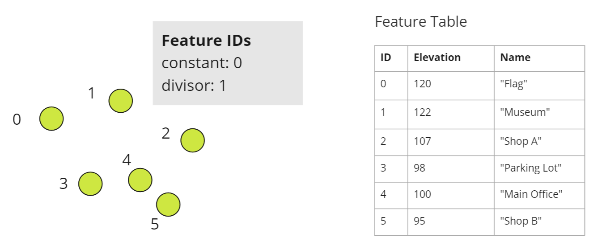
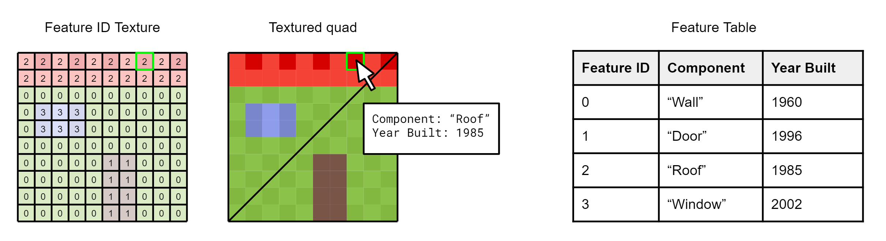
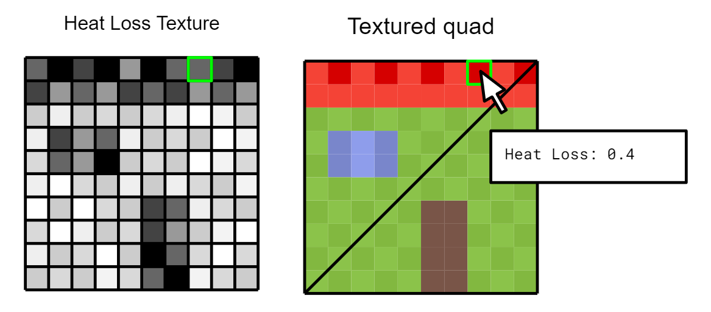
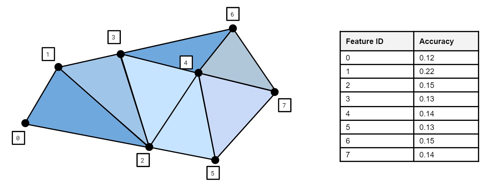
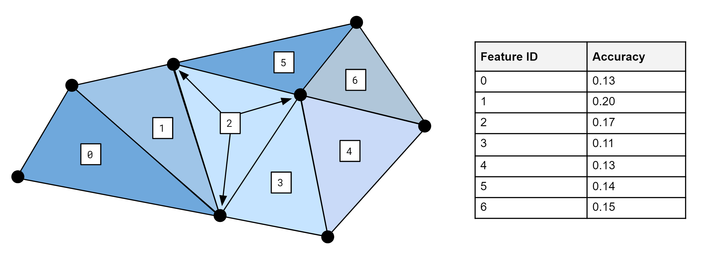
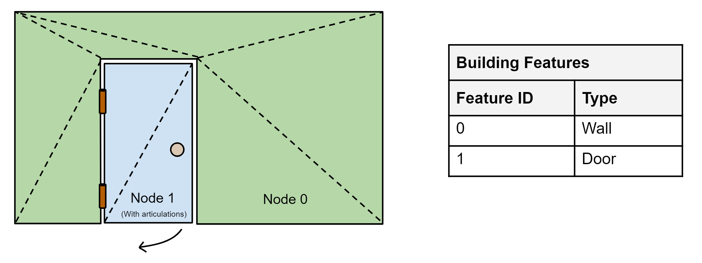
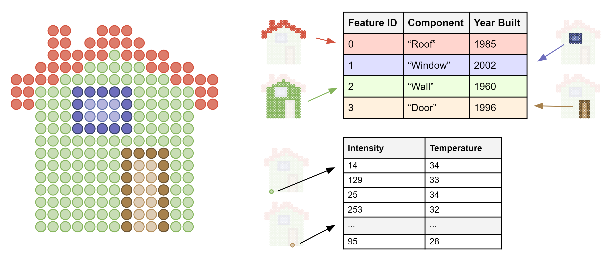
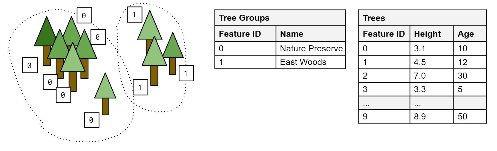
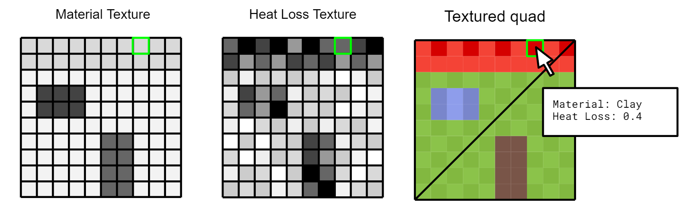
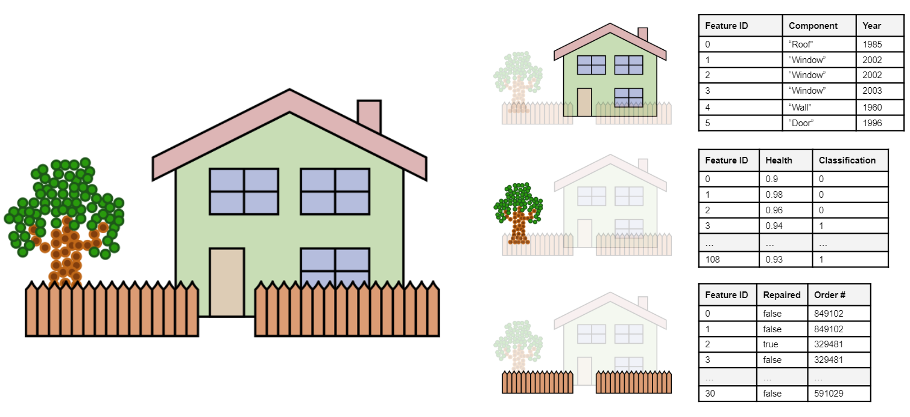

<!-- omit in toc -->
# EXT_feature_metadata

**Version 1.0.0** [TODO: date]

<!-- omit in toc -->
## Contributors

* Peter Gagliardi, Cesium
* Sean Lilley, Cesium
* Sam Suhag, Cesium
* Patrick Cozzi, Cesium
* Bao Tran, Cesium
* Samuel Vargas, Cesium

<!-- omit in toc -->
## Status

Draft

<!-- omit in toc -->
## Dependencies

Written against the glTF 2.0 specification.

Adds new functionality to the [`EXT_mesh_gpu_instancing` extension](../../EXT_mesh_gpu_instancing/README.md).

<!-- omit in toc -->
## Optional vs. Required

This extension is optional, meaning it should be placed in the `extensionsUsed` list, but not in the `extensionsRequired` list.

<!-- omit in toc -->
## Contents

- [Overview](#overview)
- [Feature Identification](#feature-identification)
  - [Feature ID Vertex Attributes](#feature-id-vertex-attributes)
    - [Feature ID Accessors](#feature-id-accessors)
    - [Implicit Feature IDs](#implicit-feature-ids)
  - [Feature ID Textures](#feature-id-textures)
  - [Feature ID Instance Attributes](#feature-id-instance-attributes)
- [Feature Metadata](#feature-metadata)
  - [Schemas](#schemas)
  - [Feature Tables](#feature-tables)
  - [Feature Textures](#feature-textures)
  - [Statistics](#statistics)
- [Examples](#examples)

## Overview

A feature is an entity that has both geometry and metadata. In Geographic Information Systems (GIS) a feature is an entity such as a point, polyline, or polygon that represents some element on a map. In another domain like CAD/BIM a feature might be a component of a design model. A feature could also be a 3D building in a city, a tree in a forest, a sample point in a weather model, or a patch of imagery.

This extension allows batching features for efficient streaming to a client for rendering and interaction. Efficiency comes from transferring multiple features in the same glTF and rendering them in the least number of draw calls necessary.

Feature IDs enable individual features to be identified and updated at runtime. For example, a selected feature could be shown/hidden, or highlighted a different color. Feature IDs may be assigned on a per-vertex, per-texel, or per-instance basis.

Feature IDs may be used to access metadata, such as passing a building's ID to get its address. Feature metadata is stored in a compact binary tabular format described in the [Cesium 3D Metadata Specification](https://github.com/CesiumGS/3d-tiles/blob/3d-tiles-next/specification/Metadata/README.md).


In the image above, a glTF consists of two houses batched together into a single primitive. A feature ID attribute on the primitive indicates that all of the vertices making up the first house have a feature ID of 0, while all vertices making up the second house have the feature ID 1. The feature ID is then used to access the building's metadata from the feature table.

Feature metadata may also be stored directly in textures. This is especially useful when texture mapping high frequency data, such as material properties, to less detailed 3D surfaces. Feature textures enable new styling and analytics capabilities, and complement glTF PBR textures.

See [Examples](#examples) for a full list of use cases for this extension.

## Feature Identification

Features in a glTF primitive are identified in three ways:

* Per-vertex using a vertex attribute
* Per-texel using a glTF texture
* Per-instance using an instance attribute with the [`EXT_mesh_gpu_instancing` extension](../../EXT_mesh_gpu_instancing/README.md)


### Feature ID Vertex Attributes

#### Feature ID Accessors

The most straightforward method for defining feature IDs is to store them in a glTF vertex attribute. Feature ID attributes must follow the naming convention `_FEATURE_ID_X` where `X` is a non-negative integer. The first feature ID attribute is `_FEATURE_ID_0`, the second `_FEATURE_ID_1`, and so on.

Feature IDs must be whole numbers in the range `[0, count - 1]` (inclusive), where `count` is the total number of features in the feature table.

The attribute's accessor `type` must be `"SCALAR"` and `normalized` must be false. There is no restriction on `componentType`.

> **Implementation Note:** since glTF accessors do not support `UNSIGNED_INT` types for 32-bit integers, `FLOAT` may be used instead. This allows for integer feature IDs up to 2²⁴. For smaller ranges of feature IDs, `UNSIGNED_BYTE` or `UNSIGNED_SHORT` can still be used. Note that this requires aligning each feature ID to 4-byte boundaries to adhere to glTF's alignment rules.


```jsonc
{
  "primitives": [
    {
      "attributes": {
        "POSITION": 0,
        "_FEATURE_ID_0": 1
      },
      "indices": 2,
      "mode": 4,
      "extensions": {
        "EXT_feature_metadata": {
          "featureIdAttributes": [
            {
              "featureTable": "buildings",
              "featureIds": {
                "attribute": "_FEATURE_ID_0"
              }
            }
          ]
        }
      }
    }
  ]
}
```

#### Implicit Feature IDs

In some cases it is possible to define feature IDs implicitly, such as when all vertices in a primitive have the same feature ID or when each vertex in a primitive has a different feature ID.

This is accomplished by using `constant` and `divisor`.

* `constant` sets a constant feature ID for each vertex. The default is `0`.
* `divisor` sets the rate at which feature IDs increment. If `divisor` is zero then `constant` is used. If `divisor` is greater than zero the feature ID increments once per `divisor` sets of vertices, starting at `constant`. The default is `0`.

For example 

* If `constant` is 0 and `divisor` is 0, the feature IDs are `[0, 0, 0, ...]`
* If `constant` is 0 and `divisor` is 1, the feature IDs are `[0, 1, 2, ...]`
* If `constant` is 0 and `divisor` is 2, the feature IDs are `[0, 0, 1, 1, 2, 2, ...]`
* If `constant` is 2 and `divisor` is 3, the feature IDs are `[2, 2, 2, 3, 3, 3, 4, 4, 4, ...]`.

`constant` and `divisor` must be omitted when `attribute` is used. These two methods of assigning feature IDs are mutually exclusive.



```jsonc
{
  "primitives": [
    {
      "attributes": {
        "POSITION": 0
      },
      "mode": 0,
      "extensions": {
        "EXT_feature_metadata": {
          "featureIdAttributes": [
            {
              "featureTable": "placemarks",
              "featureIds": {
                "constant": 0,
                "divisor": 1
              }
            }
          ]
        }
      }
    }
  ]
}
```
### Feature ID Textures

Feature ID textures classify the pixels of an image into different features. Some examples include image segmentation or marking regions on a map.

Often per-texel feature IDs provide finer granularity than per-vertex feature IDs as in the example below.



```jsonc
{
  "primitives": [
    {
      "attributes": {
        "POSITION": 0,
        "TEXCOORD_0": 1
      },
      "indices": 2,
      "material": 0,
      "extensions": {
        "EXT_feature_metadata": {
          "featureIdTextures": [
            {
              "featureTable": "buildingFeatures",
              "featureIds": {
                "texture": {
                  "texCoord": 0,
                  "index": 0
                },
                "channels": "r"
              }
            }
          ]
        }
      }
    }
  ]
}
```

`texture` is a glTF [`textureInfo`](../../../../../specification/2.0/schema/textureInfo.schema.json) object. `channels` must be a single channel (`"r"`, `"g"`, `"b"`, or `"a"`). Furthermore, feature IDs must be whole numbers in the range `[0, count - 1]` (inclusive), where `count` is the total number of features in the feature table. Texture filtering should be disabled when accessing feature IDs.

### Feature ID Instance Attributes

Feature IDs may also be assigned to individual instances when using the [`EXT_mesh_gpu_instancing` extension](../../EXT_mesh_gpu_instancing/README.md). This works the same way as assigning feature IDs to vertices. Feature IDs may be stored in accessors or generated implicitly.

```jsonc
{
  "nodes": [
    {
      "mesh": 0,
      "extensions": {
        "EXT_mesh_gpu_instancing": {
          "attributes": {
            "TRANSLATION": 0,
            "ROTATION": 1,
            "SCALE": 2,
            "_FEATURE_ID_0": 3
          },
          "extensions": {
            "EXT_feature_metadata": {
              "featureIdAttributes": [
                {
                  "featureTable": "trees",
                  "featureIds": {
                    "attribute": "_FEATURE_ID_0"
                  }
                }
              ]
            }
          }
        }
      }
    }
  ]
}
```

## Feature Metadata

Feature metadata is structured according to a **schema**. A schema has a set of **classes** and **enums**. A class contains a set of **properties**, which may be numeric, boolean, string, enum, or array types.

A **feature** is a specific instantiation of class containing **property values**. Property values are stored in either a **feature table** or a **feature texture** depending on the use case. Both formats are designed for storing property values for a large number of features.

**Statistics** provide aggregate information about the metadata. For example, statistics may include the min/max values of a numeric property for mapping property values to color ramps or the number of enum occurrences for creating histograms.

By default properties do not have any inherent meaning. A property may be assigned a **semantic**, an identifier that describes how the property should be interpreted. The full list of built-in semantics can be found in the [Cesium Metadata Semantics Reference](https://github.com/CesiumGS/3d-tiles/blob/3d-tiles-next/specification/Metadata/Semantics/README.md). Model authors may define their own application or domain-specific semantics separately.

This extension references the [Cesium 3D Metadata Specification](https://github.com/CesiumGS/3d-tiles/blob/3d-tiles-next/specification/Metadata/README.md), which describes the metadata format in full detail.

### Schemas

A schema defines a set of classes and enums used in a model. Classes serve as templates for entities - they provide a list of properties and the type information for those properties. Enums define the allowable values for enum properties. Schemas are defined in full detail in the [Schemas](https://github.com/CesiumGS/3d-tiles/tree/3d-tiles-next/specification/Metadata/1.0.0#schemas) section of the [Cesium 3D Metadata Specification](https://github.com/CesiumGS/3d-tiles/blob/3d-tiles-next/specification/Metadata/README.md).

A schema may be embedded in the extension directly or referenced externally with the `schemaUri` property. Multiple glTF models may refer to the same external schema to avoid duplication.

Schemas may be given a `name`, `description`, and `version`.

### Feature Tables

A feature table stores property values in a parallel array format. Each property array corresponds to a class property. The values contained within a property array must match the data type of the class property. Furthermore, the set of property arrays must match one-to-one with the class properties. There is one exception - if a property is optional the feature table may omit that property.

The schema and feature tables are defined in the root extension object in the glTF model. See the example below:

```jsonc
{
  "extensions": {
    "EXT_feature_metadata": {
      "schema": {
        "classes": {
          "tree": {
            "properties": {
              "height": {
                "description": "Height of tree measured from ground level",
                "type": "FLOAT32"
              },
              "birdCount": {
                "description": "Number of birds perching on the tree",
                "type": "UINT8"
              },
              "species": {
                "description": "Species of the tree",
                "type": "STRING"
              }
            }
          }
        }
      },
      "featureTables": {
        "trees": {
          "class": "tree",
          "count": 10,
          "properties": {
            "height": {
              "bufferView": 0
            },
            "birdCount": {
              "bufferView": 1
            },
            "species": {
              "bufferView": 2,
              "stringOffsetBufferView": 3
            }
          }
        }
      }
    }
  }
}
```

`class` is the ID of the class in the schema. `count` is the number of features in the feature table, as well as the length of each property array. Property arrays are stored in glTF buffer views and use the binary encoding defined in the [Table Format](https://github.com/CesiumGS/3d-tiles/tree/3d-tiles-next/specification/Metadata/1.0.0#table-format) section of the [Cesium 3D Metadata Specification](https://github.com/CesiumGS/3d-tiles/blob/3d-tiles-next/specification/Metadata/README.md).

Each buffer view `byteOffset` must be aligned to a multiple of 8 bytes. If the buffer view's buffer is the GLB-stored `BIN` chunk the byte offset is measured relative to the beginning of the GLB. Otherwise it is measured relative to the beginning of the buffer.

### Feature Textures

Feature textures (not to be confused with [Feature ID Textures](#feature-id-texture)) use textures rather than parallel arrays to store values. Feature textures are accessed directly by texture coordinates, rather than feature IDs. Feature textures are especially useful when texture mapping high frequency data to less detailed 3D surfaces.

Feature textures use the [Raster Format](https://github.com/CesiumGS/3d-tiles/tree/3d-tiles-next/specification/Metadata/1.0.0#raster-format) of the [Cesium 3D Metadata Specification](https://github.com/CesiumGS/3d-tiles/blob/3d-tiles-next/specification/Metadata/README.md) with a few additional constraints:

* A scalar property cannot be encoded into multiple channels. For example, it is not possible to encode a `UINT32` property in an `RGBA8` texture.
* Components of fixed-length array properties must be separate channels within the same texture.
* Variable-length arrays are not supported.

Additionally, the data type and bit depth of the image must be compatible with the property type. An 8-bit per pixel RGB image is only compatible with `UINT8` or normalized `UINT8` properties, and array properties thereof with three components or less. Likewise, a floating point property requires a floating point-compatible image format like KTX2 which may require additional extensions.

Feature textures are defined with the following steps:

1. A class is defined in the root `EXT_feature_metadata` extension object. This is used to describe the metadata in the texture.
2. A feature texture is defined in the root `EXT_feature_metadata.featureTextures` object. This must reference the class ID defined in step 1.
3. A feature texture is associated with a primitive by listing the feature texture ID in the `primitive.EXT_feature_metadata.featureTextures` array.


_Class and feature texture_

```jsonc
{
  "extensions": {
    "EXT_feature_metadata": {
      "schema": {
        "classes": {
          "heatSample": {
            "properties": {
              "heatSample": {
                "type": "UINT8",
                "normalized": true
              }
            }
          }
        }
      },
      "featureTextures": {
        "heatLossTexture": {
          "class": "heatSample",
          "properties": {
            "heatLoss": {
              "texture": {
                "index": 0,
                "texCoord": 0
              },
              "channels": "r"
            }
          }
        }
      }
    }
  }
}
```

_Primitive_

```jsonc
{
  "primitives": [
    {
      "attributes": {
        "POSITION": 0,
        "TEXCOORD_0": 1
      },
      "indices": 2,
      "material": 0,
      "extensions": {
        "EXT_feature_metadata": {
          "featureTextures": ["heatLossTexture"]
        }
      }
    }
  ]
}
```


`texture` is a glTF [`textureInfo`](../../../../../specification/2.0/schema/textureInfo.schema.json) object. `texCoord` refers to the texture coordinate set of the referring primitive. `channels` is a string matching the pattern `"^[rgba]{1,4}$"` that specifies which texture channels store property values.

### Statistics

Statistics provide aggregate information about features in the model. Statistics are provided on a per-class basis.

* `count` is the number of features that conform to the class
* `properties` contains statistics about property values

Properties have the following built-in statistics:

Name|Description|Type
--|--|--
`min`|Minimum|Numeric types or fixed-length arrays of numeric types
`max`|Maximum|...
`mean`|Arithmetic mean|...
`median`|Median|...
`standardDeviation`|Standard deviation|...
`variance`|Variance|...
`sum`|Sum of all values|...
`occurrences`|Number of enum occurrences|Enums or fixed-length arrays of enums

Model authors may define their own additional statistics, like `mode` below.

```jsonc
{
  "extensions": {
    "3DTILES_metadata": {
      "schema": {
        "enums": {
          "buildingType": {
            "valueType": "UINT8",
            "values": [
              {
                "name": "Residential",
                "value": 0
              },
              {
                "name": "Commercial",
                "value": 1
              },
              {
                "name": "Hospital",
                "value": 2
              },
              {
                "name": "Other",
                "value": 3
              }
            ]
          }
        },
        "classes": {
          "building": {
            "properties": {
              "height": {
                "type": "FLOAT32"
              },
              "owners": {
                "type": "ARRAY",
                "componentType": "STRING"
              },
              "buildingType": {
                "type": "ENUM",
                "enumType": "buildingType"
              }
            }
          }
        }
      },
      "statistics": {
        "classes": {
          "building": {
            "count": 100,
            "properties": {
              "height": {
                "min": 3.9,
                "max": 341.7,
                "mode": 5.0
              },
              "buildingType": {
                "occurrences": {
                  "Residential": 70,
                  "Commercial": 28,
                  "Hospital": 2
                }
              }
            }
          }
        }
      }
    }
  }
}
```

## Examples

_This section is non-normative_

The examples below shows the breadth of possible use cases for this extension. 

Example|Description|Image
--|--|--
Simple example||TODO
Per-vertex metadata|An implicit feature ID is assigned to each vertex. The feature table stores `FLOAT64` accuracy values. |
Per-triangle metadata|An implicit feature ID is assigned to each set of three vertices. The feature table stores `FLOAT64` area values.|
Per-point metadata|An implicit feature ID is assigned to each point. The feature table stores `FLOAT64` , `STRING`, and `ENUM` properties, which are not possible through glTF vertex attribute accessors alone.|
Per-node metadata|Vertices in node 0 and node 1 are assigned different `constant` feature IDs. Because the door has articulations these two nodes can't be batched together.|
Multi-point features|A point cloud with two feature tables, one storing metadata for groups of points and the other storing metadata for individual points.|
Multi-instance features|Instanced tree models where trees are assigned to groups with a per-instance feature ID attribute. One feature table stores per-group metadata and the other stores per-tree metadata.|
Material classification|A textured mesh using a feature texture to store both material enums and normalized `UINT8` thermal temperatures.|
Multiple texture layers||TODO
Composite|A glTF containing a 3D mesh (house), a point cloud (tree), and instanced models (fencing) with three feature tables.|