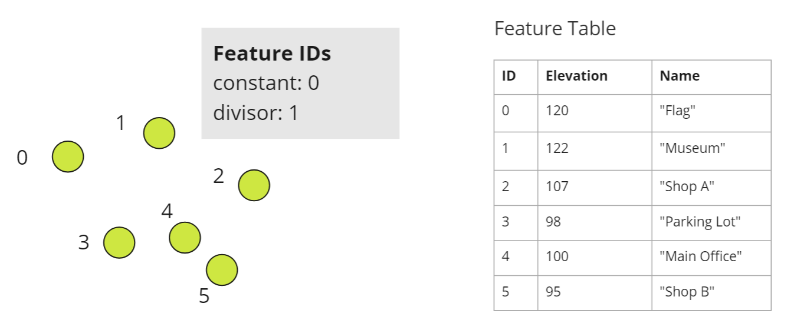
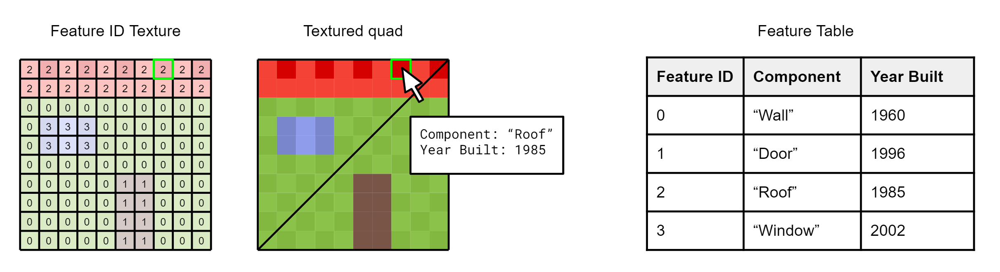
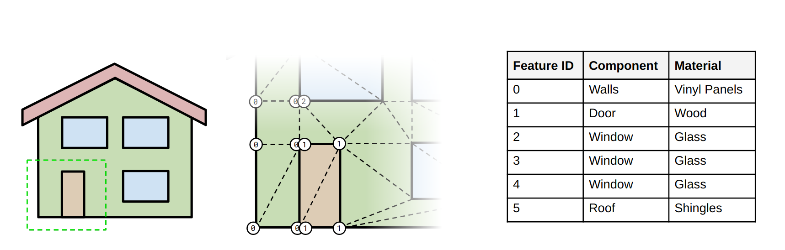
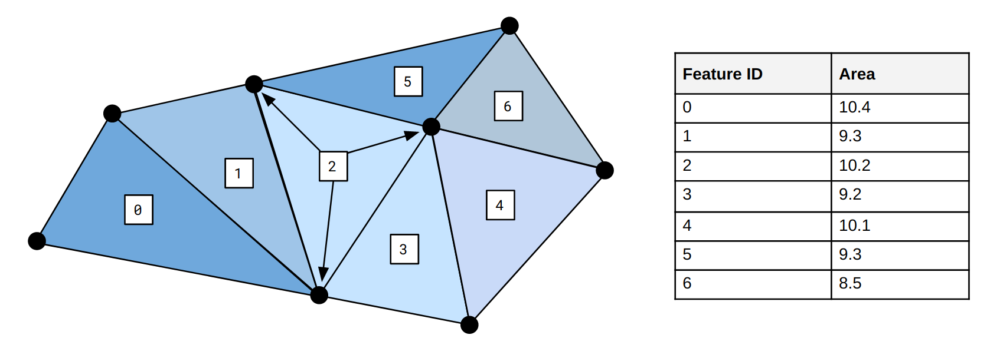
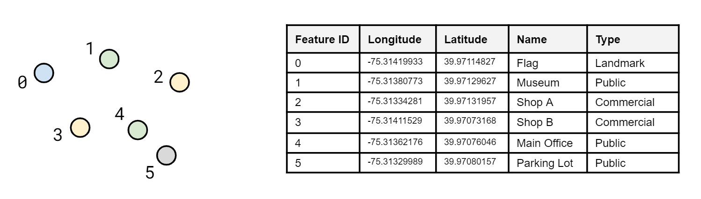
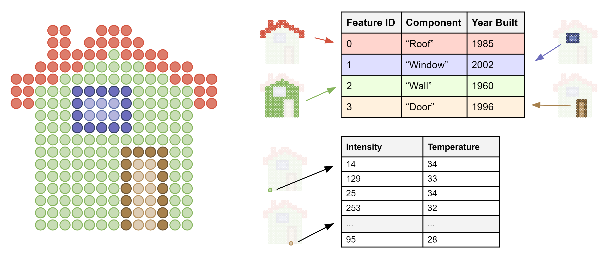
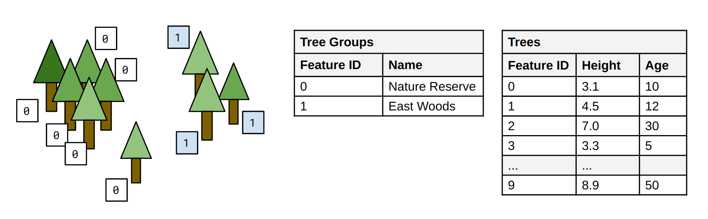

### ⚠️ `EXT_feature_metadata` has been replaced by [`EXT_mesh_features`](https://github.com/CesiumGS/glTF/tree/3d-tiles-next/extensions/2.0/Vendor/EXT_mesh_features) ⚠️

<!-- omit in toc -->
# EXT_feature_metadata

<!-- omit in toc -->
## Contributors

* Peter Gagliardi, Cesium
* Sean Lilley, Cesium
* Sam Suhag, Cesium
* Patrick Cozzi, Cesium
* Bao Tran, Cesium
* Samuel Vargas, Cesium

<!-- omit in toc -->
## Status

Draft

<!-- omit in toc -->
## Dependencies

Written against the glTF 2.0 specification.

Adds new functionality to the [`EXT_mesh_gpu_instancing` extension](../../EXT_mesh_gpu_instancing).

<!-- omit in toc -->
## Optional vs. Required

This extension is optional, meaning it should be placed in the `extensionsUsed` list, but not in the `extensionsRequired` list.

<!-- omit in toc -->
## Contents

- [Overview](#overview)
- [Feature Identification](#feature-identification)
  - [Feature ID Vertex Attributes](#feature-id-vertex-attributes)
    - [Feature ID Accessors](#feature-id-accessors)
    - [Implicit Feature IDs](#implicit-feature-ids)
  - [Feature ID Textures](#feature-id-textures)
  - [Feature ID Instance Attributes](#feature-id-instance-attributes)
- [Feature Metadata](#feature-metadata)
  - [Schemas](#schemas)
  - [Feature Tables](#feature-tables)
  - [Feature Textures](#feature-textures)
  - [Statistics](#statistics)
- [Examples](#examples)
- [JSON Schema Reference](#json-schema-reference)
- [Revision History](#revision-history)

## Overview

A **feature** is an entity that has both geometry and metadata. In Geographic Information Systems (GIS) a feature is an entity such as a point, polyline, or polygon that represents some element on a map. In another domain like CAD/BIM a feature might be a component of a design model. A feature could also be a 3D building in a city, a tree in a forest, a sample point in a weather model, or a patch of texels on a 3D model.

This extension allows batching features for efficient streaming to a client for rendering and interaction. Efficiency comes from transferring multiple features in the same glTF and rendering them in the least number of draw calls necessary.

Feature IDs enable individual features to be identified and updated at runtime. For example, a selected feature could be shown/hidden, or highlighted a different color. Feature IDs may be assigned on a per-vertex, per-texel, or per-instance basis.

Feature IDs may be used to access metadata, such as passing a building's ID to get its address. Feature metadata is stored in a compact binary tabular format described in the [3D Metadata Specification](https://github.com/CesiumGS/3d-tiles/tree/main/specification/Metadata).


In the image above, a glTF consists of two houses batched together into a single primitive. A feature ID attribute on the primitive indicates that all of the vertices making up the first house have a feature ID of 0, while all vertices making up the second house have the feature ID 1. The feature ID is then used to access the building's metadata from the feature table.

Feature metadata may also be stored directly in textures. This is especially useful when texture mapping high frequency data, such as material properties, to less detailed 3D surfaces. Feature textures enable new styling and analytics capabilities, and complement glTF PBR textures.

See [Examples](#examples) for a full list of use cases for this extension.

## Feature Identification

Features in a glTF primitive are identified in three ways:

* Per-vertex using a vertex attribute
* Per-texel using a glTF texture
* Per-instance using an instance attribute with the [`EXT_mesh_gpu_instancing` extension](../../EXT_mesh_gpu_instancing)


### Feature ID Vertex Attributes

#### Feature ID Accessors

The most straightforward method for defining feature IDs is to store them in a glTF vertex attribute. Feature ID attributes must follow the naming convention `_FEATURE_ID_X` where `X` is a non-negative integer. The first feature ID attribute is `_FEATURE_ID_0`, the second `_FEATURE_ID_1`, and so on.

Feature IDs must be whole numbers in the range `[0, count - 1]` (inclusive), where `count` is the total number of features in the feature table.

The attribute's accessor `type` must be `"SCALAR"` and `normalized` must be false. There is no restriction on `componentType`.

> **Implementation Note:** since glTF accessors do not support `UNSIGNED_INT` types for 32-bit integers, `FLOAT` may be used instead. This allows for integer feature IDs up to 2²⁴. For smaller ranges of feature IDs, `UNSIGNED_BYTE` or `UNSIGNED_SHORT` can still be used. Note that this requires aligning each feature ID to 4-byte boundaries to adhere to glTF's alignment rules.


```jsonc
{
  "primitives": [
    {
      "attributes": {
        "POSITION": 0,
        "_FEATURE_ID_0": 1
      },
      "indices": 2,
      "mode": 4,
      "extensions": {
        "EXT_feature_metadata": {
          "featureIdAttributes": [
            {
              "featureTable": "buildings",
              "featureIds": {
                "attribute": "_FEATURE_ID_0"
              }
            }
          ]
        }
      }
    }
  ]
}
```

#### Implicit Feature IDs

In some cases it is possible to define feature IDs implicitly, such as when all vertices in a primitive have the same feature ID or when each vertex in a primitive has a different feature ID.

This is accomplished by using `constant` and `divisor`.

* `constant` sets a constant feature ID for each vertex. The default is `0`.
* `divisor` sets the rate at which feature IDs increment. If `divisor` is zero then `constant` is used. If `divisor` is greater than zero the feature ID increments once per `divisor` sets of vertices, starting at `constant`. The default is `0`.

For example 

* If `constant` is 0 and `divisor` is 0, the feature IDs are `[0, 0, 0, ...]`
* If `constant` is 0 and `divisor` is 1, the feature IDs are `[0, 1, 2, ...]`
* If `constant` is 0 and `divisor` is 2, the feature IDs are `[0, 0, 1, 1, 2, 2, ...]`
* If `constant` is 2 and `divisor` is 3, the feature IDs are `[2, 2, 2, 3, 3, 3, 4, 4, 4, ...]`.

`constant` and `divisor` must be omitted when `attribute` is used. These two methods of assigning feature IDs are mutually exclusive.



```jsonc
{
  "primitives": [
    {
      "attributes": {
        "POSITION": 0
      },
      "mode": 0,
      "extensions": {
        "EXT_feature_metadata": {
          "featureIdAttributes": [
            {
              "featureTable": "placemarks",
              "featureIds": {
                "constant": 0,
                "divisor": 1
              }
            }
          ]
        }
      }
    }
  ]
}
```
### Feature ID Textures

Feature ID textures classify the pixels of an image into different features. Some examples include image segmentation or marking regions on a map.

Often per-texel feature IDs provide finer granularity than per-vertex feature IDs as in the example below.



```jsonc
{
  "primitives": [
    {
      "attributes": {
        "POSITION": 0,
        "TEXCOORD_0": 1
      },
      "indices": 2,
      "material": 0,
      "extensions": {
        "EXT_feature_metadata": {
          "featureIdTextures": [
            {
              "featureTable": "buildingFeatures",
              "featureIds": {
                "texture": {
                  "texCoord": 0,
                  "index": 0
                },
                "channels": "r"
              }
            }
          ]
        }
      }
    }
  ]
}
```

`texture` is a glTF [`textureInfo`](../../../../../specification/2.0/schema/textureInfo.schema.json) object. `channels` must be a single channel (`"r"`, `"g"`, `"b"`, or `"a"`). Furthermore, feature IDs must be whole numbers in the range `[0, count - 1]` (inclusive), where `count` is the total number of features in the feature table. Texture filtering should be disabled when accessing feature IDs.

### Feature ID Instance Attributes

Feature IDs may also be assigned to individual instances when using the [`EXT_mesh_gpu_instancing` extension](../../EXT_mesh_gpu_instancing). This works the same way as assigning feature IDs to vertices. Feature IDs may be stored in accessors or generated implicitly.

```jsonc
{
  "nodes": [
    {
      "mesh": 0,
      "extensions": {
        "EXT_mesh_gpu_instancing": {
          "attributes": {
            "TRANSLATION": 0,
            "ROTATION": 1,
            "SCALE": 2,
            "_FEATURE_ID_0": 3
          },
          "extensions": {
            "EXT_feature_metadata": {
              "featureIdAttributes": [
                {
                  "featureTable": "trees",
                  "featureIds": {
                    "attribute": "_FEATURE_ID_0"
                  }
                }
              ]
            }
          }
        }
      }
    }
  ]
}
```

## Feature Metadata

Feature metadata is structured according to a **schema**. A schema has a set of **classes** and **enums**. A class contains a set of **properties**, which may be numeric, boolean, string, enum, or array types.

A **feature** is a specific instantiation of class containing **property values**. Property values are stored in either a **feature table** or a **feature texture** depending on the use case. Both formats are designed for storing property values for a large number of features.

**Statistics** provide aggregate information about the metadata. For example, statistics may include the min/max values of a numeric property for mapping property values to color ramps or the number of enum occurrences for creating histograms.

By default properties do not have any inherent meaning. A property may be assigned a **semantic**, an identifier that describes how the property should be interpreted. The full list of built-in semantics can be found in the [3D Metadata Semantic Reference](https://github.com/CesiumGS/3d-tiles/tree/main/specification/Metadata/Semantics). Model authors may define their own application- or domain-specific semantics separately.

This extension implements the [3D Metadata Specification](https://github.com/CesiumGS/3d-tiles/tree/main/specification/Metadata), which describes the metadata format in full detail.

### Schemas

A schema defines a set of classes and enums used in a model. Classes serve as templates for features - they provide a list of properties and the type information for those properties. Enums define the allowable values for enum properties. Schemas are defined in full detail in the [Schemas](https://github.com/CesiumGS/3d-tiles/tree/main/specification/Metadata#schemas) section of the [3D Metadata Specification](https://github.com/CesiumGS/3d-tiles/tree/main/specification/Metadata).

A schema may be embedded in the extension directly or referenced externally with the `schemaUri` property. Multiple glTF models may refer to the same external schema to avoid duplication.

Schemas may be given a `name`, `description`, and `version`.

### Feature Tables

A feature table stores property values in a parallel array format. Each property array corresponds to a class property. The values contained within a property array must match the data type of the class property. Furthermore, the set of property arrays must match one-to-one with the class properties. There is one exception - if a property is optional the feature table may omit that property.

The schema and feature tables are defined in the root extension object in the glTF model. See the example below:

```jsonc
{
  "extensions": {
    "EXT_feature_metadata": {
      "schema": {
        "classes": {
          "tree": {
            "properties": {
              "height": {
                "description": "Height of tree measured from ground level",
                "type": "FLOAT32"
              },
              "birdCount": {
                "description": "Number of birds perching on the tree",
                "type": "UINT8"
              },
              "species": {
                "description": "Species of the tree",
                "type": "STRING"
              }
            }
          }
        }
      },
      "featureTables": {
        "trees": {
          "class": "tree",
          "count": 10,
          "properties": {
            "height": {
              "bufferView": 0
            },
            "birdCount": {
              "bufferView": 1
            },
            "species": {
              "bufferView": 2,
              "stringOffsetBufferView": 3
            }
          }
        }
      }
    }
  }
}
```

`class` is the ID of the class in the schema. `count` is the number of features in the feature table, as well as the length of each property array. Property arrays are stored in glTF buffer views and use the binary encoding defined in the [Table Format](https://github.com/CesiumGS/3d-tiles/tree/main/specification/Metadata#table-format) section of the [3D Metadata Specification](https://github.com/CesiumGS/3d-tiles/tree/main/specification/Metadata).

Each buffer view `byteOffset` must be aligned to a multiple of 8 bytes. If the buffer view's buffer is the GLB-stored `BIN` chunk the byte offset is measured relative to the beginning of the GLB. Otherwise it is measured relative to the beginning of the buffer.

### Feature Textures

Feature textures (not to be confused with [Feature ID Textures](#feature-id-texture)) use textures rather than parallel arrays to store values. Feature textures are accessed directly by texture coordinates, rather than feature IDs. Feature textures are especially useful when texture mapping high frequency data to less detailed 3D surfaces.

Feature textures use the [Raster Format](https://github.com/CesiumGS/3d-tiles/tree/main/specification/Metadata#raster-format) of the [3D Metadata Specification](https://github.com/CesiumGS/3d-tiles/tree/main/specification/Metadata) with a few additional constraints:

* A scalar property cannot be encoded into multiple channels. For example, it is not possible to encode a `UINT32` property in an `RGBA8` texture.
* Components of fixed-length array properties must be separate channels within the same texture.
* Variable-length arrays are not supported.

Additionally, the data type and bit depth of the image must be compatible with the property type. An 8-bit per pixel RGB image is only compatible with `UINT8` or normalized `UINT8` properties, and array properties thereof with three components or less. Likewise, a floating point property requires a floating point-compatible image format like KTX2 which may require additional extensions.

Feature textures are defined with the following steps:

1. A class is defined in the root `EXT_feature_metadata` extension object. This is used to describe the metadata in the texture.
2. A feature texture is defined in the root `EXT_feature_metadata.featureTextures` object. This must reference the class ID defined in step 1.
3. A feature texture is associated with a primitive by listing the feature texture ID in the `mesh.primitive.EXT_feature_metadata.featureTextures` array.


_Class and feature texture_

```jsonc
{
  "extensions": {
    "EXT_feature_metadata": {
      "schema": {
        "classes": {
          "heatSample": {
            "properties": {
              "heatSample": {
                "type": "UINT8",
                "normalized": true
              }
            }
          }
        }
      },
      "featureTextures": {
        "heatLossTexture": {
          "class": "heatSample",
          "properties": {
            "heatLoss": {
              "texture": {
                "index": 0,
                "texCoord": 0
              },
              "channels": "r"
            }
          }
        }
      }
    }
  }
}
```

_Primitive_

```jsonc
{
  "primitives": [
    {
      "attributes": {
        "POSITION": 0,
        "TEXCOORD_0": 1
      },
      "indices": 2,
      "material": 0,
      "extensions": {
        "EXT_feature_metadata": {
          "featureTextures": ["heatLossTexture"]
        }
      }
    }
  ]
}
```


`texture` is a glTF [`textureInfo`](../../../../../specification/2.0/schema/textureInfo.schema.json) object. `texCoord` refers to the texture coordinate set of the referring primitive. `channels` is a string matching the pattern `"^[rgba]{1,4}$"` that specifies which texture channels store property values.

### Statistics

Statistics provide aggregate information about features in the model. Statistics are provided on a per-class basis.

* `count` is the number of features that conform to the class
* `properties` contains statistics about property values

Properties have the following built-in statistics:

Name|Description|Type
--|--|--
`min`|The minimum property value|Numeric types or fixed-length arrays of numeric types
`max`|The maximum property value|...
`mean`|The arithmetic mean of the property values|...
`median`|The median of the property values|...
`standardDeviation`|The standard deviation of the property values|...
`variance`|The variance of the property values|...
`sum`|The sum of the property values|...
`occurrences`|Number of enum occurrences|Enums or fixed-length arrays of enums

Model authors may define their own additional statistics, like `mode` below.

```jsonc
{
  "extensions": {
    "3DTILES_metadata": {
      "schema": {
        "classes": {
          "building": {
            "properties": {
              "height": {
                "type": "FLOAT32"
              },
              "owners": {
                "type": "ARRAY",
                "componentType": "STRING"
              },
              "buildingType": {
                "type": "ENUM",
                "enumType": "buildingType"
              }
            }
          }
        },
        "enums": {
          "buildingType": {
            "valueType": "UINT8",
            "values": [
              {
                "name": "Residential",
                "value": 0
              },
              {
                "name": "Commercial",
                "value": 1
              },
              {
                "name": "Hospital",
                "value": 2
              },
              {
                "name": "Other",
                "value": 3
              }
            ]
          }
        }
      },
      "statistics": {
        "classes": {
          "building": {
            "count": 100,
            "properties": {
              "height": {
                "min": 3.9,
                "max": 341.7,
                "mode": 5.0
              },
              "buildingType": {
                "occurrences": {
                  "Residential": 70,
                  "Commercial": 28,
                  "Hospital": 2
                }
              }
            }
          }
        }
      }
    }
  }
}
```

## Examples

_This section is non-normative_

The examples below shows the breadth of possible use cases for this extension. 

Example|Description|Image
--|--|--
Triangle mesh|Feature IDs are assigned to each vertex to distinguish components of a building.|
Per-vertex metadata|An implicit feature ID is assigned to each vertex. The feature table stores `FLOAT64` accuracy values. |
Per-triangle metadata|An implicit feature ID is assigned to each set of three vertices. The feature table stores `FLOAT64` area values.|
Per-point metadata|An implicit feature ID is assigned to each point. The feature table stores `FLOAT64` , `STRING`, and `ENUM` properties, which are not possible through glTF vertex attribute accessors alone.|
Per-node metadata|Vertices in node 0 and node 1 are assigned different `constant` feature IDs. Because the door has articulations these two nodes can't be batched together.|
Multi-point features|A point cloud with two feature tables, one storing metadata for groups of points and the other storing metadata for individual points.|
Multi-instance features|Instanced tree models where trees are assigned to groups with a per-instance feature ID attribute. One feature table stores per-group metadata and the other stores per-tree metadata.|
Material classification|A textured mesh using a feature texture to store both material enums and normalized `UINT8` thermal temperatures.|
Composite|A glTF containing a 3D mesh (house), a point cloud (tree), and instanced models (fencing) with three feature tables.|

## JSON Schema Reference

* [glTF extension](#gltf-extension)
* [Primitive extension](#primitive-extension)
* [`EXT_mesh_gpu_instancing` extension](#ext_mesh_gpu_instancing-extension)

<!-- omit in toc -->
## glTF extension

* [`glTF extension`](#reference-gltf-extension) (root object)
  * [`Schema`](#reference-schema)
    * [`Class`](#reference-class)
      * [`Class Property`](#reference-class-property)
    * [`Enum`](#reference-enum)
      * [`Enum Value`](#reference-enum-value)
  * [`Feature Table`](#reference-featuretable)
    * [`Feature Table Property`](#reference-featuretable-property)
  * [`Feature Texture`](#reference-featuretexture)
  * [`Texture Accessor`](#reference-textureaccessor)
  * [`Statistics`](#reference-statistics)
    * [`Class Statistics`](#reference-statistics-class)
      * [`Property Statistics`](#reference-statistics-class-property)

---------------------------------------
<a name="reference-gltf-extension"></a>
<!-- omit in toc -->
### glTF extension

glTF extension that assigns metadata to features in a model.

**`glTF extension` Properties**

|   |Type|Description|Required|
|---|---|---|---|
|**schema**|`schema`|An object defining classes and enums.|No|
|**schemaUri**|`string`|A uri to an external schema file.|No|
|**statistics**|`statistics`|An object containing statistics about features.|No|
|**featureTables**|`object`|A dictionary, where each key is a feature table ID and each value is an object defining the feature table.|No|
|**featureTextures**|`object`|A dictionary, where each key is a feature texture ID and each value is an object defining the feature texture.|No|
|**extensions**|`any`||No|
|**extras**|`any`||No|

Additional properties are allowed.

<!-- omit in toc -->
#### glTF extension.schema

An object defining classes and enums.

* **Type**: `schema`
* **Required**: No

<!-- omit in toc -->
#### glTF extension.schemaUri

A uri to an external schema file.

* **Type**: `string`
* **Required**: No
* **Format**: uriref

<!-- omit in toc -->
#### glTF extension.statistics

An object containing statistics about features.

* **Type**: `statistics`
* **Required**: No

<!-- omit in toc -->
#### glTF extension.featureTables

A dictionary, where each key is a feature table ID and each value is an object defining the feature table.

* **Type**: `object`
* **Required**: No
* **Type of each property**: `featureTable`

<!-- omit in toc -->
#### glTF extension.featureTextures

A dictionary, where each key is a feature texture ID and each value is an object defining the feature texture.

* **Type**: `object`
* **Required**: No
* **Type of each property**: `featureTexture`

<!-- omit in toc -->
#### glTF extension.extensions

* **Type**: `any`
* **Required**: No

<!-- omit in toc -->
#### glTF extension.extras

* **Type**: `any`
* **Required**: No

---------------------------------------
<a name="reference-schema"></a>

<!-- omit in toc -->
### Schema

An object defining classes and enums.

**`Schema` Properties**

|   |Type|Description|Required|
|---|---|---|---|
|**name**|`string`|The name of the schema.|No|
|**description**|`string`|The description of the schema.|No|
|**version**|`string`|Application-specific version of the schema.|No|
|**classes**|`object`|A dictionary, where each key is a class ID and each value is an object defining the class.|No|
|**enums**|`object`|A dictionary, where each key is an enum ID and each value is an object defining the values for the enum.|No|
|**extensions**|`any`||No|
|**extras**|`any`||No|

Additional properties are allowed.

<!-- omit in toc -->
#### schema.name

The name of the schema.

* **Type**: `string`
* **Required**: No
* **Minimum Length**`: >= 1`

<!-- omit in toc -->
#### schema.description

The description of the schema.

* **Type**: `string`
* **Required**: No
* **Minimum Length**`: >= 1`

<!-- omit in toc -->
#### schema.version

Application-specific version of the schema.

* **Type**: `string`
* **Required**: No
* **Minimum Length**`: >= 1`

<!-- omit in toc -->
#### schema.classes

A dictionary, where each key is a class ID and each value is an object defining the class.

* **Type**: `object`
* **Required**: No
* **Type of each property**: `class`

<!-- omit in toc -->
#### schema.enums

A dictionary, where each key is an enum ID and each value is an object defining the values for the enum.

* **Type**: `object`
* **Required**: No
* **Type of each property**: `enum`

<!-- omit in toc -->
#### schema.extensions

* **Type**: `any`
* **Required**: No

<!-- omit in toc -->
#### schema.extras

* **Type**: `any`
* **Required**: No

---------------------------------------
<a name="reference-class"></a>

<!-- omit in toc -->
### Class

A class containing a set of properties.

**`Class` Properties**

|   |Type|Description|Required|
|---|---|---|---|
|**name**|`string`|The name of the class, e.g. for display purposes.|No|
|**description**|`string`|The description of the class.|No|
|**properties**|`object`|A dictionary, where each key is a property ID and each value is an object defining the property.|No|
|**extensions**|`any`||No|
|**extras**|`any`||No|

Additional properties are allowed.

<!-- omit in toc -->
#### class.name

The name of the class, e.g. for display purposes.

* **Type**: `string`
* **Required**: No
* **Minimum Length**`: >= 1`

<!-- omit in toc -->
#### class.description

The description of the class.

* **Type**: `string`
* **Required**: No
* **Minimum Length**`: >= 1`

<!-- omit in toc -->
#### class.properties

A dictionary, where each key is a property ID and each value is an object defining the property.

* **Type**: `object`
* **Required**: No
* **Type of each property**: `class.property`

<!-- omit in toc -->
#### class.extensions

* **Type**: `any`
* **Required**: No

<!-- omit in toc -->
#### class.extras

* **Type**: `any`
* **Required**: No

---------------------------------------
<a name="reference-class-property"></a>

<!-- omit in toc -->
### Class property

A class property.

**`Class property` Properties**

|   |Type|Description|Required|
|---|---|---|---|
|**name**|`string`|The name of the property, e.g. for display purposes.|No|
|**description**|`string`|The description of the property.|No|
|**type**|`string`|The property type. If `ENUM` is used, then `enumType` must also be specified. If `ARRAY` is used, then `componentType` must also be specified. `ARRAY` is a fixed-length array when `componentCount` is defined, and variable-length otherwise.| &#10003; Yes|
|**enumType**|`string`|An enum ID as declared in the `enums` dictionary. This value must be specified when `type` or `componentType` is `ENUM`.|No|
|**componentType**|`any`|When `type` is `ARRAY` this indicates the type of each component of the array. If `ENUM` is used, then `enumType` must also be specified.|No|
|**componentCount**|`integer`|The number of components per element for `ARRAY` elements.|No|
|**normalized**|`boolean`|Specifies whether integer values are normalized. This applies both when `type` is an integer type, or when `type` is `ARRAY` with a `componentType` that is an integer type. For unsigned integer types, values are normalized between `[0.0, 1.0]`. For signed integer types, values are normalized between `[-1.0, 1.0]`. For all other types, this property is ignored.|No, default: `false`|
|**max**|`number,array`|Maximum allowed values for property values. Only applicable for numeric types and fixed-length arrays of numeric types. For numeric types this is a single number. For fixed-length arrays this is an array with `componentCount` number of elements. The `normalized` property has no effect on these values: they always correspond to the integer values.|No|
|**min**|`number,array`|Minimum allowed values for property values. Only applicable for numeric types and fixed-length arrays of numeric types. For numeric types this is a single number. For fixed-length arrays this is an array with `componentCount` number of elements. The `normalized` property has no effect on these values: they always correspond to the integer values.|No|
|**default**|`boolean,number,string,array`|A default value to use when the property value is not defined. If used, `optional` must be set to true. The type of the default value must match the property definition: For `BOOLEAN` use `true` or `false`. For `STRING` use a JSON string. For a numeric type use a JSON number. For `ENUM` use the enum `name`, not the integer value. For `ARRAY` use a JSON array containing values matching the `componentType`.|No|
|**optional**|`boolean`|If true, this property is optional.|No, default: `false`|
|**semantic**|`string`|An identifier that describes how this property should be interpreted. The semantic cannot be used by other properties in the class.|No|
|**extensions**|`any`||No|
|**extras**|`any`||No|

Additional properties are allowed.

<!-- omit in toc -->
#### class.property.name

The name of the property, e.g. for display purposes.

* **Type**: `string`
* **Required**: No
* **Minimum Length**`: >= 1`

<!-- omit in toc -->
#### class.property.description

The description of the property.

* **Type**: `string`
* **Required**: No
* **Minimum Length**`: >= 1`

<!-- omit in toc -->
#### class.property.type

The property type. If `ENUM` is used, then `enumType` must also be specified. If `ARRAY` is used, then `componentType` must also be specified. `ARRAY` is a fixed-length array when `componentCount` is defined, and variable-length otherwise.

* **Type**: `string`
* **Required**:  &#10003; Yes
* **Allowed values**:
   * `"INT8"`
   * `"UINT8"`
   * `"INT16"`
   * `"UINT16"`
   * `"INT32"`
   * `"UINT32"`
   * `"INT64"`
   * `"UINT64"`
   * `"FLOAT32"`
   * `"FLOAT64"`
   * `"BOOLEAN"`
   * `"STRING"`
   * `"ENUM"`
   * `"ARRAY"`

<!-- omit in toc -->
#### class.property.enumType

An enum ID as declared in the `enums` dictionary. This value must be specified when `type` or `componentType` is `ENUM`.

* **Type**: `string`
* **Required**: No

<!-- omit in toc -->
#### class.property.componentType

When `type` is `ARRAY` this indicates the type of each component of the array. If `ENUM` is used, then `enumType` must also be specified.

* **Type**: `any`
* **Required**: No
* **Allowed values**:
   * `INT8`
   * `UINT8`
   * `INT16`
   * `UINT16`
   * `INT32`
   * `UINT32`
   * `INT64`
   * `UINT64`
   * `FLOAT32`
   * `FLOAT64`
   * `BOOLEAN`
   * `STRING`
   * `ENUM`

<!-- omit in toc -->
#### class.property.componentCount

The number of components per element for `ARRAY` elements.

* **Type**: `integer`
* **Required**: No
* **Minimum**: ` >= 2`

<!-- omit in toc -->
#### class.property.normalized

Specifies whether integer values are normalized. This applies both when `type` is an integer type, or when `type` is `ARRAY` with a `componentType` that is an integer type. For unsigned integer types, values are normalized between `[0.0, 1.0]`. For signed integer types, values are normalized between `[-1.0, 1.0]`. For all other types, this property is ignored.

* **Type**: `boolean`
* **Required**: No, default: `false`

<!-- omit in toc -->
#### class.property.max

Maximum allowed values for property values. Only applicable for numeric types and fixed-length arrays of numeric types. For numeric types this is a single number. For fixed-length arrays this is an array with `componentCount` number of elements. The `normalized` property has no effect on these values: they always correspond to the integer values.

* **Type**: `number,array`
* **Required**: No

<!-- omit in toc -->
#### class.property.min

Minimum allowed values for property values. Only applicable for numeric types and fixed-length arrays of numeric types. For numeric types this is a single number. For fixed-length arrays this is an array with `componentCount` number of elements. The `normalized` property has no effect on these values: they always correspond to the integer values.

* **Type**: `number,array`
* **Required**: No

<!-- omit in toc -->
#### class.property.default

A default value to use when the property value is not defined. If used, `optional` must be set to true. The type of the default value must match the property definition: For `BOOLEAN` use `true` or `false`. For `STRING` use a JSON string. For a numeric type use a JSON number. For `ENUM` use the enum `name`, not the integer value. For `ARRAY` use a JSON array containing values matching the `componentType`.

* **Type**: `boolean,number,string,array`
* **Required**: No

<!-- omit in toc -->
#### class.property.optional

If true, this property is optional.

* **Type**: `boolean`
* **Required**: No, default: `false`

<!-- omit in toc -->
#### class.property.semantic

An identifier that describes how this property should be interpreted. The semantic cannot be used by other properties in the class.

* **Type**: `string`
* **Required**: No
* **Minimum Length**`: >= 1`

<!-- omit in toc -->
#### class.property.extensions

* **Type**: `any`
* **Required**: No

<!-- omit in toc -->
#### class.property.extras

* **Type**: `any`
* **Required**: No

---------------------------------------
<a name="reference-enum"></a>

<!-- omit in toc -->
### Enum

An object defining the values of an enum.

**`Enum` Properties**

|   |Type|Description|Required|
|---|---|---|---|
|**name**|`string`|The name of the enum, e.g. for display purposes.|No|
|**description**|`string`|The description of the enum.|No|
|**valueType**|`string`|The type of the integer enum value.|No, default: `"UINT16"`|
|**values**|`enum.value` `[1-*]`|An array of enum values. Duplicate names or duplicate integer values are not allowed.| &#10003; Yes|
|**extensions**|`any`||No|
|**extras**|`any`||No|

Additional properties are allowed.

<!-- omit in toc -->
#### enum.name

The name of the enum, e.g. for display purposes.

* **Type**: `string`
* **Required**: No
* **Minimum Length**`: >= 1`

<!-- omit in toc -->
#### enum.description

The description of the enum.

* **Type**: `string`
* **Required**: No
* **Minimum Length**`: >= 1`

<!-- omit in toc -->
#### enum.valueType

The type of the integer enum value.

* **Type**: `string`
* **Required**: No, default: `"UINT16"`
* **Allowed values**:
   * `"INT8"`
   * `"UINT8"`
   * `"INT16"`
   * `"UINT16"`
   * `"INT32"`
   * `"UINT32"`
   * `"INT64"`
   * `"UINT64"`

<!-- omit in toc -->
#### enum.values

An array of enum values. Duplicate names or duplicate integer values are not allowed.

* **Type**: `enum.value` `[1-*]`
* **Required**:  &#10003; Yes

<!-- omit in toc -->
#### enum.extensions

* **Type**: `any`
* **Required**: No

<!-- omit in toc -->
#### enum.extras

* **Type**: `any`
* **Required**: No

---------------------------------------
<a name="reference-enum-value"></a>

<!-- omit in toc -->
### Enum value

An enum value.

**`Enum value` Properties**

|   |Type|Description|Required|
|---|---|---|---|
|**name**|`string`|The name of the enum value.| &#10003; Yes|
|**description**|`string`|The description of the enum value.|No|
|**value**|`integer`|The integer enum value.| &#10003; Yes|
|**extensions**|`any`||No|
|**extras**|`any`||No|

Additional properties are allowed.

<!-- omit in toc -->
#### enum.value.name

The name of the enum value.

* **Type**: `string`
* **Required**:  &#10003; Yes
* **Minimum Length**`: >= 1`

<!-- omit in toc -->
#### enum.value.description

The description of the enum value.

* **Type**: `string`
* **Required**: No
* **Minimum Length**`: >= 1`

<!-- omit in toc -->
#### enum.value.value

The integer enum value.

* **Type**: `integer`
* **Required**:  &#10003; Yes

<!-- omit in toc -->
#### enum.value.extensions

* **Type**: `any`
* **Required**: No

<!-- omit in toc -->
#### enum.value.extras

* **Type**: `any`
* **Required**: No

---------------------------------------
<a name="reference-featuretable"></a>

<!-- omit in toc -->
### Feature Table

A feature table defined by a class and property values stored in arrays.

**`Feature Table` Properties**

|   |Type|Description|Required|
|---|---|---|---|
|**class**|`string`|The class that property values conform to. The value must be a class ID declared in the `classes` dictionary.|No|
|**count**|`integer`|The number of features, as well as the number of elements in each property array.| &#10003; Yes|
|**properties**|`object`|A dictionary, where each key corresponds to a property ID in the class' `properties` dictionary and each value is an object describing where property values are stored. Optional properties may be excluded from this dictionary.|No|
|**extensions**|`any`||No|
|**extras**|`any`||No|

Additional properties are allowed.

<!-- omit in toc -->
#### featureTable.class

The class that property values conform to. The value must be a class ID declared in the `classes` dictionary.

* **Type**: `string`
* **Required**: No

<!-- omit in toc -->
#### featureTable.count

The number of features, as well as the number of elements in each property array.

* **Type**: `integer`
* **Required**:  &#10003; Yes
* **Minimum**: ` >= 1`

<!-- omit in toc -->
#### featureTable.properties

A dictionary, where each key corresponds to a property ID in the class' `properties` dictionary and each value is an object describing where property values are stored. Optional properties may be excluded from this dictionary.

* **Type**: `object`
* **Required**: No
* **Type of each property**: `featureTable.property`

<!-- omit in toc -->
#### featureTable.extensions

* **Type**: `any`
* **Required**: No

<!-- omit in toc -->
#### featureTable.extras

* **Type**: `any`
* **Required**: No

---------------------------------------
<a name="reference-featuretable-property"></a>

<!-- omit in toc -->
### Feature Table Property

An array of binary property values.

**`Feature Table Property` Properties**

|   |Type|Description|Required|
|---|---|---|---|
|**bufferView**|`integer`|The index of the buffer view containing property values. The data type of property values is determined by the property definition: When `type` is `BOOLEAN` values are packed into a bitfield. When `type` is `STRING` values are stored as byte sequences and decoded as UTF-8 strings. When `type` is a numeric type values are stored as the provided `type`. When `type` is `ENUM` values are stored as the enum's `valueType`. Each enum value in the buffer must match one of the allowed values in the enum definition. When `type` is `ARRAY` elements are packed tightly together and the data type is based on the `componentType` following the same rules as above. `arrayOffsetBufferView` is required for variable-size arrays and `stringOffsetBufferView` is required for strings (for variable-length arrays of strings, both are required). The buffer view `byteOffset` must be aligned to a multiple of 8 bytes. If the buffer view's `buffer` is the GLB-stored `BIN` chunk the byte offset is measured relative to the beginning of the GLB. Otherwise it is measured relative to the beginning of the buffer.| &#10003; Yes|
|**offsetType**|`string`|The type of values in `arrayOffsetBufferView` and `stringOffsetBufferView`.|No, default: `"UINT32"`|
|**arrayOffsetBufferView**|`integer`|The index of the buffer view containing offsets for variable-length arrays. The number of offsets is equal to the feature table `count` plus one. The offsets represent the start positions of each array, with the last offset representing the position after the last array. The array length is computed using the difference between the current offset and the subsequent offset. If `componentType` is `STRING` the offsets index into the string offsets array (stored in `stringOffsetBufferView`), otherwise they index into the property array (stored in `bufferView`). The data type of these offsets is determined by `offsetType`. The buffer view `byteOffset` must be aligned to a multiple of 8 bytes in the same manner as the main `bufferView`|No|
|**stringOffsetBufferView**|`integer`|The index of the buffer view containing offsets for strings. The number of offsets is equal to the number of string components plus one. The offsets represent the byte offsets of each string in the main `bufferView`, with the last offset representing the byte offset after the last string. The string byte length is computed using the difference between the current offset and the subsequent offset. The data type of these offsets is determined by `offsetType`. The buffer view `byteOffset` must be aligned to a multiple of 8 bytes in the same manner as the main `bufferView`.|No|
|**extensions**|`any`||No|
|**extras**|`any`||No|

Additional properties are allowed.

<!-- omit in toc -->
#### featureTable.property.bufferView

The index of the buffer view containing property values. The data type of property values is determined by the property definition: When `type` is `BOOLEAN` values are packed into a bitfield. When `type` is `STRING` values are stored as byte sequences and decoded as UTF-8 strings. When `type` is a numeric type values are stored as the provided `type`. When `type` is `ENUM` values are stored as the enum's `valueType`. Each enum value in the buffer must match one of the allowed values in the enum definition. When `type` is `ARRAY` elements are packed tightly together and the data type is based on the `componentType` following the same rules as above. `arrayOffsetBufferView` is required for variable-size arrays and `stringOffsetBufferView` is required for strings (for variable-length arrays of strings, both are required). The buffer view `byteOffset` must be aligned to a multiple of 8 bytes. If the buffer view's `buffer` is the GLB-stored `BIN` chunk the byte offset is measured relative to the beginning of the GLB. Otherwise it is measured relative to the beginning of the buffer.

* **Type**: `integer`
* **Required**:  &#10003; Yes
* **Minimum**: `>= 0`

<!-- omit in toc -->
#### featureTable.property.offsetType

The type of values in `arrayOffsetBufferView` and `stringOffsetBufferView`.

* **Type**: `string`
* **Required**: No, default: `"UINT32"`
* **Allowed values**:
   * `"UINT8"`
   * `"UINT16"`
   * `"UINT32"`
   * `"UINT64"`

<!-- omit in toc -->
#### featureTable.property.arrayOffsetBufferView

The index of the buffer view containing offsets for variable-length arrays. The number of offsets is equal to the feature table `count` plus one. The offsets represent the start positions of each array, with the last offset representing the position after the last array. The array length is computed using the difference between the current offset and the subsequent offset. If `componentType` is `STRING` the offsets index into the string offsets array (stored in `stringOffsetBufferView`), otherwise they index into the property array (stored in `bufferView`). The data type of these offsets is determined by `offsetType`. The buffer view `byteOffset` must be aligned to a multiple of 8 bytes in the same manner as the main `bufferView`

* **Type**: `integer`
* **Required**: No
* **Minimum**: `>= 0`

<!-- omit in toc -->
#### featureTable.property.stringOffsetBufferView

The index of the buffer view containing offsets for strings. The number of offsets is equal to the number of string components plus one. The offsets represent the byte offsets of each string in the main `bufferView`, with the last offset representing the byte offset after the last string. The string byte length is computed using the difference between the current offset and the subsequent offset. The data type of these offsets is determined by `offsetType`. The buffer view `byteOffset` must be aligned to a multiple of 8 bytes in the same manner as the main `bufferView`.

* **Type**: `integer`
* **Required**: No
* **Minimum**: `>= 0`

<!-- omit in toc -->
#### featureTable.property.extensions

* **Type**: `any`
* **Required**: No

<!-- omit in toc -->
#### featureTable.property.extras

* **Type**: `any`
* **Required**: No

---------------------------------------
<a name="reference-featuretexture"></a>

<!-- omit in toc -->
### Feature Texture

Features whose property values are stored directly in texture channels. This is not to be confused with feature ID textures which store feature IDs for use with a feature table.

**`Feature Texture` Properties**

|   |Type|Description|Required|
|---|---|---|---|
|**class**|`string`|The class this feature texture conforms to. The value must be a class ID declared in the `classes` dictionary.| &#10003; Yes|
|**properties**|`object`|A dictionary, where each key corresponds to a property ID in the class' `properties` dictionary and each value describes the texture channels containing property values.| &#10003; Yes|
|**extensions**|`any`||No|
|**extras**|`any`||No|

Additional properties are allowed.

<!-- omit in toc -->
#### featureTexture.class

The class this feature texture conforms to. The value must be a class ID declared in the `classes` dictionary.

* **Type**: `string`
* **Required**:  &#10003; Yes

<!-- omit in toc -->
#### featureTexture.properties

A dictionary, where each key corresponds to a property ID in the class' `properties` dictionary and each value describes the texture channels containing property values.

* **Type**: `object`
* **Required**:  &#10003; Yes
* **Type of each property**: `textureAccessor`

<!-- omit in toc -->
#### featureTexture.extensions

* **Type**: `any`
* **Required**: No

<!-- omit in toc -->
#### featureTexture.extras

* **Type**: `any`
* **Required**: No

---------------------------------------
<a name="reference-textureaccessor"></a>

<!-- omit in toc -->
### Texture Accessor

A description of how to access property values from the color channels of a texture.

**`Texture Accessor` Properties**

|   |Type|Description|Required|
|---|---|---|---|
|**channels**|`string`|Texture channels containing property values. Channels are labeled by `rgba` and are swizzled with a string of 1-4 characters.| &#10003; Yes|
|**texture**|`textureInfo`|The glTF texture and texture coordinates to use.| &#10003; Yes|
|**extensions**|`any`||No|
|**extras**|`any`||No|

Additional properties are allowed.

<!-- omit in toc -->
#### textureAccessor.channels

Texture channels containing property values. Channels are labeled by `rgba` and are swizzled with a string of 1-4 characters.

* **Type**: `string`
* **Required**:  &#10003; Yes
* **Pattern**: `^[rgba]{1,4}$`

<!-- omit in toc -->
#### textureAccessor.texture

The glTF texture and texture coordinates to use.

* **Type**: `textureInfo`
* **Required**:  &#10003; Yes

<!-- omit in toc -->
#### textureAccessor.extensions

* **Type**: `any`
* **Required**: No

<!-- omit in toc -->
#### textureAccessor.extras

* **Type**: `any`
* **Required**: No

---------------------------------------
<a name="reference-statistics"></a>

<!-- omit in toc -->
### Statistics

Statistics about features.

**`Statistics` Properties**

|   |Type|Description|Required|
|---|---|---|---|
|**classes**|`object`|A dictionary, where each key is a class ID declared in the `classes` dictionary and each value is an object containing statistics about features that conform to the class.|No|
|**extensions**|`any`||No|
|**extras**|`any`||No|

Additional properties are allowed.

<!-- omit in toc -->
#### statistics.classes

A dictionary, where each key is a class ID declared in the `classes` dictionary and each value is an object containing statistics about features that conform to the class.

* **Type**: `object`
* **Required**: No
* **Type of each property**: `statistics.class`

<!-- omit in toc -->
#### statistics.extensions

* **Type**: `any`
* **Required**: No

<!-- omit in toc -->
#### statistics.extras

* **Type**: `any`
* **Required**: No

---------------------------------------
<a name="reference-statistics-class"></a>

<!-- omit in toc -->
### Class Statistics

Statistics about features that conform to the class.

**`Class Statistics` Properties**

|   |Type|Description|Required|
|---|---|---|---|
|**count**|`integer`|The number of features that conform to the class.|No|
|**properties**|`object`|A dictionary, where each key corresponds to a property ID in the class' `properties` dictionary and each value is an object containing statistics about property values.|No|
|**extensions**|`any`||No|
|**extras**|`any`||No|

Additional properties are allowed.

<!-- omit in toc -->
#### statistics.class.count

The number of features that conform to the class.

* **Type**: `integer`
* **Required**: No
* **Minimum**: ` >= 0`

<!-- omit in toc -->
#### statistics.class.properties

A dictionary, where each key corresponds to a property ID in the class' `properties` dictionary and each value is an object containing statistics about property values.

* **Type**: `object`
* **Required**: No
* **Type of each property**: `statistics.class.property`

<!-- omit in toc -->
#### statistics.class.extensions

* **Type**: `any`
* **Required**: No

<!-- omit in toc -->
#### statistics.class.extras

* **Type**: `any`
* **Required**: No

---------------------------------------
<a name="reference-statistics-class-property"></a>

<!-- omit in toc -->
### Property Statistics

Statistics about property values.

**`Property Statistics` Properties**

|   |Type|Description|Required|
|---|---|---|---|
|**min**|`number,array`|The minimum property value. Only applicable for numeric types and fixed-length arrays of numeric types. For numeric types this is a single number. For fixed-length arrays this is an array with `componentCount` number of elements. The `normalized` property has no effect on these values.|No|
|**max**|`number,array`|The maximum property value. Only applicable for numeric types and fixed-length arrays of numeric types. For numeric types this is a single number. For fixed-length arrays this is an array with `componentCount` number of elements. The `normalized` property has no effect on these values.|No|
|**mean**|`number,array`|The arithmetic mean of the property values. Only applicable for numeric types and fixed-length arrays of numeric types. For numeric types this is a single number. For fixed-length arrays this is an array with `componentCount` number of elements. The `normalized` property has no effect on these values.|No|
|**median**|`number,array`|The median of the property values. Only applicable for numeric types and fixed-length arrays of numeric types. For numeric types this is a single number. For fixed-length arrays this is an array with `componentCount` number of elements. The `normalized` property has no effect on these values.|No|
|**standardDeviation**|`number,array`|The standard deviation of the property values. Only applicable for numeric types and fixed-length arrays of numeric types. For numeric types this is a single number. For fixed-length arrays this is an array with `componentCount` number of elements. The `normalized` property has no effect on these values.|No|
|**variance**|`number,array`|The variance of the property values. Only applicable for numeric types and fixed-length arrays of numeric types. For numeric types this is a single number. For fixed-length arrays this is an array with `componentCount` number of elements. The `normalized` property has no effect on these values.|No|
|**sum**|`number,array`|The sum of the property values. Only applicable for numeric types and fixed-length arrays of numeric types. For numeric types this is a single number. For fixed-length arrays this is an array with `componentCount` number of elements. The `normalized` property has no effect on these values.|No|
|**occurrences**|`object`|A dictionary, where each key corresponds to an enum `name` and each value is the number of occurrences of that enum. Only applicable when `type` or `componentType` is `ENUM`. For fixed-length arrays, this is an array with `componentCount` number of elements.|No|
|**extensions**|`any`||No|
|**extras**|`any`||No|

Additional properties are allowed.

<!-- omit in toc -->
#### statistics.class.property.min

The minimum property value. Only applicable for numeric types and fixed-length arrays of numeric types. For numeric types this is a single number. For fixed-length arrays this is an array with `componentCount` number of elements. The `normalized` property has no effect on these values.

* **Type**: `number,array`
* **Required**: No

<!-- omit in toc -->
#### statistics.class.property.max

The maximum property value. Only applicable for numeric types and fixed-length arrays of numeric types. For numeric types this is a single number. For fixed-length arrays this is an array with `componentCount` number of elements. The `normalized` property has no effect on these values.

* **Type**: `number,array`
* **Required**: No

<!-- omit in toc -->
#### statistics.class.property.mean

The arithmetic mean of the property values. Only applicable for numeric types and fixed-length arrays of numeric types. For numeric types this is a single number. For fixed-length arrays this is an array with `componentCount` number of elements. The `normalized` property has no effect on these values.

* **Type**: `number,array`
* **Required**: No

<!-- omit in toc -->
#### statistics.class.property.median

The median of the property values. Only applicable for numeric types and fixed-length arrays of numeric types. For numeric types this is a single number. For fixed-length arrays this is an array with `componentCount` number of elements. The `normalized` property has no effect on these values.

* **Type**: `number,array`
* **Required**: No

<!-- omit in toc -->
#### statistics.class.property.standardDeviation

The standard deviation of the property values. Only applicable for numeric types and fixed-length arrays of numeric types. For numeric types this is a single number. For fixed-length arrays this is an array with `componentCount` number of elements. The `normalized` property has no effect on these values.

* **Type**: `number,array`
* **Required**: No

<!-- omit in toc -->
#### statistics.class.property.variance

The variance of the property values. Only applicable for numeric types and fixed-length arrays of numeric types. For numeric types this is a single number. For fixed-length arrays this is an array with `componentCount` number of elements. The `normalized` property has no effect on these values.

* **Type**: `number,array`
* **Required**: No

<!-- omit in toc -->
#### statistics.class.property.sum

The sum of the property values. Only applicable for numeric types and fixed-length arrays of numeric types. For numeric types this is a single number. For fixed-length arrays this is an array with `componentCount` number of elements. The `normalized` property has no effect on these values.

* **Type**: `number,array`
* **Required**: No

<!-- omit in toc -->
#### statistics.class.property.occurrences

A dictionary, where each key corresponds to an enum `name` and each value is the number of occurrences of that enum. Only applicable when `type` or `componentType` is `ENUM`. For fixed-length arrays, this is an array with `componentCount` number of elements.

* **Type**: `object`
* **Required**: No
* **Type of each property**: `number,array`

<!-- omit in toc -->
#### statistics.class.property.extensions

* **Type**: `any`
* **Required**: No

<!-- omit in toc -->
#### statistics.class.property.extras

* **Type**: `any`
* **Required**: No

<!-- omit in toc -->
## Primitive extension

* [`Primitive extension`](#reference-primitive-extension) (root object)
  * [`Feature ID Attribute`](#reference-featureidattribute)
  * [`Feature ID Texture`](#reference-featureidtexture)

---------------------------------------
<a name="reference-primitive-extension"></a>
<!-- omit in toc -->
### Primitive extension

`EXT_feature_metadata` extension for a primitive in a glTF model, to associate it with the root `EXT_feature_metadata` object.

**`Primitive extension` Properties**

|   |Type|Description|Required|
|---|---|---|---|
|**featureIdAttributes**|`featureIdAttribute` `[1-*]`|An array of objects mapping per-vertex feature IDs to a feature table.|No|
|**featureIdTextures**|`featureIdTexture` `[1-*]`|An array of objects mapping per-texel feature IDs to a feature table.|No|
|**featureTextures**|`string` `[1-*]`|An array of IDs of feature textures from the root `EXT_feature_metadata` object.|No|
|**extensions**|`any`||No|
|**extras**|`any`||No|

Additional properties are allowed.

<!-- omit in toc -->
#### Primitive extension.featureIdAttributes

An array of objects mapping per-vertex feature IDs to a feature table.

* **Type**: `featureIdAttribute` `[1-*]`
* **Required**: No

<!-- omit in toc -->
#### Primitive extension.featureIdTextures

An array of objects mapping per-texel feature IDs to a feature table.

* **Type**: `featureIdTexture` `[1-*]`
* **Required**: No

<!-- omit in toc -->
#### Primitive extension.featureTextures

An array of IDs of feature textures from the root `EXT_feature_metadata` object.

* **Type**: `string` `[1-*]`
* **Required**: No

<!-- omit in toc -->
#### Primitive extension.extensions

* **Type**: `any`
* **Required**: No

<!-- omit in toc -->
#### Primitive extension.extras

* **Type**: `any`
* **Required**: No

---------------------------------------
<a name="reference-featureidattribute"></a>

<!-- omit in toc -->
### Feature ID Attribute

An object mapping feature IDs to a feature table.

**`Feature ID Attribute` Properties**

|   |Type|Description|Required|
|---|---|---|---|
|**featureTable**|`string`|The ID of the feature table in the model's root `EXT_feature_metadata.featureTables` dictionary.| &#10003; Yes|
|**featureIds**|`object`|An object describing feature IDs to be used as indices to property arrays in the feature table. Feature IDs must be whole numbers in the range `[0, count - 1]` (inclusive), where `count` is the total number of features in the feature table.| &#10003; Yes|
|**extensions**|`any`||No|
|**extras**|`any`||No|

Additional properties are allowed.

<!-- omit in toc -->
#### featureIdAttribute.featureTable

The ID of the feature table in the model's root `EXT_feature_metadata.featureTables` dictionary.

* **Type**: `string`
* **Required**:  &#10003; Yes

<!-- omit in toc -->
#### featureIdAttribute.featureIds

An object describing feature IDs to be used as indices to property arrays in the feature table. Feature IDs must be whole numbers in the range `[0, count - 1]` (inclusive), where `count` is the total number of features in the feature table.

* **Type**: `object`
* **Required**:  &#10003; Yes

<!-- omit in toc -->
#### featureIdAttribute.extensions

* **Type**: `any`
* **Required**: No

<!-- omit in toc -->
#### featureIdAttribute.extras

* **Type**: `any`
* **Required**: No

---------------------------------------
<a name="reference-featureidtexture"></a>

<!-- omit in toc -->
### Feature ID Texture

An object describing a texture used for storing per-texel feature IDs.

**`Feature ID Texture` Properties**

|   |Type|Description|Required|
|---|---|---|---|
|**featureTable**|`string`|The ID of the feature table in the model's root `EXT_feature_metadata.featureTables` dictionary.| &#10003; Yes|
|**featureIds**|`textureAccessor`|A description of the texture and channel to use for feature IDs. The `channels` property must have a single channel. Furthermore, feature IDs must be whole numbers in the range `[0, count - 1]` (inclusive), where `count` is the total number of features in the feature table. Texel values must be read as integers. Texture filtering should be disabled when fetching feature IDs.| &#10003; Yes|
|**extensions**|`any`||No|
|**extras**|`any`||No|

Additional properties are allowed.

<!-- omit in toc -->
#### featureIdTexture.featureTable

The ID of the feature table in the model's root `EXT_feature_metadata.featureTables` dictionary.

* **Type**: `string`
* **Required**:  &#10003; Yes

<!-- omit in toc -->
#### featureIdTexture.featureIds

A description of the texture and channel to use for feature IDs. The `channels` property must have a single channel. Furthermore, feature IDs must be whole numbers in the range `[0, count - 1]` (inclusive), where `count` is the total number of features in the feature table. Texel values must be read as integers. Texture filtering should be disabled when fetching feature IDs.

* **Type**: `textureAccessor`
* **Required**:  &#10003; Yes

<!-- omit in toc -->
#### featureIdTexture.extensions

* **Type**: `any`
* **Required**: No

<!-- omit in toc -->
#### featureIdTexture.extras

* **Type**: `any`
* **Required**: No

<!-- omit in toc -->
## `EXT_mesh_gpu_instancing` extension
* [`EXT_mesh_gpu_instancing` extension](#reference-ext_mesh_gpu_instancing-extension) (root object)

---------------------------------------
<a name="reference-ext_mesh_gpu_instancing-extension"></a>
<!-- omit in toc -->
### `EXT_mesh_gpu_instancing` extension

An object describing per-instance feature IDs to be used as indices to property arrays in the feature table.

**`EXT_mesh_gpu_instancing extension` Properties**

|   |Type|Description|Required|
|---|---|---|---|
|**featureIdAttributes**|`featureIdAttribute` `[1-*]`|An array of objects mapping per-instance feature IDs to property arrays in a feature table.|No|
|**extensions**|`any`||No|
|**extras**|`any`||No|

Additional properties are allowed.

<!-- omit in toc -->
#### EXT_mesh_gpu_instancing extension.featureIdAttributes

An array of objects mapping per-instance feature IDs to property arrays in a feature table.

* **Type**: `featureIdAttribute` `[1-*]`
* **Required**: No

<!-- omit in toc -->
#### EXT_mesh_gpu_instancing extension.extensions

* **Type**: `any`
* **Required**: No

<!-- omit in toc -->
#### EXT_mesh_gpu_instancing extension.extras

* **Type**: `any`
* **Required**: No

## Revision History

* **Version 0.0.0** December 4, 2020
  * Initial draft
* **Version 1.0.0** February 24, 2021
  * Changes to class properties
    * Removed `FLOAT16` type
    * Removed `BLOB` type
    * Added `ENUM` to the list of supported types and component types and added `enumType` to refer to the chosen enum
    * `min` and `max` are now numbers instead of single-element arrays for non-`ARRAY` properties
  * Changes to feature table
    * Removed `offsetBufferViews`, replaced with `arrayOffsetBufferView` and `stringOffsetBufferView`
    * Removed `blobByteLength`
    * Removed `stringByteLength`
    * Removed `name` and `description`
    * Removed `elementCount` and redefined `count` to mean the element count
    * Added optional `semantic` property
  * Changes to feature ID attribute
    * Removed `vertexStride` and `instanceStride`
    * Added `divisor` for incrementing feature IDs at fixed intervals, e.g. per-triangle or per-quad
  * Changes to `EXT_feature_metadata` object
    * Removed `classes` dictionary. Classes and enums are now contained in the `schema` object.
    * Added `schema` and `schemaUri`. The schema object contains class and enum definitions. `schemaUri` refers to an external schema JSON file. `schema` and `schemaUri` are mutually exclusive.
    * Added optional `statistics` object which provides aggregate information about select properties within the model
  * Other changes
    * Added `EXT_feature_metadata` extension to the [`EXT_mesh_gpu_instancing`](https://github.com/KhronosGroup/glTF/tree/master/extensions/2.0/Vendor/EXT_mesh_gpu_instancing) extension for assigning metadata to instances
