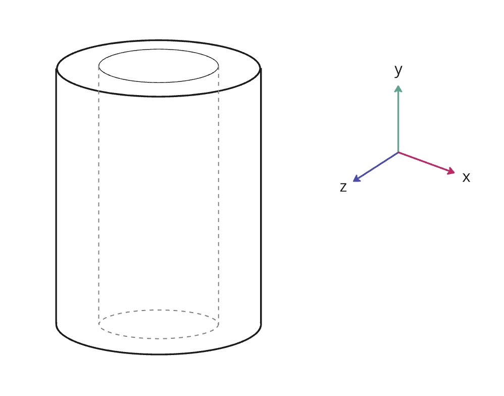
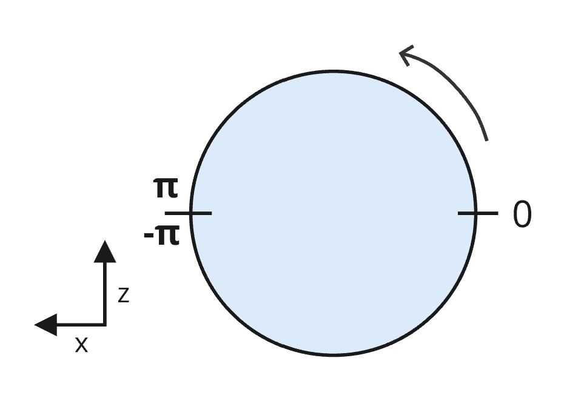
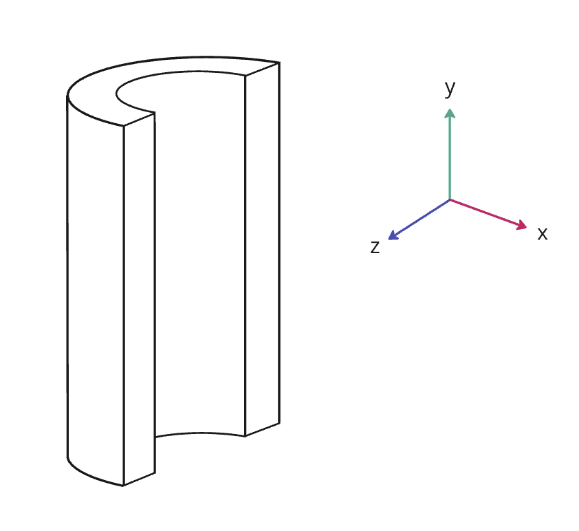

# EXT_implicit_cylinder_region

## Contributors

- Janine Liu, Cesium
- Sean Lilley, Cesium

## Status

Draft

## Dependencies

Written against the glTF 2.0 specification. Depends on the [`KHR_implicit_shapes`](https://github.com/eoineoineoin/glTF/tree/refs/heads/collisionShapeMerge/extensions/2.0/Khronos/KHR_implicit_shapes) extension.

## Overview

This extension defines a cylinder-conforming region as an additional shape type for the `KHR_implicit_shapes` extension. These regions are useful for visualizing real-world data that has been captured by cylindrical sensors.

`EXT_implicit_cylinder_region` extends the `shape` object in `KHR_implicit_shapes`. The `shape.type` should be set to `"cylinder region"`. The properties define a region following the surface of a cylinder between two different radius values.

The cylinder does not need to be completely represented by the volume—for instance, the region may be hollow inside like a tube. However, an inner radius of `0` results in a completely solid cylinder.

### Details

The cylinder is centered at the origin, where the radius is measured along the `x` and `z` axes. The `height` of the cylinder is aligned with the `y` axis.

<table>
  <tr>
    <th>
    Example
    </th>
  </tr>
  <tr>
    <td>

```json
"extensions": [
  {
    "KHR_implicit_shapes": {
      "shapes": [
        {
          "type": "cylinder region",
          "extensions": {
            "EXT_implicit_cylinder_region": {
              "minRadius": 0.5,
              "maxRadius": 1,
              "height": 2
            }
          }
        }
      ]
    }
  }
]
```

  </td>
    <td>
    
    </td>
  </tr>
</table>

A cylinder region may also be confined to a certain angular range. The `minAngle` and `maxAngle` properties define the angles at which the region starts and stops on the cylinder.

Angles are given in radians within the range `[-pi, pi]` and open counter-clockwise around the cylinder. The bounds are aligned such that an angle of `0` aligns with the glTF right axis, i.e., the `-x` axis (see figure below.)



<table>
  <tr>
    <th>
    Example
    </th>
  </tr>
  <tr>
    <td>

```json
"extensions": [
  {
    "KHR_implicit_shapes": {
      "shapes": [
        {
          "type": "cylinder region",
          "extensions": {
            "EXT_implicit_cylinder_region": {
              "minRadius": 0.5,
              "maxRadius": 1,
              "height": 2,
              "minAngle": -1.570796,
              "maxAngle": 1.570796
            }
          }
        }
      ]
    }
  }
]
```
</td>
    <td>
    
    </td>
  </tr>
</table>

## Optional vs. Required
This extension is required, meaning it should be placed in both the `extensionsUsed` list and `extensionsRequired` list.
