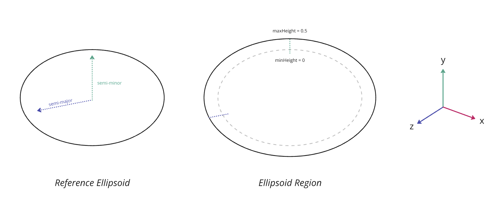
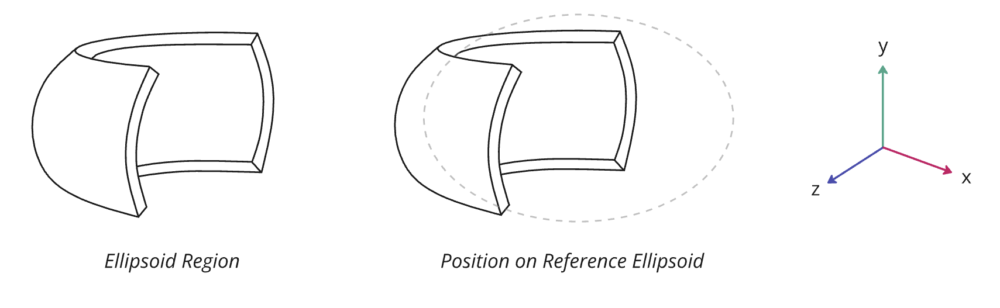

# EXT_implicit_ellipsoid_region

## Contributors

- Janine Liu, Cesium
- Sean Lilley, Cesium

## Status

Draft

## Dependencies

Written against the glTF 2.0 specification. Depends on the [`KHR_implicit_shapes`](https://github.com/eoineoineoin/glTF/tree/refs/heads/collisionShapeMerge/extensions/2.0/Khronos/KHR_implicit_shapes) extension.

## Overview

This extension defines an ellipsoid-conforming region as an additional shape type for the `KHR_implicit_shapes` extension. These regions are commonly used in geospatial applications to describe volumes that conform to the curvature of the Earth, or other bodies.

`EXT_implicit_ellipsoid_region` extends the `shape` object in `KHR_implicit_shapes`. The `shape.type` should be set to `"ellipsoid region"`. The properties define the region following the surface of the ellipsoid between two different height values.

The volume does not necessarily contain the full ellipsoid—and for many geospatial use cases, it will not. Rather, the ellipsoid is used as a reference from which the actual region is extruded. However, a region may be extend beneath the surface of the ellipsoid. Given the right height values, the region could contain the entire ellipsoid if desired.

### Details

The reference ellipsoid is centered at the origin. The `semiMajorAxisRadius` indicates the radius of the ellipsoid in meters along the `x` and `z` axes. The `semiMinorAxisRadius` indicates the radius of the ellipsoid in meters along the `y` axis.

> The `x` and `z` radii are made equal to simplify the math required to render implicit regions along the ellipsoid.

The `minHeight` and `maxHeight` properties indicate the heights of the region from the ellipsoid's surface in meters. A height of `0` sits right at the surface. Negative heights are also valid—they simply extend underneath the ellipsoid's surface.

This example corresponds to the image below it:

```json
"extensions": [
  {
    "KHR_implicit_shapes": {
      "shapes": [
        {
          "type": "ellipsoid region",
          "extensions": {
            "EXT_implicit_ellipsoid_region": {
              "semiMajorAxisRadius": 3.5,
              "semiMinorAxisRadius": 2,
              "minHeight": 0,
              "maxHeight": 0.5
            }
          }
        }
      ]
    }
  }
]
```



An ellipsoid region may also be confined to a specific latitude and/or longitude range. The `minLatitude` and `maxLatitude` properties represent the latitude values at which the region starts and stops, defined in the range `[-pi/2, pi/2]`. Similarly, the `minLongitude` and `maxLongitude` properties represent the longitude bounds within the range `[-pi, pi]`.

```json
"extensions": [
  {
    "KHR_implicit_shapes": {
      "shapes": [
        {
          "type": "ellipsoid region",
          "extensions": {
            "EXT_implicit_ellipsoid_region": {
              "semiMajorAxisRadius": 3.5,
              "semiMinorAxisRadius": 2,
              "minHeight": 0,
              "maxHeight": 0.5,
              "minLongitude": 0,
              "maxLongitude": 1.57079632679,
              "minLatitude": -0.78539816339,
              "maxLatitude": 0.78539816339,
            }
          }
        }
      ]
    }
  }
]
```



It is valid for the `maxLongitude` property to be less than `minLongitude`. This would define a region that crosses over the line at `-pi` or `pi`, equivalent to the International Date Line on Earth.

## Optional vs. Required
This extension is required, meaning it should be placed in both the `extensionsUsed` list and `extensionsRequired` list.
