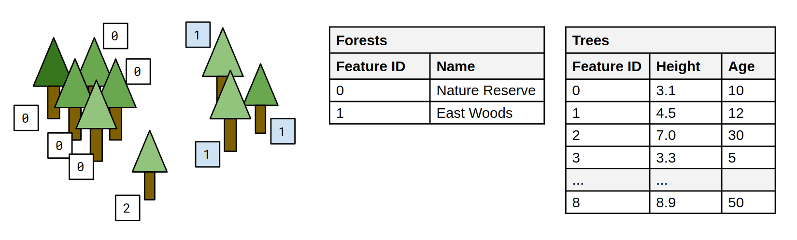

# EXT_instance_features

## Contributors

* Peter Gagliardi, Cesium
* Sean Lilley, Cesium
* Sam Suhag, Cesium
* Don McCurdy, Independent
* Marco Hutter, Cesium
* Bao Tran, Cesium
* Samuel Vargas, Cesium
* Patrick Cozzi, Cesium

## Status

Draft

## Dependencies

Written against the glTF 2.0 specification. Depends on the [`EXT_mesh_gpu_instancing`](../EXT_mesh_gpu_instancing) extension. Each node that is extended with `EXT_instance_features` must also define an `EXT_mesh_gpu_instancing` extension object, and is invalid without this dependency.

## Optional vs. Required

This extension is optional, meaning it should be placed in the `extensionsUsed` list, but not in the `extensionsRequired` list.

## Overview

In most realtime 3D contexts, performance requirements demand minimizing the number of nodes and meshes in an asset. These requirements compete with interactivity, as applications may wish to merge static objects while still supporting interaction or inspection on those objects. A common performance optimizations is GPU instancing, using the `EXT_mesh_gpu_instancing` extension. But this does not allow uniquely identifying the instances that are created during rendering. 

This extension defines a means of associating GPU instances that are created using the `EXT_mesh_gpu_instancing` extension with unique identifiers. These allow identifying the GPU instances as individual _features_, and are therefore referred to as _feature IDs_. These feature IDs are similar to the concept that is introduced in the [`EXT_mesh_features`](../EXT_mesh_features) extension. But instead of defining the feature IDs based on vertex attributes, the feature IDs are here defined using instance attributes. 

### Feature ID by GPU Instance

*Defined in [node.EXT_instance_features.schema.json](./schema/node.EXT_instance_features.schema.json).*

Feature IDs may be assigned to individual GPU instances using an instance attribute, or generated implicitly by instance index.

When the feature ID definition does not refer to an instance attribute, then the feature IDs that are assigned to the instances are equal to their index, in the range `[0, count)`, where `count` is the `count` of the instance attribute accessors. When the feature ID definition refers to an instance attribute, then this attribute contains `count` feature ID values. Note that these values do not necessarily have to be distinct; this makes it possible to define _groups_ of instances that share the same identifier.

> **Example:** A node defining instances of mesh `0`, with each instance having a feature ID in the `_FEATURE_ID_0` instance attribute.
>
> ```jsonc
> {
>   "nodes": [
>     {
>       "mesh": 0,
>       "extensions": {
>         "EXT_mesh_gpu_instancing": {
>           "attributes": {
>             "TRANSLATION": 0,
>             "ROTATION": 1,
>             "SCALE": 2,
>             "_FEATURE_ID_0": 3
>           },
>         },
>         "EXT_instance_features": {
>           "featureIds": [{
>             "featureCount": 10,
>             "attribute": 0
>           }]
>         }
>       }
>     }
>   ]
> }
> ```

A feature ID set may also include the following properties:

* `nullFeatureId`: a value that indicates that a certain instance is not considered to be an identifiable object
* `label`: an alphanumeric string used to identify feature ID sets across different glTF nodes
* `propertyTable`: the index of a property table in the [`EXT_structural_metadata`](../EXT_structural_metadata/) extension

> **Example:** A more complex example with two feature ID sets. The first feature ID set groups instanced trees into forests. The tree with feature ID `2` matches the `nullFeatureId` and therefore does not belong to a forest feature. The second feature ID set (feature ID values not shown) is defined implicitly based on instance index, and identifies individual trees. Each feature ID set refers to a property table that contains metadata about the features.
>
> 
>
> ```jsonc
> {
>   "nodes": [
>     {
>       "mesh": 0,
>       "extensions": {
>         "EXT_mesh_gpu_instancing": {
>           "attributes": {
>             "TRANSLATION": 0,
>             "ROTATION": 1,
>             "SCALE": 2,
>             "_FEATURE_ID_0": 3
>           },
>         },
>         "EXT_instance_features": {
>           "featureIds": [
>             {
>               "nullFeatureId": 2,
>               "featureCount": 2,
>               "attribute": 0,
>               "propertyTable": 0,
>               "label": "Forests"
>             },
>             {
>               "featureCount": 9,
>               "propertyTable": 1,
>               "label": "Trees"
>             }
>           ]
>         }
>       }
>     }
>   ]
> }
> ```

## Schema

* [node.EXT_instance_features.schema.json](./schema/node.EXT_instance_features.schema.json)

## Revision History

This extension was originally part of the `EXT_mesh_features` extension. The revision history of this extension can be found in the [common revision history of the 3D Tiles Next extensions](https://github.com/CesiumGS/3d-tiles/blob/main/next/REVISION_HISTORY.md).

