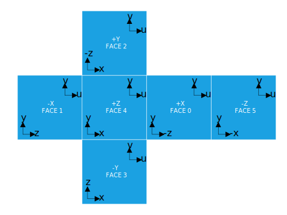

# EXT_lights_image_based

## Contributors

* Gary Hsu, Microsoft, <mailto:garyhsu@microsoft.com>
* Mike Bond, Adobe, <mailto:mbond@adobe.com>

## Status

Multi-Vendor - Currently supported by Microsoft's Babylon.js and Adobe's Dimension CC 2.0 exporter.

## Dependencies

Written against the glTF 2.0 spec.

## Overview

This extension provides the ability to define image-based lights in a glTF scene. Image-based lights consist of an environment map that represents specular radiance for the scene as well as irradiance information.

Many 3D tools and engines support image-based global illumination but the exact technique and data formats employed vary. Using this extension, tools can export and engines can import image-based lights and the result should be highly consistent. 

This extension specifies exactly one way to format and reference the environment map to be used. The goals of this are two-fold. First, it makes implementing support for this extension easier. Secondly, it ensures that rendering of the image-based lighting is consistent across runtimes.

A conforming implementation of this extension must be able to load the image-based environment data and render the PBR materials using this lighting.

## Defining an Image-Based Light

The EXT_lights_image_based extension defines an array of image-based lights at the root of the glTF and then each scene can reference one. Each image-based light definition consists of a single cubemap that describes the specular radiance of the scene, the l=2 spherical harmonics coefficients for diffuse irradiance and rotation and intensity values.

```javascript
"extensions": {
    "EXT_lights_image_based" : {
        "lights": [
            {
                "intensity": 1.0,
                "rotation": [0, 0, 0, 1],
                "irradianceCoefficients": [...3 x 9 array of floats...],
                "specularImageSize": 256,
                "specularImages": [
                    [... 6 cube faces for mip 0 ...],
                    [... 6 cube faces for mip 1 ...],
                    ...
                    [... 6 cube faces for mip n ...]
                ],
            }
        ]
    }
}
```

## Prefiltered Specular Radiance Cubemaps

The cubemap used for specular radiance is defined along with its prefiltered mipmaps with each face of the cube defined as separate images. The images must all be square, have power-of-two dimensions and conform to the usual requirements for mip images. That is, each mip level below the source image will correspond to halving the width and height resolution. The various mip levels evenly map to roughness values from 0 to 1 in the PBR material and should be generated with a principled multi-scatter GGX normal distribution. The data in the maps represents illuminance in lux (lm/m^2).

The entire mip chain of images should not be provided. Instead, the lowest-resolution mip should have sufficient size to represent the maximally-blurred radiance map (say, 16x16) corresponding to roughness=1. The `specularImageSize` value defines the largest dimension of mip 0 and, taken together with the number of defined mips, should give the loading runtime the information it needs to generate the remainder of the mip chain and sample the appropriate mip level in the shader.

Cube faces are defined in the following order and adhere to the standard orientations as shown in the image bellow.
1. Positive X
1. Negative X
1. Positive Y
1. Negative Y
1. Positive Z
1. Negative Z

<figure>

<figcaption><em>Cube map orientation reference.<br>Image by <a href="//commons.wikimedia.org/w/index.php?title=User:Microwerx&amp;action=edit&amp;redlink=1" class="new" title="User:Microwerx (page does not exist)">Microwerx</a> - <span class="int-own-work" lang="en">Own work</span>, <a href="https://creativecommons.org/licenses/by-sa/4.0" title="Creative Commons Attribution-Share Alike 4.0">CC BY-SA 4.0</a>, <a href="https://commons.wikimedia.org/w/index.php?curid=48935423">Link</a></em></figcaption>
</figure>

Note that for this extension, each saved image must be flipped about its vertical axis to correspond with the way <a href="https://www.khronos.org/registry/glTF/specs/2.0/glTF-2.0.html#images">glTF references texture space</a>.

https://en.wikipedia.org/wiki/Cube_mapping


## Irradiance Coefficients

This extension uses spherical harmonic coefficients to define irradiance used for diffuse lighting. Coefficients are calculated for the first 3 SH bands (l=2) and take the form of a 9x3 array.
[Realtime Image Based Lighting using Spherical Harmonics](https://metashapes.com/blog/realtime-image-based-lighting-using-spherical-harmonics/)
[An Efficient Representation for Irradiance Environment Maps](http://graphics.stanford.edu/papers/envmap/)

## HDR Images

This extension also provides a way to reference HDR data which, up to this point, has not been possible within glTF. The individual images referenced by this extension can either be:
1. JPEG's - assumed to be regular, LDR, RGB images
2. PNG's - assumed to be HDR images packed in RGBD format.

### RGBD
RGBD is a way to pack HDR data so that the alpha channel contains a value that, when the RGB channels are divided by it, can produce values greater than 1. Runtimes can choose to unpack this data to float textures at load time (recommended) or keep it packed on the GPU (and unpack in the shader) to save memory.

RGBD has several advantages over similar packing schemes like RGBM and RGBE.

1. Simple to pack and unpack. Cheaper than RGBE.
2. Provides better range than RGBM.
3. Interpolates better than RGBE. Important if the data is kept packed during rendering and filtering is used. Note that the interpolation isn't perfect so visual artifacts may still appear. This is why unpacking to float at load-time is recommended.
4. Packed PNG doesn't appear as garbled as a one packed with RGBE.

If the referenced image is a 4-channel PNG (i.e. with transparency), it will be assumed to contain RGBD data. If the image is only 3 channels, it will be assumed to contain LDR lighting data.

### Future HDR Image Support
This extension expects 4-channel PNG's to contain RGBD data. However, this should not interfere in any future glTF extensions that provide HDR support. e.g. if there is an extension that defines RGBE packing for PNG's that is in use for the texture/image, that should override the assumed RGBD packing. Support for other HDR file types (e.g. CTTF formats or .hdr/.exr files) should not interfere either as they won't be PNG's.

## Adding Light Instances to Scenes

Each scene can have a single IBL light attached to it by defining the `extensions.EXT_lights_image_based` property and, within that, an index into the `lights` array using the `light` property.

```javascript
"scenes" : [
    {
        "extensions" : {
            "EXT_lights_image_based" : {
                "light" : 0
            }
        }
    }
]
```

### Image-Based Light Properties

| Property | Description | Required |
|:-----------------------|:------------------------------------------| :--------------------------|
| `name` | Name of the light. | No |
| `rotation` | Quaternion that represents the rotation of the IBL environment. | No, Default: `[0.0, 0.0, 0.0, 1.0]` |
| `intensity` | Brightness multiplier for environment. | No, Default: `1.0` |
| `irradianceCoefficients` | Declares spherical harmonic coefficients for irradiance up to l=2. This is a 9x3 array. | :white_check_mark: Yes |
| `specularImages` | Declares an array of the first N mips of the prefiltered cubemap. Each mip is, in turn, defined with an array of 6 images, one for each cube face. i.e. this is an Nx6 array. | :white_check_mark: Yes |
| `specularImageSize` | The dimension (in pixels) of the first specular mip. This is needed to determine, pre-load, the total number of mips needed. | :white_check_mark: Yes |

## License

Adobe and Microsoft have made this Specification available under the Open Web Foundation Agreement Version 1.0, which is available at https://www.openwebfoundation.org/the-agreements/the-owf-1-0-agreements-granted-claims/owfa-1-0.
