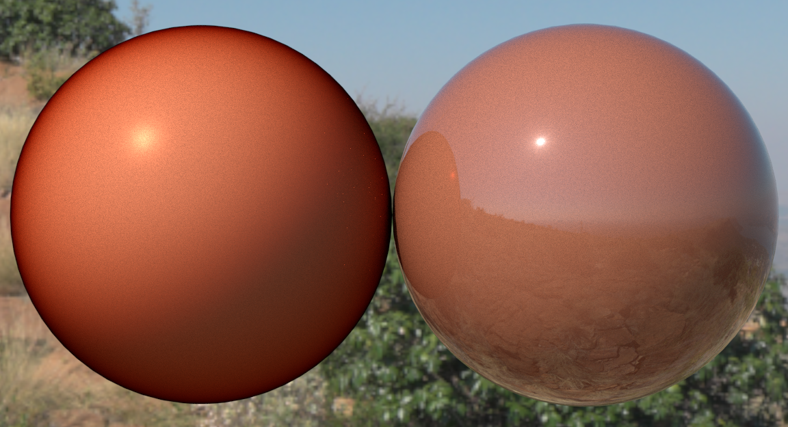

# EXT\_materials\_clearcoat\_color

## Contributors

* Gary Hsu, Microsoft [@bghgary](https://twitter.com/bghgary)
* Mike Bond, Adobe, [@miibond](https://github.com/MiiBond)

## Status

Complete

## Dependencies

Written against the glTF 2.0 spec.
* Requires the `KHR_materials_clearcoat` extension to also be defined on the material

## Exclusions

* This extension must not be used on a material that also uses `KHR_materials_pbrSpecularGlossiness`.
* This extension must not be used on a material that also uses `KHR_materials_unlit`.

## Overview

This extension defines a way to add colored absorption to the clear coating provided by the `KHR_materials_clearcoat` extension. This allows materials to simulate the appearance of colored varnishes or lacquers.

## Extending Materials

Adding absorption to clearcoat materials can be done by adding the `EXT_materials_clearcoat_color` extension as a sub-extension of `KHR_materials_clearcoat` on a glTF material.  For example, the following defines a material with a dark red varnish.

```json
{
    "materials": [
        {
            "name": "varnish",
            "extensions": {
                "KHR_materials_clearcoat": {
                    "clearcoatFactor": 1.0,
                    "extensions": {
                        "EXT_materials_clearcoat_color": {
                            "clearcoatColorFactor": [
                                0.4,
                                0.1,
                                0.1
                            ]
                        }
                    }
                }
            }
        }
    ]
}
```

### Clearcoat Color Parameters

All implementations should use the same calculations for the input parameters. Implementations of the BRDF itself can vary based on device performance and resource constraints. See [Appendix B](https://registry.khronos.org/glTF/specs/2.0/glTF-2.0.html#appendix-b-brdf-implementation) for more details on the BRDF calculations.

As with the core glTF 2.0 spec, all coloured textures are assumed to be sRGB and all coloured factors are assumed to be linear.

|                                  | Type                                                                            | Description                            | Required             |
|----------------------------------|---------------------------------------------------------------------------------|----------------------------------------|----------------------|
|**clearcoatColorFactor**    | `number[3]`                                                                                       | The clearcoat's colour factor.  | No, default: `[1.0, 1.0, 1.0]`   |
|**clearcoatColorTexture**   | [`textureInfo`](https://registry.khronos.org/glTF/specs/2.0/glTF-2.0.html#reference-textureinfo)  | The clearcoat layer's color texture.  | No                               |

As with other factor/texture combinations, these two values are multiplied before being used in calculations. If not defined, the defaults represent a white transmission color and, therefore, no absorption.
```
clearcoat_transmission_color = clearcoatColorFactor * clearcoatColorTexture
```

## Physical Interpretation

The clearcoat is a thin, dielectric layer that specularly-transmits light through it but, by default, doesn't absorb light. This extension allows us to specify the observed color tint of light passing through the coating from the underlying layer. The `clearcoat_transmission_color` represents the **square of transmittance of the coating**. This is because the observed color tint of the underlying material results after light has passed through the coating twice (in incoming and outgoing directions), making the final color more easily artist-directable.

### View-Dependent Absorption

Light rays travel different distances through the clearcoat layer depending on the angle of incidence. At grazing angles (when viewing the surface nearly edge-on), light travels a longer distance through the clearcoat medium, resulting in stronger absorption and more pronounced color saturation. Conversely, at normal incidence (when viewing the surface straight-on), light travels the shortest path through the clearcoat, producing less absorption. The `clearcoat_transmission_color` represents the color observed at normal incidence.

Note that this view-dependent absorption is more pronouced when the ratio of IOR between the coating and surounding medium (usually air) is low. This is because, at higher IOR's, light impacting the coating at grazing angles gets refracted into the coating more strongly, shortening the path length through the coat and decreasing the absorption.

<figure>

<figcaption><em>Clearcoat IOR = 1.0 on the left and clearcoat IOR = 1.8 on the right.</em>
</figcaption>
</figure>

## Implementation

*This section is non-normative.*

This extension modifies the formula for `f_clearcoat` (as defined in [KHR_materials_clearcoat](/extensions/2.0/Khronos/KHR_materials_clearcoat/README.md)). The `(f_emissive + f_diffuse + f_specular)` term is simply multiplied by the final clearcoat transmission of all light coming from the layer below, weighted by the `clearcoatFactor`.

```
clearcoatBlendFactor = clearcoatTexture.r * clearcoatFactor
clearcoatFresnel = fresnel(0.04, NdotV)

color = mix(vec3(1.0), f_coat_transmission, clearcoatBlendFactor) * (f_emissive + f_diffuse + f_specular) * (1.0 - clearcoatBlendFactor * clearcoatFresnel) +
        f_clearcoat * clearcoatBlendFactor
```

### View-Dependent Absorption approximation

At normal incidence, `f_coat_transmission` is simply the `clearcoat_transmission_color`. However, we need to modify this based on the incident angle.

```

// cos_i is the non-negative cosine of the unrefracted view angle
sin2_i = 1.0f - cos_i * cos_i 

// eta is the ratio of IOR's of the coat and surrounding medium. i.e. coat_ior / 1.0 for air.
sin2_t = sin2_i / (eta * eta)

// Total internal reflection. i.e. no light makes it out of coating.
if (sin2_t >= 1.0)
{
    f_coat_transmission = vec3(0.0f)
}

// Compute cosine of transmition angle.
cos_t = sqrt(1.0f - sin2_t);

// Calculate the path length through the coating, relative to normal incidence.
path_length = 1.0 / cos_t;

// Use the path length to calculate the final tinting.
f_coat_transmission = pow(clearcoat_transmission_color, path_length)
```

## Schema

- [material.EXT_materials_clearcoat_color.schema.json](schema/material.EXT_materials_clearcoat_color.schema.json)
 