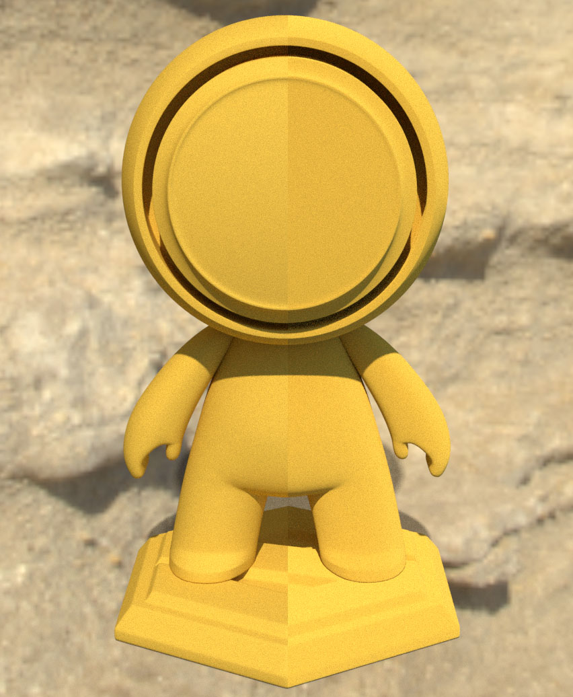
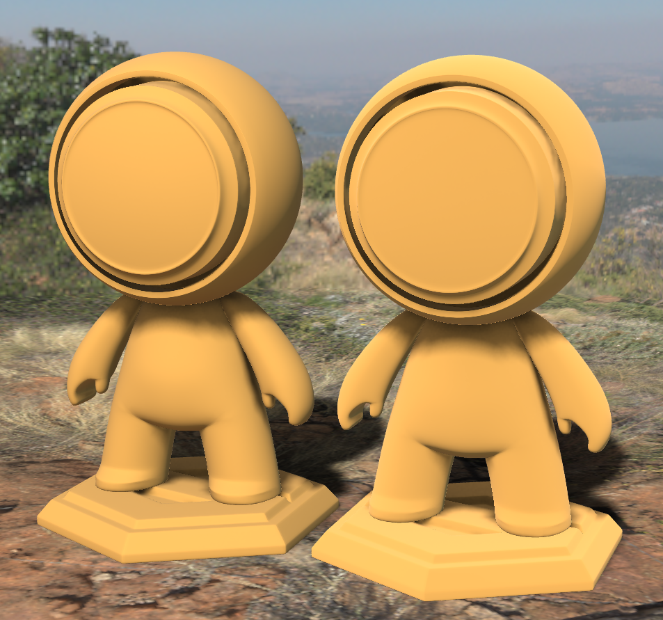

# EXT\_materials\_diffuse\_roughness

## Contributors

* Gary Hsu, Microsoft, <mailto:garyhsu@microsoft.com>
* Mike Bond, Adobe, <mailto:mbond@adobe.com>

## Status

Draft.

## Dependencies

Written against the glTF 2.0 spec.

## Exclusions

* This extension must not be used on a material that also uses `KHR_materials_pbrSpecularGlossiness`.
* This extension must not be used on a material that also uses `KHR_materials_unlit`.

## Side Effects

* The `EXT_materials_diffuse_roughness` extension also affects the [KHR_materials_diffuse_transmission](https://github.com/KhronosGroup/glTF/blob/main/extensions/2.0/Khronos/KHR_materials_diffuse_transmission/README.md) extension as it relies on the diffuse lobe which is modified by this extension.

## Overview

This extension defines a way to control the roughness of the diffuse surface, separate from the specular roughness. Specifically, this extension models the diffuse substrate using microfacets, similar to the specular lobe. The diffuse BRDF [defined in the glTF spec](https://registry.khronos.org/glTF/specs/2.0/glTF-2.0.html#dielectrics) will now depend on an additional roughness parameter which controls the spread of angles of the microfacets. Higher roughnesses result in the "flattening" effect of the lighting which is often observed in real rough diffuse surfaces such as sandstone.
<figure>

<figcaption><em>The right half appears more rough than the purely Lambertian surface on the left.</em></figcaption>
</figure>

## Extending Materials

Adding diffuse roughness can be done by adding the `EXT_materials_diffuse_roughness` extension to any glTF material.  For example, the following defines a material with a diffuse roughness of 1.0 while maintaining a specular roughness of 0.5.

```json
{
    "materials": [
        {
            "name": "rock",
            "pbrMetallicRoughness": {
                "roughnessFactor": 0.5
            }
            "extensions": {
                "EXT_materials_diffuse_roughness": {
                    "diffuseRoughnessFactor": 1.0
                },
                
            }
        }
    ]
}
```

## Properties

|                                  | Type                                                                            | Description                            | Required             |
|----------------------------------|---------------------------------------------------------------------------------|----------------------------------------|----------------------|
|**diffuseRoughnessFactor** | `number` | The diffuse roughness factor. | No, default: `0.0` |
|**diffuseRoughnessTexture** | [`textureInfo`](/specification/2.0/README.md#reference-textureInfo) | The diffuse roughness texture to be multiplied by the factor. Stored in the R channel. | No |

## Physical Interpretation and BRDF

The `EXT_materials_diffuse_roughness` extension treats the surface as having V-shaped cavities which add geometric masking, shadowing and interreflections and causes the surface brightness to change based on view direction. The microscopic facets are themselves assumed to be Lambertian and the spread of facet angles are assumed to follow a normal distribution. The roughness value is a measure of the standard deviation of the facet angles. At low roughness, most facets are perpendicular to the surface normal. At high roughness, the spread of facet angles increases, resulting in more shadowing and interreflections. The maximum roughness of 1.0 corresponds to a standard deviation of PI/2 (i.e. 90 degree facet angle). Angles are assumed to be clamped in the (-PI/2, PI/2) range.

The overall effect of a rough diffuse surface is to brighten the surface when the view and light directions align and darken the surface when they're perpendicular (relative to the Lambertian model). This can be thought of as essentially a rough surface's greater tendency towards back-scattering at grazing angles.

The default diffuse BRDF of glTF defines a purely Lambertian surface where lighting does not change based on viewing direction. This specification extends the diffuse model to depend on the new roughness parameter as well as view direction. All implementations should use the same calculations for the BRDF inputs. Implementations of the BRDF itself can vary based on device performance and resource constraints. There is no single micro-facet model that we can use as a ground truth reference for this physical phenomenon.

## Implementation (Informative)

There are several models out there for simulating diffuse roughness via micro-facets, including the widely-used Disney diffuse (Burley) model from the [2012 Disney PBR paper](https://media.disneyanimation.com/uploads/production/publication_asset/48/asset/s2012_pbs_disney_brdf_notes_v3.pdf) and the Oren-Nayer model from 1994.

[OpenPBR](https://academysoftwarefoundation.github.io/OpenPBR/#model/basesubstrate/glossy-diffuse) uses a new model for diffuse roughness that is an [Energy-conserving version of Oren-Nayar](https://arxiv.org/abs/2410.18026) and was developed specifically to be efficient and energy-conserving. Both the Burley and regular Oren-Nayar diffuse models tend to lose or gain energy, making the surface appear darker or brighter than it should.

#### Guidance for Real-time IBL
Naturally, using a model of diffuse reflectance that varies based on view and lighting direction causes complications for traditional, pre-filtered image-based lighting commonly used in realtime rasterizers. Here are just a few possible solutions to try:
1. Calculate IBL filtering each frame using CDF (cummulative distribution function) tables. This allows efficient sampling of the most important locations in the IBL and gives direct access to the light direction to be used in the diffuse BRDF.
1. Store an average light direction with an IBL to be used in the diffuse lighting BRDF. This direction can be generated during prefiltering.
1. Bend the surface normal toward the view direction based on the roughness of the surface. This has the effect of flattening out the diffuse lighting, appearing to increase the back-scattering of the diffuse lighting where NdotV approaches 0. This is the least correct of these solutions but is also the most performant.

<figure>

<figcaption><em>An example of diffuse roughness with IBL in Babylon.js. The right model has diffuseRoughnessFactor set to 1.0 while the left is set to 0.0.</em></figcaption>
</figure>

## glTF Schema Updates

- [material.EXT_materials_diffuse_roughness.schema.json](schema/material.EXT_materials_diffuse_roughness.schema.json)

## Known Implmentations
- [Babylon.js](https://www.babylonjs.com/)