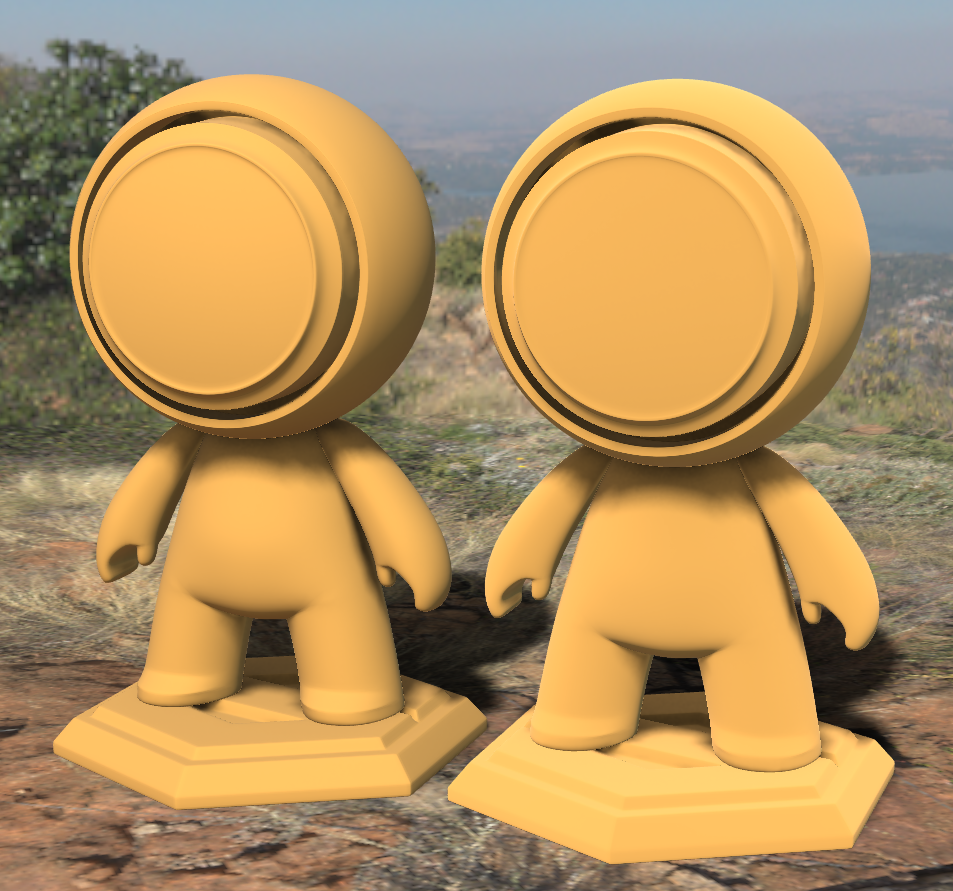

# EXT\_materials\_diffuse\_roughness

## Contributors

* Mike Bond, Adobe, [@miibond](https://github.com/miibond)

## Status

Draft.

## Dependencies

Written against the glTF 2.0 spec.

## Exclusions

* This extension must not be used on a material that also uses `KHR_materials_pbrSpecularGlossiness`.
* This extension must not be used on a material that also uses `KHR_materials_unlit`.

## Overview

This extension defines a way to control the roughness of the base diffuse surface, separate from the specular roughness. This is equivalent to the [OpenPBR specification for base_diffuse_roughness](https://academysoftwarefoundation.github.io/OpenPBR/#model/basesubstrate/glossy-diffuse). Specifically, this extension changes the diffuse BRDF [defined in the glTF spec](https://registry.khronos.org/glTF/specs/2.0/glTF-2.0.html#dielectrics) to depend on an additional roughness parameter. This models the "flattening" effect which is often observed in real rough diffuse surfaces such as sand stone.


The material on the right appears more rough than a simple Lambertian surface.

## Extending Materials

Adding diffuse roughness can be done by adding the `EXT_materials_diffuse_roughness` extension to any glTF material.  For example, the following defines a material with a diffuse roughness of 1.0 while maintaining a specular roughness of 0.5.

```json
{
    "materials": [
        {
            "name": "rock",
            "pbrMetallicRoughness": {
                "roughnessFactor": 0.5
            }
            "extensions": {
                "EXT_materials_diffuse_roughness": {
                    "diffuseRoughnessFactor": 1.0
                },
                
            }
        }
    ]
}
```

### Diffuse Roughness BRDF

The default diffuse BRDF of glTF defines a purely Lamertian surface and so brightness does not change based on viewing direction. The `EXT_materials_diffuse_roughness` extension treats the surface as having V-cavities which add geometric masking, shadowing and interreflections, which cause the brightness to change based on view direction. These microscopic facets are themselves assumed to be Lambertian but, at high roughness, the depth of the cavities is assumed to deepen. The overall effect is to brighten the surface when the view and light directions align and darken the surface when they're perpendicular (relative to a smooth Lambertian surface). This can be thought of as essentially a rough surface's greater tendency to respond to light retroreflectively.

All implementations should use the same calculations for the BRDF inputs. Implementations of the BRDF itself can vary based on device performance and resource constraints. See [Appendix B](/specification/2.0/README.md#appendix-b-brdf-implementation) for more details on the BRDF calculations.

|                                  | Type                                                                            | Description                            | Required             |
|----------------------------------|---------------------------------------------------------------------------------|----------------------------------------|----------------------|
|**diffuseRoughnessFactor**               | `number`                                                                        | The diffuse roughness factor.         | No, default: `1.0`   |
|**diffuseRoughnessTexture**              | [`textureInfo`](/specification/2.0/README.md#reference-textureInfo)             | The diffuse roughness texture to be multiplied by the factor. | No                   |


## Implementation (Informative)

There are several models out there for simulating diffuse roughness via micro-facets, including the widely-used Disney diffuse (Burley) model from the [2012 Disney PBR paper](https://media.disneyanimation.com/uploads/production/publication_asset/48/asset/s2012_pbs_disney_brdf_notes_v3.pdf).  This extension does not restrict an implementation to a specific algorithm. OpenPBR recommends using Energy-conserving Oren-Nayar (EON) which was developed specifically for OpenPBR to be energy-conserving. Both Burley diffuse and regular Oren-Nayar tend to lose energy, making the surface appear darker or brighter than it should.

### EON
Shader code. (just link?)

### With IBL
Naturally, having the appearance of diffuse reflectance vary based on view and lighting direction causes complications for traditional pre-filtered image-based lighting commonly used in realtime rasterizers. Here are just a few possible solutions to try:
1. Calculate IBL filtering each frame using CDF (cummulative distribution function) tables. This allows efficient sampling of the most important locations in the IBL and gives direct access to the light direction to be used in the diffuse BRDF.
1. Store an average light direction with an IBL to be used in the diffuse lighting BRDF. This direction can be generated during prefiltering.
1. Bend the surface normal toward the view direction based on the roughness of the surface. This has the effect of flattening out the diffuse lighting, appearing to increase the retro-reflectivity of the diffuse lighting. This is the least correct of these solutions but is also the most performant.

## Schema

- [glTF.EXT_materials_diffuse_roughness.schema.json](schema/glTF.EXT_materials_diffuse_roughness.schema.json)
 
